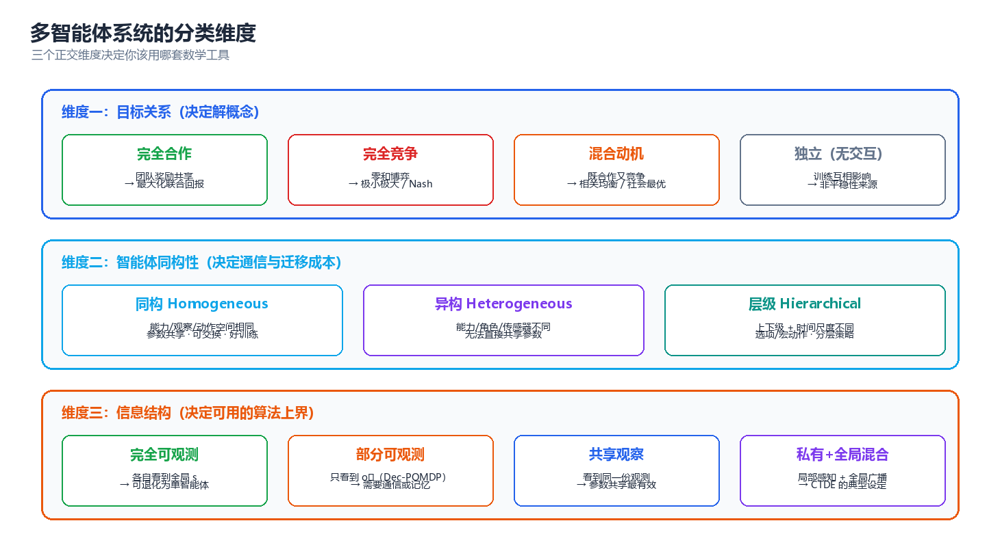

# 第 01 章 多智能体系统基础

> 单智能体问题的语言是 MDP，多智能体问题的语言是随机博弈（Stochastic Game）。本章只做一件事：把"一群共享同一个世界的决策者"翻译成一个能求解、能验证、能工程落地的数学对象——并在这个过程中指出**非平稳性、信用分配、可扩展性**这三道后续章节都无法绕开的坎。

---

## 一、多智能体问题的形式化

形式化决定了三件事：你能不能用现成算法、你的解有没有存在性保证、你的评测指标是否真的在度量你想度量的问题。本节从 MDP 出发，逐层补上"多主体"带来的结构变化。

### 1.1 从 MDP 到 Markov Game

单智能体的基本模型是马尔可夫决策过程（Markov Decision Process, MDP）：

$$
\mathcal{M} = \langle S,\ A,\ P,\ R,\ \gamma \rangle,\qquad
J(\pi) = \mathbb{E}\left[\sum_{t=0}^{\infty} \gamma^{t} R(s_t, a_t)\ \middle|\ a_t \sim \pi(\cdot\mid s_t)\right]
$$

其中 $P(s'\mid s,a)$ 为转移概率，$R(s,a)$ 为即时奖励，$\gamma\in[0,1)$ 为折扣因子。关键性质只有一条：**转移与奖励只依赖"我的动作"**，于是 $\pi$ 的优化是一个良定义的静态优化问题。

当决策者变为 $n$ 个，模型升级为**随机博弈 / Markov Game**（Littman, 1994）：

$$
\mathcal{G} = \left\langle n,\ S,\ \{A_i\}_{i=1}^{n},\ P,\ \{R_i\}_{i=1}^{n},\ \gamma \right\rangle
$$

其中联合动作 $\mathbf{a}=(a_1,\dots,a_n)\in\mathcal{A}=\prod_i A_i$ 是所有人选择的向量，转移 $P(s'\mid s,\mathbf{a})$ 与奖励 $R_i(s,\mathbf{a})$ **都依赖整个联合动作**；每个主体只能拿到局部观测量，策略因此写成 $\pi_i:\Omega_i\to\Delta(A_i)$，输入是动作–观测历史 $\tau_i=(o_i^0,a_i^0,\dots)$ 而非全局状态。值函数为：

$$
V_i^{\boldsymbol{\pi}}(s) = \sum_{\mathbf{a}}\left[\prod_{j=1}^{n}\pi_j(a_j\mid\tau_j)\right]\left[\, R_i(s,\mathbf{a}) + \gamma \sum_{s'} P(s'\mid s,\mathbf{a})\, V_i^{\boldsymbol{\pi}}(s') \right]
$$

注意这个表达式里出现的东西：**每个主体的值函数里都乘着所有人的策略**。这就是全部困难的代数根源——$V_i$ 的"环境"包含 $n-1$ 个正在被优化的函数。

```
        单智能体 MDP                                多智能体 Markov Game
   ┌────────────────────────┐              ┌──────────────────────────────────┐
   │   s_t ──▶  π  ──▶  a_t  │              │   s_t ──▶  π_i  ──▶  a_i,t       │
   │            │           │              │            │                     │
   └────────────┼───────────┘              └────────────┼─────────────────────┘
                ▼                                       ▼
       P(s'|s, a),  R(s,a)                  P(s'|s, a_1, …, a_n),  R_i(s, a)
       唯一受控对象                            没有任何主体能单独决定它
                │                                       │
                ▼                                       ▼
       策略梯度有目标函数                    π_{-i} 在变 ⇒ 我的"环境"在变（非平稳）
```

与 MDP 的逐项对照：

| 维度 | 单智能体 MDP | 多智能体 Markov Game | 带来的新问题 |
|------|-------------|---------------------|-------------|
| 动作 | $a \in A$ | $\mathbf{a} \in \prod_i A_i$ | 联合动作空间随 $n$ **指数增长** |
| 转移 | $P(s'\mid s,a)$ | $P(s'\mid s,\mathbf{a})$ | 我的动作效果被别人的选择调制 |
| 奖励 | $R(s,a)$ | $R_i(s,\mathbf{a})$ | 目标可能冲突 ⇒ 需要"解概念" |
| 观测 | 通常 $s$ 直接可见 | $o_i = O_i(s;\mathbf{a})$ | 部分可观测 ⇒ 理论保证大幅减弱 |
| 策略 | $\pi(a\mid s)$ | $\pi_i(a_i\mid \tau_i)$ | **策略互为对方的非平稳环境** |
| 值函数 | $V^{\pi}(s)$，唯一 | $V_i^{\boldsymbol{\pi}}(s)$，耦合 | 不动点从"一个方程"变成"一个方程组" |
| 最优性 | 存在唯一最优值 $V^*$ | 一般**不存在**单一最优策略 | "解"退化为均衡，且常常不唯一 |
| 收敛性 | 表格式必收敛 | 一般**无收敛保证** | 见 §3.1 与 §7.2 |

**规模代价有多大？** 状态与动作数量不变时，仅转移表一项的膨胀就是 $|A|^{n-1}$ 倍：

```python
# 联合转移表的规模: |S| × |A|^n × |S| 对 |S| × |A| × |S|
S, A = 16, 4
print(f"{'n':>3} | {'单智能体 MDP 转移表':>20} | {'多智能体联合转移表':>22} | {'膨胀倍数':>10}")
for n in (1, 2, 4, 8):
    mdp, mg = S * A * S, S * (A ** n) * S
    print(f"{n:>3} | {mdp:>20,} | {mg:>22,} | {A ** (n - 1):>9,}x")
# 预期输出:
#   n |         单智能体 MDP 转移表 |              多智能体联合转移表 |       膨胀倍数
#   1 |                1,024 |                  1,024 |         1x
#   2 |                1,024 |                  4,096 |         4x
#   4 |                1,024 |                 65,536 |        64x
#   8 |                1,024 |             16,777,216 |    16,384x
```

> **核心思想**：从 MDP 到 Markov Game 不是"加了一个下标 $i$"，而是把"转移与奖励由我决定"换成"转移与奖励由全体联合决定"。所有多智能体算法——CTDE、值分解、通信、机制设计——都是在为这一句抽象支付代价或索取补偿。

### 1.2 奖励结构分类：完全合作 / 零和 / 混合动机 / 一般和

奖励之间的**关系**决定了你手里有哪些理论工具。这是比"用什么算法"更早要回答的问题。

| 类型 | 英文 | 奖励关系 | 典型场景 | 可用的理论 | 章节 |
|------|------|---------|---------|-----------|------|
| 完全合作 | MMDP（Multi-agent MDP） | $R_1=\dots=R_n$ | 多机器人搬运、团队协作 RTS | 势博弈、值分解、IGM | 05 |
| 零和 | Zero-sum Game | $R_1=-R_2$（$n=2$） | 对抗博弈、围棋、网络安全 | 极小极大、CFR、自博弈 | 03、05 |
| 混合动机 | Mixed-motive | 既想合作又想占便宜 | 公共品、谈判、交通 | 相关均衡、机制设计、声誉 | 03、04 |
| 一般和 | General-sum | 任意 | 绝大多数真实系统 | 无一般性保证，只能特例化 | 03、05 |

**完全合作（MMDP）**：$R_1=\dots=R_n=R(s,\mathbf{a})$，目标是唯一的团队回报，但**信息仍然分布**——每个主体看不到全局状态，还要为"奖励记在谁头上"发愁（正是 §3.2）。合作型 MARL 的标准设定就是 MMDP 或 Dec-POMDP。

**零和**：$n=2$ 且 $R_1=-R_2$，没有共同利益可谈，唯一合理的解是**鞍点**。它的特殊价值在于极小极大定理给出**单值** $\max_{\pi_1}\min_{\pi_2}V=\min_{\pi_2}\max_{\pi_1}V$，"最优"重新变得良定义——这是自博弈在围棋、德州扑克上成功的理论前提；一旦不再严格零和，单值性立刻消失。

**混合动机与一般和**：个体理性与集体理性冲突（囚徒困境、公共品博弈、议价）。"解"本身不唯一（多重均衡），"高效解"也不稳定（可被单边偏离套利），只能靠机制设计改掉激励结构——见第 04 章。

对学习算法最常用的折中是**势博弈（Potential Game）**：

$$
\boxed{\ R_i(s,\mathbf{a}) - R_i\!\left(s,\left(a_{-i},\,a_i'\right)\right) = \Phi(s,\mathbf{a}) - \Phi\!\left(s,\left(a_{-i},\,a_i'\right)\right)\ \ \forall i,\, \forall a_i,a_i'\ }
$$

即"我改变动作带来的收益变化，等于全局势函数 $\Phi$ 的变化"。它的地位在于：**独立学习者的动力学等价于在势函数上做单智能体爬山**，"独立 Q-learning 在势博弈中收敛"这类结论才有立足点（第 05 章展开）。

| 奖励结构 | 是否存在"最优单值" | 独立学习能否收敛 | 推荐方法 |
|---------|------------------|----------------|---------|
| MMDP（含势结构） | 是（团队最优） | 可以（势博弈／单调博弈） | 值分解 QMIX、MAPPO |
| MMDP（一般合作） | 是，但均衡可能多个 | 不保证（可能落到次优均衡） | CTDE + 参数共享 |
| 零和 | 是（鞍点、唯一值） | 不保证（可用极小极大规避） | 自博弈、CFR、极小极大 Q |
| 混合动机 | 否 | 否 | 机制设计 + 均衡选择 |
| 一般和 | 否 | 否 | 特例化、近似、仿真评估 |

> ⚠️ 不要用"奖励是否共享"判断问题难度。**共享奖励**的团队问题依旧难（信用分配 + 非平稳性一个不少）；**对立奖励**的零和问题反而因单值性而更容易。

### 1.3 观察与信息结构

奖励结构管"想要什么"，信息结构管"知道什么"，后者往往更决定可行性。部分可观测的团队问题写作 **Dec-POMDP**（Decentralized Partially Observable MDP）：

$$
\mathcal{D} = \left\langle n,\ S,\ \{A_i\},\ P,\ \{R_i\},\ \{\Omega_i\},\ O,\ \gamma \right\rangle,\qquad o_i \sim O_i\!\left(\cdot \mid s,\ \mathbf{a}\right)
$$

与 Markov Game 的区别只在 $O$：主体 $i$ 只能拿到 $o_i$，策略必须写成 $\pi_i(a_i \mid \tau_i)$。Dec-POMDP 的复杂度是 NEXP-完全（即使 $n=2$ 也不行），所以实践中几乎总是"近似算法 + 通信 + 记忆"，而非精确求解。


*图：同一个博弈在四种观察设定下的差异——可观测性越差，理论保证越弱，越依赖通信与记忆。*

| 信息结构 | 形式化 | 主体看到什么 | 典型算法 | 理论保证 | 现实对应 |
|---------|--------|------------|---------|---------|---------|
| 全局可观测 | Markov Game | $s$ | 联合动作学习、IQL | 势博弈下可收敛 | 小型仿真、教学环境 |
| 共享观测 | MMDP | 同一份 $s$ 或同一份观测 | 参数共享 + 集中式 Critic | 可退化为单智能体问题 | 共享屏幕的协作游戏 |
| 局部可观测 | Dec-POMDP | 各自的 $o_i$ | MAPPO、QMIX、通信式 MARL | 无一般最优性保证 | 机器人、传感器网络 |
| 私有 + 公共 | Dec-POMDP + 公共信号 | $o_i$ + 广播的 $m$ | CTDE 全家族 | 仅部分场景有保证 | 拍卖、竞标、LLM 编排 |

**公共信息（public information）** 是四档里最被低估的一档：所有主体都能看到、且所有人都知道"所有人都能看到"的信号，即**公共知识（common knowledge）**。它等价于一个免费的相关装置——有了它，主体可以不通信就协调到同一个均衡（见 §4.1）。工程上一个公共随机种子、一个时间戳、一个全局 ID 都是免费的公共信号。

**信息结构不是客观事实，而是设计变量**：可以**加通信**（把私有的 $o_i$ 变成部分公共，第 06 章）、**加记忆**（用 RNN / Transformer 把 $\tau_i$ 压成充分统计量）、或**加共享上下文**（LLM 系统里那块人人可读写的黑板，第 08 章）。很多"算法调不动"的问题，真正原因是信息结构不完备。

> ⚠️ 最常见的建模事故：训练时把全局状态塞给每个主体，部署时拿不到，于是性能腰斩。CTDE 的合法性正好建立于此——**训练可以看全局，执行必须只看局部**，集中式 Critic 只在训练期存在。如果"集中式"信息在执行期还需要，那它不是 CTDE，而是中心化控制。

### 1.4 时序设定：同时行动 vs 顺序行动

最后一层形式化是**时间粒度**：一个"回合"里所有主体一起选动作，还是轮流选？这不是实现细节，它改变博弈本身。

**同时行动（Parallel API）**：所有主体基于各自的局部观测同时选动作，环境一次性推进，$a_{i,t}\perp a_{j,t}$（同期内不可见）。**顺序行动（Agent-Environment Cycle, AEC API）**：每步只有一个主体行动，环境立即更新，后续主体看到的是**已被改写过的状态**——这正是 PettingZoo 的 AEC 语义。

两者在博弈论上对应不同结构：同时行动给出**纳什型**解（互相为最佳回应），顺序行动给出 **Stackelberg 型**解（后动者直接最佳回应先动者）。因此"同一份收益矩阵"在两个 API 下可以有不同的均衡值：

```python
# 匹配硬币 (matching pennies): 匹配则行玩家 +1, 不匹配 -1 (零和)
import numpy as np

ACT = ["L", "R"]
def rp(a1, a2):
    return 1 if a1 == a2 else -1

# --- Parallel: 枚举混合策略网格求纳什均衡 ---
eq = []
for p in np.linspace(0, 1, 201):
    for q in np.linspace(0, 1, 201):
        uL = q * rp("L", "L") + (1 - q) * rp("L", "R")
        uR = q * rp("R", "L") + (1 - q) * rp("R", "R")
        vL = p * (-rp("L", "L")) + (1 - p) * (-rp("R", "L"))
        vR = p * (-rp("L", "R")) + (1 - p) * (-rp("R", "R"))
        r_ok = (abs(uL - uR) < 1e-9) or (uL > uR and p > 0.9999) or (uR > uL and p < 1e-4)
        c_ok = (abs(vL - vR) < 1e-9) or (vL > vR and q > 0.9999) or (vR > vL and q < 1e-4)
        if r_ok and c_ok:
            eq.append((p, q))
p, q = eq[0]
val = p * (q * rp("L", "L") + (1 - q) * rp("L", "R")) + (1 - p) * (q * rp("R", "L") + (1 - q) * rp("R", "R"))
print(f"[Parallel API] 同时行动: 混合纳什均衡 P_row(L)={p:.3f}, P_col(L)={q:.3f}, 行玩家均衡收益 = {val:+.3f}")
print(f"  网格上共找到 {len(eq)} 个均衡点 (唯一混合均衡, 无纯策略均衡)")

# --- AEC: 后动者观察到先动者的动作后最佳回应 ---
for first in (1, 2):
    if first == 1:
        a1, a2 = "L", "R"
        print(f"[AEC] 智能体1先动: {a1} -> 智能体2 观察后最佳回应 {a2} -> 智能体1 收益 {rp(a1, a2):+d}")
    else:
        a2 = "L"
        a1 = "L"
        print(f"[AEC] 智能体2先动: {a2} -> 智能体1 观察后最佳回应 {a1} -> 智能体1 收益 {rp(a1, a2):+d}")
print("信息价值 = |0.000 - (-1)| = 1.0: 行动顺序改变了博弈结构, 不只是实现细节")
# 预期输出:
# [Parallel API] 同时行动: 混合纳什均衡 P_row(L)=0.500, P_col(L)=0.500, 行玩家均衡收益 = +0.000
#   网格上共找到 1 个均衡点 (唯一混合均衡, 无纯策略均衡)
# [AEC] 智能体1先动: L -> 智能体2 观察后最佳回应 R -> 智能体1 收益 -1
# [AEC] 智能体2先动: L -> 智能体1 观察后最佳回应 L -> 智能体1 收益 +1
# 信息价值 = |0.000 - (-1)| = 1.0: 行动顺序改变了博弈结构, 不只是实现细节
```

同一份收益矩阵，同时行动下均衡值 0，顺序行动下先动者 −1、后动者 +1。**零和博弈里先动是劣势**（对手看穿了你的选择）；但在合作型团队任务里顺序行动通常是优势，因为它是一条免费的信息传递通道。

| 对比项 | Parallel API | AEC API |
|--------|-------------|---------|
| 一步的语义 | 全体同时选动作 | 单个主体行动，环境立即更新 |
| 博弈类型 | 纳什型 | Stackelberg 型 |
| 信息集 | 各主体的 $\tau_i$ | $\tau_i$ ∪ 本轮前序动作 |
| 时钟假设 | 要求同步时钟、等频决策 | 允许异步与不同频率 |
| 动态智能体集 | 需固定 $n$ | 天然支持主体加入/退出/死亡 |
| 典型实现 | PettingZoo `parallel_env`、SMAC | PettingZoo `env`、棋盘类环境 |
| 适用场景 | 连续控制、同频协作 | 回合制、层级、含"外部主体"的场景 |

> **核心思想**：选择 API 就是选择博弈类型。系统里存在响应延迟或层级决策时，AEC 更诚实；所有主体等频同步时，Parallel API 更简单更快。两者可以互相模拟，但**模拟会引入额外的信息结构假设**，必须显式写清。

---

## 二、分类的四个维度

形式化之后的第一步是**分类**：你要处理的是哪一类问题？分类的意义不在于贴标签，而在于迅速圈定可用方法与可用保证。



*图：目标关系、同构性、信息结构构成分类的三个基础维度，学习范式是叠加在其上的第四个选择。*

四个维度的分工：**目标关系**决定用哪个解概念（第 03/04 章）；**同构性**决定参数能否共享（第 02 章）；**信息结构**决定要不要通信（第 06 章）；**学习范式**决定训练时谁看谁的输入（第 05 章）。前三个是问题的属性，第四个是你的设计选择。

### 2.1 维度一：目标关系

| 目标关系 | 判据 | 冲突来源 | 有效度量 | 首选方法 |
|---------|------|---------|---------|---------|
| 完全合作 | 存在全局 $R$，且 $R_i = R$ | 无（但存在搭便车/信用分配） | 团队回报、成功率 | 值分解、MAPPO |
| 完全竞争 | $R_1 = -R_2$ | 零和，完全对立 | 对最优对手的胜率（Elo） | 自博弈、极小极大 |
| 混合动机 | 存在共同利益，也存在个体套利机会 | 个体最优与集体最优不一致 | 社会福利 + 个体收益分布 | 机制设计 + MARL |
| 一般和 | 无特殊结构 | 随场景而变 | 通常只能仿真统计 | 特例化、启发式 |

要区分两个容易混淆的概念：**目标函数是否相同**与**利益是否一致**。目标函数相同（$R_i=R$）**不代表没有冲突**——"我多出力"与"你多出力"互斥，这就是搭便车；目标函数对立（零和）**也不代表没有合作空间**——重复博弈中双方仍可用策略性合作换长期收益（"以牙还牙"有效的原因）。

> **核心思想**：目标关系不决定"能不能合作"，只决定"合作需不需要额外机制来维持"。完全合作需要的是**信用分配**，混合动机需要的是**激励相容**。

### 2.2 维度二：同构性（同构 / 异构 / 层级）

| 类型 | 判据 | 参数能否共享 | 建模要点 | 典型系统 |
|------|------|------------|---------|---------|
| 同构 | 所有主体观测空间、动作空间、能力相同 | 可以，且强烈推荐 | 共享参数 + 个体 ID/索引 | 无人机编队、同型号 AGV |
| 异构 | 观测/动作/能力不同 | 不能直接共享 | 用 $\langle$role, type$\rangle$ 条件化 | 无人车 + 无人机 + 地面站 |
| 层级 | 存在指挥–执行关系，时间尺度不同 | 分层各自共享 | 上层出意图/子目标，下层执行 | 战术指挥、LLM planner–worker |

**同构**最好处理：对称性使参数共享（parameter sharing）既能省 $n$ 倍参数，又能把 $n$ 条经验并成一条梯度信号，样本效率提升接近 $n$ 倍（§3.3 实测）。代价是某个主体能力退化（传感器失效）时，共享策略会一起退化。

**异构**的常用做法是引入**角色（role）/类型嵌入**：$\pi_i(a_i\mid\tau_i,z_i)$，$z_i$ 为角色向量——一套参数通过条件化产生多种行为，是"共享"与"独立"之间最实用的折中。角色可人工指定，也可自动学出（角色发现，第 05 章）。

**层级**的关键不是"谁指挥谁"，而是**时间尺度分离**：上层低频决策（"去 A 区取货"），下层高频执行（避障、走位）。数学上对应**选项（option）/半马尔可夫决策过程（SMDP）**，LLM 系统里对应"planner 出计划、worker 执行"（第 08 章）。最大风险是**意图翻译失真**：抽象目标在下层看来不可达或含义模糊，于是"上下层互相甩锅"。

### 2.3 维度三：信息结构

判定只有两个问题：**每个主体在决策时刻能看到什么？是否存在所有主体都能看到的公共信号？**

能看到全局状态 ⇒ 可直接用联合动作学习（Markov Game）；只能看到 $o_i$ ⇒ 必须用局部历史近似（Dec-POMDP，理论保证从 NEXP-完全退化为"仅近似"）。存在公共信号 ⇒ 可免费协调（相关均衡可达）；不存在 ⇒ 必须通信或依赖约定，否则协调概率随主体数指数下降；通信不可靠时，还得额外学"说什么"（第 06 章）。

实用建议：**把信息结构当成第一个优化变量**。很多"算法调不动"的问题，真正原因是信息结构不完备——加一条公共信号、加一段共享记忆，效果往往好过换算法。

### 2.4 维度四：学习范式

转移 $P$ 与奖励 $R$ 已知时，前三个维度就够了。一旦未知、必须靠交互学习，就多出第四个选择：**谁在训练时看得到谁的信息**。

| 范式 | 英文 | 训练时各自输入 | 执行时输入 | 参数量 | 样本效率 | 可扩展性 | 代表算法 |
|------|------|--------------|-----------|--------|---------|---------|---------|
| 独立学习 | Independent Learning (IL) | 自己的 $\tau_i$ | 自己的 $\tau_i$ | $n\times$ | 低（非平稳） | 好 | IQL、IPPO |
| 联合学习 | Joint Learning (JL) | 联合动作 $\mathbf{a}$、全局 $s$ | 需全局信息 ⇒ 常不可执行 | $1$（超动作空间） | 高（但空间爆炸） | 极差 | 联合 Q-learning |
| 集中训练分布执行 | CTDE | 全局 $s$（Critic）+ 局部 $\tau_i$（Actor） | 仅局部 $\tau_i$ | $n\times$（Actor 可共享） | 高 | 好 | MADDPG、QMIX、MAPPO |
| 种群 / 自博弈 | Population / Self-play | 对手池中的历史策略 | 局部 | 多份 | 高 | 中 | PSRO、League、AlphaStar |

> **核心思想**：IL → JL → CTDE → 种群，是从"最省事但最不稳"到"最能利用全局信息但最贵"的一条谱系。CTDE 之所以成为主流，是因为它把"训练期的全局信息"与"执行期的局部信息"解耦——**它买了 JL 的样本效率，却只付 IL 的执行代价**。

JL 的代价极其具体：超动作空间是 $|\mathcal{A}|=\prod_i|A_i|$，$n=10$、$|A_i|=4$ 时是 $4^{10}\approx1.05\times10^{6}$，$n=20$ 时已是 $1.1\times10^{12}$，所以 JL 只在 $n\le3$ 的教学环境里常见。

### 2.5 分类速查表

给定你的问题特征，直接查下表定位模型与章节：

| 你的问题特征 | 行为主体数 | 属于哪一类 | 该用第几章的方法 |
|-------------|-----------|-----------|----------------|
| 团队共享一个奖励，观测局部 | 2–10 | 合作 Dec-POMDP | 05（MAPPO / QMIX） |
| 团队共享一个奖励，观测全局 | 2–10 | MMDP | 05（值分解 / 参数共享） |
| 双方对抗、胜负严格互补 | 2 | 零和随机博弈 | 03（极小极大）、05（自博弈） |
| 有共同利益但要防套利 | 2–100 | 混合动机一般和博弈 | 04（机制设计、拍卖、声誉） |
| 需要协商分工、通信可靠 | 3–50 | 合作协调问题 | 07（合同网、DCOP、任务分配） |
| 有带宽限制、需学"说什么" | 2–20 | 通信式 Dec-POMDP | 06（CommNet、DIAL、IC3Net） |
| 强对手、需要鲁棒 | 2–种群 | 零和 / 一般和 + 对手建模 | 05（种群训练、PSRO） |
| 任务开放、需要常识与语言 | 2–∞ | LLM 智能体社会 | 08（编排、角色、校验节点） |
| 硬安全约束必须满足 | 任意 | 约束 MDP（CMDP） | 本章 §5.3、第 10 章 |
| 需要形式化保证 | 少量 | 时序逻辑规范 | 本章 §5.1–5.2 |

反向查表同样好用：**参数共享**要求同构性（否则异构主体被迫用同一策略）；**值分解（QMIX 类）**要求团队价值可分解且混合函数单调（否则分布式贪心执行不再最优）；**CTDE** 要求执行期能拿到 $\tau_i$、训练期能拿到 $s$（否则训练–执行不匹配，性能腰斩）；**独立学习**要求势博弈或单调结构（否则不收敛、陷入循环）；**模型检验**要求状态空间有限可枚举（否则组合爆炸）。

---

## 三、与单智能体的三大本质差别

这是本章的核心。多智能体不是"把单智能体复制 $n$ 份"：有三件事会从根上坏掉，且**每一件都需要专门的机制来对付**。

```
                共享环境 + 多个同时学习的决策者
                              │
        ┌─────────────────────┼─────────────────────┐
        ▼                     ▼                     ▼
   ① 非平稳性             ② 信用分配            ③ 可扩展性
  环境在学：P(s'|s,a)  团队奖励是共享的：   联合动作/观测/策略
  → P(s'|s,a,π_{-i})   R 该记在谁头上？     的空间指数增长
        │                     │                     │
        ▼                     ▼                     ▼
  收敛性保证失效         梯度信号无区分度       计算与参数不可承受
        │                     │                     ▼
        ▼                     ▼              参数共享 / 因子化 /
  对手建模、CTDE、      反事实基线、差奖励、   局部性 / 值分解 / 注意力
  种群训练、双时间尺度    Shapley 值分摊              │
        │                     │                     │
        └─────────────────────┴─────────────────────┘
                         第 05 章给出完整算法族
```

### 3.1 非平稳性：我的环境里住着另一些学习者

单智能体 RL 收敛性的全部依据是**环境静态**。多智能体里这个前提立刻失效：从主体 $i$ 的视角看，"环境"的转移实际是边际化掉对手动作后的转移：

$$
\boxed{\ P\left(s' \mid s, a_i\right)\ \longrightarrow\ P\left(s' \mid s, a_i;\, \pi_{-i}\right) \;=\; \sum_{a_{-i}} \pi_{-i}\!\left(a_{-i} \mid \tau_{-i}\right) \cdot P\!\left(s' \mid s, a_i, a_{-i}\right)\ }
$$

而 $\pi_{-i}$ **本身正在被优化**。于是：Bellman 目标变成**移动目标**，经验回放里的旧数据对应的"环境"已不存在，"收敛到不动点"这件事失去依据；主体的探索还会同时改变对手的分布。

**用最经典的例子证明它不收敛。** 石头剪刀布（Rock-Paper-Scissors, RPS）是唯一的对称零和博弈，唯一纳什均衡是均匀随机 $(\tfrac13,\tfrac13,\tfrac13)$，均衡值 0。现在让两个主体各跑一个标准 Q-learning（状态 = 对手上一步动作），看它们会不会收敛到这个均衡：

```python
import random

ACTS = ["R", "P", "S"]
BEATS = {"R": "S", "P": "R", "S": "P"}          # key 击败 value
def payoff(a, b):
    if a == b:
        return 0
    return 1 if BEATS[a] == b else -1

class QLearner:
    """Q-learning, 状态 = 对手上一步动作 (即 π(a_i | 对手动作))"""
    def __init__(self, alpha=0.1, gamma=0.9, eps=0.1, seed=0):
        self.Q = {s: {a: 0.0 for a in ACTS} for s in ACTS}
        self.alpha, self.gamma, self.eps = alpha, gamma, eps
        self.rng = random.Random(seed)
        self.last = self.rng.choice(ACTS)
    def act(self, explore=True):
        if explore and self.rng.random() < self.eps:
            return self.rng.choice(ACTS)
        return max(ACTS, key=lambda a: self.Q[self.last][a])
    def policy(self):
        return "|".join(max(ACTS, key=lambda a: self.Q[s][a]) for s in ACTS)
    def update(self, s, a, r, s_next):
        self.Q[s][a] += self.alpha * (r + self.gamma * max(self.Q[s_next].values()) - self.Q[s][a])

def step(A, B, explore):
    a, b = A.act(explore), B.act(explore)        # 同时出拳
    ra = payoff(a, b)
    A.update(A.last, a, ra, b)                   # 下一个"状态" = 对手本次动作
    B.update(B.last, b, -ra, a)
    A.last, B.last = b, a
    return (a, b)

def lag_match(log, lag):                         # 滞后 lag 步的联合动作匹配率
    n = len(log) - lag
    return sum(1 for i in range(n) if log[i] == log[i + lag]) / n

def min_period(seq, maxp=24):                    # 极限环最小周期
    for p in range(1, maxp + 1):
        if all(seq[i] == seq[i + p] for i in range(len(seq) - p)):
            return p
    return None

for seed in (0, 2):
    A, B = QLearner(seed=seed), QLearner(seed=seed + 100)
    for _ in range(20000):
        step(A, B, True)                         # 训练相
    print(f"--- seed={seed}: 训练 20000 步后 A 策略={A.policy()}  B 策略={B.policy()} ---")
    log = [step(A, B, True) for _ in range(3000)]      # 测量相: 保留探索
    print(f"  测量相 eps=0.1: h(1)={lag_match(log,1):.3f}  h(2)={lag_match(log,2):.3f}  h(3)={lag_match(log,3):.3f}")
    log2 = [step(A, B, False) for _ in range(3000)]    # 测量相: 关掉探索
    print(f"  测量相 eps=0  : h(1)={lag_match(log2,1):.3f}  h(2)={lag_match(log2,2):.3f}  h(3)={lag_match(log2,3):.3f}")
    print(f"  极限环最小周期 = {min_period(log2[-240:])}   尾部 12 步: " + " ".join(f"{a}{b}" for a, b in log2[-12:]))
print("纳什参照: 9 个联合动作各占 1/9=0.111, 三个滞后匹配率也都是 0.111")
# 预期输出:
# --- seed=0: 训练 20000 步后 A 策略=P|S|R  B 策略=P|S|R ---
#   测量相 eps=0.1: h(1)=0.155  h(2)=0.125  h(3)=0.275
#   测量相 eps=0  : h(1)=0.002  h(2)=0.000  h(3)=0.000
#   极限环最小周期 = 6   尾部 12 步: PR PS RS RP SP SR PR PS RS RP SP SR
# --- seed=2: 训练 20000 步后 A 策略=P|S|R  B 策略=P|S|R ---
#   测量相 eps=0.1: h(1)=0.044  h(2)=0.023  h(3)=0.174
#   测量相 eps=0  : h(1)=0.002  h(2)=0.000  h(3)=0.000
#   极限环最小周期 = 6   尾部 12 步: PR PS RS RP SP SR PR PS RS RP SP SR
# 纳什参照: 9 个联合动作各占 1/9=0.111, 三个滞后匹配率也都是 0.111
```

怎么读这个结果？

1. 训练结束学到的是一个确定性策略串 `P|S|R`，即"永远出能击败对手上一步动作的那一手"。
2. **关掉探索后，轨迹进入最小周期为 6 的极限环**（尾部 `PR PS RS RP SP SR` 严格循环），**从不停在任何一个联合动作上**，更不会收敛到纳什要求的均匀混合。周期可手算：该策略写成映射 $F(a,b)=(\text{beat}(b),\text{beat}(a))$，则 $F^3(a,b)=(b,a)$（交换两人动作）、$F^6=\mathrm{Id}$——**周期必然是 6，与实测完全吻合**。
3. **保留探索时，滞后 3 步的匹配率（0.275 / 0.174）明显高于纳什参照 0.111**，这是周期结构在噪声下留下的指纹。

> ⚠️ 最危险的地方在于：这两个 Q-learning 的**平均收益始终在 0 附近**，看起来像"已经收敛到均衡值"。循环的长期平均恰好可能等于均衡值，所以"看收益曲线平不平"根本不能作为收敛判据——必须看**策略/联合动作分布**（上面的滞后匹配率与最小周期）。

对照上述结果，工程上缓解非平稳性的手段：

| 手段 | 原理 | 代价 | 章节 |
|------|------|------|------|
| 集中式 Critic（CTDE） | 把对手策略从"环境的一部分"变成"Critic 的输入" | 需要全局信息，仅限训练 | 05 |
| 对手建模 / 策略指纹 | 显式学 $\hat{\pi}_{-i}$，让 $\pi_{-i}$ 变成可观测量 | 额外网络与样本 | 05 |
| 双时间尺度 | 让对手更新比我慢，近似恢复"环境静止" | 收敛慢 | §7.2 |
| 种群 / 自博弈 | 让对手分布趋于平稳（历史策略池） | 计算量大，循环风险仍在 | 05 |
| 经验回放过滤 | 丢掉"对手策略已过时"的旧样本 | 样本利用率下降 | 05 |
| 势博弈 / 单调博弈结构 | 让目标存在全局势，恢复收敛性 | 需要结构假设 | 03、05 |

### 3.2 信用分配：团队奖励该记在谁头上

信用分配（credit assignment）分两层：**时间信用分配**（是第 3 步还是第 97 步的动作导致了好结局？单智能体 RL 靠折扣与 TD 已解决）与**结构信用分配**（当 $R_1=\dots=R_n$ 时，这份奖励**属于谁**？多智能体独有）。

第二个问题在数学上很尖锐：完全合作设定下所有主体共享同一奖励信号，于是每个主体收到的策略梯度里的"好/坏"评价**完全相同**，谁出力谁偷懒梯度看不出来。极端情况下出现**搭便车（free-riding）**：一个主体永远不动，团队仍得奖励，它的梯度仍是正的。

**反事实基线（counterfactual baseline）** 是这一族方法里最优雅的一个。思路是：要评价主体 $i$ 的动作 $a_i$ 好不好，就问"如果**只有我**换动作、其他人不变，团队回报会差多少"：

$$
\boxed{\ A_i(s,\mathbf{a}) = Q^{\boldsymbol{\pi}}(s,\mathbf{a}) - b_i\!\left(s,\mathbf{a}_{-i}\right),\qquad b_i\!\left(s,\mathbf{a}_{-i}\right) = \sum_{a_i'\in A_i} \pi_i\!\left(a_i'\mid \tau_i\right)\ Q^{\boldsymbol{\pi}}\!\left(s,\left(\mathbf{a}_{-i},a_i'\right)\right)\ }
$$

这就是 **COMA**（Counterfactual Multi-Agent policy gradients）的核心，它有两个漂亮性质：**无偏性**（$\mathbb{E}_{a_i\sim\pi_i}[A_i]=b_i-b_i=0$，基线只依赖 $\mathbf{a}_{-i}$，与 $a_i$ 无关，故不引入偏差）与**个体化**（基线对每个主体不同，$A_i$ 真正区分"谁的贡献大"）。

下面的三主体数值例子把它算出来（团队回报 = 个体贡献之和 + 只有在**全**队都选"参与"时才发放的协同奖励）：

```python
from itertools import product
import numpy as np

# 三主体, 每人动作为 0(不参与)/1(参与)
# 团队回报 = Σ c_i * a_i  +  (全员参与时的协同奖励 BONUS)
C = {"a1": 1.0, "a2": 0.5, "a3": 0.2}
BONUS = 5.0
def Q(prof):
    v = sum(C[k] * val for k, val in prof.items())
    return v + (BONUS if all(x == 1 for x in prof.values()) else 0.0)

prof = {"a1": 1, "a2": 1, "a3": 1}                     # 当前联合动作
q_joint = Q(prof)
V = float(np.mean([Q(dict(zip(C, v))) for v in product((0, 1), repeat=3)]))   # 团队均值基线
print(f"联合动作 a={tuple(prof.values())} 的团队回报 Q={q_joint:.2f}   共享基线 V(s)={V:.3f}")
print(f"{'个体':<5}{'反事实基线 b_i':>14}{'反事实优势 A_i':>16}{'零均值校验':>13}{'共享基线优势':>14}")

for k in prof:
    vals = [Q(dict(prof, **{k: v})) for v in (0, 1)]   # 只改我一个人的动作
    b = float(np.mean(vals))
    zero_mean = float(np.mean([v - b for v in vals]))
    print(f"{k:<5}{b:>14.2f}{q_joint - b:>16.2f}{zero_mean:>13.2f}{q_joint - V:>14.2f}")

sum_adv = sum(q_joint - float(np.mean([Q(dict(prof, **{k: v})) for v in (0, 1)])) for k in prof)
print(f"反事实优势之和 = {sum_adv:.2f}   (三类基线都不改变梯度期望, 区别只在归因粒度与方差)")
# 预期输出:
# 联合动作 a=(1, 1, 1) 的团队回报 Q=6.70   共享基线 V(s)=1.475
# 个体        反事实基线 b_i       反事实优势 A_i        零均值校验        共享基线优势
# a1             3.70            3.00         0.00          5.23
# a2             3.95            2.75         0.00          5.23
# a3             4.10            2.60         0.00          5.23
# 反事实优势之和 = 8.35   (三类基线都不改变梯度期望, 区别只在归因粒度与方差)
```

读法：**反事实优势逐个不同**（3.00 / 2.75 / 2.60，$a_1$ 贡献系数最高故优势最大，归因方向正确）；**零均值校验全为 0.00**，说明该基线无偏，减掉它只降方差、不改梯度方向；**共享基线给三体完全相同的优势 5.23**，它对"谁贡献了什么"完全无知。

| 方法 | 基线 / 分摊方式 | 需要额外信息 | 是否无偏 | 主要弱点 |
|------|---------------|-------------|---------|---------|
| 团队均值 / 全局状态基线 | $b=\bar R$ 或 $V(s)$ | 无（$V$ 需全局 $s$） | 是 | 无归因能力，方差大 |
| 反事实基线（COMA） | $b_i(s,\mathbf{a}_{-i})$ | 可查询的 $Q(s,\mathbf{a})$ | 是 | 每主体一次反事实求值 |
| 差奖励（difference reward） | $R(s,\mathbf{a})-R(s,(\mathbf{a}_{-i},a_i^{\text{null}}))$ | 一个"默认动作" | 是（若构造正确） | 默认动作的选择影响效果 |
| 势函数塑形（PBRS） | $\Phi(s,\mathbf{a})-\gamma\Phi(s')$ | 需构造势函数 | **不改变最优策略** | 势函数难设计 |
| Shapley 值分摊 | 边际贡献的公理化均摊 | $2^n$ 次求值（可采样） | 公平（唯一满足公理） | 组合爆炸（近似见第 04 章） |
| 值分解（QMIX 类） | 学 $Q_{\text{tot}}=f(Q_1,\dots,Q_n)$ | 单调性 / IGM 条件 | 依分解假设 | 分解可能不存在（第 05 章） |

> **核心思想**：信用分配的本质是"**在保留信号的前提下，去掉所有与我无关的方差**"。实践中还有一个便宜的近似：给每个主体配置一个**可验证的个体奖励**（比如 AGV 自己的空驶里程），用 $\alpha R_{\text{team}}+(1-\alpha)R_i$ 混合——代价是引入新的目标偏置，必须靠工艺参数调平。

### 3.3 可扩展性：联合空间的三重指数

第三道坎最直白：多智能体系统里有四个量在指数增长。

| 维度 | 增长形式 | 典型数值（$n=8$，$|S_i|=400$，$|A_i|=5$） | 缓解手段 |
|------|---------|--------------------------------|---------|
| 联合动作 | $|\mathcal{A}| = \prod_i |A_i| = |A|^n$ | $5^8 = 390{,}625$ | 值分解、自回归分解 |
| 联合观测 | $|\Omega|^n$ | $400^8 \approx 6.6\times10^{20}$ | 参数共享、注意力、局部性 |
| 联合状态 | $|S|^n$ | 同上（组合爆炸） | 因子化、抽象、只保留相关特征 |
| 参数总量 | 独立网络 $= n\times$ 单网络 | $8\times5{,}061 = 40{,}488$ | 参数共享（$1\times$） |

用一个真实的小 MLP 实测"参数共享 vs 独立网络"：

```python
import numpy as np

class NumpyMLP:
    """单主体策略网络: obs -> 64 -> 64 -> |A|, 用 tanh 激活"""
    def __init__(self, obs, hid, act, seed=0):
        rng = np.random.default_rng(seed)
        self.W1 = rng.normal(0, 0.1, (obs, hid)); self.b1 = np.zeros(hid)
        self.W2 = rng.normal(0, 0.1, (hid, hid)); self.b2 = np.zeros(hid)
        self.W3 = rng.normal(0, 0.1, (hid, act)); self.b3 = np.zeros(act)
    def forward(self, o):
        h = np.tanh(o @ self.W1 + self.b1)
        h = np.tanh(h @ self.W2 + self.b2)
        return h @ self.W3 + self.b3
    def n_params(self):
        return sum(a.size for a in (self.W1, self.b1, self.W2, self.b2, self.W3, self.b3))

net = NumpyMLP(8, 64, 5)
print(f"单网络参数量 = {net.n_params():,} (numpy 逐层相加之实测值)")
print(f"集中式 Critic 输入维度 = 8n; n=16 时 = {8*16}, n=64 时 = {8*64}")
print(f"{'n':>3} | {'独立网络总参数':>14} | {'参数共享总参数':>14} | {'节省':>6} | {'联合动作空间 |A|^n':>22}")
for n in (1, 2, 4, 8, 16, 32):
    ind, shr = n * net.n_params(), net.n_params()
    js = f"{5 ** n:,}" if n <= 16 else f"{5.0 ** n:.3e}"
    print(f"{n:>3} | {ind:>14,} | {shr:>14,} | {n:>5}x | {js:>22}")
# 预期输出:
# 单网络参数量 = 5,061 (numpy 逐层相加之实测值)
# 集中式 Critic 输入维度 = 8n; n=16 时 = 128, n=64 时 = 512
#   n |        独立网络总参数 |        参数共享总参数 |     节省 |           联合动作空间 |A|^n
#   1 |          5,061 |          5,061 |     1x |                      5
#   2 |         10,122 |          5,061 |     2x |                     25
#   4 |         20,244 |          5,061 |     4x |                    625
#   8 |         40,488 |          5,061 |     8x |                390,625
#  16 |         80,976 |          5,061 |    16x |        152,587,890,625
#  32 |        161,952 |          5,061 |    32x |              2.328e+22
```

三点解读：

1. **参数增长是线性的，联合动作空间是指数的**。参数共享把 $n\times$ 压成 $1\times$，但**一点也没解决动作空间**——$n=32$ 时联合动作空间已是 $2.3\times10^{22}$。可扩展性从来不靠"省参数"解决，而靠**避免枚举联合动作**（值分解、自回归分解、注意力）。
2. **参数共享的隐藏收益**：$n$ 个主体的经验进入同一组参数，等效样本量提升约 $n$ 倍，这在样本稀缺的 MARL 里往往比"省参数"更重要。
3. **集中式 Critic 的输入是线性增长的**（$8n$ 维），这是 CTDE 便宜的原因；但若把**联合动作**也当 Critic 输入，就是 $|A|^n$ 维——不可行。所以值分解方法学习混合函数 $Q_{\text{tot}}=f(Q_1(s,a_1),\dots,Q_n(s,a_n))$，用 $n$ 个低维输入替代一个天文数字维输入（第 05 章）。

> ⚠️ 参数共享的三个陷阱：(1) **异构主体不能共享**；(2) 共享引入**虚假的对等假设**，某个主体传感器退化后仍被当作同质个体；(3) 需要**角色分化**的任务里，完全共享会拖慢分化。实践中"共享主干 + 个体嵌入/角色条件"的混合结构最稳。

---

## 四、解概念地图

"求解"在单智能体里就是"找到最优策略"。多智能体里这件事没有唯一答案：**什么叫解，取决于你认为什么叫做"稳定"**。

### 4.1 占优 / 纳什 / 相关 / 合作 / 社会最优

**占优均衡（dominant-strategy equilibrium）**：无论别人怎么做我都不差，即 $u_i(\sigma_i^*,\sigma_{-i})\ge u_i(\sigma_i,\sigma_{-i})$ 对所有 $\sigma_i,\sigma_{-i}$ 成立。它最"结实"（不需要关于对手的任何假设），但**经常不存在**（匹配硬币完全没有占优策略）。

**纳什均衡（Nash equilibrium, NE）**：没有任何主体能通过单方面偏离而变好：

$$
\boxed{\ u_i\!\left(\sigma_i^*, \sigma_{-i}^*\right) \ \ge\ u_i\!\left(\sigma_i, \sigma_{-i}^*\right)\qquad \forall i,\ \forall \sigma_i \in \Delta(A_i)\ }
$$

其存在性有保证（Nash, 1950：任何有限博弈至少存在一个混合策略纳什均衡），这是整个学科能"分析"的合法性来源。代价是计算它属于 **PPAD-完全**，一般没有多项式算法，而且**往往不唯一**。

**相关均衡（correlated equilibrium, CE）**：允许存在公共信号 $w$（交通灯、随机种子、拍卖师），每个主体按建议行动且**没人愿意偏离建议**：

$$
\mathbb{E}_{w}\!\left[u_i\!\left(\sigma_i(w), \sigma_{-i}(w)\right)\right] \ \ge\ \mathbb{E}_{w}\!\left[u_i\!\left(a_i', \sigma_{-i}(w)\right)\right]\qquad \forall i,\ \forall a_i'
$$

两个优点：**总存在**（可行集是非空凸多面体）且**可用线性规划（LP）在多项式时间内求出**。工程含义直接：**能提供公共信号时，协调问题就从"求纳什"（PPAD-完全）降级为"解 LP"（多项式）**——这是公共信息被低估的原因。

**合作均衡 / 强纳什（strong Nash）**：要求更高，**任何联盟**（不只单个主体）都无法通过联合偏离获益。它更强、更罕见、常常不存在——正因如此才需要机制设计去"制造"它（第 04 章）。**社会最优（social optimum）** 则不是均衡概念，而是效率参照点：最大化社会福利 $W(\mathbf{a})=\sum_i u_i(\mathbf{a})$ 的动作组合。

```
        包含关系 (越靠内越强、越罕见)
   ┌──────────────── 相关均衡 CE (总存在, LP 可解) ───────────────┐
   │   ┌─────────────── 纳什均衡 NE (有限博弈必存在, PPAD-完全) ─┐
   │   │   ┌───────── 占优均衡 (常不存在) ─────────┐             │
   │   │   │                                      │             │
   │   │   └──────────────────────────────────────┘             │
   │   └─────────────────────────────────────────────────────────┘
   └──────────────────────────────────────────────────────────────┘
                    ▲
                    │  强纳什 / 合作均衡：允许联盟偏离，通常不存在，
                    │  需要机制设计"制造"出来（第 04 章）
                    │
        社会最优 ⊄ 均衡集合：它在圈外。最大福利点常常不是均衡点，
        这正是"个体理性 ≠ 集体理性"（第 03、04 章）。
```

| 解概念 | 谁有权偏离 | 存在性 | 计算复杂度 | 直觉 |
|--------|-----------|--------|-----------|------|
| 占优均衡 | 单个主体，任意对手策略 | 常不存在 | 多项式 | 最稳但最稀有 |
| 纳什均衡 | 单个主体 | 有限博弈必存在（混合） | PPAD-完全 | 标准"解" |
| 相关均衡 | 单个主体，依公共信号 | 总存在 | 多项式（LP） | 有信号时可免费协调 |
| 强纳什 / 合作均衡 | 任意联盟 | 常不存在 | —— | 最苛刻 |
| 社会最优 | ——（不是均衡） | 总存在 | 一般 NP-hard | 效率上界参照点 |

> **核心思想**：多智能体算法"学到"的几乎总是纳什型解（互相为最佳回应），而**纳什不自动等于社会最优**。想让自利行为产生集体最优，不能靠算法保证，只能靠机制设计改变激励结构（第 04 章）；多均衡存在时，还需要额外的**均衡选择**机制（§4.3）。

### 4.2 无政府代价 PoA 与稳定性代价 PoS

既然均衡可能不如社会最优，就该给它一个数：

$$
\boxed{\ \mathrm{PoA} = \frac{\max_{\mathbf{a}} W(\mathbf{a})}{\min_{\sigma^*\in \mathrm{NE}} W(\sigma^*)}\ ,\qquad \mathrm{PoS} = \frac{\max_{\mathbf{a}} W(\mathbf{a})}{\max_{\sigma^*\in \mathrm{NE}} W(\sigma^*)}\ }
$$

**无政府代价（Price of Anarchy, PoA）** 把**最差**的均衡拿来比，衡量"机制有多糟"；**稳定性代价（Price of Stability, PoS）** 把**最好**的均衡拿来比，衡量"选到好均衡有多幸运"。因 $\min\le\max$，恒有 $1\le\mathrm{PoS}\le\mathrm{PoA}$，而两者的**差距本身就是"均衡选择问题"的严重程度**（§4.3）。

```python
from itertools import product

def analyze(name, acts, payoff):
    """穷举纯策略剖面, 找纯纳什均衡, 算 PoA / PoS"""
    profs = list(product(acts, repeat=2))
    W = lambda pr: sum(payoff[pr])                       # 社会福利 = 双方收益之和

    opt = max(W(pr) for pr in profs)                     # 社会最优福利
    nash = []
    for pr in profs:                                     # 检查是否纯纳什
        ok = True
        for i in range(2):
            for a in acts:
                alt = list(pr); alt[i] = a
                if payoff[tuple(alt)][i] > payoff[pr][i]:
                    ok = False
        if ok:
            nash.append(pr)

    worst = min(nash, key=W); best = max(nash, key=W)
    print(f"[{name}] 社会最优收益 {opt} @ {[pr for pr in profs if W(pr) == opt]}")
    print(f"  纯纳什均衡 = {nash}, 最差 {W(worst)} 最好 {W(best)}")
    print(f"  最差纳什无政府代价 PoA = {opt}/{W(worst)} = {opt/W(worst):.3f}")
    print(f"  最好纳什稳定性代价 PoS = {opt}/{W(best)} = {opt/W(best):.3f}")

analyze("囚徒困境", ["C", "D"],
        {("C", "C"): (3, 3), ("C", "D"): (0, 5), ("D", "C"): (5, 0), ("D", "D"): (1, 1)})

analyze("猎鹿博弈", ["S", "H"],
        {("S", "S"): (4, 4), ("S", "H"): (0, 3), ("H", "S"): (3, 0), ("H", "H"): (2, 2)})
# 预期输出:
# [囚徒困境] 社会最优收益 6 @ [('C', 'C')]
#   纯纳什均衡 = [('D', 'D')], 最差 2 最好 2
#   最差纳什无政府代价 PoA = 6/2 = 3.000
#   最好纳什稳定性代价 PoS = 6/2 = 3.000
# [猎鹿博弈] 社会最优收益 8 @ [('S', 'S')]
#   纯纳什均衡 = [('S', 'S'), ('H', 'H')], 最差 4 最好 8
#   最差纳什无政府代价 PoA = 8/4 = 2.000
#   最好纳什稳定性代价 PoS = 8/8 = 1.000
```

两个博弈讲了两件完全不同的话：

| 博弈 | PoA | PoS | 结论 |
|------|-----|-----|------|
| 囚徒困境 | 3.000 | 3.000 | 唯一均衡就是差均衡 ⇒ **换算法没用，必须改变激励结构**（第 04 章） |
| 猎鹿博弈 | 2.000 | 1.000 | 好均衡存在（PoS=1）但落在哪取决于约定 ⇒ **问题在均衡选择** |

> **核心思想**：PoA 与 PoS 的比值把"机制问题"与"协调问题"分开了。$\mathrm{PoA}=\mathrm{PoS}$ 说明结构本身有问题（需要机制设计）；$\mathrm{PoS}\ll\mathrm{PoA}$ 说明好结局存在但难以自发到达（需要均衡选择、通信或约定）。另外注意 PoA 是**最坏情况**指标，工程上更该关心平均表现（多种子统计，见第 09 章）。

### 4.3 均衡选择问题

多均衡时，**算法不会自动偏好更好的那个**。猎鹿博弈的结果（PoA=2, PoS=1）就是最干净的例证：(S,S) 福利 8 与 (H,H) 福利 4 都"稳定"，可一个比另一个差一半，系统停在哪取决于学习轨迹、初始化、探索噪声甚至随机种子。

| 手段 | 依据 | 何时有效 | 何时失效 |
|------|------|---------|---------|
| 收益主导 | 选福利最大的均衡 | 有共同利益且彼此信任 | 需要信任，怕被叛变 |
| 风险主导 | 选"偏离惩罚更重"的均衡 | 不确定性高时更稳 | 可能选中低福利均衡 |
| 焦点点（Schelling） | 选"显眼"的选项（最大、最对称） | 有人类常识或公共信号 | 焦点不明确时失效 |
| 约定（convention） | 沿用历史/惯例 | 重复交互、有历史 | 环境变化后成为包袱 |
| 廉价交谈（cheap talk） | 事前无成本通信 | 通信可信、利益部分一致 | 利益对立时被利用 |
| 机制重设计 | 改奖励让目标均衡占优 | 设计者有权力改规则 | 无权力时不可用（第 04 章） |

> ⚠️ 在 MARL 实践里，均衡选择最常表现为**随机种子决定最终协作水平**：换个种子成功率可能是 90% 也可能是 40%，而超参数完全一样。要判断提升来自"算法改进"还是"运气更好"，必须做多种子统计并报告分布，而不是报告最好的一次（第 09 章会再次强调）。

---

## 五、形式化与验证

学习算法给出的是概率性保证（"大概率收敛""期望最优"）。但多智能体系统里有一类性质**必须是确定性的**：互斥锁不能同时进入、请求必须被响应、AGV 不能相撞。把这类要求写成公式并检查，是本章的另一半内容。

### 5.1 用 LTL / CTL 描述多智能体性质

**线性时序逻辑（Linear Temporal Logic, LTL）** 把性质写成"在一条无限轨迹上成立的断言"。基本算子：$X\phi$（下一时刻）、$F\phi$（将来某时刻）、$G\phi$（从此始终）、$\phi\,U\,\psi$（在 $\psi$ 成立前 $\phi$ 一直成立）。

| 性质族 | 直觉 | LTL 公式 | 多智能体对应 |
|--------|------|---------|-------------|
| 安全性（safety） | "坏事永不发生" | $G\neg(c_1\wedge c_2)$ | 两主体不同时进入临界区；AGV 不碰撞 |
| 活性（liveness） | "好事终将发生" | $G(\text{req} \to F\,\text{grant})$ | 请求最终被响应；任务最终完成 |
| 公平性（fairness） | "不能永远偏袒" | $GF\,\text{req}_1 \to GF\,\text{grant}_1$ | 每个主体都能无限次获得资源 |
| 响应性（response） | "有求必应（有时限）" | $G(\text{req} \to F_{\le k}\,\text{grant})$ | 有界响应，用于 SLO |

安全性质有一个关键的计算性质——**前缀封闭**：

$$
\boxed{\ \text{安全性质} \iff \text{其违反集合是某个"坏前缀"集合的上闭包} \ \Longrightarrow\ \text{只需看有限前缀即可判定}\ }
$$

也就是说，安全性**可以在运行时被有限监控器判定**（一旦看到坏前缀立即报警），而活性**不能**——"最终会 grant"在有限观测里永远无法确认，只能退化为**有界活性** $F_{\le k}$（这就是工程上所有超时机制的本质）。

**计算树逻辑（Computation Tree Logic, CTL）** 加了路径量词 $\forall/\exists$，用于表达"存在一个策略使……"。多智能体里更常用它的多主体扩展 **ATL（Alternating-time Temporal Logic）**：$\langle\langle 1,2\rangle\rangle F \phi$ 读作"主体 1、2 有一个联合策略，无论其他人怎么做都能使 $\phi$ 最终成立"。ATL 的直觉极贴合"我们要设计一个协调机制"的任务：它问的不是"轨迹会不会满足"，而是"**能不能找到一个联合策略让它满足**"。

> **核心思想**：把需求写成时序逻辑的收益有三：(1) 需求从模糊的"要安全"变成可检查的公式；(2) 明确了是安全性质（可运行时判定）还是活性性质（需要超时上界）；(3) 公式确定后，验证手段（模型检验 / 运行时监控 / 统计检验）就自动选定。

### 5.2 模型检验与运行时验证

**模型检验（model checking）** 把状态空间穷举一遍检查所有轨迹是否满足公式。多智能体有额外爆炸来源：全局状态是 $\prod_i S_i$，且策略耦合（不能只搜一条路径，必须搜**策略剖面**）。工具上对应 MCMAS、PRISM、基于 SAT/SMT 的有界模型检验。

**运行时验证（runtime verification, RV）** 不证明，而是在系统**实际运行**时用监控器观察事件流并实时给结论。它有三种输出：**满足**（到目前为止未违反）、**违反**（已观测到坏前缀）、**未知**（观测还不够）。下面的监控器实现上一节两条公式的检查逻辑：

```python
# 监控器: 安全性 G(not(c1 and c2)) 与 活性 G(req -> F grant)
def safety(trace):
    """trace: 每步一个元组, 元素为 'I'(空闲) 或 'C'(临界区)"""
    for t, st in enumerate(trace):
        if sum(1 for x in st if x == "C") > 1:       # 两个主体同时进临界区
            return False, t
    return True, None

def liveness(events):
    """events: 单主体事件流, 取值 'req' / 'busy' / 'grant'"""
    pend = None
    for t, ev in enumerate(events):
        if ev == "req":
            pend = t                                  # 记下未响应的请求时刻
        elif ev == "grant" and pend is not None:
            pend = None                               # 请求被响应
    return (pend is None), pend

for tr in ([("I", "I"), ("C", "I"), ("I", "I")],
           [("I", "I"), ("C", "I"), ("I", "C")],
           [("I", "I"), ("C", "C")]):
    ok, at = safety(tr)
    print(f"轨迹 {tr} -> G(not(c1 and c2)): {'满足' if ok else f'违反 @ t={at}'}")

for ev in (["req", "busy", "grant", "req", "busy"],
           ["req", "busy", "grant", "req", "busy", "grant"]):
    ok, pend = liveness(ev)
    print(f"事件 {str(ev):<52} -> G(req -> F grant): {'满足' if ok else f'违反 (t={pend} 未响应)'}")
# 预期输出:
# 轨迹 [('I', 'I'), ('C', 'I'), ('I', 'I')] -> G(not(c1 and c2)): 满足
# 轨迹 [('I', 'I'), ('C', 'I'), ('I', 'C')] -> G(not(c1 and c2)): 满足
# 轨迹 [('I', 'I'), ('C', 'C')] -> G(not(c1 and c2)): 违反 @ t=1
# 事件 ['req', 'busy', 'grant', 'req', 'busy']              -> G(req -> F grant): 违反 (t=3 未响应)
# 事件 ['req', 'busy', 'grant', 'req', 'busy', 'grant']     -> G(req -> F grant): 满足
```

注意第二条轨迹 `[('I','I'), ('C','I'), ('I','C')]` 是**满足**的：两个主体先后进入临界区但没有同时进入——这正是"互斥"该有的语义。这类"看起来危险但其实合法"的轨迹是人工检查最容易误判的地方，也是自动化监控的价值所在。

四类手段的强度与代价差别很大：**模型检验**给完备证明但状态空间指数（且必须搜索策略剖面）；**概率模型检验（PCTL/CSL）**给概率界、成本更高；**运行时验证**便宜且只对安全性质完备（分散式监控不完备，见下）；**统计检验（多种子 + 置信区间）**只给统计弱保证，且必须固定对手分布，否则结论不可迁移。

**分散式监控的不可能性**：一个有理论分量的事实是——**不存在既是分散的（各主体只看自己的观测、互不通信）又完备的 LTL 监控器**（Pnueli & Rosner 的经典结果）。要得到完备判定，你必须只监控**安全性质**（前缀封闭，可分散判定到"坏前缀"出现为止），或者允许监控器之间通信（退化为分布式协议，见第 07 章）。这解释了为什么工业界的安全断言几乎清一色是安全性质（断言、不变量、互斥），而非活性性质。

工程上验证在 MARL 的三个位置都有用：**训练期**把违反行为写成代价奖励或用于动作屏蔽；**评估期**把监控器当门禁，任何一次违反都把该次试验标记为失败（防止"平均回报很高但撞过车"的假象）；**部署期**实时监控 + 触发降级（削权、回滚安全策略、请求人工接管）。

### 5.3 与学习结合：shielded RL / 约束满足式安全层

**屏蔽层（shield）** 是一个在动作执行前把它过滤到合法集合的函数：

$$
\boxed{\ \text{Shield}\!\left(s,\ \mathbf{a}\right) \subseteq \mathcal{A},\qquad \mathbf{a}_{\text{exec}} \in \text{Shield}\!\left(s,\ \mathbf{a}\right)\ }
$$

| 类型 | 做法 | 是否改变最优策略 | 可证明性 | 工程代价 |
|------|------|----------------|---------|---------|
| 硬屏蔽（action masking） | 直接屏蔽违法动作（概率置零/重归一化） | 会（改变可达状态集） | 若屏蔽后仍可达最优则等价 | 低，但需**训练时就带上屏蔽** |
| 软屏蔽（惩罚/正则） | 违反给大负奖励 | 会（奖励参数影响策略） | 无 | 低 |
| 安全层（filter / 投影） | 在安全集合上投影动作（控制屏障函数、QP 投影） | 会 | 有（若安全集前向不变） | 中高，需要动力学模型 |

数学上它对应**约束 MDP（CMDP）**：除最大化回报外还要求 $V_c(\pi)\le d$，标准解法是拉格朗日化 $\max_\pi \mathbb{E}[\sum_t\gamma^t R_t]-\lambda(\mathbb{E}[\sum_t\gamma^t C_t]-d)$。

**多智能体屏蔽有一个单智能体没有的坑**：安全约束通常定义在**联合动作**上（"两台 AGV 不能进同一个格"），于是"只看自己 + 对手当前位置"的**局部屏蔽**会漏掉同时移动导致的冲突。

```python
import random
# 5 格走廊, 两台 AGV 不能占据同一格
N = 5
def nxt(pos, act):                                    # L/S/R -> 新位置(边界截断)
    return min(N - 1, max(0, pos + {"L": -1, "S": 0, "R": 1}[act]))

def run(mode, steps=500, seed=3):
    rng = random.Random(seed)
    p = [1, 3]; viol = moved = blocked = 0
    for _ in range(steps):
        acts = [rng.choice("LSR") for _ in range(2)]           # 未经屏蔽的随机策略
        if mode == "local":                                    # 局部屏蔽: 只看对手"当前位置"
            for i in range(2):
                if nxt(p[i], acts[i]) == p[1 - i]:
                    acts[i] = "S"; blocked += 1
        elif mode == "joint":                                  # 联合屏蔽: 同时考虑双方动作
            for i in range(2):
                if nxt(p[i], acts[i]) == nxt(p[1 - i], acts[1 - i]):
                    acts[i] = "S"; blocked += 1
        np_ = [nxt(p[i], acts[i]) for i in range(2)]
        if np_[0] == np_[1]:
            viol += 1                                          # 碰撞计数
        moved += sum(1 for a in acts if a != "S")
        p = np_
    return viol, moved, blocked

for mode, name in (("none", "无屏蔽层"), ("local", "局部屏蔽(仅看对手当前位置)"),
                   ("joint", "联合屏蔽(看联合动作)")):
    v, m, b = run(mode)
    print(f"{name:<24}: 500 步碰撞 {v:>3} 次, 有效位移 {m:>3} 次, 被拦 {b:>3} 次")
# 预期输出:
# 无屏蔽层                    : 500 步碰撞 112 次, 有效位移 666 次, 被拦   0 次
# 局部屏蔽(仅看对手当前位置)          : 500 步碰撞  20 次, 有效位移 551 次, 被拦 128 次
# 联合屏蔽(看联合动作)             : 500 步碰撞   0 次, 有效位移 548 次, 被拦 159 次
```

| 屏蔽模式 | 碰撞次数 | 说明 |
|---------|---------|------|
| 无屏蔽 | 112 / 500 | 随机策略几乎必然碰撞 |
| 局部屏蔽 | 20 / 500 | 大幅改善但**仍有残留**——双方同时移动或交换位置时，只看对手当前位置不足以判断 |
| 联合屏蔽 | 0 / 500 | 真正安全，代价是被拦动作更多（位移从 666 降到 548） |

> ⚠️ 局部屏蔽的残留碰撞不是实现 bug，而是**信息不完备的必然后果**：安全约束定义在联合动作上，而联合动作只有中心或经通信后才能被一个执行者完整看到。要真正做到分布式安全，只有三条路：(1) 中央执行（要求全局同步）、(2) 通信（第 06 章）、(3) 用保守近似把不确定性吃掉——代价是效率。
>
> 另外记住：**屏蔽层必须训练时就在场**。训练不受约束、部署才加屏蔽，学习到的最优动作会大量落在被屏蔽区，执行时被反复改写，性能崩溃。

---

## 六、工程视角：把现实问题翻译成 MAS 模型

前五节是"理解多智能体"，这一节是"用多智能体"。把需求翻译成模型有固定套路，走完五步就得到一个可以讨论、可以实现的方案。

### 6.1 五步建模法

```
 ① 列主体 ──▶ ② 定观测 ──▶ ③ 定动作 ──▶ ④ 定奖励 ──▶ ⑤ 选解概念
   谁在决策?     能看见什么?    能做什么?     为谁优化?     要什么保证?
      │             │             │             │             │
      ▼             ▼             ▼             ▼             ▼
   主体清单       观测函数 O_i    动作集 A_i     奖励 R_i      解概念 + 指标
      │             │             │             │             │
      └─────────────┴─────────────┴─────────────┴─────────────┘
              产出: 一个 ⟨n, S, {A_i}, P, {R_i}, γ, O, 解概念⟩ 的实例
```

| 步骤 | 问自己什么 | 输出物 | 常见错误 | 相关章节 |
|------|-----------|--------|---------|---------|
| ① 列主体 | 谁是**自主决策者**？谁只是环境的一部分？主体集合固定吗？有"外部对手/人类"吗？ | 主体清单 + 能力边界 | 把环境元素当成主体（充电桩不会决策）；漏掉人类操作员 | 02、07 |
| ② 定观测 | 每步能拿到什么？有延迟吗？是共享还是私有？**部署时**真能拿到吗？ | $O_i$ 的定义 + 观测维度 | 训练看全局、部署看局部；把"未来信息"混进观测 | 01 §1.3、06 |
| ③ 定动作 | 动作是离散还是连续？决策频率？包含"等待/通信"吗？有物理约束吗？ | $A_i$ + 频率 + 约束 | 忘记把"等待"设为动作；频率不一致导致时钟漂移 | 01 §1.4 |
| ④ 定奖励 | 谁的效用？共同奖励还是个体奖励？代理指标怎么衡量？时间尺度多长？ | $R_i$ + 塑形项 | 代理指标错误（用步数而非完成率）；量纲相差 $10^3$ 倍导致学习崩塌 | 04、05 |
| ⑤ 选解概念 | 我要最优、均衡、还是"稳定满足约束"？有硬安全要求吗？多均衡可接受吗？ | 解概念 + 评测指标 + 安全性质 | 默认"学到最优"；忽略多均衡导致的种子敏感 | 03、04、09 |

五步里最容易跳过也最致命的是**第 ⑤ 步**：很多项目"算法都对了但结果不稳定"，根因是解概念没定清——你要的到底是"平均最好"，还是"最坏情况下不崩"？这两个目标对应完全不同的设计与评测。

### 6.2 案例 A：仓库多 AGV 调度

**场景**。一个 $20\text{m}\times20\text{m}$ 的仓库，$n$ 台自动导引车（Automated Guided Vehicle, AGV）在网格上把货从拣选站送到打包区；通道容量有限，不能相撞，电量有限需要充电。

**① 列主体**：决策者只有 AGV（每台一个）；拣选站、打包区、充电桩、货架都是**环境的一部分**。若存在中央调度器，它不是"主体"而是"机制"——这说明你需要第 07 章的协调方法而非 MARL。$n$ 可变（车辆上下线），要支持动态智能体集（倾向 AEC 或"活跃掩码"）。

**② 定观测**：$o_i$ = 自身位姿/朝向/电量、当前任务、半径 $r$ 内邻居的相对位置与朝向、局部拥堵估计；**公共信息** = 任务队列长度、时间戳、全局地图。刻意**不给**全局所有 AGV 位置——那会让观测维度随 $n$ 增长且部署时通信成本高。

**③ 定动作**：$A_i$ = {前进, 后退, 左转, 右转, 等待}（$|A_i|=5$，含"等待"很重要，它是避碰的基本手段），决策频率 2 Hz；取放货是低频独立事件，可拆成另一层（§2.2）。

**④ 定奖励**：团队奖励为主（完成任务数正、完成时间/碰撞/能耗/闲置负），并给每台车一个**可验证的个体奖励**（自己完成的任务数、空驶里程）用于信用分配，用权重 $\alpha$ 调和。量纲必须先归一化到 $[0,1]$，否则碰撞惩罚会被任务奖励淹没。

**⑤ 选解概念**：**合作型 MMDP + 硬安全约束**——目标是团队最优（不是纳什），且要求"永不碰撞"（安全性质而非"平均很少碰撞"）。做法是 **CTDE + 参数共享（同构）+ 联合屏蔽层**：训练用集中式 Critic 缓解非平稳性，执行只用局部观测以保证可部署，屏蔽层保证安全性质。

```python
import math
# 仓库 AGV 建模规模: n 台车, 每台车在 g×g 网格上, 5 个动作
for (g, n) in ((10, 2), (10, 4), (20, 4), (20, 8), (50, 8)):
    js = (g * g) ** n
    print(f"{g:>2}x{g:<2} 网格, {n} 台 AGV: 单机状态 {g*g:>5,}  联合状态 ({g*g})^{n} = 10^{math.log10(js):>5.1f}  "
          f"联合动作 {5**n:>10,}")
# 预期输出:
# 10x10 网格, 2 台 AGV: 单机状态   100  联合状态 (100)^2 = 10^  4.0  联合动作         25
# 10x10 网格, 4 台 AGV: 单机状态   100  联合状态 (100)^4 = 10^  8.0  联合动作        625
# 20x20 网格, 4 台 AGV: 单机状态   400  联合状态 (400)^4 = 10^ 10.4  联合动作        625
# 20x20 网格, 8 台 AGV: 单机状态   400  联合状态 (400)^8 = 10^ 20.8  联合动作    390,625
# 50x50 网格, 8 台 AGV: 单机状态 2,500  联合状态 (2500)^8 = 10^ 27.2  联合动作    390,625
```

数字说明两件事：(1) 联合状态在任何有意义规模下都是天文数字（$10^{20}$ 以上），**共享视图做不了**；(2) 联合动作 $390{,}625$ 虽大，但仍是**可枚举的级别**，这正是值分解这类方法能用的前提。这也解释了为什么 AGV 类任务的标准做法是"局部观测 + 局部动作 + 局部交互"，而不是"全局联合优化"。

| 现实表述 | 形式化 | 工程实现 |
|---------|--------|---------|
| "车要一起把货送完" | 团队奖励 $R(s,\mathbf{a})$，MMDP | 值分解 / 参数共享 Critic |
| "车不能撞" | 安全性质 $G\neg\text{collide}$ | 联合屏蔽层 + 运行时监控（§5.3） |
| "通道会堵" | 观测里的局部拥堵 + 负奖励 | 邻居注意力（第 06 章） |
| "通信带宽有限" | 受限信道下的 Dec-POMDP | 通信式 MARL + 带宽预算（第 06 章） |
| "车会掉线" | 动态智能体集 | AEC / 活跃掩码 + 鲁棒策略 |
| "要能对比方案优劣" | 固定对手分布与评测协议 | 多种子 + 置信区间（第 09 章） |

**常见的建模陷阱**：把调度器当主体、把"平均碰撞少"当安全、奖励量纲不统一、用单次训练的曲线比较算法、把训练期的全局信息带进部署。

### 6.3 案例 B：多智能体客服 / 研究工作流编排

**场景**。一个语言模型驱动的工作流：**规划者（planner）** 拆解请求，**检索者（retriever）** 取证，**撰写者（writer）** 产出，**校验者（verifier）** 检查事实与格式；客服版本则是"一线应答 bot + 专家升级 agent + 风控 agent"。它们通过共享上下文与工具调用协作。

**① 列主体**。四个（或三类）有角色的语言模型智能体，外加**人类**（终审）——人类也是主体，只是动作集合不同。主体边界由"工具权限"划出：谁能读知识库、谁能写工单、谁能调用支付接口。

**② 定观测**。共享上下文（对话历史、中间产物）对所有主体可见——这是**共享观测**那一档，与 AGV 完全不同。每个主体另有私有记忆（自己的检索结果与草稿）。观测是文本、维度可变、不存在"固定维度"，这是 LLM 智能体与策略网络最本质的差别。

**③ 定动作**。"生成一段自然语言"或"调用一个工具"，动作空间**开放且无限**；等价地可拆成两段：生成（连续、开放）与工具选择（离散、有限）。注意"等待／请求澄清／升级给人类"必须显式作为动作存在，否则系统会陷入无限自省。

**④ 定奖励**。没有单一可微奖励。可度量的是任务成功率、事实正确率（校验者 + 抽样人工）、总 token 成本、端到端延迟、人工介入率、用户满意度。这里必须放弃"单一标量奖励"的执念，改用**约束满足 + 多目标权衡**：硬要求（正确性、合规、PII 不泄漏）当约束，成本与延迟当优化目标。

**⑤ 选解概念**。这不是博弈论意义的"均衡"问题，而是**协作式流水线 + 约束满足**：解概念是"满足 SLO 的执行策略"而非纳什均衡。所以主流做法是**固定拓扑编排 + 校验节点 + 预算上限**，而不是"让多个智能体自由群聊"（第 08 章会量化后者的代价）。

| 现实表述 | 形式化 | 工程实现 |
|---------|--------|---------|
| "规划者分派子任务" | 层级结构 + 子目标（§2.2） | planner–worker 编排（第 08 章） |
| "共享对话上下文" | 共享观测那一档 | 共享黑板 + 定长摘要（防上下文爆炸） |
| "校验者把关" | 约束满足 / 安全性质 $G(\text{output}\Rightarrow\text{verified})$ | 校验节点 + 重试上限 |
| "成本不能失控" | 预算约束 $C \le B$ | 硬性 token/调用预算 + 提前熔断 |
| "幻觉在智能体间传染" | 错误在通信拓扑上扩散 | 强制证据引用 + 单一事实源（第 06、08 章） |
| "结果不可复现" | 非确定性 + 模型版本漂移 | 固定模型版本与种子 + 记录全轨迹（第 09 章） |

两个案例的对照，正好说明"分类维度"的实用性：

| 维度 | 案例 A：AGV 调度 | 案例 B：LLM 工作流 |
|------|-----------------|------------------|
| 主体类型 | 策略网络（同构） | 语言模型 + 工具（异构、有角色） |
| 观测 | 局部可观测（Dec-POMDP） | 共享观测（同一份上下文） |
| 动作 | 离散、有限（5 个）、2 Hz | 开放文本 + 工具调用，频率不定 |
| 奖励 | 可微的团队奖励 + 个体奖励 | 约束满足 + 多目标，无单一标量 |
| 非平稳性来源 | 对手策略在学 | 模型/提示/上下文在变（更顽固） |
| 信用分配 | 反事实基线（需要） | 归因靠轨迹记录 + 人工（几乎无解析手段） |
| 主要失败模式 | 不收敛、碰撞、局部最优 | 幻觉传染、成本爆炸、无限自省 |
| 该用哪章 | 05（MARL）+ 06（通信）+ §5.3 | 08（编排）+ 06（协议）+ 09（评估） |

> **核心思想**：从 MDP/随机博弈的角度看，案例 A 是"教科书型"多智能体问题（形式清晰、算法成熟），案例 B 是"形式化不完整"的多智能体问题（奖励不可微、动作无界、对手是黑箱）。**不要用案例 A 的直觉去处理案例 B**——但两者共享同一套分类维度、同一套验证语言、同一套"先问信息结构"的诊断顺序。

---

## 附：本章速查表

**表 1 · 形式化四要素**

| 要素 | 单智能体 | 多智能体 | 关键后果 |
|------|---------|---------|---------|
| 动作 | $a$ | 联合动作 $\mathbf{a}\in\prod_i A_i$ | 指数增长（§3.3） |
| 转移 | $P(s'\|s,a)$ | $P(s'\|s,\mathbf{a})$ | 动作效果被他人调制 |
| 奖励 | $R(s,a)$ | $R_i(s,\mathbf{a})$ | 需解概念（§四） |
| 观测 | $s$ | $o_i \sim O_i(\cdot\|s,\mathbf{a})$ | Dec-POMDP，保证变弱（§1.3） |

**表 2 · 分类四维度**

| 维度 | 取值 | 决定什么 |
|------|------|---------|
| 目标关系 | 完全合作 / 零和 / 混合动机 / 一般和 | 用哪个解概念与哪类算法 |
| 同构性 | 同构 / 异构 / 层级 | 参数能否共享、要不要分层 |
| 信息结构 | 全局 / 共享 / 局部 / 私有+公共 | 要不要通信与记忆 |
| 学习范式 | IL / JL / CTDE / 种群 | 谁在训练时看谁的输入 |

**表 3 · 三大本质差别**

| 差别 | 形式 | 后果 | 主要对策 | 章节 |
|------|------|------|---------|------|
| 非平稳性 | $P(s'\|s,a)\to P(s'\|s,a;\pi_{-i})$ | 收敛保证失效、可能极限环 | CTDE、对手建模、双时间尺度、种群 | §3.1、§7.2 |
| 信用分配 | $R_1=\dots=R_n$ | 梯度无区分度、搭便车 | 反事实基线、差奖励、Shapley | §3.2 |
| 可扩展性 | $|A|^n$、$|S|^n$、$n\times$ 参数 | 不可枚举、训练不起 | 参数共享、值分解、因子化、注意力 | §3.3 |

**表 4 · 解概念与效率指标**

| 概念 | 一句话 | 存在性 / 复杂度 |
|------|--------|---------------|
| 占优均衡 | 怎么打都不差 | 常不存在 / 多项式 |
| 纳什均衡 | 单人偏离无利可图 | 必存在 / PPAD-完全 |
| 相关均衡 | 按公共信号行动无人愿偏 | 总存在 / LP 多项式 |
| 社会最优 | 福利最大（不是均衡） | 总存在 / 一般 NP-hard |
| PoA | 最差均衡的效率损失 | 通常 $1$–$4$ 量级 |
| PoS | 最好均衡的效率损失 | $\mathrm{PoS}\le\mathrm{PoA}$ |

**表 5 · 验证与建模**：安全性 $G\neg\text{bad}$ 用运行时监控可完备判定（前缀封闭）；活性 $G(\text{req}\to F\text{grant})$ 只能用有界活性 + 超时；策略存在性用 ATL $\langle\langle i\rangle\rangle F\phi$ 做多主体模型检验；建模按"列主体→定观测→定动作→定奖励→选解概念"五步走（§6.1）。

---

## 七、理论进阶：信息论下界与非平稳性分析

前面六节是工程可用的内容。这一节给出三个可以被记住的**下界／条件**——它们的作用是让你知道"再努力也做不到什么"。

### 7.1 通信复杂度与信息瓶颈

没有通信时，损失的不只是信息，还有**策略表达能力**：每个主体的策略只能依赖自己的局部历史，联合策略被限制在一个**乘积类**里：

$$
\Pi_{\text{decoupled}} = \prod_{i=1}^{n} \Pi_i,\qquad \left|\Pi_{\text{decoupled}}^{\text{det}}\right| = \prod_i |A_i|^{|\Omega_i|}
$$

问题在于：最优常常需要一个**依赖私有信息**的约定（"按你的观测决定去哪个"），而乘积类无法表达它。定量刻画是**协调数（coordination number）**：

$$
\boxed{\ \mathrm{CN} = \min_{i}\ H\!\left(a_{-i} \mid \tau_i\right)\ \Longrightarrow\ \text{任何无需通信即可 ϵ-最优的方案, 其最优性差距至少正比于 } \mathrm{CN}\ }
$$

直觉：$\mathrm{CN}$ 度量"拿到我的局部信息后，其余人的动作还剩多少不确定性"，它**只能**靠通信或环境提供的公共信号消除。信息瓶颈（Information Bottleneck）把它写成一个压缩–利用权衡（第 06 章）：

$$
\min_{\pi_M}\ I\!\left(M;\ \tau_i\right) - \beta\, I\!\left(M;\ a_{-i}\right)
$$

即"消息 $M$ 既少带信息（省带宽），又能预测别人的动作（有用）"。这解释了为什么通信式 MARL 学出的协议常坍缩成低比特离散符号——那是该优化问题的最优解形态。

下面的程序量化"无通信"的代价：$n$ 个主体要在 $m$ 个目标中**选同一个**，没有通信时只能独立选，随机选中的概率随 $n$ 指数衰减；而只要有一条广播信道，需要的**比特数**就从 $n\log_2 m$ 降到 $\log_2 m$。

```python
import math
# n 个主体, m 个可选目标, 必须选同一个才能拿到奖励
for m in (2, 4):
    print(f"-- 目标数 m={m} --")
    for n in (2, 4, 8, 16):
        joint, valid = m ** n, m                                   # 联合策略数 / 有效(一致)策略数
        print(f"n={n:>2}: 联合策略 {joint:>16,} 个, 有效 {valid}, 独立随机成功率 {1/(joint//valid):.2e}, "
              f"描述比特 {n*math.log2(m):>5.1f} -> 广播后 {math.log2(m):.1f}")
# 预期输出:
# -- 目标数 m=2 --
# n= 2: 联合策略                4 个, 有效 2, 独立随机成功率 5.00e-01, 描述比特   2.0 -> 广播后 1.0
# n= 4: 联合策略               16 个, 有效 2, 独立随机成功率 1.25e-01, 描述比特   4.0 -> 广播后 1.0
# n= 8: 联合策略              256 个, 有效 2, 独立随机成功率 7.81e-03, 描述比特   8.0 -> 广播后 1.0
# n=16: 联合策略           65,536 个, 有效 2, 独立随机成功率 3.05e-05, 描述比特  16.0 -> 广播后 1.0
# -- 目标数 m=4 --
# n= 2: 联合策略               16 个, 有效 4, 独立随机成功率 2.50e-01, 描述比特   4.0 -> 广播后 2.0
# n= 4: 联合策略              256 个, 有效 4, 独立随机成功率 1.56e-02, 描述比特   8.0 -> 广播后 2.0
# n= 8: 联合策略           65,536 个, 有效 4, 独立随机成功率 6.10e-05, 描述比特  16.0 -> 广播后 2.0
# n=16: 联合策略    4,294,967,296 个, 有效 4, 独立随机成功率 9.31e-10, 描述比特  32.0 -> 广播后 2.0
```

$m=4$、$n=16$ 时独立随机协调成功的概率是 $9.3\times10^{-10}$——**基本不可能**，而一条广播只需 2 比特。这就是"协调成本随主体数指数上升、随通信指数下降"的最小演示，也是公共信息在 §4.1 能把问题从 PPAD-完全降到 LP 的直觉来源。

| 通信设定 | 可达策略类 | 比特需求 | 下界来源 |
|---------|-----------|---------|---------|
| 无通信 | 乘积策略类 $\prod_i \Pi_i$ | $0$ | 协调数 $\mathrm{CN}$ |
| 单向广播（1 人发全员收） | 带索引的策略类 | $\log_2 m$ | 需要公共的"约定目标" |
| 全对全 | 任意联合策略（仅受带宽约束） | 依信息瓶颈解 | $I(M;\tau)$ 的压缩–利用权衡 |
| 有公共信号（环境免费给） | 相关均衡可达 | $0$（但需公共知识） | 相关装置的存在性 |

> **核心思想**：通信不是"锦上添花"，而是把乘积策略类**扩张**回一般联合策略类的唯一手段。判断一个协作问题难不难，先算它的协调数——协调数大而带宽小，就必须学会"压缩什么"。

### 7.2 非平稳性下的收敛条件

把"对手在学"写成数学模型，最自然的框架是**切换系统（switching system）／时间变化系统**。主体 $i$ 的更新写成 $\theta_{i,t+1}=\theta_{i,t}+\alpha_t F(\theta_{i,t};\boldsymbol{\theta}_{-i,t})+\varepsilon_t$，其中"环境"由**另一个同样在更新的参数向量** $\boldsymbol{\theta}_{-i,t}$ 索引，于是收敛性分析变成"带切换的随机逼近"问题。已知五类能重新拿到收敛结论的条件：

| 条件 | 假设 | 结论 | 失效情形 |
|------|------|------|---------|
| 结构条件 | 博弈是势博弈 / 单调博弈 | 独立学习收敛到均衡点（势函数极值） | 一般和博弈中不成立 |
| **双时间尺度** | 对手比我"慢"：$\alpha_t/\beta_t\to0$ | 我方看到对手近似静止，收敛到对当前对手的最优回应；外层再收敛 | 时间尺度差距不足时持续漂移 |
| 参数共享 / 单参数 | 所有主体共享一组参数 | 退化为单智能体优化，收敛性恢复 | 异构主体无法共享 |
| 种群平稳化 | 对手从固定分布（历史策略池）采样 | 环境平稳，收敛性恢复 | 池更新过快或策略循环 |
| 显式对手建模 | 把 $\hat\pi_{-i}$ 作为可观测输入联合训练 | 把非平稳性搬进输入空间（"平稳化"） | 对手不可观测时失效 |

双时间尺度的形式化条件很简洁：

$$
\boxed{\ \sum_t \alpha_t = \infty,\ \ \sum_t \alpha_t^2 < \infty,\qquad \frac{\alpha_t}{\beta_t} \to 0 \quad\text{（我方学习率相对对手趋于可忽略）}\ }
$$

这正是 Borkar 的双时间尺度随机逼近（two-timescale stochastic approximation）框架：快变过程在慢变过程"冻结"的尺度上先收敛到不动点，慢变过程再在该不动点上演化。配合 §3.1 的实测结果可给出实践建议：观察到 **lag-3 匹配率显著高于 $1/9$** 说明系统进了极限环（降低学习率、引入对手指纹、或改成双时间尺度）；观察到**训练后期回报方差不再下降**说明非平稳性没被压住（阶段式训练、冻结对手、种群采样都是对策）；而**只让部分主体学习**（固定住其他主体）往往是非平稳性最小的工程解法。

### 7.3 PoA 的理论界与常见结论

PoA 的理论威力来自一个极简的充分条件——**平滑性（smoothness）**。若博弈是 $(\lambda,\mu)$-平滑的：

$$
\boxed{\ \sum_{i} u_i\!\left(a_i^*,\ a_{-i}\right) \ \ge\ \lambda\, W(\mathbf{a}^*) - \mu\, W(\mathbf{a})\qquad \forall\ \mathbf{a}\ }
$$

其中 $\mathbf{a}^*$ 是社会最优组合、$W$ 是社会福利，则**任何相关均衡**的福利都不低于 $\frac{\lambda}{1+\mu}W(\mathbf{a}^*)$，于是 $\mathrm{PoA}\le\frac{1+\mu}{\lambda}$。美妙之处在于：**只要验证一个不等式，就得到对所有均衡（哪怕是任意复杂的混合均衡）的效率界**。

| 博弈类 | 已知 PoA | 参考结论 |
|--------|---------|---------|
| 线性延迟的拥堵博弈 | $4/3$ | Roughgarden & Tardos（平滑性框架的代表结果） |
| 一般延迟函数的拥堵博弈 | 依延迟函数族而定 | 平滑性参数不同，界随之变化 |
| 单物品一等奖金拍卖 | $2$ | 次高价情况下无政府代价约 $2$ 量级 |
| 一般和博弈 | 无一般界 | 可以任意大 |
| 势博弈 | 与势函数结构有关 | 不自动给出效率保证 |

三条要记住的判断：**PoA 是有条件成立的**——看到漂亮数字要先问"它假设了哪一族博弈"；**PoA 是正态化后的最坏情况**——实际系统很少落在最差均衡上，工程评估应报告分布而非单点；**"降低 PoA"的可行手段只有两类**——改机制（第 04 章）或改信息结构（提供公共信号，把可达集合从纳什扩张到相关均衡）。

---

**本章回顾**：形式化给你可求解的对象（§一），分类给你方法选择的地图（§二），三大差别告诉你会坏在哪里（§三），解概念告诉你"解"是什么（§四），验证告诉你如何证明它没坏（§五），五步建模法把这一切焊到工程上（§六），理论进阶告诉你下界在哪（§七）。下一步就是把"主体"这个词本身打开——一个智能体内部到底怎么组织成反应式、慎思式还是 BDI／LLM 结构。

> **下一步**：形式化地基已经铺好，接下来进入 [第 02 章 智能体架构](./02-agent-architectures.md)，看单个智能体内部如何从"感知–决策–行动"循环，一路演化到 BDI 与 LLM Agent。
