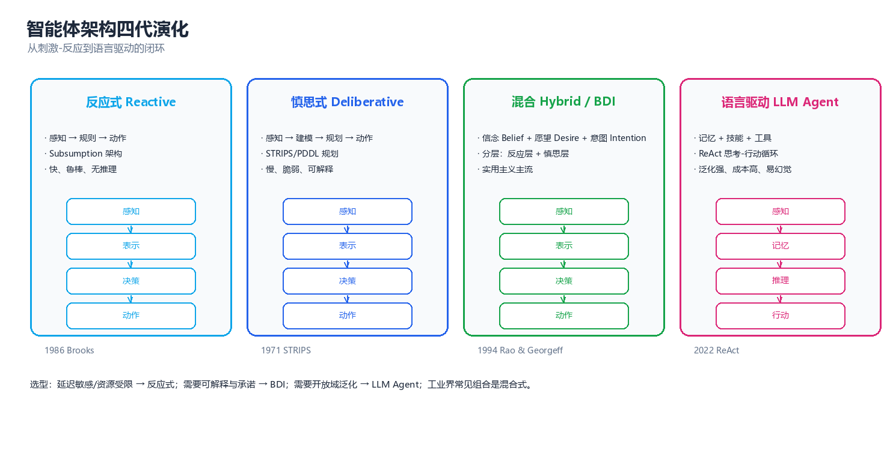
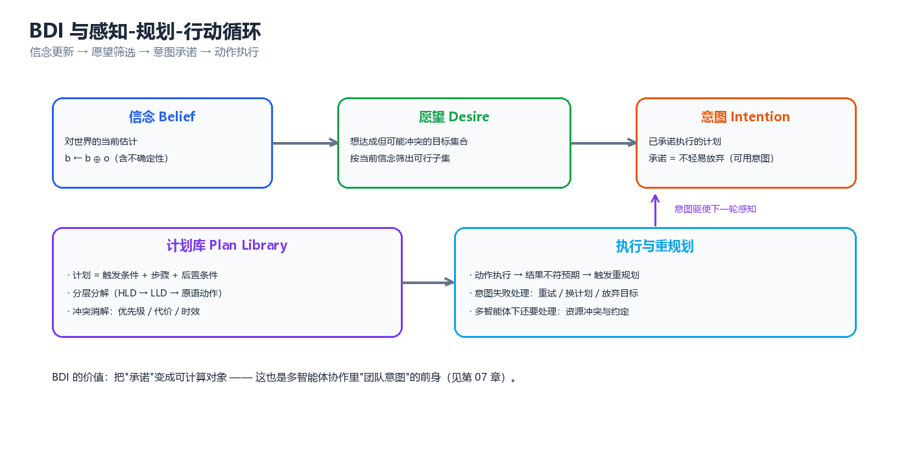
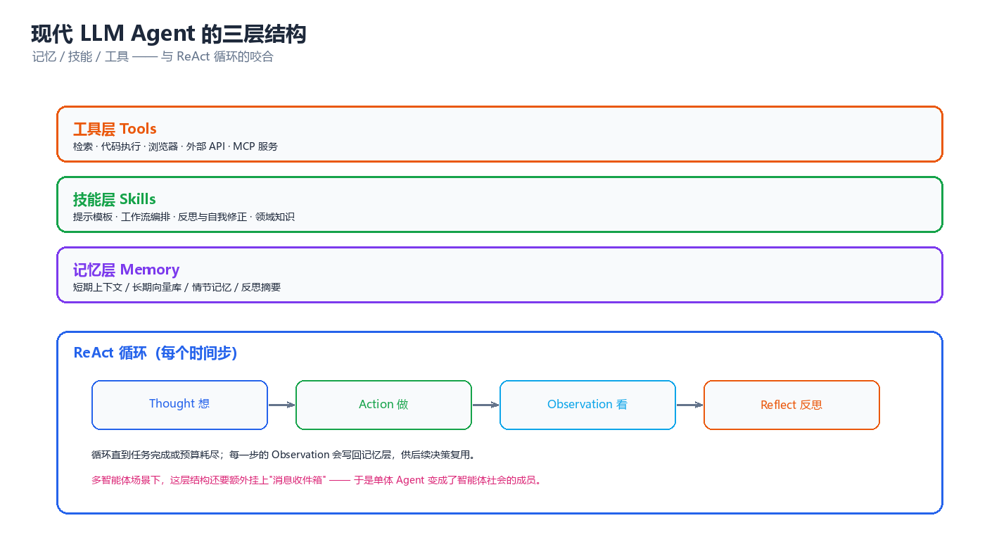

# 第 02 章 智能体架构

> 上一章解决的是"多智能体系统是什么"，这一章进入单个智能体的内部：它的观测怎么变成行动、知识存在哪里、凭什么坚持一个目标而不被一路的噪声带偏。四代架构（反应式 → 慎思式 → 混合/BDI → 语言驱动）不是四种任选的风格，而是**四层针对不同时间尺度的工程答案**。

---

## 一、架构的四代演化



*图：反应式 → 慎思式 → 混合/BDI → 语言驱动。每一代都不是对上一代的否定，而是把上一代"败在哪里"变成新的一层。*

### 1.1 反应式 → 慎思式 → 混合/BDI → 语言驱动

**为什么会有"代际"。** 一个智能体要同时满足两个矛盾的要求：**对环境响应要快**（毫秒级，否则撞墙），**对目标追求要远**（分钟到小时级，否则办不成事）。两者相差四五个数量级，任何单一机制都无法同时覆盖 —— 于是有了分层，也就有了代际。每一代都是为补上一代暴露的缺口而出现的。

**第 0 代（前史）：感知-规划-行动（Sense-Plan-Act, SPA）。** Shakey（1966–1972）与 STRIPS（1971）确立的范式：感知 → 建世界模型 → 规划完整动作序列 → 逐步执行。它第一次把"目标"与"行动"用形式语言连了起来，却立刻暴露三个问题：规划耗时远大于环境变化周期、世界模型永远不完整、以及**符号接地问题（symbol grounding problem）**——"`on(a, table)`"这个符号与真实积木之间隔着一整套感知系统。

**第 1 代：反应式架构（Reactive Architecture, 1986–）。** Brooks 的 *Subsumption Architecture*（1986）反叛 SPA：**不要世界模型，不要规划**。智能体只是一堆"情境-动作规则"（situation-action rule）的集合，感知直接接行动，行为分层、高层抑制低层。它赢在实时与鲁棒（没有模型，也就没有"模型错了"这回事）。

- **解决的问题**：毫秒级响应、对感知噪声与部分失效的鲁棒性、极低算力需求。
- **付出的代价**：无记忆、无前瞻、天然局部最优；"必须先绕远路"的任务会原地打转；涌现行为无法推理与验证。

**第 2 代：慎思式架构（Deliberative Architecture, 1957–1990s）。** 回到符号主义但换了工具：用一阶逻辑/PDDL（Planning Domain Definition Language）描述世界与动作，用状态空间搜索或偏序规划求动作序列，再交给执行器。STRIPS 的算子三元组 $(pre, add, del)$ 与分层任务网络（Hierarchical Task Network, HTN）构成了经典规划的技术栈。

- **解决的问题**：目标导向的长期推理、可解释性（计划本身就是解释）、约束的显式表达。
- **付出的代价**：**框架问题（frame problem）**、感知-规划-行动的延迟鸿沟、以及复杂度天花板 —— 命题 STRIPS 的规划存在问题在长度不受限时是 PSPACE-完全的。

**第 3 代：混合架构与 BDI（Hybrid / BDI, 1990–）。** 工程现实答案是分层：**反应层管毫秒、慎思层管小时**，中间用 BDI（Belief-Desire-Intention，信念-愿望-意图）做"承诺管理"。BDI 的关键洞察不是"有信念和愿望"（太普通），而是**意图是一个承诺（commitment）**：一旦选定某个计划，就要在相当长时间里坚持它，不会每一步都重新权衡，只有计划失败或目标达成时才重规划。这正是"不被噪声带偏"的形式化。

- **解决的问题**：动态环境里兼具实时性与目标坚持；把"何时重新决策"变成可设计的问题。
- **付出的代价**：两层之间的接口设计困难；信念修正（belief revision）本身就不平凡；计划库需人工编写，难以覆盖开放环境。

**第 4 代：语言驱动架构（Language-Driven / LLM Agent, 2022–）。** 用大语言模型（Large Language Model, LLM）替换符号推理层：世界知识不再编码为逻辑原子，而是隐含在预训练权重里；推理不再输出抽象算子，而是输出自然语言。ReAct（Reason + Act, 2022）给出"思考 → 行动 → 观察"的交错循环，Reflexion（2023）在其上加"自我反思 + 失败写记忆"，Toolformer / MCP 把外部工具接进来。

- **解决的问题**：开放域任务、自然语言接口、无需人工编写领域模型、常识与语义的现成复用。
- **付出的代价**：幻觉（hallucination）沿链路传染、token 成本随轮数线性增长、不可复现（采样随机性）、无形式化保证（"信念"不再逻辑封闭，也谈不上一致性）。

> **核心思想**：四代架构的演化不是"新替代旧"，而是**在时间轴上不断加层**。今天一台具身智能体往往同时运行四代架构的实例：底层反应式控制器（1 kHz）、中层行为树/状态机（10 Hz）、任务级 BDI 或任务规划器（0.1 Hz）、最外层 LLM 接口（一次任务一次调用）。选型问题因此不是"用哪一代"，而是"哪一段该用哪一代"。

### 1.2 代际对照表

| 代际 | 代表工作（年） | 内部表示 | 解决的问题 | 主要代价 | 典型失败模式 |
|------|--------------|---------|-----------|---------|-------------|
| 反应式 | Brooks 包容架构（1986） | 情境-动作规则 | 实时性、鲁棒性、低算力 | 无记忆、无前瞻 | 绕不出障碍、行为震荡、死循环 |
| 慎思式 | STRIPS（1971）、PDDL（1998） | 逻辑原子 + 算子 | 目标导向、可解释、约束表达 | 框架问题、延迟、PSPACE | 世界模型过时、规划太慢 |
| 混合/BDI | PRS（1987）、dMARS（1996）、JACK（2001） | 信念/愿望/意图 + 计划库 | 目标坚持 + 实时反应 | 接口复杂、计划库人工维护 | 意图死锁、承诺过早、计划库缺项 |
| 语言驱动 | ReAct（2022）、Reflexion（2023） | 自然语言 + 向量记忆 | 开放域、零建模、常识复用 | 幻觉、成本、不可复现 | 幻觉传染、无限自省、成本爆炸 |

> ⚠️ 常见选型错误是"用最高代际解决一切"。语言驱动架构在**需要严格保证**的场合（资金转账、医疗剂量、工控回路）失败率显著高于前两代，因为它根本没有"保证"这个概念 —— 它的输出是一个采样结果，不是一条定理。

---

## 二、反应式架构

### 2.1 情境-动作规则与有限状态机

反应式智能体（reactive agent）的最小定义是：**行动是当前感知的纯函数**。

$$
a_t = f(s_t), \qquad \text{没有 } s_{t-1}, s_{t-2}, \dots \text{ 的参与}
$$

最朴素的形态是一张**情境-动作规则表**（condition-action table）：

| 情境（感知条件） | 动作 | 说明 |
|----------------|------|------|
| 前方有障碍 且 一侧空 | 向空侧转 | 避障规则 |
| 前方有障碍 且 两侧都堵 | 后退 | 死角处理 |
| 前方无障碍 | 前进 | 默认规则 |
| 电池低于 10% | 前往充电桩 | 资源规则（优先级最高） |

规则表的表达能力受限于**感知粒度**。最常见的升级是**有限状态机（Finite State Machine, FSM）**：引入离散内部状态 $q \in Q$，转移函数变成

$$
\delta: Q \times \Sigma \rightarrow Q \times \Gamma, \qquad \text{例如 } (q, \sigma) \mapsto (q', \gamma)
$$

FSM 是"带一点记忆的反应式"，在游戏 AI 与工业控制里活了三十年：

| 表示 | 记忆 | 表达能力 | 可读性 | 扩展时的痛点 | 典型工具 |
|------|------|---------|--------|-------------|---------|
| 规则表 | 无 | 最低 | 高（一张表看完） | 规则数随情境组合爆炸 | 专家系统、CLIPS |
| 有限状态机 | 当前状态 | 中 | 中 | 状态数随任务数乘积爆炸 | Unity FSM、SCXML |
| 行为树（Behavior Tree） | 无（靠黑板） | 中高 | 高（树形结构） | 节点复用需要设计模式 | BehaviorTree.CPP |
| 层次状态机（HFSM） | 状态栈 | 高 | 中 | 层次设计容易过度 | Statecharts、ROS SMACH |

> **核心思想**：反应式的本质限制不是"规则太少"，而是**没有表示未来的能力**。它无法回答"如果我现在这么做，三步之后会怎样"，因此**任何需要牺牲眼前利益换取远期收益的任务**都在它的能力边界之外。

### 2.2 Subsumption 架构：分层行为与优先级仲裁

Brooks 的包容架构（Subsumption Architecture）是反应式最优雅的形态，三条规则：

1. **行为分层**：低层处理最原始最紧急的任务（避障），高层处理更抽象的任务（探索、抓取）。
2. **高层抑制（inhibit/suppress）低层**：高层不需要"协调"，只需在关键时刻掐掉低层的输出。
3. **没有中央世界模型**：每层只订阅自己需要的传感器，层间不共享内部状态。

```
                        传感器 (sensor)
                             │
       ┌─────────────────────┼─────────────────────┐
       ▼                     ▼                     ▼
 ┌────────────┐    ┌────────────────┐    ┌────────────┐
 │ 层 3        │    │ 层 2            │    │ 层 1        │
 │ GoToGoal    │    │ AvoidObstacle   │    │ Wander      │
 │ 优先级 P=3  │    │ 优先级 P=2      │    │ 优先级 P=1  │
 └─────┬──────┘    └───────┬────────┘    └─────┬──────┘
       │ forward           │ up / down          │ wander
       │  抑制 S(3→2) ──────┘                    │
       │  抑制 S(3→1) ───────────────────────────┤
       │                   │  抑制 S(2→1) ───────┤
       ▼                   ▼                    ▼
   ┌─────────────────────────────────────────────────┐
   │              仲裁器 Arbitrator                   │
   │   for L in [P3, P2, P1]:                        │
   │       if L.active(s):  return L.action(s)       │
   │   (第一个激活的层获胜, 其余全部被抑制)             │
   └───────────────────────┬─────────────────────────┘
                           ▼
                    执行器 (actuator)
```

仲裁规则**唯一的原则是"优先级 + 激活条件"**，没有效用函数、没有博弈、没有协商。这既是它便宜的原因，也是它脆弱的根源 —— 下面这段代码把整台机器跑起来，可以直接观察"谁能拿到执行权"：

```python
# 2.2 Subsumption 仲裁: 高优先级行为层通过抑制信号覆盖低层输出
import numpy as np

SIZE_X, SIZE_Y = 6, 3
OBSTACLES = {(2, 1), (4, 2)}
rng = np.random.default_rng(3)


class Bot:
    def __init__(self):
        self.pos, self.actions = (0, 1), 0

    def sense(self):
        x, y = self.pos
        blocked = lambda p: p in OBSTACLES or p[0] >= SIZE_X or p[1] >= SIZE_Y
        return {"front_blocked": blocked((x + 1, y)),
                "at_goal": self.pos == (SIZE_X - 1, 1)}

    def do(self, a):
        x, y = self.pos
        self.actions += 1
        if a == "forward":
            self.pos = (min(x + 1, SIZE_X - 1), y)
        elif a == "up":
            self.pos = (x, min(y + 1, SIZE_Y - 1))
        elif a == "down":
            self.pos = (x, max(y - 1, 0))
        elif a == "wander":
            self.pos = (x, max(y - 1, 0) if rng.random() < 0.5 else min(y + 1, SIZE_Y - 1))


def goto_goal(bot, s):                     # 层 3: 驱向目标
    return None if (s["at_goal"] or s["front_blocked"]) else "forward"


def avoid_obstacle(bot, s):                # 层 2: 避障(前向受阻时侧移)
    if not s["front_blocked"]:
        return None
    return "down" if bot.pos[1] > 1 else "up"


def wander(bot, s):                        # 层 1: 闲逛(永远可激活, 优先级最低)
    return "wander"


LAYERS = [(3, "GoToGoal", goto_goal), (2, "AvoidObstacle", avoid_obstacle),
          (1, "Wander", wander)]


def arbitrate(bot, s):
    """从高优先级向下扫描: 第一个激活的层获胜, 其余全部被抑制"""
    for i, (prio, name, fn) in enumerate(LAYERS):
        act = fn(bot, s)
        if act is not None:
            active = [n for _, n, f in LAYERS if f(bot, s) is not None]
            return name, act, [n for n in active if n != name]
    return None, None, []


bot = Bot()
print(f"{'tick':>4} {'位置':<8}{'前方受阻':<10}{'获胜层':<15}{'动作':<9}被抑制的层")
for t in range(1, 12):
    s = bot.sense()
    if s["at_goal"]:
        print(f"{t:>4} {str(bot.pos):<8}{'-':<10}{'(已达目标)':<15}{'-':<9}-")
        break
    name, act, suppressed = arbitrate(bot, s)
    print(f"{t:>4} {str(bot.pos):<8}{str(s['front_blocked']):<10}{name:<15}{act:<9}"
          f"{', '.join(suppressed) if suppressed else '-'}")
    bot.do(act)
print(f"\n共执行 {bot.actions} 个动作; 各行为层只通过抑制信号耦合, 不共享内部状态")
# 预期输出:
# tick 位置      前方受阻      获胜层            动作       被抑制的层
#    1 (0, 1)  False     GoToGoal       forward  Wander
#    2 (1, 1)  True      AvoidObstacle  up       Wander
#    3 (1, 2)  False     GoToGoal       forward  Wander
#    4 (2, 2)  False     GoToGoal       forward  Wander
#    5 (3, 2)  True      AvoidObstacle  down     Wander
#    6 (3, 1)  False     GoToGoal       forward  Wander
#    7 (4, 1)  False     GoToGoal       forward  Wander
#    8 (5, 1)  -         (已达目标)         -        -
#
# 共执行 7 个动作; 各行为层只通过抑制信号耦合, 不共享内部状态
```

注意第 2、5 行发生了真实的行为切换：避障层只在前方受阻那一拍激活，一旦激活就立刻接管执行权，目标层被"沉默"而非被"说服"。这就是包容架构的全部机制 —— **它是切换，不是协商**。

### 2.3 何时失效：需要长期规划的场景

反应式有一个精确的能力边界：**它只能实现"当前感知到行动"的可测函数，而任何需要承诺的任务都不能表示为这样的函数。** 下面三条中任一条成立，就说明反应式不够用：

判据有三条：**最优动作依赖于尚未出现的未来事件**（"先充电再出车"，因为充电桩 20 分钟后才空闲）、**需要区分感知上完全相同的两个状态**（已投递与未投递的包裹）、**存在局部最优陷阱**（局部规则把智能体稳定在永远到不了目标的吸引子上）。

| 场景 | 反应式够用吗 | 理由 |
|------|------------|------|
| 扫地机器人沿墙清扫 | ✅ 够用 | 无承诺需求，避障即全部任务 |
| 游戏 NPC 的巡逻与追击 | ✅ 够用 | 行为树/FSM 已能覆盖，状态可枚举 |
| 无人机穿越狭窄通道 | ✅ 够用（+ 稳定控制器） | 局部避障就是全部问题 |
| 多机器人协作搬运（顺序有约束） | ❌ 不够 | 需要承诺"我先到位等你" |
| 跨天任务（预约、物流、报销） | ❌ 不够 | 需要状态记忆与长期目标 |
| 需要解释"你为什么这么做" | ❌ 不够 | 涌现行为无法反向推理 |

> ⚠️ 反应式最危险的失效模式是**行为振荡（behavior oscillation）**：两个同优先级的规则交替激活，智能体在两格之间来回移动。它不报错、不崩溃，只永远做无用功 —— 线上表现为"任务一直不结束"，极难定位。

---

## 三、慎思式架构

### 3.1 符号表示与 STRIPS/PDDL 规划

慎思式架构（deliberative architecture）的核心假设：**世界可以用符号系统显式表示，行动效果可以精确预测**。三条支柱：

- **状态表示**：世界状态 $s$ 是**原子（atom）的集合**，例如 $\{\text{on}(a,\text{table}),\ \text{clear}(b),\ \text{handempty}\}$。这是**封闭世界假设**（closed-world assumption）：没写的都是假的。
- **动作表示**：算子（operator）写成三元组 $\text{op} = (pre, add, del)$，即可执行条件是 $pre \subseteq s$，执行后 $s' = (s \setminus del) \cup add$。这个"加/删"模型也是**默认推理**（default reasoning）的第一种形态。
- **规划问题**：给定初始状态 $s_0$ 与目标集合 $g$，求动作序列 $\pi = \langle a_1, \dots, a_n \rangle$ 使执行后 $g \subseteq s_n$。

从 STRIPS 到 PDDL 的升级主要是**表达力**：PDDL 引入类型、谓词、量词、数值流（`increase`/`decrease`）、条件效果（`when`）与派生谓词，使"燃料量"这类连续量也能统一建模。同一段领域知识的两种写法：

```pddl
;; STRIPS 风格(1971): 只有 前提/添加/删除
(operator stack
  (params (?x ?y))
  (precondition (and (holding ?x) (clear ?y)))
  (effect (and (on ?x ?y) (clear ?x) (handempty)
               (not (holding ?x)) (not (clear ?y)))))

;; PDDL 2.1 风格: 有类型、数值与条件效果
(:action drive
  :parameters (?t - truck ?from - location ?to - location)
  :precondition (and (at ?t ?from) (road ?from ?to) (>= (fuel ?t) (distance ?from ?to)))
  :effect (and (not (at ?t ?from)) (at ?t ?to)
               (decrease (fuel ?t) (distance ?from ?to))
               (when (= (fuel ?t) 0) (not (can-move ?t)))))
```

四种主流"符号化任务表示"的对比：

| 表示 | 表示不了什么 | 求解方式 | 适用场景 | 代表系统 |
|------|------------|---------|---------|---------|
| STRIPS | 条件效果、数值 | 状态空间搜索 | 教学与原型 | STRIPS、Shakey |
| PDDL | 不确定性、连续动态 | 规划器 | 物流、调度、机器人任务级 | Fast Downward、LAMA |
| HTN（分层任务网络） | 不擅长"从零发现方法" | 任务分解（自上而下） | 有成熟 SOP 的工业流程 | SHOP2 |
| POMDP（部分可观测 MDP） | 表达不了高层符号结构 | 信念状态上的值迭代 | 感知不确定的真实任务 | POMDP-solve、DESPOT |

### 3.2 前向/后向搜索与启发式

规划的本质是在巨大的图上找路。搜索方向的差别很大：

| 搜索方向 | 展开对象 | 分支因子 | 优点 | 缺点 | 典型启发式 |
|---------|---------|---------|------|------|-----------|
| 前向（forward / progression） | 从 $s_0$ 出发的**状态** | 大 | 易剪枝（无效动作不展开） | 目标不敏感 | $h_{add}$、$h_{FF}$、$h_{max}$ |
| 后向（backward / regression） | 从 $g$ 出发的**子目标集** | 小 | 只看相关动作 | 需处理前提交互 | 相关动作集合 |
| 双向 | 两端同时 | — | 视情况最优 | 相遇判定昂贵 | — |
| 分层（HTN） | 任务网络 | — | 直接复用人类 SOP | 需要专家写方法库 | — |

**启发式的核心思想是"松弛"（relaxation）**：把原问题变简单一点，用简单问题的最优解当原问题的下界：

$$
h_{add}(s) = \sum_{a \in \pi_{\text{relaxed}}(s)} \text{cost}(a), \qquad
h_{max}(s) = \max_{a \in \pi_{\text{relaxed}}(s)} \text{cost}(a), \qquad
h_{FF}(s) = |\pi_{\text{relaxed}}(s)|
$$

"松弛"通常指**忽略删除效果**（delete-relaxation）：假设动作只会让世界变好、不会破坏已成立的事实。忽略删除效果后规划变成多项式时间可解（这正是 $h_{add}$ 与 $h_{FF}$ 可计算的原因），而原问题依然困难 —— 这个"难度差"正好被拿来当启发式。下面是一个完整可跑的 STRIPS 规划器（A\* + 未满足目标原子计数）：

```python
# 3.2 前向状态空间搜索的 STRIPS 规划器: A* + "未满足目标原子数"启发式
import heapq

BLOCKS = ["a", "b", "c"]


def actions_of(state):
    """枚举当前状态下所有可赋值的算子(地面化 STRIPS 算子): (名字, 添加, 删除)"""
    out = []
    for x in BLOCKS:
        if {f"on({x},table)", f"clear({x})", "handempty"} <= state:
            out.append((f"pick-up({x})", {f"holding({x})"},
                        {f"on({x},table)", f"clear({x})", "handempty"}))
        if f"holding({x})" in state:
            out.append((f"put-down({x})", {f"on({x},table)", f"clear({x})", "handempty"},
                        {f"holding({x})"}))
        for y in BLOCKS:
            if x == y:
                continue
            if {f"holding({x})", f"clear({y})"} <= state:
                out.append((f"stack({x},{y})", {f"on({x},{y})", f"clear({x})", "handempty"},
                            {f"holding({x})", f"clear({y})"}))
            if {f"on({x},{y})", f"clear({x})", "handempty"} <= state:
                out.append((f"unstack({x},{y})", {f"holding({x})", f"clear({y})"},
                            {f"on({x},{y})", f"clear({x})", "handempty"}))
    return out


def h_unsat(state, goal):
    """启发式: 目标里尚未满足的原子个数(简单, 不保证可采纳, 但直观)"""
    return sum(1 for g in goal if g not in state)


def astar(init, goal):
    init, goal = frozenset(init), frozenset(goal)
    tie, counter = 0, 0
    frontier = [(h_unsat(init, goal), 0, tie, init, [])]
    best, expanded = {init: 0}, 0
    while frontier:
        _, g, _, state, plan = heapq.heappop(frontier)
        if goal <= state:
            return plan, expanded
        if g > best.get(state, 1 << 30):
            continue
        expanded += 1
        for name, add, dele in actions_of(state):
            nxt = frozenset((set(state) - dele) | add)
            if g + 1 < best.get(nxt, 1 << 30):
                best[nxt] = g + 1
                counter += 1
                heapq.heappush(frontier,
                               (g + 1 + h_unsat(nxt, goal), g + 1, counter, nxt, plan + [name]))
    return None, expanded


init = ["on(a,table)", "on(b,table)", "on(c,table)",
        "clear(a)", "clear(b)", "clear(c)", "handempty"]
goal = ["on(b,a)", "on(c,b)"]
plan, expanded = astar(init, goal)
print("初始状态:", sorted(init))
print("目标状态:", sorted(goal))
print(f"搜索展开节点数 = {expanded} | 最短动作数 = {len(plan)}")
for i, a in enumerate(plan, 1):
    print(f"  {i}. {a}")
# 预期输出:
# 初始状态: ['clear(a)', 'clear(b)', 'clear(c)', 'handempty', 'on(a,table)', 'on(b,table)', 'on(c,table)']
# 目标状态: ['on(b,a)', 'on(c,b)']
# 搜索展开节点数 = 12 | 最短动作数 = 4
#   1. pick-up(b)
#   2. stack(b,a)
#   3. pick-up(c)
#   4. stack(c,b)
```

只展开 12 个节点就找到 4 步解，看起来规划很轻松。**但把积木数从 3 改成 30**：状态空间从 $2^{15}$ 级别跳到 $10^{40}$ 级别，同样的代码一辈子跑不完 —— 这就是下一节的复杂度天花板。

### 3.3 框架问题、计算复杂度与可扩展性天花板

慎思式架构有三个著名的理论困难，它们**不是工程细节，而是范式自带的**：

**（1）框架问题（frame problem）。** 世界时刻在变，但绝大多数事实在任一动作前后保持不变。逻辑若想推理"我现在能做什么"，就必须显式声明哪些东西**没有**变。STRIPS 用 $del$ 集合部分解决了它（没删的就是没变），代价是引入默认推理；用纯一阶逻辑表达则需为每个动作写 $|F|$ 条框架公理（$F$ 为事实总数）。

**（2）资格问题（qualification problem）。** 没有任何规则能穷举一次动作会失败的所有原因。计划"去厨房煮咖啡"隐含假设了两百个条件（门没锁、没停电、机器有豆……），写全是不可能的，所以**任何形式化计划在执行时都必须默认"其他条件不变"（ceteris paribus）**—— 这正是它会被现实打败的地方。

**（3）钳制问题（ramification problem）。** 一个动作的间接后果可能无限延伸（动了砖块 → 灰尘落下 → 传感器误读 → 任务重规划）。显式建模所有间接效果会引入比直接效果多得多的公理。

复杂度结论与它的工程含义（只记结论，不展开证明）：

| 问题 / 症状 | 复杂度 | 工程绕法 |
|------------|--------|---------|
| 命题 STRIPS 的规划存在性 | PSPACE-完全（Bylander, 1994） | HTN/宏动作复用人类 SOP |
| 有界长度的命题规划（长度 ≤ k） | NP-完全（SAT 规划器的基础） | 限定规划长度 + 增量重规划 |
| 无删除效果的松弛问题 | 多项式（$h_{add}/h_{FF}$ 可计算的原因） | 用它当下界，别当解 |
| 数值 PDDL 规划（含无界计数） | 不可判定 | 给计数加上界或离散化 |
| 一阶逻辑可满足性 | 半可判定（需先地面化） | 控制对象数量 $O(n^k)$ |
| 执行时计划瞬间失效 | ——（资格问题） | 执行监控 + 快速重规划（replanning） |
| 感知事实无法映射成原子 | ——（符号接地问题） | 感知层输出符号摘要而非原始信号 |

> **核心思想**：慎思式的困难**不是"算法不够好"，而是"问题本身就在 PSPACE 里"**。复杂度结果说的是"这个问题没有捷径"，唯一出路是**换一个更弱的问题**：HTN 复用人类知识、反应层兜底、或者把推理外包给不保证正确但便宜的 LLM。

---

## 四、混合架构与 BDI



*图：信念（Belief）、愿望（Desire）、意图（Intention）三要素与感知-规划-行动循环的对应关系。*

### 4.1 信念/愿望/意图三要素

BDI 是 Bratman 的实践哲学（*Intention, Plans, and Practical Reason*, 1987）在 AI 里的工程化，它回答一个很实际的问题：**一个人为什么不会在每次过马路时重新权衡"要不要去上班"？** Bratman 的答案是多了一个中间层 —— **意图**：

- **信念（Belief, $B$）**：智能体对世界"是什么样"的认识，**可能是错的**，会随感知更新。
- **愿望（Desire, $D$）**：智能体"想成为事实"的状态，通常**互相冲突**（既想省时又想省钱）。
- **意图（Intention, $I$）**：**已承诺去实现**的愿望，是愿望与计划之间的桥。核心特征是**承诺**：意图一旦形成就有了惯性，不会因出现稍优选项就立刻被抛弃。

三者的差别全在**动力学**上：

| 维度 | 信念 Belief | 愿望 Desire | 意图 Intention |
|------|------------|------------|---------------|
| 语义 | 世界**是**怎样的 | 世界**应该**怎样（选项集） | 智能体**将要做**什么 |
| 有无真值 | 有（可真可假） | 无（是偏好） | 无（是承诺） |
| 冲突处理 | 必须一致（否则修正） | 允许并存、允许冲突 | 一般要求两两一致 |
| 更新方式 | 感知驱动的信念修正 | 出现/衰减（受动机影响） | **承诺保护**：默认不变 |
| 与行动的关系 | 间接（仅提供约束） | 无（未承诺的愿望不驱动行动） | 直接（意图栈顶就是当前行为） |
| 放弃的代价 | 低 | 低 | **高**（要考虑已投入资源） |
| 对应 LLM Agent 里的什么 | 上下文/记忆/工具返回值 | 任务列表、用户目标 | 当前执行的计划 + 不再改主意的锁定 |

这种"意图有惯性"在数学上叫**承诺的不可逆性**（irrevocability）：放弃一个意图需要理由（失败、被更高优先级取代、资源耗尽），而形成意图只需要"它服务于某个未被满足的愿望"。

### 4.2 意图的承诺与重规划

承诺不是"全有或全无"。三种**承诺强度**是 BDI 系统最重要的设计旋钮：

| 承诺强度 | 定义 | 何时重规划 | 优点 | 风险 |
|---------|------|-----------|------|------|
| **盲目承诺**（blind） | 只要没成功就一直做 | 从不（只在成功时停） | 最简单、最可预测 | 目标不可达时永久卡死 |
| **单心承诺**（single-minded） | 相信目标仍可达就坚持 | 信念表明目标不可达时 | 兼顾坚持与生存 | "不可达"很难判准 |
| **开放承诺**（open-minded） | 有更合适的计划就换 | 出现更优计划或代价过高时 | 灵活、适应性强 | 失去坚持优势，易被噪声带偏 |

**重规划的触发条件**是 BDI 的核心工程知识，一般四类：**计划失败**（动作返回失败）、**计划不可能**（信念更新发现前置被破坏）、**目标已实现或已失效**、**意图冲突**（资源或效果冲突）。

对应到数据结构，BDI 的执行引擎是一台**意图栈**机器：栈底是长期承诺，栈顶是当前正在做的事；遇到子目标压栈，完成后弹栈，失败则把该计划标记为"已失败"并**在同一目标上换一个计划重压**：

```
                    意图栈 (Intention Stack)
   ┌───────────────────────────────────────────────────────┐
   │ [栈底]  Goal: delivered                                │
   │         Plan: P_deliver   pc=1/3   ← 长期承诺, 不轻易放弃│
   ├───────────────────────────────────────────────────────┤
   │ [栈顶]  Goal: coffee_in_hand                           │
   │         Plan: P_repair_then_brew   pc=2/5              │
   │         (先前的 P_brew 已标记 failed, 不再复用)          │
   └───────────────────────────────────────────────────────┘
       按键 4.2 的四类触发条件:                 │
       · 动作失败 ──────────────────────────────┘
       · 前置被破坏        → 弹出当前计划, 在同一目标上重新选择计划
       · 目标已达成        → 正常弹栈, 继续父计划的下一步
       · 与已有意图冲突    → 比较优先级/代价, 低者让路或整体放弃
```

> **核心思想**：BDI 最有价值的不是那三个词，而是**把"什么时候重新考虑"变成一个显式设计的问题**。每一步都重新规划（ReAct 的默认行为）在开放环境里又慢又不稳定；从不重新规划（盲目承诺）在动态环境里会撞死。BDI 的全部工程技巧都在这个旋钮上。

### 4.3 计划库与冲突消解

BDI 智能体不"从零推理出计划"，而是**从计划库里选计划**。一条计划（plan）由三部分组成：

$$
\text{plan} = \langle \text{trigger},\ \text{context},\ \text{body} \rangle
$$

- **触发（trigger）**：服务于哪个目标/事件（例如 `+!deliver_coffee`）。
- **上下文（context）**：前提条件（belief formula），例如 `not machine_broken`。
- **主体（body）**：动作序列，动作可以是基本动作，也可以是子目标（`!sub_goal`）。

好处是推理从"搜索"退化成"匹配"（因此极快、可实时），且计划可被人读懂审核；坏处是**计划库缺项 = 智能体能力缺失**，这是 BDI 系统最常见的线上故障。当多个计划同时可选时，需要**冲突消解（conflict resolution）**：

| 冲突消解策略 | 规则 | 优点 | 缺点 | 典型实现 |
|------------|------|------|------|---------|
| 优先级序 | 每个目标带静态优先级 | 简单、可预测 | 优先级需人工维护 | PRS、JACK |
| 代价序 | 选预计代价最小的计划 | 经济性好 | 代价估计不可靠 | dMARS |
| 新意图优先 | 后到的事件抢占 | 反应灵敏 | 容易"目标漂移" | AgentSpeak 默认 |
| 否决制（veto） | 已有意图可否决新意图 | 保护长期承诺 | 可能错过重要事件 | IRMA |
| 资源预算 | 按剩余预算分配 | 适合有成本的任务 | 预算估计困难 | 现代 LLM 编排常用 |

### 4.4 经典实现与今日等价物

| 经典系统 | 年份 | 特点 | 今日等价物 | 继承了什么 |
|---------|------|------|-----------|-----------|
| PRS（Procedural Reasoning System） | 1987 | 第一个实用 BDI 解释器 | LangGraph 状态图 + 检查点 | 显式计划 + 状态可恢复 |
| dMARS | 1996 | 分布式、可扩展 | AutoGen / CrewAI | 事件驱动的多主体承诺 |
| JACK | 2001 | Java 工业级、带验证工具 | BehaviorTree.CPP | 可组合的技能节点 |
| Jason / AgentSpeak(L) | 2007 | 开源、逻辑清晰、教学首选 | 提示模板 + 技能库 | 触发-上下文-主体三元组 |
| GAMA / NetLogo | 2010s | 大规模社会仿真 | Generative Agents 类社会仿真 | 大量主体的信念更新 |

> ⚠️ 常见误解是"LLM Agent 是全新的东西"。把 ReAct 循环与 BDI 并排看，结构几乎逐项对应，真正的变化只有一个：**信念不再是一个逻辑封闭的原子集合，而是一段可能自相矛盾的自然语言上下文**（见 5.4）。这既带来表达力的暴涨，也带来所有形式化保证的丧失。

---

## 五、现代 LLM Agent 架构



*图：记忆层 / 技能层 / 工具层三层结构，以及底下驱动的 ReAct（思考-行动-观察）循环。*

### 5.1 三层结构：记忆/技能/工具

LLM Agent 的工程实现几乎都收敛到同一个三层结构（不同框架叫法不同，但分层一一对应）：

三层的职责与失败模式几乎一一对应：

| 层 | 职责 | 常见实现 | 失败模式 | 缓解手段 |
|----|------|---------|---------|---------|
| 记忆层 | 提供"不在提示里但必须知道"的信息 | 上下文窗口、向量库（RAG）、情节日志、摘要 | 检索到无关记忆、上下文被污染、超窗截断 | 混合检索 + 时间衰减、显式遗忘（5.3） |
| 技能层 | 提供"怎么做"的过程性知识 | 提示模板、few-shot、子计划、SOP | 技能缺失、技能选错、示例误导 | 技能检索 + 执行后校验 |
| 工具层 | 提供"改变世界"的能力 | 函数调用、MCP、代码沙箱、检索器 | 参数幻觉、越权调用、超时、非幂等 | schema 校验 + 沙箱 + 幂等重试 |
| 推理内核 | 在三者基础上做决策 | 单个 LLM，或多角色模拟 | 幻觉、无限自省、跳过验证 | 结构化输出 + 校验节点 + 步数上限 |

> **核心思想**：三层结构之所以稳定，是因为它把"不确定性"关在推理内核里，而把**记忆、技能、工具都做成确定性接口**。凡能用检索解决的，就不要让模型"想起来"；凡能用磁盘解决的，就不要放进上下文。

### 5.2 ReAct 与 Reflexion 循环的区别

两个名字常被混用，但循环结构完全不同：

- **ReAct**（Reason + Act, Yao et al., 2022）在**单次任务内**交错进行推理轨迹与动作执行，循环体是 `Thought → Action → Observation`，终止条件是任务完成或步数上限。它解决"LLM 不知道自己的知识何时过时"：让模型主动调用工具获取观察，把"猜"变成"看"。
- **Reflexion**（Shinn et al., 2023）在**多次尝试之间**加一层自我反思，循环体是 `尝试 → 评估 → 反思 → 写入记忆 → 下一次尝试`。它解决"同一个错误反复犯"：不改进权重，只改进提示里的教训（verbal reinforcement learning）。

| 对比维度 | ReAct | Reflexion |
|---------|-------|-----------|
| 循环层级 | 任务**内部**（步内） | 任务**之间**（尝试间） |
| 循环体 | Thought → Action → Observation | Attempt → Evaluate → Reflect → 记忆 |
| 学习发生在哪 | 不学习（当次上下文内适应） | 写入长期反思记忆（跨任务复用） |
| 终止条件 | 任务完成 / 步数上限 | 评估通过 / 尝试次数上限 |
| 成本 | $O(T)$ 次 LLM 调用（$T$ 为步数） | $O(K \times T)$（$K$ 为尝试次数） |
| 失败模式 | 死循环、工具误用 | 反复总结却毫无实质改变（空反思） |

> ⚠️ Reflexion 有一个隐蔽的失效模式：**反思可能"总结出一个错误的因果归因"，然后把错误永久写进记忆**，让后续所有尝试都沿错误方向走。这也是"记忆需要遗忘策略"的最强理由。

### 5.3 记忆机制：向量库、情节记忆、反思摘要、遗忘策略

按认知科学的分类法（Tulving 的划分）组织：

| 记忆类型 | 类比 | 存什么 | 存储方式 | 生命周期 |
|---------|------|-------|---------|---------|
| 工作记忆 | 短期记忆 | 当前任务上下文 | 上下文窗口 | 单次会话 |
| 情节记忆（episodic） | 经历 | "第 3 步做过什么、结果如何" | 追加式日志 | 任务级到天级 |
| 语义记忆（semantic） | 知识 | 事实、偏好、实体关系 | 向量库 / 图数据库 | 长期 |
| 程序性记忆（procedural） | 技能 | 提示模板、SOP、代码片段 | 文件 / 技能库 | 长期，需版本管理 |
| 反思记忆（reflective） | 教训 | "上次为什么失败" | 向量库 + 标签 | 长期，需定期清理 |

**检索的本质是一个打分排序问题**，最常用的联合打分是"相似度 × 新鲜度"：

$$
\text{score}(m) = \underbrace{\cos(\mathbf{q}, \mathbf{k}_m)}_{\text{语义相关}} \times \underbrace{e^{-\Delta t_m / \tau}}_{\text{时间衰减}} \times \underbrace{\text{imp}_m}_{\text{重要性}}
$$

其中 $\Delta t_m$ 是记忆 $m$ 的年龄，$\tau$ 是衰减时间常数（越大忘得越慢），$\text{imp}_m$ 是重要性权重（Generative Agents 用 LLM 给每条记忆打 1–10 分）。三个因子缺一不可：只按相似度检索会反复捞出过期结论，只按新鲜度检索会捞出一堆无关琐事。

**遗忘策略**（forgetting）不是"省存储"，而是**防止错误被固化**：

| 遗忘策略 | 规则 | 适用 | 风险 |
|---------|------|------|------|
| 时间衰减 | $\text{keep} = e^{-\Delta t/\tau}$ | 快速变化的事实（股价、排班） | 长周期规律被误删 |
| 容量淘汰 | 保留 top-$K$ / LRU | 上下文预算紧张 | 淘汰正在被依赖的记忆 |
| 冲突覆盖 | 新事实覆盖旧事实（带版本） | 实体属性更新 | 覆盖错误无法回滚 |
| 显式失效 | 反思得出"此路不通"后打标记 | 失败复盘 | 需要标签体系 |

下面的代码把"相似度 × 衰减"的联合打分与阈值过滤完整实现一遍（用词袋向量代替真实嵌入模型，便于复现）：

```python
# 5.3 记忆检索: 向量相似度 + 时间衰减(遗忘) 的联合打分
import numpy as np

VOCAB = ["咖啡", "机器", "坏了", "扳手", "修理", "厨房", "老板", "报告",
         "数据", "图表", "会议", "存档"]


def embed(tokens):
    """把词袋转成归一化向量(真实系统里换成嵌入模型的输出)"""
    v = np.array([tokens.count(w) for w in VOCAB], dtype=float)
    n = np.linalg.norm(v)
    return v / n if n else v


MEM = [                                   # (文本, 词袋, 距今多少天)
    ("咖啡机坏了, 需要扳手才能修", ["咖啡", "机器", "坏了", "扳手"], 1),
    ("上周用扳手修过厨房的机器", ["扳手", "修理", "厨房", "机器"], 9),
    ("老板要一份上周销售数据报告", ["老板", "报告", "数据"], 3),
    ("会议纪要里的图表已存档", ["会议", "图表", "存档"], 30),
    ("厨房在四楼, 咖啡机在厨房", ["厨房", "咖啡"], 12),
    ("机器故障时先断电再修理", ["机器", "坏了", "修理"], 45),
]
QUERY = ["机器", "坏了", "怎么", "修理"]           # 查询词袋(先切词再嵌入)
TAU = 14.0                                         # 遗忘时间常数: 14 天衰减到 1/e
THRESHOLD = 0.15                                   # 低于该相似度直接丢弃

q = embed(QUERY)
print(f"查询向量非零维度: {[VOCAB[i] for i in np.nonzero(q)[0]]}\n")
print(f"{'记忆':<22}{'相似度':>8}{'保留率':>9}{'总分':>9}  判定")
ranked = []
for text, tokens, age in MEM:
    sim = float(q @ embed(tokens))
    keep = float(np.exp(-age / TAU))
    ranked.append((sim * keep, sim, keep, text))
for score, sim, keep, text in sorted(ranked, reverse=True):
    if sim < THRESHOLD:
        verdict = "丢弃(不相关)"
    elif keep < 0.1:
        verdict = "丢弃(过期)"
    elif score >= 0.2:
        verdict = "保留 -> 写入上下文"
    else:
        verdict = "降级(仅作候选)"
    print(f"{text:<22}{sim:>8.3f}{keep:>9.3f}{score:>9.3f}  {verdict}")
ctx = [t for s, sim, k, t in sorted(ranked, reverse=True) if s >= 0.2]
print(f"\n最终进入上下文的记忆条数: {len(ctx)}")
for t in ctx:
    print(f"  - {t}")
# 预期输出:
# 查询向量非零维度: ['机器', '坏了', '修理']
#
# 记忆                         相似度      保留率       总分  判定
# 咖啡机坏了, 需要扳手才能修           0.577    0.931    0.538  保留 -> 写入上下文
# 上周用扳手修过厨房的机器             0.577    0.526    0.304  保留 -> 写入上下文
# 机器故障时先断电再修理              1.000    0.040    0.040  丢弃(过期)
# 老板要一份上周销售数据报告            0.000    0.807    0.000  丢弃(不相关)
# 厨房在四楼, 咖啡机在厨房            0.000    0.424    0.000  丢弃(不相关)
# 会议纪要里的图表已存档              0.000    0.117    0.000  丢弃(不相关)
#
# 最终进入上下文的记忆条数: 2
#   - 咖啡机坏了, 需要扳手才能修
#   - 上周用扳手修过厨房的机器
```

注意第 3 行"机器故障时先断电再修理"：它是**相似度最高（1.000）**的一条，却因 45 天的时间衰减只拿到 0.040 的总分而被丢弃。这正是遗忘策略的价值 —— **相关但过期**的知识往往比无关知识更危险，因为它听起来完全正确。

### 5.4 与 BDI 的对应关系

把 LLM Agent 与 BDI 逐项对齐，会看到一个惊人的同构关系，以及一个决定性的差异：

| BDI 要素 | LLM Agent 中的对应物 | 相同点 | 关键差异 |
|---------|-------------------|--------|---------|
| 信念 $B$ | 上下文窗口 + 检索到的记忆 + 工具返回 | 都是"智能体以为的世界" | BDI 信念**逻辑封闭**（可推出蕴含式）；LLM 上下文**不封闭**，甚至内部矛盾 |
| 愿望 $D$ | 用户目标、任务列表、采样出的候选 | 都可能互相冲突 | BDI 愿望集合稳定；LLM 的"愿望"每步都在重采样 |
| 意图 $I$ | 当前执行的计划 + 锁定的目标 | 都起"承诺"作用 | BDI 意图有**显式承诺语义与失败判定**；LLM 承诺弱，长上下文里易漂移 |
| 计划库 | 提示模板 + 技能库 + few-shot 示例 | 都是"匹配而非搜索" | BDI 计划库可枚举可验证；LLM 技能在权重里，**不可枚举、不可验证** |
| 感知 | 工具调用返回值、环境观测 | 都更新信念 | BDI 感知事件触发显式信念修正；LLM 把观测直接拼进上下文 |
| 信念修正 | 依赖删除/重规划 | 都因失败而重规划 | BDI 有明确修正逻辑；LLM 依赖"模型自己注意到矛盾"，常常注意不到 |
| 推理机制 | 一阶逻辑 / 模态逻辑 | — | **LLM 把符号推理层整体换成了自然语言推理** |

> **核心思想**：BDI 与 LLM Agent 的差别可以压缩成一句话 —— **BDI 用逻辑保证一致性，LLM Agent 用语言换取表达力**。BDI 能证明"意图集合一致"，LLM 不能；但 LLM 能处理"把这周的报销流程走完，顺便看看有没有能报销的团建"这种连谓词都写不出来的任务。所以现代实践倾向于**混合**：用 LLM 做没有形式化的那一层，用确定性代码/状态机/BDI 引擎做需要保证的那一层（执行、校验、承诺）。

---

## 六、架构选型

### 6.1 五维选型表

选型的正确姿势不是"哪个先进用哪个"，而是**先把五个维度的需求写下来**：延迟敏感度、计算资源、可解释性要求、开放域程度、是否需要承诺。

| 架构 | 延迟（能否 <10 ms） | 计算资源 | 可解释性 | 开放域适应度 | 承诺能力 | 综合定位 |
|------|------------------|---------|---------|------------|---------|---------|
| 反应式 / 包容架构 | ✅ 极好（微秒–毫秒） | 极低（MCU 可跑） | ⚠️ 低（涌现行为难解释） | ❌ 差（规则手写） | ❌ 无 | 底层控制器、安全兜底 |
| 有限状态机 / 行为树 | ✅ 好（毫秒） | 低 | ✅ 好（结构即文档） | ⚠️ 中（需显式建状态） | ⚠️ 弱（靠黑板记） | 中层的任务编排 |
| 慎思式（STRIPS/PDDL） | ❌ 差（秒–小时） | 中到高（搜索） | ✅ 极好（计划即解释） | ❌ 差（必须可建模） | ✅ 强（计划是全局的） | 有成熟模型的调度问题 |
| 混合 / BDI | ✅ 好（反应层兜底） | 中 | ✅ 好（意图栈可读） | ⚠️ 中（计划库定上限） | ✅ 强（承诺语义显式） | 动态环境 + 长期任务 |
| LLM Agent（ReAct） | ❌ 差（0.5–10 s/步） | 高（GPU/API 成本） | ⚠️ 中（叙述可信度存疑） | ✅ 极好（零建模） | ⚠️ 弱（长程易漂移） | 开放域、人机接口、原型 |

把这五个维度填成一个需求向量，就能直接对照上表圈出候选架构；下一节的决策树给出按硬约束排序的判定顺序。

### 6.2 决策流程（文字版决策树）

按顺序回答下面 7 个问题，第一个"是"就决定架构（问题按"越靠前越是硬约束"排列）：

1. **是否存在不可让步的实时约束（<10 ms）？** 是 → 反应式层（包容架构 / PID / 硬编码安全规则），并必须为更高层设计"紧急接管"接口。否 → 下一步。
2. **任务状态空间是否小、可枚举、转移可写？** 是 → 有限状态机或行为树（可读性最好，团队协作成本最低）。否 → 下一步。
3. **领域模型是否稳定、可写出算子与前提（能表达成 PDDL）？** 是 → 慎思式规划（PDDL/HTN），并配一个反应层兜底感知延迟。否 → 下一步。
4. **必须长期坚持同一目标（承诺），而环境又在持续变化？** 是 → 混合/BDI：反应层负责毫秒级生存，BDI 迭代负责"不轻易改变主意"。否 → 下一步。
5. **任务是开放域（无法穷举状态、需要常识与语言）？** 是 → LLM Agent（ReAct 为主循环）。否 → 回到第 2 步重审（通常说明维度判断有误）。
6. **失败代价是否高（钱、安全、法律）？** 是 → 在 LLM 外包一层确定性校验（schema 校验 + 沙箱 + 人工确认 + 幂等），**不要让模型直接落到副作用上**。否 → 直接用 ReAct。
7. **是否要求可复现与可审计？** 是 → 固定模型版本、temperature=0、记录完整轨迹（Thought/Action/Observation 全量）、给每个动作加显式前置条件检查 —— 本质上就是把 BDI 的信念-意图结构**外置到代码里**。

> ⚠️ 最省事的反模式是"先上 LLM Agent，不行再加约束"。正确顺序恰好相反：**先把能确定的部分确定下来（状态机/规则/校验），只在剩下的开放缝隙里用 LLM**。这与第 08 章一致：LLM 编排的失败大多来自"本该确定的地方用了模型"。

---

## 七、实现案例

### 7.1 从零实现一个最小 BDI 智能体

任务：智能体在大厅，要把一杯咖啡送到办公室老板手里；**咖啡机其实是坏的**，而智能体一开始**错误地相信它是好的**。这个设定同时考验信念修正、意图栈与重规划。

```python
# 7.1 最小 BDI 智能体: 信念字典 + 计划库 + 意图栈 + 失败重规划
# 场景: 智能体在大厅, 要把一杯咖啡送到办公室的老板手里; 咖啡机其实是坏的。
GRID = {"lobby": (0, 0), "storeroom": (0, 4), "kitchen": (4, 4), "office": (4, 0)}
WORLD = {"machine_broken": True}                 # 环境真值: 智能体一开始并不知道
STATS = {"primitive_calls": 0, "move_steps": 0, "plan_selections": 0, "replans": 0}
TRACE = []


def hops(a, b):
    (x1, y1), (x2, y2) = GRID[a], GRID[b]
    return abs(x1 - x2) + abs(y1 - y2)


# ---------- 基本动作: 返回 (是否成功, 观察到的信念修正) ----------
def move_to(B, target):
    d = hops(B["pos"], target)
    B["pos"] = target
    STATS["move_steps"] += d
    TRACE.append(f"    move_to({target})      走了 {d} 步 -> 现在在 {target}")
    return True, {}


def take_wrench(B, _):
    if B["pos"] != "storeroom":
        return False, {}
    B["has_wrench"] = True
    TRACE.append("    take_wrench()          拿到扳手")
    return True, {}


def repair(B, _):
    if B["pos"] != "kitchen" or not B["has_wrench"]:
        return False, {}
    WORLD["machine_broken"] = False
    TRACE.append("    repair()               咖啡机修好了")
    return True, {"machine_broken": False}


def brew(B, _):
    if WORLD["machine_broken"]:
        TRACE.append("    brew()                 失败! 机器是坏的")
        return False, {"machine_broken": True}   # 观察 -> 信念修正
    TRACE.append("    brew()                 煮好一杯咖啡")
    return True, {"coffee_in_hand": True}


def hand_over(B, _):
    if not B["coffee_in_hand"] or B["pos"] != "office":
        return False, {}
    TRACE.append("    hand_over()            咖啡交到老板手里")
    return True, {"delivered": True}


ACTIONS = {"move_to": move_to, "take_wrench": take_wrench, "repair": repair,
           "brew": brew, "hand_over": hand_over}

# ---------- 计划库: 目标 -> [(计划名, 上下文条件, 步骤)] ----------
# 步骤形如 ("prim", 动作名, 参数) 或 ("goal", 子目标)
PLAN_LIBRARY = {
    "delivered": [
        ("P_deliver", lambda B: True,
         [("goal", "coffee_in_hand"), ("prim", "move_to", "office"),
          ("prim", "hand_over", None)]),
    ],
    "coffee_in_hand": [
        ("P_brew", lambda B: not B["machine_broken"],
         [("prim", "move_to", "kitchen"), ("prim", "brew", None)]),
        ("P_repair_then_brew", lambda B: B["machine_broken"],
         [("prim", "move_to", "storeroom"), ("prim", "take_wrench", None),
          ("prim", "move_to", "kitchen"), ("prim", "repair", None),
          ("prim", "brew", None)]),
    ],
}

B = {"pos": "lobby", "machine_broken": False,      # 初始信念(错误的): 机器是好的
     "has_wrench": False, "coffee_in_hand": False, "delivered": False}

failed = set()                                     # 已失败的计划名, 不再重选
stack = []                                         # 意图栈


def select_plan(goal, B):
    for name, ctx, steps in PLAN_LIBRARY.get(goal, []):
        if name in failed:                         # 承诺过的失败计划不重复选
            continue
        if ctx(B):                                 # 上下文条件 = 计划前提
            STATS["plan_selections"] += 1
            return name, steps
    return None, None


def push_goal(goal, B):
    name, steps = select_plan(goal, B)
    if name is None:
        return False
    TRACE.append(f"[意图栈 深度={len(stack) + 1}] 承诺计划 {name}  (目标 {goal})")
    stack.append({"plan": name, "goal": goal, "steps": steps, "pc": 0})
    return True


assert push_goal("delivered", B)
guard = 0
while stack and guard < 40:
    guard += 1
    f = stack[-1]
    if f["pc"] >= len(f["steps"]):
        TRACE.append(f"[意图栈 深度={len(stack)}] 计划 {f['plan']} 执行完毕")
        stack.pop()
        continue
    step = f["steps"][f["pc"]]
    f["pc"] += 1
    if step[0] == "goal":
        if not push_goal(step[1], B):
            failed.add(f["plan"])
            stack.pop()
        continue
    _, aname, arg = step
    STATS["primitive_calls"] += 1
    ok, obs = ACTIONS[aname](B, arg)
    B.update(obs)
    if not ok:
        failed.add(f["plan"])
        stack.pop()
        STATS["replans"] += 1
        TRACE.append(f"计划 {f['plan']} 动作失败 -> 弃约并重规划")
        if not push_goal(f["goal"], B):
            break

print("\n".join(TRACE))
print("\n最终信念:", {k: v for k, v in B.items()})
print("统计:", STATS)
print("任务成功:", B["delivered"], "| 意图栈剩余:", len(stack))
# 预期输出:
# [意图栈 深度=1] 承诺计划 P_deliver  (目标 delivered)
# [意图栈 深度=2] 承诺计划 P_brew  (目标 coffee_in_hand)
#     move_to(kitchen)      走了 8 步 -> 现在在 kitchen
#     brew()                 失败! 机器是坏的
# 计划 P_brew 动作失败 -> 弃约并重规划
# [意图栈 深度=2] 承诺计划 P_repair_then_brew  (目标 coffee_in_hand)
#     move_to(storeroom)      走了 4 步 -> 现在在 storeroom
#     take_wrench()          拿到扳手
#     move_to(kitchen)      走了 4 步 -> 现在在 kitchen
#     repair()               咖啡机修好了
#     brew()                 煮好一杯咖啡
# [意图栈 深度=2] 计划 P_repair_then_brew 执行完毕
#     move_to(office)      走了 4 步 -> 现在在 office
#     hand_over()            咖啡交到老板手里
# [意图栈 深度=1] 计划 P_deliver 执行完毕
#
# 最终信念: {'pos': 'office', 'machine_broken': False, 'has_wrench': True, 'coffee_in_hand': True, 'delivered': True}
# 统计: {'primitive_calls': 9, 'move_steps': 20, 'plan_selections': 3, 'replans': 1}
# 任务成功: True | 意图栈剩余: 0
```

**读这段轨迹的三个要点**：

1. **承诺是强的**：`P_deliver` 从头到尾只被选择一次，即使失败发生在它的子目标里也没有被推翻 —— 只有出事的那个子计划被替换。这就是"承诺保护"。
2. **信念修正是被动的**：智能体不是"想到"机器可能坏了，而是**先行动、失败、才修正**（`brew()` 返回失败并把 `machine_broken` 写回信念）。这是 BDI 的典型行为：**在不确定时倾向试探而非推断**。
3. **失败的计划不再复用**：`failed` 集合保证不会在同一个坑里摔两次。这正是"不要每一步都重新规划"的反面 —— 重规划时**必须记住已经试过什么**，否则会陷入无限循环（LLM Agent 死循环的本质就是少了这个集合）。

### 7.2 从零实现一个最小 ReAct 风格循环

同一任务、同一环境、同一起点，但这次**没有计划库**：每一步都问一次"假 LLM"（一个规则函数；真实系统里它就是一次带 `Thought/Action` 格式约束的 API 调用）。

```python
# 7.2 最小 ReAct 风格循环: 用"假 LLM"模拟 思考-行动-观察
GRID = {"lobby": (0, 0), "storeroom": (0, 4), "kitchen": (4, 4), "office": (4, 0)}
S = {"pos": "lobby", "wrench": False, "coffee": False, "broken": True,
     "knows_broken": False, "fixed": False, "delivered": False, "actions": 0}


def act(name, arg=None):
    """环境: 与 7.1 同一个任务, 但没有计划库, 只有可调用的工具"""
    if name == "finish":                       # 收尾不算环境动作
        return "已收尾"
    S["actions"] += 1
    if name == "move_to":
        (x1, y1), (x2, y2) = GRID[S["pos"]], GRID[arg]
        d = abs(x1 - x2) + abs(y1 - y2)
        S["pos"] = arg
        return f"到达 {arg} (走了 {d} 步)"
    if name == "take_wrench":
        if S["pos"] != "storeroom":
            return "失败: 这里没有扳手"
        S["wrench"] = True
        return "拿到扳手"
    if name == "repair":
        if S["pos"] != "kitchen" or not S["wrench"]:
            return "失败: 需站在机器旁且持有扳手"
        S["broken"], S["fixed"] = False, True
        return "咖啡机已修复"
    if name == "brew":
        if S["pos"] != "kitchen":
            return "失败: 不在厨房"
        if S["broken"]:
            return "失败: 咖啡机是坏的"
        S["coffee"] = True
        return "煮好一杯咖啡"
    if name == "hand_over":
        if S["pos"] != "office" or not S["coffee"]:
            return "失败: 需端着咖啡站在老板面前"
        S["delivered"] = True
        return "咖啡已交给老板, 任务完成"


def fake_llm(s):
    """规则化的假 LLM: 输出 Thought/Action/Action Input。
    真实系统里, 这一次调用就是一次 LLM API 请求(消耗 token 与钱)。"""
    if s["delivered"]:
        return "Thought: 完成, 收尾。\nAction: finish\nAction Input: none"
    if s["coffee"]:
        if s["pos"] != "office":
            return "Thought: 端着咖啡去办公室。\nAction: move_to\nAction Input: office"
        return "Thought: 交咖啡。\nAction: hand_over\nAction Input: none"
    if s["wrench"] and not s["fixed"] and s["pos"] != "kitchen":
        return "Thought: 拿扳手回厨房。\nAction: move_to\nAction Input: kitchen"
    if s["wrench"] and not s["fixed"]:
        return "Thought: 就在机器旁, 修。\nAction: repair\nAction Input: none"
    if s["knows_broken"] and not s["fixed"] and s["pos"] != "storeroom":
        return "Thought: 机器坏了又没工具, 去储藏室。\nAction: move_to\nAction Input: storeroom"
    if s["knows_broken"] and not s["fixed"]:
        return "Thought: 拿扳手。\nAction: take_wrench\nAction Input: none"
    if s["pos"] != "kitchen":
        return "Thought: 先去厨房看机器。\nAction: move_to\nAction Input: kitchen"
    return "Thought: 试煮一杯。\nAction: brew\nAction Input: none"


llm_calls = 0
for t in range(1, 13):
    llm_calls += 1                                   # 每一轮循环 = 一次 LLM 调用
    out = fake_llm(S)
    thought = out.split("\n")[0].removeprefix("Thought: ")
    action = out.split("Action: ")[1].split("\n")[0]
    arg = out.split("Action Input: ")[1].strip()
    obs = act(action, None if arg == "none" else arg)
    if "咖啡机是坏的" in obs:                         # 观察进入上下文
        S["knows_broken"] = True
    shown = f"{action}({arg})" if arg != "none" else f"{action}()"
    print(f"第{t:2d}步 Thought: {thought}")
    print(f"       Action: {shown}")
    print(f"    Observation: {obs}")
    if action == "finish":
        break

print(f"\nLLM 调用次数 = {llm_calls} | 环境动作次数 = {S['actions']} | 成功 = {S['delivered']}")
# 预期输出:
# 第 1步 Thought: 先去厨房看机器。
#        Action: move_to(kitchen)
#     Observation: 到达 kitchen (走了 8 步)
# 第 2步 Thought: 试煮一杯。
#        Action: brew()
#     Observation: 失败: 咖啡机是坏的
# 第 3步 Thought: 机器坏了又没工具, 去储藏室。
#        Action: move_to(storeroom)
#     Observation: 到达 storeroom (走了 4 步)
# 第 4步 Thought: 拿扳手。
#        Action: take_wrench()
#     Observation: 拿到扳手
# 第 5步 Thought: 拿扳手回厨房。
#        Action: move_to(kitchen)
#     Observation: 到达 kitchen (走了 4 步)
# 第 6步 Thought: 就在机器旁, 修。
#        Action: repair()
#     Observation: 咖啡机已修复
# 第 7步 Thought: 试煮一杯。
#        Action: brew()
#     Observation: 煮好一杯咖啡
# 第 8步 Thought: 端着咖啡去办公室。
#        Action: move_to(office)
#     Observation: 到达 office (走了 4 步)
# 第 9步 Thought: 交咖啡。
#        Action: hand_over()
#     Observation: 咖啡已交给老板, 任务完成
# 第10步 Thought: 完成, 收尾。
#        Action: finish()
#     Observation: 已收尾
#
# LLM 调用次数 = 10 | 环境动作次数 = 9 | 成功 = True
```

三点值得注意：

1. **同一观察驱动同一步**：ReAct 的"思考"完全由**当前上下文**决定，没有任何跨步的存在目标。`knows_broken` 是观察写入上下文的产物，不是"意图"。
2. **失败被当作普通观察**：第 2 步 `brew` 失败，没有任何"弃约"逻辑，只是把失败信息拼进下一轮提示。ReAct 没有"计划失败"这个概念，只有"上下文里的新事实"。
3. **步数 = LLM 调用数**：这是 ReAct 成本模型的本质 —— **每一拍都要付一次推理费**，包括"只是移动一下"这种平凡动作。

### 7.3 两者对照：同一任务下各自的调用次数与结果

把两个实现压缩到同一个脚本里，用统一口径计数（任务缩短为"煮好咖啡即完成"）：

```python
# 7.3 同一任务下的 BDI 与 ReAct 对照(压缩到"煮好咖啡"为止, 统一计数口径)
GRID = {"lobby": (0, 0), "storeroom": (0, 4), "kitchen": (4, 4)}


def dist(a, b):
    return abs(GRID[a][0] - GRID[b][0]) + abs(GRID[a][1] - GRID[b][1])


def run_bdi():
    """信念 + 计划库: 只在"承诺一个计划"时做一次高层推理"""
    W, A = {"broken": True}, {"pos": "lobby", "broken": False, "coffee": False}
    st = {"act": 0, "move": 0, "think": 0, "replan": 0}
    plans = {"coffee": [("P_brew", lambda A: not A["broken"], ["go_kitchen", "brew"]),
                        ("P_fix", lambda A: A["broken"],
                         ["go_store", "wrench", "go_kitchen", "repair", "brew"])]}
    stack, failed = [], set()

    def push(goal):                                   # 一次计划选择 = 一次高层推理
        for name, pre, steps in plans[goal]:
            if name not in failed and pre(A):
                st["think"] += 1
                stack.append((goal, name, steps, 0))
                return True
        return False

    def do(a):
        st["act"] += 1
        if a == "go_kitchen":
            st["move"] += dist(A["pos"], "kitchen"); A["pos"] = "kitchen"
        elif a == "go_store":
            st["move"] += dist(A["pos"], "storeroom"); A["pos"] = "storeroom"
        elif a == "wrench":
            A["wrench"] = True
        elif a == "repair":
            W["broken"] = False
        elif a == "brew":
            if W["broken"]:
                A["broken"] = True                    # 失败 -> 信念修正
                return False
            A["coffee"] = True
        return True

    push("coffee")
    while stack:
        goal, name, steps, pc = stack[-1]
        if pc >= len(steps):
            stack.pop(); continue
        stack[-1] = (goal, name, steps, pc + 1)
        if not do(steps[pc]):
            failed.add(name); stack.pop(); st["replan"] += 1
            push(goal)
    st["done"] = A["coffee"]
    return st


def run_react():
    """无计划库: 每一步都问一次(假)LLM 该干什么"""
    W, S = {"broken": True}, {"pos": "lobby", "broken": False, "wrench": False,
                              "fixed": False, "coffee": False}
    st = {"act": 0, "move": 0, "think": 0, "replan": 0}

    def llm():
        if S["coffee"]:
            return "done", None
        if S["wrench"] and not S["fixed"]:
            return ("repair", None) if S["pos"] == "kitchen" else ("go", "kitchen")
        if S["broken"] and not S["fixed"]:
            return ("wrench", None) if S["pos"] == "storeroom" else ("go", "storeroom")
        return ("brew", None) if S["pos"] == "kitchen" else ("go", "kitchen")

    while st["think"] < 15:
        st["think"] += 1                              # 每步一次 LLM 调用
        name, arg = llm()
        if name == "done":
            break
        st["act"] += 1
        if name == "go":
            st["move"] += dist(S["pos"], arg); S["pos"] = arg
        elif name == "wrench":
            S["wrench"] = True
        elif name == "repair":
            W["broken"], S["fixed"] = False, True
        elif name == "brew":
            if W["broken"]:
                S["broken"] = True
            else:
                S["coffee"] = True
    st["done"] = S["coffee"]
    return st


b, r = run_bdi(), run_react()
print(f"{'指标':<14}{'BDI':>8}{'ReAct':>8}")
for label, k in [("环境动作调用", "act"), ("总移动步数", "move"),
                 ("高层推理调用", "think"), ("重规划次数", "replan")]:
    print(f"{label:<14}{b[k]:>8}{r[k]:>8}")
print(f"{'任务成功':<14}{str(b['done']):>8}{str(r['done']):>8}")
# 预期输出:
# 指标                   BDI   ReAct
# 环境动作调用               7       7
# 总移动步数               16      16
# 高层推理调用               2       8
# 重规划次数                1       0
# 任务成功               True    True
```

结果的含义比数字本身更重要：

| 观察到的现象 | 解释 | 工程含义 |
|-------------|------|---------|
| 环境动作次数与移动步数**完全相同** | 两者都执行了最优动作序列，差距不在"怎么走" | 架构选择不决定"能不能做成" |
| BDI 高层推理 **2 次**，ReAct **8 次** | BDI 只在"承诺一个计划"时推理；ReAct 每一步都要推理 | 推理成本高（LLM API）时，承诺能省 $O(T)$ 倍开销 |
| BDI 重规划 **1 次**，ReAct **0 次** | BDI 有显式"计划失败"概念并记录已试过什么；ReAct 只是把失败拼进上下文 | ReAct 必须靠外部机制（步数上限、重复动作检测）防死循环 |
| 两者都成功 | 在**短任务、单层目标**下两种架构能力等价 | 小任务选简单的（ReAct），别过度设计 |
| 任务变长会反转 | 步数 $T$ 增长时 BDI 推理数保持 $O(\text{目标层数})$，ReAct 保持 $O(T)$ | 长任务上层级架构的收益随 $T$ 线性放大 |

> **核心思想**：BDI 与 ReAct 的差别**不在能力，而在"哪里花推理预算"**。BDI 一次性付费买入一个承诺，然后用廉价的动作执行它；ReAct 每走一步都付一次思考费。任务越长、推理越贵，承诺的价值越大；任务越短、环境越不可预测，逐步决策的价值越大。

---

## 附：本章速查表

| 概念 | 一句话定义 | 关键性质 | 章节 |
|------|-----------|---------|------|
| 反应式架构 | 行动是当前感知的纯函数 $a = f(s)$ | 快、鲁棒、无记忆、无前瞻 | 2 |
| 包容架构 | 行为分层 + 高层抑制低层 | 切换而非协商，涌现行为难验证 | 2.2 |
| 慎思式架构 | 显式建模 + 状态空间搜索求计划 | 可解释但 PSPACE-完全 | 3 |
| STRIPS 算子 | $(pre, add, del)$ 三元组 | 封闭世界 + 默认推理 | 3.1 |
| 框架问题 | 必须显式声明"哪些事实没变" | 一阶逻辑下需 $O(\|F\|)$ 条公理 | 3.3 |
| 资格问题 | 无法穷举动作失败的全部原因 | 所有计划都默认"其他条件不变" | 3.3 |
| BDI | 信念-愿望-意图，意图 = 承诺 | 愿望可冲突，意图要一致且稳定 | 4.1 |
| 承诺强度 | 盲目 / 单心 / 开放 | 决定"何时重新考虑"的旋钮 | 4.2 |
| 意图栈 | 栈底长期承诺，栈顶当前动作 | 失败 → 换计划重压，而非推翻目标 | 4.2 |
| 计划库 | 触发 + 上下文 + 主体 | 匹配代替搜索；缺项 = 能力缺失 | 4.3 |
| ReAct | Thought → Action → Observation | 每步一次 LLM 调用 | 5.2 |
| Reflexion | ReAct + 评估 + 反思记忆 | 跨尝试学习，但会固化错误归因 | 5.2 |
| 记忆打分 | $\text{sim} \times e^{-\Delta t/\tau} \times \text{imp}$ | 相似但过期的知识最危险 | 5.3 |
| 心智模型对应 | 信念≈上下文、意图≈当前计划 | LLM 用语言推理替换了符号推理 | 5.4 |
| 共同知识 | 无限阶的"大家都知道" | 协调博弈的成立前提 | 8.3 |
| Aumann 定理 | 共同知识的后验必然相等 | 分歧不可公开化 | 8.3 |

**四类架构的失败模式速查（用于线上排障）**：

| 观察到的问题 | 最可能的架构根因 | 第一步该查什么 |
|-------------|----------------|--------------|
| 任务永远不结束 | 反应式行为振荡，或 LLM 死循环 | 查是否有两个同优先级规则交替；查重复动作检测 |
| 智能体在两个状态间来回 | 反应式局部最优陷阱 | 查是否有"需要承诺"的中间状态被忽略 |
| 规划耗时超过执行时间 | 慎思式状态空间爆炸 | 查地面化后的算子数量与对象数 |
| 计划执行瞬间失效 | 慎思式世界模型过时 | 查感知更新周期与规划周期的比值 |
| 目标执行到一半换了主意 | 承诺强度太弱（开放承诺/ReAct） | 查重规划触发条件是否过于宽松 |
| 记忆里的结论互相矛盾 | 缺少遗忘/冲突覆盖策略 | 查记忆的时间戳与版本字段 |
| 智能体反复犯同一个错 | 反思记忆写入了错误归因 | 查反思是否带证据链接与失效标记 |

> **下一步**：单个智能体的内部组织已经清楚了 —— 它有信念、有目标、有承诺。接下来该面对一个它自己无法决定的问题：**当别人的目标与我的目标冲突时，我们会停在哪里？** 请进入 [第 03 章 博弈论基础](./03-game-theory.md)，把"智能体的内部结构"升级为"多个智能体之间的均衡分析"。

---

## 八、理论进阶：BDI 的模态逻辑基础

### 8.1 时态与模态算子

BDI 的严格版本建立在**模态逻辑（modal logic）**之上，基础语义结构是克里普克模型（Kripke model）：

$$
\mathcal{M} = \langle W,\ \pi,\ \{\mathcal{R}_i^{B}, \mathcal{R}_i^{D}, \mathcal{R}_i^{I}\}_{i \in \text{Ag}},\ \mathcal{T}\rangle
$$

其中 $W$ 是可能世界集合，$\pi: W \rightarrow 2^{\Phi}$ 给每个世界标注为真的原子集合，$\mathcal{R}_i^{B}, \mathcal{R}_i^{D}, \mathcal{R}_i^{I}$ 分别是主体 $i$ 的**信念**、**愿望**、**意图**可达关系，$\mathcal{T}$ 是时态结构。三个模态算子由此定义：

$$
(\mathcal{M}, w) \models B_i \varphi \iff \forall w' \in \mathcal{R}_i^{B}(w): (\mathcal{M}, w') \models \varphi
$$

$$
(\mathcal{M}, w) \models D_i \varphi \iff \forall w' \in \mathcal{R}_i^{D}(w): (\mathcal{M}, w') \models \varphi, \qquad
(\mathcal{M}, w) \models I_i \varphi \iff \forall w' \in \mathcal{R}_i^{I}(w): (\mathcal{M}, w') \models \varphi
$$

三者的语义形式完全相同，**区别全在可达关系的代数性质上**：

| 算子 | 可达关系的性质 | 对应逻辑系统 | 关键公理 | 直觉 |
|------|--------------|------------|---------|------|
| $B_i$ | 序列、传递、欧几里得 | KD45（弱 S5） | $\neg (B_i\varphi \wedge B_i\neg\varphi)$ | 信念可以错，但要自洽 |
| $D_i$ | 序列 | KD | $D_i\varphi \rightarrow \neg B_i\neg\varphi$ | 愿望只要求"不是显然不可能" |
| $I_i$ | 序列、传递 | KD + 时态约束 | 见 8.2 | 意图既是信念约束也是行动约束 |

**时态维度**用线性时态逻辑（Linear Temporal Logic, LTL）的算子表达："一直" $G\varphi$、"最终" $F\varphi$、"直到" $\varphi\, U\, \psi$。BDI 的关键性质几乎都要用"直到"表达，例如意图的承诺语义：

$$
I_i \varphi \rightarrow B_i \big(\varphi\, U\ (\varphi \wedge \neg I_i \varphi)\big)
$$

读作：意图 $\varphi$ 的主体相信"$\varphi$ 会一直成立，直到 $\varphi$ 达成且意图被解除"—— 意图的存在本身在约束未来。

### 8.2 意图的逻辑性质

Rao 与 Georgeff（1991, 1995）与 Cohen-Levesque（1990）给出了两条技术路线（前者是"可达关系 + 分支时态"，后者是"意图 = 行动 + 信念"），但关于意图性质的结论相当一致：

| 性质 | 形式化 | 成立？ | 直觉与反例 |
|------|--------|-------|-----------|
| **一致性** | $I_i\varphi \rightarrow \neg I_i\neg\varphi$ | ✅ | 不能同时承诺一个目标与它的否定 |
| **意图不含不可能** | $I_i\varphi \rightarrow \neg B_i\neg\varphi$ | ✅ | 不会承诺自己认为不可能的事（单心承诺的逻辑来源） |
| **信念-意图协调** | $I_i\varphi \wedge B_i\neg\varphi$ 不应持续 | ⚠️ 条件成立 | 一旦相信目标不可达就必须放弃意图 |
| **承诺** | $I_i\varphi \rightarrow B_i(\varphi\, U\, \ldots)$ | ✅ | 意图在达成前一直保持 |
| **不可叠加** | $I_i\varphi \wedge I_i\psi \rightarrow I_i(\varphi \wedge \psi)$ | ❌ | 合取意味着"用**一个**计划同时实现两者"，两条独立意图不提供这样的计划 |
| **意图闭包** | $I_i(\varphi \wedge \psi) \rightarrow I_i\psi$ | ❌ | 承诺"送咖啡并报告"不等于承诺"报告" |
| **意图蕴含愿望** | $I_i\varphi \rightarrow D_i\varphi$ | ✅ | 意图是"被选中的愿望" |

**"不可叠加"是这里唯一反直觉但极其重要的性质**。它的工程含义是：**两个意图不能通过逻辑合取"免费合并"** —— 合并需要一条真正同时满足两者的计划（在规划里这就是多目标规划，代价远高于分别规划）。

> ⚠️ 一个 LLM Agent 同时被授予"尽快完成 A"与"尽量少花钱"两个目标时，它并不自动拥有一条同时满足两者的计划；它只是拥有了**两份互相冲突的提示词**。这就是"目标冲突消解"必须由架构显式处理（§4.3 的资源预算策略）的原因。

一致性还有一个传递缺口：$I_i\varphi \wedge I_i\neg\varphi$ 被禁止，但 $\varphi$ 与 $\psi$ 各自的**隐含后果**可能互相矛盾而无人察觉 —— 因为意图在蕴含下不闭包。这就是"承诺要自我保护，但纠错必须靠重规划"的逻辑根源。

### 8.3 共同知识与 Aumann 定理

BDI 描述的是**一个**智能体的心智。一旦进入多智能体，就必须引入**共同知识（common knowledge）**，它回答"大家都知道大家都知道……（无穷层）"。定义从"每个人都知道" $E$ 开始：

$$
E\varphi \equiv \bigwedge_{i \in \text{Ag}} B_i\varphi, \qquad
C\varphi \equiv \bigwedge_{k=1}^{\infty} E^k\varphi
$$

$C\varphi$ 是无穷合取，不能靠"展开 $k$ 层"判定。可操作的定义是**不动点**：$C\varphi$ 是满足 $E(\varphi \wedge C\varphi)$ 的最大集合 —— 换句话说，**共同知识是"所有人都知道它，并且所有人都知道这件事本身是共同知识"的那个最小稳定点**。工程上它意味着：$C\varphi$ 成立时，"$\varphi$ 为真"可以被任何人**安全地当公共约定使用**，无需再确认。下面用"信息单元"（每个主体观测到的东西决定它分不清哪些可能世界）直接实现 $E$ 算子并迭代到不动点：

```python
# 8.3 共同知识: 迭代"所有人都知道"算子 E, 直到不动点
from itertools import product


def E(P, U, n, perfect=False):
    """E P = { w : 每个主体的信息单元(限制在当前可能世界集合 U 内)都落在 P 中 }"""
    if perfect:                                       # 完全可观测: 信息单元是单点
        return set(P)
    return {w for w in P
            if all({u for u in U if u[i] == w[i]} <= P for i in range(n))}


def profile(name, pred, n, announce=False, perfect=False):
    U = [tuple(b) for b in product((0, 1), repeat=n)]
    P = {w for w in U if pred(w)}
    if announce:
        U = P                                         # 公开宣告: 收缩可能世界集合
    sizes, cur = [len(P)], P
    while True:
        nxt = E(cur, U, n, perfect)
        sizes.append(len(nxt))
        if nxt == cur:
            break
        if not nxt:
            cur = set()
            break
        cur = nxt
    tag = "公开宣告" if announce else ("完全可观测" if perfect else "无公开宣告")
    chain = " ".join(f"|E^{k}P|={s}" for k, s in enumerate(sizes))
    print(f"{name:<12} n={n} [{tag:<6}] {chain}")
    print(f"{'':<12} → 共同知识 = {len(cur)} 个世界"
          + (f": {sorted(cur)}" if 0 < len(cur) <= 4 else ""))


at_least_one = lambda w: sum(w) >= 1
profile("至少一人有信息", at_least_one, 2)
profile("至少一人有信息", at_least_one, 3)
profile("至少一人有信息", at_least_one, 3, announce=True)
profile("两人都有信息", lambda w: sum(w) == 2, 2)
profile("至少一人有信息", at_least_one, 3, perfect=True)
# 预期输出:
# 至少一人有信息      n=2 [无公开宣告 ] |E^0P|=3 |E^1P|=1 |E^2P|=0
#             → 共同知识 = 0 个世界
# 至少一人有信息      n=3 [无公开宣告 ] |E^0P|=7 |E^1P|=1 |E^2P|=0
#             → 共同知识 = 0 个世界
# 至少一人有信息      n=3 [公开宣告  ] |E^0P|=7 |E^1P|=7
#             → 共同知识 = 7 个世界
# 两人都有信息       n=2 [无公开宣告 ] |E^0P|=1 |E^1P|=0
#             → 共同知识 = 0 个世界
# 至少一人有信息      n=3 [完全可观测 ] |E^0P|=7 |E^1P|=7
#             → 共同知识 = 7 个世界
```

这五行输出展示了共同知识的关键性质：私有观测下（第 1、2、4 行）链在两步内坍缩到 0，因为每个主体的信息单元里都包含"大家都没信息"的世界；而一次**公开宣告**（第 3 行）或**完全可观测**（第 5 行）会让链立刻停在不动点 —— 前者收缩了可能世界集合，后者把信息单元变成单点。

**Aumann 定理（1976）** 是共同知识在多主体理性下最重要的结论：

> 若两个主体拥有**共同先验（common prior）**、各自按贝叶斯法则更新、并且"彼此的后验判断"成为**共同知识**，则它们的后验判断必然相等 —— 分歧不可公开化（"agreeing to disagree" 不可能）。

即：$C\big(B_1(\theta \mid \cdot) = q_1 \wedge B_2(\theta \mid \cdot) = q_2\big) \Rightarrow q_1 = q_2$。

| Aumann 定理的前提 | 真实多智能体系统里是否成立 | 失效后果 |
|------------------|--------------------------|---------|
| 共同先验 | ❌ 异质智能体/不同模型几乎不可能共享先验 | 分歧可以稳定存在（两个 LLM 长期"无法说服对方"） |
| 贝叶斯理性更新 | ⚠️ LLM 不按贝叶斯更新（存在系统性偏差与锚定） | 更新过程不可预测，定理不适用 |
| 后验成为共同知识 | ❌ 需要公开宣告与完全可信的通信 | 只有"私下的分歧"才能长期存活 |
| 信息分割（partitional） | ⚠️ LLM 的"信息"是模糊上下文，不是分割 | 无法定义信息单元，$E$ 算子失效 |

**为什么这件事对多智能体协调生死攸关。** 考虑最简单的协调博弈：两个智能体都要选 $A$ 或 $B$，同选得 1，否则得 0。**均衡有两个（都选 $A$ 或都选 $B$），但它们不是共同知识** —— 如果"我们都想选 $A$"没有被双方共同知道，任何一方偏离到 $B$ 的期望收益都无法被排除，系统会在两个均衡之间摇摆。由此得到三条结论：

- **协议（protocol）的作用**：协议不是"聪明的算法"，而是**把关键事实变成共同知识的装置**。TCP 三次握手、Raft 选主、多机器人会合计划，本质都是**公开宣告 + 确认**的重复（$E^k$ 的显式构造）。
- **通信的根本价值**：第 06 章的通信式 MARL 与 MCP/A2A 协议，其信息论价值不在于"传递了多少比特"，而在于**把多少个私有命题升级成了共同知识**。
- **LLM 多智能体社会的典型故障**：当共享上下文被截断、消息丢失、或某智能体"以为别人知道"时，共同知识就从 $C\varphi$ 退化成 $B_1B_2\varphi$（只到第 2 层），协调随即失败 —— 而失败表现为"双方都在做各自看来完全合理的事"。

> **核心思想**：BDI 的逻辑告诉你**单个智能体如何保持一致**，共同知识告诉你**多个智能体如何保持一致**。前者靠模态公理（一致性、承诺），后者靠**公开宣告的迭代**（把 $E^k$ 从 $k=1$ 推到 $k=\infty$）。任何分布式协调协议，本质上都是在有限通信预算下尽可能多地构造共同知识。

---

> **下一步**：本章把"一个智能体内部怎么组织"讲透了 —— 从反应式的规则、慎思式的搜索、BDI 的承诺，到 LLM 的语言化推理，最后落到模态逻辑与共同知识。但还有最关键的一半没有回答：**当多个这样的智能体共享一个世界时，它们会停在哪里？** 请进入 [第 03 章 博弈论基础](./03-game-theory.md)，把"信念-愿望-意图"升级为"策略-收益-均衡"。
