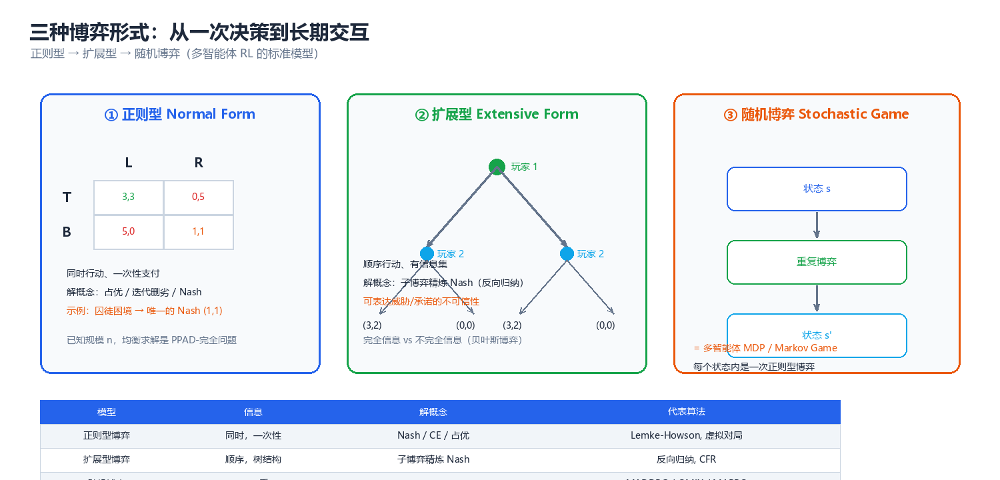
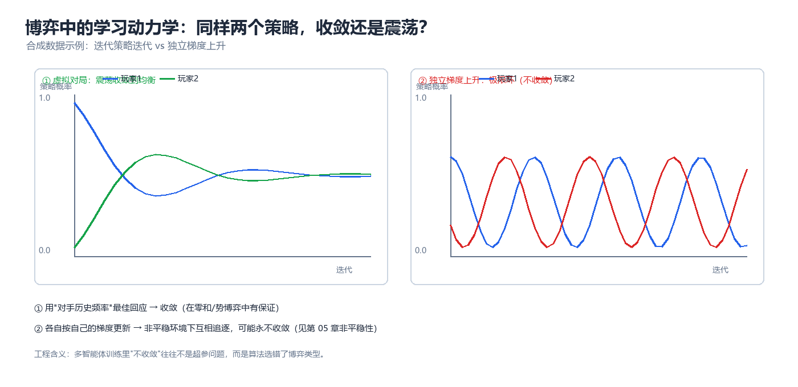

# 第 03 章 博弈论基础（Game Theory）

> 多智能体系统的第一个真问题不是"怎么学"，而是"**会停在哪里**"。博弈论为这个问题提供了完整的语言：**形式化（正则型 / 扩展型 / 随机博弈）→ 解概念（占优、纳什、子博弈精炼、贝叶斯、相关、演化稳定）→ 求解算法（支撑枚举、虚拟对局、反向归纳、CFR、Lemke–Howson、梯度法）**。本章把这三层打通，并给出可直接运行的代码。读完你应当能做到：拿到一个多主体问题 → 写出它的收益矩阵 → 判断该用哪个解概念 → 估计"独立学习会不会收敛"。这一判断能力，是第 04 章（机制设计）与第 05 章（多智能体强化学习）的共同前置条件。

---

## 一、博弈的三种形式化



*图：同一场交互的三种视角 —— 正则型看"选择什么"（收益矩阵），扩展型看"何时知道什么"（博弈树 + 信息集），随机博弈看"反复玩下去"（阶段博弈 + 状态转移）。*

三种形式化不是三种"流派"，而是**三种精度**。选择标准只有一句话：**把"不得不区分的东西"区分开，其余全部压平** —— 分析一次性同时选择用正则型；分析有先后次序、有观察时序的问题（谁先动、谁看见了什么）用扩展型；分析"状态在变、博弈反复发生"的问题（几乎所有 MARL 场景）用随机博弈。

### 1.1 正则型博弈（Normal Form Game）

正则型博弈刻画"所有主体**同时**选择一次"的场景。定义：

$$
G = \left\langle N,\ \{S_i\}_{i \in N},\ \{u_i\}_{i \in N} \right\rangle
$$

- $N = \{1,\dots,n\}$：玩家（player，在多智能体语境下就是 agent）集合；
- $S_i$：玩家 $i$ 的**策略集**（strategy set，也叫纯策略 pure strategy 集）；
- $S = \prod_{i} S_i$：**策略剖面**（strategy profile）的集合，元素记为 $s = (s_i, s_{-i})$，其中 $s_{-i}$ 表示除 $i$ 以外所有人的选择；
- $u_i : S \rightarrow \mathbb{R}$：玩家 $i$ 的**效用/收益函数**（utility / payoff）。

$n = 2$ 且 $|S_1| = |S_2| = 2$ 时，可以用**收益矩阵**（payoff matrix）完整表示。以囚徒困境（Prisoner's Dilemma）为例：

```
                        列玩家 (Column)
                     C: 合作          D: 背叛
                ┌─────────────┬─────────────┐
   行玩家   C   │  (3, 3)     │  (0, 5)     │
 (Row)          ├─────────────┼─────────────┤
            D   │  (5, 0)     │  (1, 1)     │
                └─────────────┴─────────────┘
        括号内 = (行玩家收益, 列玩家收益); 越大的数字越"好"
```

**纯策略 vs 混合策略（mixed strategy）**。纯策略是"选一个动作"；混合策略是 $S_i$ 上的概率分布 $\sigma_i \in \Delta(S_i)$，其中 $\Delta(S_i)$ 是**概率单纯形**（simplex）：

$$
\Delta(S_i) = \left\{ \sigma_i \in \mathbb{R}^{|S_i|} \;:\; \sigma_i(s) \ge 0,\ \sum_{s \in S_i} \sigma_i(s) = 1 \right\}
$$

混合策略的价值不在于"随机化本身"，而在于它**把离散的、非凸的选择集变成连续的、凸的集合** —— 纳什存在性定理（见本章 §3.3、§7）正建立于此；工程上，随机的目的是**让对手无法通过固定应对来套利**（安全博弈、反作弊、拍卖中的应用逻辑，见第 04 章）。

| 概念 | 英文 | 形式记号 | 直觉 | 出现位置 |
|------|------|---------|------|---------|
| 玩家 | Player / Agent | $i \in N$ | 独立决策的主体 | 一切模型 |
| 纯策略 | Pure strategy | $s_i \in S_i$ | 确定的动作选择 | 一次性决策 |
| 混合策略 | Mixed strategy | $\sigma_i \in \Delta(S_i)$ | 动作上的概率分布 | 均衡存在性、反套利 |
| 策略剖面 | Strategy profile | $s$ 或 $\sigma$ | 所有人的选择组合 | 收益函数取值处 |
| 收益/效用 | Payoff / Utility | $u_i(s)$ | 我关心的数值 | 目标函数 |
| 零和 / 常和 | Zero-/Constant-sum | $u_1 = -u_2$ 或 $u_1 + u_2 = c$ | 完全利益冲突（平移等价） | 对抗、竞争定价 |
| 一般和 | General-sum | 无约束 | 既有冲突又有共同利益 | 真实场景默认 |
| 对称博弈 | Symmetric game | $S_i$ 相同、$u$ 交换不变 | 同质智能体群体 | 种群训练、ESS |

> **核心思想**：正则型博弈的全部信息压缩在一张收益矩阵里。**多智能体系统里绝大多数"算法不收敛"的抱怨，本质是这张矩阵从未被写出来过** —— 一旦写出来，"该不该用混合策略""是否存在占优""是否零和"这三个问题立刻就有答案。

### 1.2 扩展型博弈与信息集（Extensive Form Game）

当"谁先动、谁看到了什么"会影响结论时，正则型不够用。扩展型博弈用**树**表示时序与信息：

$$
\Gamma = \left\langle N,\ H,\ Z,\ P,\ f_c,\ \{I_i\}_{i \in N},\ \{u_i\}_{i \in N} \right\rangle
$$

| 符号 | 名称 | 含义 | 工程对应 |
|------|------|------|---------|
| $H$ | 历史（history）集合 | 从根到各决策点的动作序列 | 交互日志 / trajectory 前缀 |
| $Z \subset H$ | 终结历史 | 叶子节点，游戏在此结束 | episode 终止状态 |
| $P : H \setminus Z \rightarrow N$ | 决策者函数 | 该节点由谁行动 | 轮次调度 |
| $f_c$ | 动作函数 | 每个节点可行动作集 | 合法动作掩码（action mask） |
| $I_i$ | **信息集**（information set） | $i$ 无法区分的若干节点集合 | 部分可观测（见第 01 章 §2.2） |
| $u_i : Z \rightarrow \mathbb{R}$ | 叶子收益 | 只在终局结算 | 稀疏奖励 |

**信息集是扩展型博弈的灵魂**：若每个信息集都是单节点（$|I_i| = 1$），称**完美信息**（perfect information，如棋类）；否则称**不完美信息**（imperfect information，如扑克、盲拍、带噪声观测的多机器人控制）。策略在这里定义为 $\sigma_i : I_i \rightarrow \Delta(A(I_i))$ —— **你不能区分的东西，你的策略也无法区别对待**，这正是"策略只能是历史的函数"这一部分可观测约束的博弈论表述。

下面是一个典型的两阶段序贯博弈（市场进入威慑，§4.1 会用代码求解它）：

```
                      进入者 E   (根节点)
                   ┌──────────┴──────────┐
              不进 │                     │ 进入
                   ▼                     ▼
                (0, 2)              在位者 I        ← 一个单节点信息集
                              ┌─────────┴─────────┐
                       价格战 │                   │ 默许
                              ▼                   ▼
                          (-1, 0)              (1, 1)
   叶子收益 = (先动者 E 的收益, 后动者 I 的收益)
```

| 维度 | 正则型博弈 | 扩展型博弈 |
|------|-----------|-----------|
| 时间结构 | 同时行动，一次 | 有先后次序，可多轮 |
| 核心数据结构 | 收益矩阵 $u_i(s)$ | 博弈树 + 信息集 |
| 策略是什么 | $s_i \in S_i$ | 从信息集到动作的映射（**每个信息集都要指定动作**） |
| "知道什么" | 隐含全知 | 显式建模（信息集） |
| 解概念 | 纳什均衡 | **子博弈精炼均衡**（SPE）、序贯均衡、颤抖手完美 |
| 关键工具 | 不动点、支撑枚举 | 反向归纳（backward induction） |
| 典型算法 | 支撑枚举、Lemke–Howson | 反向归纳、CFR |
| 对应 MARL 设定 | 一次性/无状态博弈 | 序贯决策、回合制（turn-based）环境 |

### 1.3 随机博弈（Stochastic Game）与 Markov Game

现实中的多主体交互几乎总是"重复发生、状态在变"。随机博弈（Shapley, 1953）把正则型博弈嵌入马尔可夫链：每个状态 $s$ 上都是一个**阶段博弈**（stage game），结果是状态转移。

$$
\mathcal{M} = \left\langle n,\ S,\ \{A_i\}_{i=1}^{n},\ P,\ \{R_i\}_{i=1}^{n},\ \gamma \right\rangle,
\qquad
P(s' \mid s,\ a_1, \dots, a_n),\quad R_i(s, a_1,\dots,a_n)
$$

在 MARL 文献中同一对象通常叫 **Markov Game**：随机博弈传统上强调"每个状态的阶段博弈 + 求均衡"，Markov Game 传统上强调"策略优化 + 值函数"，它们是同一数学对象的两种问法。

```
    ┌──────────────────┐  联合动作 a_t=(a_1,...,a_n)   ┌──────────────────┐
    │  状态 s_t 的      │ ────────────────────────────► │ 状态 s_{t+1} 的   │
    │  阶段博弈 G(s_t)  │                              │ 阶段博弈 G(s_{t+1})│
    └──────────────────┘ ◄──────────────────────────── └──────────────────┘
            │                                                    │
            └──► 立即收益 R_i(s_t, a_t) 按 γ^t 折扣, 下一状态 s_{t+1} ~ P(·|s_t, a_t)
```

| 解概念 | 定义 | 优点 | 缺点 | 典型场景 |
|--------|------|------|------|---------|
| **折扣化均衡**（discounted equilibrium） | 每个状态上互为最佳回应，对折扣总收益 | 与单智能体 RL 目标一致，可直接值迭代 | 策略依赖折扣因子 $\gamma$ | 绝大多数 MARL 论文 |
| **平均收益均衡**（average-reward equilibrium） | 最优化长期平均收益 | 不依赖 $\gamma$，更接近稳态性能 | 收敛分析更难 | 排队、调度、持续对抗 |
| **阶段博弈均衡**（stage-game NE） | 每个状态独立求纳什 | 简单、可增量求解 | **忽略未来**，可能不是全局均衡 | 短视基线、对手建模 |

均衡值函数满足一个**耦合的** Bellman 型方程（$n$ 个方程互相含有对方的策略）：

$$
V_i^{\pi}(s) = \mathbb{E}_{a \sim \pi(\cdot|s),\, s'\sim P}\Big[\, R_i(s,a) + \gamma \, V_i^{\pi}(s') \,\Big], \qquad i = 1, \dots, n
$$

$V_1$ 的递推里出现 $\pi_2$，$V_2$ 的递推里出现 $\pi_1$ —— **这就是非平稳性（non-stationarity）的数学根源**：每个智能体的最优策略都以别人的策略为自变量，一旦别人更新，"环境"就变了。第 05 章从学习算法角度、强化学习第 09 章 §十从算法思维角度展开过这一主题，本节给出的是它的博弈论骨架。

> ⚠️ **常见误区**：把"零和随机博弈"的极小极大解直接套用到一般和问题上。零和下 $\max\min$ 与均衡等价（von Neumann 定理），一般和下**不存在**这样的单边优化口径 —— 必须解耦合的最优化问题，或退化为求纳什均衡。

### 1.4 三者对照表

| 对照项 | 正则型博弈 | 扩展型博弈 | 随机博弈 / Markov Game |
|--------|-----------|-----------|----------------------|
| 决策时机 | 同时，一次 | 有先后，可多轮 | 反复进行，有限/无限回合 |
| 状态 | 无（或隐式） | 树上的历史 | 显式 $s \in S$，可转移 |
| 核心数据结构 | 收益矩阵 $u_i(s)$ | 博弈树 + 信息集 | $S, \{A_i\}, P, \{R_i\}, \gamma$ |
| 解概念 | 纳什（含混合） | 子博弈精炼（SPE） | 折扣化/平均收益均衡 |
| 求解算法 | 支撑枚举、Lemke–Howson | 反向归纳、CFR | 值迭代、极小极大 Q、MARL |
| 复杂度 | 存在性总有；求解 PPAD-完全 | 一般和 PSPACE-难 | 一般和 PPAD-难 |
| 不完全信息 | 可扩展为贝叶斯博弈 | 信息集天然表达 | 与 Dec-POMDP 结合最复杂 |
| 典型 MARL 对应 | 一次性竞价/拍卖 | 回合制游戏、谈判协议 | 绝大多数 benchmark（SMAC、PettingZoo） |
| 建模判据 | 无状态、单步决策 | 时序与信息结构是关键变量 | **默认起点**（几乎所有学习问题） |

---

## 二、占优与迭代删劣

### 2.1 严格占优与弱占优

"我不管别人怎么做，这个策略都更好" —— 这是博弈论中最强、也最不需要假设的解概念。

| 概念 | 定义 | 记号 | 强度 |
|------|------|------|------|
| **严格占优**（strictly dominant） | $\forall s_{-i}:\ u_i(s_i, s_{-i}) > u_i(s_i', s_{-i})$ | $s_i \succ s_i'$ | 最强：无论别人怎么做都更好 |
| **弱占优**（weakly dominant） | $\forall s_{-i}:\ \ge$，且至少一处严格 | $s_i \succeq s_i'$ | 除平局外都更好 |
| **严格被占优**（strictly dominated） | 存在 $s_i'$ 使上式反向严格成立 | — | 理性主体**绝不会**选择 |
| **弱被占优**（weakly dominated） | 存在 $s_i'$ 弱占优它 | — | 只在特定信念下会被放弃 |
| **混合占优**（mixed dominance） | 被某个**混合策略**严格占优（而非纯策略） | — | 比纯策略占优更强，常被忽略 |

$$
\boxed{\ \forall s_{-i} \in S_{-i}: \quad u_i(s_i, s_{-i}) > u_i(s_i', s_{-i}) \ \Longrightarrow\ s_i \text{ 严格占优 } s_i'\ }
$$

两点必须强调：(1) **占优是"点对点"的逐项比较**，不是"平均更好" —— 平均更好在对手可针对你的场景里没有说服力；(2) **混合占优要多检查一步**，一个纯策略可能不被任何纯策略占优，却被某个混合策略严格占优。此外，**弱占优的删除会改变均衡集合，严格占优的删除不会** —— 这是 IESDS 只删严格劣策略的原因。

> **核心思想**：占优是唯一**不需要对别人做任何假设**的解概念 —— 不需要共同知识、不需要别人也聪明。代价是它常常不存在。一旦不存在，就必须引入"我对别人的预期"，于是有了纳什。

### 2.2 迭代删除严格劣策略（IESDS）

反复删除被严格占优的策略，把策略集合缩小 —— 这就是 **IESDS**（Iterated Elimination of Strictly Dominated Strategies）。它的合法性来自**共同知识理性**（common knowledge of rationality）：我知道所有人理性，我知道我知道所有人理性，如此无穷。它最重要的性质是：

$$
\text{IESDS 的最终结果与删除顺序无关（严格占优情形）}
$$

下面是一个可被 IESDS 完全求解的 3×3 博弈：

```
        轮次 0 (初始)              轮次 1 (删 2 行)       轮次 2 (删 2 列)
        L      C      R
   T  (3,2) (2,0) (1,0)         T  (3,2) (2,0) (1,0)      T  (3,2)
   M  (1,1) (1,0) (0,0)   ──►   (删 M, B: T 逐项更优) ──►  (删 C, R: L 逐项更优)
   B  (0,1) (0,0) (0,0)
                                        ↓
                              唯一存活 (T, L), 收益 (3, 2)
```

```python
# 迭代删除严格劣策略 (IESDS) —— 3x3 占优可解博弈
import numpy as np

A = np.array([[3, 2, 1],      # 行玩家收益矩阵 (行 T,M,B; 列 L,C,R)
              [1, 1, 0],
              [0, 0, 0]], dtype=float)
B = np.array([[2, 0, 0],      # 列玩家收益矩阵
              [1, 0, 0],
              [1, 0, 0]], dtype=float)
rows = ["T", "M", "B"]
cols = ["L", "C", "R"]


def show(A, B, rows, cols, tag):
    print(f"  {tag}  行={rows} 列={cols}")
    for i, r in enumerate(rows):
        print("   " + " ".join(f"({A[i, j]:.0f},{B[i, j]:.0f})" for j in range(len(cols))))


print("=== 初始博弈 ===")
show(A, B, rows, cols, "初始")

for rnd in range(1, 6):
    live_r = list(range(len(rows)))
    live_c = list(range(len(cols)))
    # 1) 行玩家: 找严格被占优的行 (只在当前存活的列上比较)
    dom_rows = set()
    for i in live_r:
        for k in live_r:
            if i != k and np.all(A[i, live_c] < A[k, live_c]):
                dom_rows.add(i)
                print(f"第{rnd}轮: 行 {rows[i]} 被 {rows[k]} 严格占优 -> 删除")
                break
    if dom_rows:
        rows = [r for i, r in enumerate(rows) if i not in dom_rows]
        A = np.delete(A, sorted(dom_rows), axis=0)
        B = np.delete(B, sorted(dom_rows), axis=0)
        show(A, B, rows, cols, "删除后")
        continue
    # 2) 列玩家: 找严格被占优的列
    dom_cols = set()
    for j in live_c:
        for l in live_c:
            if j != l and np.all(B[live_r, j] < B[live_r, l]):
                dom_cols.add(j)
                print(f"第{rnd}轮: 列 {cols[j]} 被 {cols[l]} 严格占优 -> 删除")
                break
    if dom_cols:
        cols = [c for j, c in enumerate(cols) if j not in dom_cols]
        A = np.delete(A, sorted(dom_cols), axis=1)
        B = np.delete(B, sorted(dom_cols), axis=1)
        show(A, B, rows, cols, "删除后")
        continue
    print(f"第{rnd}轮: 已无可删除的严格劣策略")
    break

print(f"\nIESDS 结果: 唯一存活组合 = 行 {rows[0]} × 列 {cols[0]}"
      f"  收益 = ({A[0, 0]:.0f}, {B[0, 0]:.0f})")

# 预期输出:
# === 初始博弈 ===
#   初始  行=['T', 'M', 'B'] 列=['L', 'C', 'R']
#    (3,2) (2,0) (1,0)
#    (1,1) (1,0) (0,0)
#    (0,1) (0,0) (0,0)
# 第1轮: 行 M 被 T 严格占优 -> 删除
# 第1轮: 行 B 被 T 严格占优 -> 删除
#   删除后  行=['T'] 列=['L', 'C', 'R']
#    (3,2) (2,0) (1,0)
# 第2轮: 列 C 被 L 严格占优 -> 删除
# 第2轮: 列 R 被 L 严格占优 -> 删除
#   删除后  行=['T'] 列=['L']
#    (3,2)
# 第3轮: 已无可删除的严格劣策略
#
# IESDS 结果: 唯一存活组合 = 行 T × 列 L  收益 = (3, 2)
```

输出的两个细节：(1) 第 1 轮一次性删掉两行，因为**行玩家只看列是否存活**；(2) 第 3 轮已无可删项，说明这个博弈是**占优可解**（dominance solvable）的。

### 2.3 可理性化与占优可解性

IESDS 需要一个"更好"的候选者。若把标准放松为"**永远不可能是最佳回应**"，就得到更强的删除程序，其不动点叫**可理性化**（rationalizability，Bernheim 1984 / Pearce 1984）：

| 概念 | 删除规则 | 结果集合 | 大小关系 |
|------|---------|---------|---------|
| ND（不删） | — | $S$ | 最大 |
| **IESDS** | $s_i$ 被某个 $s_i'$ 严格占优则删 | 占优可解集 $S^{\text{IESDS}}$ | $\subseteq S$ |
| **可理性化** | $s_i$ 在（对手存活集上）从不是最佳回应则删 | 可理性化集 $R_i$ | $\subseteq S^{\text{IESDS}}$ |
| **纳什支撑** | 均衡中概率为正的策略集合的并 | $\text{Supp}(\text{NE})$ | $\subseteq R_i$（一般情形） |

$$
\text{占优可解} \Longrightarrow \text{唯一纳什均衡} \Longleftrightarrow \text{可理性化集为单点}
$$

反过来**不成立**：唯一纳什均衡常常不是占优可解 —— 匹配硬币是标准反例（见 §7.4），它有唯一混合均衡，但没有任何纯策略被占优，IESDS 一步都删不动。工程含义：IESDS 是"**免费**"的（不依赖任何关于对手的假设，可安全用作预处理剪枝），同时也是"**弱**"的（多数真实博弈处于"什么也删不掉"这一档）。

> ⚠️ **工程提醒**：MARL 中做动作空间剪枝时，只应删除**严格**（最好用混合策略检查过的**严格**）劣策略。删除弱劣策略会切掉均衡 —— 典型翻车场景是"按历史平均收益排名删除表现差的动作"，这在非平稳环境里等价于删除均衡支撑。

---

## 三、纳什均衡

### 3.1 混合策略与期望效用

设行玩家混合策略 $\sigma_1 \in \Delta(S_1)$、列玩家 $\sigma_2 \in \Delta(S_2)$，收益矩阵分别为 $A = (a_{ij})$、$B = (b_{ij})$，则**期望效用**（expected utility）为：

$$
\boxed{\ u_1(\sigma_1, \sigma_2) = \sum_{i=1}^{m} \sum_{j=1}^{n} \sigma_1(i)\, \sigma_2(j)\, a_{ij} = \sigma_1^{\top} A\, \sigma_2,\qquad u_2 = \sigma_1^{\top} B\, \sigma_2\ }
$$

这种"双线性（bilinear）"形式是全部计算的起点，有两个直接推论：**期望效用对 $\sigma_1$ 线性**，所以一旦确定对手策略，最优选择总可以取在**纯策略**上（线性函数在单纯形上的极值在顶点取得）；**对双方同时非凹**，所以"同时优化"不是凸问题 —— 这就是均衡计算困难的根源。

若 $\sigma_2$ 是纯策略 $e_j$，则 $u_1(\sigma_1, e_j) = \sum_i \sigma_1(i) a_{ij}$，即"我在对手出 $j$ 时的加权平均收益"。

### 3.2 最佳回应与不动点

**最佳回应**（best response, BR）是博弈论里唯一的基础运算：

$$
BR_i(\sigma_{-i}) = \arg\max_{\sigma_i \in \Delta(S_i)} u_i(\sigma_i, \sigma_{-i})
= \left\{ \sigma_i \in \Delta(S_i) :\ u_i(\sigma_i, \sigma_{-i}) \ge u_i(\sigma_i', \sigma_{-i})\ \ \forall \sigma_i' \right\}
$$

**纳什均衡**（Nash equilibrium, NE）就是一组合法策略互为最佳回应，即**最佳回应映射的不动点**：

$$
\boxed{\ \sigma^{*} \text{ 是纳什均衡} \iff \sigma_i^{*} \in BR_i(\sigma_{-i}^{*})\ \ \forall i \in N \iff \sigma^{*} \in BR(\sigma^{*})\ }
$$

把它画出来，就是本章最该记住的一张图：

```
                    最佳回应映射 BR: Δ₁ × Δ₂  ⇉  Δ₁ × Δ₂
                  ┌───────────────────────────────────────────┐
                  │                                           │
        Δ₁ × Δ₂   │        σ ──────BR──────►  σ'              │
     (策略单纯形积)│         ▲                  │              │
                  │         │                  │              │
                  │         └──── 不动点 σ* ◄──┘              │
                  │           σ* ∈ BR(σ*)                     │
                  └───────────────────────────────────────────┘
     BR 是"集值"的(用 ⇉ 表示): 可能一次对应多个最佳回应
     -> 不能直接用 Brouwer 不动点, 需要 Kakutani (见 §3.3 / §7)
```

不动点表述带来三个后果：**存在性变成拓扑问题**（只需证明映射把凸紧集映入自身且足够连续）、**计算变成不动点搜索**（Lemke–Howson、虚拟对局都是不动点算法）、**稳定性变成动力学问题**（学习是否收敛到 $\sigma^*$，等价于它是否是"最佳回应动力学"的吸引子，见 §6）。

### 3.3 纳什存在性（Kakutani 不动点，直觉版）

**定理（Nash, 1950）**：任何有限博弈（$|N| < \infty$，$|S_i| < \infty$）在**混合策略**下至少存在一个纳什均衡。

直觉版证明路线（完整证明见 §7）：

1. **构造策略空间** $\Sigma = \Delta(S_1) \times \cdots \times \Delta(S_n)$：有限个单纯形之积，因此紧且凸 —— 两个性质都是关键。
2. **BR 的性质**：集值映射 $BR(\sigma)$ 非空（线性函数在紧集上取到最大值）、凸值（最大化线性函数的解集是凸集）、**上半连续**（收益连续 ⇒ 最佳回应不会"突变消失"）。
3. **套用 Kakutani 定理**：紧凸集上的非空凸值上半连续集值自映射必有不动点 ⇒ 存在 $\sigma^* \in BR(\sigma^*)$。
4. **纯策略均衡不保证存在**：这是"混合策略"的全部意义所在（见 §7.4 的反例）。

```
      有限博弈
          │  混合策略把 Δ(S_i) 变成紧凸集
          ▼
   Σ = Δ(S₁)×…×Δ(Sₙ)   ——紧、凸——
          │                 ▲
          │ BR 非空、凸值、上半连续
          ▼                 │
   BR: Σ ⇉ Σ ──── Kakutani 不动点定理 ────► σ* ∈ BR(σ*)
```

> **核心思想**：纳什存在性不是"技术细节"，而是整个多智能体分析合法性的地基：**它保证"均衡"这个解概念不会空集**，从而"分析系统会停在哪里"永远有意义。它也是第 01 章三大核心定理中的定理 1（见 index.md §7.1）。

### 3.4 计算：支撑枚举求解 2×2 / 2×3 混合均衡

**支撑枚举**（support enumeration）是小规模精确求解的标准方法：假设均衡的**支撑集**（support，概率严格为正的策略集合）大小为 $k$，则"对手无差异条件"给出一个线性方程组。以 $|S| = |T| = k$ 为例，列玩家的混合 $\sigma_2$ 必须让行玩家在 $S$ 上的所有动作收益**完全相等**（否则收益最低那个动作的概率应改为 0）：

$$
\sum_{j \in T} a_{ij}\, \sigma_2(j) = u \quad (\forall i \in S), \qquad \sum_{j \in T} \sigma_2(j) = 1
$$

这是 $(k+1) \times (k+1)$ 的线性系统，解完必须**验证两件事**：支撑内概率 $> 0$，且支撑外动作不构成可获利偏离。这也把"混合均衡 = 无差异条件"这一直觉算法化了。

```python
# 支撑枚举法: 精确求解有限博弈的全部纳什均衡 (含混合)
import itertools
import numpy as np


def support_enumeration(A, B, tol=1e-9):
    """A, B: 行/列玩家的收益矩阵 (m x n). 返回全部 (x, y, u, v)."""
    m, n = A.shape
    sols = []
    for k in range(1, min(m, n) + 1):
        for S in itertools.combinations(range(m), k):      # 行支撑
            for T in itertools.combinations(range(n), k):  # 列支撑
                # 求 y (列玩家混合) 使行玩家在 S 上无差异: A[S][:,T] y = u
                M1 = np.zeros((k + 1, k + 1))
                M1[:k, :k] = A[np.ix_(S, T)]
                M1[:k, k] = -1.0                 # 未知量 [y_T..., u]
                M1[k, :k] = 1.0                  # sum(y) = 1
                b1 = np.zeros(k + 1); b1[k] = 1.0
                # 求 x 使列玩家在 T 上无差异 (用转置写成同样的线性系统)
                M2 = np.zeros((k + 1, k + 1))
                M2[:k, :k] = B[np.ix_(S, T)].T
                M2[:k, k] = -1.0                 # 未知量 [x_S..., v]
                M2[k, :k] = 1.0
                b2 = np.zeros(k + 1); b2[k] = 1.0
                try:
                    yT = np.linalg.solve(M1, b1)
                    xS = np.linalg.solve(M2, b2)
                except np.linalg.LinAlgError:
                    continue                       # 奇异 -> 无穷多解, 跳过
                if np.any(yT[:k] < -tol) or np.any(xS[:k] < -tol):
                    continue                       # 支撑内概率必须 >= 0
                y = np.zeros(n); y[list(T)] = np.clip(yT[:k], 0, None)
                x = np.zeros(m); x[list(S)] = np.clip(xS[:k], 0, None)
                x, y = x / x.sum(), y / y.sum()
                u, v = x @ A @ y, x @ B @ y
                # 验证: 没有任何可获利的偏离
                if np.any(A @ y > u + 1e-7) or np.any(x @ B > v + 1e-7):
                    continue
                sols.append((x, y, u, v))
    # 去重 (相同解可能来自不同支撑的退化情形)
    uniq = []
    for s in sols:
        if not any(np.allclose(s[0], t[0], atol=1e-6) and
                   np.allclose(s[1], t[1], atol=1e-6) for t in uniq):
            uniq.append(s)
    return uniq


def report(name, A, B, row_names, col_names):
    print(f"=== {name} ===")
    for i in range(len(row_names)):
        print("   " + row_names[i] + ": " + "  ".join(
            f"({A[i, j]:g},{B[i, j]:g})" for j in range(len(col_names))))
    print("  解 (概率按 " + "/".join(row_names) + "  与  " + "/".join(col_names) + " 排列):")
    for x, y, u, v in support_enumeration(A, B):
        xs = " ".join(f"{v_:.4f}" for v_ in x)
        ys = " ".join(f"{v_:.4f}" for v_ in y)
        kind = "纯策略" if (x.max() > 1 - 1e-9 and y.max() > 1 - 1e-9) else "混合策略"
        print(f"   x=[{xs}]  y=[{ys}]  期望收益=({u:.4f}, {v:.4f})  [{kind}]")
    print()


# 1) 2x2: 性别战 (Battle of the Sexes)
A1 = np.array([[2.0, 0.0], [0.0, 1.0]])
B1 = np.array([[1.0, 0.0], [0.0, 2.0]])
report("2x2 性别战", A1, B1, ["O", "B"], ["O", "B"])

# 2) 2x2: 匹配硬币 (Matching Pennies) —— 零和, 只有唯一混合均衡
A2 = np.array([[1.0, -1.0], [-1.0, 1.0]])
B2 = -A2
report("2x2 匹配硬币 (零和)", A2, B2, ["H", "T"], ["H", "T"])

# 3) 2x3: 行玩家 2 策略, 列玩家 3 策略 (第 3 个动作是严格劣策略)
A3 = np.array([[3.0, 1.0, 0.0],
               [1.0, 3.0, 0.0]])
B3 = np.array([[2.0, 0.0, -1.0],
               [0.0, 2.0, -1.0]])
report("2x3 非零和", A3, B3, ["U", "D"], ["L", "M", "R"])

# 预期输出:
# === 2x2 性别战 ===
#    O: (2,1)  (0,0)
#    B: (0,0)  (1,2)
#   解 (概率按 O/B  与  O/B 排列):
#    x=[1.0000 0.0000]  y=[1.0000 0.0000]  期望收益=(2.0000, 1.0000)  [纯策略]
#    x=[0.0000 1.0000]  y=[0.0000 1.0000]  期望收益=(1.0000, 2.0000)  [纯策略]
#    x=[0.6667 0.3333]  y=[0.3333 0.6667]  期望收益=(0.6667, 0.6667)  [混合策略]
#
# === 2x2 匹配硬币 (零和) ===
#    H: (1,-1)  (-1,1)
#    T: (-1,1)  (1,-1)
#   解 (概率按 H/T  与  H/T 排列):
#    x=[0.5000 0.5000]  y=[0.5000 0.5000]  期望收益=(0.0000, 0.0000)  [混合策略]
#
# === 2x3 非零和 ===
#    U: (3,2)  (1,0)  (0,-1)
#    D: (1,0)  (3,2)  (0,-1)
#   解 (概率按 U/D  与  L/M/R 排列):
#    x=[1.0000 0.0000]  y=[1.0000 0.0000 0.0000]  期望收益=(3.0000, 2.0000)  [纯策略]
#    x=[0.0000 1.0000]  y=[0.0000 1.0000 0.0000]  期望收益=(3.0000, 2.0000)  [纯策略]
#    x=[0.5000 0.5000]  y=[0.5000 0.5000 0.0000]  期望收益=(2.0000, 1.0000)  [混合策略]
```

怎么读这个输出：**性别战有 3 个均衡**（两个纯均衡 + 混合均衡 $(2/3,1/3)$ vs $(1/3,2/3)$），而混合均衡收益 $(0.667, 0.667)$ **低于**两个纯均衡 —— 这是"均衡不唯一且效率不一"的标准样本，**纳什均衡不告诉你"该停在哪一个"**（均衡选择问题的来源，也解释了第 05 章自博弈为何会"锁定在某个均衡"）。**匹配硬币只有一个混合均衡** $(0.5,0.5)$；**2×3 里 $R$ 是严格劣策略**，混合均衡只在 $\{L,M\}$ 上，支撑枚举自动恢复了 IESDS 的结论。注意其组合复杂度 $\sum_k \binom{m}{k}\binom{n}{k}$ 是**指数级**，$m=n=10$ 已不现实 —— 这正是 §5 各种多项式/启发式算法的用武之地。

---

## 四、其他解概念


*图：解概念地图 —— 从最强的占优均衡到最弱的相关均衡，越往下"存在性越好、计算越容易"，但"预测力越弱"。*

纳什均衡是中心，但不是唯一。选择解概念的标准是**你能付得起多少假设**：假设越强，解越精确但越容易不存在；假设越弱，解越容易存在但预测力越弱。

### 4.1 子博弈精炼与反向归纳（Backward Induction）

纳什均衡允许**不可信威胁**（non-credible threat）：对手声称"你若进入我就打价格战"，即使真打起来对方自己亏更多。**子博弈精炼均衡**（subgame perfect equilibrium, SPE）要求"**在每一个子博弈上也必须是纳什均衡**"，从而排除这类威胁。求解方法是**反向归纳**（backward induction）：**从叶子向根**逐层求解，每个决策节点选择收益最大的动作。其合法性来自动态规划原则 —— 后一段的最优选择与前面怎么走到这里无关。

```python
# 扩展型博弈 + 反向归纳 (Backward Induction): 市场进入威慑
# 树用嵌套 dict 表示; "idx" 是该决策者在收益元组中的下标
tree = {
    "player": "进入者 E", "idx": 0,
    "actions": {
        "不进 (Out)": (0.0, 2.0),                 # 叶节点: (E 收益, 在位者 I 收益)
        "进入 (In)": {
            "player": "在位者 I", "idx": 1,
            "actions": {
                "打价格战 (Fight)": (-1.0, 0.0),   # 双方都受损
                "默许 (Accommodate)": (1.0, 1.0),  # 和平共处
            },
        },
    },
}


def backward_induction(node, depth=0):
    """自底向上求子博弈精炼均衡: 返回 (该子树的均衡收益向量, 最优动作链)"""
    if not isinstance(node, dict):                 # 叶节点 -> 直接是收益向量
        return node, []
    best_val, best_act, best_chain = None, None, []
    for act, child in node["actions"].items():
        val, chain = backward_induction(child, depth + 1)
        if best_val is None or val[node["idx"]] > best_val[node["idx"]]:
            best_val, best_act, best_chain = val, act, chain
    print("  " * depth + f"[{node['player']}] 理性选择 {best_act} -> 收益 {best_val}")
    return best_val, [best_act] + best_chain


print("=== 反向归纳求解过程 (自底向上) ===")
eq_val, path = backward_induction(tree)

print("\n=== 结果 ===")
print("子博弈精炼均衡路径: " + " -> ".join(path))
print(f"均衡收益 (E, I) = {eq_val}")
print("\n对比: 若 E 相信 I 会『真的』打价格战 (-1, 0), E 会选『不进』得 0;")
print("      但 I 在『进入』子博弈里理性地选默许 (1 > 0), 所以威胁不可信。")

# 预期输出:
# === 反向归纳求解过程 (自底向上) ===
#   [在位者 I] 理性选择 默许 (Accommodate) -> 收益 (1.0, 1.0)
# [进入者 E] 理性选择 进入 (In) -> 收益 (1.0, 1.0)
#
# === 结果 ===
# 子博弈精炼均衡路径: 进入 (In) -> 默许 (Accommodate)
# 均衡收益 (E, I) = (1.0, 1.0)
#
# 对比: 若 E 相信 I 会『真的』打价格战 (-1, 0), E 会选『不进』得 0;
#       但 I 在『进入』子博弈里理性地选默许 (1 > 0), 所以威胁不可信。
```

| 维度 | 纳什均衡 | 子博弈精炼均衡 |
|------|---------|---------------|
| 要求 | 整体上没人愿偏离 | **每个子博弈**内部也没人愿偏离 |
| 是否排除不可信威胁 | 否 | 是 |
| 求解方法 | 不动点 / LP / 支撑枚举 | 反向归纳（完美信息博弈必然可解） |
| 存在性 | 有限博弈必存在 | 完美信息有限博弈必存在（Zermelo） |
| 复杂度 | PPAD-完全 | 完美信息下多项式 |
| MARL 对应 | 同时行动的自博弈 | 回合制游戏、树搜索（AlphaZero 类自博弈） |
| 陷阱 | 可能有不可信威胁均衡 | 不完美信息下需"序贯均衡/颤抖手完美"加强 |

> ⚠️ **反向归纳有一处著名争议**：蜈蚣博弈（centipede game）中反向归纳预测"第一步就结束"，而实验里人类常合作到很深。这说明**共同知识理性**是强假设。工程结论是：**不要假设对手完全理性**，而要显式建模对手（对手建模、种群训练、策略池）—— 这也解释了 CFR 这类"不需要理性假设的迭代算法"（§5.2）为何在实战中大受欢迎。

### 4.2 贝叶斯博弈与不完全信息

前面假设"收益矩阵是共同知识"。当**收益或类型是私有信息**时（我不知道你的成本、偏好、是否有备用电源），用**贝叶斯博弈**（Bayesian game，Harsanyi 1967–68）：

$$
\Gamma_B = \left\langle N,\ \{\Theta_i\},\ p(\theta_1, \dots, \theta_n),\ \{A_i\},\ \{u_i(a, \theta)\} \right\rangle
$$

其中 $\theta_i \in \Theta_i$ 是玩家 $i$ 的**类型**（type，刻画其私有信息），$p$ 是类型的**共同先验**分布。Harsanyi 的关键洞察：**把"不完全信息"转成"自然先选类型 + 完全信息博弈"**（Harsanyi 转换），于是所有工具继续可用，只是策略变成"从类型到动作的映射" $\sigma_i(\theta_i)$。

**贝叶斯纳什均衡**（Bayesian Nash equilibrium, BNE）：

$$
\boxed{\ \sigma_i^{*}(\cdot \mid \theta_i) \in \arg\max_{\sigma_i}\ \mathbb{E}_{\theta_{-i} \sim p(\cdot \mid \theta_i)} \Big[\, u_i\big(\sigma_i,\, \sigma_{-i}^{*}(\theta_{-i}),\, \theta_i,\, \theta_{-i}\big) \,\Big], \qquad \forall i,\ \forall \theta_i \in \Theta_i\ }
$$

| 维度 | 完全信息博弈 | 贝叶斯（不完全信息）博弈 |
|------|-------------|------------------------|
| 共同知识 | 收益矩阵、动作集 | 只有**类型分布** $p(\theta)$ |
| 私有信息 | 无 | 类型 $\theta_i$ |
| 策略形式 | $\sigma_i \in \Delta(A_i)$ | $\sigma_i(\cdot \mid \theta_i)$：**类型 → 动作** |
| 均衡概念 | 纳什均衡 | 贝叶斯纳什均衡（BNE） |
| 关键运算 | 最佳回应 | 对后验分布的**期望**最佳回应 |
| 典型场景 | 规则完全透明 | 拍卖（估值私有）、谈判（底价私有）、安全博弈 |
| MARL 对应 | 共享状态的多智能体 | 私有观测 + 隐式类型推断 |

对 MARL 的直接启示：**"私有信息 + 先验"就是对手建模（opponent modeling）的形式化**。当你说"我的智能体需要推测对手的意图/类型"时，你其实在做贝叶斯推断：从对手历史动作更新对 $\theta_{-i}$ 的后验，再对后验做最佳回应。第 05 章的自博弈与种群训练、第 06 章的通信（把私有类型变成可分享的信息）都可看作这一结构的工程化近似。

### 4.3 相关均衡（Correlated Equilibrium）

纳什均衡要求随机化是**独立**的。如果存在一个**可信的第三方 / 公共随机信号**，允许玩家之间相关随机化，就得到**相关均衡**（Aumann, 1974）：仲裁者按公开分布 $p$ 抽取建议组合 $s \sim p$，私下告诉每个玩家 $s_i$；每个玩家收到建议后**没有任何偏离的动机**：

$$
\boxed{\ \forall i,\ \forall s_i,\ s_i': \quad \sum_{s_{-i}} p(s_i, s_{-i}) \left[\, u_i(s_i, s_{-i}) - u_i(s_i', s_{-i}) \,\right] \ \ge\ 0\ }
$$

这组**线性不等式**（加上 $p \ge 0$、$\sum p = 1$）构成一个**凸多面体** —— 于是"求相关均衡"是**线性规划**（LP），多项式时间可解；而"求纳什均衡"是 PPAD-完全。这是解概念地图上最重要的一处"用假设换计算"的交换。

```python
# 相关均衡 (Correlated Equilibrium) 的线性约束 + 顶点枚举
# 只用 numpy: CE 可行集是凸多面体, 线性目标的最优值必在顶点取得,
# 因此枚举"3 个不等式约束取等号 + 概率和为 1"的全部交点即可。
import itertools
import numpy as np

A = np.array([[2.0, 0.0], [0.0, 1.0]])   # 性别战: 行玩家收益
B = np.array([[1.0, 0.0], [0.0, 2.0]])   # 性别战: 列玩家收益
m, n = A.shape


def ce_constraints(A, B):
    """返回 CE 的全部线性不等式系数 (M, b), 形式 M @ p <= b (此处 b = 0)"""
    rows = []
    for i in range(m):                       # 行玩家: 不想从 i 偏到 k
        for k in range(m):
            if i != k:
                coef = np.zeros((m, n))
                for j in range(n):
                    coef[i, j] = A[k, j] - A[i, j]
                rows.append(coef.ravel())
    for j in range(n):                       # 列玩家: 不想从 j 偏到 l
        for l in range(n):
            if j != l:
                coef = np.zeros((m, n))
                for i in range(m):
                    coef[i, j] = B[i, l] - B[i, j]
                rows.append(coef.ravel())
    return np.array(rows), np.zeros(len(rows))


M, b = ce_constraints(A, B)
print(f"CE 的偏离激励约束条数 = {M.shape[0]}, 概率变量数 = {m * n}\n")


def is_ce(p, tol=1e-9):
    """检查分布 p (m x n) 是否满足全部激励相容不等式与标准化"""
    return (np.abs(p.sum() - 1) < tol and np.all(p > -tol)
            and np.all(M @ p.ravel() <= tol))


print("检查纯策略均衡 (O,O)     是 CE ?", is_ce(np.array([[1, 0], [0, 0]], float)))
mn = np.array([[2 / 3 * 1 / 3, 2 / 3 * 2 / 3],     # 混合纳什: x=(2/3,1/3), y=(1/3,2/3)
               [1 / 3 * 1 / 3, 1 / 3 * 2 / 3]])
print("检查混合纳什均衡          是 CE ?", is_ce(mn))
corr = np.array([[0.5, 0.0], [0.0, 0.5]])    # 抛公平硬币: 同时建议 (O,O) 或 (B,B)
print("检查『抛硬币协调』分布    是 CE ?", is_ce(corr))
print("它是乘积分布吗? ", bool(abs(corr[0, 0] * corr[1, 1] - corr[0, 1] * corr[1, 0]) < 1e-12),
      " -> 乘积分布才对应纳什均衡\n")

# ---- 顶点枚举: 穷举 CE 多面体的极点 (线性目标最优值必落在顶点) ----
ineq = np.vstack([M, -np.eye(m * n)])        # 再加 p >= 0 约束
verts = []
for combo in itertools.combinations(range(len(ineq)), 3):   # 4 个未知量: 3 约束 + 1 等式
    S = np.vstack([ineq[list(combo)], np.ones((1, m * n))])
    if abs(np.linalg.det(S)) < 1e-12:
        continue
    p = np.linalg.solve(S, np.array([0, 0, 0, 1.0]))
    if is_ce(p, 1e-9):
        verts.append(p)
uniq = []
for p in verts:                              # 去重
    if not any(np.allclose(p, q, atol=1e-7) for q in uniq):
        uniq.append(p)
print(f"CE 多面体顶点数 = {len(uniq)}")
for p in uniq:
    P = p.reshape(m, n)
    u, v = (P * A).sum(), (P * B).sum()
    is_product = abs(P[0, 0] * P[1, 1] - P[0, 1] * P[1, 0]) < 1e-9
    tag = "乘积分布(=纳什)" if is_product else "非乘积(纯相关, 非纳什)"
    print(f"  p={np.round(P, 4).tolist()}  期望收益=({u:.4f}, {v:.4f})  {tag}")

print("\n结论: 相关均衡集合严格大于纳什均衡集合 —— 存在 CE 但非 NE 的分布,")
print("      这正是引入『可信第三方信号/仲裁者』的数学依据。")

# 预期输出:
# CE 的偏离激励约束条数 = 4, 概率变量数 = 4
#
# 检查纯策略均衡 (O,O)     是 CE ? True
# 检查混合纳什均衡          是 CE ? True
# 检查『抛硬币协调』分布    是 CE ? True
# 它是乘积分布吗?  False  -> 乘积分布才对应纳什均衡
#
# CE 多面体顶点数 = 5
#   p=[[0.2222, 0.4444], [0.1111, 0.2222]]  期望收益=(0.6667, 0.6667)  乘积分布(=纳什)
#   p=[[-0.0, 0.0], [0.0, 1.0]]  期望收益=(1.0000, 2.0000)  乘积分布(=纳什)
#   p=[[0.25, 0.5], [-0.0, 0.25]]  期望收益=(0.7500, 0.7500)  非乘积(纯相关, 非纳什)
#   p=[[0.4, -0.0], [0.2, 0.4]]  期望收益=(1.2000, 1.2000)  非乘积(纯相关, 非纳什)
#   p=[[1.0, 0.0], [0.0, -0.0]]  期望收益=(2.0000, 1.0000)  乘积分布(=纳什)
#
# 结论: 相关均衡集合严格大于纳什均衡集合 —— 存在 CE 但非 NE 的分布,
#       这正是引入『可信第三方信号/仲裁者』的数学依据。
```

> 📌 **关于求解器**：本例刻意只用 `numpy`（`scipy` 未安装时也能跑）。若环境有 `scipy.optimize.linprog`，标准做法是直接解 LP（在"$u_j \ge u_j^{\text{NE}}$"约束下最大化某个 $u_i$）。顶点枚举只适用于变量极少（$mn \lesssim 4$）的情形，规模一大就必须用 LP/内点法。

输出说明三件事：**(1) 纳什均衡 ⊆ 相关均衡**（前两个检查都是 `True`）；**(2)** 顶点 $(0.75,0.75)$、$(1.20,1.20)$ 处的分布**不是乘积分布**，因此**不对应任何纳什均衡** —— 这就是相关均衡"多出来的东西"；**(3)** 这两个纯相关均衡的收益**高于**混合纳什均衡的 $(0.667,0.667)$，即**信号协调能提升效率**。这是机制设计里"引入仲裁者/平台/可信第三方"的数学依据（第 04 章）。

| 维度 | 纳什均衡 | 相关均衡 |
|------|---------|---------|
| 随机化结构 | 各玩家**独立**随机的乘积分布 | 存在**任意相关**的公共分布 $p$ |
| 定义方式 | 不动点 $\sigma^* \in BR(\sigma^*)$ | 一组**线性不等式** |
| 几何形状 | 一般非凸、离散点集 | **凸多面体** |
| 存在性 | 有限博弈必存在 | 总存在（凸紧集非空） |
| 计算复杂度 | PPAD-完全 | 多项式（LP） |
| 是否总包含纳什 | — | 是（NE 是特殊情形） |
| 效率 | 可能很低（如混合均衡） | 可达到比所有 NE 更高的共同收益 |
| 实现要求 | 无 | 需要一个**可信的公开信号源** |
| 典型应用 | 自博弈均衡 | 交通协调、平台调度、协议标准 |

### 4.4 演化稳定策略（ESS）

前面的解概念都假设"玩家是理性最大化者"。**演化稳定策略**（evolutionarily stable strategy, ESS，Maynard Smith & Price 1973）换一个假设：**策略通过复制/模仿传播，适应度高的策略占比变大**。定义（$x$ 为主流策略，$y$ 为入侵变异）：

$$
\boxed{\ u(x, x) > u(y, x), \quad \text{或} \quad u(x, x) = u(y, x)\ \text{且}\ u(x, y) > u(y, y)\ }
$$

第一条件是"对入侵者的直接优势"，第二条件是"平局时的稳定性（二次打击条件）"。ESS 是**动态稳定性**概念：它保证小扰动下会被拉回。标准动力学是**复制子动力学**（replicator dynamics，Taylor & Jonker 1978）：

$$
\boxed{\ \dot{x}_i = x_i \left[\, u(e_i, x) - u(x, x) \,\right]\ }
$$

即"增长率 ∝ 该策略相对平均水平的超额收益"。这与强化学习中的交叉学习、策略梯度在多智能体下的某些特例在形式上是同源的 —— 这是"演化博弈论"与"MARL"之间最重要的桥梁。

```python
# 演化稳定策略 (ESS): 鹰鸽博弈的复制子动力学收敛到内部混合均衡 V/C
import numpy as np

V, C = 2.0, 4.0            # 资源价值 V, 打斗代价 C (C > V 时存在内部 ESS)
# 行 = 我的策略, 列 = 对手策略; 收益顺序为 (鹰, 鸽)
M = np.array([[(V - C) / 2, V],      # 我出鹰: 遇鹰平分净损, 遇鸽独得资源
              [0.0, V / 2]])         # 我出鸽: 遇鹰退让得 0, 遇鸽平分
print(f"鹰鸽博弈支付矩阵 (V={V:g}, C={C:g}): 鹰 vs 鹰 = {(V - C) / 2:g}, "
      f"鹰 vs 鸽 = {V:g}, 鸽 vs 鸽 = {V / 2:g}")
print(f"理论内部 ESS = V/C = {V / C:.4f} (鹰的比例)\n")


def payoffs(p):
    """对手以 p = (鹰比例, 鸽比例) 出招时, 鹰/鸽两种策略的期望收益"""
    return M @ p


for start in (0.02, 0.98):
    p = start
    traj = []
    for _ in range(1000):
        u = payoffs(np.array([p, 1 - p]))
        avg = p * u[0] + (1 - p) * u[1]
        p = p * (1.0 + 0.05 * (u[0] - avg))          # 复制子动力学 (离散版)
        p = p / (p + (1 - p) * (1.0 + 0.05 * (u[1] - avg))) if p > 0 else 0.0
        traj.append(p)
    print(f"起点 鹰比例 = {start:<5g} -> 1000 步后 = {traj[-1]:.4f}  "
          f"(|p - V/C| = {abs(traj[-1] - V / C):.5f})")
    for k in (0, 49, 999):
        print(f"    第 {k + 1:>4d} 步: 鹰比例 = {traj[k]:.4f}")
print("\n结论: 内部 ESS 处两种策略收益相等, 任何偏离都被拉回 -> 演化稳定。")

# 预期输出:
# 鹰鸽博弈支付矩阵 (V=2, C=4): 鹰 vs 鹰 = -1, 鹰 vs 鸽 = 2, 鸽 vs 鸽 = 1
# 理论内部 ESS = V/C = 0.5000 (鹰的比例)
#
# 起点 鹰比例 = 0.02  -> 1000 步后 = 0.5000  (|p - V/C| = 0.00000)
#     第    1 步: 鹰比例 = 0.0210
#     第   50 步: 鹰比例 = 0.1624
#     第 1000 步: 鹰比例 = 0.5000
# 起点 鹰比例 = 0.98  -> 1000 步后 = 0.5000  (|p - V/C| = 0.00000)
#     第    1 步: 鹰比例 = 0.9781
#     第   50 步: 鹰比例 = 0.6622
#     第 1000 步: 鹰比例 = 0.5000
#
# 结论: 内部 ESS 处两种策略收益相等, 任何偏离都被拉回 -> 演化稳定。
```

输出与理论完全一致：**从 2% 鹰和 98% 鹰两个极端出发都收敛到 $V/C = 0.5$**（`|p - V/C| = 0.00000`），说明内部混合均衡是**渐近稳定**的。注意这里的"混合均衡"可解释为**种群中策略的比例**（个体仍用纯策略），这是 ESS 与纳什的哲学差别：前者是"种群比例"，后者是"个体随机化"，两者在 2 策略对称博弈里数值相同。

| 维度 | 纳什均衡 | 演化稳定策略（ESS） |
|------|---------|-------------------|
| 主体 | 完全理性的决策者 | 种群中被复制/模仿的策略 |
| 均衡是什么 | 策略组合 | 种群比例分布（或该主体策略） |
| 稳定性来源 | 无人愿偏离（一次性比较） | 小扰动后被动力学拉回 |
| 动力学 | 无内禀动力学 | 复制子动力学 |
| 关系 | ESS ⇒ 纳什均衡（对称博弈）；反之不成立 | 存在 NE 但非 ESS 的情形 |
| MARL 对应 | 策略梯度/自博弈的收敛点 | 种群训练、进化算法、PSRO |
| 工程价值 | 描述"停在哪" | 描述"能否守住""是否抗种群入侵" |

> **核心思想**：纳什均衡是**静态**的（一次比较，"不想动"），ESS 是**动态**的（被推开后会回来）。工程上你几乎总要问后者：训练出的策略在对手换人、参数漂移、噪声扰动下还能不能守住？这就是 PSRO/种群训练（第 05 章）与鲁棒性评估（第 09 章）的动机。

### 4.5 解概念关系总表

| 解概念 | 英文 | 核心假设 | 存在性 | 计算复杂度 | 与纳什的关系 | 典型用途 |
|--------|------|---------|--------|-----------|-------------|---------|
| 占优均衡 | Dominant strategy EQ | 无需假设对手 | 极少存在 | 多项式 | $\subseteq$ NE | 真实性机制（VCG） |
| IESDS 结果 | Dominance solvable set | 共同知识理性 | 可为空 | 多项式 | 若单点则 = NE | 动作空间剪枝 |
| 可理性化 | Rationalizability | 迭代最佳回应 | 非空（有限博弈） | 多项式 | $\supseteq$ NE 支撑 | 策略空间界定 |
| **纳什均衡** | Nash equilibrium | 理性 + 共同知识 | **有限博弈必存在**（混合） | PPAD-完全 | 基准 | 分析/学习目标 |
| 子博弈精炼 | Subgame perfect EQ | 完全信息 + 序贯理性 | 完美信息有限博弈必存在 | 完美信息多项式 | $\subseteq$ NE | 序贯决策、树搜索 |
| 序贯均衡 | Sequential equilibrium | 不完美信息 + 一致性 | 有限博弈必存在 | PSPACE-难 | $\subseteq$ NE | 扑克、谈判 |
| 贝叶斯纳什 | Bayesian Nash EQ | 类型先验共同知识 | 有限类型游戏必存在 | 困难（类型爆炸） | 完全信息下退化为 NE | 拍卖、对手建模 |
| **相关均衡** | Correlated equilibrium | 存在可信公共信号 | **总存在** | **多项式（LP）** | $\supseteq$ NE | 协调平台、协议 |
| 演化稳定策略 | ESS | 复制/模仿动力学 | 不保证存在 | 一般困难 | $\subseteq$ NE（对称） | 种群、鲁棒性 |
| 社会最优 | Social optimum | 存在中心协调者 | 总存在 | 一般 NP-难 | 与 NE 无包含关系 | 效率上界 |

$$
\text{占优均衡} \;\subseteq\; \text{纳什均衡} \;\subseteq\; \text{相关均衡},
\qquad
\text{ESS} \;\subseteq\; \text{纳什均衡（对称博弈）}
$$

而**社会最优与纳什之间没有包含关系**：这是囚徒困境（NE 差于社会最优）与"低效强制协调"（强制均衡差于自由 NE）的共同来源，也是第 04 章全部动机的起点。

---

## 五、均衡求解算法全景

所有算法都在回答同一个问题：**怎么找到不动点**（或不动的性质）。选择算法的第一问不是"哪个最快"，而是"**这个博弈属于哪一类**"。

### 5.1 虚拟对局与最佳回应动力学

**虚拟对局**（fictitious play, Brown 1951）是最古老也最直观的均衡学习算法：每个玩家维护"对手历史动作的**经验频率**"估计，每轮**对经验频率做最佳回应**（best response to empirical frequencies），重复并观测经验频率是否收敛到均衡。

| 博弈类型 | 虚拟对局的收敛性 | 依据 |
|---------|----------------|------|
| 两人零和 | **收敛**到均衡 | Robinson (1951) |
| 两人 $2 \times N$ | 收敛 | Berger (2005) 等 |
| **势博弈**（potential game） | 收敛（势函数单调） | Monderer & Shapley (1996) |
| 一般和有限博弈 | **可能周期震荡、不收敛** | Shapley (1964) 的 3×3 反例 |
| 零和连续博弈 | 平均意义下收敛 | 连续时间版本 |

```python
# 虚拟对局 (Fictitious Play): 每个玩家对"对手的经验频率"做最佳回应
import numpy as np


def fictitious_play(A, B, T, seed=0):
    rng = np.random.default_rng(seed)
    m, n = A.shape
    cnt_r, cnt_c = np.ones(m), np.ones(n)      # 统计各自"出过的动作"次数 (先验 +1)
    hist = []
    for _ in range(T):
        x, y = cnt_r / cnt_r.sum(), cnt_c / cnt_c.sum()   # 对手经验频率的估计
        # 最佳回应 (并列时随机选一个, 模拟真实学习中的抖动)
        bi = rng.choice(np.flatnonzero(np.isclose(A @ y, (A @ y).max())))
        bj = rng.choice(np.flatnonzero(np.isclose(B.T @ x, (B.T @ x).max())))
        cnt_r[bi] += 1
        cnt_c[bj] += 1
        hist.append((cnt_r / cnt_r.sum(), cnt_c / cnt_c.sum()))
    return hist


T = 2000
games = [("匹配硬币 (零和, 均衡 1/2)", np.array([[1.0, -1.0], [-1.0, 1.0]])),
         ("石头剪刀布 (零和, 均衡 1/3)",
          np.array([[0.0, -1.0, 1.0], [1.0, 0.0, -1.0], [-1.0, 1.0, 0.0]]))]
for name, M in games:
    k = len(M)
    hist = fictitious_play(M, -M, T, seed=7)
    head = " ".join(f"{'P(' + str(i + 1) + ')':>9}" for i in range(k))
    print(f"=== {name}: 虚拟对局, 行玩家经验频率 (理论值 = {1 / k:.4f}) ===")
    print(f"{'迭代 t':>8} {head}  最大偏离")
    for t in (10, 100, 1000, 2000):
        x, _ = hist[t - 1]
        vals = " ".join(f"{v:>9.4f}" for v in x)
        print(f"{t:>8} {vals}  {np.abs(x - 1 / k).max():>8.4f}")

# 预期输出:
# === 匹配硬币 (零和, 均衡 1/2): 虚拟对局, 行玩家经验频率 (理论值 = 0.5000) ===
#     迭代 t      P(1)      P(2)  最大偏离
#       10    0.6667    0.3333    0.1667
#      100    0.4902    0.5098    0.0098
#     1000    0.4840    0.5160    0.0160
#     2000    0.4865    0.5135    0.0135
# === 石头剪刀布 (零和, 均衡 1/3): 虚拟对局, 行玩家经验频率 (理论值 = 0.3333) ===
#     迭代 t      P(1)      P(2)      P(3)  最大偏离
#       10    0.4615    0.3077    0.2308    0.1282
#      100    0.3883    0.3107    0.3010    0.0550
#     1000    0.3101    0.3539    0.3360    0.0233
#     2000    0.3330    0.3155    0.3515    0.0181
```

读法：**匹配硬币的经验频率从 0.667 逐步逼近 0.5**（2000 步后最大偏离 0.0135），与"零和博弈虚拟对局收敛"（Robinson 1951）一致。石头剪刀布同样在收敛，但**慢得多且波动明显**（0.128 → 0.018），因为最佳回应在三个动作间循环。

> ⚠️ 不要把这个结论外推：**虚拟对局在一般和博弈中不保证收敛**（Shapley 1964 反例）。同一个算法换一个博弈类型，结论就从"收敛"变成"震荡" —— 这正是 §6 的主题。

### 5.2 逆序归纳与 CFR

**反向归纳**（§4.1）适用于完美信息；对不完美信息（如扑克）要换成 **CFR**（counterfactual regret minimization，Zinkevich et al. 2007）。核心洞见：不直接求均衡，而是**最小化每个信息集上的"遗憾"**（regret）——"如果当初一直用某个动作，能多赚多少"：

- **反事实遗憾**：在"我到达这个信息集的概率"加权下，动作 $a$ 相对当前策略的超额收益；
- **遗憾匹配**（regret matching）：下一轮策略 $\propto \max(R_i^a, 0)$，把概率分配给曾经后悔没用的动作；
- **收敛保证**（零和）：平均策略遗憾以 $O(1/\sqrt{T})$ 趋于零 ⇒ **平均策略收敛到纳什均衡**：

$$
R_i^{T} \le \Delta_i \sqrt{|A_i|\,T}, \qquad \text{平均策略可利用度（exploitability）} = O\!\left(1/\sqrt{T}\right)
$$

| 对比项 | 反向归纳 | CFR |
|--------|---------|-----|
| 适用信息结构 | 完美信息 | 不完美信息（信息集） |
| 求解对象 | 子博弈精炼均衡（精确） | 平均策略逼近纳什均衡（近似） |
| 计算量 | 与树规模线性 | 与树规模 × 迭代数线性 |
| 是否需要理性假设 | 需要（共同知识理性） | **不需要**（对任意对手都降低遗憾） |
| 实际应用 | 棋类搜索、回合制游戏 | 德州扑克（Libratus、Pluribus） |
| 与 MARL 的关系 | 树搜索式自博弈 | 自博弈 + 遗憾最小化的工程范式 |
| 主要局限 | 大规模不完美信息下不可行 | 收敛慢，需抽象（abstraction） |

CFR 对第 05 章的启示：**"降低遗憾"比"最大化收益"在对抗环境中更稳健** —— 因为"最小化最大遗憾"直接对应零和的极小极大目标，而"最大化期望收益"在与非平稳对手交互时是在追逐一个移动目标。

### 5.3 Lemke–Howson 思路

对一般（非零和）两方博弈，**Lemke–Howson**（1964）是最经典的组合算法：**把均衡写成标注（label）问题**（两侧标注恰好互补覆盖全部标签 ⇔ 均衡），在"策略单纯形之积"上定义带标签的多面体 $P = \{(x,y) \ge 0 : x^\top B \le 1,\ A y \le 1\}$，再从一个人工"全标注"顶点出发，**沿"只差两个标签的边"做互补枢轴（complementary pivoting）**，路径终点给出一个完全标注点 = 一个纳什均衡。

```
   起点(人工顶点)                 沿着"缺两个标签的边"走
   ┌───────────┐    ┌───────────┐    ┌───────────┐         ┌───────────┐
   │ 标签 {1,2}│──► │ 标签 {1,4} │──► │ 标签 {3,4} │ ── ... ─►│ 完全标注   │
   └───────────┘    └───────────┘    └───────────┘         │ = 纳什均衡 │
        ▲                                                   └───────────┘
        └── 每次枢轴只换一个标签 (与单纯形法同一套字典操作)
```

| 性质 | 说明 | 工程含义 |
|------|------|---------|
| 找到什么 | **恰好一个**均衡（不是全部） | 无法用来枚举均衡集合 |
| 复杂度 | 最坏指数（同单纯形法），实际快 | 小规模可用，大规模不可行 |
| 理论地位 | 单方博弈是"路径跟随 = 存在性证明" | 帮助理解 PPAD-完全 |
| 解的路径依赖 | 起点不同结果可能不同 | 换起点可能找到不同均衡 |
| 退化（degeneracy） | 需字典序/符号扰动 | 实现细节多 |
| 替代方案 | 支撑枚举、同伦延拓、进化式搜索 | 工程上常选后者 |

> **核心思想**：PPAD-完全（Daskalakis, Goldberg & Papadimitriou 2006）告诉我们的不是"别做了"，而是**"精确求一般和博弈的均衡是本性困难的"**。于是工程实践转向三类替代：小规模用枚举、大规模用**学习/近似**（虚拟对局、MARL 自博弈）、需要可控性时用**相关均衡的 LP**。

### 5.4 连续博弈的梯度方法

动作空间连续时（连续竞价、连续控制、GAN 式对抗），均衡用**梯度动力学**求解：每个玩家沿自己收益的梯度上升，$\dot{x}_i = \nabla_{x_i} u_i(x)$。**关键负面事实**：零和博弈中同时梯度上升**通常不收敛**，而是进入旋转轨道 —— 因为博弈的梯度场不是某个全局势函数的梯度（不可积），只有**哈密顿结构**。Balduzzi et al. (2018)《The Mechanics of n-Player Differentiable Games》系统化了这一观察：

| 方法 | 思路 | 适用 | 代价 |
|------|------|------|------|
| 同时梯度上升（SGA） | 各自沿自己的梯度走 | 势博弈（可收敛） | 零和/一般和下常震荡 |
| 交替更新（alternating） | 轮流更新一方 | 部分双线性博弈可收敛 | 对时序敏感、易锁定 |
| 辛梯度调整（symplectic） | 修正到哈密顿方向 | 零和/对抗 | 需 Hessian 或近似 |
| 正则化 / 乐观（optimistic） | 加熵或"乐观项" | 收敛性更好 | 引入新超参 |
| 外推（extragradient） | 两步外推 | 凸凹零和**保证收敛** | 每步两次梯度 |

如果博弈是**势博弈**（存在 $\Phi$ 使每个玩家的收益差等于 $\Phi$ 的差），梯度上升就是在 $\Phi$ 上爬山 ⇒ 单调提升、有界收敛。第 05 章"训练不动/来回拉锯"的现象，绝大多数可以通过检验"这到底是不是势博弈"来解释（§6.2）。

### 5.5 算法对比与收敛性表

| 算法 | 适用博弈 | 输出 | 收敛保证 | 复杂度 | 需知道收益矩阵 | 实践建议 |
|------|---------|------|---------|--------|--------------|---------|
| IESDS | 一般 | 可解集 | 有限步终止 | 多项式 | 需要 | 预处理剪枝 |
| 支撑枚举 | 小规模一般和 | **全部** NE | 精确 | $\sum_k \binom{m}{k}\binom{n}{k}$ | 需要 | $m,n \le 6$ 时好用 |
| Lemke–Howson | 两方一般和 | 一个 NE | 有限步（可能指数） | 最坏指数 | 需要 | 小/中规模，实现复杂 |
| 同伦延拓 | 两方一般和 | 一个 NE | 路径跟随 | 与步长相关 | 需要 | 数值稳健但调参 |
| LP（相关均衡） | 任意有限博弈 | 一个 CE | **多项式** | poly | 需要 | 需要可信信号源时首选 |
| 虚拟对局 | 零和/势博弈 | 经验频率 → NE | 零和/势博弈收敛 | 每轮 $O(mn)$ | 需要 | 最易实现，先跑它 |
| CFR | 零和不完美信息 | 平均策略 → NE | $O(1/\sqrt{T})$ | 每轮 × 树规模 | 需要 | 大规模扑克类首选 |
| 梯度法（SGA） | 连续博弈 | 轨道/均衡 | **仅势博弈**保证 | 每步梯度 | 需要 | 零和要加正则化/辛修正 |
| MARL（Q/策略梯度） | 随机博弈 | 近似均衡 | 视博弈类型 | 样本复杂度高 | **不需要** | 收益/转移未知时唯一出路 |

---

## 六、学习动力学：收敛还是震荡



*图：同一个算法、同一组超参，换一个博弈类型，结果就可能在"收敛"与"极限环"之间切换 —— 这是多智能体学习中"不收敛"现象最常见的真实原因。*

### 6.1 石头剪刀布上的独立梯度上升

把学习法则设成最朴素的"各自沿自己的收益梯度上升"，在石头剪刀布上跑 3000 步：

```python
# 石头剪刀布上的独立学习: 复制子动力学 (replicator dynamics) -> 极限环, 不收敛
import numpy as np

A = np.array([[0.0, -1.0, 1.0],      # 行玩家支付矩阵 (零和: 列玩家 = -行玩家)
              [1.0, 0.0, -1.0],
              [-1.0, 1.0, 0.0]])


def replicator(p, payoffs, eta=0.1):
    """离散复制子更新: p_i <- p_i (1 + eta * (u_i - u_bar)), 再归一化"""
    avg = float(p @ payoffs)
    p = p * (1.0 + eta * (payoffs - avg))
    return np.clip(p, 0.0, None) / np.clip(p, 0.0, None).sum()


for eta in (0.05, 0.20):
    x = np.array([0.6, 0.2, 0.2])            # 行玩家策略 (石/剪/布), 起点明显偏离均匀
    y = np.array([0.2, 0.2, 0.6])            # 列玩家策略
    print(f"=== 复制子动力学, 学习率 eta = {eta} (同时更新, 各自最大化期望收益) ===")
    print(f"{'迭代 t':>8} {'P(石)':>8} {'P(剪)':>8} {'P(布)':>8} "
          f"{'‖x-1/3‖₁':>10} {'行方收益':>10}")
    for t in range(1, 3001):
        x = replicator(x, A @ y, eta)                  # 行玩家的复制子动力学
        y = replicator(y, -(x @ A), eta)               # 零和: 列玩家收益 = -x^T A
        if t in (1, 50, 100, 500, 1000, 3000):
            print(f"{t:>8} {x[0]:>8.4f} {x[1]:>8.4f} {x[2]:>8.4f} "
                  f"{np.abs(x - 1 / 3).sum():>10.4f} {x @ A @ y:>10.4f}")
    print(f"  -> 3000 步后仍未收敛: ‖x - 1/3‖₁ = {np.abs(x - 1 / 3).sum():.4f} "
          f"(理论均衡处应为 0)")
    print()

# 预期输出:
# === 复制子动力学, 学习率 eta = 0.05 (同时更新, 各自最大化期望收益) ===
#     迭代 t     P(石)     P(剪)     P(布)   ‖x-1/3‖₁       行方收益
#        1   0.6072   0.1944   0.1984     0.5477     0.1597
#       50   0.5603   0.1390   0.3008     0.4539    -0.1217
#      100   0.1960   0.2442   0.5598     0.4530    -0.0069
#      500   0.4806   0.1382   0.3813     0.3904     0.0172
#     1000   0.1543   0.2326   0.6130     0.5594     0.1653
#     3000   0.1937   0.5355   0.2708     0.4043    -0.1942
#   -> 3000 步后仍未收敛: ‖x - 1/3‖₁ = 0.4043 (理论均衡处应为 0)
#
# === 复制子动力学, 学习率 eta = 0.2 (同时更新, 各自最大化期望收益) ===
#     迭代 t     P(石)     P(剪)     P(布)   ‖x-1/3‖₁       行方收益
#        1   0.6288   0.1776   0.1936     0.5909     0.1550
#       50   0.2344   0.5352   0.2304     0.4038    -0.1627
#      100   0.1622   0.7154   0.1225     0.7641     0.0815
#      500   0.0358   0.4041   0.5601     0.5950     0.2185
#     1000   0.1285   0.8715   0.0000     1.0764    -0.6593
#     3000   0.0000   0.0032   0.9968     1.3270    -0.0032
#   -> 3000 步后仍未收敛: ‖x - 1/3‖₁ = 1.3270 (理论均衡处应为 0)
```

这段输出把"不收敛"的两种情况都摆出来了：

```
     eta = 0.05: 有界极限环                  eta = 0.20: 螺旋发散到边界
  P                     P(石)                P                     P(布)
  │  ┌──┐   ┌──┐                             │                ┌────┐
  │ ┌┘  └─┐┌┘  └─┐  ← 围着 (1/3,1/3,1/3)    │        ┌──────┘    └──┐
  │┌┘     └┘     └┐   绕圈, 但不收敛          │  ┌────┘               └──┐
  └──────────────────────► t                 └────────────────────────────► t
    ‖x-1/3‖₁ 在 0.39~0.65 之间反复摆动         收敛到 0/0/1 的纯策略顶点
    (均衡点是中心, 不是吸引子)                 (均衡不稳定, 被彻底甩开)
```

两个理论解释：**(1) 零和博弈的复制子动力学保持一个哈密顿量**（$\prod_i x_i$ 的某种组合为常数），轨道是**闭曲线**（极限环）而非收敛轨线 —— 均衡是**中心**（center），不是吸引子；**(2) 离散化效应**：连续时间下轨道有界，但欧拉式离散更新（步长 $\eta$ 较大）会把"闭轨道"变成"外旋螺旋" ⇒ 直接发散。这就是 MARL 里**学习率一调大就彻底崩**的几何原因。

> ⚠️ **工程诊断规则**：如果你的多智能体训练表现为"周期性来回摆"，先不要加正则化/调网络，先检查**这游戏是不是零和或近似零和**。若是，正确做法是改变算法（正则化、辛梯度、极小极大、CFR 类），而不是调超参。

### 6.2 为什么多智能体 RL 的"不收敛"往往是博弈类型问题

| 观测现象 | 最可能的博弈论原因 | 对应解概念 | 处方 |
|---------|------------------|-----------|------|
| 训练曲线周期性摆动、永不平稳 | 零和/近似零和 + 同时更新（极限环） | 极小极大鞍点 | 极小极大目标、CFR、正则化梯度 |
| 一调大学习率就发散 | 离散化破坏哈密顿结构（§6.1） | — | 降步长、交替更新或二阶方法 |
| 收敛了但性能远低于预期 | 均衡效率低（混合均衡不如纯均衡） | 纳什 vs 社会最优 | 第 04 章：改机制、加协调信号 |
| 不同随机种子收敛到不同性能 | 均衡不唯一 + 算法有偏 | 均衡选择 | 种群训练/PSRO 覆盖多个均衡 |
| A 训练时好、换对手就崩 | 策略过拟合到某个对手 | ESS（非演化稳定的均衡） | 对手池 + 鲁棒评估（第 09 章） |
| 大家都"收敛"到永远摸鱼 | 社会困境（囚徒困境型） | NE ≠ 社会最优 | 重复博弈 + 声誉/惩罚（第 04 章） |
| 收敛慢但方向对 | 对经验频率做最佳回应 | 势博弈 | 保证在，慢慢跑；用势函数引导 |
| 概率长期停在 0/1 | 主动遗忘 + 均衡在边界 | 纯策略均衡 | 加熵正则/探索下限 |

$$
\text{不收敛} \;\neq\; \text{"算法有 bug"}; \qquad
\text{不收敛} \;=\; \text{"该博弈类型下, 这个动力学没有吸引子"}
$$

> **核心思想**：**先定博弈类型，再选学习动力学**。多智能体 RL 文献里大多数"稳定性"结论都要加"在**势博弈**/零和/单调博弈中"这样的限定词 —— 这不是学术上的谨小慎微，而是因为**结论本身依赖于博弈类型**（见强化学习第 09 章 §十对同类问题的讨论）。把博弈类型判断错，调参只能延后失败。

### 6.3 与第 05 章的衔接

| 本章内容 | 在第 05 章中的角色 | 具体机制 |
|---------|------------------|---------|
| 随机博弈 / Markov Game（§1.3） | MARL 的标准问题形式 | CTDE、集中式 critic、值分解的前提 |
| 纳什均衡与非平稳性（§3） | "学习目标"的定义 | 每个智能体的最优策略依赖他人 ⇒ 环境漂移 |
| 势博弈 / 收敛条件（§5.5、§6） | 收敛性证明的必要条件 | 单调博弈、势博弈、IGM 条件 |
| 均衡选择与 ESS（§4.4、§4.5） | 种群训练与鲁棒性 | PSRO、自博弈策略池、league training |
| 相关均衡与信号（§4.3） | 通信与协调的实现 | 公共信号、共享随机数、约定（第 06 章） |
| 贝叶斯博弈（§4.2） | 对手建模与私有信息 | 类型推断、信念更新、通信式 MARL |

一句话：**第 03 章定义"会停在哪里"，第 05 章解决"环境未知时怎么走到那里"**。如果本章的收益矩阵写不出来，第 05 章的算法选择就只能是随机的 —— 这也是本知识库把第 03 章放在第 05 章之前的原因（见 index.md §5.2 的学习路径）。

---

## 七、理论进阶：Nash 存在性的不动点证明

本节的目的是让"纳什均衡一定存在"从一句口号，变成一个你能复述证明骨架的结论。

### 7.1 Kakutani 不动点定理

**定理（Kakutani, 1941）**：设 $K \subseteq \mathbb{R}^d$ 是**非空、紧、凸**集合，$F: K \rightrightarrows K$ 是**集值映射**（correspondence），满足

1. **非空值**：$\forall x \in K$，$F(x) \neq \varnothing$；
2. **凸值**：$\forall x \in K$，$F(x)$ 是凸集；
3. **上半连续**（upper hemicontinuity, UHC）：对任意 $x_n \to x$、$y_n \in F(x_n)$、$y_n \to y$，必有 $y \in F(x)$；

则存在 $x^{*} \in K$ 使 $x^{*} \in F(x^{*})$。三个前提的分工是理解整个证明的钥匙：

| 前提 | 数学来源 | 在纳什证明中由什么保证 |
|------|---------|---------------------|
| 非空、紧、凸 | 拓扑/几何 | $\Sigma = \prod_i \Delta(S_i)$ 是有限个单纯形之积 |
| $F$ 非空值 | 最优化存在性 | 连续函数在紧集上取到最大值 |
| $F$ 凸值 | 线性结构 | "最大化线性函数的解集"是凸集 |
| $F$ 上半连续 | 收益连续性 | $u_i$ 关于 $\sigma$ 是多项式（连续），最大化不"突变" |

> ⚠️ 常见误区：**不能直接用 Brouwer 不动点定理**。因为 $BR(\sigma)$ 一般是**多值**的（对手策略恰使我两个动作无差异时，任何一个混合都是最佳回应），单一连续函数无法取到"整个解集"。这正是 Kakutani 存在的理由。

### 7.2 最佳回应映射的性质

记 $\Sigma = \prod_{i \in N} \Delta(S_i)$，$BR: \Sigma \rightrightarrows \Sigma$，$BR(\sigma) = \prod_i BR_i(\sigma_{-i})$ 且 $BR_i(\sigma_{-i}) = \arg\max_{\sigma_i' \in \Delta(S_i)} u_i(\sigma_i', \sigma_{-i})$。逐条验证 Kakutani 的前提：

**引理 1（$\Sigma$ 紧且凸）**：$\Delta(S_i) = \{x \in \mathbb{R}^{|S_i|} : x \ge 0,\ \mathbf{1}^\top x = 1\}$ 是有限条线性约束定义的有界闭凸集，故紧且凸；有限个紧凸集之积仍紧凸。∎

**引理 2（$BR$ 非空、凸值）**：固定 $\sigma_{-i}$ 时，$\sigma_i' \mapsto u_i(\sigma_i', \sigma_{-i}) = \sigma_i'^\top (A \sigma_{-i})$ 是**连续线性**函数；连续函数在紧集 $\Delta(S_i)$ 上取到最大值 ⇒ 非空。最大值点集合是线性泛函取最大值的水平集，即 $(\Delta(S_i)) \cap \{x: c^\top x = \max\}$（$c = A\sigma_{-i}$）—— 线性约束与线性等式的交 ⇒ 凸。∎

**引理 3（$BR$ 上半连续）**：只需证图 $\{(x,y) : y \in BR(x)\}$ 是闭集（图闭 + 值有界 ⇒ UHC）。设 $(\sigma^{(n)}, \tau^{(n)}) \to (\sigma, \tau)$ 且 $\tau^{(n)} \in BR(\sigma^{(n)})$。对任意 $\tau'$，由 $\tau^{(n)} \in BR(\sigma^{(n)})$ 有 $u_i(\tau_i^{(n)}, \sigma_{-i}^{(n)}) \ge u_i(\tau_i', \sigma_{-i}^{(n)})$；令 $n \to \infty$，由 $u_i$ 的**连续性**得 $u_i(\tau_i, \sigma_{-i}) \ge u_i(\tau_i', \sigma_{-i})$，故 $\tau \in BR(\sigma)$。∎

三点合起来说明：**$BR$ 恰好是 Kakutani 定理可以套用的那类映射**。

### 7.3 存在性证明

**定理（Nash, 1950）**：设 $N$ 有限、每个 $S_i$ 有限，则博弈至少存在一个混合策略纳什均衡。

**证明**：取 $\Sigma = \prod_i \Delta(S_i)$（引理 1：非空紧凸）。定义 $F = BR: \Sigma \rightrightarrows \Sigma$。由引理 2，$F(\sigma) \ne \varnothing$ 且为凸集；由引理 3，$F$ 上半连续。故满足 Kakutani 定理的全部前提，存在

$$
\sigma^{*} \in F(\sigma^{*}) = BR(\sigma^{*})
\iff \sigma_i^{*} \in BR_i(\sigma_{-i}^{*})\ \ \forall i
\iff \sigma^{*} \text{ 是纳什均衡}. \qquad \blacksquare
$$

> **核心思想**：存在性证明的骨架是"**把问题变成凸紧集上的不动点问题**"。混合策略的作用是把策略集从"有限离散点集"变成"紧凸单纯形"—— 没有凸性，Kakutani 用不上；没有混合策略，存在性直接失效（见 §7.4）。这也解释了为什么第 05 章的一类算法（正则化策略优化、熵正则）能改善收敛：**正则化把策略从单纯形边界推回内部，等价于在凸集内部工作**。

### 7.4 混合策略为何必要（纯策略不存在的反例）

**命题**：存在有限博弈，**没有任何纯策略纳什均衡**。

**反例（匹配硬币 Matching Pennies）**：双方同时出示硬币正反面，相同则行玩家赢 1，不同则列玩家赢 1（零和）：

```
                            列玩家
                      H (正面)       T (反面)
                ┌──────────────┬──────────────┐
   行玩家   H   │   (1, -1)    │   (-1, 1)    │   ← 没有对号入座式的纯均衡
                ├──────────────┼──────────────┤
            T   │   (-1, 1)    │   (1, -1)    │
                └──────────────┴──────────────┘
     逐格检查: 每个格子里至少有一方想单独偏离
        (H,H): 列玩家想改出 T → 换成 (H,T) 得 +1
        (H,T): 行玩家想改出 T → 换成 (T,T) 得 +1
        (T,T): 列玩家想改出 H → 换成 (T,H) 得 +1
        (T,H): 行玩家想改出 H → 换成 (H,H) 得 +1
        ⇒ 纯策略均衡数量 = 0
```

验证：唯一均衡是**双方各以 1/2 混合**（§3.4 的支撑枚举输出证实：`x=[0.5 0.5] y=[0.5 0.5]`，期望收益 $(0,0)$）。这个反例给出三条重要推论：

| 推论 | 内容 | 影响 |
|------|------|------|
| 1 | 纯策略空间**不是凸集** ⇒ 不动点定理无法套用 ⇒ 均衡可能不存在 | 混合策略是把离散选择"凸化"的必要手段 |
| 2 | 混合均衡处"**每个人的每个动作收益都相同**"（无差异） | 均衡策略由**对手**决定，而非自己（$2/3$ 由对手的收益矩阵算出） |
| 3 | 零和的混合均衡 = **鞍点**，值唯一（此例 $v = 0$） | 对抗型任务的"最优"是概率化的、不可预测的 |

**工程含义**：(1) **"确定性策略最优"在对抗环境里是错的** —— 零和/近似零和场景（对抗攻击、RoboSumo、安全博弈、竞价）中确定性策略一定被利用，必须让策略在均衡支撑上随机化（或用熵正则强制非退化）；(2) **混合均衡的收益可以很低**（性别战混合均衡 0.667 < 纯均衡 2），所以"训练到纳什均衡"不保证"性能好" —— 效率问题必须靠机制设计（第 04 章）或均衡选择解决；(3) **可预测性本身就是被利用的对象**，一个每局用同一初始策略的对手等价于暴露了纯策略，这正是策略池/种群训练（第 05 章）要解决的问题，与 §4.3 相关均衡中"公共信号让随机化相关化"是同一件事的两面。

---

## 附：本章速查表

**三种形式化**

| 形式 | 一句话 | 何时用 | 关键符号 |
|------|--------|--------|---------|
| 正则型 | 同时选一次，收益矩阵 | 单步/无状态决策 | $G = \langle N, \{S_i\}, \{u_i\}\rangle$ |
| 扩展型 | 有先后、有信息集 | 时序与信息结构是核心 | $\Gamma = \langle N, H, Z, P, f_c, \{I_i\}, \{u_i\}\rangle$ |
| 随机博弈 | 阶段博弈 + 状态转移 | 默认起点（几乎所有 MARL） | $\langle n, S, \{A_i\}, P, \{R_i\}, \gamma\rangle$ |

**核心公式**

| 名称 | 公式 |
|------|------|
| 期望效用（双线性） | $u_1 = \sigma_1^\top A \sigma_2$，$u_2 = \sigma_1^\top B \sigma_2$ |
| 最佳回应 | $BR_i(\sigma_{-i}) = \arg\max_{\sigma_i} u_i(\sigma_i, \sigma_{-i})$ |
| 纳什均衡 | $\sigma^{*} \in BR(\sigma^{*})$ |
| 支撑枚举的无差异条件 | $\sum_{j \in T} a_{ij}\sigma_2(j) = u\ (\forall i \in S)$ |
| 随机博弈均衡值 | $V_i^{\pi}(s) = \mathbb{E}[R_i + \gamma V_i^{\pi}(s')]$（跨智能体耦合） |
| 贝叶斯纳什均衡 | $\sigma_i^*(\cdot \mid \theta_i) = \arg\max \mathbb{E}_{\theta_{-i} \mid \theta_i}[u_i]$ |
| 相关均衡约束 | $\sum_{s_{-i}} p(s_i, s_{-i})[u_i(s_i,s_{-i}) - u_i(s_i',s_{-i})] \ge 0$ |
| 复制子动力学 | $\dot{x}_i = x_i[u(e_i,x) - u(x,x)]$ |
| ESS 条件 | $u(x,x) > u(y,x)$，或相等且 $u(x,y) > u(y,y)$ |
| CFR 遗憾界 | $R_i^{T} \le \Delta_i\sqrt{\lvert A_i\rvert\,T}$ |

**解概念强度（记忆口诀）**

$$
\text{占优} \subsetneq \text{IESDS} \subsetneq \text{可理性化},
\qquad
\text{占优} \subsetneq \text{Nash} \subsetneq \text{相关均衡},
\qquad
\text{ESS} \subsetneq \text{Nash（对称博弈）},
\qquad
\text{Nash} \not\subseteq \text{社会最优}
$$

**算法选择决策（按"知不知道收益/转移"分叉）**

| 你的情况 | 首选算法 | 次选 |
|---------|---------|------|
| 收益矩阵已知，$m,n \le 6$ | 支撑枚举（要全部均衡） | Lemke–Howson（只要一个） |
| 收益已知，零和 | 线性规划 / 极小极大 | CFR、虚拟对局 |
| 收益已知，势博弈 | 虚拟对局、最佳回应动力学 | 梯度上升 |
| 收益已知，一般和、大规模 | 学习类近似 | 相关均衡 LP（若需要效率） |
| 收益/转移未知 | MARL（第 05 章） | 自博弈 + 种群训练 |
| 需要"抗背叛/抗入侵" | ESS 检验 + 复制子动力学 | 对手池评估 |

**"不收敛"三问**（先问再调参）

1. 这游戏是**零和**吗？→ 是则用极小极大/CFR/正则化，别用同时梯度上升。
2. 是**势博弈**吗？→ 是则虚拟对局/梯度上升都收敛，慢是正常的，别乱加正则。
3. 是**一般和**吗？→ 那么"不收敛/多均衡"是本性，需要种群训练 + 鲁棒评估。

**三条最容易踩的坑**

| 坑 | 后果 | 正确做法 |
|----|------|---------|
| 用平均收益排名删"劣动作" | 删掉均衡支撑 | 只删**严格**（含混合）劣策略 |
| 假设对手完全理性 | 反向归纳在不可信威胁下预测错误 | 显式对手建模 / 用 CFR 类算法 |
| 认为"训练到均衡 = 性能好" | 停在低效混合均衡（性别战 0.667 < 2） | 用机制设计/信号协调提升效率（第 04 章） |

> **下一步**：均衡告诉我们"自利主体会停在哪里"，但它不保证那里是好的。下一章把方向反过来问：**如果我希望它们停在某个地方，规则该怎么设计？** —— [第 04 章 机制设计与社会选择](./04-mechanism-design.md)。
