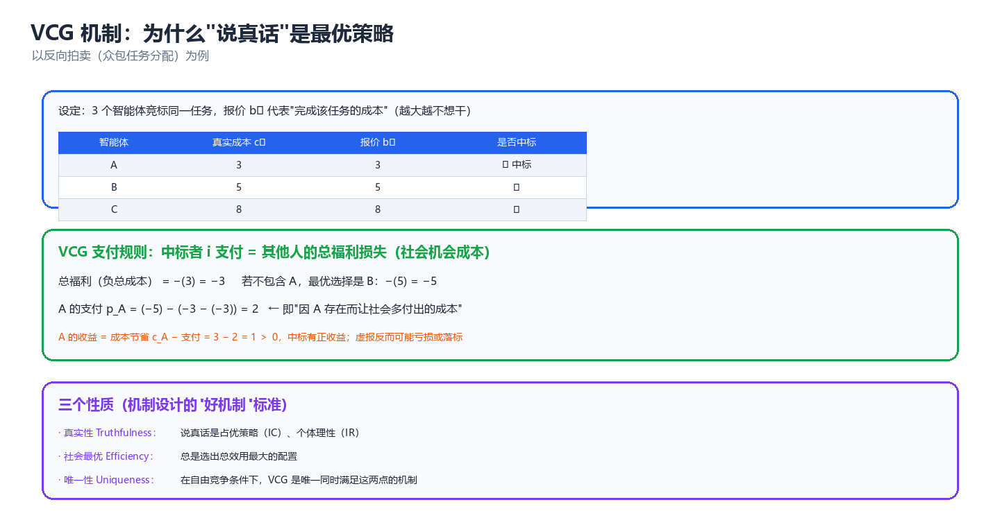
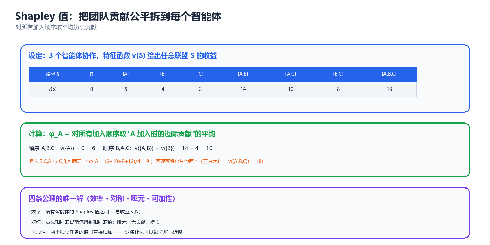

# 第 04 章 机制设计与社会选择（Mechanism Design & Social Choice）

> 前三章回答的是"给定规则，自利的主体们会停在哪里"；这一章问反问题——**如果我们希望它们停在某个地方，规则本身该怎么设计**。机制设计是"逆博弈论"：把博弈论当工程工具用；社会选择则是它不带货币转移的那个硬核分支，用几条不可能定理划定了"任何规则都做不到什么"的天花板。

---

## 一、社会选择与不可能性

社会选择理论（Social Choice Theory）研究一个最朴素的问题：**一群人各有各的偏好，如何把它们变成一个集体决策？** 它之所以是机制设计的起点，是因为它用几条"不可能定理"告诉了我们：**在没有转移支付的一般偏好下，"既公平又防操纵又非独裁"的规则根本不存在**。理解了这些天花板，才能明白为什么后面几节要靠拍卖、匹配、Shapley 值这些"带结构"的工具来绕开它们。

### 1.1 偏好聚合问题（社会选择函数 vs 社会福利函数）

先形式化。假设有一组**备选方案（alternatives）** $X$，$|X| \ge 3$；有 $n$ 个**代理人（agents）**，每人持有一个对 $X$ 的**偏好排序**（preference ordering）$R_i$——一个完整的、可传递的弱序（weak order），记 $a \succ_i b$ 表示 $i$ 认为 $a$ 严格优于 $b$，$a \succeq_i b$ 表示弱优于。全体代理人的偏好构成一个**偏好剖面（preference profile）**：

$$
R = (R_1, R_2, \dots, R_n) \in \mathcal{R}^n
$$

其中 $\mathcal{R}$ 是可容许排序的集合（若允许任意排序，称**无限制定义域**）。所谓"聚合"，就是要从这个剖面出发，得到一个集体判断。两种常见的输出对象：

| 输出对象 | 英文 | 记法 | 输出什么 | 典型场景 |
|---------|------|------|---------|---------|
| **社会选择函数** | Social Choice Function (SCF) | $f: \mathcal{R}^n \to X$ | 一个（或一组）胜出方案 | 评奖、选方案、选 leader |
| **社会选择对应** | Social Choice Correspondence (SCC) | $F: \mathcal{R}^n \rightrightarrows X$ | 一个非空方案集合 | 出现平局时保留多个 |
| **社会福利函数** | Social Welfare Function (SWF) | $F: \mathcal{R}^n \to \mathcal{R}$ | 一个完整的社会排序 | 需要给全部方案排名 |

SCF 与 SWF 的差别在**输出粒度**：SCF 只关心"谁赢"，SWF 关心"整张社会榜单"。Arrow 不可能定理（§1.2）针对的是 SWF——它比 SCF 要求更强，因此也更容易撞墙；Gibbard–Satterthwaite 定理（§1.3）针对的是 SCF。两者是同一枚硬币的两面。

下图给出社会选择的最基本管线——注意"偏好剖面"是唯一输入，全部困难都源自"输入是私有的、且可能被谎报"：

```
           私有偏好 (可能谎报!)
  R_1  ──┐
  R_2  ──┼──►  ┌──────────────────┐  ──►  社会决策
  ...  ──┤     │  聚合规则 / 机制  │        (x 或 社会排序)
  R_n  ──┘     └──────────────────┘
                  ▲            │
                  │            ▼
             (设计者选择)   结果对每个人意味着什么
```

> **核心思想**：社会选择的问题不是"算不出结果"，而是**输入信息本身不可信、且聚合规则会扭曲激励**。一个"好"的规则要同时对抗两个敌人：个体偏好之间可能毫无共识（Condorcet 循环），以及个体有动机歪曲报告（策略投票）。

一个立刻能感受到的困难是**多数决的循环（Condorcet Paradox）**。当 3 位选民偏好为 $A \succ B \succ C$、$B \succ C \succ A$、$C \succ A \succ B$ 时，两两多数决给出 $A \succ B$、$B \succ C$、$C \succ A$——**集体偏好不传递**。这意味着"谁赢"严重依赖赛程安排（议程操纵，agenda manipulation）。见 §2.1 的实跑。

### 1.2 Arrow 不可能定理（四个条件 + 直觉证明）

Kenneth Arrow（1951）问了一个极简的问题：**什么样的社会福利函数 $F$ 才算"合理"？** 他给出四个看起来谁都不会反对的条件。

| 条件 | 英文 | 含义 | 是否苛刻 |
|------|------|------|---------|
| **U 无限制定义域** | Unrestricted Domain | 任意个体偏好剖面都必须是合法输入 | 中 |
| **P 弱帕累托** | Weak Pareto / Pareto Principle | 若所有人都认为 $a \succ b$，则社会也须认为 $a \succ b$ | 低（几乎不可放弃） |
| **IIA 无关备选独立性** | Independence of Irrelevant Alternatives | 社会对 $a,b$ 的相对排序只取决于各人对 $a,b$ 的相对排序，与 $c$ 无关 | 高（最可疑，但去掉后定理失效） |
| **ND 非独裁** | Non-Dictatorship | 不存在某个 $i$ 使社会排序永远等于他的私人排序 | 低（民主的最低要求） |

**Arrow 不可能定理**：

$$
\boxed{\ \text{若 } |X| \ge 3 \text{，则任何同时满足 U、P、IIA 的社会福利函数 } F \text{ 必定是独裁的}\ }
$$

换句话说：**U + P + IIA $\Rightarrow$ ND 不成立**。四条里必须牺牲一条。

**直觉证明（决定性集合法）**。证明的核心是"决定性（decisive）"这个概念：称一个代理人集合 $S$ **决定性**，若每当 $S$ 中所有人都认为 $a \succ b$（其他人随便），社会就认为 $a \succ b$。

| 步骤 | 论证 | 用到的条件 |
|------|------|-----------|
| 1 | 全体 $N$ 对任何 $(a,b)$ 都是决定性的 | P（帕累托） |
| 2 | 从 $N$ 出发不断剔除成员，得到一个极小决定性集合 $S^*$（**收缩引理 / Contagion Lemma**） | U + IIA |
| 3 | 证明 $S^*$ 只能含单个成员 $\{d\}$：若含两个，则可构造第三个备选 $c$ 使其冲突 | IIA（$c$ 是"无关备选"） |
| 4 | 证明 $\{d\}$ 对**任意一对** $(x,y)$ 都决定性 | IIA + P |
| 5 | 于是 $d$ 是独裁者，与 ND 矛盾 | — |

> **核心思想**：Arrow 的证明本质是一个"**收缩**"过程——帕累托性质保证全体是决定性的，而 IIA 允许我们把"决定性"像传染病一样从大集合收缩到小集合，最终收缩到一个不可再分的点，即独裁者。**IIA 是咒语的关键词**：正是"两两比较互不干扰"这条假设，让决策权可以被逼到单个代理人手里。

必须强调定理的边界：它只在 $|X| \ge 3$、偏好为一般（序数、无货币）时成立。**一旦允许货币转移（quasi-linear utility），Arrow 的诅咒被 VCG 机制打破**（见 §3.3、§8.3）——因为货币提供了 IIA 之外的额外"尺度"，让聚合不必只依赖两两比较。

### 1.3 Gibbard–Satterthwaite 策略证明不可能性

Arrow 讲的是"输出排序的公平性"，把问题换成"输出单个胜者 + 防操纵"，就得到另一条更"工程"的不可能定理。

先定义**策略证明（strategy-proofness）**：一个社会选择函数 $f$ 是策略证明的，当且仅当**说真话是每个代理人的弱占优策略**——无论别人怎么报，如实上报自己的偏好 $R_i$ 都不会比谎报更差：

$$
\forall i,\ \forall R_{-i},\ \forall R_i', \quad f(R_i, R_{-i}) \succeq_i f(R_i', R_{-i})
$$

**Gibbard（1973）– Satterthwaite（1975）定理**：

$$
\boxed{\ \text{若 } |X| \ge 3 \text{ 且 } f \text{ 的值域覆盖全部 } X \text{，则 } f \text{ 是策略证明的 } \iff f \text{ 是独裁的}\ }
$$

即：**唯一不可被操纵的非独裁规则不存在**。任何"正常"的投票规则——多数决、波达、即时复选（IRV）——都可以被某个代理人通过谎报偏好而改善结果。见 §2.2 的波达操纵实跑。

两条定理的关系值得单独列表：

| 维度 | Arrow 定理 | Gibbard–Satterthwaite 定理 |
|------|-----------|---------------------------|
| 聚合对象 | 社会福利函数（整张排序） | 社会选择函数（单个胜者） |
| 核心冲突 | IIA vs 非独裁 | 策略证明 vs 非独裁 |
| 证明路线 | 决定性集合收缩 | 用 Arrow 定理 + 构造性归约 |
| 对机制设计的意义 | "排序聚合"无完美解 | "防操纵"无完美解 |
| 破局方式 | 允许货币转移 → VCG | 允许货币转移 → VCG |

> ⚠️ 这两条定理**只在没有货币转移的纯序数偏好下**成立。这正是机制设计的分水岭：**想让自利 = 利他，就必须引入可转移效用（transferable utility），也就是钱（或等价的一般化购买力/信用）。** 后面 VCG、拍卖、二次投票全部建立在这一让步之上。

### 1.4 对 LLM 多智能体投票/共识机制的启示

当下最流行的 LLM 多智能体"协作"范式之一就是**投票**：Self-Consistency（对同一问题多次采样后取多数答案）、多智能体辩论（debate）后投票、AutoGen/MetaGPT 中多个角色的最终裁决。这些做法本质上都是社会选择函数。Arrow 与 Gibbard–Satterthwaite 给出了几条硬约束：

| 领域结论 | 对 LLM 多智能体系统的含义 |
|---------|--------------------------|
| 不存在非独裁策略证明规则 | 无法设计一个"既尊重每个 agent 的判断、又不怕有人胡说"的通用投票规则；必须在两者间选一个 |
| 多数决不传递（Condorcet 循环） | 当候选答案 ≥3 时，"投票"结果会随**呈现顺序、few-shot 示例、prompt 措辞**变化——议程操纵在 LLM 场景里极易发生 |
| IIA 难以满足 | LLM 的偏好不是两两独立的：上下文里的第三个候选会改变它对前两个的判断（与人类一样受"无关备选"影响） |
| 偏好可被捏造 | prompt injection、sycophancy（谄媚）、角色设定都会改变某个 agent 的"报告"，等价于策略投票 |

工程上的三条可操作结论（延伸见第 08 章 LLM 多智能体）：

1. **别假装投票是诚实的**：LLM agent 的"偏好"是 prompt 的函数。要减少操纵，就减少每个 agent 对"其他 agent 在怎么投"的可见性（隔离上下文），这与消除 IIA 违反的方向一致。
2. **候选数控制在 2**：当 $|X| = 2$ 时，多数决是策略证明的（唯一非独裁策略证明规则就是二元多数决），Arrow 的诅咒在两点上不生效。二元裁决（"接受 / 拒绝"、"通过 / 回滚"）比多元选择鲁棒得多。
3. **引入"货币"式信号**：当希望表达"强度"而非仅"顺序"时，用打分/置信度/预算（带成本的表态）替代单纯排序——这就是 §2.3 二次投票的思路。

---

## 二、投票机制族

### 2.1 多数决 / 波达计数 / 孔多塞方法

投票规则家族繁多，但可归为三类立场：**只看第一名**（plurality）、**看完整排序**（Borda）、**做两两比较**（Condorcet）。下表总结常用规则。

| 规则 | 英文 | 规则描述 | 满足孔多塞 | 策略证明 | 主要毛病 |
|------|------|---------|-----------|---------|---------|
| 相对多数决 | Plurality (FPTP) | 得票（第一名）最多者胜 | 否 | 否 | 分票、结果极端依赖候选人进场 |
| 两轮决选 | Runoff / Two-round | 首轮前二再决选 | 否 | 否 | 仍可被"造王者"操纵 |
| 波达计数 | Borda Count | 第 $r$ 位得 $m-r$ 分，总分最高者胜 | 否 | 否 | 易被"抬票/压票"操纵 |
| 孔多塞方法 | Condorcet Method | 若存在两两不败者（孔多塞赢家）则选之 | 是 | 否 | 循环时无解，需破局规则 |
| 科普兰法 | Copeland | 赢的两两对决数最多者胜 | 是（循环时有解） | 否 | 需 $O(m^2)$ 对决 |
| 认可投票 | Approval Voting | 每人勾选所有认可者，得票最多者胜 | 否 | 否 | "勾谁"本身是策略 |
| 即时复选 | IRV / STV | 淘汰最低者并转移其票 | 否 | 否 | 非单调（得更多第一票反可能输） |
| 凯梅尼法 | Kemeny | 找与全体排序"两两一致度"最高的社会排序 | 是 | 否 | NP-hard |

先感受**孔多塞循环**——多数决的传递性崩塌。下面这段代码枚举三位选民的偏好，做全部两两对决：

```python
# 孔多塞循环: 多数决的两两结果可以互相矛盾, 且无传递性
import itertools

CANDS = ["A", "B", "C"]
profile = [["A", "B", "C"], ["B", "C", "A"], ["C", "A", "B"]]  # 三位选民的偏好

def pairwise(pref_list, x, y):
    """统计有多少选民认为 x 优于 y"""
    return sum(1 for pref in pref_list if pref.index(x) < pref.index(y))

for x, y in itertools.combinations(CANDS, 2):
    nx, ny = pairwise(profile, x, y), pairwise(profile, y, x)
    win = x if nx > ny else y
    print(f"  {x} vs {y}: {nx}:{ny} -> 胜者 {win}")
print("  => A>B, B>C, C>A 形成孔多塞循环, 多数决无传递性")
# 预期输出:
#   A vs B: 2:1 -> 胜者 A
#   A vs C: 1:2 -> 胜者 C
#   B vs C: 2:1 -> 胜者 B
#   => A>B, B>C, C>A 形成孔多塞循环, 多数决无传递性
```

结果是一个**石头剪刀布式的循环**：$A$ 能赢 $B$，$B$ 能赢 $C$，$C$ 又能赢 $A$。这时"谁赢"完全取决于谁先跟谁比（议程），这正是"议程操纵"的数学根源，也是 LLM 辩论里"答案顺序影响结论"的同一现象。

**孔多塞赢家 ≠ 波达赢家**。经典的例子是，波达计数选出的往往是"最不招人恨"的妥协候选人，而孔多塞赢家是两两所向披靡者；两者可以完全不同。历史上多套投票法并存、结果各异，根源就在这里。

```
选择投票规则:
  ┌─────────────────────┐
  │ 只看第一名?         │──是──► Plurality / Runoff
  └──────────┬──────────┘
             │否
  ┌──────────▼──────────┐
  │ 看完整排序?         │──是──► Borda / Kemeny
  └──────────┬──────────┘
             │否
  ┌──────────▼──────────┐
  │ 做两两比较?         │──是──► Condorcet / Copeland
  └─────────────────────┘
```

### 2.2 策略与操纵（实跑：一个可被操纵的投票例子）

Gibbard–Satterthwaite 说每个非独裁投票规则都可被操纵——但"可被操纵"是存在性结论，重要的是**能不能在具体例子里看见它**。下面构造一个波达计数的操纵实例：4 位选民、4 个候选（A/B/C/D）。

真实偏好剖面为：选民1 $A \succ C \succ D \succ B$、选民2 $B \succ A \succ D \succ C$、选民3、4 均为 $D \succ B \succ A \succ C$。波达计数（4 候选：第 1 名 3 分、第 2 名 2 分、第 3 名 1 分、第 4 名 0 分）下 D 胜出。但选民2 真实想要 $A$ 赢，于是他**把 A 抬到第一名**谎报成 $A \succ B \succ C \succ D$：

```python
# 波达计数的操纵: 一位选民谎报偏好即可改变获胜者
CANDS = ["A", "B", "C", "D"]

def borda(profile):
    """Borda 计数: 4 个候选时排名第 r 位得 3-r 分"""
    scores = {c: 0 for c in CANDS}
    for pref in profile:
        for rank, c in enumerate(pref):
            scores[c] += len(CANDS) - 1 - rank
    return scores

def winner(profile):
    s = borda(profile)
    return max(CANDS, key=lambda c: s[c]), s

# 四位选民的真实偏好
honest = [list("ACDB"), list("BADC"), list("DBAC"), list("DBAC")]
w, s = winner(honest)
print("诚实投票得分:", s, "-> 胜者", w)

# 选民2(真实偏好 B>A>D>C) 谎报 ABCD, 把 A 抬到第一
manip = honest[:1] + [list("ABCD")] + honest[2:]
w2, s2 = winner(manip)
print("选民2(真实偏好 BADC)谎报 ABCD 后得分:", s2, "-> 胜者", w2)
print("选民2 真实偏好 B>A>D>C, 把 A 抬到第一使 A 当选 (他更想要 A 而非 D)")
# 预期输出:
# 诚实投票得分: {'A': 7, 'B': 7, 'C': 2, 'D': 8} -> 胜者 D
# 选民2(真实偏好 BADC)谎报 ABCD 后得分: {'A': 8, 'B': 6, 'C': 3, 'D': 7} -> 胜者 A
# 选民2 真实偏好 B>A>D>C, 把 A 抬到第一使 A 当选 (他更想要 A 而非 D)
```

诚实投票 D 以 8 分领先；选民2 仅仅重排了自己的排名，就让 A 从 7 分升到 8 分、D 从 8 分跌到 7 分，**胜者从 D 变成 A**——而 A 恰好是选民2 的次优选择。这就是"策略投票"：**谎报比诚实更接近自己想要的结果**。

操纵的三类手法值得对照记忆：

| 手法 | 英文 | 做法 | 典型受害规则 |
|------|------|------|-------------|
| 抬票 | Compromise / Push | 把可行的"勉强可接受"选项抬到第一 | Borda、Plurality |
| 压票 | Burying | 把最危险的对手压到最后一名的位置 | Borda |
| 弃权/献祭 | Strategic Abstention | 隐藏真偏好，只投"可赢"的选项 | Plurality、Runoff |

> **核心思想**：**投票规则的"表达力"与"抗操纵性"是此消彼长的。** 波达计数要求选民表达完整排序（表达力强），代价就是给了"压票/抬票"更大的操纵空间；相对多数决信息用得少（只看第一），操纵空间相对小但也更易"分票"。Gibbard–Satterthwaite 保证这种张力无法被彻底消除。

### 2.3 二次投票与预算约束

当问题从"选谁"变成"这件事对我有多重要"时，序数投票不够用了。**二次投票（Quadratic Voting, QV）**（Lalley & Weyl, 2018）是表达**偏好强度**的优雅机制。

规则：每位投票者 $i$ 对某提案购买 $k_i$ 张选票，代价是 $k_i^2$（于是**边际成本 = $2k_i$**，随投票数线性上升）。投票者净效用：

$$
u_i(k_i) = k_i \cdot w_i - k_i^2
$$

其中 $w_i$ 是该提案给 $i$ 带来的价值（以"票"为单位）。对 $k_i$ 求导：$\dfrac{\partial u_i}{\partial k_i} = w_i - 2k_i = 0 \Rightarrow k_i^* = \dfrac{w_i}{2}$。**最优购票数正比于真实价值强度**——QV 让"用买票数如实表达强度"成为均衡行为。

| 机制 | 每人花费 | 表达什么 | 边际成本 | 抗 Sybil |
|------|---------|---------|---------|---------|
| 一人一票 | 0 | 方向（每票等价） | 0 | 强（需身份） |
| 代币投票 (1 token = 1 vote) | 线性 | 财富 | 常数 | 弱（买票即可） |
| **二次投票** | **票数平方** | **偏好强度** | **线性递增** | **强（N 个小号成本 = N² 倍）** |
| 二次融资 QF | 匹配平方根和 | 公共品众筹 | — | 强 |

QV 的杀手锏是**抗 Sybil 攻击**：把 $k$ 张票拆成 $N$ 个身份各投 $k/N$ 张，总成本从 $k^2$ 降为 $N \cdot (k/N)^2 = k^2/N$，看似省钱——但 QV 通过对"身份成本"的假设（每个身份必须有真实成本）堵住了这条路。**关键前提：身份不可廉价复制。** 如果身份免费（比如随便注册的 LLM agent），QV 会退化为"分裂投票"的套利游戏。这一点在 §7.3 的 LLM 代币机制里会再次出现。

> ⚠️ 预算约束下的 QV 并非真的"诚实"：当一个人的总预算有限、且多提案同时投票时，$k_i^* = w_i/2$ 会被预算上限截断，强偏好者被"压平"。QV 的理论最优性依赖"近似连续、无硬预算约束"的理想假设。

---

## 三、拍卖与 VCG

拍卖是机制设计最成功的落地品类——从 Google 广告位到频谱牌照到云计算竞价实例，全都是拍卖。本节从最简四种拍卖出发，走到 VCG 与组合拍卖。

### 3.1 四种基本拍卖与收益等价定理

| 拍卖 | 英文 | 过程 | 成交价 | 出价是否可见 |
|------|------|------|--------|-------------|
| 英式（升价） | English / Ascending | 价格递增，直到只剩一个买家 | 约等于次高估值 | 公开 |
| 荷式（降价） | Dutch / Descending | 价格递减，谁先喊停谁买 | 喊停价 | 公开 |
| 一价密封 | First-price Sealed-bid | 同时密封出价，最高者付自己的报价 | 最高报价 | 不公开 |
| **二价密封** | **Second-price (Vickrey)** | 同时密封出价，最高者付**次高报价** | 次高报价 | 不公开 |

**模型设定**：**独立私有价值（Independent Private Values, IPV）**——每位买家知道自己对物品的估值 $v_i$，且估值独立同分布 $F$、所有人风险中性、拍卖是对称的。

**收益等价定理（Revenue Equivalence Theorem, Vickrey 1961 / Myerson 1981）**：

$$
\boxed{\ \text{在 IPV + 风险中性 + 对称 + 物品必售给估值最高者的条件下，以上四种拍卖的期望收益相等}\ }
$$

更精确地：**只要两种机制的配置规则（谁得到物品）相同，且最低类型的期望效用相同，则它们的期望收益就相同**。英式与二价等价（都付次高价），荷式与一价等价（都是"猜别人的最高价"的博弈）。


*图：英式=二价、荷式=一价，期望收益在 IPV 假设下相等——这就是收益等价定理的直观图像。*

| 结论 | 含义 | 被打破的条件 |
|------|------|-------------|
| 四拍卖期望收益相等 | 卖方无法靠"选拍卖形式"薅更多 | 风险厌恶、估值相关、非对称、买家合谋 |
| 二价拍卖说真话是占优策略 | 出价不需猜别人 | 有合谋/串标时失效 |
| 一价拍卖需"报价阴影" | 报 $b < v$ 是均衡 | 买家数越多，阴影越小（趋近说真话） |

> **核心思想**：收益等价定理的深层含义是——**机制设计的收益来自"配置规则"而非"竞价形式"**。想让卖方多收钱，得改变"谁在什么条件下得到物品"（如设保留价、做歧视性定价），而不是换一种拍卖花样。

### 3.2 第二价格拍卖为何说真话是占优策略（实跑模拟验证）

二价拍卖（Vickrey 拍卖）的核心定理：**如实报出估值 $b_i = v_i$ 是弱占优策略**。直觉证明分两种偏离：

- 设对手最高报价为 $p = \max_{j \ne i} b_j$。
- **高报**（$b_i > v_i$）：只在原本赢不了时（$p > v_i$）才改变结果。此时若 $v_i < p < b_i$，你会"赢"但支付 $p > v_i$，效用 $v_i - p < 0$——比不赢（效用 0）更差。
- **低报**（$b_i < v_i$）：只在原本赢得了时（$p < v_i$）才改变结果。此时若 $b_i < p < v_i$，你会"输"，丢掉 $v_i - p > 0$ 的正效用——比赢更差。

于是**任何偏离都不可能严格改善**。下面用 20000 组随机对手报价，逐一比较"高报/低报"与"如实报"的效用：

```python
# 二价拍卖: 用随机对手报价验证"说真话是弱占优策略"
import random

random.seed(0)

def util(bid, value, opp):
    """二价拍卖效用: 赢则付对手最高报价, 输则 0"""
    top = max(opp)
    return value - top if bid > top else 0.0

bad = 0                 # 偏离严格更好的次数
V = 70                  # 真实估值
for _ in range(20000):
    opp = [random.uniform(0, 100) for _ in range(3)]   # 3 个对手的随机报价
    u = util(V, V, opp)
    for b in (50, 60, 80, 90, 100):                    # 低报与高报
        if util(b, V, opp) > u + 1e-9:
            bad += 1
print("在 20000 组随机对手报价下, 偏离真实估值(70)严格更好的次数:", bad)
print("=> 说真话是弱占优策略")
# 预期输出:
# 在 20000 组随机对手报价下, 偏离真实估值(70)严格更好的次数: 0
# => 说真话是弱占优策略
```

结果是 **0 次**——在全部 20000 组场景里、对全部 5 个偏离报价，没有一次比说真话更好。注意这是**弱占优**：偏离有时"持平"（结果不变），但从不"严格更好"。这正是二价拍卖优雅之处：它把"出价"从一个策略问题变成了一个**如实报告**问题。

### 3.3 VCG 通式、支付规则与社会机会成本（实跑数值例）

二价拍卖是 VCG 在"单物品"下的特例。**VCG 机制（Vickrey–Clarke–Groves）**把"说真话"从单物品推广到了任意配置问题（多物品、多买家、甚至任意稀缺资源分配）。

设配置集为 $X$（所有可能的资源分配方案），买家人 $i$ 对配置 $x$ 的估值为 $v_i(x)$。VCG 做两件事：

**（1）选择社会福利最大化的配置**：

$$
x^* = \arg\max_{x \in X} \sum_{i=1}^{n} v_i(x)
$$

**（2）支付 = 该买家造成的"社会机会成本"**（他不在时，其他人本可获得的福利，减去他在时别人实际获得的福利）：

$$
\boxed{\ p_i = \underbrace{\sum_{j \ne i} v_j\big(x^*_{-i}\big)}_{\text{无 } i \text{ 时他人最优福利}} \;-\; \underbrace{\sum_{j \ne i} v_j\big(x^*\big)}_{\text{有 } i \text{ 时他人实际福利}}\ }
$$

其中 $x^*_{-i} = \arg\max_x \sum_{j \ne i} v_j(x)$ 是"把 $i$ 踢出去后"的最优配置。这个支付形式也叫 **Clarke pivot 规则**。



*图：VCG 向每个赢家收取"他挤掉的、别人本可获得的福利"，使得"操控配置无利可图"。*

**单物品情形**：$x^*_{-i}$ 就是"次高估值者拿到物品"，$\sum_{j\ne i} v_j(x^*_{-i})$ = 次高估值，$\sum_{j \ne i} v_j(x^*)$ = 0（赢家拿走物品，其他人得 0），所以 $p_i = $ 次高估值——**正是二价拍卖**。

下面实跑一个**组合 VCG 数值例**：2 件物品 $x,y$，3 位买家，对物品子集有互补/替代估值。程序枚举所有分配求社会最优，再按 VCG 规则算支付：

```python
# 组合 VCG: 2 件物品, 3 位买家, 每人对自己拿到的子集有估值
import itertools

items = ("x", "y")
vals = {   # 买家 -> {物品子集: 估值}
    "甲": {(): 0, ("x",): 50, ("y",): 40, ("x", "y"): 70},
    "乙": {(): 0, ("x",): 30, ("y",): 40, ("x", "y"): 50},
    "丙": {(): 0, ("x",): 30, ("y",): 10, ("x", "y"): 35},
}
buyers = ["甲", "乙", "丙"]

def best(players):
    """枚举每个物品的归属, 求社会福利最大分配"""
    bw, ba = -1, None
    for assign in itertools.product(players + [None], repeat=len(items)):
        bundle = {p: [] for p in players}
        for it, p in zip(items, assign):
            if p:
                bundle[p].append(it)
        w = sum(vals[p][tuple(sorted(b))] for p in players for b in [bundle[p]])
        if w > bw:
            bw, ba = w, {p: tuple(sorted(b)) for p, b in bundle.items()}
    return bw, ba

W, alloc = best(buyers)
print("最优分配:", alloc, "社会总福利:", W)

total_pay = 0
for p in buyers:
    others = [q for q in buyers if q != p]
    W_wo, _ = best(others)                       # 没有 p 时, 他人最优福利
    others_here = W - vals[p][alloc[p]]          # 有 p 时, 他人实际福利
    pay = W_wo - others_here                     # VCG 支付 = 社会机会成本
    total_pay += pay
    print(f"  {p}: 无他时他人最优={W_wo}, 有他时他人实际={others_here}, "
          f"支付={pay}, 效用={vals[p][alloc[p]] - pay}")
print("总支付(卖方收入):", total_pay,
      "| 社会总福利 = 总效用 + 总支付 =", (W - total_pay) + total_pay)
# 预期输出:
# 最优分配: {'甲': ('x',), '乙': ('y',), '丙': ()} 社会总福利: 90
#   甲: 无他时他人最优=70, 有他时他人实际=40, 支付=30, 效用=20
#   乙: 无他时他人最优=70, 有他时他人实际=50, 支付=20, 效用=20
#   丙: 无他时他人最优=90, 有他时他人实际=90, 支付=0, 效用=0
# 总支付(卖方收入): 50 | 社会总福利 = 总效用 + 总支付 = 90
```

读法：甲拿 $x$、乙拿 $y$，总福利 90。甲支付 30——因为"若没有甲"，乙丙能瓜分出 70 的福利；而"有甲时"乙丙只得到 40。甲挤掉了 $70-40=30$ 的社会价值，所以付 30。丙什么都没拿到，支付 0。

VCG 的三大性质（§8 给严格证明）：

| 性质 | 英文 | 陈述 | 是否总成立 |
|------|------|------|-----------|
| 占优策略激励相容 | DSIC / Truthfulness | 如实报价是弱占优 | ✅ 总成立 |
| 个体理性 | IR / Voluntary Participation | 参与不亏（弱效用 ≥0） | ✅ 总成立（无正外部性时） |
| 配置有效 | Efficiency | 选出社会福利最大配置 | ✅ 定义如此 |
| 预算平衡 | Budget Balance | 卖方收入 ≥ 支付给买家 | ❌ **一般不成立** |

> ⚠️ VCG 最致命缺陷：**支付总额可能小于成本、也可能远大于社会福利**。在"互补型"估值下，VCG 的收益可能极低（甚至为负）；而"替代型"下又可能过高。这使得 VCG 在真实拍卖（频谱、广告）里常被核/核心选择拍卖（Core-selecting）或 ASCA 等替代。见 §8.4。

### 3.4 组合拍卖与胜者确定问题 WDP

当物品之间**有互补或替代关系**时（比如"我需要整条航线才值钱"或"两件只要一件"），逐件单独拍卖会导致**曝光问题（Exposure Problem）**——买家为组合出价，但只能赢到其中一部分，结果估值大幅缩水。解法是**组合拍卖（Combinatorial Auction）**：允许对**物品子集（bundle）**出价。

随之而来的是**胜者确定问题（Winner Determination Problem, WDP）**：给定一组对 bundle 的出价，找总价最大的、互不冲突的分配。用整数规划（ILP）写出来：

$$
\max_{y_{i,S}} \sum_{i} \sum_{S \subseteq \Omega} b_i(S)\, y_{i,S}
\quad \text{s.t.} \quad
\sum_{i}\sum_{S \ni j} y_{i,S} \le 1 \ \ \forall j \in \Omega,
\qquad y_{i,S} \in \{0,1\}
$$

其中 $\Omega$ 是物品集，$b_i(S)$ 是 $i$ 对子集 $S$ 的出价，$y_{i,S}=1$ 表示把 $S$ 分给 $i$。约束保证每件物品最多卖给一个人。**WDP 是 NP-hard**（可由集合打包 Set Packing 归约），物品数几十个就可能无法精确求解。

实践上常用**贪心近似**：按出价从高到低，冲突则跳过。下面实跑对比暴力最优与贪心：

```python
# 组合拍卖 WDP: 暴力精确解 vs 贪心近似
import itertools

items = ["a", "b", "c", "d"]
bids = [("甲", ("a", "b"), 120), ("甲", ("c",), 40),
        ("乙", ("b", "c"), 100), ("乙", ("d",), 30),
        ("丙", ("a", "c", "d"), 140), ("丙", ("a",), 45)]

def brute(items_, bids_):
    """枚举每件物品的归属, 求总价最大的一致分配"""
    buyers = sorted({b[0] for b in bids_})
    bestv, besta = -1, None
    for assign in itertools.product(buyers + [None], repeat=len(items_)):
        bundle = {p: [] for p in buyers}
        for it, p in zip(items_, assign):
            if p:
                bundle[p].append(it)
        tot, ok = 0, True
        for p in buyers:
            got = tuple(sorted(bundle[p]))
            price = 0
            for b in bids_:
                if b[0] == p and tuple(sorted(b[1])) == got:
                    price = b[2]
            if got and price == 0:      # 拿了没出价过的组合 -> 非法
                ok = False
            tot += price
        if ok and tot > bestv:
            bestv, besta = tot, {p: tuple(sorted(bundle[p])) for p in buyers}
    return besta, bestv

ba, bv = brute(items, bids)
print("暴力最优:", ba, "总价", bv)

# 贪心近似: 按出价从高到低, 冲突则跳过
rem, chosen, tot = set(items), [], 0
for b in sorted(bids, key=lambda x: -x[2]):
    if b[0] in [c[0] for c in chosen]:     # 同一买家最多中一个 bundle
        continue
    if set(b[1]) <= rem:
        chosen.append(b); rem -= set(b[1]); tot += b[2]
print("贪心:", chosen, "总价", tot, f"近似比 {tot}/{bv} = {tot/bv:.3f}")
# 预期输出:
# 暴力最优: {'丙': (), '乙': ('d',), '甲': ('a', 'b')} 总价 150
# 贪心: [('丙', ('a', 'c', 'd'), 140)] 总价 140 近似比 140/150 = 0.933
```

贪心先吃掉单笔最大的丙（140），却因此错过了"甲 (a,b)=120 + 乙 (d)=30 = 150"的更优组合，只拿到 93.3% 的最优值。**这就是贪心近似的典型失败模式：局部最优 ≠ 全局最优**。真实系统里，WDP 常用 ILP 求解器（几十物品内可解）、或"贪心 + 局部搜索"（如 CABOB、任意时刻算法）来平衡速度与质量。

> **核心思想**：组合拍卖把"定价"与"分配"解耦——出价者只需说"这个组合我愿付多少"（诚实出价的激励由 VCG/核心选择提供），而分配由求解器算 WDP 完成。这正是"合同网"（见第 07 章任务分配）最坚实的机制设计基础。

---

## 四、稳定匹配

前面几节都在"定价"，这一节处理**没有货币**的双边匹配问题：把 $n$ 个一方与 $n$ 个另一方配对，让每个人都满意，且没有"两厢情愿却私奔"的漏洞。

### 4.1 Gale–Shapley 延迟接受算法（实跑完整实现）

**稳定匹配（Stable Matching）** 问题：给定两组主体（传统上称男方 $M$ 与女方 $W$，或泛指任意两个互斥集合），每人对另一组有严格偏好排序，要求找到一个**完美匹配** $M \to W$ 且满足**稳定性**：

> 稳定 = 不存在**阻塞对（blocking pair）** $(m, w)$：$m$ 更喜欢 $w$ 胜过当前配偶，且 $w$ 也更喜欢 $m$ 胜过当前配偶。

若存在这样的 $(m,w)$，两人会私下"私奔"，匹配就崩了。

**Gale–Shapley 延迟接受算法（Deferred Acceptance, DA）**：

```
1. 初始: 所有人空闲, 无订婚
2. while 还有空闲的提案方 m:
3.      m 向他的偏好表中"尚未求过婚的"最靠前对象 w 求婚
4.      if w 空闲: 与 m 临时订婚
5.      else if w 更喜欢 m 胜过当前未婚夫 m':
6.           与 m 订婚, 甩掉 m' (m' 变回空闲)
7.      else: w 拒绝 m (m 保持空闲, 继续求下一位)
8. 返回所有订婚对 (即为稳定匹配)
```

下面**完整实现**并**校验稳定性**，同时对比男性提案与女性提案两种版本：

```python
# Gale-Shapley 延迟接受算法: 完整实现 + 稳定性校验
pm = {"m1": ["w3", "w1", "w2"], "m2": ["w1", "w3", "w2"], "m3": ["w2", "w3", "w1"]}
pw = {"w1": ["m3", "m1", "m2"], "w2": ["m1", "m3", "m2"], "w3": ["m3", "m2", "m1"]}

def gs(prefm, prefw):
    """prefm: 提案方偏好; prefw: 接受方偏好。返回 {提案方: 接受方}"""
    free = list(prefm.keys())              # 空闲提案方队列
    nxt = {m: 0 for m in prefm}            # 每人下一个要求婚的对象下标
    eng = {w: None for w in prefw}         # 接受方的当前订婚对象
    while free:
        m = free.pop(0)
        if nxt[m] >= len(prefm[m]):        # 求婚名单用尽
            continue
        w = prefm[m][nxt[m]]; nxt[m] += 1
        cur = eng[w]
        if cur is None:                    # 对方空闲 -> 直接订婚
            eng[w] = m
        elif prefw[w].index(m) < prefw[w].index(cur):  # 对方更偏好我 -> 换人
            eng[w] = m
            free.append(cur)               # 旧未婚夫变回空闲
        else:
            free.append(m)                 # 被拒, 继续求下一位
    return {m: w for w, m in eng.items()}

def stable(mt, prefm, prefw):
    """校验: 是否存在阻塞对"""
    inv = {w: m for m, w in mt.items()}
    for m in prefm:
        for w in prefm[m]:
            if w == mt[m]:
                break                      # 已到当前配偶, 不再往下找
            if prefw[w].index(m) < prefw[w].index(inv[w]):
                return False, (m, w)       # 互相更偏好 -> 阻塞对
    return True, None

# 男性提案 (男性最优)
mo = gs(pm, pw)
print("男性提案(男性最优):", mo)
print("稳定性校验:", stable(mo, pm, pw))

# 女性提案: 把角色对调
sw = gs({w: pw[w] for w in pw}, {m: pm[m] for m in pm})
fo = {w: m for m, w in sw.items()}          # 转成 男->女
print("女性提案(女性最优):", fo)
print("稳定性校验:", stable(fo, pm, pw))
print("两个稳定匹配不同 => 男性最优 != 女性最优")
# 预期输出:
# 男性提案(男性最优): {'m2': 'w1', 'm3': 'w2', 'm1': 'w3'}
# 稳定性校验: (True, None)
# 女性提案(女性最优): {'m1': 'w1', 'm2': 'w3', 'm3': 'w2'}
# 稳定性校验: (True, None)
# 两个稳定匹配不同 => 男性最优 != 女性最优
```

两种版本给出**两个不同的稳定匹配**，且都通过稳定性校验——这直接说明**稳定匹配一般不唯一**，且谁"提案"谁占便宜。这是下一小节的主题。

### 4.2 稳定性、提案方最优与不可能同时最优

Gale–Shapley 的核心定理（Gale & Shapley 1962；Dubins & Freedman 1981）：

| 定理 | 陈述 |
|------|------|
| **存在性** | 任何严格偏好的双边匹配问题都存在稳定匹配 |
| **DA 正确性** | 延迟接受算法总是终止于一个稳定匹配 |
| **提案方最优** | 男性提案得到的稳定匹配，是**所有稳定匹配中每位男性都最偏爱的那一个**（男性最优 / M-optimal） |
| **接受方最差** | 同一个匹配是**所有稳定匹配中每位女性都最不偏爱的**（女性最差） |
| **格结构** | 稳定匹配集合构成一个格（lattice），有唯一的最大元与最小元 |

"提案方最优"的精确含义：设 $\mathcal{S}$ 为全部稳定匹配集合，$mo$ 为男性提案结果，则

$$
\forall m \in M,\ \forall s \in \mathcal{S}, \quad mo(m) \succeq_m s(m)
$$

即**没有别的稳定匹配能让任何一位男性得到更喜欢的配偶**。女性提案则给出对称的"女性最优 = 男性最差"。

> **核心思想**：**稳定匹配一般无法让双方同时满意。** 每个稳定匹配必然是"一方占优、另一方吃亏"的权衡；"同时最优"只在稳定匹配唯一时才可能。这就是为什么机制设计者要慎重选择"谁提案"——提案方拿最优，这在现实中等于把利益天平倾向某一侧。

| 现象 | 男性提案（M-optimal） | 女性提案（W-optimal） |
|------|----------------------|----------------------|
| 男性满意度 | 最高（对他们最优） | 最低 |
| 女性满意度 | 最低 | 最高 |
| 稳定性 | ✅ | ✅ |
| 是否相同 | 仅当稳定匹配唯一时相同 | 同上 |

### 4.3 应用（住院医匹配、任务分配、LLM 智能体任务指派）

Gale–Shapley 是少有的"理论直接改变真实世界制度"的机制设计成果：

| 应用 | 谁提案 | 说明 |
|------|-------|------|
| **住院医匹配（NRMP）** | 学生（住院医） | 美国住院医统一匹配，每年为几万名医生分配医院；早期版本曾不稳定，改用 DA 后大幅改善 |
| **学校选择** | 学生 | 波士顿、纽约等学区改用 DA + 分校名额处理；相比旧机制显著减少"策略性填报" |
| **器官交换（Kidney Exchange）** | 患者-供体对 | 用 DA 及其变体做环形交换，提高配对成功率 |
| **任务分配** | 任务 或 智能体 | 把任务与具备能力的智能体配对（见第 07 章任务分配） |
| **LLM 智能体任务指派** | 任务/工具 | 把任务与最适合的 agent/工具配对，等价于带能力的匹配 |

**在 LLM 多智能体系统里**，DA 的直接用法是把"任务"与"智能体"配对：智能体对任务的能力排序、任务对智能体的适配排序，跑 DA 得到稳定指派。相比"中心调度器硬指定"，DA 的优势是：**结果稳定（没有两个 agent 想互换任务）、且可在分布式下由各 agent 自主表达偏好**。

> ⚠️ DA 在"学校选择"等场景需要扩展为**学校侧带名额（many-to-one）**，并处理"同级并列偏好（ties）"——此时 DA 的"最优性"保证会减弱，需要 tie-breaking 与稳定吸收机制。见第 07 章对 many-to-one 匹配的讨论。

---

## 五、联盟博弈与 Shapley 值

拍卖与匹配解决了"分配资源"，这一节回答"**一群智能体合作产生了收益，怎么公平地分**"。这是多智能体 RL 中**信用分配（credit assignment）**的理论对应物，直接连接到第 05 章。

### 5.1 特征函数、联盟与核

**联盟博弈（Coalitional Game）** 用**特征函数（characteristic function）**描述合作价值：$v: 2^N \to \mathbb{R}$，$v(S)$ 表示联盟 $S \subseteq N$ 独自能保证获得的总收益，且 $v(\varnothing) = 0$。

| 概念 | 英文 | 定义 |
|------|------|------|
| 联盟 | Coalition | 参与合作的代理人子集 $S \subseteq N$ |
| 特征函数 | Characteristic Function | $v(S)$，联盟的"保证收益" |
| 超可加 | Superadditive | $v(S \cup T) \ge v(S) + v(T)$（合作不亏） |
| 凸博弈 | Convex | $v(S\cup\{i\}) - v(S) \le v(T\cup\{i\}) - v(T)$（越大联盟边际贡献越高，$S \subseteq T$） |
| 分配 | Payoff vector | $x = (x_1, \dots, x_n)$，$\sum_i x_i = v(N)$ |
| **核** | **Core** | 满足 $\sum_{i \in S} x_i \ge v(S)$ 对**所有** $S$ 成立的分配集合 |

**核**是最自然的"稳定"概念：在核分配里，**没有任何子联盟愿意脱离整体自己单干**（因为单干拿得更少）。核可能为空——最经典例子是 3 人多数博弈（任意 2 人可攫取全部价值）：$v(N)=1$，$v(\text{任一两人})=1$，$v(\text{单人})=0$，核为空。

```
3 人多数博弈的核 (空):
   v({A,B})=v({A,C})=v({B,C})=1,  v({A})=v({B})=v({C})=0,  v({A,B,C})=1
   核要求: xA+xB>=1, xA+xC>=1, xB+xC>=1, 且 xA+xB+xC=1
   => 三式相加得 2>=2 与 1=1 矛盾 => 核空
   含义: 任何分法都有两人想联手把第三人踢出去
```

### 5.2 Shapley 值公理化与计算公式（实跑计算并验证效率公理）

核描述"哪些分配是稳定的"，但不告诉你"该给谁多少"。**Shapley 值（Shapley Value, 1953）** 给出唯一的"公平分配"。它由四条公理唯一刻画：

| 公理 | 英文 | 含义 |
|------|------|------|
| **效率** | Efficiency | $\sum_{i \in N} \phi_i(v) = v(N)$——把全部价值分完 |
| **对称** | Symmetry | 若 $i, j$ 对任何联盟的边际贡献相同，则 $\phi_i = \phi_j$ |
| **哑元** | Dummy | 若 $i$ 对任何联盟边际贡献都是 0，则 $\phi_i = 0$ |
| **可加性** | Additivity | $\phi(v + w) = \phi(v) + \phi(w)$——两个独立博弈分别算再相加 |

**Shapley 值公式**：$i$ 的分配等于它在所有可能的"联盟加入顺序"下**边际贡献的平均值**：

$$
\boxed{\ \phi_i(v) = \sum_{S \subseteq N \setminus \{i\}} \frac{|S|!\,(n - |S| - 1)!}{n!}\Big(v(S \cup \{i\}) - v(S)\Big)\ }
$$

权重 $\frac{|S|!(n-|S|-1)!}{n!}$ 是"在随机排列中，$S$ 恰好排在 $i$ 前面"的概率。等价地：**随机取所有 $n!$ 个代理人排列，让每人依次加入，$i$ 的收益 = 他加入时带来的边际贡献的期望。**



*图：Shapley 值把"合作总收益"按每个人在随机加入顺序中的平均边际贡献来分配，是唯一满足四条公平公理的方案。*

实跑：3 个智能体协作完成任务，特征函数如下表，程序精确计算 Shapley 值并验证效率公理：

```python
# Shapley 值: 精确计算 3 个智能体的分配, 并验证效率公理
import itertools, math

# 特征函数: v(联盟) = 该联盟完成任务的收益
v = {(): 0, ("a",): 10, ("b",): 20, ("c",): 30,
     ("a", "b"): 60, ("a", "c"): 70, ("b", "c"): 80, ("a", "b", "c"): 120}
players = ["a", "b", "c"]
n = len(players)

phi = {p: 0.0 for p in players}
for p in players:
    others = [q for q in players if q != p]
    for k in range(len(others) + 1):
        for S in itertools.combinations(others, k):        # 枚举不含 p 的子联盟
            S = tuple(sorted(S)); Sw = tuple(sorted(S + (p,)))
            w = (math.factorial(len(S)) * math.factorial(n - 1 - len(S))
                 / math.factorial(n))                       # Shapley 权重
            phi[p] += w * (v[Sw] - v[S])                    # 边际贡献
print("精确 Shapley:", {k: round(x, 3) for k, x in phi.items()})
print("效率公理: sum(phi) =", round(sum(phi.values()), 6),
      " v(N) =", v[tuple(sorted(players))])
# 预期输出:
# 精确 Shapley: {'a': 30.0, 'b': 40.0, 'c': 50.0}
# 效率公理: sum(phi) = 120.0  v(N) = 120
```

结果 $(\phi_a, \phi_b, \phi_c) = (30, 40, 50)$，三者之和 $= 120 = v(N)$，**效率公理成立**。注意即便 $a,b,c$ 单人收益是 $(10,20,30)$，Shapley 值也是严格递增的——它反映的是**协作中的边际价值**（$c$ 与谁合作都能显著抬升收益，所以分得最多）。

### 5.3 用 Shapley 做团队贡献归因（与第 05 章信用分配的连接）

Shapley 值从经济学走进多智能体 RL，成为**信用分配**最"规范"的答案。对比几种主流做法：

| 方法 | 思想 | 与 Shapley 的关系 | 复杂度 |
|------|------|------------------|--------|
| **差分奖励** | $r_i = r_{\text{total}} - r(\text{without } i)$ | Shapley 的"单点"近似（只用 $S=0$ 项） | $O(1)$ |
| **反事实基线 (COMA)** | 用 $Q(s,\mathbf{a}) - Q(s, a_i, \mathbf{a}_{-i}^{\text{default}})$ | 单点反事实，非平均 | 中 |
| **Shapley 值** | 所有子联盟边际贡献的加权平均 | 公理化唯一公平解 | $O(2^n)$ |
| **蒙特卡洛 Shapley** | 采样排列近似 | 可扩展版本（见 §5.4） | $O(nm)$ |

> **核心思想**：多智能体 RL 里的"信用分配"与联盟博弈的"Shapley 分配"是**同一个数学问题**：如何把团队的联合收益公平地归因到每个成员。差分奖励只问"没有你会怎样"（一个点），COMA 用反事实基线近似，而 Shapley 值把**所有 2ⁿ 种子联盟**都算进来，因此满足公平公理，代价是指数复杂度。见第 05 章对 COMA 与值分解（QMIX）的展开——QMIX 的单调性约束其实在寻找一个**可微的 Shapley 风格分解**。

**LLM 多智能体场景**：当多个 agent 协作产出结果（如 MetaGPT、AutoGen），要给每个 agent 的贡献打分/结算时，Shapley 值提供了"可辩护"的分配依据——比如"如果没有这个 agent、且其他 agent 随机排列，结果会差多少"。工程上通常用带 reward model 的采样近似替代精确计算。

### 5.4 采样近似（蒙特卡洛 Shapley，实跑对比精确值的误差）

精确算 Shapley 需要枚举 $2^n$ 个子集，$n=20$ 就已是百万级。**蒙特卡洛 Shapley（Monte Carlo / permutation sampling）** 的做法：随机采 $m$ 个排列，对每个排列记录每人加入时的边际贡献，取平均：

$$
\hat{\phi}_i = \frac{1}{m} \sum_{t=1}^{m} \Big(v(S_t^{(t)} \cup \{i\}) - v(S_i^{(t)})\Big)
$$

其中 $S_i^{(t)}$ 是第 $t$ 个随机排列中排在 $i$ 前面的集合。它**无偏**，误差随 $m$ 以 $O(1/\sqrt{m})$ 下降。实跑对比不同采样次数与精确值的误差：

```python
# 蒙特卡洛 Shapley: 采样排列近似精确值, 观察误差随采样数下降
import random

v = {(): 0, ("a",): 10, ("b",): 20, ("c",): 30,
     ("a", "b"): 60, ("a", "c"): 70, ("b", "c"): 80, ("a", "b", "c"): 120}
players = ["a", "b", "c"]
truth = {"a": 30.0, "b": 40.0, "c": 50.0}     # 由精确公式算得

def mc(players, n_perm):
    """随机排列采样, 平均边际贡献"""
    acc = {p: 0.0 for p in players}
    for _ in range(n_perm):
        perm = players[:]
        random.shuffle(perm)
        S = ()
        for p in perm:
            Sw = tuple(sorted(S + (p,)))
            acc[p] += v[Sw] - v[S]        # p 加入时的边际贡献
            S = Sw
    return {p: acc[p] / n_perm for p in players}

random.seed(1)
for np_ in (100, 1000, 10000):
    ap = mc(players, np_)
    mae = sum(abs(ap[p] - truth[p]) for p in players) / len(players)
    print(f"n_perm={np_:5d}: { {k: round(x,3) for k,x in ap.items()} } 平均绝对误差 {mae:.3f}")
# 预期输出:
# n_perm=  100: {'a': 29.8, 'b': 38.9, 'c': 51.3} 平均绝对误差 0.867
# n_perm= 1000: {'a': 29.8, 'b': 39.98, 'c': 50.22} 平均绝对误差 0.147
# n_perm=10000: {'a': 30.139, 'b': 39.983, 'c': 49.878} 平均绝对误差 0.093
```

采样 100 次平均绝对误差约 0.87，1000 次降到 0.15，10000 次降到 0.09——**误差随采样数稳步收敛**（大致呈 $1/\sqrt{m}$ 量级）。这给了工程上的实用准则：**想误差减半，采样数要翻四倍**；$n$ 越大、边际贡献方差越大，所需采样越多。

---

## 六、声誉、信任与重复博弈

前面所有机制都假设"一次性交互"——付完钱、配完对就结束。但真实多智能体系统（以及 LLM 智能体社会）是**反复交互**的。重复性是最强大的"隐性机制"：它不用钱、不用中心，仅靠"未来还会见面"就能维持合作。

### 6.1 重复博弈与民间定理

**重复博弈（Repeated Game）** 把单期博弈 $G$ 重复 $T$ 次（或无限次）。历史 $h^t$ 是前 $t$ 期的联合动作序列，策略是"历史 → 动作"的映射。

| 类型 | 折现 | 关键结论 |
|------|------|---------|
| 有限重复 | — | 若单期有唯一纳什均衡，用逆向归纳，每期都玩该均衡（无合作） |
| 无限重复 / 折现 | $\delta \in [0,1)$ | 配合足够高 $\delta$，合作可作为子博弈完美均衡存在 |
| 极限平均 | $T \to \infty$ | 民间定理版本更宽松 |

**民间定理（Folk Theorem）**（之所以叫"民间"，因为在正式文献出现前学界早已口口相传）：

$$
\boxed{\ \text{在无限重复博弈中，若 } \delta \text{ 足够接近 } 1\text{，则任何"可行且个体理性"的平均收益向量都可被某个子博弈完美均衡支撑}\ }
$$

**可行（feasible）** 指该收益是某些（混合）动作组合能产生的；**个体理性** 指每人收益不低于其保留效用（max-min）。直觉：只要玩家足够耐心，任何"比单干更好"的结果都能被维持——**因为偏离的短期收益会被未来无限期的惩罚淹没**。

**关键阈值**：合作能维持的最低折现因子 $\delta^*$ 取决于"背叛诱惑"与"惩罚力度"的对比。对囚徒困境里的冷酷触发策略（§6.2），要求：

$$
\delta \ge \delta^* = \frac{T_{\text{背叛}} - R_{\text{合作}}}{T_{\text{背叛}} - P_{\text{惩罚}}}
$$

其中 $T$ 是单方背叛收益、$R$ 是双方合作收益、$P$ 是双方背叛收益（$T > R > P > S$）。

### 6.2 触发策略与惩罚（实跑：以牙还牙在重复囚徒困境中的收益）

**触发策略（Trigger Strategy）** 用"惩罚"维持合作：

| 策略 | 规则 | 惩罚力度 |
|------|------|---------|
| 冷酷触发 | 一直合作，一旦对方背叛就永远背叛 | 最强 |
| 以牙还牙 (TFT) | 首期合作，之后复制对方上一期动作 | 中等（即时回敬） |
| 宽容以牙还牙 | TFT 但偶尔原谅 | 弱 |
| 巴甫洛夫 (WSLS) | 上期好就重复，差就换 | 弱 |

下面实跑：让不同策略在 200 期重复囚徒困境中与"以牙还牙"对阵，看累计收益。囚徒困境收益矩阵：双方合作 $(3,3)$、单方背叛 $(5,0)/(0,5)$、双方背叛 $(1,1)$：

```python
# 重复囚徒困境: 不同策略对阵"以牙还牙"的累计收益
MAT = {"CC": (3, 3), "CD": (0, 5), "DC": (5, 0), "DD": (1, 1)}

def payoff(a, b):
    return MAT[a + b]

def play(s1, s2, R=200):
    """s(h_self, h_opp) -> 'C'/'D'; 返回双方累计收益"""
    h1, h2, p1, p2 = [], [], 0, 0
    for _ in range(R):
        a1, a2 = s1(h1, h2), s2(h2, h1)
        r1, r2 = payoff(a1, a2)
        p1 += r1; p2 += r2
        h1.append(a1); h2.append(a2)
    return p1, p2

strategies = {
    "永远合作": lambda h, ho: "C",
    "永远背叛": lambda h, ho: "D",
    "以牙还牙": lambda h, ho: "C" if not ho else ho[-1],
    "冷酷触发": lambda h, ho: "C" if "D" not in ho else "D",
}
for name, s in strategies.items():
    print(f"  {name:6s} vs 以牙还牙: {play(s, strategies['以牙还牙'], 200)}")
print("  以牙还牙 vs 永远背叛:", play(strategies["以牙还牙"], strategies["永远背叛"], 200))
print("  永远合作 vs 永远背叛:", play(strategies["永远合作"], strategies["永远背叛"], 200))
# 预期输出:
#   永远合作   vs 以牙还牙: (600, 600)
#   永远背叛   vs 以牙还牙: (204, 199)
#   以牙还牙   vs 以牙还牙: (600, 600)
#   冷酷触发   vs 以牙还牙: (600, 600)
#   以牙还牙 vs 永远背叛: (199, 204)
#   永远合作 vs 永远背叛: (0, 1000)
```

读几个关键对比：

- **以牙还牙 vs 以牙还牙** = $(600,600)$：相互合作，各期 $3\times200$。**合作被维持**。
- **永远背叛 vs 以牙还牙** = $(204,199)$：背叛者只在首期占便宜（$5$ 而非 $3$），之后被 TFT 一直回敬背叛，长期被拖入 $(1,1)$。**选择背叛反而略吃亏**（204 与 199 接近，且比共赢的 600 差得远）。
- **永远合作 vs 永远背叛** = $(0,1000)$：**最惨烈的对比**——永久被剥削。这是"太善良、无惩罚"的下场。

```
以牙还牙的状态机:
        ┌────────────┐  对手上期 D
        │            ▼
   ┌─────────┐   ┌─────────┐
   │ 合作 C  │   │ 背叛 D  │
   └─────────┘   └─────────┘
        │            │
        └────────────┘
        对手上期 C 就回 C,
        对手上期 D 就回 D  (即时对等报复)
```

> **核心思想**：在重复博弈里，**"可被观察的持续关系"本身就是一种机制**。TFT 的成功（在 Axelrod 竞赛中夺冠）说明：好的合作策略应该是**善良（不先背叛）、可报复（被背叛即回敬）、宽容（报复后恢复合作）、清晰（行为易被对手读懂）**。这四点在 LLM 多智能体协作里同样是设计准则——见第 08 章。

### 6.3 声誉系统与委托-代理

**声誉（Reputation）** 是重复博弈在**不完全信息**下的推广：当对手类型不可观测时，历史行为成为类型信号。

**连锁店悖论（Chain-Store Paradox）** 与其解决（Kreps–Milgrom–Roberts–Wilson, KMRW, 1982）：有限重复的连锁店博弈用逆向归纳推出"直营店总是纵容进入者"，但现实中直营店会反击。KMRW 的解释是——只要存在**极小的概率**（$\epsilon$）对方是"非理性/强硬类型"，理性的一方就愿意前期反击以建立"强硬声誉"，从而在后期获益。**信息不对称 + 声誉 = 合作的涌现。**

| 声誉机制 | 英文 | 应用 |
|---------|------|------|
| 评级/反馈 | Feedback rating | eBay、淘宝、Uber 司机评分 |
| 信任度传播 | Trust propagation | PageRank、EigenTrust（P2P 网络） |
| 保证金/质押 | Stake / Bond | 区块链验证者、预言机 |
| 历史记录哈希 | Verifiable history | 链上声誉、可审计日志 |

**委托-代理（Principal–Agent）** 问题：委托人（principal）希望代理人（agent）按其利益行动，但代理人有自己的目标且行动不可完全观测，于是出现**道德风险（moral hazard，行动不可观测）** 与**逆向选择（adverse selection，类型不可观测）**。契约设计（contract design）要设计"激励相容"的报酬结构——本质上是把 §3 的机制设计思想用到"劳动契约"上（见第 10 章应用）。

### 6.4 共谋风险（连接到第 10 章安全）

重复互动也能让"好人机制"被**共谋（collusion）** 腐蚀——这是机制设计最危险的反面。

| 共谋形式 | 场景 | 后果 |
|---------|------|------|
| 串标 / 围标 | 拍卖中买家约定轮流中标 | 成交价远低于真实价值，损害卖方 |
| 拍卖商托价 | 卖方安排"抬价者"虚报 | 真实买家被迫多付 |
| 算法共谋 | 多智能体 RL 学出默契定价 | Calvano et al. (2020) 用 Q-learning 复现出双寡头自发共谋 |
| LLM 智能体共谋 | 多个 LLM agent 商定损害用户的策略 | 见第 10 章安全 |

> ⚠️ **机制设计必须把"参与者可能联手对抗机制"纳入威胁模型。** VCG 在"买家合谋（bid rigging）"下不再保证效率与收益；拍卖设计因此引入"限制转售""匿名出价""保留价"等抗共谋手段。在多智能体 RL 里，训练出的策略可能**自发收敛到共谋均衡**——这既是效率问题也是安全问题（第 10 章）。

---

## 七、机制设计在多智能体 AI 中的映射

理论到此告一段落。这一节把前面所有工具映射回多智能体系统的工程现实。

### 7.1 用拍卖做任务分配（与第 07 章合同网的关系）

**任务分配（task allocation）** 的本质就是"把任务卖给最合适的智能体"。拍卖是它的机制化版本。

| 方法 | 与拍卖的关系 | 机制性质 |
|------|-------------|---------|
| **合同网（Contract Net）** | 招标-投标-中标三层 | 本质是**反向拍卖**（任务方买入服务） |
| 反向拍卖 | 智能体竞标任务，价低者/质优者得 | 可用 VCG 保证诚实出价 |
| 组合反向拍卖 | 智能体对任务组合竞标 | 需解 WDP，处理任务互补 |
| CBBA / 市场拍卖 | 拍卖 + 共识达成无冲突分配 | 分布式拍卖，去中心化 |

**合同网协议（Contract Net Protocol, Smith 1980）** 就是最早的"任务拍卖"：管理者（manager）广播任务说明 → 承包商（contractor）投标 → 管理者评标并授予 → 承包商执行。它与拍卖的唯一区别是"评标标准"可以是多维的（价格、能力、负载），而非单纯价格。

> **核心思想**：**合同网 = 带多维评标的反向拍卖。** 一旦把"评标"标准化为"报价"，合同网就落入了拍卖理论的分析框架，从而可以谈"诚实出价""效率""收益"等机制设计性质。见第 07 章任务分配对 CBBA 与合同网的对比。

### 7.2 用 VCG/奖励塑造激励 LLM 智能体协作

在多智能体 RL 与 LLM 编排里，**奖励信号（reward signal）就是一种"货币"**。机制设计的启示：

| 设计目标 | 机制工具 | 在 MAS 中的落地 |
|---------|---------|---------------|
| 让智能体诚实报告能力/成本 | VCG 支付 | 任务分配时用"社会机会成本"结算 |
| 让智能体贡献而非搭便车 | Shapley 信用分配 | 团队奖励按边际贡献分配（§5.3） |
| 让智能体长期合作不背叛 | 重复博弈 + 声誉 | 跨 episode 的声誉累积 |
| 抑制过度自省/成本爆炸 | 预算约束 | 给每个 agent 的 token/调用预算上限 |

**VCG 用于 LLM 智能体协作的难点**：LLM 的"估值"没有天然的数值——一个 agent 完成任务值多少分是主观的。工程上通常用一个**reward model / 评分器**来代理 $v_i(x)$，但这引入了新的博弈层（agent 可能学会"讨好评分器"）。这与奖励塑造（reward shaping）中的**奖励黑客（reward hacking）** 同源，见第 05 章与第 10 章。

### 7.3 代币/积分机制与 Sybil 攻击

多智能体系统（尤其是开放 LLM 智能体社会）常引入**代币 / 积分（token / credit）** 作为通用"货币"，让 agent 之间可以交易、竞争、质押。

| 机制 | 设计要点 | Sybil 脆弱性 | 防御 |
|------|---------|-------------|------|
| 一 agent 一票 | 需身份唯一 | 若 agent 可无限创建则失效 | 身份验证、成本门槛 |
| 代币投票 | 1 token = 1 vote | 财阀化、买票 | 时间锁定、二次投票 |
| 二次投票 | 成本 = 票数² | 分裂身份省钱 | **身份成本 > 0**（关键前提） |
| 质押 / 保证金 | 作恶罚没 | 女巫需真金 | 经济惩罚、验证者罚没 |
| 声誉权重 | 声誉越高票越重 | 声誉可刷 | 声誉累积需长期正向行为 |

**Sybil 攻击（女巫攻击）** 指一个恶意实体伪装成多个身份以放大影响力。对多智能体 LLM 系统尤其致命：**LLM agent 的复制成本几乎为零**——用脚本就能拉起成千上万个"agent 小号"。因此：

- **二次投票的"抗 Sybil"性质依赖身份成本**。如果 agent 身份免费，QV 的成本结构 $k^2$ 会被分裂成 $N \cdot (k/N)^2 = k^2/N$ 而失效。
- **代币质押（proof-of-stake）把"身份"与"成本"绑定**，是当前较可行的防御：要影响决策，必须先押上真金白银，作恶则罚没。
- **声誉系统需要 anti-Sybil 的根信任**：新身份从零声誉起步，需时间累积，从而抬高攻击成本（见第 10 章安全与第 06 章通信的信任话题）。

---

## 八、理论进阶：VCG 真实性证明与不可能性

前面 VCG 的"说真话是占优策略"只给了直觉。这一节给出严格框架，并回答两个更深的问题：**VCG 是不是唯一有效机制？效率与预算平衡能不能兼得？**

### 8.1 激励相容 IC 与个体理性 IR 形式化

设代理人 $i$ 有**私人类型（type）** $\theta_i \in \Theta_i$（估值/成本），全体类型剖面 $\theta = (\theta_1, \dots, \theta_n)$。一个**直接机制（direct mechanism）** 是 $(x, p)$：

$$
x: \Theta \to X \quad(\text{配置规则}), \qquad p: \Theta \to \mathbb{R}^n \quad(\text{支付规则})
$$

代理人 $i$ 的**准线性效用（quasi-linear utility）**：

$$
u_i(\theta) = v_i\big(x(\theta), \theta_i\big) - p_i(\theta)
$$

**占优策略激励相容（Dominant-Strategy Incentive Compatible, DSIC）**：

$$
\forall i,\ \forall \theta_{-i},\ \forall \theta_i, \theta_i', \quad
v_i\big(x(\theta_i, \theta_{-i}), \theta_i\big) - p_i(\theta_i, \theta_{-i})
\ \ge\
v_i\big(x(\theta_i', \theta_{-i}), \theta_i\big) - p_i(\theta_i', \theta_{-i})
$$

即"如实报告 $\theta_i$ 弱优于报任何 $\theta_i'$"。

**贝叶斯激励相容（BIC）** 把上面的"对任意 $\theta_{-i}$"放宽为"对 $\theta_{-i}$ 的分布取期望"，是更弱的条件（在类型独立时更容易满足）。

**个体理性 / 参与约束（Individual Rationality, IR / Participation Constraint）**：

$$
\forall i, \theta_i,\quad \mathbb{E}_{\theta_{-i}}\Big[u_i(\theta_i, \theta_{-i})\Big] \ge \bar{u}_i
$$

即参与机制的期望效用不低于"保留效用"（通常归一化为 0）。

**显示原理（Revelation Principle）**：任何机制（含间接机制、任意策略空间）达到的均衡结果，都可以被**某个说真话的直接机制**复现。因此我们**只需研究直接机制**，别无损失——这是机制设计最重要的"减法"。

| 概念 | 英文 | 强度 | 作用 |
|------|------|------|------|
| DSIC | 占优策略 IC | 最强 | 无需知道他人分布，诚实是压倒性最优 |
| BIC | 贝叶斯 IC | 较弱 | 只要求期望意义下诚实最优 |
| IR | 个体理性 | — | 保证自愿参与 |
| EPIC | 事后 IC | 强 | 对每个结果确认最优 |

### 8.2 VCG 真实性证明（支付使真实报价最优）

**定理**：设配置规则 $x^*(\theta) = \arg\max_x \sum_i v_i(x, \theta_i)$，支付为 Clarke pivot：

$$
p_i(\theta) = \sum_{j \ne i} v_j\big(x^*_{-i}(\theta_{-i}), \theta_j\big) - \sum_{j \ne i} v_j\big(x^*(\theta), \theta_j\big)
$$

则机制 $(x^*, p)$ 是 DSIC 的。

**证明**。固定 $i$ 与他人报告 $\theta_{-i}$，比较 $i$ 报真实 $\theta_i$ 与谎报 $\theta_i'$ 的效用。

记他人真实报告下的福利 $W_{-i}(x) = \sum_{j \ne i} v_j(x, \theta_j)$，$i$ 真实类型下的自身估值 $v_i(x, \theta_i)$。注意支付里的第一项 $\sum_{j\ne i} v_j(x^*_{-i}, \theta_j)$ **只依赖 $\theta_{-i}$，与 $i$ 报什么无关**，记为常数 $C_i$。于是 $i$ 报 $\hat\theta_i$ 时的效用：

$$
u_i(\hat\theta_i) = v_i\big(x^*(\hat\theta_i, \theta_{-i}), \theta_i\big)
- \Big(C_i - W_{-i}\big(x^*(\hat\theta_i, \theta_{-i})\big)\Big)
= \Big[v_i(x^*, \theta_i) + W_{-i}(x^*)\Big] - C_i
$$

括号里正是**配置 $x^*$ 下的"全体（含 $i$）社会总福利"**（因为 $W_{-i} + v_i = \sum_j v_j$）。而 $x^*$ 定义上就最大化这个总量：

$$
x^*(\hat\theta_i, \theta_{-i}) = \arg\max_{x} \Big[v_i(x, \theta_i^{\,\text{?}}) + W_{-i}(x)\Big]
$$

关键一步：**当且仅当 $i$ 报出真实类型时，机制隐含使用的 $i$ 的"权重" $v_i(x, \hat\theta_i)$ 才与他真实偏好的 $v_i(x, \theta_i)$ 一致**，从而机制最大化的目标恰好是他希望最大化的目标。于是：

$$
u_i(\theta_i) = \max_x\Big[v_i(x, \theta_i) + W_{-i}(x)\Big] - C_i
\ \ge\
\Big[v_i(x^*(\theta_i'), \theta_i) + W_{-i}(x^*(\theta_i'))\Big] - C_i = u_i(\theta_i')
$$

$\square$

> **核心思想**：VCG 的支付把 $i$ 的效用**精确地变成"社会总福利 $-$ 与他无关的常数"**（称为"支付恒等式"）。既然机制最大化社会总福利，而 $i$ 无法通过谎报改变"最大化"这件事对自己福利的含义，于是**最大化社会总福利 = 最大化自己的效用**，诚实成为占优策略。

### 8.3 唯一性定理：为什么单边机制下只有一个本质上不同的有效机制

**Green–Laffont（1979）与 Holmström（1979）** 的结果（常称 **Groves 唯一性 / VCG 唯一性**）：

$$
\boxed{\ \text{在"丰富类型域 + 无外部性"的单边（one-sided）设置下，任何同时满足有效配置与 DSIC 的机制，其支付都是 Groves 形式 } p_i = -\sum_{j\ne i} v_j(x^*) + h_i(\theta_{-i})\ }
$$

即**配置规则必是 $x^*$（有效），支付规则必是 Groves 形（"他人福利之和"加上只依赖他人类型的函数 $h_i$）**；Clarke pivot（取 $h_i = \sum_{j\ne i} v_j(x^*_{-i})$）只是其中一个特例。**本质上，有效 + 诚实 + 无外部性的机制只有一个家族**。

**直觉**：要让 $i$ 的谎报无法影响自己的收益，支付中 $i$ 自己的那部分贡献必须被"抹平"（这是 DSIC 的"分离性"要求）；要在任意类型域上都成立，唯一能填进去的只有"与 $i$ 无关的项"。于是支付只能形如"$-$ 他人福利 $+$ 与 $i$ 无关的常数/函数"。

| 定理 | 内容 | 意义 |
|------|------|------|
| Groves 唯一性 | 有效 + DSIC ⇒ Groves 支付 | "最优机制"没有太多花样，就是 VCG 家族 |
| Green–Laffont | 上述结论在无外部性下成立 | 界定了 VCG 的适用范围 |
| Myerson（1981） | 单物品"最优"（收益最大化）机制是保留价 + 分配给最高估值者 | 若目标从"效率"换成"收益"，最优解不再是 VCG |

### 8.4 预算平衡与效率的不可兼得

VCG 效率高、诚实，但**通常烧钱**（示例里总支付 50，而真实成本可能更高），即**不满足预算平衡（Budget Balance）**。这不是偶然，而是必然：

**Myerson–Satterthwaite（1983）定理**：在**双边交易（bilateral trade）**中，若买双方估值都是私有信息、分布在有交集的开区间上，则**不存在**同时满足以下四条的机制：

1. 有效配置（有交易收益就成交），
2. 预算平衡（卖方总收入 = 买方总支出，无补贴），
3. 激励相容（DSIC/BIC），
4. 个体理性（自愿参与）。

$$
\boxed{\ \text{效率} \;+\; \text{预算平衡} \;+\; \text{个体理性} \;+\; \text{策略证明} \quad\Longrightarrow\quad \text{不可能（双边、连续类型、有交集）}\ }
$$

**不可能三角的实用含义**：真实机制里必须**牺牲一样**：

| 牺牲项 | 代价 | 常见做法 |
|--------|------|---------|
| 牺牲效率 | 部分有利可图的交易被砍掉 | 设保留价（reserve price）、门槛 |
| 牺牲预算平衡 | 需要外部补贴/赤字 | 政府补贴频谱拍卖、平台补贴 |
| 牺牲 IR | 部分参与者被迫亏本参与 | 强制参与（纳税、合规） |
| 牺牲 DSIC | 改成 BIC 或近似 | 复杂环境下的贝叶斯最优机制 |

> **核心思想**：机制设计的最深层结论是**一组不可能三角**——效率、预算平衡、个体理性、策略证明，在一般环境下**不可兼得**。这与 Arrow（排序聚合）、Gibbard–Satterthwaite（策略证明）是同一精神：**没有任何机制能同时满足所有"显然合理"的性质**。工程上的机制设计，本质是**有意识地选择牺牲哪一项**。

---

## 附：本章速查表

### A. 核心定理一览

| 定理 | 陈述 | 关键前提 | 破局方向 |
|------|------|---------|---------|
| **Arrow 不可能定理** | U + P + IIA ⇒ 独裁 | $|X|\ge3$，序数偏好 | 引入货币 → VCG |
| **Gibbard–Satterthwaite** | 策略证明 + 非独裁 ⇒ 不可能 | $|X|\ge3$，满射 | 引入货币 → VCG |
| **收益等价定理** | 四种拍卖期望收益相等 | IPV、风险中性、对称 | 风险厌恶、相关估值 |
| **VCG 真实性** | 有效配置 + Clarke 支付 ⇒ DSIC | 准线性效用 | — |
| **Groves 唯一性** | 有效 + DSIC ⇒ Groves 支付 | 丰富类型域、无外部性 | — |
| **Gale–Shapley** | DA 终止于稳定匹配，提案方最优 | 严格偏好、双边 | many-to-one 需扩展 |
| **Shapley 值** | 四公理唯一刻画边际贡献均值 | 联盟博弈、可转移效用 | 采样近似 |
| **民间定理** | $\delta \to 1$ 时任何可行 + IR 收益可被均衡支撑 | 无限重复、可观测 | 有限重复失效 |
| **Myerson–Satterthwaite** | 效率 + 预算平衡 + IR + IC 不可兼得 | 双边、连续类型 | 牺牲其一 |

### B. 机制选择速查

| 你的问题 | 推荐机制 | 关键性质 | 章节 |
|---------|---------|---------|------|
| 单一资源卖给多人 | 二价拍卖 / VCG | 诚实、有效 | §3.2–3.3 |
| 多物品有互补 | 组合拍卖 + WDP | 需解 NP-hard | §3.4 |
| 双边配对、无货币 | Gale–Shapley DA | 稳定、提案方最优 | §4 |
| 公平分配团队收益 | Shapley 值 | 公平公理唯一 | §5 |
| 长期合作防背叛 | 重复博弈 + 触发策略 | 需 $\delta \ge \delta^*$ | §6 |
| 表达偏好强度 | 二次投票 | 成本 $=$ 票数² | §2.3 |
| 任务分配 | 反向拍卖 / 合同网 | 见第 07 章 | §7.1 |

### C. 关键公式

- **Shapley 值**：$\phi_i(v) = \sum_{S \subseteq N \setminus \{i\}} \frac{|S|!(n-|S|-1)!}{n!}\big(v(S\cup\{i\}) - v(S)\big)$
- **VCG 支付**：$p_i = \sum_{j\ne i} v_j(x^*_{-i}) - \sum_{j\ne i} v_j(x^*)$
- **二次投票最优**：$k_i^* = w_i / 2$（边际成本 $2k_i$）
- **触发策略折现阈值**：$\delta^* = \dfrac{T - R}{T - P}$
- **WDP**：$\max \sum_{i,S} b_i(S) y_{i,S}$ s.t. $\sum_i \sum_{S \ni j} y_{i,S} \le 1$

### D. 术语中英对照

| 中文 | 英文 | 中文 | 英文 |
|------|------|------|------|
| 社会选择函数 | Social Choice Function | 策略证明 | Strategy-proofness |
| 社会福利函数 | Social Welfare Function | 独裁 | Dictatorship |
| 无关备选独立性 | IIA | 占优策略激励相容 | DSIC |
| 个体理性 | Individual Rationality | 显示原理 | Revelation Principle |
| 无政府代价 | Price of Anarchy | 组合拍卖 | Combinatorial Auction |
| 胜者确定问题 | WDP | 稳定匹配 | Stable Matching |
| 阻塞对 | Blocking Pair | 延迟接受 | Deferred Acceptance |
| 特征函数 | Characteristic Function | 核 | Core |
| 民间定理 | Folk Theorem | 触发策略 | Trigger Strategy |
| 女巫攻击 | Sybil Attack | 二次投票 | Quadratic Voting |

> **下一步**：机制设计给了我们"静态"的规则设计工具箱——均衡、拍卖、匹配、Shapley、声誉。但当环境未知、主体用策略梯度学习、且互相为对方的环境时，理论均衡不再自动可达。下一章进入 [第 05 章 多智能体强化学习](./05-marl.md)，看这些机制思想如何转化为可学习的策略，以及"信用分配"如何成为 Shapley 值的学习版。
