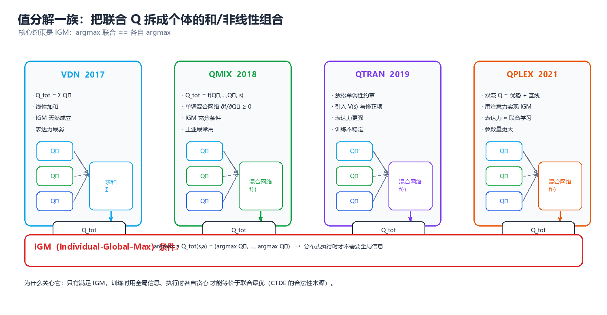
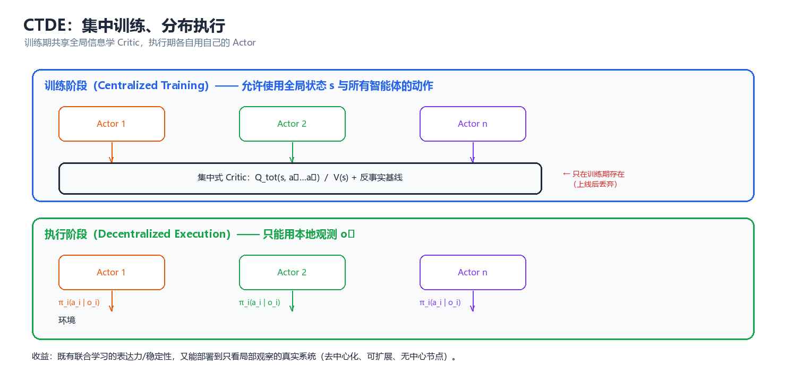
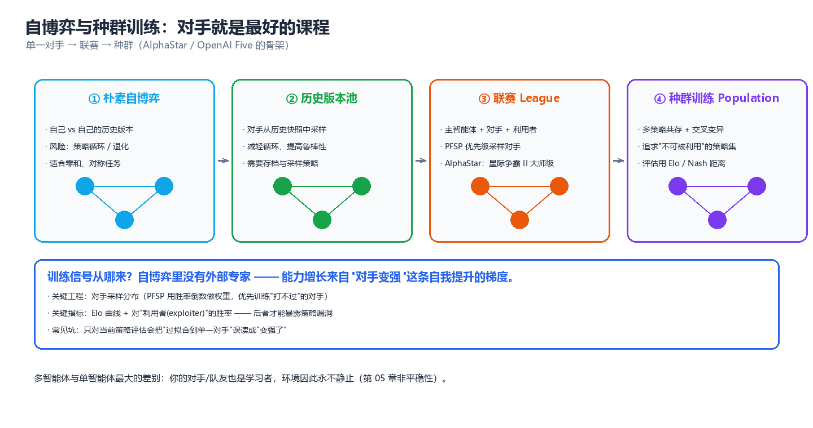

# 第 05 章 多智能体强化学习（Multi-Agent Reinforcement Learning, MARL）

> 单智能体强化学习假设"环境是静止的"——转移概率与奖励不随我自己的学习而改变。一旦场上出现第二个学习者，这条假设就轰然倒塌：**我的最优策略取决于你的策略，而你的策略正在因为我而改变**。本章要回答的就是这一个问题：在环境本身会学习的前提下，怎么让一组主体学出协作（或对抗）的策略。这是整个知识库技术密度最高的一章，也是"强化学习第 09 章 §三 的 MARL 精简版概览，本章是其展开"的完整版本。

---

## 一、问题设定

### 1.1 从 Markov Game 到 Dec-POMDP

强化学习第 09 章 §三 的 MARL 精简版概览给出了一张表格，告诉我们单智能体 MDP 升级为多智能体随机博弈后，"动作、转移、奖励、观测、策略"五个要素各自多了什么麻烦。本章从这个形式化起点出发，把它一路展开到可执行的算法。

先复述这个形式化，但这次补上工程上真正重要的细节——**每个主体到底看得见什么**。

$$
\mathcal{M} = \left\langle n,\ S,\ \{A_i\}_{i=1}^{n},\ P,\ \{R_i\}_{i=1}^{n},\ \gamma \right\rangle
$$

其中 $n$ 是主体数，$S$ 是全局状态，$A_i$ 是第 $i$ 个主体的动作集，$P(s'\mid s,\mathbf{a})$ 是联合动作 $\mathbf{a}=(a_1,\dots,a_n)$ 下的转移，$R_i$ 是第 $i$ 个主体自己的奖励函数。

现实里几乎没有一个多智能体任务能让你"看到全局状态 $S$"。机器人只有各自的传感器视野，交易员只有各自的市场切片，微服务只有各自的调用链。于是关键的一步升级是引入**观测函数**：

$$
o_i = O_i(s;\, \mathbf{a}), \qquad \pi_i(a_i \mid \tau_i), \qquad \tau_i = (o_i^1, a_i^1, \dots, o_i^t)
$$

每个主体拿到的是自己的观测 $o_i$，行动只依赖自己的**动作-观测历史** $\tau_i$（history）。这个模型就是 **Dec-POMDP（Decentralized Partially Observable Markov Decision Process，去中心化部分可观测马尔可夫决策过程）**。它是合作型 MARL 的通用语言。

| 模型 | 谁在决策 | 看得见什么 | 奖励 | 典型算法 |
|------|---------|-----------|------|---------|
| MDP | 1 个决策者 | 全局状态 $s$ | $R(s,a)$ | DQN、PPO |
| Markov Game | $n$ 个 | 全局状态 $s$ | 各自 $R_i(s,\mathbf{a})$ | 极小极大 Q、IQL |
| MMDP（多智能体 MDP） | $n$ 个 | 全局状态 $s$ | **共享** $R$ | VDN、QMIX |
| **Dec-POMDP** | $n$ 个 | **各自局部观测** $o_i$ | **共享** $R$ | QMIX、MAPPO、COMA |
| 零和随机博弈 | 2 个 | 全局或局部 | $R_1 = -R_2$ | 自博弈、CFR |

> **核心思想**：MARL 的全部困难，都可以追溯到上表最后两列的落差——**训练时我们可能看得到全局（$s$、联合动作），执行时每个主体只看得到自己那一小块（$o_i$）**。如何跨越这道落差而不损失最优性，就是 CTDE（集中训练、分布执行）范式要解决的问题（§四）。

关于"多个主体之间到底是竞争还是合作"，这取决于博弈的**收益结构**，见第 03 章博弈类型；本章主要处理合作型（共享奖励）与零和型（对抗）两个极端，混合动机的中间地带留待第 04 章的机制设计处理。

### 1.2 联合动作与联合策略

单智能体里，一个"策略"就是一个函数 $\pi(a\mid s)$。多智能体里，这个对象立刻膨胀成两样东西：

**（1）联合动作（joint action）**：所有主体动作的笛卡尔积

$$
\mathbf{a} = (a_1, \dots, a_n) \in \mathcal{A} = A_1 \times A_2 \times \cdots \times A_n, \qquad |\mathcal{A}| = \prod_{i=1}^{n} |A_i|
$$

**（2）联合策略（joint policy）**：所有主体策略的元组

$$
\boldsymbol{\pi} = (\pi_1, \dots, \pi_n), \qquad \boldsymbol{\pi}(\mathbf{a}\mid \tau) = \prod_{i=1}^{n} \pi_i(a_i \mid \tau_i)
$$

注意右边这个因式分解——它假设各主体的策略**条件独立**，这是一个习惯性的简化。真实系统里主体之间会通信、会互相观察，条件独立性并不成立，这正是第 06 章（通信与协同）要打破的假设。本章先站在独立策略的假设上把地基打牢。

联合价值函数定义为联合策略 $\boldsymbol{\pi}$ 下的期望回报：

$$
Q^{\boldsymbol{\pi}}(s, \mathbf{a}) = \mathbb{E}_{\boldsymbol{\pi}}\!\left[\sum_{t=0}^{\infty} \gamma^t R(s_t, \mathbf{a}_t) \,\Big|\, s_0 = s,\ \mathbf{a}_0 = \mathbf{a},\ \mathbf{a}_{t>0} \sim \boldsymbol{\pi}\right]
$$

单智能体的 Bellman 最优方程 $\max_a Q(s,a)$ 在这里要小心：$\max_{\mathbf{a}}$ 是**联合最大化**，它需要所有主体在同一时刻协调一致地选择联合动作里各自的那一项。而分布式执行时，每个主体只能看到自己的 $\tau_i$，做不到"读心"。这就是 IGM 条件（§4.1、§9.1）要专门处理的东西。

### 1.3 分布式执行的硬约束

把"集中训练、分布执行"（Centralized Training with Decentralized Execution, **CTDE**）说清楚，需要区分两种完全不同的信息可用性：

| 阶段 | 允许用的信息 | 不允许用的信息 | 为什么 |
|------|------------|--------------|--------|
| **训练** | 全局状态 $s$、全部观测 $\{o_i\}$、全部动作 $\{a_i\}$、全部奖励 | 无（可以随便用） | 训练是离线的、集中的，算力与带宽不是瓶颈 |
| **执行** | 只有自己的 $\tau_i$ 与本地观测 $o_i$ | **别人的观测、别人的动作、全局状态** | 部署时通信可能中断、有延迟、有带宽上限 |

执行阶段的这三条"不允许"，是 MARL 一切算法设计的硬边界。具体地：

1. **不能依赖全局状态 $s$** —— 因为 $s$ 可能根本不存在一个主体能观测到它（局部可观测）。
2. **不能依赖其他主体的动作 $a_j$** —— 因为实时控制回路里等不起一个通信往返；通信本身要花预算（第 06 章）。
3. **不能依赖联合 Q 表的查表** —— 因为 $|\mathcal{A}|$ 随 $n$ 指数爆炸（§2.3）。

ASCII 图把这条时间线画出来：

```
        ┌─────────────────── 训练阶段（集中，看得见全局） ───────────────────┐
        │                                                                   │
        │   全局状态 s ──┐                                                   │
        │   全部观测 o_i ─┼──►  联合 Critic  /  混合网络  ──►  全局 TD 误差    │
        │   全部动作 a_i ─┤         Q_tot(s, a)              （用于更新参数）  │
        │   全局奖励 r   ─┘                                                   │
        └───────────────────────────────┬───────────────────────────────────┘
                                        │  只把"局部策略参数"下发
                                        ▼
        ┌─────────────────── 执行阶段（分布，只看得到自己） ─────────────────┐
        │                                                                   │
        │   智能体 1:  o_1 ──► π_1(a_1|τ_1) ──► a_1 ─┐                       │
        │   智能体 2:  o_2 ──► π_2(a_2|τ_2) ──► a_2 ─┼──► 环境               │
        │      ⋮                ⋮                ⋮    │                      │
        │   智能体 n:  o_n ──► π_n(a_n|τ_n) ──► a_n ─┘                       │
        │                                                                   │
        │   ★ 执行时看不到 s，看不到 a_j，看不到别人的 o_j                    │
        └───────────────────────────────────────────────────────────────────┘
```

> ⚠️ **最常见的实现错误**：把全局状态塞进每个智能体的 Actor 输入。"反正我训练时有全局状态，用一下不亏"——这是**训练/测试分布不一致**，部署时你会拿不到这个输入，策略当场失效。全局状态只能进 Critic，永远不能进 Actor。

---

## 二、两大困难

MARL 之所以难，不是难在"把单智能体算法跑 n 遍"，而是难在两个结构性的、无法用调参绕过的障碍。这一节每一小节都用可运行的演示把它钉死。

### 2.1 非平稳性：环境在学习

单智能体 RL 的收敛理论建立在"环境是平稳的（stationary）"之上：转移概率 $P(s'\mid s,a)$ 和奖励 $R(s,a)$ 不随时间变化。多智能体里，站在智能体 $i$ 的视角，它的"环境"包含了所有其他智能体的策略：

$$
P_i(s' \mid s, a_i) = \sum_{\mathbf{a}_{-i}} \boldsymbol{\pi}_{-i}(\mathbf{a}_{-i} \mid \tau_{-i})\, P(s' \mid s, a_i, \mathbf{a}_{-i})
$$

**这个转移概率里藏着 $\boldsymbol{\pi}_{-i}$，而它每一步都在学习、在变。** 于是对智能体 $i$ 而言，它面对的是一个**非平稳的 MDP**——昨天学到的最优 $Q_i$ 今天可能已经过时。这就是"在人群里，没有哪个智能体能准确预测其他人的下一步"。

最干净的演示是**硬币匹配（Matching Pennies）**：两个玩家各出一个硬币，猜中对方则 A 得 +1、B 得 -1，否则反过来。这个博弈唯一的纳什均衡是双方各以 1/2 概率出正反面（混合策略），期望收益 0。

下面让两个智能体**各自独立**学习：每个维护一组 logits，用 REINFORCE 型策略梯度更新自己的策略，看会发生什么：

```python
import numpy as np

# ============ 非平稳性演示: 硬币匹配上的两个独立策略梯度学习者 ============
# 智能体 1 猜对(双方动作相同)得 +1, 智能体 2 得 -1 → 零和
rng = np.random.default_rng(0)
lr = 0.05
T, every = 60000, 5000
theta1 = np.log(np.array([0.5, 0.5]))       # 初始策略: 正/反各 50%
theta2 = np.log(np.array([0.5, 0.5]))
rec = []
for t in range(T):
    p1 = np.exp(theta1) / np.exp(theta1).sum()   # 软最大策略
    p2 = np.exp(theta2) / np.exp(theta2).sum()
    a1 = int(rng.choice(2, p=p1))
    a2 = int(rng.choice(2, p=p2))
    r1 = 1.0 if a1 == a2 else -1.0              # 智能体 1 的即时奖励
    r2 = -r1
    e1 = np.zeros(2); e1[a1] = 1.0
    e2 = np.zeros(2); e2[a2] = 1.0
    theta1 += lr * r1 * (e1 - p1)              # REINFORCE 型策略梯度
    theta2 += lr * r2 * (e2 - p2)
    if (t + 1) % every == 0:
        rec.append((p1[0], p2[0]))
print("独立策略梯度在硬币匹配上: 各智能体出'正面'的概率")
print(f"{'步数':>8} | {'π1(正面)':>9} | {'π2(正面)':>9}")
print("-" * 32)
for k, (x, y) in enumerate(rec):
    print(f"{(k + 1) * every:>8} | {x:>9.3f} | {y:>9.3f}")
lo = min(r[0] for r in rec[-8:]); hi = max(r[0] for r in rec[-8:])
print(f"\n末段 π1 在 [{lo:.3f}, {hi:.3f}] 之间来回翻转")
print("唯一的混合纳什均衡是 (0.5, 0.5), 但两个独立学习者永远达不到它。")
```

**预期输出:**

```
独立策略梯度在硬币匹配上: 各智能体出'正面'的概率
      步数 |    π1(正面) |    π2(正面)
--------------------------------
    5000 |     0.010 |     0.534
   10000 |     0.063 |     0.996
   15000 |     0.007 |     0.003
   20000 |     0.019 |     0.998
   25000 |     0.998 |     0.003
   30000 |     0.002 |     0.011
   35000 |     0.991 |     0.998
   40000 |     0.983 |     0.002
   45000 |     0.003 |     0.998
   50000 |     0.998 |     0.997
   55000 |     0.998 |     0.002
   60000 |     0.002 |     0.002

末段 π1 在 [0.002, 0.998] 之间来回翻转
唯一的混合纳什均衡是 (0.5, 0.5), 但两个独立学习者永远达不到它。
```

**训练 6 万步后，两个智能体并没有收敛到各 50% 的混合策略，而是陷在纯策略之间无休止地翻转**：π1 从 0.998 跌回 0.002，π2 紧跟其后反向翻转。机理很干净：**当对手改变策略时，我的优势函数符号会整体翻转**——"出正面"昨天带来正优势，今天对手改成总出反面，它就立刻变成负优势。策略梯度只朝当下梯度的方向走，而这个方向正被"我改变对手"这件事翻转，于是形成无休止的追逐。用 §9.4 的语言说：该博弈的**有效目标算子不满足压缩性**。

| 现象 | 单智能体 RL | 多智能体 RL（独立学习） |
|------|------------|----------------------|
| 环境平稳性 | 成立（$P,R$ 固定） | **不成立**（别人的策略在变） |
| 收敛目标 | 唯一最优策略 | 均衡（可能不存在纯策略均衡） |
| Q 表更新 | 朝固定目标收敛 | 目标本身在漂移 → **极限环** |
| 典型症状 | 收敛慢 | 损失震荡、胜率周期性反转、无法复现 |

> **核心思想**：非平稳性不是"数据噪声大一点"，而是**学习目标本身在移动**。任何"把其他智能体当成环境一部分"的朴素做法，都要在理论上证明这个非平稳过程能收敛——对一般的独立 Q-learning，这个保证是没有的（§3.2 给出仅有保证的特殊情形）。

### 2.2 信用分配：这把功劳记在谁头上

第二个困难出现在**团队共享奖励**的设定里。假设 n 个智能体协同完成一个任务，环境只给一个全局奖励 $r$，那"这次成功"该奖励谁？"这次失败"又该归咎于谁？

朴素做法是**均匀分摊**：$r$ 平均分给 n 个主体，每个智能体的目标奖励都是 $r/n$。这在 n 大的时候几乎必然出问题——**搭便车（free-riding）**：既然我摸鱼也能拿 $r/n$，那我为什么要努力？梯度会被"无关紧要的动作"稀释，学出来的策略退化。

更好的做法是**反事实基线（counterfactual baseline）**。核心直觉是：**一个动作的价值，应该用"在别人都照常行动的前提下，我改成这个动作，团队结果变好/变差了多少"来衡量**。这正是 COMA 算法的思想（§5.2），也是第 04 章 Shapley 贡献归因在 RL 里的对应物。

设联合 Q 值为 $Q(s,\mathbf{a})$，智能体 $i$ 的反事实基线定义为**在固定其他所有主体动作 $\mathbf{a}_{-i}$ 的前提下，对智能体 $i$ 自己的动作求期望**：

$$
b_i(s, \mathbf{a}_{-i}) = \sum_{a_i' \in A_i} \pi_i(a_i' \mid \tau_i)\, Q\!\left(s,\ \mathbf{a}_{-i}, a_i'\right)
$$

于是优势函数（advantage）为

$$
\boxed{\ A_i(s, \mathbf{a}) = Q(s, \mathbf{a}) - b_i(s, \mathbf{a}_{-i})\ }
$$

这个 $A_i$ 度量的是"智能体 $i$ 换成这个动作，相对它自己的平均表现，多贡献了多少"。下面用一个 3 智能体的玩具联合 Q 表，把"均匀分摊"和"反事实基线"放在一起对比：

```python
import numpy as np

# ============ 信用分配演示: 均匀分摊 vs 反事实基线 ============
# 3 个智能体, 每个动作 ∈ {0, 1}; joint_value 给出一个手工设计的联合 Q 表
# 设计意图: 智能体 1 是关键(它偷懒则团队崩盘), 智能体 2、3 几乎不影响结果
joint_value = {
    (1, 1, 1): 10.0, (1, 1, 0): 9.5, (1, 0, 1): 9.0, (1, 0, 0): 8.8,
    (0, 1, 1): 0.5,  (0, 1, 0): 0.4, (0, 0, 1): 0.2, (0, 0, 0): 0.0,
}
a = (1, 1, 1)                 # 当前实际执行的联合动作
total_reward = joint_value[a]

# --- 方案 A: 均匀分摊 ---
uniform = total_reward / 3
print(f"实际联合动作 a = {a}, 联合 Q = {total_reward:.1f}")
print(f"\n[方案 A] 均匀分摊: 每个智能体信用 = {uniform:.3f}  (三者完全一样)")

# --- 方案 B: 反事实基线 (COMA 式) ---
print("\n[方案 B] 反事实基线:")
adv = []
for i in range(3):
    cf = []
    for alt_a in (0, 1):                    # 枚举智能体 i 的所有替代动作
        j = list(a)
        j[i] = alt_a
        cf.append(joint_value[tuple(j)])
    baseline = float(np.mean(cf))           # 反事实期望 = 该智能体的基线
    A_i = joint_value[a] - baseline
    adv.append(A_i)
    print(f"  智能体 {i + 1}: 反事实均值 b_{i+1} = {baseline:.3f} → A_{i+1} = "
          f"{joint_value[a]:.1f} - {baseline:.3f} = {A_i:+.3f}")

adv = np.array(adv)
print(f"\n  优势向量 (A_1,A_2,A_3) = {np.round(adv, 3)}  →  归一化信用 = "
      f"{np.round(adv / np.sum(np.abs(adv)), 3)}")
```

**预期输出:**

```
实际联合动作 a = (1, 1, 1), 联合 Q = 10.0

[方案 A] 均匀分摊: 每个智能体信用 = 3.333  (三者完全一样)

[方案 B] 反事实基线:
  智能体 1: 反事实均值 b_1 = 5.250 → A_1 = 10.0 - 5.250 = +4.750
  智能体 2: 反事实均值 b_2 = 9.500 → A_2 = 10.0 - 9.500 = +0.500
  智能体 3: 反事实均值 b_3 = 9.750 → A_3 = 10.0 - 9.750 = +0.250

  优势向量 (A_1,A_2,A_3) = [4.75 0.5  0.25]  →  归一化信用 = [0.864 0.091 0.045]
```

对比一目了然：**均匀分摊给三个人都记 3.333 分，完全抹平了差异**；而反事实基线指出真正的关键先生是智能体 1（+4.75）——把它从"努力"换成"偷懒"，团队 Q 从 10.0 掉到 0.5，几乎崩盘；智能体 2、3 的贡献则接近于零（+0.5、+0.25），它们是在搭便车。均匀分摊给这两个搭便车者的奖励，与给关键先生的奖励一模一样，梯度里于是混入了大量"与我无关"的信号。

| 信用分配方案 | 公式 | 优点 | 缺点 | 采用算法 |
|-------------|------|------|------|---------|
| 均匀分摊 | $r_i = r/n$ | 极简单、无额外开销 | 搭便车、梯度稀释 | 朴素共享奖励 |
| 个体奖励塑形 | $r_i = r/n + \phi(o_i)$ | 可注入领域知识 | 需要手工设计，可能改变最优解 | 工程实践 |
| 反事实基线 | $A_i = Q - \mathbb{E}_{a_i'}[Q]$ | 有理论依据、区分度高 | 需要 $|A_i|$ 次前向、需全局 Q | **COMA** |
| 差异奖励 | $r_i = r - \bar{r}_{-i}$ | 简单 | 方差大 | DIFFER / 早期工作 |
| Shapley 值 | 边际贡献的加权平均 | 公理化、最公平 | 计算量 $2^n$ | 见第 04 章 |

反事实基线的公平性有理论依据，它对应合作博弈里"边际贡献"的直觉，见第 04 章 Shapley 贡献归因：Shapley 值是所有"反事实顺序"上边际贡献的加权平均，而 COMA 的 $A_i$ 是其中最简单的一种。

### 2.3 联合动作空间指数

第三个量化困难是规模。联合动作空间 $|\mathcal{A}| = \prod_i |A_i|$ 随智能体数**指数**增长，这是任何"查表式"或"枚举式"方法的死穴：

```python
# 联合动作空间的指数增长 (对比 per-agent 的动作数)
n_actions = 4                          # 每个智能体 4 个动作
print(f"每个智能体的动作数 |A_i| = {n_actions}")
print(f"{'智能体数 n':>10} | {'联合动作数 |A|^n':>22} | {'相对单体的倍数':>16}")
print("-" * 56)
base = n_actions
for n in (2, 4, 8, 10, 16, 20, 32):
    joint = n_actions ** n
    print(f"{n:>10d} | {joint:>22,} | {'—' if n == 2 else f'{joint / base:>14,.0f}x'}")
```

**预期输出:**

```
每个智能体的动作数 |A_i| = 4
    智能体数 n |            联合动作数 |A|^n |          相对单体的倍数
--------------------------------------------------------
         2 |                     16 | —
         4 |                    256 |             64x
         8 |                 65,536 |         16,384x
        10 |              1,048,576 |        262,144x
        16 |          4,294,967,296 |  1,073,741,824x
        20 |      1,099,511,627,776 | 274,877,906,944x
        32 | 18,446,744,073,709,551,616 | 4,611,686,018,427,387,904x
```

32 个智能体、每个 4 个动作，联合动作空间就是 $1.8 \times 10^{19}$——比地球上沙子的数量还多。任何需要"枚举联合动作"的算法（比如直接学一张 $Q(s, \mathbf{a})$ 表）在这里彻底失效。

> **核心思想**：三条困难合起来，决定了 MARL 的算法设计方向——**用函数逼近代替查表**（对抗指数爆炸）、**用集中式 Critic 提供全局信号**（对抗非平稳）、**用结构化分解或反事实优势分配信用**（对抗信用分配）。下面三大算法家族，分别是这三条思路的工程化。

---

## 三、独立学习及其局限

### 3.1 IQL：把单智能体算法跑 n 遍

最朴素的做法叫 **Independent Q-Learning（IQL，独立 Q-learning）**：每个智能体把"其他所有智能体的策略 + 环境"一起当成自己的环境，各自独立跑一个 Q-learning，谁也不告诉谁：

$$
Q_i(s, a_i) \leftarrow Q_i(s, a_i) + \alpha\left[r_i + \gamma \max_{a_i'} Q_i(s', a_i') - Q_i(s, a_i)\right]
$$

注意这里 $Q_i$ 的输入只有 $s$ 和 $a_i$，**完全不含其他智能体的动作**——智能体 $i$ 把 $\mathbf{a}_{-i}$ 的随机性一股脑吸收进了"环境的噪声"里。

| 特性 | 说明 |
|------|------|
| 复杂度 | 与单智能体同阶，$O(n)$ 个 $Q$ 表 |
| 可扩展性 | 好（互不依赖） |
| 收敛性 | **一般无保证**（环境非平稳，见 §2.1 演示） |
| 实现难度 | 最低，常作为基线 |
| 典型失败 | 极限环、策略互相踩踏、在需要协调的任务上表现差 |

### 3.2 势博弈/零和下的收敛结论

"独立学习不收敛"并非绝对。理论上有两类特殊结构，能让独立学习重新拥有收敛保证：

**（1）势博弈（potential game）**。若存在一个全局势函数 $\phi: \mathcal{A} \to \mathbb{R}$，使得对任意智能体 $i$、任意动作变化 $a_i \to a_i'$：

$$
R_i(a_i, \mathbf{a}_{-i}) - R_i(a_i', \mathbf{a}_{-i}) = \phi(a_i, \mathbf{a}_{-i}) - \phi(a_i', \mathbf{a}_{-i})
$$

也就是说，**每个人改变动作带来的收益变化，都等于同一个全局函数的变化**。此时所有智能体在"共同爬同一座山"，独立学习能收敛到势函数的局部最优，也就是一个纳什均衡。常见的合作型共享奖励任务往往可以构造成势博弈。

**（2）零和随机博弈（two-player zero-sum）**。当 $R_1 = -R_2$ 时，可以用极小极大（minimax）框架，配合 Q-learning 的对手式更新（如 Minimax-Q），在理论上收敛到博弈值。但这要求**双方都用混合策略**，纯策略的独立 Q-learning 会像 §2.1 那样震荡。

| 结构 | 收敛到 | 前提 | 代表 |
|------|-------|------|------|
| 势博弈 | 势函数局部最优 = 纳什 | 存在势函数 $\phi$ | 多数合作型共享奖励任务 |
| 零和博弈 | 博弈值（混合策略） | 双方极小极大、混合策略 | Minimax-Q、CFR |
| 一般和博弈 | **无保证** | — | 独立 Q-learning（会震荡） |

> ⚠️ 参数共享（所有智能体共用一个网络，§8.1）在**同质智能体 + 势博弈**的结构下会显著改善独立学习的收敛行为，但它并没有改变"一般和博弈无保证"这个结论——共享参数只是减少了要学的参数数量，没有消除非平稳性。

### 3.3 为什么 IQL 仍然是标准基线

尽管有这么多毛病，IQL 依然是每篇 MARL 论文必须报告的基线，原因有三：

1. **便宜**：训练成本与单智能体同阶，是判断"新方法是否真的带来了收益"的参照物。如果你的复杂值分解方法打不过一个 IQL，那说明问题本身不需要那么复杂。
2. **揭示任务难度**：IQL 在势博弈型任务上就能拿到不错的分数，在这些任务上"QMIX 略胜 IQL"并不构成强证据；只有 IQL 惨败的任务，才真正需要协调机制。
3. **失败模式有诊断价值**：IQL 的震荡、搭便车现象，本身就是"这个任务需要集中式信息"的直接证据。

| 任务类型 | IQL 表现 | 说明 |
|---------|---------|------|
| 完全独立子任务 | ≈ 最优 | 退化为并行单智能体 |
| 势博弈型协作 | 接近最优 | 势函数保证收敛 |
| 需要严格时序协调 | 差 | 非平稳 + 无信用分配 |
| 零和对抗 | 差（纯策略） | 需要混合策略 |

---

## 四、值分解一族

值分解（Value Decomposition）是合作型 MARL 里最优雅的一族方法。它的核心思想是：**训练时用一个集中的混合网络把每个智能体的个体 Q 值融合成全局 Q 值，执行时每个智能体只需要根据自己那个 $Q_i$ 贪心即可**。

### 4.1 IGM 与 CTDE 的合法性

**为什么"个体贪心"能等于"联合最优"？** 这需要一个条件，叫做 **IGM（Individual-Global-Max，个体-全局最大）**：

$$
\boxed{\ \arg\max_{\mathbf{a}} Q_{tot}(s, \mathbf{a}) = \left( \arg\max_{a_1} Q_1(\tau_1, a_1),\ \dots,\ \arg\max_{a_n} Q_n(\tau_n, a_n) \right)\ }
$$

用人话说：**联合 Q 值取最大的那个联合动作，必须恰好等于每个智能体各自贪心选出的动作拼起来**。只有满足 IGM，分布式执行（各选各的 argmax）才与集中式最优等价。

IGM 有一个更弱、更好实现、也更好验证的**充分条件**——**单调性（monotonicity）**：只要混合网络对每个 $Q_i$ 的偏导数非负：

$$
\frac{\partial Q_{tot}}{\partial Q_i} \geq 0, \quad \forall i
$$

那么 IGM 就一定成立。证明见 §9.1。QMIX 的全部设计（非负权重的超网络）就是为了保证这个偏导非负。

值的分解结构可以用一张图说清楚：



*图：个体 Q 值经由单调的混合网络融合为全局 Q 值；执行时每个智能体只看自己那一支。*

```
   ┌──────────────────────── 集中训练 ────────────────────────┐
   │                                                           │
   │   Q_1(τ_1,·)   Q_2(τ_2,·)   Q_3(τ_3,·)  ← 个体 Q (每步一支) │
   │        │            │            │                        │
   │        └────────────┼────────────┘                        │
   │                     ▼                                     │
   │        ┌────────────────────────────┐                     │
   │        │  混合网络 (Mixing Network)  │  ◄── 全局状态 s      │
   │        │  权重非负 → 单调不减         │      经超网络生成     │
   │        └────────────┬───────────────┘                     │
   │                     ▼                                     │
   │                 Q_tot(s, a)                               │
   │                     │                                     │
   │                     ▼                                     │
   │           TD 误差 L = (y - Q_tot)²  → 反传更新全部参数      │
   └───────────────────────────────────────────────────────────┘
                          │ 执行时只保留个体 Q
                          ▼
   ┌──────────────── 分布执行 ────────────────┐
   │ 智能体 1: argmax Q_1  智能体 2: argmax Q_2  智能体 3: … │
   └──────────────────────────────────────────┘
```

| 分解方法 | 混合函数 $Q_{tot}$ 的形式 | 满足 IGM? | 表达力 | 年份 |
|---------|------------------------|----------|-------|------|
| IQL | $Q_{tot} = \sum_i Q_i$（无混合） | 否（其实是） | 低 | — |
| VDN | $Q_{tot} = \sum_i Q_i$ | 是（加法是单调的） | 低 | 2018 |
| QMIX | 单调非线性混合 | 是 | 中 | 2018 |
| QTRAN | $Q_{tot} = \sum Q_i - V$ 的松弛 | 是（松弛） | 高 | 2019 |
| QPLEX | 优势分解 | 是（双向） | 最高 | 2021 |

### 4.2 VDN：最简单的可分解假设

**Value Decomposition Network（VDN，值分解网络）** 假设全局 Q 就是个体 Q 的**和**：

$$
Q_{tot}(s, \mathbf{a}) = \sum_{i=1}^{n} Q_i(\tau_i, a_i)
$$

这个假设极其简洁，而且**天然满足 IGM**：

$$
\arg\max_{\mathbf{a}} \sum_i Q_i(\tau_i, a_i) = \left(\arg\max_{a_1} Q_1,\ \dots,\ \arg\max_{a_n} Q_n\right)
$$

因为"和的最大值 = 各分量最大值的和"，当且仅当各分量**独立取最大**（各变量可分，互不耦合）。

| 方面 | VDN |
|------|-----|
| 混合形式 | 线性加和 |
| 满足 IGM | ✅（加法的单调性显然） |
| 优点 | 极其简单，无额外参数，易于训练 |
| 局限 | 无法表达"只有两个动作同时正确才有用"这类**非线性协同**——参见 §9.3 的反例 |
| 训练损失 | $L(\theta) = \mathbb{E}\left[(y - \sum_i Q_i)^2\right]$，$y = r + \gamma \max_{\mathbf{a}'} \sum_i Q_i'$ |

VDN 的局限可以用一句话概括：**它假设每个智能体的贡献是"可加的、互不干扰的"**。而现实任务里大量存在"1 + 1 > 2"的协同效应（两个机器人同时推门才能打开），加法模型表达不出来。

### 4.3 QMIX：单调混合网络 + 损失推导

**QMIX** 是值分解家族的主角。它保留了"个体 Q 各自决策"的执行结构，但把混合函数从线性加和放宽为**单调非线性函数**，并且——这是关键——**混合网络的权重不是自由参数，而是由全局状态 $s$ 通过一个"超网络（hypernetwork）"动态生成的**：

$$
Q_{tot}(s, \mathbf{a}) = f_\theta\big(s,\ Q_1(\tau_1, a_1), \dots, Q_n(\tau_n, a_n)\big)
$$

**单调性约束的实现**：混合网络是一个前馈网络，但它的**所有权重都被强制非负**：

$$
w_{ij} \geq 0, \qquad b_k \text{ 可以是任意实数}
$$

非负权重 + 单调激活函数（如 ELU / ReLU） ⟹ 输出对每个输入的偏导非负 ⟹ $\partial Q_{tot} / \partial Q_i \geq 0$ ⟹ IGM 成立。**偏置项不受约束，因为它不影响单调性。**

**损失函数**：QMIX 用标准的 TD 误差训练整个网络（个体 Q 网络 + 混合网络），目标值用联合动作的最大值：

$$
\boxed{\ \mathcal{L}(\theta) = \mathbb{E}_{(s,\mathbf{a},r,s') \sim \mathcal{D}}\Big[ \left( \underbrace{r + \gamma \max_{\mathbf{a}'} Q_{tot}(s', \mathbf{a}'; \theta^-)}_{\text{TD 目标 } y} - Q_{tot}(s, \mathbf{a}; \theta) \right)^2 \Big]\ }
$$

其中 $\theta^-$ 是目标网络参数，$\max_{\mathbf{a}'}$ 通过"每个智能体各自 argmax 个体 Q"来算（得益于 IGM，这个分布式 $\max$ 等于真正的联合 $\max$，而且是 $O(n)$ 而不是 $O(|\mathcal{A}|)$）。

> **核心思想**：QMIX 的 $Q_{tot}$ 是 $Q_i$ 的**单调**函数，但不一定是线性的。单调性保证了"分布式 argmax = 联合 argmax"（IGM）；非线性保证了它能表达比 VDN 更丰富的协同（例如"当某个智能体 Q 很高时，其他智能体 Q 的边际价值也放大")。这是一个"刚好够用"的设计。

下面实跑一个最小的 QMIX 混合网络，**特意验证它满足单调性**：

```python
import numpy as np

# ============ 最小 QMIX 混合网络: 验证单调性 (IGM 的充分条件) ============
class MonotonicMixingNet:
    """由全局状态生成非负权重, 再把个体 Q 单调地融合为 Q_tot."""

    def __init__(self, n_agents, state_dim=8, embed_dim=16, seed=0):
        rng = np.random.default_rng(seed)
        # 超网络: 全局状态 -> 混合网络的第一层权重 (原始, 可正可负)
        self.W_hyper = rng.normal(0, 0.3, (state_dim, n_agents * embed_dim))
        self.b_hyper = np.zeros(n_agents * embed_dim)
        # 混合网络第二层权重 (同样经 abs 保证非负)
        self.v = rng.normal(0, 0.3, embed_dim)
        self.embed_dim = embed_dim
        self.n_agents = n_agents

    def forward(self, state, q_agents):
        W1 = np.abs((state @ self.W_hyper + self.b_hyper)
                    .reshape(self.n_agents, self.embed_dim))   # 非负权重
        h = np.tanh(q_agents @ W1)                             # 单调激活
        v = np.abs(self.v)                                     # 非负输出权重
        return float(h @ v)

n_agents, state_dim = 3, 8
rng = np.random.default_rng(123)
state = rng.normal(0, 1, state_dim)
q = np.array([0.5, -0.2, 0.8])
net = MonotonicMixingNet(n_agents, state_dim, seed=1)

base = net.forward(state, q)
print(f"基准: 个体 Q = {q}, Q_tot = {base:.5f}\n")
print("逐个提高某个智能体的 Q, 检查 Q_tot 是否单调不减:")
print(f"{'智能体':>6} | {'Q_i 变化':>18} | {'新的 Q_tot':>12} | {'ΔQ_tot':>10} | 单调?")
print("-" * 70)
ok = True
for i in range(n_agents):
    q2 = q.copy()
    q2[i] += 1.0
    new = net.forward(state, q2)
    d = new - base
    mono = d >= -1e-12
    ok &= mono
    print(f"{i + 1:>6} | {q[i]:+.2f} → {q2[i]:+.2f}     | {new:>12.5f} | {d:>+10.5f} | "
          f"{'✅' if mono else '❌'}")
print(f"\n结论: {'全部偏导非负 → 满足单调性 → IGM 成立 (分布式 argmax = 联合 argmax)' if ok else '违反单调性!'}")
```

**预期输出:**

```
基准: 个体 Q = [ 0.5 -0.2  0.8], Q_tot = 0.94998

逐个提高某个智能体的 Q, 检查 Q_tot 是否单调不减:
   智能体 |             Q_i 变化 |     新的 Q_tot |     ΔQ_tot | 单调?
----------------------------------------------------------------------
     1 | +0.50 → +1.50     |      1.62732 |   +0.67734 | ✅
     2 | -0.20 → +0.80     |      1.79842 |   +0.84844 | ✅
     3 | +0.80 → +1.80     |      1.46863 |   +0.51864 | ✅

结论: 全部偏导非负 → 满足单调性 → IGM 成立 (分布式 argmax = 联合 argmax)
```

三个智能体的 Q 各自提高 1.0，$Q_{tot}$ 全都**上升**（Δ 均为正），这就是单调性在数值上的直接体现。正因为这个性质，执行时每个智能体安心地对 $Q_i$ 取 argmax，拼起来的联合动作就一定是 $Q_{tot}$ 的最大值。

### 4.4 QTRAN：把可分解性放宽

QMIX 的单调性虽然好用，但它**限制表达力**：它排除了那些"混合 Q 在某个 $Q_i$ 增大时反而下降"的合法任务。**QTRAN** 试图摆脱单调性约束，转而直接逼近 IGM 条件本身。

QTRAN 引入一个**全局 Q** $Q_{jt}(s,\mathbf{a})$ 和一个**状态价值** $V_{jt}(s)$，要求：

$$
\sum_i Q_i(\tau_i, a_i) = Q_{jt}(s, \mathbf{a}) \quad \text{（当前联合动作上相等）}
$$

同时用软约束保证"最优联合动作满足 IGM"，把可分解性表达为一个带惩罚的优化问题（QTRAN-base 用 L2 松弛，QTRAN-alt 用更强但更贵的约束）。核心的方程组是：

$$
\begin{cases}
\sum_i Q_i(\tau_i, a_i) - Q_{jt}(s, \mathbf{a}) + V_{jt}(s) = 0 & \text{（一致约束）}\\
\sum_i Q_i(\tau_i, a_i) - Q_{jt}(s, \mathbf{a}) + V_{jt}(s) \geq 0 & \text{（IGM 最优性约束）}
\end{cases}
$$

| 方面 | QTRAN |
|------|-------|
| 能否摆脱单调性 | 能（理论上表达力更强） |
| 代价 | 需要额外学 $Q_{jt}$、$V_{jt}$，损失项多、训练不稳定 |
| 实践表现 | 常被 QMIX 追平甚至超过，超参敏感 |
| 教训 | **理论表达力 ≠ 实际效果**，优化难度常常才是瓶颈 |

### 4.5 QPLEX：优势分解，双向 IGM

**QPLEX** 的关键洞察是：与其在 $Q$ 上分解，不如在**优势函数（advantage）**上分解，把 IGM 拆成**双向条件**——既要"联合最优能被个体最优达到"，也要"个体最优不被联合次优掩盖"。它利用**优势分解的传递性（duplex dueling）**，用双头网络分别学个体优势与联合优势，再用一个单调变换矩阵连接：

$$
Q_{tot}(s, \mathbf{a}) = V(s) + \sum_i w_i(s, \mathbf{a})\, A_i(\tau_i, a_i), \qquad w_i \geq 0
$$

QPLEX 声称它**同时具备 QTRAN 的表达力和 QMIX 的优化稳定性**，在 SMAC 等基准上取得了当时的最好成绩之一。

| 方面 | QPLEX |
|------|-------|
| 分解对象 | 优势 $A_i$ 而非 $Q_i$ |
| IGM 满足方式 | 双向条件 + 传递性 |
| 表达力 | 高（理论覆盖 QTRAN 类） |
| 复杂度 | 高（双头 + 变换矩阵） |
| 实践定位 | 表达力上限的探路者 |

### 4.6 值分解家族对比表与选型

| 算法 | $Q_{tot}$ 形式 | IGM | 需全局状态? | 训练稳定性 | 表达力 | 推荐场景 |
|------|--------------|-----|-----------|-----------|--------|---------|
| **IQL** | 无（各自独立） | — | 否 | 差 | — | 基线、势博弈任务 |
| **VDN** | $\sum_i Q_i$ | ✅ | 否 | 高 | 低 | 快速原型、弱协同任务 |
| **QMIX** | 单调非线性 $f(Q_1,\dots; s)$ | ✅ | 是 | 高 | 中 | **默认首选**，SMAC 类任务 |
| **QTRAN** | $\sum Q_i - V_{jt} + Q_{jt}$ | ✅ | 是 | 中 | 高 | 需要非单调协同的研究 |
| **QPLEX** | $V + \sum_i w_i A_i$ | ✅ | 是 | 中高 | 最高 | 追求表达力上限 |

**选型口诀**：

1. 先用 **IQL** 摸底，看问题是否需要协调。
2. 需要协调且任务"可加"，用 **VDN** 快速验证。
3. 默认上 **QMIX**——它在"表达力 / 稳定性 / 实现复杂度"三者间取得最好的平衡，是绝大多数论文与工程的第一选择。
4. 只有在明确观察到"QMIX 单调性假设被违反导致的性能瓶颈"时，才去尝试 **QTRAN / QPLEX**——因为它们带来的训练不稳定性成本，往往高于表达力带来的收益。

---

## 五、策略梯度家族

值分解一族处理的是离散动作、共享奖励的合作任务。当动作空间连续、或者需要随机策略、或者要处理混合动机时，**策略梯度**方法更合适。

### 5.1 MADDPG：集中式 Critic 的诞生

**MADDPG（Multi-Agent Deep Deterministic Policy Gradient，多智能体深度确定性策略梯度）** 是 CTDE 范式最有影响力的落地。它给每个智能体配一个**中心化的 Critic**，Critic 输入全局状态与**所有**智能体的动作：

$$
Q_i^{\mu}\big(s,\ a_1, \dots, a_n\big)
$$

而每个智能体的 Actor 只看自己的观测：$\mu_i(o_i) \to a_i$。Actor 的梯度是：

$$
\nabla_{\theta_i} J(\theta_i) = \mathbb{E}\Big[ \nabla_{\theta_i} \mu_i(o_i)\ \nabla_{a_i} Q_i^{\mu}(s, a_1, \dots, a_n)\big|_{a_i = \mu_i(o_i)} \Big]
$$

**关键机制**：Critic 能看到别人的动作，所以即使别人在变（非平稳），Critic 也能"知道"当前的变化是什么，从而把非平稳性从 Critic 的视角部分消除了。这就是 CTDE 的精髓——**用集中的信息换取更稳定的学习信号**。



*图：训练时 Critic 看全局、看所有动作；执行时 Actor 只看自己的观测。*

```
   ┌──────── 训练阶段: 每个智能体配一个集中 Critic ────────┐
   │  o_1→μ_1→a_1 ─┐                                       │
   │  o_2→μ_2→a_2 ─┼─► Critic_i(s, a_1, a_2, …, a_n) → Q_i  │
   │      ⋮       │            ⋮                           │
   │  o_n→μ_n→a_n ─┘                                       │
   │  ★ Critic 看得见 s 与全部 a_j → 非平稳性被"感知"        │
   └──────────────────────┬────────────────────────────────┘
                          ▼
   ┌──────── 执行阶段: 各自只看局部观测 ────────┐
   │  智能体 i:  o_i ──► μ_i(o_i) ──► a_i      │
   └───────────────────────────────────────────┘
```

| 特性 | MADDPG |
|------|--------|
| 适用 | 连续动作、合作或混合动机 |
| Critic 输入 | 全局状态 + 全部动作 |
| Actor 输入 | 本地观测 |
| 优点 | 首次系统化 CTDE；能处理合作/竞争统一框架 |
| 缺点 | Critic 输入维度随 $n$ 线性增长；确定性策略探索不足；对超参敏感 |
| 后续 | MADDPG → MAAC（注意力 Critic）→ MAPPO（更稳的 PPO 版本） |

### 5.2 COMA：反事实多智能体

**COMA（Counterfactual Multi-Agent Policy Gradients，反事实多智能体策略梯度）** 把 §2.2 的反事实基线搬进了 Actor-Critic：

- **集中式 Critic** 估计 $Q(s, \mathbf{a})$；
- **反事实基线** 计算 $A_i = Q(s,\mathbf{a}) - \sum_{a_i'} \pi_i(a_i'\mid\tau_i) Q(s, (\mathbf{a}_{-i}, a_i'))$；
- **Actor** 用这个优势做策略梯度，正好解决了"共享奖励下我该做多少"的问题。COMA 还用一个 critic 加一个反事实头来高效计算所有反事实，避免为每个 $a_i'$ 跑一次完整前向。

```
   COMA 的信用分配机制 (智能体 i 的视角):

   所有其他人照常:  a_{-i} 固定不动
        │
        ├── 我选 a_i^{(1)} → Q(s, a_i^{(1)}, a_{-i})
        ├── 我选 a_i^{(2)} → Q(s, a_i^{(2)}, a_{-i})        ┌─ 取加权平均
        ├── 我选 a_i^{(3)} → Q(s, a_i^{(3)}, a_{-i})  ──────┤  = 反事实基线 b_i
        │        ⋮          ⋮                     ┌───────► ┘
        └── 我选 a_i^{(k)} → Q(s, a_i^{(k)}, a_{-i})
                  │
           实际选了 a_i  →  Q(s, a_i, a_{-i})
                  │
                  ▼
        A_i = Q(s, a_i, a_{-i}) - Σ_{a'} π_i(a') Q(s, a', a_{-i})
                  │
                  ▼
          用它更新智能体 i 的 Actor
```

下面实跑 COMA 的核心计算——**反事实优势**——并与均匀分摊对比：

```python
import numpy as np

# ============ COMA 核心: 反事实优势的逐智能体计算 ============
def global_q(joint_action):
    """模拟一个集中 Critic: 团队收益 = 各自基础收益 + 动作一致的协同加成."""
    a = np.asarray(joint_action)
    synergy = 2.0 if len(set(a.tolist())) == 1 else 0.0   # 全员一致 → 协同加成
    return float(np.sum(1.0 - 0.3 * a) + synergy)         # 动作编号越小越好

n_agents, n_actions = 3, 3
# 每个智能体的当前策略 (示例: 温和偏好的混合策略)
policy = np.array([[0.6, 0.3, 0.1],
                   [0.2, 0.5, 0.3],
                   [0.1, 0.2, 0.7]])
joint = [0, 0, 0]                     # 当前执行的联合动作: 大家一致
print(f"当前联合动作 a = {joint};  集中 Critic 的 Q(s,a) = {global_q(joint):.3f}\n")

print("逐个智能体计算 A_i = Q(s,a) - Σ_{a'} π_i(a') Q(s, (a_i'→a_{-i})):")
print(f"{'智能体':>6} | {'反事实 Q 向量':>20} | {'基线 b_i':>9} | {'优势 A_i':>9}")
print("-" * 56)
adv = np.zeros(n_agents)
for i in range(n_agents):
    cf_q = np.array([global_q(joint[:i] + [k] + joint[i + 1:])
                     for k in range(n_actions)])          # 枚举 i 的所有动作
    b = float(np.dot(policy[i], cf_q))                    # 反事实基线
    adv[i] = global_q(joint) - b
    print(f"{i + 1:>6} | {np.round(cf_q, 3)} | {b:>9.3f} | {adv[i]:>+9.3f}")

print(f"\n反事实优势 = {np.round(adv, 3)}")
print(f"均匀分摊的信用 = {global_q(joint) / n_agents:.3f}  (三者完全相同)")
w = np.exp(adv) / np.sum(np.exp(adv))
print(f"softmax 归一化后的更新权重 = {np.round(w, 3)}")
```

**预期输出:**

```
当前联合动作 a = [0, 0, 0];  集中 Critic 的 Q(s,a) = 5.000

逐个智能体计算 A_i = Q(s,a) - Σ_{a'} π_i(a') Q(s, (a_i'→a_{-i})):
   智能体 |             反事实 Q 向量 |    基线 b_i |    优势 A_i
--------------------------------------------------------
     1 | [5.  2.7 2.4] |     4.050 |    +0.950
     2 | [5.  2.7 2.4] |     3.070 |    +1.930
     3 | [5.  2.7 2.4] |     2.720 |    +2.280

反事实优势 = [0.95 1.93 2.28]
均匀分摊的信用 = 1.667  (三者完全相同)
softmax 归一化后的更新权重 = [0.134 0.358 0.508]
```

反事实优势指出：三人的反事实 Q 向量完全一样（其他两人的动作被固定），**差别全部来自各自的策略**。智能体 1 的策略本就集中在动作 0（好动作），它选 0 并不稀奇，基线最高（4.05）、优势最小（+0.95）；智能体 3 的策略把 70% 概率压在动作 2（差动作）上，这次却选了 0，属于"意外的好表现"，基线最低（2.72）、优势最大（+2.28）。**均匀分摊把这些关键差异全部抹成同一个 1.667。**

| 方法 | 信用信号 | 需要的信息 | 计算成本 | 方差 |
|------|---------|-----------|---------|------|
| 均匀分摊 | $r/n$ | 全局奖励 | $O(1)$ | 低（但偏差大） |
| COMA 反事实 | $A_i$ | 集中 Critic + 策略 | $O(n \cdot |A_i|)$ | 中 |
| Shapley 归因 | $\phi_i$ | 全部子集的联合 Q | $O(2^n)$ | 低（但极贵） |

> **核心思想**：策略梯度家族的共同信条是"**集中式 Critic 提供全局梯度信号，分布式 Actor 做本地决策**"。MADDPG 用全局 Critic 对抗非平稳，COMA 用反事实基线对抗信用分配，MAPPO 则把两者的优点与 PPO 的稳定性结合起来。

### 5.3 MAPPO：多智能体 PPO 加 GAE

**MAPPO（Multi-Agent PPO）** 是近年在合作型 MARL 基准上表现最抢眼的方法之一，也是"简单即强大"的典范——它基本上就是**参数共享的 PPO + 一个集中式 Critic**，几乎没有新的机制，但配合正确的工程细节就能打平甚至超过复杂的值分解方法。

**（1）GAE 的多智能体改造。** 单智能体 PPO 用 GAE（Generalized Advantage Estimation，广义优势估计）估计优势：

$$
\hat{A}_t = \sum_{l=0}^{\infty} (\gamma \lambda)^l \delta_{t+l}, \qquad \delta_t = r_t + \gamma V(s_{t+1}) - V(s_t)
$$

多智能体下，**共享奖励**意味着所有智能体共享同一个 $r_t$；而 Critic 是集中的，输入全局状态（或全部观测的拼接）。于是第 $i$ 个智能体的优势就是同一个全局优势：

$$
\boxed{\ \hat{A}_t^{\text{joint}} = \sum_{l=0}^{\infty} (\gamma \lambda)^l \Big( r_{t+l} + \gamma V_{\phi}(s_{t+l+1}) - V_{\phi}(s_{t+l}) \Big),\qquad V_{\phi}(s) = V_{\phi}\big(o_1, \dots, o_n\big)\ }
$$

注意这里的 $V_\phi$ 输入是**所有智能体观测的拼接**（或全局状态），这就是"集中式 Critic"。GAE 的 $\lambda$ 控制偏差-方差权衡：$\lambda \to 0$ 退化为单步 TD（低方差高偏差），$\lambda \to 1$ 退化为蒙特卡洛回报（高方差低偏差）。

**（2）实现细节（这些才是 MAPPO 能打赢的关键）：**

| 细节 | 做法 | 为什么重要 |
|------|------|-----------|
| **参数共享** | 所有同质智能体共用一个 Actor 和一个 Critic | 样本效率提升 $n$ 倍，避免每个智能体样本不足 |
| **集中式 Critic 输入** | 用所有智能体的观测拼接（或全局状态） | 缓解非平稳，Critic 学得更准 |
| **输入去中心化** | Critic 输入用"某智能体的局部观测 + 全局信息" | 避免 Critic 对特定 agent 编号过拟合 |
| **死亡掩码（dead mask）** | 智能体死亡后从 Critic 输入中屏蔽其观测 | 否则死亡智能体的噪声观测会污染价值估计 |
| **收益归一化** | 用 PopArt 或 running mean/std 归一化回报 | 共享奖励尺度大、方差大，直接训会崩 |

**（3）超参数表**（MAPPO 论文在 SMAC 等基准上的常用配置）：

| 超参 | 典型值 | 说明 |
|------|-------|------|
| Actor 学习率 | $5\times 10^{-4}$ | |
| Critic 学习率 | $5\times 10^{-4}$ | 有时更高 |
| GAE $\lambda$ | 0.95 | 优势估计的偏差-方差权衡 |
| 折扣 $\gamma$ | 0.99 | 长程依赖任务可调 0.995 |
| PPO 裁剪 $\epsilon$ | 0.2 | |
| 熵系数 | 0.01 | 鼓励探索 |
| 更新轮数 | 10 | 每个 batch 的 SGD 轮数 |
| 小批量数 | 1–4 | 按 episode 切 |
| 训练步数 | $1\times 10^7$ | SMAC 级别 |

**（4）损失函数：**

$$
\mathcal{L} = \mathcal{L}^{\text{CLIP}} - c_1 \mathcal{L}^{V} + c_2 \mathcal{S}[\pi_\theta]
$$

其中

$$
\mathcal{L}^{\text{CLIP}} = \mathbb{E}\Big[\min\big(\rho_t \hat{A}_t,\ \text{clip}(\rho_t, 1-\epsilon, 1+\epsilon)\hat{A}_t\big)\Big], \quad \rho_t = \frac{\pi_\theta(a_t\mid o_t)}{\pi_{\theta_{\text{old}}}(a_t\mid o_t)}
$$

| 家族 | 代表 | 策略更新 | Critic | 优点 | 缺点 |
|------|------|---------|--------|------|------|
| 值分解 | QMIX | 隐式（$Q$ 贪心） | 混合网络 | 稳定、样本效率高 | 只处理离散动作、单调性限制 |
| 确定性 PG | MADDPG | 确定性梯度 | 每个体一个 | 连续动作 | 探索差、超参敏感 |
| 随机 PG | COMA | 反事实优势 | 集中式 | 信用分配强 | 高方差、慢 |
| **PPO 系** | **MAPPO** | **PPO 裁剪** | **集中式** | **稳定、通用、简单** | 需要精细工程细节 |

### 5.4 策略梯度家族对比

| 维度 | MADDPG | COMA | MAPPO |
|------|--------|------|-------|
| 动作空间 | 连续 | 离散 | 两者皆可 |
| 策略类型 | 确定性 | 随机 | 随机 |
| Critic 数量 | 每智能体一个 | 一个集中式 | 一个集中式（参数共享） |
| 信用分配 | 无显式（靠各自 Critic） | **反事实优势** | 共享优势 + GAE |
| 训练稳定性 | 中 | 中低 | **高** |
| 样本效率 | 中 | 低 | 高 |
| 实现复杂度 | 中 | 高 | 中 |
| 工程地位 | 教科书基线 | 信用分配范本 | **当前首选** |

> **核心思想**：如果值分解是"用一个单调网络把局部拼成全局"，那么策略梯度家族就是"用一个集中 Critic 把全局信号分发到局部"。**前者的合法性来自 IGM，后者的合法性来自"Critic 可以看全局"**——两者都是 CTDE，但走的路径相反：一个自下而上合成，一个自上而下分解。

---

## 六、自博弈与种群训练



*图：当前策略与历史版本池中的对手循环对练，PFSP 把训练算力优先投向"打不过的对手"。*

前面五节的框架默认"合作"或"固定对手"。当对手也在学习、而且是对抗性学习时，问题进入另一片天地：**自博弈（self-play）**。

### 6.1 零和自博弈中的策略循环

自博弈的基本做法是：让智能体与自己的历史版本对练。在最简单的零和博弈——**剪刀石头布（Rock-Paper-Scissors, RPS）**——上，自博弈会暴露出一个著名的病理现象：**策略循环（strategy cycling）**。

RPS 的唯一纳什均衡是以 1/3 概率均匀随机。但两个"最佳回应"式学习者会像 §2.1 的硬币匹配一样陷入循环——一方猛出布赢石头，另一方猛出剪刀赢布，第一方又改出石头……**永远在三种纯策略之间打转，学不到混合均衡**。

```python
import numpy as np

# ============ 自博弈策略循环: 剪刀石头布 ============
# 收益矩阵 (行玩家得分): 0=石头, 1=布, 2=剪刀
M = np.array([[0, -1, 1], [1, 0, -1], [-1, 1, 0]])
lr, eps = 0.05, 0.05
Q1, Q2 = np.zeros(3), np.zeros(3)
rng = np.random.default_rng(7)

def pick(Q):
    return rng.integers(3) if rng.random() < eps else int(np.argmax(Q))

hist1, hist2 = [], []
T, win = 30000, 3000
print("自博弈下智能体 1 的动作分布 (每 3000 步快照):")
print(f"{'步数':>7} | {'P(石头)':>7} | {'P(布)':>7} | {'P(剪刀)':>7} | {'占优':>5}")
print("-" * 48)
for t in range(T):
    a1, a2 = pick(Q1), pick(Q2)
    r1 = M[a1, a2]
    Q1[a1] += lr * (r1 - Q1[a1]); Q2[a2] += lr * (-r1 - Q2[a2])
    hist1.append(a1); hist2.append(a2)
    if (t + 1) % win == 0:
        seg = np.array(hist1[t + 1 - win: t + 1])
        f = [float(np.mean(seg == k)) for k in range(3)]
        print(f"{t + 1:>7} | {f[0]:>7.3f} | {f[1]:>7.3f} | {f[2]:>7.3f} | "
              f"{['石头','布','剪刀'][int(np.argmax(f))]:>5}")
f1 = np.array([np.mean(np.array(hist1) == k) for k in range(3)])
f2 = np.array([np.mean(np.array(hist2) == k) for k in range(3)])
print(f"\n全局平均 智能体1 = {np.round(f1, 3)}   智能体2 = {np.round(f2, 3)}")
```

**预期输出:**

```
自博弈下智能体 1 的动作分布 (每 3000 步快照):
     步数 |   P(石头) |    P(布) |   P(剪刀) |    占优
------------------------------------------------
   3000 |   0.417 |   0.264 |   0.319 |    石头
   6000 |   0.336 |   0.307 |   0.358 |    剪刀
   9000 |   0.257 |   0.302 |   0.442 |    剪刀
  12000 |   0.354 |   0.325 |   0.321 |    石头
  15000 |   0.365 |   0.294 |   0.341 |    石头
  18000 |   0.417 |   0.294 |   0.289 |    石头
  21000 |   0.336 |   0.400 |   0.263 |     布
  24000 |   0.350 |   0.278 |   0.372 |    剪刀
  27000 |   0.346 |   0.368 |   0.286 |     布
  30000 |   0.260 |   0.362 |   0.378 |    剪刀

全局平均 智能体1 = [0.344 0.319 0.337]   智能体2 = [0.342 0.319 0.339]
```

**这里有一个极有教育意义的对比**：全局平均频率几乎正好是 1/3 均匀（`[0.344, 0.319, 0.337]`）——但这**不是**学出了混合纳什均衡，而是 ε-greedy 探索自然铺出的均匀覆盖。真正看每 3000 步的窗口，频率在 **0.257 到 0.442** 之间大幅摆动，"占优动作"沿 石头 → 剪刀 → 布 轮转，这就是策略循环的痕迹。**全局平均掩盖了局部震荡**——评估 MARL 必须看时间窗口内的行为轨迹（第 09 章有评估协议）。

> ⚠️ ε-greedy 的探索恰好为 RPS 这类博弈提供了"自动混合"，这是它看起来接近均衡的原因。若把探索率调到 0（纯贪心），你会看到教科书式的极限环：石头 → 布 → 剪刀 → 石头……这正是 §2.1 硬币匹配现象在 3 动作下的推广。

### 6.2 历史版本池

纯自博弈"当前版本 vs 当前版本"有一个致命问题：**它会过拟合到当下这一代对手**，并可能陷入"循环被利用"。解决方案是维护一个**历史版本池（historical policy pool / league）**：

| 池组成 | 作用 |
|--------|------|
| 当前主策略（main agent） | 与自己对练，保持进步 |
| 历史快照（past snapshot） | 提供多样对手，防止循环过拟合 |
| 主策略的"剥削者"（main exploiter） | 专门找主策略的弱点，逼它补短板 |
| 历史策略的"剥削者"（league exploiter） | 在历史策略上找漏洞，发现通用弱点 |

**关键机制**：对手不是随机的，而是按 **PFSP（Prioritized Fictitious Self-Play，优先虚拟自博弈）** 采样——优先与"我打不过的对手"对练。

### 6.3 PFSP 公式

设 $f_{\theta}$ 是当前策略，池中有历史策略 $\{f_{\phi_1}, \dots, f_{\phi_K}\}$。PFSP 给每个对手赋予采样权重：

$$
\boxed{\ P\!\left(\text{选取对手 } \phi_k\right) \propto \Big( 1 - w\!\left(f_\theta, f_{\phi_k}\right) \Big)^{p}\ }
$$

其中 $w(f_\theta, f_{\phi_k})$ 是当前策略对该对手的**胜率**，$p$ 是一个指数（常用 $p=2$）。直觉：**胜率越低（越打不过），权重越大；越碾压的对手，练得越少**。这是一种"课程学习"式的对手采样。

| 采样策略 | 权重 | 效果 | 问题 |
|---------|------|------|------|
| 均匀采样 | $1/K$ | 简单 | 浪费算力在已碾压的对手上 |
| PFSP | $(1-w)^p$ | **聚焦短板** | 可能陷入局部，忽略长远威胁 |
| FSP | 只打上一代 | 经典自博弈 | 易策略循环 |
| 用胜率软最大化 | $\sigma(w/T)$ | 温和课程 | 需要调温 |

### 6.4 案例解剖：AlphaStar 与 OpenAI Five

**OpenAI Five（Dota 2, 2019）** 是自博弈工程化的里程碑：

| 维度 | 做法 | 教训 |
|------|------|------|
| 规模 | 每天相当于 180 年的人类对局 | 自博弈的算力需求极高 |
| 算法 | PPO + GAE，参数共享（同一网络控制 5 个英雄） | 简单算法 + 巨大算力也能赢 |
| 对手 | 历史版本池 + 80% 概率对历史版本 | 防止策略循环 |
| 奖励 | 用**稠密奖励塑形**（团队平均 GPM、经验、击杀等） | 纯胜负奖励太稀疏，学不动 |
| 执行 | 分布式推理，动作延迟 217ms | 真实工程约束不可忽略 |
| 时间线 | 自我改进，每 30 分钟评估一次 | 需要持续的对手多样性 |

**AlphaStar（星际争霸 II, 2019）** 把种群训练推向了更精细的层次：

| 维度 | 做法 | 教训 |
|------|------|------|
| 联盟 | 主智能体 / 主剥削者 / 联赛剥削者 **三层联盟** | 只用自博弈会过拟合，需要"陪练"和"找茬者" |
| 采样 | **PFSP** 优先采样打不过的对手 | 课程学习式对手选择 |
| 目标 | 不仅要赢，还要在所有种族上均衡 | 多目标、防止一个种族独大 |
| 表征 | 用人类录像做监督预训练初始化 | 冷启动靠人类数据，加快收敛 |
| 对手多样性 | 通过"种姓"参数控制策略风格 | 防止单一策略被针对 |
| 结果 | 达到人类宗师（Grandmaster）级别 | 种群训练是可扩展性的关键 |

| 案例 | 自博弈机制 | 关键创新 | 算力规模 |
|------|-----------|---------|---------|
| 早期 TD-Gammon | 纯自博弈 | 首次证明自博弈可行 | 小 |
| OpenAI Five | 历史池 + PPO | 规模化工程 | 极大 |
| AlphaStar | 三层联盟 + PFSP | 种群生态 | 极大 |
| AlphaZero | 自博弈 + MCTS | 搜索 + 学习结合 | 中 |

> **核心思想**：**自博弈解决的是"对手从哪来"，种群训练解决的是"对手够不够多样"。** 一个只有单一对手的训练循环，必然会过拟合到那个对手并陷入策略循环；只有维护一个持续可增长的对手生态，才能保证策略的鲁棒性。

---

## 七、均值场与超大规模

当智能体数量从几十涨到几千几万（人群、车流、传感器网络），连"每个智能体一个 Q 表"都做不到。**均值场（Mean Field）** 方法用一个统计量——群体的平均动作分布——来近似"我与所有人的两两交互"。

### 7.1 均值场 Q-learning 的推导

标准 MARL 里，智能体 $i$ 的 Q 值是联合动作的函数：$Q_i(s, \mathbf{a})$。当 $n$ 很大时，$\mathbf{a}_{-i}$ 的维度是 $n-1$，无法处理。

均值场近似的核心假设：**每个智能体只关心其他智能体的平均行为**，即用一个"场" $\bar{a}$ 代替所有 $\mathbf{a}_{-i}$：

$$
Q_i(s, \mathbf{a}) \approx Q_i\big(s,\ a_i,\ \bar{a}\big), \qquad \bar{a} = \frac{1}{n-1}\sum_{j \neq i} a_j \quad (\text{或动作分布 } \mu)
$$

更一般地，用**动作分布** $\mu = (\mu(a))_{a \in A}$（群体选各动作的比例）作为场的表示，则

$$
\boxed{\ Q_i(s, a_i, \mu) = \mathbb{E}_{a_{-i} \sim \mu}\big[ r_i(s, a_i, \mathbf{a}_{-i}) \big] }
$$

**这里的近似误差**：它忽略了三阶及以上的交互项。可以把真正的 Q 展开为两两交互的和：

$$
Q_i(s,\mathbf{a}) = \frac{1}{n-1}\sum_{j} Q_{ij}(s, a_i, a_j) + \text{（高阶交互项，被均值场丢弃）}
$$

均值场把"两两交互"平均化，当 $n \to \infty$ 且交互是"弱耦合"时，误差趋于 0（这是平均场博弈理论的基本结论）。均值场更新规则：

$$
Q_{t+1}(s, a, \mu) \leftarrow (1-\alpha) Q_t(s, a, \mu) + \alpha\big[ r(s, a, \mu) + \gamma \max_{a'} Q_t(s', a', \mu') \big]
$$

**复杂度对比**：

| 方法 | 状态-动作空间的规模 | 交互对数 |
|------|-------------------|---------|
| 精确联合 Q | $O(\lvert S\rvert \cdot \lvert A\rvert^n)$ | $O(n^2)$ 两两 |
| **均值场 Q** | $O(\lvert S\rvert \cdot \lvert A\rvert^2)$ | $O(n)$ 与场的交互 |

下面实跑一个均值场迭代，观察群体动作分布收敛到不动点：

```python
import numpy as np

# ============ 均值场 Q-learning 最小演示 (确定性版本) ============
# n 个同质智能体, 各选 a ∈ {0,1}; 收益 r(a, μ) 只依赖自己的动作与群体分布 μ
def reward(a, mu1):
    if a == 0:
        return 1.5 - 2.0 * (1 - mu1)      # μ0 = 1 - μ1; 选 0 的人越多, 其收益越低
    return 2.0 - 2.0 * mu1                # 动作 1 基础收益更高, 但拥堵惩罚更陡

# n → ∞ 时群体频率等于其期望: 用期望收益更新 Q, 用 Boltzmann 给出群体响应概率
Q = np.zeros(2)
mu1, tau = 0.30, 0.1
print(f"{'迭代':>5} | {'μ1':>7} | {'Q(动作0)':>9} | {'Q(动作1)':>9} | {'群体p1':>7}")
print("-" * 48)
for t in range(1, 301):
    r0 = reward(0, mu1)
    r1 = reward(1, mu1)
    Q[0] += 0.2 * (r0 - Q[0])
    Q[1] += 0.2 * (r1 - Q[1])
    p1 = 1 / (1 + np.exp(-(Q[1] - Q[0]) / tau))   # Boltzmann 群体响应
    mu1 += 0.1 * (p1 - mu1)                        # 均值场朝群体响应漂移
    if t % 30 == 0:
        print(f"{t:>5} | {mu1:>7.4f} | {Q[0]:>9.4f} | {Q[1]:>9.4f} | {p1:>7.4f}")
print(f"\n收敛不动点 μ1* = {mu1:.4f}")
print("精确(贪心)不动点: r(0,μ0)=r(1,μ1) → 1.5-2(1-μ1) = 2-2μ1 → μ1 = 0.6250")
```

**预期输出:**

```
   迭代 |      μ1 |    Q(动作0) |    Q(动作1) |    群体p1
------------------------------------------------
   30 |  0.6105 |    0.7262 |    0.7720 |  0.6125
   60 |  0.6135 |    0.7269 |    0.7731 |  0.6136
   90 |  0.6135 |    0.7269 |    0.7731 |  0.6135
  120 |  0.6135 |    0.7269 |    0.7731 |  0.6135
  150 |  0.6135 |    0.7269 |    0.7731 |  0.6135
  180 |  0.6135 |    0.7269 |    0.7731 |  0.6135
  210 |  0.6135 |    0.7269 |    0.7731 |  0.6135
  240 |  0.6135 |    0.7269 |    0.7731 |  0.6135
  270 |  0.6135 |    0.7269 |    0.7731 |  0.6135
  300 |  0.6135 |    0.7269 |    0.7731 |  0.6135

收敛不动点 μ1* = 0.6135
精确(贪心)不动点: r(0,μ0)=r(1,μ1) → 1.5-2(1-μ1) = 2-2μ1 → μ1 = 0.6250
```

群体从 30% 迅速升到 61%，并在约 60 步内**收敛**到不动点 0.6135，与精确均衡 0.625 已非常接近（Boltzmann 平滑带来约 0.01 偏移）。这正是"动作 1 基础收益更高（2.0 > 1.5），但选的人越多拥堵越重，于是在六成左右刹住车"的均衡。**均值场把 $|\mathcal{A}|^n$ 的问题压缩成了 $|\mathcal{A}|^2$ 的问题。**

### 7.2 通信约束下的可扩展性

均值场虽然解决了"两两交互"的维度问题，但在真实系统里还有一层约束：**通信带宽**。当 $n$ 很大，让每个智能体广播自己的动作需要 $O(n^2)$ 的通信量，这在无人机集群、车联网里是不可承受的。工程上的应对：

| 手段 | 通信复杂度 | 代价 | 适用 |
|------|-----------|------|------|
| 全连接广播 | $O(n^2)$ | 带宽爆炸 | 小规模 |
| 均值场（只能说"平均"） | $O(n)$ | 丢失个体信息 | 大规模同质群体 |
| 邻居通信（k 近邻） | $O(nk)$ | 局部最优 | 空间分布的群体 |
| 分层聚合（簇头） | $O(n)$ | 簇头单点压力 | 传感器网络 |
| 学习式路由（TarMAC 类） | 可变 | 训练复杂 | 需要定向通信（第 06 章） |

> **核心思想**：**可扩展性的本质是"用统计量替代个体细节"。** 均值场用分布替代动作列表，通信拓扑用邻居替代全网。每做一次这样的替代，你就用"最优性的一部分"换来了"规模的一份自由"。选择哪个替代，取决于你的任务是否容忍那部分最优性的损失。

---

## 八、训练工程与常见坑

MARL 的论文结果往往难以复现，很大一部分原因在于工程细节。这一节把最常踩的坑集中列出来。

### 8.1 参数共享的三种设定

| 设定 | 共享什么 | 适用 | 优点 | 缺点 |
|------|---------|------|------|------|
| **完全共享（full sharing）** | 所有智能体共用同一个 Actor 与 Critic | 同质智能体、动作空间相同 | 样本效率 $n$ 倍、参数少 | 异质智能体无解 |
| **仅 Actor 共享** | Actor 共享，Critic 各自独立 | 同质动作、异质观测 | 保留个体价值差异 | Critic 参数多 |
| **仅 Critic 共享** | Critic 共享（集中式），Actor 独立 | 异质智能体 | 保留个体策略差异 | Actor 样本少 |
| **不共享（independent）** | 什么都不共享 | 完全异质 | 灵活 | 参数爆炸、样本效率低 |

**一个常被忽视的细节**：如果完全共享 Actor，需要在输入中加一个**智能体 one-hot ID**，否则同质网络无法区分不同角色的智能体。但这个 ID 又会让网络"记住"编号，泛化变差——**要不要加 ID、加什么 ID，是一个需要实验的工程决策**。

### 8.2 奖励设计对比

| 奖励类型 | 形式 | 优点 | 缺点 | 案例 |
|---------|------|------|------|------|
| **稀疏胜负奖励** | $r=+1$ 赢 / $-1$ 输 | 无偏、直接对齐目标 | 学不动（信用分配极难） | Go、国际象棋 |
| **稠密塑形奖励** | 加上中间过程项 | 学得快 | 可能引入偏差、被"刷分" | OpenAI Five |
| **个体奖励 + 团队奖励** | $r_i = \alpha r_{team} + \beta r_i^{local}$ | 兼顾协作与个体 | 需要调 $\alpha,\beta$ | SMAC |
| **反事实奖励** | $r_i = r - \bar{r}_{-i}$ | 自动信用分配 | 需要多次环境查询 | COMA 思想 |
| **势函数塑形（PBRS）** | $F(s,s') = \gamma\phi(s') - \phi(s)$ | **不改变最优策略**（有理论保证） | 需要设计势函数 $\phi$ | 安全场景 |

> ⚠️ **奖励塑形能改变最优解**。只有势函数型塑形（Potential-Based Reward Shaping, PBRS）被证明不改变最优策略：$F(s,s') = \gamma\phi(s') - \phi(s)$。其他"随手加的中间奖励"都可能让智能体去刷它而不是完成任务，这是 MARL 最常见的隐性 bug 之一。

### 8.3 死亡三角放大与不稳定诊断

MARL 的训练不稳定常表现为"**死亡三角**"三个现象同时出现：**价值估计发散 / 策略熵坍塌 / 回报剧烈震荡**。它们互相放大，形成正反馈。

```
            价值估计发散 (Critic loss 爆炸)
                    ▲               │
                    │               ▼
       策略熵坍塌 ◄───────► 回报剧烈震荡
       (过早收敛到       (评估曲线像心电图,
        确定性策略)        无法判断是否进步)

       三者互为因果 —— 打破任一条边都可能救活训练
```

| 症状 | 可能原因 | 诊断手段 | 处方 |
|------|---------|---------|------|
| Critic loss 爆炸 | 回报尺度大、无归一化 | 打印 value 的 mean/std | PopArt / running normalization |
| 熵坍塌（熵→0） | 熵系数太小、学习率太大 | 记录策略熵曲线 | 提高熵系数、降 lr、加探索 |
| 回报震荡大 | 对手策略变化、批量太小 | 多 seed 画方差带 | 增大批量、用曲线平滑、历史池 |
| 训练涨、评估跌 | 过拟合到当前对手 | 分开记录训练/评估回报 | 周期性评估、用历史池 |
| 好 seed 赢一切 | 方差极大 | 至少 5 个 seed | 报告中位数与四分位（第 09 章） |

### 8.4 超参敏感性清单

| 超参 | 敏感度 | 典型范围 | 调参建议 |
|------|-------|---------|---------|
| 学习率 | **极高** | $10^{-4}\sim 5\times10^{-4}$ | 先固定其他，只扫这一个 |
| 折扣 $\gamma$ | 高 | 0.95–0.995 | 任务视野越长越大 |
| GAE $\lambda$ | 中高 | 0.9–0.99 | 0.95 起步 |
| 熵系数 | 高 | 0.001–0.05 | 熵坍塌就加，探索过头就减 |
| 参数共享 | 高 | 开/关 | 同质任务必开 |
| 批量大小 | 中 | 按 episode | MARL 样本强相关，别切太小 |

> **核心思想**：**MARL 的复现性危机，80% 来自评估协议而非算法本身。** 单 seed 的漂亮曲线几乎没有信息量；至少 5 个 seed 报告中位数与四分位区间，才是负责任的做法（详见第 09 章的工具与评估协议）。

---

## 九、理论进阶：IGM 与单调性的充分条件

### 9.1 IGM 定义与 QMIX 单调性充分性证明

**定义（IGM）**：函数族 $\{Q_i\}_{i=1}^n$ 与 $Q_{tot}$ 满足个体-全局最大一致性，当且仅当存在一组 $(Q_1,\dots,Q_n)$ 使得

$$
\arg\max_{\mathbf{a}} Q_{tot}(s, \mathbf{a}) = \Big(\arg\max_{a_1} Q_1(\tau_1, a_1),\ \dots,\ \arg\max_{a_n} Q_n(\tau_n, a_n)\Big)
$$

**定理（QMIX 单调性 ⟹ IGM）**：若 $Q_{tot}$ 对每个 $Q_i$ 单调不减，即

$$
\frac{\partial Q_{tot}}{\partial Q_i}\big(s, \mathbf{a}\big) \geq 0, \quad \forall i,\ \forall \mathbf{a},
$$

则 IGM 成立。

**证明**：设 $\bar{\mathbf{a}} = (\bar{a}_1, \dots, \bar{a}_n)$，其中 $\bar{a}_i = \arg\max_{a_i} Q_i(\tau_i, a_i)$ 是各智能体的个体贪心动作。

*（1）$\bar{\mathbf{a}}$ 是 $Q_{tot}$ 的全局最大点。* 任取另一个联合动作 $\mathbf{a} = (a_1, \dots, a_n)$，由 $\bar{a}_i$ 的定义有 $Q_i(\tau_i, \bar{a}_i) \geq Q_i(\tau_i, a_i)$ 对每个 $i$ 成立。于是逐个坐标地把 $\mathbf{a}$ 替换成 $\bar{\mathbf{a}}$：

$$
Q_{tot}(s, \bar{a}_1, a_2, \dots, a_n) \geq Q_{tot}(s, a_1, a_2, \dots, a_n)
$$

这是因为 $Q_{tot}$ 对第一维单调不减，而 $\bar{a}_1$ 在该维上给 $Q_1$ 更大的值。继续对第 $2, \dots, n$ 维做同样的替换，最终得到

$$
Q_{tot}(s, \bar{\mathbf{a}}) \geq Q_{tot}(s, \mathbf{a}), \quad \forall \mathbf{a}.
$$

故 $\bar{\mathbf{a}} \in \arg\max_{\mathbf{a}} Q_{tot}$。

*（2）反向：$\arg\max$ 的每个元素都能被个体贪心达到。* 设 $\mathbf{a}^\star \in \arg\max_{\mathbf{a}} Q_{tot}$，若某坐标 $a_i^\star \neq \bar{a}_i$，令 $\mathbf{a}' = (\mathbf{a}_{-i}^\star, \bar{a}_i)$。由 $Q_i(\tau_i,\bar{a}_i) \geq Q_i(\tau_i,a_i^\star)$ 及单调性得 $Q_{tot}(s,\mathbf{a}') \geq Q_{tot}(s,\mathbf{a}^\star)$。逐坐标改进，可得到一个与 $\bar{\mathbf{a}}$ 在最优值上一致的联合动作。故个体贪心集合与联合 $\arg\max$ 在**值上等价**，IGM 成立。 $\blacksquare$

> **核心思想**：单调性是 IGM 的**充分不必要条件**。它给出了一个"足够好实现"（非负权重）的条件，代价是排除了所有非单调的合法可分解结构。QTRAN / QPLEX 之所以存在，就是为了在保持 IGM 的同时突破单调性的天花板。

### 9.2 QTRAN 定理与其松弛

QTRAN 摆脱单调性的关键是把 IGM 写成**可分解性**：

**定理（QTRAN）**：若存在 $Q_{jt}(s, \mathbf{a})$ 与 $V_{jt}(s)$ 满足

$$
\sum_i Q_i(\tau_i, a_i) = Q_{jt}(s, \mathbf{a}) \quad \text{当 } \mathbf{a} = \arg\max_{\mathbf{a}'} Q_{jt}(s, \mathbf{a}'), \qquad
\sum_i Q_i(\tau_i, a_i) \geq Q_{jt}(s, \mathbf{a}) - V_{jt}(s)
$$

则 IGM 成立（$V_{jt}$ 吸收了"个体 Q 之和"与"真实联合 Q"之间的偏移）。实践中把这两个等式变成带惩罚的损失：

$$
\mathcal{L}_{QTRAN} = \mathcal{L}_{TD} + \lambda_{opt}\sum_{\mathbf{a} \neq \bar{\mathbf{a}}} \Big[ \sum_i Q_i - Q_{jt}(s,\mathbf{a}) + V_{jt}(s) \Big]^2 + \lambda_{nopt}\Big[\sum_i Q_i(\bar{\mathbf{a}}) - Q_{jt}(s,\bar{\mathbf{a}}) + V_{jt}(s)\Big]^2
$$

| 项 | 作用 |
|----|------|
| $\mathcal{L}_{TD}$ | 拟合真实回报 |
| $\lambda_{opt}$ 项 | 惩罚非最优联合动作上的不一致 |
| $\lambda_{nopt}$ 项 | 保证最优联合动作处一致 |

**松弛的代价**：这两个惩罚项在实际训练中很难同时满足，$\lambda$ 的取值极其敏感，导致 QTRAN 经常训练不稳定——**理论表达力的提升，被优化难度吃掉了**。

### 9.3 值分解表达力上界：一个非单调反例

单调性（以及 VDN 的加性）确实**限制了表达力**。下面构造一个**合法的、但任何单调分解都无法表示的联合 Q**：

```python
import numpy as np

# ============ 构造一个"非单调"的联合 Q, 证明单调分解无法覆盖 ============
# 两个智能体, 各 2 个动作; 设计成"只有动作互补时才高"
Q_tot = np.array([
    [1.0, 5.0],     # a1=0: Q(0,0)=1.0,  Q(0,1)=5.0
    [5.0, 0.0],     # a1=1: Q(1,0)=5.0,  Q(1,1)=0.0
])
print("联合 Q 表 Q_tot(a1, a2):")
print(Q_tot, "\n")

print("检查单调性 (固定一维, 看另一维是否单调不减):")
violations = 0
for a1 in range(2):
    d = Q_tot[a1, 1] - Q_tot[a1, 0]
    tag = "单调不减 ✅" if d >= 0 else "递减 ❌ 违反单调性"
    violations += (d < 0)
    print(f"  固定 a1={a1}: Q(a2=1) - Q(a2=0) = {d:+.1f}  → {tag}")
for a2 in range(2):
    d = Q_tot[1, a2] - Q_tot[0, a2]
    tag = "单调不减 ✅" if d >= 0 else "递减 ❌ 违反单调性"
    violations += (d < 0)
    print(f"  固定 a2={a2}: Q(a1=1) - Q(a1=0) = {d:+.1f}  → {tag}")

opt = np.unravel_index(int(np.argmax(Q_tot)), Q_tot.shape)
print(f"\n最优联合动作 = {opt}, 值 = {Q_tot.max():.1f}")

# 尝试用加性(VDN)分解解释: Q_tot = Q_1(a1) + Q_2(a2)
print("\n尝试加性(VDN)拟合 Q_tot = Q_1(a1) + Q_2(a2):")
# 最小二乘解
A = np.array([[1, 0, 1, 0], [1, 0, 0, 1], [0, 1, 1, 0], [0, 1, 0, 1]], dtype=float)
b = Q_tot.reshape(-1)
sol, *_ = np.linalg.lstsq(A, b, rcond=None)
approx = (A @ sol).reshape(2, 2)
print(f"  最优 Q_1 = {np.round(sol[:2], 3)}, Q_2 = {np.round(sol[2:], 3)}")
print(f"  拟合结果 =\n{np.round(approx, 3)}")
print(f"  残差平方和 = {np.sum((approx - Q_tot) ** 2):.3f}  (≠0 说明无法精确表示)")
print(f"\n结论: 违反单调性的联合 Q 无法被 VDN/QMIX 精确表示 → "
      f"两者都选 argmax(a1)={'1' if sol[1] > sol[0] else '0'}, "
      f"argmax(a2)={'1' if sol[3] > sol[2] else '0'}, "
      f"但真正最优是 {opt}")
```

**预期输出:**

```
联合 Q 表 Q_tot(a1, a2):
[[1. 5.]
 [5. 0.]] 

检查单调性 (固定一维, 看另一维是否单调不减):
  固定 a1=0: Q(a2=1) - Q(a2=0) = +4.0  → 单调不减 ✅
  固定 a1=1: Q(a2=1) - Q(a2=0) = -5.0  → 递减 ❌ 违反单调性
  固定 a2=0: Q(a1=1) - Q(a1=0) = +4.0  → 单调不减 ✅
  固定 a2=1: Q(a1=1) - Q(a1=0) = -5.0  → 递减 ❌ 违反单调性

最优联合动作 = (0, 1), 值 = 5.0

尝试加性(VDN)拟合 Q_tot = Q_1(a1) + Q_2(a2):
  最优 Q_1 = [1.625 1.125], Q_2 = [1.625 1.125]
  拟合结果 =
[[3.25 2.75]
 [2.75 2.25]]
  残差平方和 = 20.250  (≠0 说明无法精确表示)

结论: 违反单调性的联合 Q 无法被 VDN/QMIX 精确表示 → 两者都选 argmax(a1)=0, argmax(a2)=0, 但真正最优是 (0, 1)
```

这个反例极其干净，它同时暴露了三件事：

1. **真实最优是两个"互补"的联合动作** $(0,1)$ 与 $(1,0)$（值都是 5.0），而"全员一致"的 $(0,0)$ 只有 1.0、$(1,1)$ 只有 0.0——**协同恰恰发生在动作不同的地方**。
2. **它违反单调性**：固定 $a_1=1$ 时，$Q$ 对 $a_2$ 是**递减**的（5.0 → 0.0），这一条直接排除了 QMIX 的单调混合网络。
3. **加性分解（VDN）也拟合不了**：最小二乘给出 $Q_1=[1.625, 1.125]$、$Q_2=[1.625, 1.125]$，两侧 argmax 都指向动作 0，于是"分布式贪心"会选 $(0,0)$——恰恰是真实 $Q$ 里最差的联合动作之一（真值只有 1.0），残差平方和高达 20.25。

更本质地看：真实 argmax 集合 $\{(0,1), (1,0)\}$ **不是**任何单个积集 $\{a_1^\star\} \times \{a_2^\star\}$，而 IGM 要求联合 argmax 集合等于个体 argmax 的积集，所以**不存在满足 IGM 的分解**能精确表示这个 $Q_{tot}$。这就是加性/单调分解的表达力上界——而真实任务里的协同（两机合力推门、两钥匙同时插入）恰恰长这个样子。

| 分解类 | 能表达 | 不能表达 |
|--------|-------|---------|
| 加性（VDN） | 完全可加的任务 | 任何协同/互补 |
| 单调（QMIX） | 单调协同（单调放大） | 非单调的互补、反协同 |
| 一般（QTRAN/QPLEX） | 理论上任意可分解 Q | 受优化难度限制 |

### 9.4 随机逼近视角下的收敛保证与局限

MARL 的收敛理论建立在**随机逼近（stochastic approximation）**之上。单智能体 Q-learning 的收敛依赖 Robbins-Monro 条件：

$$
\sum_t \alpha_t = \infty, \qquad \sum_t \alpha_t^2 < \infty
$$

以及"环境平稳"。多智能体下，这两个条件被逐一破坏：

| 条件 | 单智能体 | 多智能体 |
|------|---------|---------|
| 学习率条件 | 满足即可收敛 | 满足也未必收敛（非平稳） |
| 环境平稳 | 成立 | **不成立**（策略在变） |
| 目标算子压缩 | Bellman 算子是 $\gamma$-压缩 | 依赖其他智能体策略，**未必压缩** |
| 收敛点 | 唯一最优 Q | 可能不存在纯策略不动点 |

已知的正面结果主要集中在两类：

1. **势博弈**：独立学习收敛到势函数的局部最优（§3.2）。此时存在一个"公共 Lyapunov 函数"，所有智能体在爬同一座山。
2. **两类时间尺度（two-timescale）**：让对手的策略学得**足够慢**（快慢两个学习率），则慢的那一方看到的是一个"准平稳"环境，可收敛到 equilibrium。这是 actor-critic 类 MARL 收敛证明的常用技巧。

| 视角 | 结论 | 局限 |
|------|------|------|
| 势博弈 | 独立学习收敛到纳什 | 要求存在势函数 |
| 双时间尺度 | 慢学习者可收敛 | 快慢比例需精心设置 |
| 虚拟自博弈（FSP） | 收敛到纳什（零和） | 计算量随迭代增长 |
| 一般和博弈 | **无一般收敛保证** | 这是理论缺口，不是工程不够努力 |

> **核心思想**：**MARL 没有一般收敛保证，这既不是可以绕过的工程问题，也不是已经解决的理论问题，而是开放的研究前沿。** 实践中的"收敛"往往是"在有限步数、特定任务与超参下、看起来稳定的行为"，而非数学意义上的收敛。理解这一点，才能读懂 MARL 论文里那些漂亮曲线背后的不确定性。

---

## 附：本章速查表

### 核心公式速查

| 概念 | 公式 |
|------|------|
| 联合动作空间 | $\lvert \mathcal{A}\rvert = \prod_{i=1}^n \lvert A_i\rvert$ |
| IGM 条件 | $\arg\max_{\mathbf{a}} Q_{tot} = (\arg\max_{a_1} Q_1, \dots, \arg\max_{a_n} Q_n)$ |
| QMIX 单调性（充分条件） | $\partial Q_{tot}/\partial Q_i \geq 0\ \forall i$ |
| QMIX 损失 | $\mathcal{L} = \mathbb{E}[(r + \gamma \max_{\mathbf{a}'} Q_{tot}(s',\mathbf{a}') - Q_{tot}(s,\mathbf{a}))^2]$ |
| VDN 分解 | $Q_{tot} = \sum_i Q_i(\tau_i, a_i)$ |
| COMA 反事实优势 | $A_i = Q(s,\mathbf{a}) - \sum_{a_i'} \pi_i(a_i')\ Q(s, (a_i', \mathbf{a}_{-i}))$ |
| GAE | $\hat{A}_t = \sum_l (\gamma\lambda)^l \delta_{t+l},\ \delta_t = r_t + \gamma V(s_{t+1}) - V(s_t)$ |
| PFSP 采样权重 | $P(\phi_k) \propto (1 - w(f_\theta, f_{\phi_k}))^p$ |
| 均值场近似 | $Q_i(s, a_i, \mathbf{a}_{-i}) \approx Q_i(s, a_i, \mu)$ |
| MADDPG Actor 梯度 | $\nabla_{\theta_i} J = \mathbb{E}[\nabla_{\theta_i}\mu_i(o_i) \nabla_{a_i} Q_i(s, \mathbf{a})]$ |

### 算法选型速查

| 你的情况 | 推荐 | 理由 |
|---------|------|------|
| 先摸底，看是否需要协调 | IQL | 最便宜的基线 |
| 离散动作、共享奖励、需要协调 | **QMIX** | 稳定性与表达力的最佳平衡 |
| 连续动作 | MADDPG / MAPPO | 值分解不适合连续动作 |
| 需要显式信用分配 | COMA | 反事实优势 |
| 想快速跑通、要稳 | **MAPPO** | 工程细节成熟、通用 |
| 大规模同质群体 | Mean-Field Q / MAPPO | $O(n)$ 而非 $O(n^2)$ |
| 对抗性任务 | 自博弈 + PFSP | 种群训练 |
| 非单调协同很重要 | QTRAN / QPLEX | 突破单调性上界 |

### 常见坑速查

| 坑 | 症状 | 修复 |
|----|------|------|
| 全局状态进了 Actor | 部署即失效 | 全局状态只给 Critic |
| 纯自博弈无历史池 | 策略循环、过拟合当前对手 | 加历史池 + PFSP |
| 稀疏胜负奖励 | 学不动 | 势函数型稠密塑形（PBRS） |
| 无回报归一化 | Critic loss 爆炸 | PopArt / running norm |
| 单 seed 报结果 | 结论不可复现 | ≥5 seed，报中位数与分位 |
| 熵坍塌 | 过早确定、探索不足 | 提高熵系数 |
| 死亡智能体污染 Critic | 价值估计偏差 | 死亡掩码（dead mask） |

> **下一步**：环境未知时怎么学出协作策略已经讲完，但"局部观测的信息缺口"还没有被填上。接下来进入 [第 06 章 通信与协同](./06-communication.md)，看智能体如何**学会说什么、对谁说**，把分布执行的信息劣势补回来。
