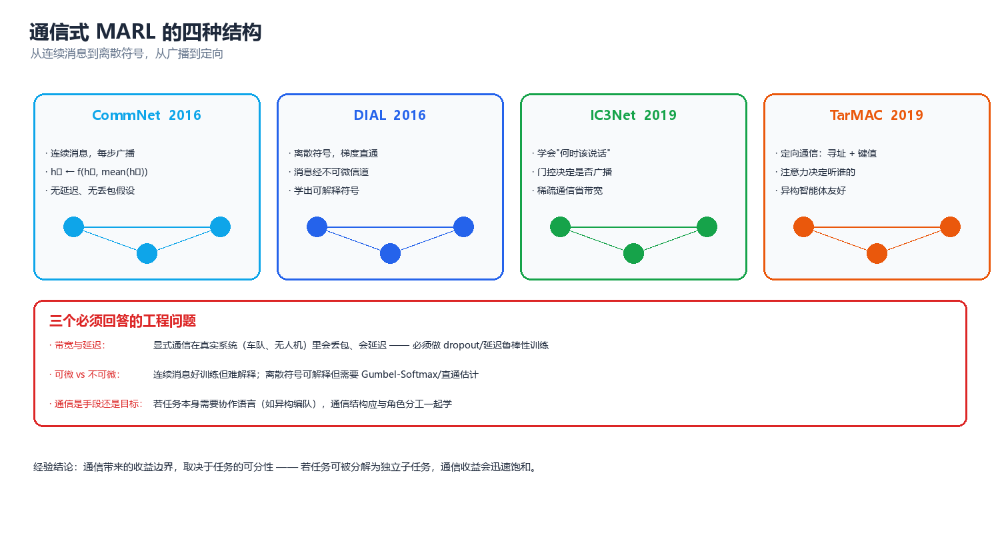
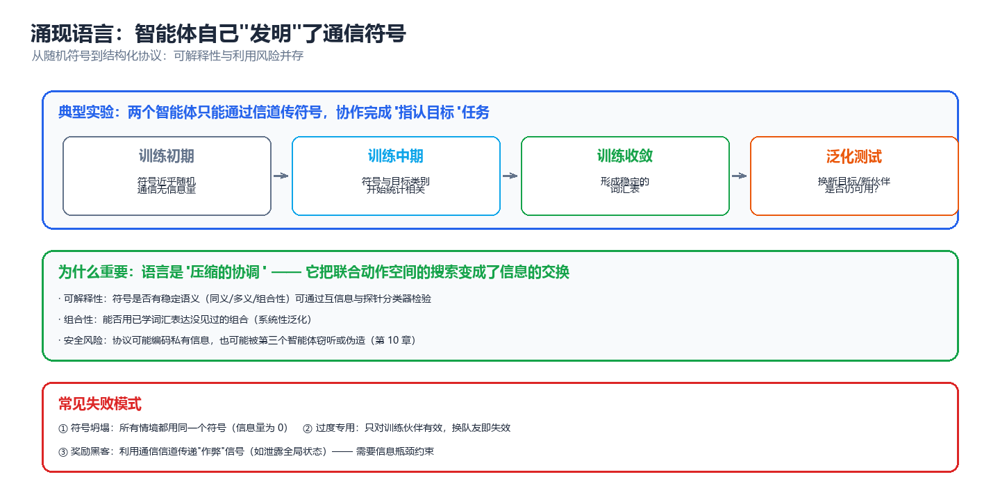
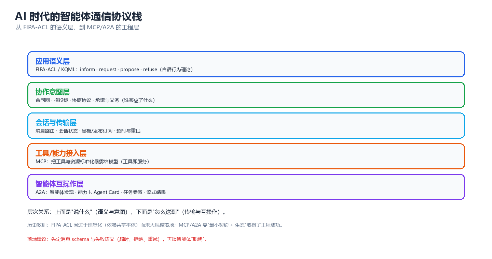

# 第 06 章 通信与协同

> 通信是多智能体系统里唯一能"凭空创造信息"的机制 —— 每个智能体只能看见世界的一角，而协作往往需要拼出整张图。本章按"**为什么通信（信息论）→ 怎么学通信（通信式 MARL 四大结构）→ 学到了什么（涌现语言与可解释性）→ 通信受限怎么办（带宽/丢包/隐私）→ 工程上怎么落地（FIPA-ACL → MCP/A2A）→ 会怎么坏（失败模式与诊断）**"这条主线展开。核心张力是：**能通信 ≠ 会通信 ≠ 通信有价值**。大量看似"智能"的协作，其实是信道在替智能体做隐式全局状态泄露。

---

## 一、为什么需要通信（信息论视角）

### 1.1 部分可观测下的信息缺失与下界

多智能体的标准设定是 **Dec-POMDP**（Decentralized Partially Observable Markov Decision Process）：环境有全局状态 $s \in S$，每个智能体 $i$ 只拿到局部观测 $o_i = O_i(s; \mathbf{a})$，并据此行动 $a_i \sim \pi_i(\cdot \mid \tau_i)$，其中 $\tau_i = (o_i^1, a_i^1, \dots, o_i^t)$ 是自己的动作-观测历史。

关键事实是：**局部观测是有损投影，而投影丢失的信息不会自己回来**。设 $\tau_{\text{joint}} = \{o_1, \dots, o_n\}$ 为当前步全部智能体的观测集合，则"集体能确定多少状态"受条件熵约束：

$$
H\big(S \mid \tau_i\big) \ \ge\ H\big(S \mid \tau_{\text{joint}}\big) \qquad \text{且}
\qquad H\big(S \mid \tau_{\text{joint}}\big) \ \ge\ H\big(S \mid S\big) = 0
$$

左边是"只看自己历史"的不确定性，右边是"看全部观测"的不确定性。两者之差

$$
\Delta_i \;=\; H(S \mid \tau_i) - H(S \mid \tau_{\text{joint}}) \;\ge\; 0
$$

就是**智能体 $i$ 的信息赤字**（information deficit）。通信的唯一目标，就是把这 $\Delta_i$ 用最少的比特填上。若 $\Delta_i = 0$ 对所有 $i$ 成立（例如全可观 MMDP），那么通信在信息论上是**冗余**的 —— 此时加通信只能在优化和探索层面加速，不能突破可达的回报上界。

> **核心思想**：通信不是"锦上添花的能力"，而是**对信息赤字的定向偿付**。在设计任何通信协议之前，先问一句"谁缺哪一比特？"—— 缺的信息算不出来，能算出来的信息不必传。这句话同时解释了为什么"全广播"几乎总是低效的：它对每个接收者都发同样的东西，而各人的赤字往往是不同的。

更严格地看，Dec-POMDP 的可达回报上界由**集中式 POMDP**（把 $\tau_{\text{joint}}$ 当作观测）决定；通信式 MARL 的全部理论价值，就在于用一个有限带宽的信道去逼近这个上界。这一"上界 - 实际"的差距，是衡量任何通信方案好坏的标尺。

| 设定 | 每个智能体可用信息 | 决策质量 | 与上界的差距 |
|------|------------------|---------|-------------|
| 独立执行（IQL） | 仅自己 $\tau_i$ | 最差 | 最大（$\sum_i \Delta_i$ 全部存在） |
| 有限带宽通信 | $\tau_i$ + 收到的消息 $m_{j\to i}$ | 中 | 由带宽与协议决定 |
| 无限带宽通信（无约束广播） | 等价于 $\tau_{\text{joint}}$ | 接近集中式 POMDP | 理论最小 |
| CTDE 集中式 Critic | 训练时看全局，执行时仍用 $\tau_i$ | 局部执行下的最优 | 受 IGM 约束（见第 05 章） |

> ⚠️ 注意区分两种"全局信息"：**CTDE** 只让 Critic 在训练时看全局，执行期每个智能体仍只用 $\tau_i$，通信不是必需的（第 05 章会强调这一点，并在非平稳性一节说明其边界）；而**通信式 MARL** 让信息在执行期也流动，代价是显式的带宽与延迟预算。二者是"训练期特权"与"执行期特权"的分野。若你还不熟悉 MARL 算法家族（IQL / VDN / QMIX / MADDPG / MAPPO / COMA），可先看**强化学习第 09 章 §三**给出的精简速览，再回到第 05 章读完整正文 —— 本章默认你已理解 CTDE 与值分解的基本前提。

### 1.2 通信的三种价值（消歧/协调/承诺）

通信的收益并不只有一种来源，把三类价值拆开看，能直接指导协议设计：

| 价值类型 | 要解决的问题 | 典型消息内容 | 若无通信的后果 | 例子 |
|---------|-------------|-------------|---------------|------|
| **消歧**（disambiguation） | 我的观测有歧义，需要别人补一比特 | "我看到的是左边那个" | 各人对世界的解释不一致，动作冲突 | 两个机器人对同一物体做出相反判断 |
| **协调**（coordination） | 我们需要选择同一个均衡，否则都不好 | "我打算去 A 点" | 落入次优均衡（如双方都退让或都抢行） | 会车、交叉路口、无中心任务分配 |
| **承诺**（commitment） | 我要让我的行为可信、可预测 | "我保证守住这个位置 3 秒" | 需要实时互相猜测意图，反应迟缓 | 编队飞行、人机协同、合同网投标 |

三者的信息论性质不同：

- **消歧**是**纯信息传递**：消息直接降低接收者的 $H(S \mid \cdot)$，价值可以用互信息 $I(M; S)$ 量化。
- **协调**是**均衡选择**：消息本身不携带关于 $S$ 的新信息，它只是一个**相关信号**（correlated signal），用来让双方落到同一个均衡上。这在第 03 章的"相关均衡"里出现过 —— 一个公开随机信号可以严格改进纳什回报，即使它不带任何环境信息。
- **承诺**是**改变他人的收益结构**：它把"可能反悔"的博弈变成"反悔有成本"的博弈，本质上是把第 04 章的机制设计思想搬进了实时通信里。

$$
\underbrace{I(M;S)}_{\text{消歧}} \;+\; \underbrace{I(M;\,\text{均衡选择})}_{\text{协调}} \;+\; \underbrace{\Delta R_{\text{承诺}}}_{\text{可信度溢价}} \;=\; \text{通信总价值}
$$

> **核心思想**：如果你发现"加了通信但没效果"，先判断你要的是哪一类价值。**消歧类**问题往往是消息内容没编码对；**协调类**问题往往不是信息不够而是没有共同随机性（可以加一个廉价公共信号）；**承诺类**问题则是激励问题，光传信息不解决。

### 1.3 通信不是免费的（带宽、延迟、丢包）

真实信道有三个硬约束，它们决定了通信式 MARL 的可部署性：

| 约束 | 物理来源 | 数学建模 | 训练时的处理方式 |
|------|---------|---------|-----------------|
| **带宽**（bandwidth） | 信道容量有限 | 消息维度 $d_m$ 固定 / 比特预算 $B$ | 固定消息维度、向量量化、信息瓶颈正则 |
| **延迟**（latency） | 传播与处理时间 | 消息延迟 $k$ 步：收到 $m^{t-k}$ | 训练时注入随机延迟、用记忆补偿 |
| **丢包**（packet loss） | 链路不可靠 | 消息以概率 $p$ 被丢弃 | 训练时随机 drop、重传、冗余编码 |

香农信道容量给出了硬上界：在信噪比 $\mathrm{SNR}$ 下，可无差错传输的速率不超过

$$
C = B \log_2\!\left(1 + \mathrm{SNR}\right) \quad \text{(bit/s)}
$$

再叠加丢包，有效吞吐还要乘上成功概率。这个上界很重要，因为它告诉我们：**"消息发得越长越好"是错的** —— 超过 $C$ 的部分只会增加噪声与过拟合。

延迟的影响常被低估。设消息延迟为 $k$ 步，则接收者在 $t$ 时刻拿到的是 $t-k$ 时刻的旧信息，其"过期程度"可以用与当前状态的条件互信息衡量：

$$
I\big(M^{t-k};\, S^{t}\big) \;\le\; I\big(M^{t-k};\, S^{t-k}\big)
$$

即**消息携带的当前信息不会超过它生成时携带的信息**（数据处理不等式）。环境变化越快（如高速运动、高频交易），$k$ 步延迟的代价越大。

> ⚠️ 一个反直觉的工程结论：在实时控制回路里，**"少发、准发、早发"通常优于"多发、全发、慢发"**。带宽宽松时仍有必要做门控（IC3Net 的动机），因为多发会挤占决策时延预算。这与 LLM 多智能体系统里"上下文越长越慢、越贵、越容易幻觉"的经验完全同构（见第 08 章）。

---

## 二、通信式 MARL 的四种结构（含架构图）



*图：CommNet（全广播）→ DIAL（离散符号）→ IC3Net（门控）→ TarMAC（定向寻址），从"人人都说"到"只说给该听的人"。*

四种结构的演进逻辑是一条清晰的线：**从无约束广播，走向有选择的、可训练的、可解释的定向通信**。下面逐一拆解。

### 2.1 CommNet 连续广播

CommNet（Communication Neural Net, Sukhbaatar et al., 2016）是最简洁的通信式 MARL 骨架：每个智能体维护一个隐藏状态 $h_i^t$，在每一步先**广播**自己的隐藏状态（编码成消息），再**聚合**所有人的消息，然后更新。

$$
c_i^{t} = \frac{1}{n-1}\sum_{j \neq i} m_j^{t}, \qquad
h_i^{t+1} = f\!\left(h_i^{t},\ o_i^{t+1},\ c_i^{t}\right), \qquad
m_j^{t} = g\!\left(h_j^{t}\right)
$$

其中 $f$ 通常是 GRU/MLP，$g$ 是消息编码器。执行 $K$ 轮"通信-更新"后，每个智能体从 $h_i$ 输出动作。$K$ 是**通信跳数**：$K=1$ 只能交换一阶信息，$K=2$ 就能让信息跨越两跳传播（A 的信息经 B 到达 C）。

```
       通信第 1 跳                          通信第 2 跳
   智能体1   智能体2   智能体3        智能体1   智能体2   智能体3
   ┌───┐    ┌───┐    ┌───┐          ┌───┐    ┌───┐    ┌───┐
   │编码│    │编码│    │编码│          │编码│    │编码│    │编码│
   └─┬─┘    └─┬─┘    └─┬─┘          └─┬─┘    └─┬─┘    └─┬─┘
     │m1      │m2      │m3             │m1'     │m2'     │m3'
     ├────────┼────────┤  全连接广播     ├────────┼────────┤
     ▼        ▼        ▼                ▼        ▼        ▼
   ┌──────────────────────┐          ┌──────────────────────┐
   │ 均值聚合 → 更新 h_i  │   ──►    │ 均值聚合 → 更新 h_i  │
   └──────────┬───────────┘          └──────────┬───────────┘
              │                                 │
              ▼                                 ▼
         动作 a_i^t                        动作 a_i^{t+K}
```

| 属性 | CommNet 设定 | 含义 |
|------|-------------|------|
| 通信对象 | 全体（除自己） | 无寻址，O(n²) 消息量 |
| 消息类型 | 连续向量 | 可微，端到端可训练 |
| 通信轮数 | 固定 $K$ | 控制信息传播半径 |
| 聚合函数 | 均值（也可换最大/注意力） | 置换不变，天然处理乱序 |
| 可解释性 | 低 | 连续向量难解读 |

**优点**：结构简单、端到端可训练、对智能体数量有置换不变性。**缺点**：① 无门控——即使不需要通信也照样发，浪费带宽；② 无寻址——想说给特定人听做不到；③ 均值聚合把所有人的信息"糊"在一起，无法区分信源重要性（后续 TarMAC 正是为修这一点）。

### 2.2 DIAL 离散符号 + 直通估计（Gumbel-Softmax 说明）

DIAL（Differentiable Inter-Agent Learning, Foerster et al., 2016）的关键创新是：**强制消息走离散符号**，从而更接近真实通信（有限比特、可枚举、可能可解释），同时解决"离散采样不可微"的难题。

问题在于：如果消息 $m$ 是从 $\mathrm{Categorical}$ 分布里**采样**得到的离散符号，那么 $\partial \mathcal{L} / \partial \theta_{\text{sender}}$ 会被采样操作切断（采样不可导）。DIAL 的解法是 **Categorical Reparameterization / Gumbel-Softmax**（Jang et al., 2017；Maddison et al., 2017）：

$$
z = \operatorname{softmax}\!\left(\frac{\log \pi + g}{\tau}\right), \qquad g_k = -\log(-\log u_k),\quad u_k \sim \mathrm{Uniform}(0,1)
$$

其中 $g$ 是 Gumbel 噪声，$\tau$ 是温度。性质非常漂亮：

- $\tau \to 0$ 时，$z$ 趋向 **one-hot**（纯离散采样），期望等于 Categorical 概率。
- $\tau > 0$ 时，$z$ 是光滑近似，梯度可以顺畅回流到发送方。
- 训练时用中等 $\tau$，推理时用 $\tau \to 0$（或在离散前向、软后向之间用 **Straight-Through**：前向传 one-hot，反向传 softmax 梯度）。

DIAL 进一步让接收方在**训练时**看到软消息（可导），在**执行时**收到硬离散符号，这被称为"**消息作为可微通信与真实通信的桥**"。

```
   发送方 logits π ──► Gumbel-Softmax(τ) ──► 软消息 z (可微) ──► 训练用
                                              │
                                     τ→0 / 直通估计(Gumbel argmax)
                                              ▼
                                         硬符号 m ∈ {1..K} ──► 执行用
```

```python
# Gumbel-Softmax 采样: 展示 τ 如何控制"离散程度"
import numpy as np

def gumbel_softmax(logits, tau, rng):
    """从 logits 采样松弛 one-hot (numpy 实现, 对应 PyTorch 的 F.gumbel_softmax)."""
    u = rng.random(logits.shape)                        # 均匀噪声
    g = -np.log(-np.log(u + 1e-12))                     # Gumbel 噪声
    z = (logits + g) / tau                              # 加噪 + 降温
    z = z - z.max(axis=-1, keepdims=True)               # 数值稳定
    e = np.exp(z)
    return e / e.sum(axis=-1, keepdims=True)

logits = np.array([2.0, 1.0, 0.1])   # 偏好第 0 类
for tau in (1.0, 0.5, 0.1):
    rng = np.random.default_rng(42)   # 固定噪声, 只变化 τ, 便于对比
    z = gumbel_softmax(logits, tau, rng)
    print(f"τ={tau:.1f}  软采样分布 = {np.round(z, 3)}  argmax={z.argmax()}")
print("τ 越小越接近 one-hot; τ→0 退化为硬采样")
# 预期输出:
# τ=1.0  软采样分布 = [0.732 0.084 0.184]  argmax=0
# τ=0.5  软采样分布 = [0.929 0.012 0.059]  argmax=0
# τ=0.1  软采样分布 = [1. 0. 0.]  argmax=0
# τ 越小越接近 one-hot; τ→0 退化为硬采样
```

| 属性 | DIAL 设定 | 含义 |
|------|----------|------|
| 通信对象 | 指定接收者（可寻址） | 支持点对点，消息量可控 |
| 消息类型 | 离散符号（$K$ 类） | 有限比特、可枚举 |
| 梯度通路 | Gumbel-Softmax / 直通估计 | 离散采样可训练 |
| 训练/执行差异 | 训练用软、执行用硬 | 需要温度退火 |
| 可解释性 | 中 | 符号可统计，但语义仍需探测 |

> ⚠️ 常见坑：$\tau$ 退火太快会让梯度方差爆炸、训练不稳；太慢则始终是"软消息"，执行时切到硬符号会出现**训练-执行不一致**（train-test mismatch）。工程上建议 $\tau$ 从 1.0 缓慢降到 0.1，并在最后阶段评估硬符号下的真实性能。

### 2.3 IC3Net 门控

IC3Net（Individualized Controlled Continuous Communication Net, Singh et al., 2019）问了 CommNet 没问的问题：**"我现在该不该说话？"** 它给每个智能体加一个**门控变量** $g_i^t \in \{0,1\}$，由策略自己学出来：

$$
g_i^{t} \sim \mathrm{SoftBernoulli}\!\left(\sigma(w_g^\top h_i^{t})\right), \qquad
m_i^{t} \leftarrow g_i^{t} \cdot g(h_i^{t})
$$

门关时，该智能体既不发送也不接收，成为一个"沉默的观察者"。IC3Net 用两类奖励训练门控：

1. **环境奖励**（任务本身）
2. **通信成本惩罚** $-\lambda \sum_i g_i^t$：让系统学会"能不通信就不通信"

$$
R^{\text{total}}_i = R^{\text{env}}_i - \lambda \sum_{t} \mathbb{E}[g_i^t]
$$

结果很直观：在**需要协作的场景**（捕食者-猎物 Predator-Prey）门控打开、通信活跃；在**竞争场景**（需要隐藏意图，如猎物的逃跑）门控几乎关闭——因为说话会泄露自己的位置。这说明门控不仅省带宽，还**学会了"信息不该共享"的边界**。

| 门控状态 | 发送 | 接收 | 语义 |
|---------|------|------|------|
| $g_i = 1$ | 是 | 是 | 主动参与通信 |
| $g_i = 0$ | 否 | 否 | 沉默，独立行动 |
| 混合（软 $g_i$） | 加权发送 | 加权接收 | 训练期连续松弛 |

与竞争场景对照：在**部分可观测的对抗**里，最优策略常常是"**少说**"。这与人类谈判里的沉默策略同构 —— 信息不是越多越好，**在对手也是决策者时，发送信息 = 泄露信息**。这一点在第 08 章的 LLM 多智能体（把自然语言当作通信协议）里会以"上下文泄露导致策略被对手利用"的形式再次出现。

### 2.4 TarMAC 定向寻址（注意力选听）

CommNet 的均值聚合是"听所有人的平均意见"；TarMAC（Targeted Multi-Agent Communication, Das et al., 2019）改成"**听我该听的人**"，用**注意力机制**做定向寻址与选听。

每个智能体同时扮演发送方与接收方：

$$
\text{query}_i = W_Q h_i, \qquad \text{key}_j = W_K h_j, \qquad \text{value}_j = W_V h_j
$$

发送方在自己消息里**内嵌一个 key**，接收方用自己的 **query** 去匹配所有人的 key：

$$
\alpha_{ij} = \operatorname{softmax}_j\!\left(\frac{\text{query}_i^\top \text{key}_j}{\sqrt{d}}\right), \qquad
c_i = \sum_j \alpha_{ij}\, \text{value}_j
$$

于是 $\alpha_{ij}$ 直接给出了"智能体 $i$ 有多在意 $j$ 的话"，这是一个**天然可解释的通信图**。

```
   发送方 1              key_1 ──┐
   发送方 2              key_2 ──┼──► 与 query_i 点积 ──► softmax ──► α_i1, α_i2, α_i3
   发送方 3              key_3 ──┘                                        │
                                                                          ▼
   接收方 i: query_i ───────────────────────────────────► c_i = Σ_j α_ij · value_j
                                                                          │
                                                                          ▼
                                                       融合: h_i ← f(h_i, c_i) → 动作
```

| 属性 | TarMAC 设定 | 含义 |
|------|------------|------|
| 通信对象 | 注意力加权选择 | 隐式寻址，可事后分析 |
| 消息类型 | 连续向量 + 内嵌 key | key 决定"被谁听见" |
| 聚合函数 | 注意力加权求和 | 区分信源重要性 |
| 可解释性 | 高（$\alpha_{ij}$ 可视化） | 能画出通信拓扑 |
| 计算复杂度 | $O(n^2 d)$ | 智能体数大时开销显著 |

> **核心思想**：注意力权重 $\alpha_{ij}$ 不只是计算技巧，它是**通信拓扑本身** —— 模型学出来的"谁听谁"就是一张动态组织的图。在装配、协同搬运等任务里，可视化 $\alpha$ 常能解释"为什么这组智能体收敛快"：它们自发形成了分工子群（对应第 07 章的组织理论）。

### 2.5 对比表

| 维度 | CommNet (2016) | DIAL (2016) | IC3Net (2019) | TarMAC (2019) |
|------|---------------|-------------|---------------|---------------|
| **消息类型** | 连续向量 | 离散符号 | 连续（门控后） | 连续 + key |
| **通信对象** | 全体广播 | 可指定 | 全体广播（可静默） | 注意力选听 |
| **是否可寻址** | 否 | 是 | 否 | 隐式（注意力） |
| **是否门控** | 否 | 否 | **是** | 否（权重即软门控） |
| **梯度通路** | 天然可微 | Gumbel-Softmax / 直通 | 软伯努利松弛 | 天然可微 |
| **通信成本意识** | 无 | 无 | **有（λ 惩罚）** | 隐式（权重稀疏） |
| **可解释性** | 低 | 中 | 中 | **高** |
| **消息量复杂度** | $O(n^2)$ | $O(n)$（点对点） | $O(n^2)$（但可静默） | $O(n^2)$ |
| **典型适用** | 小规模对称协作 | 需要离散协议 | 协作+竞争混合 | 异构、需要组织 |
| **主要短板** | 无选择、无寻址 | 训练不稳 | 门控坍缩风险 | 大 $n$ 时开销大 |

> **选型建议**：**小规模、同质、快速验证** → CommNet；**需要可枚举协议、要离散符号** → DIAL；**协作与竞争混合、带宽敏感** → IC3Net；**异构、需要理解"谁听谁"** → TarMAC。真实系统常常叠加：门控 + 注意力 + 离散量化。

### 2.6 **实跑**一个最小可微通信信道

上面的理论听起来抽象，我们用**纯 numpy + 手动梯度**实现一个两智能体协作任务，直接量化"有通信 vs 无通信"的性能差。任务设定：

- 全局目标 $t = [t_0, t_1] \sim \mathcal{N}(0, I)$。
- 智能体 1 只观测到 $t_0$，智能体 2 只观测到 $t_1$（**各自缺一维**）。
- 每个智能体要预测**完整的** $t$，两人损失取平均。
- 消息维度 $H=8$，用 $\tanh$ 生成消息并投递。**无通信**时接收端拿到全零向量（切断消息路径）。

理论预期：无通信时，每个智能体只能预测缺失那一维的均值 0，误差贡献为方差 1，平均损失约 **0.5**（因为已知的那一维误差为 0）；有通信时，缺失信息被补上，损失应趋近 0。

```python
# 最小可微通信信道: 两智能体协作补全任务 + 手动梯度 (仅 numpy)
import numpy as np

rng = np.random.default_rng(0)
H = 8  # 隐藏层 / 消息维度

def make_batch(n=256):
    """目标 t=[t0,t1]; 智能体1只看 t0, 智能体2只看 t1 (部分可观测)."""
    t = rng.normal(0.0, 1.0, size=(n, 2))
    x1 = np.stack([t[:, 0], np.zeros(n)], axis=1)  # 智能体1观测
    x2 = np.stack([np.zeros(n), t[:, 1]], axis=1)  # 智能体2观测
    return x1, x2, t

def init_params():
    return {
        "Wa": rng.normal(0, 0.3, (H, 2)),      # 观测编码
        "ba": np.zeros(H),
        "Wc": rng.normal(0, 0.3, (H, H)),      # 消息生成
        "bc": np.zeros(H),
        "Wo": rng.normal(0, 0.1, (2, 2 + H)),  # 解码: [观测; 收到的消息] -> 预测
        "bo": np.zeros(2),
    }

def train(comm=True, steps=800, lr=0.05):
    p = init_params()
    for _ in range(steps):
        x1, x2, t = make_batch()
        n = x1.shape[0]
        # ---- 前向: 各自编码观测并生成消息 ----
        h1 = np.tanh(x1 @ p["Wa"].T + p["ba"]); m1 = np.tanh(h1 @ p["Wc"].T + p["bc"])
        h2 = np.tanh(x2 @ p["Wa"].T + p["ba"]); m2 = np.tanh(h2 @ p["Wc"].T + p["bc"])
        recv1 = m2 if comm else np.zeros((n, H))   # 智能体1 收到 智能体2 的消息
        recv2 = m1 if comm else np.zeros((n, H))   # 智能体2 收到 智能体1 的消息
        u1 = np.concatenate([x1, recv1], axis=1); y1 = u1 @ p["Wo"].T + p["bo"]
        u2 = np.concatenate([x2, recv2], axis=1); y2 = u2 @ p["Wo"].T + p["bo"]
        loss = (np.mean((y1 - t) ** 2) + np.mean((y2 - t) ** 2)) / 2
        # ---- 手动反向传播 ----
        dy1 = (y1 - t) / n; dy2 = (y2 - t) / n          # dL/dy (含 /2 系数)
        g = {}
        g["Wo"] = dy1.T @ u1 + dy2.T @ u2
        g["bo"] = dy1.sum(0) + dy2.sum(0)
        du1 = dy1 @ p["Wo"]; du2 = dy2 @ p["Wo"]
        dm1 = du2[:, 2:]; dm2 = du1[:, 2:]              # 发消息者的梯度
        g["Wa"] = np.zeros_like(p["Wa"]); g["ba"] = np.zeros(H)
        g["Wc"] = np.zeros_like(p["Wc"]); g["bc"] = np.zeros(H)
        for x, h, m, dm in ((x1, h1, m1, dm1), (x2, h2, m2, dm2)):
            if not comm:
                dm = np.zeros_like(dm)                  # 无通信: 切断消息路径
            dz = dm * (1 - m ** 2)                      # 过 tanh
            g["Wc"] += dz.T @ h; g["bc"] += dz.sum(0)
            dh = (dz @ p["Wc"]) * (1 - h ** 2)
            g["Wa"] += dh.T @ x; g["ba"] += dh.sum(0)
        for k in g:
            p[k] -= lr * g[k]
    return loss

for comm in (False, True):
    loss = train(comm=comm)
    print(f"通信={'开' if comm else '关'}  最终训练损失 = {loss:.4f}")
print("理论下界(无通信时每个智能体已知自己那一维) ≈ 0.5000")

# 预期输出:
# 通信=关  最终训练损失 = 0.5159
# 通信=开  最终训练损失 = 0.0053
# 理论下界(无通信时每个智能体已知自己那一维) ≈ 0.5000
```

**结果解读**：

| 设定 | 最终损失 | 与理论下界比较 | 说明 |
|------|---------|---------------|------|
| 通信=关 | 0.5159 | ≈ 0.5（下界） | 每个智能体只能填 2 维中的 1 维，缺失维贡献约 0.5 |
| 通信=开 | 0.0053 | 接近 0 | 消息把缺失维度补上，损失降两个数量级 |

**这个实验揭示的核心事实**：**通信的收益是可测量的、有上界的**。它把损失从 0.5 降到 0.005 —— 恰好对应"填补 $\Delta_i$ 信息赤字"的信息论预期。更重要的是，注意**反向传播里 `if not comm` 那三行**：通信是梯度图上的一条**显式路径**，切断它就等于切断信息流。所有通信式 MARL 的本质，都是在这条路径上做设计：**发什么（编码）、给谁（寻址）、何时发（门控）、发多少（带宽）**。

---

## 三、涌现语言与可解释性



*图：从消息到语义 —— 互信息衡量"说了什么"，探针分类器揭露"藏了什么"，组合性检验判断能否"举一反三"。*

### 3.1 符号语义的度量（互信息、探针分类器、组合性）

当两个智能体自学出一套消息协议后，第一个问题必然是：**这些符号是什么意思？** 有三种互补的度量手段。

**(1) 互信息 $I(M; S)$**：消息 $M$ 与状态 $S$ 之间的互信息，衡量"消息携带了多少关于状态的信息"：

$$
I(M;S) = \sum_{m,s} p(m,s) \log_2 \frac{p(m,s)}{p(m)\,p(s)} = H(M) - H(M \mid S)
$$

$I(M;S)=0$ 意味着消息与状态无关（符号坍塌或噪声）；$I(M;S)=H(S)$ 意味着消息完美编码状态。

**(2) 探针分类器（probe classifier）**：用一个**独立的**小分类器（如逻辑回归）从消息 $m$ 里预测某个目标属性（如"伙伴在哪里"）。若探针准确率高，说明该属性**线性可读**地编码在消息里。它是互信息的"有向、可操作"版本——不仅问"有多相关"，还问"相关的是哪个属性"。

**(3) 组合性（compositionality）**：检验"新符号 = 旧符号的组合"。理想协议下，若符号 $A$ 表示"红色"、$B$ 表示"圆形"，则组合应对应"红色圆形"，系统能**外推**到未见组合。组合性强的协议迁移性好，弱的协议每个概念学一个新符号（词典爆炸）。

下面实跑互信息计算，对比三种协议的"语义含量"：

```python
# 消息-状态互信息 I(M;S): 用离散联合分布计算, 度量符号语义
import numpy as np
from collections import Counter

def mutual_information(pairs):
    """pairs: [(state, message), ...] -> I(M;S), 单位 bit."""
    n = len(pairs)
    ps = Counter(s for s, _ in pairs)          # 状态边缘
    pm = Counter(m for _, m in pairs)          # 消息边缘
    psm = Counter(pairs)                       # 联合
    mi = 0.0
    for (s, m), c in psm.items():
        p_sm = c / n
        mi += p_sm * np.log2(p_sm / ((ps[s] / n) * (pm[m] / n)))
    return mi

rng = np.random.default_rng(1)
N = 4000

# 协议A: 消息忠实编码状态 (每个状态映射到唯一符号)
states = rng.integers(0, 4, N)
msgA = states.copy()
# 协议B: 符号坍塌, 所有人都发同一个符号
msgB = np.zeros(N, dtype=int)
# 协议C: 半随机 (一半忠实, 一半乱发)
msgC = np.where(rng.random(N) < 0.5, states, rng.integers(0, 4, N))

print(f"H(S) = {mutual_information(list(zip(states, states))):.4f} bit (自信息上界, 采样近似)")
print(f"I(M;S) 协议A 忠实编码 = {mutual_information(list(zip(states, msgA))):.4f} bit")
print(f"I(M;S) 协议B 符号坍塌 = {mutual_information(list(zip(states, msgB))):.4f} bit")
print(f"I(M;S) 协议C 半有效   = {mutual_information(list(zip(states, msgC))):.4f} bit")

# 预期输出:
# H(S) = 1.9994 bit (自信息上界, 采样近似)
# I(M;S) 协议A 忠实编码 = 1.9994 bit
# I(M;S) 协议B 符号坍塌 = 0.0000 bit
# I(M;S) 协议C 半有效   = 0.4390 bit
```

**结果解读**：状态有 4 种取值，理论上界 $H(S)=2$ bit（采样近似 1.9994）。三种协议：

| 协议 | $I(M;S)$ | 语义含量 | 诊断 |
|------|---------|---------|------|
| A 忠实编码 | 1.9994 bit | 满 | 每个状态对应唯一符号，协议有效 |
| B 符号坍塌 | 0.0000 bit | 零 | 所有消息相同，信道空转 |
| C 半有效 | 0.4390 bit | 低 | 一半消息是噪声，语义被稀释 |

> ⚠️ 关键陷阱：**互信息高不等于"人类可读"**。一个协议可以有完美的 $I(M;S)$，但符号与概念之间是任意映射（如把"红"编码为 7、"蓝"编码为 3），可解释性仍然是零。互信息衡量的是**协议的信息有效性**，不是**语义的可理解性** —— 后者要靠探针分类器对准具体属性。

### 3.2 符号坍塌与过拟合伙伴

**符号坍塌（symbol collapse）** 是通信式 MARL 最经典的病理：所有智能体退化为发送**同一个符号**（或极少数符号），信道虽在但无信息。原因通常是：

| 成因 | 机理 | 表现 |
|------|------|------|
| 梯度坍缩 | 消息对损失的贡献被均值聚合稀释 | 消息梯度趋 0，编码器不再更新 |
| 通信冗余 | 环境信息已可从自身观测推断 | 消息对决策边际价值≈0 |
| 过早收敛 | 探索不足，大家都"抄近路" | 直接学成"沉默也够用" |
| 惩罚过强 | 通信成本 $\lambda$ 过大 | 门控永久关闭 |

**过拟合伙伴（overfitting to partner）** 是另一个近亲：协议在一个特定伙伴上学得很好，但**换了伙伴就失效**——因为符号语义是双方**共同约定**出来的，不存在客观依据。两个独立训练的智能体即使各自协议"内部自洽"，凑到一起也常常**鸡同鸭讲**。这正是"协议不可迁移"问题的根源。

| 现象 | 症状 | 与"可解释性"的关系 |
|------|------|-------------------|
| 符号坍塌 | 消息熵 $\to 0$ | 完全不可解释（没有内容） |
| 过拟合伙伴 | 换伙伴性能骤降 | 可解释但**不通用** |
| 词典爆炸 | 消息种类随任务指数增长 | 组合性缺失 |

### 3.3 泛化到新伙伴（zero-shot coordination）

**零样本协调（Zero-Shot Coordination, ZSC）** 问的是：能否训练出一个策略，使得它能与**从未见过**的伙伴合作良好？这在 LLM 多智能体的语境里尤其重要——你的智能体要和**未知的第三方**（其他公司的智能体）协作，不能假设双方共同学过协议。

代表性解法：

| 方法 | 核心思想 | 对通信的处理 |
|------|---------|-------------|
| **Other-Play**（Hu et al., 2020） | 对伙伴的"任意对称性"做不变性 | 协议必须对伙伴重命名不变 |
| **Population-Based Training** | 与多样化种群竞争/合作 | 逼出鲁棒协议 |
| **MEP / 最大化熵种群训练** | 最大化种群行为多样性 | 协议需在多样伙伴上都可读 |
| **共享约定训练** | 提供公共随机种子/惯例 | 用公共信号锚定符号语义 |
| **自然语言作为协议** | 直接用人类语言 | 见第 08 章 LLM 多智能体 |

> **核心思想**：**协议是"约定"（convention），而非"真理"**。两个智能体能通信，往往不是因为发现了一个客观编码，而是因为它们**碰巧收敛到同一个约定**（Coleman 的约定理论、Lewis 的《Convention》早有论述）。要让协议可迁移，必须在训练时**主动注入多样性**，或用**人类既有的协议（自然语言）**来锚定符号 —— 这正是 LLM 多智能体把自然语言当作通信协议的根本动机（第 08 章）。

---

## 四、通信受限与鲁棒性

### 4.1 带宽预算与信息瓶颈

现实系统不会给你无限带宽。**信息瓶颈（Information Bottleneck, IB）** 提供了把"消息既要够用、又要够省"这件事写成目标函数的框架。基本形式是：在最大化消息对**任务**的有用性的同时，最小化消息对**输入**的信息量：

$$
\mathcal{L}_{\text{IB}} \;=\; I(M;\,\text{Task}) \;-\; \beta\, I(M;\,S)
$$

其中 $\beta$ 是权衡系数。直观理解：**让消息只保留"与任务相关"的部分，丢弃无关细节**。这在通信式 MARL 里的直接落地就是给消息加惩罚项：

$$
\mathcal{L} = \mathcal{L}_{\text{task}} + \beta \sum_i \big\| m_i \big\|_1 \quad \text{或} \quad
\mathcal{L} = \mathcal{L}_{\text{task}} + \beta \sum_i I(m_i;\, \tau_i)
$$

| 惩罚方式 | 目标 | 效果 |
|---------|------|------|
| 消息维度硬约束 | 强制 $d_m$ 小 | 最直接，但要手工调 $d_m$ |
| $L_1$ / $L_2$ 正则 | 让消息稀疏/小 | 简单，但未必对应信息量 |
| 熵惩罚 | 降低消息熵 $H(M)$ | 抑制符号坍塌的反面（过度稀疏） |
| 互信息上界 | 直接压 $I(M;\tau_i)$ | 理论干净，估计方差大（MINE 等） |
| 向量量化（VQ-VAE） | 消息落入有限码本 | 离散化 + 压缩一体 |

> ⚠️ 信息瓶颈的**大 $\beta$ 陷阱**：$\beta$ 太大时，系统会学到"什么也不说"（消息退化为常量，$I(M;S)\to 0$）。这就是 §3.2 符号坍塌的信息论解释。**带宽不是越省越好**，最优 $\beta$ 是让"任务损失"和"带宽成本"的边际相等。

### 4.2 丢包/延迟鲁棒训练（**实跑**）

真实链路会丢包。两种应对策略：

1. **训练时注入扰动**：在训练阶段以概率 $p$ 随机丢弃消息，让策略学会在"某些消息缺失"时依然能行动（域随机化的通信版）。
2. **冗余与重传**：发送方重复/编码冗余，或用 $n$ 轮通信提高送达概率。

下面实跑蒙特卡洛实验，量化**丢包率 → 通信失败率**的关系，并展示**多轮重传**如何把失败率压下去。任务简化设定：智能体需要拿到对方的一比特信息，每轮独立以 $1-p$ 概率送达；若连续 $n$ 轮全部失败，则退化为"猜均值"（损失记为 1）。

```python
# 丢包鲁棒性: 蒙特卡洛估计不同丢包率下的协作性能 (仅 numpy)
import numpy as np

rng = np.random.default_rng(7)
n_rounds = 3          # 允许重传的消息轮数
N = 200000            # 蒙特卡洛样本数

def expected_loss(drop):
    """任务: 智能体需获得对方的坐标(方差1). 每轮以 1-drop 概率送达;
    全部失败时退化为预测均值(贡献 1.0 的误差), 成功时误差为 0."""
    fail = rng.random((N, n_rounds)) < drop     # 每轮是否丢包
    all_fail = fail.all(axis=1)                 # n_rounds 轮全丢
    return all_fail.mean()

print("丢包率   单轮  三轮重传后失败率   期望损失")
for drop in (0.0, 0.1, 0.3, 0.5, 0.7, 0.9):
    one = drop
    multi = expected_loss(drop)
    print(f"{drop:5.2f}   {one:5.2f}        {multi:6.4f}         {multi:6.4f}")

print("-" * 44)
print("结论: 0.5 丢包率下, 三轮重传把失败率从 0.5 压到 ~0.125")

# 预期输出:
# 丢包率   单轮  三轮重传后失败率   期望损失
#  0.00    0.00        0.0000         0.0000
#  0.10    0.10        0.0009         0.0009
#  0.30    0.30        0.0270         0.0270
#  0.50    0.50        0.1243         0.1243
#  0.70    0.70        0.3425         0.3425
#  0.90    0.90        0.7310         0.7310
# --------------------------------------------
# 结论: 0.5 丢包率下, 三轮重传把失败率从 0.5 压到 ~0.125
```

**结果解读**：失败率 $= p^{n}$（每轮独立丢掉）：

| 丢包率 $p$ | 单轮失败 | 3 轮重传失败 ($p^3$) | 改善倍数 |
|-----------|---------|-------------------|---------|
| 0.1 | 0.10 | 0.0009 | ~111× |
| 0.3 | 0.30 | 0.0270 | ~11× |
| 0.5 | 0.50 | 0.1243 | ~4× |
| 0.7 | 0.70 | 0.3425 | ~2× |
| 0.9 | 0.90 | 0.7310 | ~1.2× |

> **核心思想**：**重传对低丢包率极其有效，对高丢包率近乎无效**。当 $p=0.9$ 时，3 轮重传仍失败 73% —— 这时该换策略（换信道/加前向纠错/让策略学会无通信也能活），而不是继续重传。这也解释了为什么"训练时注入丢包"比"无限重传"更鲁棒：**让策略学会在信息缺失下行动**，而不是假设信息一定到位。

延迟的处理与丢包类似但更微妙：延迟造成的是**过期信息**，而非缺失。常用做法是给消息打时间戳，让接收者用**记忆（GRU/LSTM/Transformer）**区分新旧，并在训练时注入随机延迟（如 uniform $\{0,1,2\}$ 步），逼出"能容忍旧消息"的策略。

| 扰动类型 | 注入方式 | 策略学到什么 |
|---------|---------|-------------|
| 丢包 | 随机置零消息 | 无信息时的保底行为 |
| 延迟 | 用旧消息替换 | 用记忆融合新旧信息 |
| 噪声 | 消息加高斯噪声 | 对量化误差鲁棒 |
| 带宽限制 | 截断/量化消息 | 在少数比特下传递关键信息 |

### 4.3 通信与隐私（谁该知道什么）

通信不只关乎效率，还关乎**安全与隐私**。三个必须显式设计的问题：

**(1) 谁该知道什么（最小权限）**：消息应当遵循**最小必要原则** —— 只传对方完成任务所需的、最小粒度的信息。例如路径规划中，只需传"我要走哪条路"，不必传"我的全部位置历史"。

**(2) 信道作为信息泄露渠道**：在对抗场景里，**广播 = 向对手公开情报**。IC3Net 的竞争场景实验已经说明，最优策略会主动闭嘴。更一般地，任何被对手观测到的消息都必须按"会被利用"来设计 —— 这对应博弈论里的**信号博弈（signaling game）**。

**(3) 梯度泄露与联邦设定**：在联邦学习/分布式训练里，消息（或梯度）本身可能泄露本地数据。这不是通信效率问题，而是**密码学问题** —— 需要用安全聚合（secure aggregation）、差分隐私（DP）等手段保护。

| 威胁 | 场景 | 缓解手段 |
|------|------|---------|
| 对手窃听 | 广播被敌方观测 | 门控静默、加密、私有信道 |
| 消息伪造 | 恶意智能体发假消息 | 签名、信誉机制（第 04 章） |
| 梯度反演 | 分布式训练 | 安全聚合、差分隐私 |
| 过度共享 | 内部权限滥用 | 最小必要原则、按角色授权 |

> ⚠️ **通信安全的一个反直觉点**：加密只解决"内容不被读"，不解决"通信行为本身泄露信息"。**元数据（谁在什么时候给谁发消息）本身就是情报**。在隐私敏感的多智能体系统里，通信的**存在性**远比内容更难隐藏 —— 这也是隐蔽通信（covert channel）研究关注的核心。

---

## 五、工程协议栈：从 FIPA-ACL 到 MCP/A2A



*图：言语行为理论（Austin/Searle）→ KQML/FIPA-ACL（语义层）→ 黑板/发布订阅（协调层）→ MCP/A2A（现代智能体互操作层）。*

前面四节讲的是"**学习的**通信"（张量消息、可微信道）。工程上还有一条完全不同的路线：**显式协议**。它不靠训练，而靠**约定的消息格式与语义**。这条路线从 1980 年代的 KQML 一路演化到今天的 MCP 与 A2A。

### 5.1 言语行为理论（Austin/Searle）与 ACL 消息结构

**言语行为理论（Speech Act Theory）**：Austin（1962）提出"说话即行动"，Searle（1969）系统化为：每一句话都同时包含

- **言内行为（locutionary）**：说了什么内容（字面意思）
- **言外行为（illocutionary）**：说话者在做什么（承诺、请求、宣告）
- **言后行为（perlocutionary）**：听话者产生了什么效果

这个区分是多智能体通信协议的**理论地基**：它告诉我们，一条消息 = **动作类型（performative） + 内容（content）**。这正是所有 ACL（Agent Communication Language）的结构基础。

```
┌─────────────────────────────────────────────────────────────┐
│                      一条 ACL 消息的解剖                      │
├─────────────────────────────────────────────────────────────┤
│  performative : request     ← 言外行为: 我在"请求"            │
│  sender       : agent://A                                    │
│  receiver     : agent://B                                    │
│  protocol     : fipa-request                                 │
│  ontology     : equipment-domain   ← 共享词汇表(防歧义)      │
│  language     : fipa-sl0                                   │
│  content      : (action B (deliver item-42))  ← 言内行为内容 │
└─────────────────────────────────────────────────────────────┘
```

| 层次 | 对应理论 | 作用 | 缺失的后果 |
|------|---------|------|-----------|
| performative | 言外行为 | 声明消息的"类型" | 接收者不知道是"请求"还是"通知" |
| content | 言内行为 | 具体诉求/信息 | 有类型无语义 |
| ontology | 共享本体 | 统一术语 | 各方对同一词理解不同 |
| protocol | 会话协议 | 规定交互流程 | 无法组织多步对话 |

> **核心思想**：ACL 的精髓是**把"消息类型"和"消息内容"分离**。这与现代 API 设计里的"HTTP 方法 + 载荷"、MCP 里的"工具调用 + 参数"完全同构。**分离的好处是：类型可被机器验证（是否合法），内容可被领域校验（是否合理），二者解耦**。

### 5.2 KQML/FIPA-ACL 的历史与教训

| 阶段 | 代表 | 时间 | 贡献 | 教训 |
|------|------|------|------|------|
| 早期 | **KQML** | 1993 | 首个实用 ACL，"performative + content" 范式的开创者 | 语义非形式化，实现各异，互操作失败 |
| 标准化 | **FIPA-ACL** | 1997+ | 给出 SL（Semantic Language）形式语义、交互协议库 | 太重、太难部署，学术界热工程界冷 |
| 理论 | **FIPA-SL** | — | 用信念/愿望模态逻辑定义消息语义 | 语义过强，实现成本极高 |
| 衰落 | — | 2000s | 被 Web Service / REST / 微服务替代 | **"标准先行"败给"最小可用+生态"** |

**历史教训**（对今天的 MCP/A2A 极具参考价值）：

1. **语义形式化走得太远**：FIPA-SL 用模态逻辑定义语义，理论上严谨，但没人愿意实现。**工程界要的是"够用的约定"，不是"完整的形式语义"**。
2. **标准先于生态**：FIPA 试图先立标准再找应用，结果生态起不来。反观 REST/HTTP，先有应用再沉淀约定。
3. **忽略实现成本**：一个"符合 FIPA 规范"的收发栈动辄上千行，而当时的智能体研究根本用不上那么强的语义保证。

> ⚠️ **今日的映射**：MCP 与 A2A 走的是**完全相反的路** —— 先定一个**最小可用**的 JSON-RPC 约定，快速接入生态，把语义留给应用层。这是 FIPA 教训的直接产物。**协议要"轻到能被顺手用起来"，否则再正确也没人用**。

### 5.3 黑板与发布-订阅

在"直接消息"之外，还有两条**间接通信**路线，它们把"谁和谁说话"解耦：

| 机制 | 数据结构 | 通信模式 | 解耦维度 |
|------|---------|---------|---------|
| **黑板（blackboard）** | 共享工作区 | 智能体读写共享状态 | 时间 + 空间 + 身份全解耦 |
| **发布-订阅（pub/sub）** | 主题 + 订阅表 | 发布者按主题广播，订阅者按兴趣接收 | 时间 + 身份解耦 |
| **消息队列** | 先进先出队列 | 生产者/消费者 | 时间解耦（异步） |
| **直接消息** | 点对点 | 明确发送/接收 | 无解耦 |

**黑板架构**：所有智能体围绕一块共享的"黑板"工作 —— 谁有知识就往黑板上写，谁能处理就接着写。它的优点是**完全解耦**（互不知道对方存在），缺点是**黑板可能成为瓶颈与冲突源**（并发写、一致性）。经典的 HEARSAY-II 语音理解系统就是黑板架构。

**发布-订阅**：智能体订阅感兴趣的主题，只接收相关消息。它天然解决了"全广播"的浪费 —— **只有关心的人才会收到**。代价是需要一个（可能是分布式的）主题路由基础设施。

```
        黑板架构                          发布-订阅
   ┌───────────────────┐            ┌───────────────────┐
   │  共享黑板 (Blackboard)  │       │  主题路由 (Broker)     │
   │  ┌─────┐ ┌─────┐   │            │  topic:plan  ─┐     │
   │  │ 假设A│ │假设B│   │            │  topic:obs   ─┼─► 订阅者 │
   │  └─────┘ └─────┘   │            │  topic:done  ─┘     │
   └─────▲──────▲───────┘            └───▲───────▲────────┘
         │读写     │读写                  │发布       │订阅
     ┌───┴──┐  ┌───┴──┐              ┌───┴──┐   ┌───┴──┐
     │智能体1│  │智能体2│              │发布者│   │订阅者│
     └──────┘  └──────┘              └──────┘   └──────┘
   (谁都不知道谁存在)                (按兴趣过滤, 只管主题)
```

> **核心思想**：**直接消息 = 知道对方是谁；黑板/发布订阅 = 不需要知道对方是谁**。前者适合紧密协作（如编队），后者适合开放性系统（如传感器网络、事件驱动架构）。选错会导致"要么耦合过紧、要么找不到人"。第 07 章的黑板与发布订阅会从**分布式协调与一致性**的角度深入这两套机制（含并发写冲突、订阅风暴、消息顺序等问题），本章只做通信范式层面的引入。

### 5.4 MCP：工具能力标准化

**MCP（Model Context Protocol）** 是 2024 年由 Anthropic 提出的开放协议，目标是**标准化"语言模型 ↔ 外部工具/数据源"的连接**。它解决的核心问题：每个 LLM 框架都有自己的工具调用格式，"M 个模型 × N 个工具"需要 $M \times N$ 个适配器；MCP 把它降为 $M + N$（模型实现 MCP 客户端，工具实现 MCP 服务端）。

MCP 的核心概念：

| 概念 | 作用 | 类比 |
|------|------|------|
| **Host** | 宿主应用（如 IDE、Agent 框架） | 操作系统 |
| **Client** | 宿主内的连接器 | 驱动程序 |
| **Server** | 暴露能力的工具/数据服务 | 外设 |
| **Tools** | 可被调用的函数（有副作用） | RPC 方法 |
| **Resources** | 可读的数据（无副作用） | 文件/HTTP GET |
| **Prompts** | 可复用的提示模板 | 宏 |
| **Transport** | stdio / HTTP+SSE | 传输层 |

MCP 的哲学是**能力发现（capability discovery）**：客户端启动时向服务端请求"你有哪些工具"，动态获得工具清单，再让模型选择调用。这与第 02 章的智能体架构（BDI 的"能力/意图"）和第 07 章的任务分配（谁能做什么）在抽象层是同一件事。

```
┌──────────── Host (如 IDE / Agent 框架) ────────────┐
│  ┌──────────┐        ┌──────────┐                 │
│  │ LLM 核心 │◄──────►│ Client A │──┐              │
│  └──────────┘        └──────────┘  │ stdio/HTTP   │
│  ┌──────────┐        ┌──────────┐  │              │
│  │ 工具选择 │◄──────►│ Client B │──┤              │
│  └──────────┘        └──────────┘  │              │
└────────────────────────────────────┼──────────────┘
                                     ▼
                    ┌────────────────────────────┐
                    │ Server A: 文件系统 (tools)  │
                    │ Server B: 数据库   (resources)│
                    │ Server C: 搜索 API (tools)  │
                    └────────────────────────────┘
```

### 5.5 A2A：Agent Card、任务委派、流式结果

**A2A（Agent2Agent Protocol）** 是 2025 年 Google 等提出的开放协议，目标是**标准化智能体 ↔ 智能体的互操作** —— 让不同厂商、不同框架的智能体能够发现彼此、委派任务、交换结果。它与 MCP 是互补的：**MCP 管"智能体 ↔ 工具"，A2A 管"智能体 ↔ 智能体"**。

A2A 的核心概念：

| 概念 | 作用 | 关键设计 |
|------|------|---------|
| **Agent Card** | 智能体的"名片" | 声明名称、能力、技能、端点、认证方式（机器可读） |
| **Task** | 委派的工作单元 | 有生命周期：submitted → working → completed/failed |
| **Message** | 任务内的消息 | role（user/agent）+ parts（文本/文件/结构化） |
| **Artifact** | 任务的产出 | 文档、数据、文件 |
| **Streaming** | 流式结果 | SSE 推送中间状态 |
| **Push Notification** | 异步回调 | 长任务的完成通知 |

**Agent Card** 是 A2A 最有辨识度的设计：它让智能体**在交互前就能自我描述能力**，从而实现**动态发现与匹配**。这直接对应第 07 章的任务分配问题 —— "谁能做什么"不再靠中心规划，而靠能力声明 + 匹配。

```
   发现阶段                      委派阶段                     执行阶段
┌──────────┐   GET Agent Card ┌──────────┐  tasks/send  ┌──────────┐
│ 智能体 A │ ───────────────► │ 智能体 B │ ───────────► │ 智能体 B │
│ (委派方) │ ◄─────────────── │ (服务方) │              │ 执行任务 │
└──────────┘   (能力清单)      └──────────┘              └────┬─────┘
      ▲                                                       │
      │          流式结果 (SSE) / Artifact / 完成通知          │
      └───────────────────────────────────────────────────────┘
```

| 维度 | MCP | A2A |
|------|-----|-----|
| 连接对象 | 模型 ↔ 工具/数据 | 智能体 ↔ 智能体 |
| 核心抽象 | Tools / Resources / Prompts | Agent Card / Task / Artifact |
| 交互粒度 | 单次函数调用 | 长周期任务（有状态） |
| 典型问题 | 我怎么调这个工具 | 我怎么把事交给别人并追踪 |
| 状态性 | 基本无状态 | 有任务生命周期 |

### 5.6 层次对照表与选型建议

把四代协议放在一张表里对照，能看到**一条清晰的"抽象上移"路径**：从"定义语义"到"定义能力"。

| 层次 | 协议/机制 | 时间 | 解决的问题 | 抽象对象 | 今日状态 |
|------|----------|------|-----------|---------|---------|
| **语义层** | KQML / FIPA-ACL | 1993–2000 | 消息的**意思**（performative + content） | 言语行为 | 学术遗产 |
| **协调层** | 黑板 / 发布-订阅 | 1980s– | 谁和谁说话（解耦） | 共享状态 / 主题 | 广泛在用 |
| **能力层（工具）** | MCP | 2024 | 模型如何用工具 | 能力清单 | 快速扩散 |
| **能力层（智能体）** | A2A | 2025 | 智能体如何互相委派 | Agent Card / Task | 快速扩散 |
| **组织层** | 合同网 / FIPA 交互协议 | 1980– | 多步协商流程 | 会话协议 | 与 07 章融合 |

**选型建议**：

| 你的场景 | 推荐 | 理由 |
|---------|------|------|
| 单模型 + 少量确定性工具 | 直接函数调用 | 引入 MCP 是过度设计 |
| 单模型 + 大量异构工具/数据源 | **MCP** | 统一能力发现，$M+N$ 适配 |
| 多个异构智能体协作 | **A2A** | Agent Card 解决发现，Task 解决追踪 |
| 松耦合、事件驱动系统 | **发布-订阅** | 身份与时间全解耦 |
| 需要共享推理状态 | **黑板** | 多智能体共同演化假设 |
| 需要严格语义保证 | **FIPA-ACL 思想** | 但只取 performative 分层，不取形式语义 |

**一个真实可用的消息 schema 示例**（A2A 风格的任务委派）：

```json
{
  "jsonrpc": "2.0",
  "id": "req-7f3a-9c21",
  "method": "tasks/send",
  "params": {
    "id": "task-2026-0914-001",
    "sessionId": "sess-abc-123",
    "message": {
      "role": "user",
      "parts": [
        { "type": "text", "text": "把这份财报摘要成 5 条要点，并给出风险提示。" },
        { "type": "file", "file": { "name": "q3-report.pdf", "mimeType": "application/pdf" } }
      ],
      "metadata": { "trace_id": "trace-88", "priority": "normal", "deadline_ms": 30000 }
    },
    "acceptedOutputModes": ["text/plain", "application/json"]
  }
}
```

配套的 **Agent Card**（服务方自我描述，供发现阶段使用）：

```yaml
# Agent Card: 智能体的机器可读"名片" (A2A 风格)
name: financial-summarizer
version: 1.2.0
description: 财报摘要与风险提示智能体
url: https://agents.example.com/fin-sum
protocolVersion: "0.2.1"
preferredTransport: HTTP+JSON
capabilities:
  streaming: true          # 支持 SSE 流式返回
  pushNotifications: true  # 支持异步完成通知
  stateTransitionHistory: true
defaultInputModes: [text/plain, application/pdf]
defaultOutputModes: [text/plain, application/json]
skills:
  - id: summarize-report
    name: 财报摘要
    description: 输入财报文件，输出 N 条要点
    tags: [finance, summarization]
    examples: ["把这份年报摘要成 5 条要点"]
  - id: risk-alert
    name: 风险提示
    description: 识别财报中的潜在风险点
    tags: [finance, risk]
authentication:
  schemes: [bearer]        # 认证方式: Bearer Token
```

> **核心思想**：从 FIPA-ACL 到 A2A，四十年的协议演化只做了一件事 —— **把"智能体需要事先知道对方"变成"智能体可以动态发现对方能力"**。Agent Card 之于 A2A，正如 WSDL 之于 SOAP、OpenAPI 之于 REST：**机器可读的自我描述，是任何开放多智能体系统的基础设施**。这与第 08 章 LLM 多智能体把自然语言当作通信协议的做法形成互补 —— **自然语言解决"开放语义"，协议解决"可靠结构与能力发现"**。

---

## 六、通信失败模式与诊断

通信系统坏起来有多种方式，把它们与诊断手段一一对应，是工程落地的关键。

### 6.1 通信坍塌（所有人发同一个符号）

**症状**：所有智能体的消息高度相似甚至完全相同，消息熵 $H(M) \to 0$。

| 检查项 | 期望 | 坍塌时 |
|--------|------|--------|
| 消息熵 $H(M)$ | 显著大于 0 | 接近 0 |
| $I(M;S)$ | 显著大于 0 | 接近 0 |
| 消息维度方向的相关性 | 各不相同 | 高度相关（余弦≈1） |
| 门控开度 | 部分打开 | 全部关闭或全部打开但内容相同 |

**成因与对策**：

| 成因 | 对策 |
|------|------|
| 通信不被需要（信息冗余） | 换更难的任务，或降低自身观测质量 |
| 梯度稀释（均值聚合） | 改用注意力聚合（TarMAC）、去掉均值 |
| 探索不足 | 加大熵正则、多随机种子训练 |
| 惩罚过强 | 减小通信成本 $\lambda$ |
| 消息维度太小 | 增大 $d_m$，或改用离散符号（DIAL） |

### 6.2 消息被忽略（信道存在但未被使用）

有时协议没坍塌，但**策略根本不看消息** —— 信道通了却空转。诊断方法是**同时测消息对状态和对动作的互信息**：

$$
\underbrace{I(M;S) > 0}_{\text{消息确实带信息}} \quad \text{但} \quad \underbrace{I(M;A) \approx 0}_{\text{动作却没用到}}
$$

下面实跑这个诊断：

```python
# §6.2 消息是否被使用: 用消息-动作互信息诊断"信道存在但被忽略"
import numpy as np
from collections import Counter

def mi(a, b):
    """离散互信息 I(A;B), 单位 bit."""
    n = len(a); pa = Counter(a); pb = Counter(b); pab = Counter(zip(a, b))
    return sum((c / n) * np.log2((c / n) / ((pa[x] / n) * (pb[y] / n)))
               for (x, y), c in pab.items())

rng = np.random.default_rng(3)
N = 6000
extra = rng.integers(0, 2, N)                        # 只有伙伴观测到的私有信息
# 伙伴把私有信息编码成消息, 以 90% 保真度传出
msg = np.where(rng.random(N) < 0.9, extra, 1 - extra)

act_listen = msg.copy()                              # 场景1: 智能体听消息
act_ignore = rng.integers(0, 2, N)                   # 场景2: 忽略消息, 动作与消息无关

print(f"I(M;E)          = {mi(msg, extra):.4f} bit  (消息确实携带信息)")
print(f"I(M;A) 听取     = {mi(msg, act_listen):.4f} bit  (消息进入决策)")
print(f"I(M;A) 忽略     = {mi(msg, act_ignore):.4f} bit  (信道空转)")
print("诊断: I(M;E)>0 但 I(M;A)≈0 => 信道通, 但没人听")

# 预期输出:
# I(M;E)          = 0.5312 bit  (消息确实携带信息)
# I(M;A) 听取     = 1.0000 bit  (消息进入决策)
# I(M;A) 忽略     = 0.0000 bit  (信道空转)
# 诊断: I(M;E)>0 但 I(M;A)≈0 => 信道通, 但没人听
```

**结果解读**：伙伴的私有信息以 90% 保真度编码进消息，$I(M;E)=0.5312$ bit（因为 10% 噪声，信息有损）。听取场景下 $I(M;A)=1$ bit（动作完全由消息决定）；忽略场景下 $I(M;A)=0$ bit。

| 诊断指标 | 健康系统 | 坍塌系统 | **被忽略系统** |
|---------|---------|---------|--------------|
| $I(M;S)$ | 高 | 低 | **高** |
| $I(M;A)$ | 高 | 低 | **≈0** ← 关键区别 |
| 只看 $I(M;A)$ 能区分吗 | — | 能（低） | **能（低）** |
| 只看 $I(M;S)$ 能区分吗 | — | 能（低） | **不能（高）** ← 会误判 |

> **核心思想**：**诊断"信道是否被使用"，要看 $I(M;A)$，不能只看 $I(M;S)$**。一个高信息量的消息如果对决策没有任何影响，等价于没通信。这正是"通信坍塌"与"消息被忽略"的区别：前者消息没内容，后者消息有内容但被浪费。

**消息被忽略的常见成因**：① 自身观测已足够（消息边际价值≈0）；② 训练时消息噪声大，策略学会不信任它；③ 聚合方式把消息"淹没"在大量其他输入里；④ 信用分配失败，发送者没得到奖励。

### 6.3 信道成为作弊通道（泄露全局状态导致奖励黑客）

这是最隐蔽也最危险的失败模式：**信道被用来泄露不该泄露的信息，从而"作弊"完成任务**。

典型情形：

- **中央 Critic 式作弊**：消息层意外成为"共享全局状态"的通道，智能体不再真正学协作，而是靠消息"偷看"全局真值。脱离该信道后性能崩溃（本质是**过拟合信道**）。
- **奖励黑客（reward hacking）**：如果消息参与奖励计算，智能体可能学会用消息"制造"高奖励（如互相盖章确认），而非真正完成任务。
- **信息泄露被对手利用**：在对抗场景，广播消息让对手轻易推断己方意图。

| 作弊类型 | 机理 | 检测 | 对策 |
|---------|------|------|------|
| 泄露全局状态 | 消息隐含全局真值 | 去除通信后性能骤降 | 加信息瓶颈、限制消息信息量 |
| 奖励黑客 | 消息制造虚假成功 | 奖励与真实指标脱钩 | 消息不直接参与奖励；独立评估 |
| 意图泄露 | 对手读取己方消息 | 对抗评估 | 门控静默、加密、私有信道 |
| 信道过拟合 | 依赖特定信道特性 | 换信道/加噪声测试 | 随机丢包/延迟训练 |

> ⚠️ **判断"是否作弊"的黄金测试**：**通信消融实验（ablation）**。把通信维度减半、加噪声、随机丢包，观察性能下降曲线。**健康的通信方案在轻度扰动下性能平稳下降；作弊方案会断崖式崩溃**。这个测试应该成为任何通信式 MARL 提交结果前的标配。

### 6.4 诊断清单（症状-病因-对策表）

| # | 症状 | 可能的病因 | 首选对策 |
|---|------|-----------|---------|
| 1 | 消息全相同（熵≈0） | 符号坍塌 | 增大 $d_m$/减 $\lambda$/加熵正则 |
| 2 | $I(M;S)$ 高但 $I(M;A)$≈0 | 消息被忽略 | 提高消息容量权重/检查信用分配 |
| 3 | 加通信后无提升 | 信息本已足够 | 换更难任务；确认 $\Delta_i>0$ |
| 4 | 换伙伴性能骤降 | 过拟合伙伴 | 种群训练/Other-Play/公共约定 |
| 5 | 去通信后性能崩溃 | 信道泄露全局状态 | 信息瓶颈/受限带宽 |
| 6 | 训练不稳、方差大 | $\tau$ 退火太快/梯度方差 | 放慢退火、加大 batch、梯度裁剪 |
| 7 | 丢包后性能差 | 未做鲁棒训练 | 训练注入丢包/重传/前向纠错 |
| 8 | 延迟导致性能差 | 用了过期消息 | 打时间戳 + 记忆区分新旧 |
| 9 | 通信量随 $n$ 爆炸 | 全广播 | TarMAC 注意力/IC3Net 门控/聚类 |
| 10 | 门控永久关闭 | 惩罚过强 | 减小 $\lambda$/课程学习 |
| 11 | 消息维度增大反而变差 | 过拟合/噪声 | 降维/量化/正则 |

**系统性诊断流程**：

```
   ① 消融: 关闭通信 → 性能掉多少?        掉得多 = 通信在起作用 (继续)
                                         掉得少 = 通信没被用 (查 §6.2)
   ② 信息量: 测 I(M;S) 与 I(M;A)
        ├─ 都低 → 符号坍塌 (§6.1)
        ├─ I(M;S)高, I(M;A)低 → 消息被忽略 (§6.2)
        └─ 都高 → 通信健康 (继续优化)
   ③ 鲁棒性: 加丢包/延迟/噪声 → 是否断崖?
        ├─ 平稳下降 → 健康
        └─ 断崖崩溃 → 过拟合信道/泄露 (§6.3)
   ④ 泛化: 换伙伴/换规模 → 是否迁移?
        ├─ 能迁移 → 协议通用
        └─ 不能 → 过拟合伙伴 (§3.2), 需 ZSC 方法
```

---

## 附：本章速查表

| 主题 | 核心结论 | 一句话记忆 |
|------|---------|-----------|
| 为什么通信 | 通信是对"信息赤字"$\Delta_i = H(S\mid\tau_i) - H(S\mid\tau_{\text{joint}})$ 的偿付 | 先问谁缺哪一比特 |
| 三种价值 | 消歧（传信息）/ 协调（选均衡）/ 承诺（改激励） | 消歧靠内容，协调靠公共信号，承诺靠激励 |
| 三大约束 | 带宽（香农上界）/ 延迟（数据处理不等式）/ 丢包（$p^n$） | 不是免费，也不是越多越好 |
| CommNet | 连续广播 + 均值聚合 | 简单但无选择无寻址 |
| DIAL | 离散符号 + Gumbel-Softmax 直通 | 离散可微，训练软执行硬 |
| IC3Net | 门控决定"何时说话" | 学会闭嘴 = 学会省带宽与保密 |
| TarMAC | 注意力选听（query-key-value） | 通信拓扑 = 注意力权重 |
| 最小实验 | 有通信 0.0053 vs 无通信 0.5159 | 通信收益可精确量化 |
| 语义度量 | 互信息（有效性）/ 探针（可读性）/ 组合性（泛化） | 互信息高≠可解释 |
| 符号坍塌 | $I(M;S)\to 0$ | 消息熵为零 |
| 消息被忽略 | $I(M;S)>0$ 但 $I(M;A)\approx 0$ | 信道通但没人听 |
| 信息瓶颈 | $\min I(M;S) - \beta I(M;\text{Task})$ | 只留与任务相关的 |
| 丢包鲁棒 | 3 轮重传：$p{=}0.1$ 降到 $0.001$，$p{=}0.9$ 仍有 $0.73$ | 低丢包重传好，高丢包要换策略 |
| ACL 教训 | 语义过度形式化 + 标准先于生态 = 失败 | 先有应用，再沉淀约定 |
| MCP | 模型↔工具，Tools/Resources/Prompts | 能力发现，$M+N$ 适配 |
| A2A | 智能体↔智能体，Agent Card/Task | 机器可读的自我描述 |
| 诊断黄金法则 | 消融 + 信息量 + 鲁棒 + 泛化 | 加通信无提升 → 先查 $I(M;A)$ |
| 作弊检测 | 通信消融实验（减半/加噪/丢包） | 健康方案平稳降，作弊方案断崖崩 |

---

## 七、理论进阶：通信复杂度与信息瓶颈

### 7.1 通信复杂度模型与下界技巧

**通信复杂度（communication complexity）** 研究：为了计算某个函数 $f(x, y)$，两个各持一半输入的智能体至少需要交换多少比特？这一理论给出了通信式 MARL 的**信息论下界**，避免我们追求不可能达到的效率。

| 模型 | 设定 | 代表下界技术 |
|------|------|-------------|
| **确定性（Yao, 1979）** | 双方确定性协议 | 矩形分解、秩方法 |
| **随机化** | 允许随机，要求高成功概率 | Yao 极小极大原理 |
| **量子** | 允许量子通信 | 量子通信复杂度 |
| **多方可信 / 分布** | $k$ 方或分布式 | 组合矩形、差异法 |

**核心下界技巧**：

**(1) 矩形分解（rectangle argument）**：确定性协议把输入空间 $X \times Y$ 分解成**矩形** $A_i \times B_i$，每个矩形对应一种"通信轨迹"。若函数 $f$ 的矩阵（输入对 → 输出）无法用少量单色矩形覆盖，则通信量下界高。形式上通信复杂度 $D(f)$ 满足：

$$
D(f) \ge \log_2\!\big(\text{覆盖 } f \text{ 矩阵所需的最少单色矩形数}\big)
$$

**(2) 秩方法（rank method）**：把函数看作矩阵 $M_f$，其通信复杂度至少是 $\log_2 \operatorname{rank}(M_f)$：

$$
D(f) \;\ge\; \log_2 \operatorname{rank}(M_f)
$$

**应用到下界**（例如内积函数 $\mathrm{IP}(x,y) = \sum_i x_i y_i \bmod 2$）：

$$
D(\mathrm{IP}) = n \quad \text{(确定性)}, \qquad R(\mathrm{IP}) = \Omega(n) \quad \text{(随机化)}
$$

即**计算内积至少需要 $\Omega(n)$ 比特通信**。这个结果直接告诉我们：需要全局内积/一致性的任务，通信量不可能亚线性 —— 除非允许近似（这也是分布式一致性问题（第 07 章）里 FLP/CAP 之所以"难"的同源根源）。

> **核心思想**：通信复杂度的价值在于**给出不可能性结果**。当你设计一个通信方案时，先看目标任务的下界是多少；如果你的方案通信量远低于下界，那它一定在**偷偷用了额外信息**（如共享随机性、全局状态）—— 分析 §6.3 的"作弊"时，这个视角极为有用。

### 7.2 信息瓶颈目标 $I(M;S)-\beta I(M;A)$ 与拉格朗日推导

把"消息要够任务用、又要够省"写成优化问题，就是信息瓶颈。这里我们给出一个**通信视角的推导**，把目标写成拉格朗日形式。

**问题设定**：发送方需要传递关于状态 $S$ 的信息以帮助接收方行动 $A$。我们希望在**限制消息的信息量**的前提下，**最大化消息对动作/任务的相关性**。

目标：

$$
\min_{\phi}\ \ \mathcal{J}(\phi) = I_\phi(M; S) - \beta\, I_\phi(M; A)
$$

其中 $\phi$ 是编码器参数，第一项是"省"（消息不携带多余信息），第二项是"用"（消息要能预测/影响动作 $A$）。写成约束优化并用拉格朗日乘子 $\lambda$：

$$
\max_{p(m\mid s)}\ I(M;A) \quad \text{s.t.} \quad I(M;S) \le B
$$

拉格朗日函数：

$$
\mathcal{L}[p(m\mid s),\, \lambda] = I(M;A) - \lambda\big(I(M;S) - B\big)
$$

对 $p(m\mid s)$ 求变分，得到最优解形式（自洽方程）：

$$
p^\star(m \mid s) = \frac{p(m)}{Z(s,\lambda)} \exp\!\left(-\lambda\, D_{\mathrm{KL}}\big[p(a\mid s, m)\,\|\, p(a\mid s)\big]\right)
$$

其中 $Z(s,\lambda)$ 是归一化因子，$D_{\mathrm{KL}}$ 衡量"知道消息后对动作的信念改变了多少"。**这个方程的含义极其优雅**：

| 符号 | 含义 | 直觉 |
|------|------|------|
| $p(m\mid s)$ | 给定状态发什么消息 | 编码器 |
| $p(m)$ | 消息的边缘分布 | 先验偏好（越集中越省） |
| $\exp(-\lambda D_{\mathrm{KL}})$ | 消息的"价值" | 消息改变动作分布越多，越值得发 |
| $Z(s,\lambda)$ | 归一化 | 温度由 $\lambda$ 控制 |

**结论**：最优通信协议**不是无条件传递状态，而是传递"能改变接收者行为的那部分状态"**。$\lambda$ 越大越省（消息越趋近先验 $p(m)$），$\lambda \to 0$ 时不省（完美传递状态）。这正是通信式 MARL 里给消息加正则项的理论依据 —— **正则不是启发式，而是带约束优化的拉格朗日乘子**。

> ⚠️ 实践提醒：$I(M;S)$ 与 $I(M;A)$ 的**精确估计极难**（高维连续分布）。常用估计器有 MINE、InfoNCE、变分上界等，方差大且对 batch 敏感。工程上更常用的替代是**便宜的代理量**：消息维度、$L_1$ 范数、向量量化码本大小 —— 它们不精确，但稳定、可控。

### 7.3 涌现语言的可解释性理论（系统性/组合性）

**"涌现语言"是否真的具有类语言的系统性（systematicity）与组合性（compositionality）？** 这是认知科学与 AI 交叉的核心问题（Hockett 的语言设计特征、Fodor & Pylyshyn 的系统性论证）。

**系统性（systematicity）**：如果系统能理解"红球在蓝方块左边"，就应能理解"蓝方块在红球左边" —— 语义的可重组性。

**组合性（compositionality）**：复杂表达式 $e = f(a, b)$ 的意义由其部分 $a, b$ 与组合规则 $f$ 决定：

$$
\text{meaning}(e) = f\big(\text{meaning}(a),\ \text{meaning}(b)\big)
$$

**度量组合性的常用指标**：

| 指标 | 定义（直觉） | 高值含义 |
|------|------------|---------|
| **拓扑相似性（topological similarity）** | 消息空间距离 vs 语义空间距离的相关性 | 语义相似→消息相似 |
| **组合性误差（positional disentanglement）** | 分解后属性是否各占消息的固定维度 | 属性可分解 |
| **可迁移准确率（zero-shot）** | 训练未见的组合上的正确率 | 组合规则可外推 |
| **∆（compositionality/accuracy trade-off）** | 组合性 vs 任务表现的权衡 | 二者常冲突 |

关键实证发现（来自语言涌现研究，如 Mordatch & Abbeel 2018、Lazaridou & Baroni 2020）：

1. **组合性与任务表现常冲突**：随机指定符号匹配（permutation）能提高组合性，但短期降低任务效率。
2. **压力促进组合性**：带宽受限、伙伴众多、需要泛化的环境，逼出更组合的协议（对应 §4.1 信息瓶颈）。
3. **种群训练诱导系统性**：与多样化伙伴交互的系统更易发展出可迁移语言（对应 §3.3 ZSC）。

$$
\underbrace{\text{带宽压力}}_{\S 4.1} + \underbrace{\text{种群多样性}}_{\S 3.3} + \underbrace{\text{泛化需求}}_{\S 3.3} \;\Longrightarrow\; \underbrace{\text{组合性涌现}}_{\text{可迁移协议}}
$$

> **核心思想**：**"涌现语言"通常不是"语言"，而是"约定"** —— 它可能有效（高任务回报）、可能可读（高探针准确率），但未必具备人类语言那样的**系统性、组合性与可迁移性**。要得到"像语言"的协议，必须在训练目标里**显式注入组合性压力**，或干脆用**人类语言本身**（这正是第 08 章 LLM 多智能体把自然语言当作通信协议的根本理由：自然语言是人类已经演化好的、高度组合、高度可迁移的协议，直接拿来用比让智能体从零"发明语言"划算得多）。

---

> **下一步**：通信解决了"说什么、对谁说"，但真实的多智能体系统还需要在**没有中心调度**时完成**任务分解、协商与达成一致** —— 这正是 [第 07 章 协调与协商](./07-coordination-negotiation.md) 的主题（DCOP、合同网、分布式一致性、黑板与发布订阅的深入、群体智能）。若你更关心用语言模型做智能体，请直接跳到第 08 章 LLM 多智能体，那里会展示"自然语言作为通信协议"的全部收益与失败模式。
