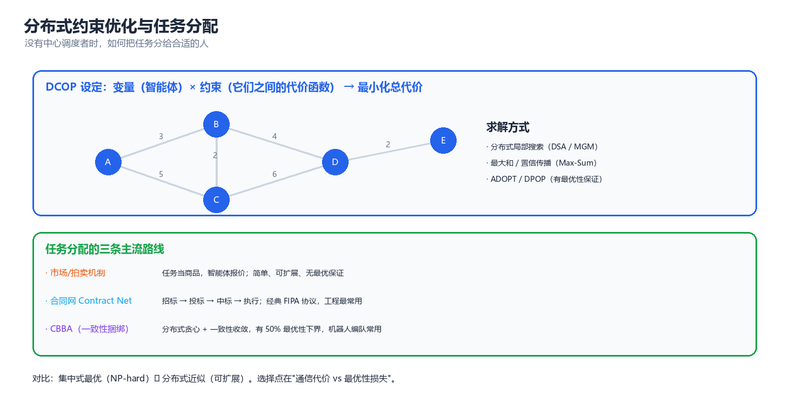
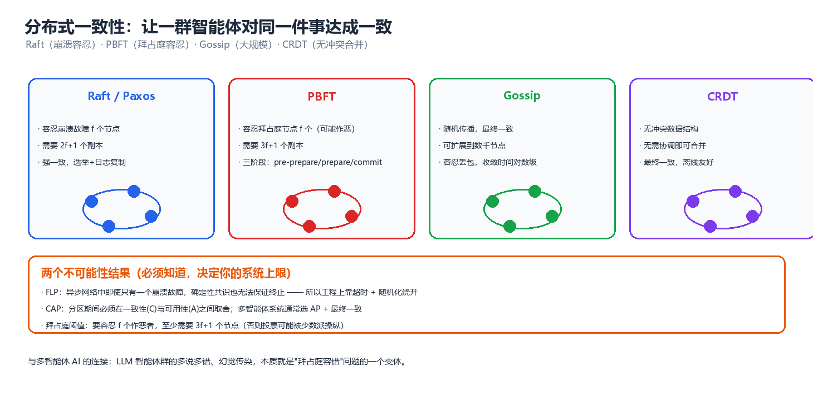

# 第 07 章 协调与协商（Coordination and Negotiation）

> 前六章解决的是"每个智能体怎么想、怎么学、怎么说话"。本章解决最古老也最工程化的问题：**没有中心调度者时，一群主体怎么把事分掉、怎么达成一致、怎么在意见冲突时谈出一个结果**。这条路线从 1970 年代的分布式问题求解（Distributed Problem Solving, DPS）走到今天的分布式数据库、多机器人编队与 LLM 智能体编排。四个关键词：**分配（allocation）**、**协商（negotiation）**、**一致（consensus）**、**涌现（emergence）**。

---

## 一、协调问题的分类

### 1.1 分解型、约束型与冲突型

判据只有一个：**主体之间的耦合是"加性可分的"、"约束耦合的"、还是"目标冲突的"**。

| 类型 | 英文 | 耦合形式 | 典型问题 | 代表算法 |
|------|------|---------|---------|---------|
| **分解型** | Decomposable | $U(\mathbf{a}) = \sum_i U_i(a_i)$，无交叉项 | 并行流水线、MapReduce、参数服务器 | 任务分解树、拓扑排序、DAG 调度 |
| **约束型** | Constraint-coupled | $\sum_i U_i(a_i) + \sum_{(i,j)\in E} U_{ij}(a_i,a_j)$ | 图着色、多机器人路径规划、频谱分配 | DCOP、DSA/MGM、Max-Sum、ADOPT/DPOP |
| **冲突型** | Interest-coupled | 各有自己的 $U_i$，且 $\partial U_i/\partial a_j$ 常反号 | 资源争夺、价格谈判、跨部门预算 | 议价、拍卖、联盟形成、机制设计 |

三者难度**严格递增**：

1. **分解型**几乎不需要"协调"，只需要一张正确的依赖图（Airflow / Argo 这类工作流引擎就在做这件事，不涉及智能体）。若你的问题落在这一格，本章绝大多数内容用不上。
2. **约束型**可以完全分布式求解，且常常**有最优性保证**（DPOP、ADOPT）——分布式 AI 最成功的领域。
3. **冲突型**没有任何算法能保证"分布式求解得到社会最优"，因为社会最优本身依赖各方是否如实报告偏好。**它必须交给机制设计**（第 04 章）。本章 §3.2、§4 的协商协议，本质是**没有中心权威时对机制设计的近似实现**。

> **核心思想**：**分解型靠结构，约束型靠搜索，冲突型靠规则。** 把冲突型问题当约束型去"优化"，是分布式系统设计中最常见的错误——你会在两个理性的自利主体之间得到永久震荡，而不是收敛。

### 1.2 耦合的度量

协调问题的底层结构是**交互图（interaction graph）** $G=(V,E)$：顶点是主体，边表示"两个主体的决策互相影响"。三个结构量决定一切：

$$
\text{耦合度}\ \rho = \frac{|E|}{\binom{n}{2}}, \qquad
\text{树宽}\ tw(G), \qquad
\text{最大度}\ \Delta = \max_i \deg(i)
$$

$\rho$ 决定**通信量**；$tw(G)$ 决定**最优求解复杂度**（DPOP 为 $O(\exp(tw))$，树状问题 $tw=1$ 时线性）；$\Delta$ 决定**局部搜索的收敛性**（稠密图上极易陷入坏局部最优）。

| 图结构 | 最优求解 | 通信 | 结论 |
|--------|---------|------|------|
| 树 / 链（$tw=1$） | DPOP 秒解，线性 | $O(n)$ | **DCOP 甜蜜点** |
| 稀疏环 + 小团 | 可行但贵 | $O(n\Delta)$ | 工程常见区间，局部搜索实用 |
| 全连接（$\rho=1$） | 最优解不可行 | $O(n^2)$ | 只能机制设计 / 近似 |

### 1.3 集中式最优 vs 分布式可行

| 维度 | 集中式 | 分布式 |
|------|--------|--------|
| 信息 | 全局可见，主体上报私有状态 | 只有局部视图，靠消息补齐 |
| 解质量 | 全局最优（若可解） | 近似 / 局部最优 / 均衡 |
| 计算 | 一次性最优化，NP-hard 时用求解器 | 每主体多项式时间，但需迭代 |
| 通信 | $O(n)$ 收集下发，含全局同步点 | $O(\text{iters}\cdot|E|)$ 迭代交换 |
| 容错 | **单点失效 = 全系统失效** | 部分失效可降级运行 |
| 可扩展 | 状态空间随 $n$ 指数爆炸 | 随度 $\Delta$ 而非 $n$ 增长 |
| 隐私 | 需集中私有信息（常不可接受） | 只暴露必要信息 |
| 实时 | 延迟 = 优化时间 | 延迟 = 一次迭代（**可截断**） |

> ⚠️ **常见误解**：以为分布式只是"集中式的工程妥协，只能拿次优解"。两点反驳：**第一**，当问题含**私有信息**（各主体真实成本只有自己知道）时，集中式求解要求如实上报，而这在没有机制设计的情况下根本做不到——此时"集中式最优"是个**不可达的上界**。**第二**，分布式算法的**任意时间（anytime）**性质在实时系统里是优点：任何时刻中断都能给出当前可行的解。

三条实用折中路线：**CTDE**（训练用全局信息、执行只用局部，如 QMIX/MAPPO，代价是训练/部署不一致）、**分层协调**（上层少量主体做全局分配、下层大量主体局部调整，代价是上层成瓶颈）、**市场机制**（用价格代替指令，代价是需设计支付规则且可能被策略博弈）。

> **核心思想**：集中式的"最优"在**信息可集中**的前提下才存在。一旦信息私有，目标就不是"逼近集中式最优"，而是"设计一个让自利主体自愿走向社会最优的规则"——前者是组合优化，后者是机制设计。

---

## 二、分布式约束优化（DCOP）

分布式约束优化（Distributed Constraint Optimization Problem, DCOP）是经典分布式 AI 的核心形式化：把约束型协调写成"各主体只控制自己的变量、代价函数因子化"的优化问题。



*图：DCOP 的两种等价表示 —— 左侧是把变量与约束画在一起的因子图，右侧是投影到变量上的约束图；求解算法本质上就是在因子图上做消息传递或搜索。*

### 2.1 DCOP 形式化

一个 DCOP 是四元组 $\mathcal{P} = \langle \mathcal{A}, \mathcal{X}, \mathcal{D}, \mathcal{F} \rangle$：主体集 $\mathcal{A}=\{a_1,\dots,a_n\}$、变量集 $\mathcal{X}=\{x_1,\dots,x_n\}$（$x_i$ 由 $a_i$ 独占控制）、离散值域 $\mathcal{D}=\{D_i\}$、代价函数集 $\mathcal{F}=\{f_j\}$，其中 $f_j: \prod_{x \in \text{scope}(f_j)} D_x \to \mathbb{R}$。目标是：

$$
\boxed{\ \mathbf{x}^\* = \arg\min_{\mathbf{x} \in \prod_i D_i} \sum_{f_j \in \mathcal{F}} f_j\left(\mathbf{x}_{\text{scope}(f_j)}\right)\ }
$$

三条硬约束：**变量私有**（$a_i$ 只能改 $x_i$）、**约束局部**（$f_j$ 只涉及少数变量）、**通信受限**（只能与 scope 相交的主体通信）。

| 经典问题 | 与 DCOP 的关系 | 关键差异 |
|---------|--------------|---------|
| **CSP** | DCOP 的硬约束特例 $f_j \in \{0,\infty\}$ | DCOP 允许软代价 → 永远有解、可近似 |
| **加权 CSP / Max-CSP** | 术语差异，几乎等同 | 后者通常集中式求解 |
| **Valued CSP** | DCOP 的抽象代数推广 | 只需半环结构，不要求加法 |
| **Markov Game / MDP** | 单步无状态的 DCOP ≈ 一次协调决策 | DCOP 不含状态与序贯决策 |
| **MAP 推断（概率图模型）** | Max-Sum ↔ max-product 置信传播 | 图模型有概率语义，DCOP 只有代价 |
| **任务分配** | DCOP 的子类（变量 = 任务） | 常带"规模"约束（§3.4） |

> **核心思想**：**DCOP = 因子化 + 分布式变量控制 + 全局目标**。任何"我关心总代价、但只能改自己那一格"的问题都可写成 DCOP。识别这个模式比记住算法重要得多。

### 2.2 DSA/MGM：局部搜索（含实跑）

局部搜索是最实用的 DCOP 算法族：**无完整性保证，但通信便宜、可截断、易实现**。模板是"收集邻居取值 → 计算每个候选值的局部代价 → 按某规则决定是否改变"。

| 算法 | 决策规则 | 每轮通信 | 收敛性质 |
|------|---------|---------|---------|
| **DSA-A** | 从"局部最优值"集合中**均匀随机**选一个 | 2 轮广播 | 概率收敛到局部最优，最稳 |
| **DSA-B** | 以固定概率 $p$ 改成最优值 | 2 轮广播 | 同上；$p$ 需调 |
| **MGM-1** | 只有"增益最大"的主体能改变 | 3 轮广播 | 全局代价**单调不增** |
| **MGM-2** | 邻居间比较增益直接决出胜者 | 2 轮广播 | 单调减少，需邻居同步 |
| **DMS** | 用"领养"机制允许更多并行修改 | 2 轮 | 无单调保证 |

下面用 DSA-A 求解 $n=12$ 环形图 3 着色的 DCOP（每对相邻同色代价为 1）：

```python
# DSA-A 求解环形图着色 DCOP: 每个主体只与左右邻居耦合
import random

random.seed(8)
N, K = 12, 3                                  # 12 个主体排成环, 3 种颜色
NEIGH = [[(i - 1) % N, (i + 1) % N] for i in range(N)]

def conflicts(a):
    """全局代价 = 相邻同色的边数"""
    return sum(a[i] == a[j] for i in range(N) for j in NEIGH[i]) // 2

assign = [random.randrange(K) for _ in range(N)]
print(f"初始:  {assign}  冲突数={conflicts(assign)}")

for t in range(1, 31):
    i = random.randrange(N)                   # 异步: 每步只随机激活一个主体
    costs = [sum(assign[j] == c for j in NEIGH[i]) for c in range(K)]
    best_v = min(costs)
    cand = [c for c in range(K) if costs[c] == best_v]
    assign[i] = random.choice(cand)           # DSA-A: 在平局集上均匀随机
    if t % 5 == 0 or conflicts(assign) == 0:
        print(f"第{t:2d}步: 冲突数={conflicts(assign)}")
    if conflicts(assign) == 0:
        break

print(f"最终:  {assign}  合法着色={conflicts(assign) == 0}")
# 预期输出:
# 初始:  [0, 1, 1, 0, 0, 2, 0, 0, 0, 0, 2, 0]  冲突数=6
# 第 5步: 冲突数=4
# 第10步: 冲突数=2
# 第15步: 冲突数=1
# 第20步: 冲突数=1
# 第24步: 冲突数=0
# 最终:  [2, 0, 2, 0, 2, 1, 0, 1, 2, 0, 2, 1]  合法着色=True
```

> ⚠️ **同步更新的振荡风险**：若改成"所有人用上一轮快照同时更新"，两个相邻主体可能同步交换颜色再换回来，形成 2-环振荡。上面的实跑用的是**异步更新**——这是工程默认选择；另一个解法是 DSA-B 的随机概率 $p<1$。

### 2.3 Max-Sum 与置信传播

**Max-Sum** 把概率图模型中的 **max-product 置信传播（Belief Propagation, BP）** 搬到代价函数上。因子图上有两类消息（函数表，定义域为 $D_i$）：

$$
q_{i \to j}(x_i) = \sum_{k \in \mathcal{N}(i) \setminus j} r_{k \to i}(x_i),
\qquad
r_{j \to i}(x_i) = \max_{\mathbf{x}_{\text{scope}(j) \setminus i}} \left[ f_j(\mathbf{x}) + \sum_{k \in \text{scope}(j) \setminus i} q_{k \to j}(x_k) \right]
$$

每个变量取使**置信**最大的值：$\hat{x}_i = \arg\max_{x_i} \sum_{j \in \mathcal{N}(i)} r_{j \to i}(x_i)$。

| 性质 | 结论 | 条件 |
|------|------|------|
| **最优性** | BP 收敛即给全局最优 | 因子图**无环**（树） |
| **有环图** | 一般只得局部最优/近似，可能不收敛 | 需阻尼（damping）或迭代截断 |
| **复杂度** | 每条消息 $O(|D|^k)$，$k$ = 因子涉及变量数 | 指数于最大因子度 |
| **通信量** | 每轮 $O(|E|\cdot|D|)$ 条消息，每条含 $|D|$ 个数 | 与值域大小成正比 |

Max-Sum 的关键在于**消息有语义**：$r_{j\to i}(x_i)$ 表示"函数 $f_j$ 对 $x_i$ 各取值的完整偏好"。在传感网、频谱分配、电力调度中，这比"我选哪个"信息量大得多，因此通常**收敛到更好的解**，代价是带宽。

> **核心思想**：**局部搜索传"决定"，消息传递传"偏好"。** 带宽紧、需要 anytime → DSA/MGM；瓶颈是迭代次数且带宽足够 → Max-Sum。

### 2.4 ADOPT 与 DPOP：最优性保证

**ADOPT**（Modi et al. 2005）：主体按 DFS 树排序，每个主体维护子树代价下界 $LB_i$、当前解上界 $UB_i$ 与承诺阈值 $t_i$（只有 $UB_i \le t_i$ 才向父节点报告）。根节点满足 $LB=UB$ 且无消息在途即终止。卖点是**多项式空间**，代价是时间最坏指数、通信量可能爆炸。

**DPOP**（Petcu & Faltings 2005）：构造伪树把回边归给子节点，**自底向上**消元（对不含自身变量的维度取 $\min$），再**自顶向下**选值：

$$
\text{UTIL}_i(x_{\text{sep}(i)}) = \min_{x_i} \left[ \sum_{c \in \text{children}(i)} \text{UTIL}_c(\cdot) + \sum_{f_j \ni x_i} f_j(\cdot) \right]
$$

| 维度 | ADOPT | DPOP |
|------|-------|------|
| 空间 | $O(\text{poly}(n,d))$ **线性** | $O(\exp(w))$ **指数**（$w$ = 诱导宽度） |
| 时间 / 消息数 | 最坏指数，实践波动大 | **恰好 $2n$ 条消息**，无搜索 |
| 通信量 | 可能爆炸（反复重发） | 条数少但每条可能巨大 |
| 最优性 | ✅ | ✅ |
| 适用 | 宽度大但可以慢慢磨 | 宽度小（链、树、稀疏图） |

> ⚠️ **选型陷阱**：DPOP 的"$2n$ 条消息"极具迷惑性。真正决定可行性的是消息**大小**：若诱导宽度 $w=20$、值域 $d=4$，一张表就是 $4^{20}\approx 10^{12}$ 项，完全不可行。**DPOP 只适合宽度小的图。**

### 2.5 复杂度对比

| 算法 | 最优性 | 时间复杂度 | 通信 | 空间 | 消息大小 | 同步 | 场景 |
|------|-------|-----------|------|------|---------|------|------|
| **DSA-A** | ❌ 局部最优 | $O(\text{it}\cdot nd\Delta)$ | $O(\text{it}\cdot|E|)$ | $O(\Delta d)$ | $O(1)$ | 同步/异步 | 大规模实时 |
| **MGM** | ❌ 局部最优 | 同上（it 更少） | $\times 3$ 轮 | $O(\Delta d)$ | $O(1)$ | 2–3 轮同步 | 需单调下降 |
| **Max-Sum** | ⚠️ 树上最优 | $O(\text{it}\cdot|E|\cdot d^k)$ | $O(\text{it}\cdot|E|)$ | $O(\Delta d)$ | $O(d)$ | 异步友好 | 频谱/电力 |
| **ADOPT** | ✅ | 最坏 $O(\exp(n))$ | 最坏指数 | $O(nd\cdot\text{depth})$ | $O(1)$ | 全异步 | 需最优且宽度大 |
| **DPOP** | ✅ | $O(\exp(w))$ | $2n$ 条 | $O(\exp(w))$ | $O(\exp(w))$ | 两阶段同步 | 宽度小 |
| **集中式求解器** | ✅ | $O(\exp(w))$ / NP-hard | 全量收集下发 | 全量 | 全局 | 需中心 | 小规模离线 |

> **核心思想**：DCOP 算法没有"最好的"，只有"匹配图结构的"。选择顺序：**先看树宽**（能否用 DPOP）→ **再看是否必须最优**（是否用 ADOPT）→ **最后看通信预算**（DSA 还是 Max-Sum）。

---

## 三、任务分配（Task Allocation）

DCOP 处理"变量取值"，**任务分配**处理"谁去做哪件事"。它是 DCOP 的特例，但因结构特殊（变量是任务、值是主体）发展出一整套专用算法。

### 3.1 集中式最优：匈牙利算法（含实跑）

当**主体数 = 任务数**且每主体只做一个任务时，问题退化为**线性分配问题（Linear Assignment Problem, LAP）**：

$$
\min_{\sigma \in S_n} \sum_{i=1}^{n} c_{i,\sigma(i)}, \qquad \sigma \text{ 是 } \{1,\dots,n\} \text{ 的排列}
$$

朴素枚举 $n!$；匈牙利算法（Kuhn 1955；Munkres 1957）把它降到 $O(n^3)$。**算法直觉是原始-对偶**：构造标号 $u_i, v_j$ 满足 $u_i + v_j \le c_{ij}$，对偶问题最大化 $\sum u_i + \sum v_j$；当存在**紧边**（$u_i+v_j=c_{ij}$）构成的完美匹配时，原始对偶同时最优：

$$
\boxed{\ \sum_i c_{i,\sigma^\*(i)} = \sum_i u_i + \sum_j v_j \quad \text{（最优时原始目标 = 对偶目标）}\ }
$$

```python
# 匈牙利算法 (Kuhn-Munkres / Jonker-Volgenant 形式), 并暴力验证最优性
from itertools import permutations
import math

def hungarian(cost):
    """输入 n×n 代价矩阵, 返回 (最小总代价, 匹配数组)"""
    n = len(cost)
    INF = float("inf")
    u = [0] * (n + 1); v = [0] * (n + 1)   # 行势 / 列势
    p = [0] * (n + 1); way = [0] * (n + 1) # p[j] = 匹配到列 j 的行
    for i in range(1, n + 1):
        p[0] = i
        j0 = 0
        minv = [INF] * (n + 1)
        used = [False] * (n + 1)
        while True:
            used[j0] = True
            i0, delta, j1 = p[j0], INF, -1
            for j in range(1, n + 1):
                if not used[j]:
                    cur = cost[i0 - 1][j - 1] - u[i0] - v[j]   # 松弛量
                    if cur < minv[j]:
                        minv[j], way[j] = cur, j0
                    if minv[j] < delta:
                        delta, j1 = minv[j], j
            for j in range(n + 1):                             # 更新标号
                if used[j]:
                    u[p[j]] += delta; v[j] -= delta
                else:
                    minv[j] -= delta
            j0 = j1
            if p[j0] == 0:                                     # 到达未匹配列
                break
        while j0:                                              # 回溯增广
            j1 = way[j0]; p[j0] = p[j1]; j0 = j1
    match = [-1] * n
    for j in range(1, n + 1):
        if p[j]:
            match[p[j] - 1] = j - 1
    return sum(cost[i][match[i]] for i in range(n)), match

C5 = [[9, 2, 7, 8, 1], [6, 4, 3, 7, 2], [5, 8, 1, 4, 9],
      [7, 6, 9, 1, 5], [3, 5, 4, 2, 8]]
best_h, m_h = hungarian(C5)
best_bf = min(sum(C5[i][perm[i]] for i in range(5)) for perm in permutations(range(5)))
print(f"匈牙利: 代价={best_h} 匹配={m_h}")
print(f"暴力枚举: 代价={best_bf}  一致={best_h == best_bf}")

C7 = [[(i * 7 + j * 3) % 11 + 1 for j in range(7)] for i in range(7)]
best_h7, _ = hungarian(C7)
best_bf7 = min(sum(C7[i][perm[i]] for i in range(7)) for perm in permutations(range(7)))
print(f"7x7: 匈牙利={best_h7}  暴力={best_bf7}  一致={best_h7 == best_bf7}")

for n in (5, 8, 10, 15, 20):               # 规模对比: 枚举 vs 多项式
    print(f"n={n:2d}: 枚举 {math.factorial(n):>18,}  vs  匈牙利 ~{n**3:>8,} 次运算")
# 预期输出:
# 匈牙利: 代价=9 匹配=[1, 4, 2, 3, 0]
# 暴力枚举: 代价=9  一致=True
# 7x7: 匈牙利=19  暴力=19  一致=True
# n= 5: 枚举                120  vs  匈牙利 ~     125 次运算
# n= 8: 枚举             40,320  vs  匈牙利 ~     512 次运算
# n=10: 枚举          3,628,800  vs  匈牙利 ~   1,000 次运算
# n=15: 枚举  1,307,674,368,000  vs  匈牙利 ~   3,375 次运算
# n=20: 枚举 2,432,902,008,176,640,000  vs  匈牙利 ~   8,000 次运算
```

集中式的三条硬伤：**私有成本**（$c_{ij}$ 只有主体自己知道，上报可能虚报）、**单点失效**、**规模瓶颈**（$n=10^4$ 时 $n^3=10^{12}$）。对策分别是拍卖（第 04 章）、合同网（§3.3）、CBBA（§3.4）与分层分配。

### 3.2 市场与拍卖机制

把"分配"变成"交易"是分布式 AI 最成功的模式：**主体不服从指令，只对价格做最佳回应**——让局部自利自动对齐全局目标，这正是第 04 章机制设计/拍卖用于任务分配的要点。

| 拍卖 | 规则 | 真实报价? | 效率 | 适用 |
|------|------|----------|------|------|
| **英式（升价）** | 价格递增，最后出价者赢 | 弱 | 高效 | 单件物品 |
| **荷兰式（降价）** | 价格递减，先接受者赢 | 否 | 高效 | 快速成交 |
| **第一价格密封** | 最高价赢，付自己的价 | **否** | 高效不最优 | 简单但有策略空间 |
| **第二价格（Vickrey）** | 最高价赢，付第二高价 | ✅ **真实** | ✅ | 单件，理论最爱 |
| **VCG** | 赢家付"对其他人的外部性" | ✅ **真实** | ✅ 社会最优 | 多件、组合 |
| **组合拍卖** | 对**组合**出价 | 依赖机制 | 高效 | 频谱、物流（计算难） |

VCG 中赢家 $i$ 支付 $p_i = \sum_{j \neq i} v_j(\mathbf{x}^{-i}_j) - \sum_{j \neq i} v_j(\mathbf{x}^\*_j)$，即"你付的钱 = 你的存在给别人造成的福利损失"，产生**外部性内部化（externality internalization）**：虚报只让自己受损，如实报价是占优策略。实际系统很少用 VCG（计算与支付都贵），而用**顺序拍卖（sequential auction）**：一个个任务拍、每个给当前边际价值最高的主体——本质是**贪心**。

### 3.3 合同网协议（Contract Net Protocol）

合同网（CNP, Smith 1980）是分布式 AI 最广为人知的协议，地位相当于分布式 AI 界的 TCP/IP。

```
     发起者 (Manager)                          潜在承包者 (Contractors)
          │                                             │
          │  ① 任务通告 (Task Announcement)              │  A
          │  ──────────────────────────────────────────▶ │  B
          │     含任务描述 / 截止时间 / 质量要求           │  C
          │     广播, 或经目录服务 (Directory Facilitator) │
          │                                             │
          │  ② 投标 (Bid)                               │
          │  ◀────────────────────────────────────────── │  A: 报价 12
          │     含价格 / 时间 / 能力证明                   │  B: 报价 8
          │                                             │  C: 弃权
          │  ③ 评估 (Evaluation)                        │
          │     按 价格 × 信誉 × 时间 × 违约风险 排序      │
          │                                             │
          │  ④ 授标 (Award)  ─────────────────────────▶ │  B 中标
          │  ⑤ 承诺/拒绝 (Accept / Refuse) ◀─────────── │  B 接受
          │  ⑥ 执行 → 汇报结果 (Report) ───────────────▶ │
          │  ⑦ 失败处理: 超时未汇报 → 重新招标 (FAQ)      │
```

七个关键设计点：**通告方式**（主体 > 20 时用目录服务 DF，否则广播风暴）、**投标内容**（完整报价更贵但避免"中标后做不了"）、**授标策略**（生产系统用多准则 + 信誉分，而非最低价）、**并发**（有依赖时用队列 + 依赖图）、**超时**（必须有，且要有**重新招标 FAQ** 路径）、**承诺语义**（硬承诺简单；软承诺更灵活但需结算机制）、**反作弊**（无信誉/押金约束下必现"低价抢标再延期"，见第 10 章共谋与级联失效）。

CNP 今天依然活着，只是换了名字：Kubernetes 调度器（Manager）+ kubelet 上报资源（Bid）+ 绑定（Award）、AWS Spot 竞价实例（反向拍卖）、供应链采购招标、众包平台、LLM 智能体编排中的子任务分发（第 08 章）。

> **核心思想**：合同网长寿的原因是它把"分配"从**一次全局优化**降级为**一串局部谈判 + 承诺**。代价是次优，收益是**无需中心、可扩展、天然容错**。

### 3.4 CBBA：一致性捆绑算法

当任务之间**有依赖**（做 B 前必须做 A）且主体能力**异质**时，逐任务拍卖会出问题。CBBA（Consensus-Based Bundle Algorithm, Choi, Brunet & How 2009）是解法，也是多机器人任务分配的事实标准。

**机制一：捆绑（bundling）**。每个主体维护一个**有序任务包** $b_i$，加入任务 $j$ 的边际增益是"试遍所有插入位置"的最大增量：

$$
c_{i,k}(b_i \oplus \{j\}) = \max_{n \le |b_i|+1} \Big[ S_i^{\text{val}}\big(\text{path}(b_i \oplus_n \{j\})\big) - S_i^{\text{val}}\big(\text{path}(b_i)\big) \Big]
$$

**机制二：一致性（consensus）**。主体交换"出价 + 赢家"向量，按下表消解冲突：

| 情况 | 规则 | 谁赢 |
|------|------|------|
| 对方出价高，且该任务在我的包里 | 我**放弃**该任务（并连带释放其后所有任务） | 对方 |
| 对方出价高，但该任务不在我包里 | 更新赢家，可能**加入**该任务 | 对方 |
| 我的出价高 | 保留赢家元组不变 | 我 |
| 出价相同 | 按**主体 ID 字典序**打破平局 | ID 小者 |

平局按 ID 打破是**关键设计**——它保证所有主体经有限轮共识后收敛到**同一份分配**，否则会无限来回更新。

```
CBBA (每个主体 i 独立执行):

  初始化:  b_i ← ∅; p_i ← ∅; y_i ← 0^{N_t}; z_i ← -∞^{N_t}
           # y_i[j] = 赢得任务 j 的主体, z_i[j] = 该任务当前最高出价

  循环直到共识收敛 (或达最大轮数):

    阶段 1 任务包构建 (Bundle Build):
      重复:
        c_i ← 所有可行任务的边际增益 (试遍每个插入位置, 取最大)
        J_i ← argmax_j c_i[j]
        若 c_i[J_i] > 0 且 J_i 可行:
          b_i ← b_i ⊕_{n*} {J_i}      # 按最优位置插入
          p_i ← path(b_i);  y_i[J_i] ← i;  z_i[J_i] ← c_i[J_i]
        否则 break

    阶段 2 一致性 (Consensus) —— 与邻居交换 (y_i, z_i):
      对每个邻居 k, 每个任务 j:
        if z_k[j] > z_i[j]:                                # 邻居出价更高
            z_i[j] ← z_k[j]; y_i[j] ← y_k[j]
            if y_i[j] == i: 从 b_i 中移除 j 及其后所有任务
        elif y_k[j] == k and z_i[j] == z_k[j] and i < k:   # 平局, ID 小者赢
            z_i[j] ← z_k[j]; y_i[j] ← k
            if y_i[j] == i: 从 b_i 中移除 j 及其后所有任务

    若 (y_i, z_i) 无变化: 收敛
```

**收敛性**：通信不中断且信息有限时间可达时，CBBA 有限轮内收敛到**无冲突分配**；收敛到的是**贪心解的共识**，不是最优解。**为什么是 50% 下界**：任务包构建是**贪心最大化单调子模函数、受分区拟阵（partition matroid）约束**的过程，对此有经典结论：

$$
\boxed{\ \frac{V_{\text{greedy}}}{V_{\text{OPT}}} \ge \frac{1}{2}\ }
$$

直觉：贪心每步选当前最大边际增益 $c_t$，而最优解 $t$ 个任务的总增益不超过 $t \cdot c_t$（否则贪心一开始就会选那个更大的），因此 $t$ 步后贪心至少拿到最优增益的一半。

> ⚠️ **$1/2$ 是下界，不是实际表现**。真实实例上 CBBA 通常达到最优的 90%–100%（下面实跑可见）。$1/2$ 是**最坏情况保证**，只有在写工程承诺文档时才有意义。

下面用"覆盖型子模估值"实例实测该比值（每个 (主体, 任务) 对覆盖论域的一个随机子集，主体价值 = 其任务包覆盖并集的大小）：

```python
# 顺序拍卖 (贪心, CBBA 的分配核心) vs 最优分配: 实测近似比
import random
from itertools import product

random.seed(2024)
N_TASK, N_AGENT, UNIV = 5, 3, 8

def make_instance():
    """每个 (主体, 任务) 对覆盖一个随机元素集合 (保证单调子模)"""
    return [[{e for e in range(UNIV) if random.random() < 0.45}
             for _ in range(N_TASK)] for _ in range(N_AGENT)]

def value(cover, bundles):
    tot = 0
    for i in range(N_AGENT):
        u = set()
        for j in bundles[i]:
            u |= cover[i][j]
        tot += len(u)
    return tot

def greedy(cover):
    """顺序拍卖: 每次选 (主体, 未分配任务) 中边际覆盖增益最大者"""
    taken, bundles = set(), [set() for _ in range(N_AGENT)]
    while True:
        best, bi, bj = 0, -1, -1
        for i in range(N_AGENT):
            cur = set()
            for j in bundles[i]:
                cur |= cover[i][j]
            for j in range(N_TASK):
                if j in taken:
                    continue
                gain = len(cur | cover[i][j]) - len(cur)
                if gain > best:
                    best, bi, bj = gain, i, j
        if bi < 0:
            break
        bundles[bi].add(bj)
        taken.add(bj)                 # 任务只能被一个主体认领 (分区拟阵)
    return value(cover, bundles)

def optimal(cover):
    best = 0
    for assign in product(range(N_AGENT + 1), repeat=N_TASK):  # N_AGENT = 不分配
        bundles = [set() for _ in range(N_AGENT)]
        for j, a in enumerate(assign):
            if a < N_AGENT:
                bundles[a].add(j)
        best = max(best, value(cover, bundles))
    return best

ratios = []
for _ in range(150):
    c = make_instance()
    ratios.append(greedy(c) / optimal(c))

print(f"150 个随机覆盖实例 ({N_TASK} 任务 / {N_AGENT} 主体 / 论域 {UNIV}):")
print(f"  贪心/最优: 最小={min(ratios):.4f} 平均={sum(ratios)/len(ratios):.4f} 最大={max(ratios):.4f}")
print(f"  低于 0.5 的实例: {sum(r < 0.5 for r in ratios)}  低于 0.8: {sum(r < 0.8 for r in ratios)}")
print(f"  达到最优的实例: {sum(r > 0.9999 for r in ratios)}")
# 预期输出:
# 150 个随机覆盖实例 (5 任务 / 3 主体 / 论域 8):
#   贪心/最优: 最小=0.8421 平均=0.9759 最大=1.0000
#   低于 0.5 的实例: 0  低于 0.8: 0
#   达到最优的实例: 100
```

实测最差 0.8421、平均 0.9759，远好于理论下界 $1/2$ —— 这正说明**下界是"安全垫"而非"预期值"**。

---

## 四、协商与议价（Negotiation and Bargaining）

任务分配解决"谁做"，**协商**解决"条件是什么"。当双方利益对立、但成交都好于不成交时，就需要议价。

### 4.1 三类协商协议

**(a) 单调让步（Monotonic Concession Protocol）**：双方各有保留值 $r_i$，"接受当且仅当对方的提议让我变好"：

$$
\text{接受条件：} \ u_j(\mathbf{x}_t^{i \to j}) \ge u_j(\mathbf{x}_{t-1}^{j \to i})
$$

双方都不再让步且未达成一致 → 僵局。

**(b) Zeuthen 协议（风险让步）**：比较双方承担僵局风险的**程度**，风险小的一方先让步：

$$
\rho_i = \frac{u_i(\mathbf{x}_i) - u_i(\mathbf{x}_j)}{u_i(\mathbf{x}_i) - u_i(\text{僵局})}, \qquad \rho_i > \rho_j \ \Longrightarrow\ \text{主体 } i \text{ 让步}
$$

分子是"对方坚持时我的损失"，分母是"谈崩时我的损失"。$\rho_i$ 越大说明让步代价相对越小。

**(c) 时间依赖让步（Time-Dependent Tactics, Faratin et al. 1998）**：用退火函数控制让步幅度

$$
\alpha_i(t) = k_i + (1-k_i)\left(\frac{\min(t,T)}{\max(T,t_0)}\right)^{\beta_i}
$$

| 参数 | 名称 | 效果 |
|------|------|------|
| $\beta_i < 1$ | **Boulware**（固执型） | 前期几乎不让，临近截止才松口 |
| $\beta_i = 1$ | 线性让步 | 匀速 |
| $\beta_i > 1$ | **Conceder**（慷慨型） | 一开始就让很多 |

> **核心思想**：$\beta$ 决定**谁是"时间压力"下的赢家**。截止时间紧迫（$T$ 小）会迫使你 $\beta$ 大（早期让步多），拿到更差的解。这就是"谈判力"在自动化协商里的量化定义：**谈判力 = 你能忍受僵局的时间。**

| 协议 | 信息需求 | 收敛性 | 谈判力来源 | 典型问题 |
|------|---------|--------|-----------|---------|
| 单调让步 | 只需对方的效用增量 | 有限轮终止 | 让步空间大小 | 双双僵持 |
| Zeuthen | 需双方效用与僵局点 | 终止，且唯一子博弈完美均衡 | 风险承受力 | 需完整效用信息 |
| 时间依赖让步 | 只看时间与 $\beta$ | 到 $T$ 必终止 | **截止时间紧迫度** | 参数需调 |
| 启发式让步 | 需对手偏好结构 | 经验收敛 | 找到互利的维度交换 | 需学习对手模型 |
| 基于论据的协商 | 允许"为什么" | 无终止保证 | 论据可信度 | 表达复杂 |

### 4.2 Nash 讨价还价解（含实跑）

Nash（1950）问：一个"公平的"议价结果应满足哪些公理？**帕累托有效**、**对称性**、**仿射不变**、**无关备选独立性（IIA）**。四公理唯一确定最大**纳什积**的解：

$$
\boxed{\ \mathbf{x}^\* = \arg\max_{\mathbf{x} \in \mathcal{U},\ u_i(\mathbf{x}) \ge d_i} \prod_{i=1}^{n} \left(u_i(\mathbf{x}) - d_i\right)\ }
$$

其中 $d_i$ 是**分歧点（disagreement point）**。两方情形取对数求导（内点解）：

$$
\frac{\lambda \, u_1'(x)}{u_1(x) - d_1} + \frac{(1-\lambda)\, u_2'(x)}{u_2(x) - d_2} = 0
\ \Longrightarrow \
\lambda \cdot \underbrace{\frac{u_1'(x)}{u_1(x)-d_1}}_{\text{相对边际效用}} = -(1-\lambda)\cdot \frac{u_2'(x)}{u_2(x)-d_2}
$$

**直觉解读**：**相对边际效用大的一方拿得多**。谁对这份资源更敏感（$\frac{u'}{u-d}$ 更大），谁在纳什解里占更大份额——这就是"风险厌恶者（凹效用更陡）在纳什解里得到更多"的数学来源。

```python
# Nash 讨价还价解: 数值最大化 vs 闭式解对照
import numpy as np

x = np.linspace(1e-6, 1 - 1e-6, 1_000_001)   # 主体1 得 x, 主体2 得 1-x

def nash_solve(u1, u2, d1=0.0, d2=0.0, lam=0.5):
    """网格最大化广义纳什积 (u1-d1)^lam · (u2-d2)^(1-lam)"""
    a1, a2 = u1(x) - d1, u2(x) - d2
    ok = (a1 > 0) & (a2 > 0)
    val = np.full_like(x, -np.inf)
    val[ok] = lam * np.log(a1[ok]) + (1 - lam) * np.log(a2[ok])   # 对数形式更稳
    k = int(np.argmax(val))
    return x[k], np.exp(val[k])

cases = [
    ("线性效用 lam=0.5",      lambda t: t,          lambda t: 1 - t, 0.0, 0.0, 0.5, "x* = 1/2"),
    ("线性效用 lam=0.7",      lambda t: t,          lambda t: 1 - t, 0.0, 0.0, 0.7, "x* = lam = 0.7"),
    ("非线性 lam=0.5",        lambda t: np.sqrt(t), lambda t: 1 - t, 0.0, 0.0, 0.5, "x* = 1/3"),
    ("带分歧点 d=(0.2,0.2)", lambda t: t,          lambda t: 1 - t, 0.2, 0.2, 0.5, "x* = 1/2"),
]

print(f"{'情形':<22}{'数值解 x*':>12}{'闭式解':>16}{'纳什积':>12}")
for name, u1, u2, d1, d2, lam, closed in cases:
    xv, v = nash_solve(u1, u2, d1, d2, lam)
    print(f"{name:<22}{xv:>12.6f}{closed:>16}{v:>12.6f}")

xs = np.linspace(0.30, 0.37, 8)               # 非线性例在 x=1/3 附近局部扫描
print("\n非线性例在 x=1/3 附近局部扫描:")
for a, b in zip(xs, np.sqrt(xs) * (1 - xs)):
    print(f"  x={a:.4f}  sqrt(x)(1-x)={b:.6f}")
# 预期输出:
# 情形                          数值解 x*             闭式解         纳什积
# 线性效用 lam=0.5              0.500000        x* = 1/2    0.500000
# 线性效用 lam=0.7              0.700000  x* = lam = 0.7    0.542881
# 非线性 lam=0.5               0.333333        x* = 1/3    0.620403
# 带分歧点 d=(0.2,0.2)          0.500000        x* = 1/2    0.300000
#
# 非线性例在 x=1/3 附近局部扫描:
#   x=0.3000  sqrt(x)(1-x)=0.383406
#   x=0.3100  sqrt(x)(1-x)=0.384176
#   x=0.3200  sqrt(x)(1-x)=0.384666
#   x=0.3300  sqrt(x)(1-x)=0.384886
#   x=0.3400  sqrt(x)(1-x)=0.384843
#   x=0.3500  sqrt(x)(1-x)=0.384545
#   x=0.3600  sqrt(x)(1-x)=0.384000
#   x=0.3700  sqrt(x)(1-x)=0.383214
```

四个数值解全部与闭式解吻合到 $10^{-6}$；扫描表也确认 $\sqrt{x}(1-x)$ 在 $x=1/3$ 取到峰值 0.384886。

### 4.3 多方协商与联盟形成

两方协商有唯一解概念；**多方**立刻变复杂：解概念不唯一（Nash / Kalai-Smorodinsky / Egalitarian 在 $n>2$ 时给出不同结果）、**联盟结构本身是决策变量**、且枚举所有划分是**钟数（Bell number）**级别（$n=10$ 已有 115975 种划分）。

| 解概念 | 最大化目标 | 公平直觉 | 缺点 |
|--------|-----------|---------|------|
| **Nash 解** | $\prod (u_i - d_i)$ | 满足 IIA 与对称性 | IIA 在多方争议大 |
| **Kalai-Smorodinsky** | 保持各方**相对让步比例**相等 | "每人让出同样比例" | 可能不在可行集边界上 |
| **Egalitarian** | $\max \min_i (u_i - d_i)$ | 最大化最弱者收益 | 浪费总效率 |
| **比例解** | $u_i \propto d_i$ 或谈判力 | 按"贡献"分 | 需要谈判力度量 |

**核心（Core）** 是最直接的稳定性概念：没有任何子联盟能通过"退出自立"获得更多：

$$
\text{Core}(v) = \left\{ \mathbf{y} \in \mathbb{R}^n : \sum_{i \in N} y_i = v(N),\ \ \sum_{i \in S} y_i \ge v(S)\ \ \forall S \subseteq N \right\}
$$

**Shapley 值**是唯一同时满足**有效性、对称性、哑元、可加性**的分配，它把每个主体的贡献定义为"他在所有加入顺序上的平均边际贡献"：

$$
\phi_i(v) = \sum_{S \subseteq N \setminus \{i\}} \frac{|S|!\,(n-|S|-1)!}{n!}\left[v(S \cup \{i\}) - v(S)\right]
$$

> ⚠️ **Shapley 的复杂度**：精确计算需 $2^n$ 次评估。$n=20$ 是 100 万次（可接受），$n=30$ 是 10 亿次（不可接受）。大联盟的工程做法是**蒙特卡洛采样**：随机抽加入顺序，用边际贡献的样本均值估计 $\phi_i$。

---

## 五、分布式一致性（Distributed Consensus）

从"分什么"转向"同意什么"。分布式一致性是分布式系统的心脏，也是多智能体协调理论最成熟的分支。



*图：一致性问题的三种网络视角 —— 左侧是完全图上的全互通共识，中间是有环/有割点的稀疏图（影响收敛速度），右侧是存在故障节点时的一致性问题（需要拜占庭容错）。*

### 5.1 问题形式化

$n$ 个节点，节点 $i$ 有初值 $x_i(0)$，按线性协议迭代：

$$
\boxed{\ x_i(t+1) = \sum_{j \in \mathcal{N}(i) \cup \{i\}} w_{ij}\, x_j(t), \qquad \sum_j w_{ij} = 1\ }
$$

写成 $\mathbf{x}(t+1) = W\mathbf{x}(t)$，$W$ 为**行随机（row-stochastic）**权重矩阵。若通信图**连通**且 $W$ **双随机（double-stochastic）**，则收敛到**平均共识** $\frac{1}{n}\sum_j x_j(0)$。收敛速度由**谱隙（spectral gap）**决定：

$$
\|\mathbf{x}(t) - \bar{x}\mathbf{1}\| \le C\,|\lambda_2(W)|^t
\quad\Longrightarrow\quad
\text{速度} \propto -\log|\lambda_2(W)|
$$

| 图结构 | $\lambda_2$（近似） | 混合时间 | 工程含义 |
|-------|------------------|---------|---------|
| 完全图 | $\approx 0$（除 $\lambda_1=1$） | $O(1)$ | 一轮广播即共识 |
| 随机图（连接概率 $p$） | $1-\Theta(1)$ | $O(\log n)$ | 稀疏图中最快 |
| 2D 网格（$k\times k$） | $\approx \pi^2/k^2$ | $O(n\log n)$ | 慢 |
| 环 | $\cos(2\pi/n)$ | $O(n^2)$ | 最慢 |

> **核心思想**：**拓扑决定速度。** 环上共识要 $O(n^2)$ 步，随机图只要 $O(\log n)$ 步。所以 gossip 协议的第一设计原则是"把图连得更随机"，而不是"优化消息格式"。

四层问题：**收敛一致**（无故障）、**崩溃容错一致**（$n\ge 2f+1$，Paxos/Raft/ZAB）、**拜占庭容错一致**（$n \ge 3f+1$，PBFT/Tendermint/HotStuff）、**最终一致**（CRDT/Dynamo）。

### 5.2 Raft / Paxos 的直觉

Paxos 解决"**一个值**达成共识"（Single-Decree，多值靠 Multi-Paxos 复用），两阶段是 **Prepare/Promise → Accept/Accepted**。关键不变量是 **多数派交集（quorum intersection）**：任何两个多数派至少有一个公共成员，因此"已被选定的值"不会在后续轮次被覆盖——这是所有一致性算法的共同基石。

Raft 的设计目标是**可理解性**，把 Paxos 拆成三个独立子问题：

| 子问题 | Raft 方案 | 关键机制 |
|--------|-----------|---------|
| **领导选举** | 任期（term）+ 随机超时 + 得票多数 | 随机化超时避免选票瓜分（split vote） |
| **日志复制** | Leader 追加 → 广播 → 多数确认 → commit | 日志匹配性质（Log Matching Property） |
| **安全性** | 只有"日志至少一样新"的候选者能当选 | 保证已 commit 的条目永不丢失 |

| 维度 | Paxos | Raft |
|------|-------|------|
| 抽象层次 | 单值共识原语，多值需自行组合 | 直接给"复制状态机"完整方案 |
| 领导 | 无固定领导（Multi-Paxos 可加） | **强领导** |
| 日志空洞 | 允许 | 不允许（强领导顺序追加） |
| 生产系统 | Chubby、Spanner | etcd、Consul、TiKV、CockroachDB |

> **核心思想**：Paxos 与 Raft 都是**崩溃容错**算法——它们假设故障节点只会"沉默"，不会"撒谎"。一旦节点可能恶意伪造消息，就进入 PBFT 的世界，阈值从 $2f+1$ 跳到 $3f+1$。

### 5.3 PBFT 三阶段（含实跑）

PBFT（Practical Byzantine Fault Tolerance, Castro & Liskov 1999）是第一个实用的拜占庭容错共识，核心是**三阶段投票**：

```
   Client      Primary     Backup 1    Backup 2    Backup 3
     │            │            │           │           │
     │ request ──▶│            │           │           │
     │            │ PRE-PREPARE│           │           │  ① 主节点定序 (view, seq)
     │            │──(v,seq,m)▶│──────────▶│──────────▶│
     │            │ PREPARE    │           │           │  ② "我收到并同意本次序"
     │            │◀───────────│───────────│───────────│
     │            │───────────▶│           │           │
     │  [收到 2f 个匹配 PREPARE → 进入 prepared]         │
     │            │ COMMIT     │           │           │  ③ "我准备好提交"
     │            │◀───────────│───────────│───────────│
     │            │───────────▶│           │           │
     │  [收到 2f+1 个匹配 COMMIT → 执行并回复]           │
     │ reply ────▶│            │           │           │
     │◀───────────│◀───────────│◀──────────│◀──────────│
```

| 阶段 | 收集阈值 | 含义 |
|------|---------|------|
| PRE-PREPARE | 1（来自 primary） | 主节点给出**本次序（view, seq）** |
| PREPARE | $2f$ 个与自己匹配的 | 保证**同一序内不会有两个不同值** |
| COMMIT | $2f+1$ 个（含自己） | 保证**跨视图安全**（视图切换后仍一致） |

下面的模拟做两件事：**(1) 用投票计数检验活性；(2) 用法定人数交集判定检验安全性。**

```python
# 简化 PBFT 投票模拟 + 法定人数交集判定
import random

random.seed(11)
VAL, ALT = "v", "v'"

def pbft_round(n, f, q):
    """拜占庭行为: 静默(50%) 或 撒谎(只发 v'); 诚实节点一律广播 v"""
    byz = set(random.sample(range(1, n), f))
    inbox = [dict() for _ in range(n)]
    for s in range(n):
        if s in byz:
            if random.random() < 0.5:
                continue                       # 静默失效: 什么都不发
            for r in range(n):
                inbox[r][s] = ALT              # 双发/造谣
        else:
            for r in range(n):
                inbox[r][s] = VAL
    votes = []
    for i in range(n):
        if i in byz:
            votes.append(None)
            continue
        cnt = {}
        for x in inbox[i].values():
            cnt[x] = cnt.get(x, 0) + 1
        got = [k for k, c in cnt.items() if c >= q]    # 收集到 q 个匹配消息
        votes.append(got[0] if got else None)
    honest = [x for i, x in enumerate(votes) if i not in byz]
    done = [x for x in honest if x is not None]
    return len(set(done)) > 1, len(done) == 0          # (安全性违例, 全部停摆)

ROUNDS = 4000
print("实验 1: 投票模拟 (法人数 q = 2f+1, 拜占庭 = 静默或撒谎)")
print(f"{'配置':<22}{'q':>4}{'安全性违例':>12}{'全部停摆':>12}{'提交率':>10}")
for f in (1, 2, 3):
    for n in (3 * f, 3 * f + 1):
        q = 2 * f + 1
        bad = stall = 0
        for _ in range(ROUNDS):
            b, s = pbft_round(n, f, q)
            bad += b; stall += s
        tag = f"n={n} f={f} " + ("3f+1" if n == 3 * f + 1 else "3f  ")
        print(f"{tag:<22}{q:>4}{bad:>12}{stall:>12}{(stall == 0) * 100:>9.0f}%")

print("\n实验 2: 法定人数交集判定 (安全 iff 最小交集 2q-n > f; 可达 iff q <= n-f)")
print(f"{'n':>4}{'f':>4}{'q':>4}{'2q-n':>7}{'>f?':>7}{'q<=n-f?':>10}   结论")
for n, f, q in [(4, 1, 2), (4, 1, 3), (3, 1, 3), (7, 2, 3),
                (7, 2, 5), (9, 3, 7), (10, 3, 7)]:
    inter, safe, live = 2 * q - n, 2 * q - n > f, q <= n - f
    verdict = ("安全且可提交" if (safe and live)
               else ("安全但可能无法提交" if safe else "不安全!"))
    print(f"{n:>4}{f:>4}{q:>4}{inter:>7}{str(safe):>7}{str(live):>10}   {verdict}")
# 预期输出:
# 实验 1: 投票模拟 (法人数 q = 2f+1, 拜占庭 = 静默或撒谎)
# 配置                       q       安全性违例        全部停摆       提交率
# n=3 f=1 3f               3           0        4000        0%
# n=4 f=1 3f+1             3           0           0      100%
# n=6 f=2 3f               5           0        4000        0%
# n=7 f=2 3f+1             5           0           0      100%
# n=9 f=3 3f               7           0        4000        0%
# n=10 f=3 3f+1            7           0           0      100%
#
# 实验 2: 法定人数交集判定 (安全 iff 最小交集 2q-n > f; 可达 iff q <= n-f)
#    n   f   q   2q-n    >f?   q<=n-f?   结论
#    4   1   2      0  False      True   不安全!
#    4   1   3      2   True      True   安全且可提交
#    3   1   3      3   True     False   安全但可能无法提交
#    7   2   3     -1  False      True   不安全!
#    7   2   5      3   True      True   安全且可提交
#    9   3   7      5   True     False   安全但可能无法提交
#   10   3   7      4   True      True   安全且可提交
```

两个实验的结果完全互补：**$n=3f$ 时安全性没被破坏（0 违例），但 4000 轮里所有诚实节点一次都提交不了（提交率 0%）——这是活性/终止性的失败**；$n=3f+1$ 时提交率 100%。实验 2 显示，一旦把法定人数缩到 $f+1$（崩溃容错式的小法定人数），$2q-n \le f$，两个法定人数可能**全由拜占庭节点组成**，安全性立刻失效。**所以 $n \ge 3f+1$ 不是苛刻，而是同时满足"可达"与"交集必含诚实节点"的唯一解**（推导见 §8.2）。

工程门槛：单次共识消息数 $O(n^2)$（每节点向所有节点广播 PREPARE + COMMIT），视图切换最坏 $O(n^3)$（PBFT 的主要性能瓶颈），容错 $f=\lfloor(n-1)/3\rfloor$。现代改进 HotStuff / Tendermint 把视图切换降到 $O(n)$，这就是为什么公链不用经典 PBFT 而用 BFT 变种。

### 5.4 Gossip 与最终一致（含实跑）

当"强一致"太贵时，退回**最终一致（eventual consistency）**。

| 变种 | 每轮行为 | 收敛时间 | 通信量 |
|------|---------|---------|--------|
| **Anti-entropy（反熵）** | 与随机同伴交换**完整状态**并合并 | $O(\log n)$ 轮 | 每轮 $O(n)$ 大消息 |
| **Rumor mongering（谣言传播）** | 只推**新消息**，被拒绝则降热情 | $O(\log n)$ 轮 | 小消息多播 |
| **Aggregation（聚合）** | 只交换**摘要/均值** | $O(\log n)$–$O(n^2)$ | 极小 |

Gossip 有三个漂亮性质：**容错**（任意节点/消息丢失都不影响最终收敛，只要图保持连通）、**可扩展**（每节点负载 $O(\log n)$，与规模解耦）、**简单**（无需成员管理，成员列表可先过期）。代价是**没有时间上界**——只能保证"最终"收敛。

```python
# Gossip 平均一致性: 随机配对交换, 观察共识误差随时间的衰减
import numpy as np

rng = np.random.default_rng(3)
n = 50
x0 = rng.normal(0.0, 1.0, n)
x0[0] = 5.0                                    # 一个异常节点, 看它如何被"平均"掉
x = x0.copy()
mean0, err0 = x0.mean(), np.linalg.norm(x0 - x0.mean())
snap = [1, 5, 10, 20, 50, 100, 200, 500]
print(f"节点数 n={n}, 初始共识误差={err0:.4f}, 初始均值={mean0:.4f}")

for t in range(1, 501):
    i = int(rng.integers(0, n))
    j = int(rng.integers(0, n - 1))
    j += (j >= i)                              # 保证 i != j
    m = 0.5 * (x[i] + x[j])                    # 成对平均 (双随机)
    x[i] = x[j] = m
    if t in snap:
        print(f"第{t:4d}步: 相对共识误差={np.linalg.norm(x - mean0) / err0:.6f}"
              f"  方差={x.var():.6f}  均值={x.mean():.6f}")

print(f"\n理论上界: 每步收缩因子 ~= 1 - 1/(2n) = {1 - 1 / (2 * n):.4f}"
      f"; 200 步 = {(1 - 1 / (2 * n)) ** 200:.6f}")
# 预期输出:
# 节点数 n=50, 初始共识误差=8.9521, 初始均值=0.0840
# 第   1步: 相对共识误差=0.999997  方差=1.602788  均值=0.084045
# 第   5步: 相对共识误差=0.992158  方差=1.577760  均值=0.084045
# 第  10步: 相对共识误差=0.958537  方差=1.472640  均值=0.084045
# 第  20步: 相对共识误差=0.924121  方差=1.368791  均值=0.084045
# 第  50步: 相对共识误差=0.785308  方差=0.988460  均值=0.084045
# 第 100步: 相对共识误差=0.473789  方差=0.359789  均值=0.084045
# 第 200步: 相对共识误差=0.144355  方差=0.033400  均值=0.084045
# 第 500步: 相对共识误差=0.004862  方差=0.000038  均值=0.084045
#
# 理论上界: 每步收缩因子 ~= 1 - 1/(2n) = 0.9900; 200 步 = 0.133980
```

三点值得注意：**均值从第一步起就恒等于 0.084045**（成对平均是"保均值"操作，这正是双随机的含义）；**异常节点被平滑地"摊平"**而不是被丢弃；**200 步实测 0.1444 与理论上界 0.1340 同量级**，500 步降到 0.005。

### 5.5 CRDT：让合并天然收敛

**CRDT（Conflict-free Replicated Data Type，无冲突复制数据类型）** 是对"最终一致"的**构造性**回答：不靠协商解决冲突，而是**设计数据结构使任何副本的合并（merge）都满足交换律、结合律、幂等律**：

$$
\text{merge}(a,b)=\text{merge}(b,a), \quad
\text{merge}(\text{merge}(a,b),c)=\text{merge}(a,\text{merge}(b,c)), \quad
\text{merge}(a,a)=a
$$

三条合起来意味着：**任何接收顺序、任何重复投递，最终状态都相同**——即**连接半格（join-semilattice）**，merge 取上确界。

| 类型 | 全称 | 合并方式 | 例子 |
|------|------|---------|------|
| **CvRDT** | 基于状态的 CRDT | 状态之间 merge（取上确界） | G-Counter、PN-Counter、LWW-Register |
| **CmRDT** | 基于操作的 CRDT | 操作需**可交换**且**因果就绪** | 仅可增集合、op-based log |
| **Delta-CRDT** | 只传增量状态 | 传 $\delta$-mutator 而非全状态 | 大规模场景优化 |

| 数据结构 | 内部表示 | merge 操作 | 解决的问题 |
|---------|---------|-----------|-----------|
| **G-Counter** | 每副本一个分量 $[c_1,\dots,c_n]$ | 逐分量取 $\max$，值 = $\sum c_i$ | 多副本计数不重复不丢失 |
| **PN-Counter** | 两个 G-Counter（增/减） | 两个都逐分量 $\max$，值 = 增 − 减 | 支持减法 |
| **LWW-Register** | (值, 时间戳, 副本 ID) | 取时间戳更大者，平局比 ID | "最后写入获胜"语义 |
| **OR-Set** | 每个元素带**唯一标签**集合 | 存在 ⟺ 标签集非空；删除 = 移除**已知标签** | 解决"删-加竞态" |

> ⚠️ **CRDT 的代价**：它把"一致性协商"从**运行时**搬到了**数据结构设计时**。换来零协调开销，付出的是：(1) 元数据膨胀（OR-Set 的标签累积，需 tombstone 回收）；(2) 语义受限（无法表达"必须全局互斥"的强约束，如余额不能为负，需要"边界 CRDT"或额外协调）。**"什么时候不该用 CRDT"和"什么时候用"一样重要。**

### 5.6 FLP 与 CAP 的工程取舍

**FLP 不可能性定理**（Fischer, Lynch, Paterson 1985）：在**异步**系统中，即使只有**一个**节点可能崩溃，也不存在**既保证安全又保证终止**的确定性共识算法。三条逃生通道：**部分同步假设**（假设消息延迟有上界但不知具体值——Paxos/Raft/PBFT 全部依赖它）、**随机化**（用随机数破坏对称性，只能概率终止）、**弱化终止**（允许"最后决定"延迟但保安全，分区时可能无限等待）。

> **核心思想**：**FLP 不是说"共识不可能"，而是说"纯异步 + 确定性 + 全终止三者不可兼得"。** 工程系统全部选择牺牲"全终止"（活性靠超时重试），因为**安全性的违背不可修复**（数据不一致），而**活性的暂缺可恢复**（稍后重试）。这是分布式系统最重要的工程价值观。

**CAP 定理**（Brewer 2000；Gilbert & Lynch 2002）常被误读为"三选二"。精确陈述是：在异步网络模型下，不可能同时满足**线性一致性（C）**、**可用性（A）**、**分区容忍（P）**。**P 不是可选项**，所以真实表述是"**当分区发生时**，在 C 与 A 之间选择"；且 C 是**线性一致性**，不是"最终一致"。证明思路：分区把节点分成 $G_1,G_2$，客户端分别写 $v_1$、$v_2$；若两者都返回成功（保 A），则必须有一个全序决定先后，但跨组消息被丢弃，$G_2$ 无从知道 $v_1$ 存在。要么不返回（牺牲 A），要么返回但不满足线性一致（牺牲 C）。

CAP 的缺陷是只讨论分区时行为，而现实中 99.9% 的时间没有分区。**PACELC**（Abadi 2012）补上这一块：

$$
\boxed{\ \text{If } P \Rightarrow \text{choose } A \text{ or } C,\quad \text{Else} \Rightarrow \text{choose } L \text{ or } C\ }
$$

其中 $L$ 是 **Latency（延迟）**。核心洞见：**即使没有分区，强一致性也有代价——它需要协调（同步复制），而协调引入延迟。**

| 系统类别 | 分区时 | 正常时 | 代表 | 适用 |
|---------|-------|-------|------|------|
| **PC/EC** | C | C | ZooKeeper、etcd、Spanner | 配置管理、元数据、金融交易 |
| **PA/EL** | A | L | Dynamo、Cassandra、Riak | 高可用会话、物联网遥测 |
| **PC/EL** | C | L | PNUTS（部分配置） | 少见，特定负载 |

跨地域部署中，同步复制的一次共识往返会带来**几十到几百毫秒**延迟（受光速限制）——这是为什么全球规模系统在核心交易上用 CP、在计数/时间线上用 AP + CRDT。

---

## 六、群体智能（Swarm Intelligence）

前五节都是**有明确目标函数**的协调。群体智能（Swarm Intelligence, SI）研究另一种协调：**大量简单个体遵循局部规则，涌现出全局有组织的行为**。


*图：群体智能的三种范式 —— Boids 的局部规则涌现（左）、蚁群优化的信息素正反馈（中）、粒子群的群体搜索（右）；三者共享"局部互动 → 全局结构"这一主线。*

### 6.1 Boids 三规则（含实跑）

Reynolds（1987）用三条局部规则模拟鸟群，是"涌现"最优雅的示范。

| 规则 | 英文 | 计算 | 作用 | 半径 |
|------|------|------|------|------|
| **分离** | Separation | 背离过近邻居的质心偏移 | 防碰撞 | 短程 |
| **对齐** | Alignment | 转向邻居平均速度 | 方向一致 | 中程 |
| **聚合** | Cohesion | 转向邻居重心 | 维持群体 | 中程 |

三条合成加速度后再积分与限速：

$$
\mathbf{a}_i = w_s\mathbf{a}_i^{\text{sep}} + w_a\mathbf{a}_i^{\text{ali}} + w_c\mathbf{a}_i^{\text{coh}},
\qquad \mathbf{v}_i \leftarrow \text{clip}(\mathbf{v}_i + \mathbf{a}_i\Delta t,\ v_{\max}),
\qquad \mathbf{p}_i \leftarrow \mathbf{p}_i + \mathbf{v}_i\Delta t
$$

**关键：三条规则没有任何全局目标函数。** 群体行为是**涌现**的，不是被优化的。要量化"队形好不好"需要三个指标：

| 指标 | 定义 | 含义 |
|------|------|------|
| **极化度 $\varphi$（序参量）** | $\varphi = \|\sum_i\mathbf{v}_i\| / \sum_i\|\mathbf{v}_i\| \in [0,1]$ | $\to 1$ = 全体同向；$\to 0$ = 方向混乱 |
| **平均最近邻距离 $\bar{d}_{nn}$** | $\frac{1}{N}\sum_i\min_{j\neq i}\|\mathbf{p}_i-\mathbf{p}_j\|$ | 碰撞风险与松紧程度 |
| **群体展布 $\bar{r}$** | $\frac{1}{N}\sum_i\|\mathbf{p}_i-\bar{\mathbf{p}}\|$ | 群体有多"散" |

这三个量**可直接作为强化学习的奖励项或观测特征**，是群体智能与 MARL 最重要的接口。

```python
# Boids 三规则的 numpy 向量化实现, 并输出队形指标
import numpy as np

rng = np.random.default_rng(42)
N, T, DT = 120, 200, 0.1
D_SEP, D_ALI, D_COH = 3.0, 10.0, 10.0          # 三条规则的作用半径
W_SEP, W_ALI, W_COH = 1.6, 1.0, 1.2            # 权重
V_MAX, F_MAX = 2.5, 0.35                       # 限速 / 限转向力

p = rng.uniform(-15, 15, (N, 2))
ang = rng.uniform(0, 2 * np.pi, N)
v = np.stack([np.cos(ang), np.sin(ang)], axis=1) * V_MAX * 0.3

def formation_metrics(p, v):
    """极化度 phi / 平均最近邻距离 / 群体展布半径"""
    d = np.linalg.norm(p[:, None, :] - p[None, :, :], axis=-1)
    np.fill_diagonal(d, np.inf)
    nn = d.min(axis=1).mean()
    speed = np.linalg.norm(v, axis=1)
    phi = np.linalg.norm(v.sum(axis=0)) / max(speed.sum(), 1e-9)
    spread = np.linalg.norm(p - p.mean(axis=0), axis=1).mean()
    return nn, phi, spread

def steer(desired, v):
    """把"期望速度"转成转向力, 并限制最大力 (Reynolds 标准写法)"""
    nd = np.linalg.norm(desired, axis=1, keepdims=True)
    desired = desired / np.maximum(nd, 1e-9) * V_MAX
    f = desired - v
    nf = np.linalg.norm(f, axis=1, keepdims=True)
    return f / np.maximum(nf, 1e-9) * np.minimum(nf, F_MAX)

print(f"{'步':>5}{'极化度 phi':>14}{'平均最近邻':>14}{'展布半径':>12}")
for t in range(T + 1):
    if t % 40 == 0:
        nn, phi, sp = formation_metrics(p, v)
        print(f"{t:>5}{phi:>14.4f}{nn:>14.4f}{sp:>12.4f}")

    diff = p[:, None, :] - p[None, :, :]              # diff[i,j] = p_i - p_j
    dist = np.linalg.norm(diff, axis=-1)
    np.fill_diagonal(dist, np.inf)                    # 排除自己

    m = dist < D_SEP                                  # 分离: 背离邻居质心偏移
    c = m.sum(axis=1, keepdims=True)
    off = np.where(c > 0, (diff * m[..., None]).sum(axis=1) / np.maximum(c, 1), 0.0)
    f_sep = steer(off, v)

    m = dist < D_ALI                                  # 对齐: 转向邻居平均速度
    c = m.sum(axis=1, keepdims=True)
    mv = np.where(c > 0, (v[None, :, :] * m[..., None]).sum(axis=1)
                  / np.maximum(c, 1), v)
    f_ali = steer(mv, v)

    m = dist < D_COH                                  # 聚合: 转向邻居质心
    c = m.sum(axis=1, keepdims=True)
    mc = np.where(c > 0, (p[None, :, :] * m[..., None]).sum(axis=1)
                  / np.maximum(c, 1), p)
    f_coh = steer(mc - p, v)

    v = v + (W_SEP * f_sep + W_ALI * f_ali + W_COH * f_coh)
    sp_ = np.linalg.norm(v, axis=1, keepdims=True)
    v = v / np.maximum(sp_, 1e-9) * np.minimum(sp_, V_MAX)   # 限速
    p = p + v * DT

nn, phi, sp = formation_metrics(p, v)
print(f"\n最终: 极化度 phi={phi:.4f}  平均最近邻={nn:.4f}  展布半径={sp:.4f}")
print(f"平均速率={np.linalg.norm(v, axis=1).mean():.4f} / 限速={V_MAX}")
# 预期输出:
#     步       极化度 phi         平均最近邻        展布半径
#     0        0.0254        1.4027     11.4491
#    40        0.8729        1.1665      9.1769
#    80        0.9367        0.8116      7.4344
#   120        0.9552        0.6117      5.5230
#   160        0.9710        0.4801      4.8424
#   200        0.9755        0.4715      4.5225
#
# 最终: 极化度 phi=0.9759  平均最近邻=0.4685  展布半径=4.5176
# 平均速率=1.7358 / 限速=2.5
```

一次运行就完成了"从混乱到有序"：极化度从 **0.0254 升到 0.9759**，展布半径从 11.45 收缩到 4.52，平均最近邻稳定在 0.47（既不碰撞也不散开）。**没有任何一行代码要求"排成队形"** —— 三条局部规则的相互作用自动产生了它。

### 6.2 ACO 信息素公式（含实跑）

**蚁群优化（Ant Colony Optimization, ACO）** 用**正反馈**把"涌现"变成"优化"：好路径留下更多信息素，更多蚂蚁被吸引，进一步强化。两个核心公式：

**(a) 状态转移概率**：

$$
p_{ij}^{k} = \frac{[\tau_{ij}]^{\alpha}\,[\eta_{ij}]^{\beta}}{\sum_{l \in \mathcal{N}_k(i)} [\tau_{il}]^{\alpha}\,[\eta_{il}]^{\beta}},
\qquad \eta_{ij} = 1/d_{ij}
$$

**(b) 信息素更新（挥发 + 沉积）**：

$$
\tau_{ij} \leftarrow (1-\rho)\,\tau_{ij} + \sum_{k=1}^{m} \Delta\tau_{ij}^{k},
\qquad
\Delta\tau_{ij}^{k} = \begin{cases} Q/L_k & (i,j) \in \text{tour}_k \\ 0 & \text{否则} \end{cases}
$$

| 参数 | 作用 | 取值建议 |
|------|------|---------|
| $\rho$ 小 | 信息素保留久 → 快速收敛，但**易早熟（premature convergence）** | 0.1–0.3（小规模） |
| $\rho$ 大 | 探索更多 → 不易早熟，但收敛慢 | 0.5–0.7 |
| $\alpha$ 大 | 强跟随历史经验 | 1–2 |
| $\beta$ 大 | 强贪心 | 2–5 |
| $m$（蚂蚁数） | 每轮探索量 | ≈ 城市数 |

> **核心思想**：ACO 是"探索-利用"在**路径空间**上的显式实现。信息素 = 群体的记忆，$\rho$ = 遗忘率。**没有遗忘的群体必然早熟**——这是所有基于正反馈的群体算法（ACO 的 $\rho$、PSO 的 $w$、进化算法的变异率）共同的教训。

```python
# 蚁群优化 (ACO) 求解 TSP, 并与最近邻贪心基线对比
import numpy as np

rng = np.random.default_rng(2024)
M = 20                                          # 城市数
cities = rng.uniform(0, 100, (M, 2))
D = np.linalg.norm(cities[:, None, :] - cities[None, :, :], axis=-1)

N_ANTS, ITERS = 20, 150
ALPHA, BETA, RHO, Q = 1.0, 2.0, 0.5, 100.0
tau = np.ones((M, M))
best_len, best_tour = np.inf, None

def tour_len(tour):
    t = np.asarray(tour)
    return float(D[t, np.roll(t, -1)].sum())

print(f"{M} 个城市, {N_ANTS} 只蚂蚁, rho={RHO}, alpha={ALPHA}, beta={BETA}")
for it in range(1, ITERS + 1):
    tours, lens = [], []
    for _ in range(N_ANTS):
        start = int(rng.integers(M))
        tour, visited = [start], {start}
        for _ in range(M - 1):
            cur = tour[-1]
            prob = (tau[cur] ** ALPHA) * ((1.0 / np.maximum(D[cur], 1e-9)) ** BETA)
            prob[list(visited)] = 0.0           # 已访问城市概率置 0
            prob /= prob.sum()
            nxt = int(rng.choice(M, p=prob))
            tour.append(nxt); visited.add(nxt)
        tours.append(tour); lens.append(tour_len(tour))

    bi = int(np.argmin(lens))
    if lens[bi] < best_len:
        best_len, best_tour = lens[bi], tours[bi]

    tau *= (1 - RHO)                            # ① 挥发
    for tr, L in zip(tours, lens):              # ② 沉积
        t = np.asarray(tr)
        tau[t, np.roll(t, -1)] += Q / L

    if it in (1, 5, 10, 20, 40, 80, 120, 150):
        print(f"第{it:3d}代: 本轮最短={min(lens):8.2f}  历史最优={best_len:8.2f}")

tour, cur, vis = [0], 0, {0}                    # 基线: 最近邻贪心
while len(tour) < M:
    nxt = min((j for j in range(M) if j not in vis), key=lambda j: D[cur, j])
    tour.append(nxt); vis.add(nxt); cur = nxt
print(f"\n最近邻贪心基线 = {tour_len(tour):.2f}")
print(f"ACO 历史最优     = {best_len:.2f}   相对贪心提升 {100 * (1 - best_len / tour_len(tour)):.1f}%")
print(f"ACO 最优路径 = {best_tour}")
# 预期输出:
# 20 个城市, 20 只蚂蚁, rho=0.5, alpha=1.0, beta=2.0
# 第  1代: 本轮最短=  619.39  历史最优=  619.39
# 第  5代: 本轮最短=  426.84  历史最优=  426.84
# 第 10代: 本轮最短=  430.66  历史最优=  426.84
# 第 20代: 本轮最短=  428.89  历史最优=  417.25
# 第 40代: 本轮最短=  417.25  历史最优=  410.37
# 第 80代: 本轮最短=  417.25  历史最优=  410.37
# 第120代: 本轮最短=  417.25  历史最优=  410.37
# 第150代: 本轮最短=  419.21  历史最优=  410.37
#
# 最近邻贪心基线 = 484.62
# ACO 历史最优     = 410.37   相对贪心提升 15.3%
# ACO 最优路径 = [6, 7, 10, 12, 3, 14, 4, 15, 9, 0, 13, 19, 2, 16, 17, 8, 5, 18, 11, 1]
```

注意第 10 代到第 20 代的**信息素重分配**：单轮最优在 426–430 附近波动（探索），但历史最优从 426.84 稳步降到 417.25 再到 410.37。这正是"挥发保探索、沉积保利用"的动态平衡。

### 6.3 PSO（含实跑）

**粒子群优化（Particle Swarm Optimization, PSO）** 把"鸟群觅食"变成优化器：每个粒子受**自身历史最优**与**群体历史最优**吸引：

$$
\mathbf{v}_i \leftarrow w\mathbf{v}_i + c_1 r_1 \odot (\mathbf{pbest}_i - \mathbf{x}_i) + c_2 r_2 \odot (\mathbf{gbest} - \mathbf{x}_i),
\qquad \mathbf{x}_i \leftarrow \mathbf{x}_i + \mathbf{v}_i
$$

| 成分 | 名称 | 作用 |
|------|------|------|
| $w\mathbf{v}_i$ | 惯性（inertia） | $w$ 大 = 探索，$w$ 小 = 收敛 |
| $c_1 r_1(\mathbf{pbest}-\mathbf{x})$ | 认知项（cognitive） | 回到"我见过最好的地方" |
| $c_2 r_2(\mathbf{gbest}-\mathbf{x})$ | 社会项（social） | 飞向"群体见过最好的地方" |

标准参数（Clerc 收缩因子版本）：$w=0.729$，$c_1=c_2=1.494$。

> ⚠️ **PSO 没有收敛到全局最优的保证**，它是**随机搜索启发式**。在 Rastrigin 这种多峰函数上，PSO 通常会陷在某个局部极小——这正是下面的实跑要展示的。别把 PSO 当"优化器"用，把它当"在预算内找一个还不错的解"的**任意时间算法**用。

```python
# PSO 在 Rastrigin 上的表现, 与随机搜索基线对比
import numpy as np

rng = np.random.default_rng(5)
DIM, N_P, ITERS = 10, 40, 300
LO, HI = -5.12, 5.12

def rastrigin(X):
    """Rastrigin: 全局最优 0 在原点, 局部极小密布 (间距 1, 幅度 10)"""
    X = np.atleast_2d(X)
    return 10 * DIM + np.sum(X ** 2 - 10 * np.cos(2 * np.pi * X), axis=1)

x = rng.uniform(LO, HI, (N_P, DIM))
v = rng.uniform(-1, 1, (N_P, DIM)) * 0.1
pbest, pbest_val = x.copy(), rastrigin(x)
gbest = pbest[int(np.argmin(pbest_val))].copy()
gbest_val = float(pbest_val.min())

W, C1, C2, V_CLIP = 0.729, 1.494, 1.494, 1.5
print(f"维度={DIM}, 粒子数={N_P}, 迭代={ITERS}; 全局最优 f=0 在原点")
print(f"初始全局最优 f = {gbest_val:.4f}")
for it in range(1, ITERS + 1):
    r1, r2 = rng.random((N_P, DIM)), rng.random((N_P, DIM))
    v = W * v + C1 * r1 * (pbest - x) + C2 * r2 * (gbest - x)
    v = np.clip(v, -V_CLIP, V_CLIP)
    x = np.clip(x + v, LO, HI)
    val = rastrigin(x)
    better = val < pbest_val
    pbest[better], pbest_val[better] = x[better], val[better]
    if val.min() < gbest_val:
        gbest_val = float(val.min())
        gbest = x[int(np.argmin(val))].copy()
    if it % 60 == 0:
        print(f"第{it:3d}代: 全局最优 f={gbest_val:9.4f}  平均适应度={val.mean():9.4f}")

budget = rng.uniform(LO, HI, (N_P * ITERS, DIM))
print(f"\n随机搜索基线 ({N_P * ITERS} 次评估): 最优 f = {rastrigin(budget).min():.4f}")
print(f"PSO 最优 = {gbest_val:.4f}  (理论最优 0, 差距 {gbest_val:.4f})")
# 预期输出:
# 维度=10, 粒子数=40, 迭代=300; 全局最优 f=0 在原点
# 初始全局最优 f = 117.2723
# 第 60代: 全局最优 f=  18.1146  平均适应度=  39.6557
# 第120代: 全局最优 f=  15.9239  平均适应度=  17.4865
# 第180代: 全局最优 f=  11.9425  平均适应度=  12.9008
# 第240代: 全局最优 f=  11.9395  平均适应度=  11.9409
# 第300代: 全局最优 f=  11.9395  平均适应度=  11.9395
#
# 随机搜索基线 (12000 次评估): 最优 f = 57.9340
# PSO 最优 = 11.9395  (理论最优 0, 差距 11.9395)
```

结果完美印证了上面的警告：**PSO 把 12000 次评估的随机搜索（57.93）提升到 11.94，但从 180 代起就彻底停滞，与全局最优 0 相差 11.94**。注意 240 代后**平均适应度与全局最优完全相同（11.9395）**，说明整个种群已经坍缩到同一个局部极小的吸引域里，**多样性归零**。这就是 PSO 最典型的失败模式：**早熟收敛（premature convergence）**。

### 6.4 编队控制三方法

| 方法 | 核心机制 | 优点 | 缺点 | 适用 |
|------|---------|------|------|------|
| **领航-跟随（Leader-Follower）** | 跟随者维持相对领航者的固定偏移 $\mathbf{p}_i - \mathbf{p}_L = \mathbf{d}_i$ | 简单、可控、意图明确 | 领航者是单点；跟随误差**级联放大** | 车队、编队飞行 |
| **虚拟结构（Virtual Structure）** | 定义虚拟刚体，每个机器人跟踪自己在刚体上的位置 | 编队刚性好、误差不累积 | 转向/避障困难（刚体不能变形） | 精密编队、卫星编队 |
| **基于行为（Behavior-based）** | 叠加多个行为（避障 + 保持 + 目标）的加权和 | 灵活、无单点、天然 Boids 式 | 参数难调、无全局保证、可能震荡 | 无人机群、无固定队形 |

**领航-跟随的级联误差**最常被低估：一条 $m$ 个机器人的链，每级跟踪误差 $\epsilon$，末端期望误差为

$$
\mathbb{E}\|\mathbf{e}_{\text{last}}\| \approx \sum_{k=1}^{m}\epsilon^{k}\ \ (\text{误差正相关}) \quad\text{或}\quad O(\sqrt{m}\,\epsilon)\ \ (\text{误差独立})
$$

这就是长车队会"蛇形摆动"的原因，也是虚拟结构与一致性算法（每个机器人同时看多个邻居）被提出的原因——与第 10 章的**级联失效**是同一件事在不同尺度上的体现。

### 6.5 与 MARL 的关系

| 维度 | 群体智能（SI） | 多智能体强化学习（MARL） |
|------|--------------|------------------------|
| **目标函数** | 无显式全局目标（Boids）；或明确（ACO/PSO） | 明确奖励函数 |
| **个体复杂度** | 极低（几条规则 / 几个参数） | 高（神经网络），参数 $10^5$–$10^9$ |
| **可解释性 / 域迁移** | 高 / 好（规则与规模无关） | 低 / 差（需重新训练） |
| **样本效率** | 不适用（无学习） | 低（$10^5$–$10^7$ 步） |
| **收敛保证** | 无（但行为稳定） | 无（且常不收敛） |

两者融合是活跃方向：用 SI 规则初始化策略网络以规避早期探索灾难；用 RL 调 Boids/ACO 的权重（自适应群体参数）；把极化度、密度等 SI 指标作为 MARL 奖励项；分层架构（上层 MARL 做任务分配，下层 SI 做底层避障）。

> **核心思想**：群体智能是**"设计规则让行为涌现"**，MARL 是**"指定目标让策略学出来"**。前者适合个体简单、规模极大、需快速部署的场景；后者在目标复杂、需适应环境时不可替代。工程上最常见的是**分层混合**。

---

## 七、组织、角色与团队意图

前六节是算法层，**组织（organization）**则把协调问题结构化：谁向谁汇报、谁负责哪些任务、团队要达成什么。

### 7.1 组织结构

| 结构 | 拓扑 | 决策方式 | 通信复杂度 | 优点 | 缺点 |
|------|------|---------|-----------|------|------|
| **层级（Hierarchy）** | 树 / DAG | 上级指令、下级执行 | $O(n)$ | 决策快、责任明确 | 上层单点；层级深则延迟大 |
| **联盟（Coalition）** | 团结构，团间稀疏 | 团内协商一致 | 团内 $O(n_{\text{团}}^2)$ | 局部自治、鲁棒 | 联盟维护成本；团间仍需机制 |
| **市场（Market）** | 全连接或目录中介 | 价格/拍卖/竞价 | $O(n)$–$O(nk)$ | 无中心、效率高、负载均衡 | 需货币/配额/信誉；可能被操纵 |
| **联邦（Federation）** | 多层级 + 自治边界 | 各域自治，跨域协商 | 跨域 $O(|\text{域}|)$ | 隐私友好、可跨组织 | 跨域一致性与信任 |
| **黑板 / 发布订阅** | 共享数据空间 | 谁有能力谁响应 | $O(\text{事件}\times\text{订阅})$ | 松耦合、可扩展 | 无全局优化；事件风暴 |

```
        四种组织结构的协调路径对比

  ┌─ 层级 ────────┐   ┌─ 联盟 ─────────┐   ┌─ 市场 ────────┐   ┌─ 黑板 ────────┐
  │       L1      │   │   A ── B ── C  │   │   A  B  C     │   │   ┌───────┐   │
  │      ╱  ╲     │   │   │    │    │  │   │   │ ╲│╱ │     │   │   │ 黑板   │   │
  │    L2    L3   │   │  D,E   F   G,H │   │   └──┴──┘     │   │   └───┬───┘   │
  │   ╱│╲    │    │   │                │   │   价格广播      │   │   ↗  ↑  ↖    │
  │  L4 L5 L6 L7  │   │  团内协商一致   │   │               │   │  A   B   C    │
  └───────────────┘   └────────────────┘   └───────────────┘   └───────────────┘
    指令自上而下          团内一致, 团间竞争      价格即协调           谁看到谁响应
    延迟 O(深度)          延迟 O(团大小)         延迟 O(轮次)          延迟 O(事件传播)
    ✅ 可预测             ✅ 局部自治             ✅ 无中心             ✅ 松耦合
    ❌ 单点/僵化           ❌ 联盟维护贵            ❌ 可能被操纵           ❌ 无全局优化
```

> **核心思想**：**组织结构决定协商协议的形态**。层级里"协商"是汇报与批复；市场里"协商"是出价；联盟里"协商"是团内谈分账。选错结构，再好的算法也救不回来。

### 7.2 角色分配与团队意图

| 层次 | 定义 | 例子 |
|------|------|------|
| **能力角色（Capability Role）** | 我能做什么（能力标签） | "我携带相机"、"我算力强" |
| **社会角色（Social Role）** | 我在组织里的位置与权限 | "调度者"、"审计员"（组织理论、Gaia 方法学） |
| **意图角色（Intentional Role）** | 我承诺达成什么 | "我负责完成子目标 G1"（BDI、团队意图） |

**BDI（Belief-Desire-Intention）** 的意义在于：角色不只是"能力字符串"，而是**承诺（commitment）**。一旦承诺，主体就有义务维护它直到完成或被显式解除——这提供了**可预测性**，代价是**灵活性降低**（改承诺需重协商）。**联合意图（Joint Intention）** 理论（Cohen & Levesque 1991）给出"团队"的严格定义：

| 条件 | 内容 | 工程含义 |
|------|------|---------|
| **联合承诺** | 每人承诺完成目标，且承诺本身是**共同知识** | 需显式同步 |
| **互知（Mutual Belief）** | 每人知道别人在做，且知道别人知道…… | 通信的关键任务 |
| **监控 / 协助** | 持续监控进展；有人受阻时其他成员有义务协助 | 心跳上报、容错与负载再平衡 |

> ⚠️ **团队意图最常见的工程失败：共同知识的缺失**。假设 D₁、D₂ 商定做任务 X，D₃ 不知道。此时 D₁ 可能以为 D₃ 知道（因为它假定"大家都参与了"），形成**信息层级不对齐**。解法是显式的**共享状态**（黑板，见第 06 章黑板与发布订阅）或**确认协议（acknowledgment protocol）**——本质是把"知道"升级为"共同知道"。

### 7.3 联盟形成算法

| 方法 | 思路 | 复杂度 | 适中规模 |
|------|------|--------|---------|
| **动态规划（DP）** | 枚举子联盟并缓存最优划分 | $O(3^n)$ | $n \le 15$ |
| **整数规划（ILP）** | 0-1 变量建模"联盟 $S$ 是否成立" | NP-hard，求解器可解中等规模 | $n \le 30$ |
| **贪心 / 任意时间** | 逐步合并增益最大的联盟对 | $O(n^2)$ 每轮 | 任意规模 |
| **分布式局部搜索** | 主体自主提议/接受合并 | 与规模线性 | 大规模 MAS |

动态规划的核心递推（$i_0$ 是 $S$ 中固定元素，避免重复枚举）：

$$
\boxed{\ V^\*(S) = \max_{C \subseteq S,\ C \ni i_0} \left[\, v(C) + V^\*(S \setminus C) \,\right]\ }
$$

**稳定性检查**是联盟形成的最后一环，也是工程上最容易漏的一步：算出分配（如 Shapley 值）后，必须逐一验证**没有任何子联盟能通过退出获得更多**（即分配落在核心内）。一旦某个子联盟的份额低于其自立价值，联盟就会在第一个"重启机会"时解体。这与第 10 章的**共谋与级联失效**同源：**不稳定的分配不靠契约维持，只靠运气维持**。

---

## 八、理论进阶：一致性与安全性

本节补齐第 5 章的证明思路。**已能熟练使用这些系统的人可以跳过**；但若需写设计文档、做容量规划、或论证"为什么这个配置是安全的"，这里的论证方式就是模板。

### 8.1 FLP 不可能性：证明思路

**定理（FLP 1985）**：在**异步**、消息可靠但**延迟无上界**、**至多一个进程可能崩溃**、进程**确定性**运行的系统中，不存在任何共识协议能在**所有**执行中既保证**一致性（agreement）**又保证**终止（termination）**。

三个关键概念：**配置（Configuration）** = 所有进程局部状态 + 在途消息集合；**二价（Bivalent）** = 从该配置出发**存在**两条不同结局的执行（一条决定 0、一条决定 1）；**单价（Univalent）** = 从该配置出发**所有**执行都决定同一个值。

**引理 1（初始配置中必有二价配置）**：若所有初始配置都单价，则存在两个只差一个进程初值的初始配置分别决定 0 和 1。在异步系统中，一个进程的崩溃可以被完全"掩盖"（消息恰好延迟到该进程恢复也不被察觉），因此这两条路径能"混合"出二价执行。

**引理 2（二价可以无限延续）**：从二价配置出发，总存在有限步骤使新配置仍二价。反证：假设任意一步都导致单价，则存在临界步 $C \to C_0$（0-价）与 $C \to C_1$（1-价），这两步必由**不同进程**执行（若同进程则两步可交换顺序，矛盾）。考虑第三个进程 $p_3$，它在 $C$ 中崩溃了——**由于 $p_3$ 崩溃且消息可延迟，$p_3$ 的操作不影响最终决定**，于是 $C_0$ 与 $C_1$ 必须决定同一个值，矛盾。

**这一步是整个证明的核心**：它用到两个假设——**(a) 异步性**（消息延迟无界，所以"崩溃"与"慢"不可区分）、**(b) 确定性**（同样输入必产生同样输出，所以交换顺序结果须一致）。

**引理 3（无终止）**：由引理 2，可从二价初始配置出发构造一条**无限执行**，其中永不出现单价配置，终止性被违反。∎

| 假设 | 能否放松 | 工程做法 |
|------|---------|---------|
| **异步** | ✅ "部分同步"（延迟有界但界未知） | Paxos/Raft 的**超时重试**：超时换 leader 再试 |
| **确定性** | ✅ 允许随机化 | 随机共识（Rabin、Ben-Or），概率为 1 终止，无有限时间上界 |
| **1 个崩溃** | ❌ 零容错则退化 | 至少需"多数派"容错 |
| **终止性** | ✅ 只保安全 + 条件活性 | 主流选择：**分区时拒绝服务，也不给错答案** |

> **核心思想**：**FLP 的价值不在于"证明共识不行"，而在于"精确指出是哪三个假设一起导致不可能"。** 所有生产级共识算法打破的都是"异步性"（引入超时），因此它们的活性依赖**时序假设**。这解释了为什么**时钟漂移、GC 停顿、网络抖动**是这类系统最危险的故障源：它们破坏的不是安全逻辑，而是活性所依赖的"部分同步假设"。

### 8.2 PBFT 安全性：为何需要 $3f+1$

**不等式 1（活性：法定人数必须可达）**。拜占庭节点可以选择不响应（"静默型拜占庭"，最弱也最常见的故障假设）。因此能收集到的消息最多来自 $n-f$ 个节点：

$$
\underbrace{n - f}_{\text{能响应的最多节点数}} \ \ge \ \underbrace{q}_{\text{法定人数}}
$$

**不等式 2（安全性：任意两法定人数的交集必须含诚实节点）**。若两个法定人数 $Q_1,Q_2$ 的交集**全由拜占庭节点组成**，它们就能分别达成两个不同的决定（$Q_1$ 里决定 $v$、$Q_2$ 里决定 $v'$），客户端看到冲突结果：

$$
\underbrace{2q - n}_{\text{任意两法定人数的最小交集}} \ > \ \underbrace{f}_{\text{拜占庭总数}}
$$

**联立求解**。取最小可行的 $q = 2f+1$ 代入不等式 2：

$$
2(2f+1) - n > f \ \Longrightarrow \ 4f+2-n > f \ \Longrightarrow \ n < 3f+2 \ \Longrightarrow \ n \le 3f+1
$$

再由不等式 1：$n - f \ge 2f+1 \Rightarrow n \ge 3f+1$。两边夹逼得唯一解：

$$
\boxed{\ n = 3f + 1, \qquad q = 2f + 1\ }
$$

| 容错类型 | 假设 | 阈值 | 法定人数 | 直觉解释 |
|---------|------|------|---------|---------|
| **崩溃容错（CFT）** | 故障节点只沉默 | $n \ge 2f+1$ | $f+1$ | 多数派交集 ≥ 1 个诚实节点 |
| **拜占庭容错（BFT）** | 故障节点可任意作恶（含撒谎） | $n \ge 3f+1$ | $2f+1$ | 需"多数派的多数派" |

**为什么 BFT 需要多一倍的节点**？CFT 里撒谎不存在，故障节点只是"消失"，保证**多数派**即可。BFT 里 $f$ 个恶意节点可以**同时**给一半诚实节点投 $v$、另一半投 $v'$（equivocation）。要抵抗这种分裂攻击，诚实节点必须占绝对多数，最终推出 $n-f \ge 2f+1$。

> ⚠️ **常见错误**：把 $f=\lfloor(n-1)/3\rfloor$ 当作"能容忍任意 $f$ 个故障"。**$f$ 是全局绑定的**：一旦实际恶意节点数超过 $f$，PBFT **不保证安全性**，而不是"降级运行"。安全的降级方式是让节点在检测到异常时**停止服务（fail-stop）**，而不是继续给出可能错误的结果。

**对多智能体系统的映射**：节点崩溃 ↔ 智能体失效/离线（§5.3、第 10 章）；拜占庭节点 ↔ 恶意或被攻陷的智能体（LLM 提示注入，第 10 章安全）；分区 ↔ 通信中断/带宽受限（第 06 章）；线性一致 ↔ 所有智能体对世界状态的同一视图；最终一致 ↔ 松耦合协调（黑板、Gossip，第 06 章）；法定人数 ↔ 做出团队决定所需的最少成员（§7.2）。

> **核心思想**：**多智能体系统与分布式系统在一致性问题上面对的是同一套数学。** 当你设计一个"多个 LLM 智能体共同维护共享状态"的系统时，你实际上就是在设计一个分布式数据库的一致性协议——只是失败模式更花哨（幻觉、注入、无限自省），而数学约束一分不少（见第 10 章共谋与级联失效）。

---

## 附：本章速查表

### A. 协调问题 → 算法选择

| 你的问题 | 类型 | 推荐算法 | 保证 | 章节 |
|---------|------|---------|------|------|
| 任务互不相关，只要并行 | 分解型 | DAG 调度 / 工作池 | 最优 | §1.1 |
| 变量局部耦合，软约束 | 约束型 | DSA-A / MGM | 局部最优 | §2.2 |
| 带宽够，要更好解 | 约束型 | Max-Sum | 树上图最优 | §2.3 |
| 必须全局最优 | 约束型 | DPOP（宽度小）/ ADOPT（宽度大） | 最优 | §2.4 |
| 主体数 = 任务数，要最优 | 分配 | 匈牙利算法 | 最优，$O(n^3)$ | §3.1 |
| 私有成本，需真实报价 | 冲突型 | 第二价格 / VCG | 真实性 + 社会最优 | §3.2、第 04 章 |
| 无中心、动态到达 | 分配 | 合同网 | 无（但实用） | §3.3 |
| 任务有依赖、多机器人 | 分配 | CBBA | ≥ 最优的 1/2 | §3.4 |
| 双方利益对立、要成交 | 冲突型 | 单调让步 / Zeuthen / 时间依赖让步 | 终止性 | §4.1 |
| 要"公平"的分法 / 多方合作 | 冲突型 | Nash 解 / 联盟形成 + Shapley | 唯一 / 稳定性 | §4.2、§4.3、§7.3 |
| 要数值一致 / 有崩溃 / 有恶意 | 一致 | 线性迭代 / Raft / PBFT | 见 §5.1–5.3 | §5.1–5.3、§8.2 |
| 弱一致即可，要高可用 | 一致 | CRDT | 强最终一致 | §5.5 |
| 涌现队形 / 组合优化 / 连续优化 | 群体 | Boids / ACO / PSO | 无（涌现或启发式） | §6.1–6.3 |
| 多机器人保持队形 | 群体 | 领航-跟随 / 虚拟结构 / 行为法 | 视方法 | §6.4 |

### B. 关键公式

| 名称 | 公式 |
|------|------|
| DCOP 目标 | $\mathbf{x}^\* = \arg\min_{\mathbf{x}} \sum_{f_j \in \mathcal{F}} f_j(\mathbf{x}_{\text{scope}(f_j)})$ |
| Max-Sum 消息 | $r_{j \to i}(x_i) = \max_{\mathbf{x}_{\setminus i}}\left[f_j(\mathbf{x}) + \sum_{k \ne i} q_{k \to j}(x_k)\right]$ |
| DPOP 消元 | $\text{UTIL}_i = \min_{x_i}\left[\sum_c \text{UTIL}_c + \sum_{f \ni x_i} f\right]$ |
| 匈牙利对偶 | $\min \sum_i c_{i,\sigma(i)} = \max\left(\sum_i u_i + \sum_j v_j\right)$，$u_i+v_j \le c_{ij}$ |
| VCG 支付 | $p_i = \sum_{j \ne i} v_j(\mathbf{x}^{-i}) - \sum_{j \ne i} v_j(\mathbf{x}^\*)$ |
| CBBA 边际增益 | $c_{i,k} = \max_{n \le |b_i|+1}\left[S_i^{\text{val}}(\text{path}(b_i\oplus_n\{j\})) - S_i^{\text{val}}(\text{path}(b_i))\right]$ |
| Zeuthen 风险 | $\rho_i = \dfrac{u_i(\mathbf{x}_i) - u_i(\mathbf{x}_j)}{u_i(\mathbf{x}_i) - u_i(\text{僵局})}$，$\rho_i > \rho_j \Rightarrow i$ 让步 |
| 时间依赖让步 | $\alpha_i(t) = k_i + (1-k_i)\left(\frac{\min(t,T)}{\max(T,t_0)}\right)^{\beta_i}$ |
| Nash 讨价还价 | $\mathbf{x}^\* = \arg\max \prod_i (u_i(\mathbf{x}) - d_i)$ |
| Shapley 值 / 核心 | $\phi_i = \sum_{S \subseteq N \setminus i} \frac{|S|!(n-|S|-1)!}{n!}[v(S \cup i) - v(S)]$；$\sum_{i\in S} y_i \ge v(S)\ \forall S$ |
| 一致性迭代 | $x_i(t+1) = \sum_j w_{ij}x_j(t)$，$w$ 行和为 1，速度 $\propto -\log|\lambda_2(W)|$ |
| PBFT 阈值 | $n = 3f+1$，法定人数 $q = 2f+1$ |
| CRDT 合并律 | $\text{merge}(a,b)=\text{merge}(b,a)$，结合律，$\text{merge}(a,a)=a$（连接半格） |
| ACO | $p_{ij} \propto \tau_{ij}^{\alpha}\eta_{ij}^{\beta}$；$\tau_{ij} \leftarrow (1-\rho)\tau_{ij} + \sum_k Q/L_k$ |
| PSO 速度 | $\mathbf{v} \leftarrow w\mathbf{v} + c_1r_1(\mathbf{pbest}-\mathbf{x}) + c_2r_2(\mathbf{gbest}-\mathbf{x})$ |
| Boids 极化度 | $\varphi = \|\sum_i\mathbf{v}_i\| / \sum_i\|\mathbf{v}_i\|$ |
| 联盟 DP | $V^\*(S) = \max_{C \ni i_0, C \subseteq S}[v(C) + V^\*(S \setminus C)]$ |

### C. 复杂度与阈值总表

| 问题 | 算法 | 时间复杂度 | 通信 | 最优性 |
|------|------|-----------|------|--------|
| DCOP（软） | DSA-A / Max-Sum | $O(\text{it}\cdot nd\Delta)$ / $O(\text{it}\cdot|E|d^k)$ | $O(\text{it}\cdot|E|)$ | 局部 / 树上最优 |
| DCOP（硬） | DPOP / ADOPT | $O(\exp(w))$ / 最坏 $O(\exp(n))$ | $2n$ 消息 / 最坏指数 | 最优 |
| 分配 | 匈牙利 | $O(n^3)$ | 需 $O(n^2)$ 矩阵 | 最优 |
| 分配 | 顺序拍卖 / CBBA | $O(nm^2)$ | $O(\text{it}\cdot|E|)$ | $\ge \text{OPT}/2$ |
| 联盟划分 / Shapley | DP / 精确 / 采样 | $O(3^n)$ / $O(2^n)$ / $O(km)$ | — | 最优 / 精确 / 估计 $O(1/\sqrt{k})$ |
| 一致（CFT） | Raft | $O(\log n)$ 延迟 | $O(n^2)$ 消息 | 安全 |
| 一致（BFT） | PBFT / HotStuff | $O(1)$ 轮 / $O(n)$ 每轮 | $O(n^2)$ / $O(n)$ | 安全（$n\ge3f+1$） |
| 一致（Gossip） | 反熵 | $O(\log n)$ 轮 | $O(n)$/轮 | 最终 |

### D. 关键阈值速记

| 阈值 | 值 | 含义 |
|------|-----|------|
| 崩溃容错 / 拜占庭容错 | $n \ge 2f+1$ / $n \ge 3f+1$，$q=2f+1$ | 多数派 / 多数派的多数派，且 $q \le n-f$ |
| 无冲突分配（CBBA） | 有限轮 | 需通信不中断 + 平局按 ID 打破 |
| 双随机 Gossip / 环上共识 | $O(\log n)$ 轮 / $O(n^2)$ 步 | 图连通即可 / 拓扑最差 |
| 贪心近似比 | $\ge 1/2$ | 单调子模 + 拟阵约束 |
| Raft 选举超时 | 150–300 ms（随机） | 远大于广播 RTT |
| Shapley 可算规模 | $n \le 20$ 精确 | 超过需蒙特卡洛采样 |

### E. 常见失败模式与对策

| 失败模式 | 症状 | 根因 | 对策 |
|---------|------|------|------|
| **同步振荡** | DSA 在两个配置间来回跳 | 同步更新 + 确定性规则 | 异步更新或 DSA-B 概率 $p<1$ |
| **早熟收敛** | ACO/PSO 早停在小解上 | $\rho$ 太小 / $w$ 太小 / 多样性归零 | 增大挥发率、重启、加随机扰动 |
| **投票瓜分** | Raft 永远选不出 leader | 超时同时触发 | 随机化超时区间 |
| **法定人数不可达** | 系统卡死无法提交 | 故障数 > $f$（违反假设） | 扩容到 $n \ge 3f+1$；fail-stop |
| **消息风暴** | 广播式 CNP 压垮网络 | 全网广播，$O(n^2)$ | 目录服务（DF）/ 分层结构 |
| **低价抢标 / 共谋** | 中标者做不完；多主体联合操纵价格 | 无信誉约束；机制缺乏抗联盟性质 | 押金、信誉分；抗共谋机制 + 随机化（第 10 章） |
| **联盟背叛** | 成员中途退出 | 分配不在核心内 | 用核心/稳定集约束分配，或加重谈成本 |
| **级联失效** | 一个主体失效引发连锁 | 领航-跟随的级联误差 | 虚拟结构、多邻居一致性、看门狗重分配（第 10 章） |
| **共同知识缺失** | "我以为他知道" | 无显式确认 | 共享黑板（第 06 章）+ 确认协议 |

---

> **下一步**：分布式协调的数学骨架已经完整——从 DCOP 的最优性、拍卖的真实性，到 PBFT 的 $3f+1$、CRDT 的半格结构，这些结论在 LLM 智能体社会里**一条都没有失效**，只是失败模式从"不收敛"变成了"幻觉传染与成本爆炸"。接下来进入 [第 08 章 LLM 多智能体](./08-llm-multi-agent.md)，看看当"智能体"变成一个会说话的模型时，本章的哪些机制还能直接用、哪些必须重新设计。
