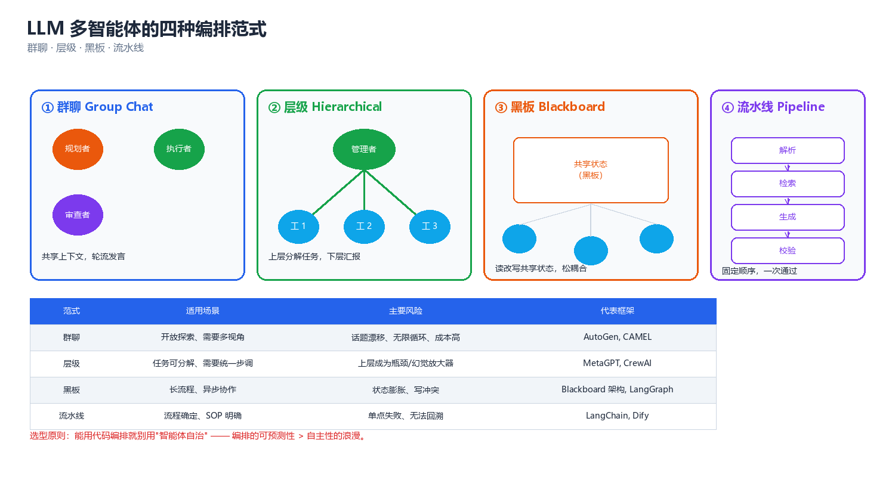
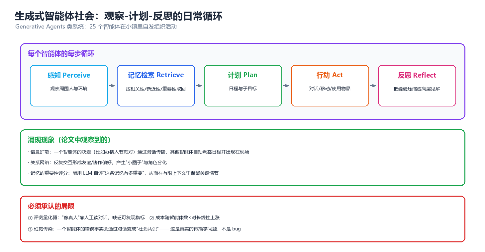
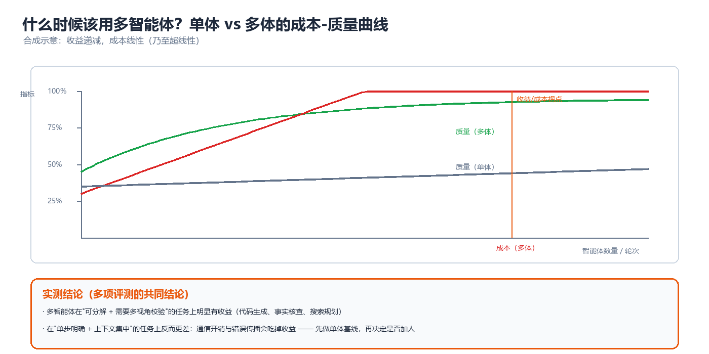

# 第 08 章 LLM 多智能体（LLM-based Multi-Agent Systems）

> 2023 年之后，"多智能体"这个词在工程界被重新定义为一件很具体的事：**把若干语言模型（Large Language Model, LLM）实例用自然语言消息连起来，让它们分工、协商、互相检查，共同完成一个单体模型做不好的任务。** 本章关心的不是"要不要分布式"，而是"用语言做通信信道的分布式系统长什么样、代价是什么、什么时候不值得"。与前面几章不同，这里的智能体没有参数化策略、没有可证明的收敛，只有提示词（prompt）、上下文（context）与一张账单。因此重心放在**工程可复现性**：编排拓扑、成本模型、失败模式与对策，最后用一个纯 numpy 的最小实现把整套机制跑通。

---

## 一、LLM 为何天然适合做多智能体

在经典多智能体强化学习（见第 05 章）里，智能体之间的通信要**学**：信道是参数，消息是张量，协议是涌现出来的。LLM 智能体完全跳过了这一步——语言模型已经预训练过一个人类用几千年协商打磨出来的协议。这是 LLM 多智能体爆发的第一原因，也是最容易被低估的一个。

### 1.1 自然语言即协议

经典通信式 MARL（第 06 章）研究的核心问题——"说什么、对谁说、带宽多少"——在 LLM 多智能体里被大幅简化：

| 维度 | 经典通信式 MARL | LLM 多智能体 |
|------|----------------|-------------|
| 消息表示 | 连续向量 / 离散符号（学出来的） | 自然语言文本（预训练得到的） |
| 协议获取 | 端到端训练信道教 | **零训练**，直接复用人类语言 |
| 可解释性 | 需事后解释 | 人类直接可读 |
| 寻址 | 学出来的注意力/门控 | 显式角色名（`@reviewer`、`to: planner`） |
| 带宽约束 | 信道维度（如 32 维） | **上下文窗口**（context window，几千到几十万 token） |
| 语义落地 | 符号坍塌（symbol collapse）风险 | 词汇歧义、冗长、幻觉 |
| 跨任务迁移 | 协议通常不可迁移 | 提示词可直接复用 |

> **核心思想**：LLM 把"通信协议设计"这个难题，用**预训练语料里的既有协议**替换掉了。代价是通信不再是低维高效的——自然语言消息含大量冗余 token，而 token 就是钱（见 §10.2 的成本模型）。因此 LLM 多智能体的本质矛盾是：**用极低的协议设计成本，换取了极高的通信成本。** 这个交换只在"协议设计难度 ≫ 通信 token 成本"时划算（写一个跨域协作协议要几个月，几次 LLM 调用只要分钱）——这就是为什么几乎所有 LLM 多智能体都是**任务级协作**，而不是**实时控制回路**。

### 1.2 上下文隔离带来的专家分工

LLM 多智能体存在一个任何经典 MAS 都没有的、非常物理的约束：**上下文窗口是有限资源，且窗口内的内容会互相干扰。** 一个单体 LLM 在长对话中会出现两类退化：

1. **上下文污染（context contamination）**：早期无关的失败尝试、错误日志留在窗口里，增加后续推理被"借鉴"的概率（"迷失在中间"，lost in the middle）。
2. **注意力稀释**：窗口越长，关键约束的有效注意力权重越低，长窗口下指令遵循（instruction following）会下降。

把任务拆给多个智能体，等价于**给每个子任务重新分配一块干净的、聚焦的上下文**——不是"人多力量大"，而是**把一次大而杂的注意力分配，切成若干次小而精的注意力分配**（$\text{单体退化} \propto \text{上下文长度} \times \text{主题异质度}$）。

> ⚠️ 这一条既是"收益"来源，也是"成本"来源：每个智能体都要重新加载自己的系统提示（system prompt）、角色描述与历史。拆成 $n$ 个后，输入 token 总量通常**不降反升**（公共前缀被重复计价 $n$ 次）。拆分只在"上下文污染造成的准确率损失 > 重复前缀成本"时才有净收益，§7.1 给出判定清单。

### 1.3 与经典 MAS 的对应关系表

LLM 多智能体并不是一个全新的学科，它是第 01–07 章那套概念在语言模型上的"重新实例化"。这张表是本知识库的桥：

| 经典 MAS 概念 | 章节 | LLM 多智能体里的对应物 | 变化 |
|--------------|------|----------------------|------|
| 智能体（agent） | 01、02 | 一个 LLM + 系统提示 + 工具集 + 记忆 | 策略不再是参数，而是提示词 |
| 智能体架构（BDI 等） | 02 | 三层架构：规划器 + 执行器 + 工具层 | 见第 02 章 LLM Agent 三层架构 |
| 消息 / 信道 | 06 | chat message（role, content, 可选 tool_calls） | 见第 06 章通信协议栈与 MCP/A2A |
| 通信拓扑 | 06、07 | 群聊 / 层级 / 黑板 / 流水线 | 见本章 §2 |
| 黑板 | 07 | 共享的 state 对象（LangGraph state、MetaGPT 环境） | 见第 07 章黑板与分布式一致性 |
| 承诺 / 约定 | 01、07 | 角色契约（role contract）+ 输出 schema | 约束变弱（靠提示而非强制） |
| 一致性 | 07 | 共享记忆的写冲突、消息顺序 | 通常退化为"最后写者胜" |
| 投票 / 社会选择 | 04 | 自一致性（self-consistency）、LLM 陪审团 | 见第 04 章投票的不可能性 |
| 信任 / 声誉 | 04 | 验证智能体（verifier）、批评者（critic） | 无需历史，靠即时查验 |
| 联合动作空间 | 03、05 | 消息空间（近似无限） | 无形式化均衡概念 |
| 收益 / 成本 | 04、05 | token 成本 + 延迟 + 质量 | 成本可精确计量（美元） |
| 失败模式 | 05 | 幻觉传染、无限自省、成本爆炸 | 全新的一类 |

> **核心思想**：读懂这张表，你就理解了本章的全部结构——**第 07 章的组织与协调概念直接搬过来就能用，第 04 章的社会选择工具直接搬过来就能投票，第 06 章的通信协议焦虑反而被 LLM 消解了**。真正新的东西只有三件：上下文预算、幻觉传染、成本的美元计价。

---

## 二、四种编排范式

编排（orchestration）指的是"谁在什么时候跟谁说话"——即拓扑结构。工程上 90% 的选择可以归结为四种范式，它们的区别在于**控制流的归属**：谁决定下一步是哪个智能体。



*图：四种编排拓扑 —— 群聊（全连接、动态）、层级（树、静态）、黑板（共享状态、事件驱动）、流水线（链、线性）。*

### 2.1 群聊（Group Chat / Conversational）

所有智能体在同一段消息历史上轮流发言，由一个**选择器（selector）**决定下一个发言者。这是 AutoGen 的默认模式。

```
                    ┌──────────────────────────────┐
                    │  共享消息历史 [user][A][B][C]… │   ← 每个发言者都读全量
                    └───────┬───────────┬──────────┘
                            │ 读        │ 写
   ┌────────┐  ┌────────┐  ┌────────┐        ┌──────────────┐
   │Agent A │  │Agent B │  │Agent C │  ...   │ Selector     │
   │(产品经理)│  │(工程师)│  │(测试)  │        │ 决定下一个发言者│
   └────┬───┘  └────┬───┘  └───┬────┘        └──────────────┘
        └───────────┴──────────┘  发言（自然语言）
```

- **控制流**：动态。选择器可以是 LLM（"下一个该谁说话"）、固定轮转（round-robin）或规则（"含 TERMINATE 就结束"）。
- **优点**：灵活，适合需要反复来回澄清的任务（结对编程、需求澄清）。
- **缺点**：① 历史线性膨胀，每个发言者重读全部历史 → token 成本 $O(T^2)$；② 容易互相客气或推诿；③ 难以并行。
- **典型实现**：AutoGen `GroupChat`、`GroupChatManager`。

> ⚠️ 群聊最隐蔽的问题是**成本是二次的**：第 $k$ 轮所有人都要读前 $k-1$ 轮全部内容，$n$ 个智能体 $T$ 轮的总输入 token 约为 $\Theta(nLT^2)$。$T$ 从 10 涨到 30，成本涨 9 倍。这是 §8.3 成本爆炸的头号成因。

### 2.2 层级（Hierarchical / Manager-Worker）

一个顶层智能体（manager/planner）把任务拆成子任务，分给下层 worker，收齐结果后汇总。可以是多层。

```
              ┌──────────────────┐
              │ Manager/Planner  │  ← 只读全局，不碰细节
              └────────┬─────────┘
        ┌──────────────┼──────────────┐  任务分派（同层可并行）
   ┌────▼────┐    ┌────▼────┐    ┌────▼────┐
   │ Worker 1│    │ Worker 2│    │ Worker 3│
   │ 子任务 A │    │ 子任务 B │    │ 子任务 C │
   └────┬────┘    └────┬────┘    └────┬────┘
        └──────────────┼──────────────┘  结果回传
                       ▼
              ┌──────────────────┐
              │    汇总 / 校验    │
              └──────────────────┘
```

- **控制流**：静态树。分派由上层决定，下层只执行。
- **优点**：① **可并行**（同层无依赖）；② 每个 worker 上下文独立聚焦（§1.2 的收益直接兑现）；③ 成本可预测（线性）；④ 可给不同 worker 配不同模型（小模型抽取、大模型推理）。
- **缺点**：① 分派质量决定上限——manager 拆错了，下层再努力也没用；② 跨子任务的隐性依赖难以表达；③ 层数增加引入信息损失（每层一次"摘要压缩"）。
- **典型实现**：CrewAI `Crew` + `Process.hierarchical`、MetaGPT 的 SOP 角色链、LangGraph 的 supervisor 模式。

### 2.3 黑板（Blackboard / Shared State）

没有固定发言顺序，所有智能体围绕一个**共享数据结构**（黑板）读写：谁发现黑板上有自己能处理的部分，谁就动手。控制流由黑板状态变化触发。

```
   ┌────────────────────────────────────────────────────┐
   │ 黑板 (Blackboard)                                  │
   │ { task, plan[], artifacts{}, findings[], blockers{} }│
   └───┬──────────────┬───────────────┬──────────────┬───┘
       │ 读/写         │ 读/写          │ 读/写         │ 读/写
   ┌───▼───┐     ┌────▼────┐     ┌─────▼─────┐   ┌────▼────┐
   │ 检索员 │     │ 分析员  │     │  代码员    │   │ 批评者  │
   │补 evidence│  │写 findings│  │写 artifacts│  │写 blockers│
   └───┬───┘     └────┬────┘     └─────┬─────┘   └────┬────┘
       └──────────────┴── 状态变更事件 ──┴──────────────┘
```

- **控制流**：事件驱动。既可以是"任意可用者"，也可以是"带优先级的条件触发"（critic 只在 artifacts 非空时触发）。
- **优点**：① 天然支持乱序与并行；② 状态持久化，中间产物可检视、可回滚；③ 与经典分布式 AI 的黑板系统完全同构（见第 07 章黑板与分布式一致性）。
- **缺点**：① 需定义清楚的状态 schema，否则退化为"一堆自由文本"；② 并发写冲突（谁最后写？）；③ 终止条件更难判定。
- **典型实现**：LangGraph（共享 `State` + 边条件）、MetaGPT 的 `Environment`。

> ⚠️ 黑板范式最易犯的错是**把黑板当成"群聊的另一种写法"**。区别在于：黑板上是**结构化状态**（schema 化的 dict），群聊里是**对话历史**。如果黑板每个字段都只是"某人的一段话"，那就退化回了群聊，还额外丢了顺序信息。

### 2.4 流水线（Pipeline / Sequential）

智能体排成一条链，前一个的输出就是后一个的输入。这是最简单、最容易调试、也最容易被低估的一种。

```
  task ─▶ ┌────────┐ ─▶ ┌────────┐ ─▶ ┌────────┐ ─▶ ┌────────┐
          │R1 规划  │    │R2 执行  │    │R3 校验  │    │ 交付物  │
          │planner │    │executor│    │verifier│    │ output │
          └────────┘    └────────┘    └───┬────┘    └────────┘
                                          │ 不通过（带反馈）
                                          └──◀── 回退到 R2 / R1
```

- **控制流**：线性，可选回退边（retry loop）。
- **优点**：① 成本与延迟完全可预测（$n$ 次串行调用）；② 每阶段可独立测试；③ 中间产物可落盘、可人工审核（human-in-the-loop 插入点天然）。
- **缺点**：① 无并行，延迟 = 各阶段之和；② 上游错误直接毒化下游（错误传播不衰减）；③ 不适合需要来回澄清的任务。
- **典型实现**：ChatDev 的瀑布式角色链、几乎所有"prompt chain"类脚本。

### 2.5 四范式对照表与选型原则

| 维度 | 群聊 | 层级 | 黑板 | 流水线 |
|------|------|------|------|--------|
| 控制流归属 | LLM 选择器（动态） | 上层 manager（静态树） | 状态变更事件 | 固定顺序 |
| 并行能力 | 弱（顺序发言） | **强**（同层并行） | 强（按需触发） | 无 |
| 成本量级 | $\Theta(nLT^2)$ 二次 | $O(nL)$ 线性 | $O(kL)$，$k$ 为触发次数 | $O(nL)$ 线性 |
| 延迟 | 高（串行轮次） | 中（取决于层级深度） | 中低 | 高（串行全链） |
| 调试难度 | 高（历史长、责任不清） | 中 | 中（状态可检视） | **低**（阶段清晰） |
| 澄清/回退 | 强 | 弱 | 中 | 中（显式回退边） |
| 终止判定 | 难（靠哨兵词） | 易（子任务完成） | 难（需状态谓词） | 易（走完全链） |
| 最适合 | 需求澄清、结对编程 | 大任务分解 | 研究/检索聚合 | 固定流程自动化 |
| 代表框架 | AutoGen 群聊 | CrewAI / MetaGPT | LangGraph / MetaGPT | ChatDev / 链式脚本 |

**选型原则（按优先级）**：

1. **能线性就别动态**：步骤可事先写清就用流水线。动态性买的是"应对未知"，代价是成本与不可预测性。
2. **需要并行就上层级或黑板**：群聊几乎无法真正并行。
3. **需要反复澄清就用群聊，但必须设轮数上限**（§8.2）。
4. **混合使用是常态**：真实系统常是"层级外壳 + 局部群聊 + 流水线阶段 + 黑板共享状态"。MetaGPT 就是"层级（SOP 定顺序）+ 黑板（Environment 存产物）"。
5. **拓扑必须运行时可观测**：记录"谁调用了谁、花了多少 token"，否则 §8 的失败模式一个都抓不住。

> **核心思想**：编排拓扑不是审美问题，而是**成本结构问题**。选拓扑 = 选成本随规模的成长阶（二次 vs 线性），这比选哪个框架重要得多。

---

## 三、主流框架解剖

这一节拆解最具代表性的几个框架。重点不是"哪个好"，而是**每个框架在哪个维度上取舍，以及它的抽象泄露在哪里**。

### 3.1 AutoGen：可对话智能体 + 群聊管理器

**核心抽象**：一切皆 `ConversableAgent`（系统提示 + 模型配置 + 工具集），靠 `initiate_chat` 建立双向对话。

| 机制 | 作用 | 工程含义 |
|------|------|---------|
| `ConversableAgent` | 统一可对话实体，用户也是其中之一 | 用户可随时插话（HITL 近零成本） |
| 双角色提示 | `system_message`（自己看）与 `description`（别人看）分开 | 选择器靠 `description` 决定谁发言 |
| `GroupChatManager` | LLM 驱动的发言选择器 | 选择本身也是一次 LLM 调用（额外成本） |
| `generate_reply` 钩子 | 注册 `reply_func` 与终止条件 | 终止条件必须显式注册，否则无限循环 |
| 代码执行 | `UserProxyAgent` 默认带本地执行 | **安全边界在框架之外**，需自己沙箱 |

**抽象泄露**：群聊的二次成本（§2.1）真实存在；`GroupChatManager` 每次选人都要读完整历史——5 个智能体 30 轮时，选择器本身就吃掉大量 token。工程上常用"固定发言顺序 + 规则终止"替代 LLM 选择器来省钱。

### 3.2 MetaGPT：SOP 即代码

**核心抽象**：把软件开发的标准流程（Standardized Operating Procedure, SOP）编码成角色链（产品经理 → 架构师 → 项目经理 → 工程师 → QA），每个角色产出**结构化交付物**（文档、设计图、代码、测试）。

- **`Environment` 作为黑板**：产物写入共享环境，下游按需读取（不是全量读对话）→ 直接规避群聊的二次成本。
- **结构化输出**：产出符合 schema 的文档而非自由文本 → 大幅降低信息传递失真。
- **发布-订阅**：角色只订阅特定消息类型（如 `DesignReview`）才被触发。

**抽象泄露**：SOP 写死 → **无既定流程的创新性任务框架帮不上忙**；角色间靠文档传递，上游一份含糊的 PRD 会让下游全部受害。

### 3.3 CAMEL：角色扮演式任务分解

**核心抽象**：给定任务，自动生成"AI 用户"与"AI 助手"两个角色，用 **角色扮演对话**（role-playing）完成任务，无需人类预设角色。靠 `InceptionPrompting` 为两个角色自动生成带约束的提示（"你是 XX，你不能 XX"），并以"不许偏离角色"维持对话不跑题。

**抽象泄露**：成本结构与 AutoGen 群聊同构（两体轮流发言、历史线性增长），且缺外部验证器——两个 LLM 互相肯定会导致"共振幻觉"（§8.1）。它更适合做**数据生成器**，而非生产系统。

### 3.4 ChatDev：瀑布式软件公司

**核心抽象**：模拟软件公司的瀑布流程 `ChatChain`（DemandAnalysis → LanguageChoose → Coding → CodeComplete → CodeReview）。每一"环"由双人角色（如 CTO + 程序员）对话完成，环与环串行，不通过则带意见回退。

- **`ChatChainConfig`**：用 JSON 定义流程（阶段、角色、是否回退），可配置。
- **环内双人 + 环间流水线**：即"流水线外壳 + 群聊叶子"，是混合拓扑（§2.4 + §2.1）的教科书案例。
- **角色记忆**：各角色历史独立，环间只传结论。

**抽象泄露**：瀑布假设"需求在开头就清楚"，而真实需求随实现变化（回退边能缓解不能根治）；LLM 写的代码"看起来对"，另一个 LLM 很难发现深层逻辑错误。

### 3.5 CrewAI / LangGraph / Swarm：三种取向

| 框架 | 核心隐喻 | 控制流 | 状态管理 | 强项 | 弱项 |
|------|---------|--------|---------|------|------|
| **CrewAI** | 团队（Crew）+ 角色（Role） | 顺次 / 层级 | 任务级传递 | 上手快、角色设定直观 | 控制流表达力有限（条件分支弱） |
| **LangGraph** | 状态机（StateGraph） | **图**（任意边、条件边、循环） | 显式共享 `State` + reducer | 表达力最强、可中断可恢复 | 学习曲线陡，需自己写图 |
| **Swarm** | 例程 + 交接（Handoff） | 无状态交接 | 消息列表（无持久状态） | 极简、无状态易测 | 无持久记忆，复杂任务需自己管状态 |

**一句话记忆**：*CrewAI 写"谁做什么"，LangGraph 画"状态怎么流转"，Swarm 写"什么时候把控制权交给谁"。*

- **CrewAI**：教科书式分工（写报告、做调研）。
- **LangGraph**：流程本身即核心复杂度（带审批、重试、人工介入的生产流程），它把"黑板范式"（§2.3）表达得最完整。
- **Swarm**：路由问题（客服分流、意图分派），本质是**无状态交接**——连"对话历史"都不强绑，交接即可。

### 3.6 框架对比表（工程视角）

| 维度 | AutoGen | MetaGPT | CAMEL | ChatDev | CrewAI | LangGraph | Swarm |
|------|---------|---------|-------|---------|--------|-----------|-------|
| 主要拓扑 | 群聊 | 层级+黑板 | 双人群聊 | 流水线 | 顺次/层级 | 任意图 | 交接路由 |
| 状态是否显式 | 隐式（历史） | **显式**（Environment） | 隐式 | 隐式（环内） | 半显式 | **显式**（State） | 无 |
| 可并行 | 弱 | 中 | 无 | 无 | 中 | 强 | 强 |
| 可中断/恢复 | 有限 | 有限 | 无 | 无 | 有限 | **强**（checkpoint） | 无 |
| 结构化输出 | 中 | **强**（文档） | 弱 | 中 | 中 | 强（schema） | 弱 |
| 人工介入（HITL） | **强**（UserProxy） | 弱 | 无 | 弱 | 中 | **强**（interrupt） | 弱 |
| 代码执行沙箱 | 有（可选） | 有 | 无 | 有 | 有（工具） | 需自建 | 无 |
| 学习曲线 | 中 | 中 | 低 | 低 | **低** | 高 | **低** |
| 适合的生产场景 | 需澄清的协作 | 固定 SOP 流程 | 数据生成 | 固定瀑布流程 | 分工型任务 | 复杂流程编排 | 路由/分派 |

> ⚠️ **不要按"哪个框架最强"来选**：应由**控制流复杂度**与**是否需要持久化/中断**决定——控制流简单 → CrewAI/Swarm；控制流是核心复杂度 → LangGraph；需要"人来拍板" → AutoGen/LangGraph。选错的典型症状是"用顺次流程的框架硬表达带循环与条件分支的流程"，最后写成一坨胶水代码。

> **核心思想**：所有框架都在做同一件事——**把"谁在什么时候用哪块上下文说了什么"变成可编程的对象**。框架之间的差异，本质是"表达能力"与"上手成本"之间的平衡点不同。理解这一点后，你会发现自己可以只用 200 行代码实现其中任何一种（见 §9）。

---

## 四、社会仿真：Generative Agents 与涌现

2023 年的 Generative Agents（Park et al., "Generative Agents: Interactive Simulacra of Human Behavior"）把 25 个 LLM 智能体放进一个叫 Smallville 的虚拟小镇，让它们起床、上班、聊天、办派对。它是 LLM 多智能体从"工具编排"走向"社会仿真"的标志性工作，也是理解本章失败模式的绝佳样本。



*图：感知-记忆-计划-反思循环 —— 智能体不再是"响应器"，而是有记忆、有日程、会复盘的社会参与者。*

### 4.1 感知-记忆-计划-反思循环

单个 Generative Agent 的内部循环由四个模块构成，这个结构后来被几乎所有"有记忆的 LLM 智能体"抄走了：

```
   ┌──────────┐ 观察  ┌───────────┐ 检索  ┌───────────┐
   │ Perceive │ ────▶ │  Memory   │ ────▶ │  Reflect  │
   │  感知    │       │  记忆流    │       │   反思    │
   └────┬─────┘       └─────┬─────┘       └─────┬─────┘
        │       相关性+重要性+新近性 → top-k 记忆  │ 高层洞察写回记忆流
        │                   ▼                     ▼
        └────────────▶ ┌───────────┐  行动（说话/移动/做事）
                       │   Plan    │
                       │ 计划(分层) │ ──▶ 写入记忆流（新的事实）
                       └───────────┘
```

| 模块 | 做什么 | 关键技术点 |
|------|--------|-----------|
| **感知 Perceive** | 接收环境事件（看到谁、听到什么） | 事件统一编码成自然语言描述 |
| **记忆 Memory** | 一个**记忆流**（memory stream），每条记忆带时间戳 | 检索分数 = 相关性 + 重要性 + 新近性（三者加权） |
| **反思 Reflect** | 定期从近期记忆中归纳"高层洞察" | "过去 3 天我在忙什么？" → 一句自我总结写回记忆 |
| **计划 Plan** | 先定日程（天级）→ 小时级 → 5 分钟级 | 分层分解，允许被打断后重规划 |

**记忆检索打分（原文核心公式）**：

$$\text{score}(m) = \alpha_{\text{rec}} \cdot \underbrace{\text{cosine}(\mathbf{e}_q, \mathbf{e}_m)}_{\text{相关性}} + \alpha_{\text{imp}} \cdot \underbrace{\text{importance}(m)}_{\text{LLM 打分 1--10}} + \alpha_{\text{recency}} \cdot \underbrace{0.995^{\,\Delta t}}_{\text{新近性衰减}}$$

> **核心思想**：Generative Agents 的真正贡献不是"25 个智能体聊天"，而是**记忆的工程化**——把"智能体应该记得什么"变成可检索、可排序、可衰减的数据结构问题。这套（记忆流 + 三因子检索 + 反思写回）是今天所有长期记忆方案的祖先，见 §6.2。

### 4.2 涌现现象

论文最令人意外的部分是"没写进代码"的行为自发出现了：

| 涌现现象 | 描述 | 为什么值得注意 |
|---------|------|--------------|
| **信息扩散** | 一人得知"市长选举"，几轮对话后全城都知道 | 通信拓扑决定扩散速度（类比第 06 章） |
| **关系记忆** | 智能体记得跟谁聊过什么，后续引用旧话题 | 长期记忆的因果作用 |
| **自发协调** | 一个智能体想办情人节派对，自发邀请、有人答应、有人帮忙 | **没有任何中央调度者**——正是"多智能体"的定义性特征 |
| **日程涌现** | 咖啡馆、办公室出现"人流高峰" | 个体日程的聚合产生宏观模式 |

派对事件最经典：**发起者没被编程去办派对，其他人也没被编程去参加**——邀请、响应、协调时间全是从"记忆 + 意图 + 语言"里长出来的。

### 4.3 局限：仿真 ≠ 社会

> ⚠️ 把 Generative Agents 的结果当成"社会规律的证据"是本领域最常见的方法论错误。它至少有三层局限：

| 局限 | 具体表现 | 工程/科学含义 |
|------|---------|--------------|
| **语料偏见** | "人格"来自预训练语料，倾向于中产、西方、礼貌 | 仿真结果反映训练分布，不是普遍人性 |
| **记忆压缩失真** | 反思模块用 LLM 归纳，归纳会丢信息、编造细节 | 长跑后记忆漂移，见 §6.2 与 §8.5 |
| **成本墙** | 25 个智能体跑 2 天需**数千次** LLM 调用（论文报告 ~$1000 量级） | 规模与时长被成本锁死，无法做长期社会实验 |
| **无外部校验** | 智能体的话没有"真实性"约束 | 幻觉在群体里传染（§8.1）且无法察觉 |
| **评估困难** | "像人"很难量化 | 只能定性观察或人工打分，可复现性差 |

**结论**：Generative Agents 是**机制演示**，不是**社会预测器**。它证明了"感知-记忆-计划-反思 + 语言交互"能产生连贯的长程行为；其局限提醒我们，LLM 多智能体的天花板受制于三件事——**语料的分布、记忆的保真度、以及 token 的账单**。

---

## 五、协作机制：辩论、投票、反思

前四节讲的是"怎么组织"。这一节讲"组织起来之后，用什么机制让答案更对"。三种最常用、也最有实证基础的机制是：辩论（debate）、投票（voting / self-consistency）、反思（reflexion）。

### 5.1 多智能体辩论与置信度聚合

**多智能体辩论（Multi-Agent Debate, MAD）** 的基本形式：$n$ 个智能体各自独立给出答案与理由，然后看到彼此的答案，再修订，重复 $R$ 轮，最后聚合。

```
  Round 0（独立）      Round 1（互看）      Round 2（收敛）
  ┌────┐┌────┐┌────┐  ┌────┐┌────┐┌────┐  ┌────┐┌────┐┌────┐
  │ A₁ ││ B₁ ││ C₁ │─▶│ A₂ ││ B₂ ││ C₂ │─▶│ A₃ ││ B₃ ││ C₃ │
  │c=.6││c=.7││c=.5│  │c=.8││c=.6││c=.7│  │c=.9││c=.6││c=.8│
  └────┘└────┘└────┘  └────┘└────┘└────┘  └────┘└────┘└────┘
                            └── 聚合: answer = argmax_a Σ_i c_i·1[ans_i=a]
```

关键设计选择：

| 维度 | 选项 | 影响 |
|------|------|------|
| 同质 vs 异质 | 同模型不同提示 / 不同模型 | 异质化降低相关性误差，是收益的主要来源 |
| 是否共享理由 | 只给答案 vs 答案+推理链 | 共享理由更能纠错，但错误理由也会传染（§8.1） |
| 聚合方式 | 多数票 / 置信度加权 / 仲裁者 | 置信度加权通常优于多数票 |
| 轮数 $R$ | 1–3 为主 | 超过 3 轮收益递减甚至转负（相互说服） |

**置信度加权聚合的一个实现**（下面用"模拟 LLM"演示：每个智能体是确定性的，能给出答案与置信度，辩论带来小幅置信度修正）：

```python
# 多智能体辩论 + 置信度加权聚合（用确定性"模拟 LLM"，不调用任何真实 API）
import numpy as np

# 3 个智能体, 2 个候选答案; 每个智能体有: 基线正确概率、自信偏差、可被说服程度
AGENTS = [
    # name,  答案能力 p,  自信偏差 b,  可说服度 s
    ("A_严谨", 0.80, +0.05, 0.30),
    ("B_激进", 0.60, +0.30, 0.55),   # 能力低但过度自信
    ("C_保守", 0.70, -0.15, 0.20),   # 能力中但保守
]
TRUE_ANSWER = "disease_X"


def sim_answer(name, p, b, s, rng, round_idx, hint=0.0):
    """模拟一次 LLM 调用: 以概率 p 答对; 返回 (答案, 置信度).
    hint 为从同伴处获得的"拉力"(>0 表示同伴多数倾向正确答案)."""
    p_eff = min(0.99, max(0.01, p + s * hint * (1 - abs(0.5 - p) * 2)))
    correct = rng.random() < p_eff
    conf = 0.5 + b + 0.15 * round_idx          # 自信度随轮次略微上涨
    conf = float(np.clip(conf + rng.normal(0, 0.03), 0.05, 0.99))
    ans = TRUE_ANSWER if correct else "disease_Y"
    return ans, conf


def debate(n_rounds=3, seed=7):
    rng = np.random.default_rng(seed)
    history = []
    prev_correct_frac = 0.5
    for r in range(n_rounds):
        turn = []
        for name, p, b, s in AGENTS:
            hint = (prev_correct_frac - 0.5) * 2      # [-1, 1]
            ans, conf = sim_answer(name, p, b, s, rng, r, hint)
            turn.append((name, ans, conf))
        prev_correct_frac = sum(a == TRUE_ANSWER for _, a, _ in turn) / len(turn)
        history.append(turn)
    return history


def aggregate(turn, mode="weighted"):
    votes = {}
    for _name, ans, conf in turn:
        w = 1.0 if mode == "majority" else conf
        votes[ans] = votes.get(ans, 0.0) + w
    return max(votes.items(), key=lambda kv: kv[1])


hist = debate(n_rounds=3, seed=7)
print("== 多智能体辩论过程 ==")
for r, turn in enumerate(hist):
    cells = "  ".join(f"{n}={a}(c={c:.2f})" for n, a, c in turn)
    maj = aggregate(turn, "majority")
    wgt = aggregate(turn, "weighted")
    print(f"第{r+1}轮: {cells}")
    print(f"       多数票={maj[0]:<10} 置信度加权={wgt[0]:<10} 真值={TRUE_ANSWER}")

print("\n== 最终聚合结果 ==")
for mode in ("majority", "weighted"):
    ans, score = aggregate(hist[-1], mode)
    print(f"{mode:>9}: 答案={ans}  得分={score:.3f}  正确={ans == TRUE_ANSWER}")

# 对比单智能体基线(A_严谨)与 3 体辩论的正确率(蒙特卡洛)
def mc(n_rounds, trials=2000):
    hits_single, hits_debate = 0, 0
    for t in range(trials):
        rng = np.random.default_rng(1000 + t)
        ans0, _ = sim_answer("A", 0.80, 0.05, 0.30, rng, 0, 0.0)
        hits_single += (ans0 == TRUE_ANSWER)
        h = []
        prev = 0.5
        for r in range(n_rounds):
            turn = []
            for name, p, b, s in AGENTS:
                a, c = sim_answer(name, p, b, s, rng, r, (prev - 0.5) * 2)
                turn.append((name, a, c))
            prev = sum(a == TRUE_ANSWER for _, a, _ in turn) / len(turn)
            h.append(turn)
        hits_debate += (aggregate(h[-1], "weighted")[0] == TRUE_ANSWER)
    return hits_single / trials, hits_debate / trials

s1, s2 = mc(3)
print(f"\n蒙特卡洛(2000 次): 单体基线={s1:.3f}  三体辩论加权={s2:.3f}  提升={s2-s1:+.3f}")
# 预期输出:
# == 多智能体辩论过程 ==
# 第1轮: A_严谨=disease_X(c=0.56)  B_激进=disease_Y(c=0.77)  C_保守=disease_X(c=0.32)
#        多数票=disease_X  置信度加权=disease_X  真值=disease_X
# 第2轮: A_严谨=disease_X(c=0.74)  B_激进=disease_Y(c=0.93)  C_保守=disease_X(c=0.51)
#        多数票=disease_X  置信度加权=disease_X  真值=disease_X
# 第3轮: A_严谨=disease_X(c=0.82)  B_激进=disease_X(c=0.99)  C_保守=disease_Y(c=0.64)
#        多数票=disease_X  置信度加权=disease_X  真值=disease_X
#
# == 最终聚合结果 ==
#  majority: 答案=disease_X  得分=2.000  正确=True
#  weighted: 答案=disease_X  得分=1.812  正确=True
#
# 蒙特卡洛(2000 次): 单体基线=0.796  三体辩论加权=0.901  提升=+0.105
```

> ⚠️ 注意上面这个模拟里，收益来自**异质化**（三个智能体的能力 $p$ 不同、偏差不同）与**置信度加权**（避免了过度自信的 B 主导投票）。如果你把三个智能体设成完全相同的参数，辩论的收益会趋近于 0——这正是实证结论（§5.4）：**辩论的收益来自多样性，不是来自"多"**。

### 5.2 投票与自一致性

**自一致性（Self-Consistency）** 是单体版的"投票"：同一模型高温采样 $k$ 次，对推理题取多数答案。它与"多智能体投票"在数学上是同一件事——把 $k$ 个（近似）独立估计聚合起来。

| 方法 | 采样来源 | 投票者 | 成本 | 典型增益 |
|------|---------|--------|------|---------|
| 自一致性 | 同模型高温采样 $k$ 次 | 同质 | $k$ 次调用 | 推理题 +5~15 分 |
| 多智能体投票 | 不同提示/不同模型 | 异质 | $k$ 次调用 + 聚合 | 略高于自一致性（多样性更高） |
| 辩论 | 多轮互看后投票 | 异质 + 相互修正 | $k \times R$ 次调用 | 更多，但 $R>3$ 后转负 |
| LLM 陪审团 | 一个模型扮演多个角色 | 半异质 | $k$ 次调用 | 与自一致性持平或略好 |

> ⚠️ **第 04 章的警告在这里直接生效**：投票聚合的有效性依赖"投票者的错误不相关"。若 $k$ 个投票者共享同一训练偏差（常见！比如所有 LLM 都倾向选"看起来更权威"的选项），多数票会**稳定地**选错——这不是随机误差，是系统性偏差，投票消不掉。更糟的是，Condorcet 陪审团定理（§10.3）的前提"每个投票者独立且准确率 $p > 0.5$"在 LLM 群体里常常不成立：$p < 0.5$ 时**加人反而更差**。这是第 04 章投票不可能性与选择性聚合结论的工程后果。

### 5.3 Reflexion 式自我修正

**Reflexion**（Shinn et al., 2023）把"失败经验"变成语言记忆：行动失败 → 生成文字反思 → 存进情景记忆（episodic memory）→ 重试时把反思放进上下文。

```
   尝试 ─▶ 执行 ─▶ 评估(通过?) ─是─▶ 结束
                    │否
                    ▼ 生成语言反思("失败原因… 下次应…") → 写入情景记忆
              ┌───────────┐
              │ 重试(反思入上下文)│ ──▶ 回到"尝试"
              └───────────┘
```

| 设计点 | 好做法 | 坏做法 |
|--------|-------|-------|
| 评估来源 | **外部信号**（测试通过、编译成功、单元测试） | 让 LLM 自己说"我觉得对了"（自我表扬） |
| 反思粒度 | 具体的、可执行的教训 | "我要更小心"（无信息量，纯浪费 token） |
| 记忆范围 | 只保留最近 $k$ 条反思 | 无限累积 → 上下文爆炸 |
| 重试上限 | 显式硬上限（如 3 次） | 依赖模型自己停 → 无限自省（§8.2） |

> **核心思想**：Reflexion 有效的前提是**存在一个廉价、可靠、外部的评估信号**（编译器、测试、检索命中）。若评估信号也是 LLM 打的印象分，反思就退化为"两个 LLM 互相点头"，既涨不了正确率又涨了账单。**先能自动判对错，再谈自我修正。**

### 5.4 何时有收益：实证结论汇总

综合 2023–2024 年的经验研究（MAD 类论文、Self-Consistency、Reflexion 及多项复现研究）：

| 条件 | 收益倾向 | 解释 |
|------|---------|------|
| 任务有**唯一正确答案**且可自动验证 | 正 | 投票/辩论能有效纠错 |
| 任务**开放、主观**（文案、头脑风暴） | 弱/不确定 | 无"对错"，聚合无锚点 |
| 投票者**异质**（不同模型/提示/温度） | **强正** | 错误去相关，聚合有效 |
| 投票者**同质** | 弱（≈自一致性） | 错误相关，多数票不纠错 |
| 单体基线已接近上限 | 负 | 加人只增成本（天花板效应） |
| 需**长程推理链** | 中 | 辩论能纠正局部错误，但轮数多后互相说服 |
| 需**事实检索**且无检索工具 | 负 | 多体只会让幻觉互相强化（§8.1） |
| 辩论轮数 $R \le 3$ / $R \ge 5$ | 正 / 负或持平 | 3 轮足够收敛；5 轮以上相互说服 → 坍缩到错误答案 |

> ⚠️ 最重要的一条实证结论：**多智能体的收益不是"人多"，而是"多样性 + 可验证性"**。缺少任何一个，加智能体就是在给幻觉加杠杆。

---

## 六、记忆与上下文工程

在前几章里"上下文"是技术细节。在 LLM 多智能体里，**上下文就是唯一的通信媒介与唯一的状态存储**——所以上下文工程（context engineering）不是优化项，是核心设计。

### 6.1 共享上下文 vs 独立上下文

| 方案 | 结构 | 优点 | 缺点 | 适用 |
|------|------|------|------|------|
| **全共享** | 所有智能体读同一段消息历史 | 零信息丢失，无同步问题 | token 成本 $O(nT^2)$；注意力稀释；上下文污染 | 群聊、小规模、需强一致 |
| **全独立** | 各自维护历史，只在内部累积 | 成本线性；上下文聚焦 | 信息不流通；需显式传递机制 | 层级、流水线 |
| **共享状态 + 独立历史**（推荐） | 黑板上是共享事实，各自另有私有对话历史 | 兼顾流通与聚焦，成本可控 | 需定义 schema 与读取策略 | MetaGPT/LangGraph 式系统 |

```
   全共享:                    共享状态 + 独立历史:
   ┌───────────────┐          ┌────────────────────────────┐
   │  全部历史      │          │ 共享黑板 (结构化事实)        │
   │  [全量对话]    │          │ plan[] / findings[] / ...  │
   └──┬──┬──┬──┬───┘          └──┬──────┬──────┬──────┬────┘
      │  │  │  │ 每人读全量       │订阅   │订阅   │订阅   │
   ┌──▼┐┌─▼┐┌─▼┐┌─▼┐          ┌─▼──┐ ┌─▼──┐ ┌─▼──┐ ┌─▼──┐
   │A  ││B ││C ││D │          │ A  │ │ B  │ │ C  │ │ D  │
   │私有││私有││私有││私有│      │私历史│ │私历史│ │私历史│ │私历史│
   └───┘└──┘└──┘└──┘          └────┘ └────┘ └────┘ └────┘
   成本 O(n·T²)               成本 O(k·L)，k=触发次数
```

> **核心思想**：**"共享事实"与"共享对话"是两件事**。让所有智能体共享一份结构化事实（谁做了什么、结论是什么），比让它们共享整段对话便宜得多、也准得多。这是 MetaGPT 用 `Environment` 而不是"一个大 chat"的关键原因。

### 6.2 长期记忆：向量库、摘要、图记忆

| 记忆类型 | 实现 | 检索方式 | 优点 | 缺点 |
|---------|------|---------|------|------|
| **向量记忆** | 句子嵌入 → 向量库（FAISS/Milvus/pgvector） | 语义相似度 top-k | 实现简单、通用 | 只按相似度取，缺结构；会漏掉"表面无关但关键"的事实 |
| **摘要记忆** | LLM 定期把旧对话压缩成摘要 | 摘要始终入上下文 | token 省得多 | **有损**，多次压缩后漂移（§8.5） |
| **图记忆** | 实体-关系图（知识图谱） | 图遍历 + 向量混合检索 | 保留结构关系，支持多跳推理 | 抽取成本高、需 schema（GraphRAG/Zep） |
| **情景/语义/程序三层** | 发生过什么 / 知道什么 / 会做什么 | 按类型分别检索 | 贴近认知模型，检索意图明确 | 工程复杂 |
| **工作记忆** | 当前上下文窗口本身 | 直接可见 | 零检索延迟 | 容量受窗口限制 |

**Generative Agents 的三因子打分（§4.1）是最重要的实用技巧**：只按相似度检索会退化成"关键词匹配"，加上**新近性衰减**（$0.995^{\Delta t}$）与**LLM 重要性打分**，才能让"昨天发生的重要事"压过"三周前的一句相似闲聊"：

$$\text{retrieval}(m \mid q) = \alpha \cdot \text{sim}(q, m) + \beta \cdot \text{importance}(m) + \gamma \cdot 0.995^{\Delta t_m}$$

> ⚠️ 长期记忆最常见的三个 bug：① **只写不读**（存了但检索不到）；② **只读不衰减**（半年前的无关记忆挤占 top-k）；③ **反思污染**（LLM 归纳的"洞察"被当事实再次检索，错误被固化，见 §8.5）。

### 6.3 上下文预算分配

每个 LLM 调用都有一个硬上限（上下文窗口）。窗口里要装：系统提示、角色描述、任务描述、检索到的记忆、工具定义、历史消息、以及留给输出的空间。这是一次**在预算约束下最大化信息价值的分配问题**。

$$\max_{\{b_j\}} \sum_{j} v_j(b_j) \quad \text{s.t.} \quad \sum_j b_j \le B_{\text{window}} - B_{\text{output}}, \quad b_j \ge 0$$

其中 $v_j(b_j)$ 是第 $j$ 类内容分到 $b_j$ 个 token 时的"边际价值"，通常是**递减**的（第一段检索结果很有用，第五段基本冗余）。

三种常见分配策略：

| 策略 | 做法 | 优点 | 缺点 |
|------|------|------|------|
| **均分** | 每类内容分等量 token | 实现最简单 | 忽视边际价值差异，浪费预算 |
| **优先级截断** | 固定优先级，高优先级先满足 | 保障关键内容（如任务描述） | 低优先级永远饿死，灵活性差 |
| **贪心边际收益** | 每次把预算给当前边际价值最高的一类 | 近似最优（边际价值递减 → 贪心近似有效） | 需要估计边际价值曲线 |

下面实跑一个对比：三类内容（任务描述 / 检索记忆 / 对话历史）各有不同的边际收益曲线，在固定预算下比较三种策略。

```python
# 上下文预算分配: 均分 vs 优先级 vs 贪心边际收益(用离散"token 块"模拟)
import numpy as np

TOTAL_BUDGET = 40          # 可用 token 预算(模拟单位, 每块 = 1 单位)
BLOCK = 1                  # 每次分配 1 块

# 三类上下文内容, 每类最多占 24 块; v[类别][已分配块数] = 第 k 块带来的边际价值
# 边际价值递减是普遍规律 (第一段记忆最有用, 第五段冗余)
def marginal_value(kind, k):
    """第 k+1 块(从 0 计数)的边际价值"""
    if kind == "任务描述":      # 前几块极其关键, 之后迅速饱和
        return 1.00 if k < 3 else 0.15
    if kind == "检索记忆":      # 平稳递减, 能有 8 块左右有效信息
        return max(0.0, 0.90 - 0.10 * k)
    if kind == "对话历史":      # 缓慢递减, 长尾
        return max(0.0, 0.50 - 0.03 * k)
    return 0.0


KINDS = ["任务描述", "检索记忆", "对话历史"]
CAP = {k: 24 for k in KINDS}


def total_value(alloc):
    return sum(marginal_value(k, j) for k in KINDS for j in range(alloc[k]))


def alloc_uniform(budget):
    per = budget // len(KINDS)
    return {k: min(per, CAP[k]) for k in KINDS}


def alloc_priority(budget, order=("任务描述", "检索记忆", "对话历史")):
    left, out = budget, {k: 0 for k in KINDS}
    for k in order:
        take = min(left, CAP[k])
        # 只取到边际价值 > 0 为止
        take = min(take, sum(1 for j in range(CAP[k]) if marginal_value(k, j) > 0.01))
        out[k] = take
        left -= take
    return out


def alloc_greedy(budget):
    out = {k: 0 for k in KINDS}
    for _ in range(budget):
        best, best_v = None, -1.0
        for k in KINDS:
            if out[k] < CAP[k]:
                v = marginal_value(k, out[k])
                if v > best_v:
                    best, best_v = k, v
        if best is None or best_v <= 0:
            break
        out[best] += 1
    return out


print(f"{'策略':<12}{'分配方案':<34}{'总价值':>8}{'相对最优':>10}")
strategies = [("均分", alloc_uniform(TOTAL_BUDGET)),
              ("优先级截断", alloc_priority(TOTAL_BUDGET)),
              ("贪心边际", alloc_greedy(TOTAL_BUDGET))]
best_val = max(total_value(a) for _, a in strategies)
for name, a in strategies:
    desc = " ".join(f"{k}={a[k]}" for k in KINDS)
    print(f"{name:<12}{desc:<34}{total_value(a):>8.2f}{total_value(a)/best_val:>10.1%}")
print("\n三种策略的差异来自'边际价值'而非'总量':")
print(f" 均分    : 13/13/13 —— 任务描述 13 块里只有 3 块高价值(其余 10 块边际仅 0.15), 浪费 5.4%")
print(f" 优先级  : 24/9/7  —— 任务描述吃到饱和后仍继续吃(边际 0.15), 挤掉了历史的 12→7 块")
print(f" 贪心边际: 20/8/12 —— 每次把下一块给当前边际价值最高者, 得 13.97 为最优")
# 预期输出:
# 策略          分配方案                                   总价值      相对最优
# 均分          任务描述=13 检索记忆=13 对话历史=13              13.16     94.2%
# 优先级截断       任务描述=24 检索记忆=9 对话历史=7                13.52     96.8%
# 贪心边际        任务描述=20 检索记忆=8 对话历史=12               13.97    100.0%
#
# 三种策略的差异来自'边际价值'而非'总量':
#  均分    : 13/13/13 —— 任务描述 13 块里只有 3 块高价值(其余 10 块边际仅 0.15), 浪费 5.4%
#  优先级  : 24/9/7  —— 任务描述吃到饱和后仍继续吃(边际 0.15), 挤掉了历史的 12→7 块
#  贪心边际: 20/8/12 —— 每次把下一块给当前边际价值最高者, 得 13.97 为最优
```

> ⚠️ 工程提醒：真实系统里"边际价值曲线"你不知道，只能估计。实用近似是——**给任务描述与输出留固定硬空间（不可压缩），把剩余预算按"相关性排序 + 截断"分给记忆与历史**，并对超长记忆做摘要而非直接截断（截断会砍掉重要的尾部和头部）。

---

## 七、何时该用多智能体

这一节回答一个在立项时最该问、却最少被问的问题：**"这个任务，多智能体真的比单体好吗？"** 答案往往是否定的。



*图：质量随智能体数先升后平（甚至下降），成本却近似线性增长 —— 存在一个不值得越过的拐点。*

### 7.1 收益条件清单

用多智能体的**收益**来自下面五个来源中的至少一个，每一条都对应一种可验证的机制：

| # | 收益来源 | 判定问题（回答"是"才受益） | 机制 |
|---|---------|--------------------------|------|
| 1 | **上下文隔离** | 任务是否由若干主题差异大的子问题组成？单体塞进一个窗口是否互相干扰？ | §1.2 |
| 2 | **可并行** | 子任务之间是否有真正的独立性？ | §2.2 |
| 3 | **多样性去相关** | 我能否让多个智能体犯**不同**的错（异质模型/提示）？ | §5.1 |
| 4 | **可验证性** | 是否存在廉价的外部判据（测试、检索、schema 校验）？ | §5.3 |
| 5 | **角色约束** | 任务是否需要互相冲突的视角（生成 vs 审查、乐观 vs 悲观）？ | §3.2 |

> **核心思想**：把上表当成**必要条件清单**——五条里 0–1 条为"是"时多智能体几乎必然亏；2 条是弱正收益；3 条以上才值得做。**最常见的错误是"任务能拆"就拆**——"能拆"只满足条件 2，若子任务共享大量上下文（条件 1 为否），拆完反而更差。

### 7.2 收益为负的反例

四个真实场景的反例，共同点是：**被拆出去的部分本来不需要"独立决策"，只需要"独立计算"。**

| 反例 | 表面理由 | 实际结果 | 根因 |
|------|---------|---------|------|
| **多体写一个函数** | "让程序员、审查者、测试者各司其职" | 三方各写一段、风格冲突、合不上 | 增量编程是高耦合任务，上下文必须完整（条件 1 否） |
| **事实问答用辩论** | "三个智能体互相纠正幻觉" | 无检索工具时，三方共同"确认"了同一个错误事实 | 缺外部验证（条件 4 否），错误高度相关（条件 3 否） |
| **并行翻译一份文档** | "分章节并行加速" | 术语不一致、代词指代断裂 | 分片共享全局约束（术语表），拆开丢失一致性 |
| **群聊做结构化抽取** | "让智能体讨论出最准的字段" | 成本 8 倍，准确率与单体单次持平 | 抽取任务没有"多视角"可挖（条件 3、5 否），且输出需稳定 |

> ⚠️ 四个反例有统一的诊断句式：**"我把任务拆开，是为了让每个智能体看到更少的上下文，还是因为任务本身真的有两个独立目标？"** 前者是伪需求——你只想限制上下文，用检索/摘要/截断就能做到，不必起一个新的 LLM 智能体。

### 7.3 先用单体基线的实验协议

不要"先搭多体再看效果"，要**先测单体上限**（这与第 09 章的评估协议一节相呼应）：

1. **固定评估集**：$N \ge 50$ 个任务样本，判据必须**自动、可复现**（精确匹配 / 单元测试 / 人工 rubric）——会变的手工评分不是基线。
2. **测单体基线（single-pass）**：一次调用，最强提示。
3. **测单体增强（single + $k$ samples）**：同一模型采样 $k$ 次取多数，或加重试——**最容易被忽略的最强对照**。
4. **测多体系统**：目标拓扑，固定智能体数与轮数。
5. **对齐成本**：报告**质量-成本曲线**而非单点；成本用真实 token 数 × 单价计算（§10.2）。
6. **判据**：只有当多体在**同等成本下**显著优于"单体 + 同样多采样的多数票"时，多体才成立；若打平选单体——它更简单、更可维护。

| 实验臂 | 调用次数 | 说明 |
|--------|---------|------|
| A：单体单次 | 1 | 最低基线 |
| B：单体 + 自一致性（$k=3$） | 3 | **关键对照**：多数多体系统打不过这臂 |
| C：多体（3 智能体，1 轮） | 3 | 与 B 等成本，可直接对比 |
| D：多体（3 智能体，3 轮辩论） | 9 | 高成本臂 |
| E：单体 + 换提示重采样 3 次 | 3 | 检验"异质性"是否真来自智能体结构 |

> **核心思想**：**B 臂是照妖镜**。如果多体系统在相同调用次数下打不过"同一模型采样 3 次取多数票"，那你付出的框架复杂度、调试成本、不确定性都是白付的——多样性可以从采样获得，不必来自拓扑。

---

## 八、失败模式与工程对策

这一节的每一条都是真实系统里踩过的坑。LLM 多智能体的失败模式与经典 MARL（第 05 章）的"非平稳、不收敛"完全不同——它们是**语言层面的**。

### 8.1 幻觉传染（Hallucination Contagion）

**现象**：一个智能体编造了一个事实（"该 API 的参数是 `timeout_ms`"），其他智能体在后续发言中把它当已知条件使用，最终系统基于一个虚构事实输出结果。错误不是被稀释，而是被**放大**。

```
   ┌─────────┐ "参数叫 timeout_ms"(编造)
   │ Agent A │ ────────────────┐
   └─────────┘                 ▼
                    ┌────────────────────┐
                    │ 共享上下文 / 黑板   │  ← 错误进入共享状态
                    └───┬────────────┬───┘
              ┌─────────▼───┐   ┌────▼────────┐
              │ Agent B     │   │ Agent C     │
              │ "按 timeout_ms│  │ "我来用      │
              │  写好了"     │   │  timeout_ms"│
              └─────────┬───┘   └────┬────────┘
                        │ "确认没问题"│
                        └─────┬──────┘
                              ▼  错误被两票"独立确认" → 固化
```

**对策**：

| 对策 | 做法 | 为什么有效 |
|------|------|-----------|
| **工具锚定** | 事实性断言必须带来源（工具调用结果 / 检索片段 ID） | 把"是否真实"从 LLM 判断变成外部查证 |
| **来源标注传播** | 消息里带 `evidence: [doc_17]`，下游引用必须转发 | 无来源的断言在传播中自动贬值 |
| **写入校验** | 黑板写入前跑 schema / 存在性校验 | 错误在进入共享状态前被拦截 |
| **异质化** | 至少一个智能体用不同模型/提示 | 去相关，降低"同步幻觉"概率 |
| **批评者专用提示** | 批评者的提示里明确"默认上游可能错，请找反例" | 打破"礼貌性确认"倾向 |

> ⚠️ 最危险的是**幻觉获得了"多票确认"**。投票可信度依赖独立性，但 LLM 智能体在同一共享上下文里高度相关——一旦错误进了共享状态，再多的投票者都是"回声"。

### 8.2 无限循环 / 无限自省

**现象**：两个智能体互相说"我觉得还可以再改改"，或反思模块不断产生"这次要注意 X"然后重试，永不终止。**根因**：LLM 没有内在的"够了"信号；礼貌性互动会被解读为"任务未完成"。

| 对策 | 实现 |
|------|------|
| **硬轮数上限** | `max_turns` / `max_iterations`，框架层强制（不是提示层！） |
| **成本预算上限** | 累计 token 或美元超阈值即终止 |
| **哨兵终止词** | `TERMINATE` / `FINAL_ANSWER`，由校验器而非 LLM 判断 |
| **状态谓词终止** | 黑板达到完成条件（如 `tests_passed == True`）才停 |
| **进展检测** | 比较连续两轮的状态指纹，不变则强制终止（"无进展即停"） |

> ⚠️ **终止条件必须写在代码里，不能写在提示里。** "请在任务完成时回复 DONE"是**建议**，不是**保证**。

### 8.3 成本爆炸

**现象**：账单超预期 10–100 倍。五个常见来源：

| 来源 | 量级 | 例子 |
|------|------|------|
| **二次轮次成本** | $O(T^2)$ | 群聊 30 轮，每轮重读全部历史 |
| **选择器开销** | $O(T)$ 次额外调用 | `GroupChatManager` 每轮选人一次大模型调用 |
| **重试/反思放大** | $\times R$ | 每个失败重试都重读全部上下文 |
| **前缀重复** | $\times n$ | $n$ 个智能体各自重复相同的系统提示与任务描述 |
| **无效输出** | 不定 | 输出冗长、自我重复、格式重试 |

**对策**：给每个智能体设 `max_tokens`；用**缓存（prompt caching）**消除重复前缀计费；用便宜模型做选择器/路由/抽取；把"共享历史"换成"共享状态"（§6.1）；在编排层做**预算熔断**——累计成本 < 50% 预算正常、50–90% 降级（换小模型/缩短历史）、≥ 90% 强制收尾并告警。

### 8.4 角色同质化

**现象**：让多个 LLM 扮演"程序员/审查者/测试者"，但产出风格、判断、错误几乎一致——因为**同一模型 + 结构相似的提示 = 高度相关的输出**，角色名只是装饰。**诊断**：比较不同角色输出的相似度（编辑距离 / 嵌入余弦），pairwise > 0.9 说明角色没真正分化。

| 对策 | 做法 |
|------|------|
| **异质模型** | 不同角色用不同厂商/规模的模型（最强去相关手段） |
| **异质提示** | 给不同角色不同的**方法论**（"用反例法" vs "用归纳法"），而不只是不同头衔 |
| **异质信息** | 不同角色看到**不同的输入切片**（如审查者只看 diff，不看原始需求） |
| **对抗性设定** | 明确要求"找一个对方没考虑到的失败场景" |

> ⚠️ 如果 $k$ 个"不同角色"的输出高度相关，投票/辩论的收益趋近于 0（§5.1），而成本是 $k$ 倍。**角色同质化是最隐蔽的浪费**——系统看起来很多样，实际是一个模型的 $k$ 个副本。

### 8.5 目标漂移

**现象**：多轮之后输出偏离原始目标——"本来要修 bug，最后重构了整个模块"。原因通常是：① 摘要压缩丢失原始约束；② 反思模块的"洞察"覆盖了原始目标；③ 中间产物（如一份 bug 报告）变成事实上的新目标。

| 对策 | 做法 |
|------|------|
| **目标钉住（goal pinning）** | 原始任务描述永久保留在**每个**智能体的系统提示里，不参与摘要压缩 |
| **约束清单 + 定期回读** | 关键约束作为 checklist，每 $k$ 轮让一个智能体显式核对 |
| **产物与目标分离** | 黑板区分"用户目标"与"中间产物"，禁止后者覆盖前者 |
| **漂移度量** | 定期用嵌入相似度比较"当前计划"与"原始目标"，低于阈值告警 |

### 8.6 对策清单（速用）

| 失败模式 | 首要对策 | 次要对策 | 检测信号 |
|---------|---------|---------|---------|
| 幻觉传染 | 工具锚定 + 来源标注 | 写入校验、异质化 | 出现无来源的事实断言 |
| 无限循环 | 硬轮数上限（代码层） | 成本熔断、进展检测 | 轮数增长 / 状态无变化 |
| 成本爆炸 | 预算熔断 + 前缀缓存 | 共享状态替代共享历史 | token 增速超线性 |
| 角色同质化 | 异质模型 | 异质提示/信息 | 角色输出相似度 > 0.9 |
| 目标漂移 | 目标钉住 | 漂移度量 + 回读 | 计划与目标相似度下降 |

> **核心思想**：**所有失败对策的共同逻辑是"把 LLM 的判断替换为代码的约束"。** LLM 层负责生成与推理，编排层负责边界——轮数、预算、来源、校验、终止，全部必须是确定性代码。把约束写在提示里的系统，迟早会失效在提示里。

---

## 九、一个完整的最小实现

这一节给出一套可以直接照搬的最小骨架：消息 schema、编排伪代码、关键提示模板，并用纯 numpy 的"模拟 LLM"实跑一个 3 智能体流水线。

### 9.1 消息 schema

```python
# 消息 schema —— 建议每个字段都在代码里强制, 而不是靠约定
Message = {
    "msg_id":     "m-0007",              # 全局唯一, 便于追踪/去重
    "sender":     "planner",             # 角色名
    "recipient":  "coder",               # 角色名或 "broadcast" / "blackboard"
    "type":       "plan",                # 消息类型: plan/artifact/critique/result
    "content":    "把任务拆成 3 步 ...",   # 自然语言载荷
    "artifact":   {"steps": [...]},      # 结构化载荷(可选, 优先于 content 被下游解析)
    "evidence":   ["doc_17", "tool:run_tests#2"],  # 事实来源(对抗幻觉传染)
    "confidence": 0.82,                  # 自评置信度(用于聚合)
    "cost":       {"in_tokens": 812, "out_tokens": 233},  # 成本核算
    "round":      1,                     # 轮次(用于预算与终止)
}
```

**设计要点**：① `type` + `artifact` 让下游能**只订阅自己需要的类型**（黑板发布-订阅）；② `evidence` 是幻觉传染的第一道防线；③ `cost` 让编排层能实时熔断；④ `msg_id` 让日志可回放。

### 9.2 编排伪代码

```
# 流水线 + 硬约束的最小编排器
def run_pipeline(task, budget_tokens=6000, max_rounds=3):
    goal = freeze(task)                    # 目标钉住: 不参与任何摘要
    board = {"goal": goal, "plan": None, "artifact": None, "critiques": []}
    spent = 0

    # 阶段 1: 规划 (planner)
    plan = call("planner", prompt_planner(goal), schema=PLAN_SCHEMA)
    board["plan"] = plan; spent += plan.cost

    # 阶段 2-3: 执行 -> 校验 (流水线 + 回退边)
    for r in range(1, max_rounds + 1):
        if spent > 0.9 * budget_tokens:    # 预算熔断
            return finalize(board, reason="budget_exceeded")
        art = call("coder", prompt_coder(goal, board["plan"],
                                          feedback=board["critiques"]),
                   schema=CODE_SCHEMA)
        board["artifact"] = art; spent += art.cost

        verdict = call("verifier", prompt_verifier(goal, art),
                       schema=VERDICT_SCHEMA)
        spent += verdict.cost
        if verdict.passed:                 # 状态谓词终止(不是哨兵词!)
            return finalize(board, reason="verified")
        board["critiques"].append(verdict.critique)

    return finalize(board, reason="max_rounds")   # 硬轮数上限
```

### 9.3 关键提示模板

```
# planner 系统提示 (目标钉住 + 结构化输出)
你是任务规划器。
[不可变目标] {goal}
规则:
  1. 只输出 JSON, 符合 schema: {"steps": [{"id":int, "action":str, "done_when":str}]}
  2. 每个步骤必须有可自动判定的完成条件 done_when
  3. 步骤数 2-5, 不要拆分无依赖的细节
  4. 不得修改或重新表述目标
不输出任何解释文字。

# verifier 系统提示 (对抗性: 默认上游有错)
你是独立校验者。你的默认假设是: 上游产物**可能包含错误**。
[不可变目标] {goal}
[待校验产物] {artifact}
要求:
  1. 逐条核对 done_when 是否满足, 给出 evidence(测试结果/日志片段)
  2. 若任一条件无法用证据支撑, 判 passed=false
  3. critique 必须指向具体位置与具体理由, 禁止"总体不错"这类判断
输出 JSON: {"passed": bool, "critique": str, "evidence": [str]}
```

### 9.4 用模拟 LLM 实跑一个 3 智能体流水线

下面这段代码用**确定性函数**替代真实 LLM，完整演示：编排循环、结构化消息、预算累加、校验回退、终止判定。

```python
# 3 智能体流水线(planner -> coder -> verifier)完整模拟
# 用确定性"模拟 LLM", 不调用任何真实 API; 重点演示编排/预算/终止逻辑
import numpy as np


# ---------- 消息 schema ----------
def make_msg(msg_id, sender, recipient, mtype, content,
             artifact=None, evidence=None, confidence=0.8, cost=0):
    return {"msg_id": msg_id, "sender": sender, "recipient": recipient,
            "type": mtype, "content": content, "artifact": artifact or {},
            "evidence": evidence or [], "confidence": confidence, "cost": cost}


# ---------- 模拟 LLM 调用(确定性, 无网络) ----------
PRICES = {"planner": (0.003, 0.015), "coder": (0.002, 0.010),
          "verifier": (0.002, 0.010)}          # (美元/1k 输入, 美元/1k 输出)


def sim_llm(role, in_tok, out_tok):
    """返回 (总 token, 美元成本)"""
    pi, po = PRICES[role]
    return in_tok + out_tok, in_tok * pi / 1000 + out_tok * po / 1000


TASK = "实现一个函数 max_subarray(arr) 返回最大子数组和"


def llm_planner(goal):
    art = {"steps": [
        {"id": 1, "action": "实现 Kadane 算法", "done_when": "对 [2,-1,2,3,-9] 返回 6"},
        {"id": 2, "action": "处理全负数输入", "done_when": "对 [-3,-1,-7] 返回 -1"},
    ]}
    tok, cost = sim_llm("planner", 700, 180)
    msg = make_msg("m-0001", "planner", "coder", "plan",
                   f"计划 {len(art['steps'])} 步", artifact=art,
                   confidence=0.85, cost=round(cost, 6))
    return msg, tok


def llm_coder(goal, plan, feedback, attempt):
    """第 1 次故意漏掉全负数边界(模拟真实 LLM 的典型遗漏), 收到反馈后修正"""
    fixed = bool(feedback)
    art = {"code": "def max_subarray(arr): ...",
           "handled_edges": ["empty", "all_negative"] if fixed else ["empty"]}
    tok, cost = sim_llm("coder", 1100, 400)
    msg = make_msg(f"m-10{attempt:02d}", "coder", "verifier", "artifact", "已实现",
                   artifact=art, confidence=0.70 if not fixed else 0.90,
                   cost=round(cost, 6))
    return msg, tok, ([] if fixed else ["edge_all_negative"])


def llm_verifier(goal, artifact, attempt):
    """逐条核对 done_when: 依据产物声明的 handled_edges 判定, 必须给 evidence"""
    missing = [e for e in ("empty", "all_negative") if e not in artifact["handled_edges"]]
    passed = not missing
    critique = "" if passed else f"未处理边界: {missing[0]}; 请补上并加测试"
    ev = (["test:max_subarray([2,-1,2,3,-9])->6", "test:all_negative 覆盖"]
          if passed else ["test:all_negative 未覆盖"])
    tok, cost = sim_llm("verifier", 900, 120)
    msg = make_msg(f"m-2{attempt:02d}", "verifier", "coder", "result",
                   "通过" if passed else critique,
                   artifact={"passed": passed, "critique": critique},
                   evidence=ev, confidence=0.9, cost=round(cost, 6))
    return msg, tok, passed, critique


# ---------- 编排器(硬约束都在这里, 不在提示里) ----------
def run_pipeline(budget_usd=0.02, max_rounds=3, verbose=True):
    goal = TASK                                   # 目标钉住, 不参与任何摘要
    board = {"goal": goal, "plan": None, "artifact": None, "critiques": []}
    spent_tok, spent_usd = 0, 0.0
    trace = []

    plan_msg, tok = llm_planner(goal)
    spent_tok += tok; spent_usd += plan_msg["cost"]; trace.append(plan_msg)
    board["plan"] = plan_msg["artifact"]
    if verbose:
        print(f"[planner ] 产出 {len(board['plan']['steps'])} 步计划 | "
              f"累计 tok={spent_tok:<5} usd=${spent_usd:.4f}")

    for r in range(1, max_rounds + 1):
        if spent_usd >= budget_usd:               # 硬约束 1: 预算熔断
            if verbose:
                print(f"[熔断   ] 第 {r} 轮前 累计 ${spent_usd:.4f} ≥ 预算 "
                      f"${budget_usd:.4f}, 强制收尾")
            return trace, "budget_exceeded", spent_tok, spent_usd

        art_msg, tok, bugs = llm_coder(goal, board["plan"], board["critiques"], r)
        spent_tok += tok; spent_usd += art_msg["cost"]; trace.append(art_msg)
        board["artifact"] = art_msg["artifact"]

        ver_msg, tok, passed, critique = llm_verifier(goal, art_msg["artifact"], r)
        spent_tok += tok; spent_usd += ver_msg["cost"]; trace.append(ver_msg)

        if verbose:
            print(f"[round {r} ] coder 产出 | 缺边界={bugs or '无'} | verifier "
                  f"passed={passed} | 累计 tok={spent_tok:<5} usd=${spent_usd:.4f}")
        if passed:                                # 硬约束 2: 状态谓词终止
            return trace, "verified", spent_tok, spent_usd
        board["critiques"].append(critique)       # 反馈回退到 coder

    return trace, "max_rounds", spent_tok, spent_usd   # 硬约束 3: 轮数上限


print("=== 正常运行(预算 $0.02) ===")
trace, reason, tok, usd = run_pipeline()
print("\n=== 运行结果 ===")
print(f"终止原因: {reason}   (verified = 校验通过, 非哨兵词终止)")
print(f"消息总数: {len(trace)}")
print("角色消息数: " + str({r: sum(1 for m in trace if m['sender'] == r)
                            for r in ('planner', 'coder', 'verifier')}))
print(f"带 evidence 的消息: {sum(1 for m in trace if m['evidence'])} / {len(trace)}")
print(f"总 token: {tok}   总成本: ${usd:.4f}")
print(f"平均自评置信度: {np.mean([m['confidence'] for m in trace]):.3f}")

single_tok = 700 + 400
single_usd = sim_llm("coder", 700, 400)[1]
print(f"\n单体基线(一次调用): tok≈{single_tok} usd≈${single_usd:.4f} "
      f"→ 本多体流程成本放大 {usd / single_usd:.2f}x")

print("\n=== 预算熔断演示(预算收紧到 $0.005) ===")
run_pipeline(budget_usd=0.005)
# 预期输出:
# === 正常运行(预算 $0.02) ===
# [planner ] 产出 2 步计划 | 累计 tok=880   usd=$0.0048
# [round 1 ] coder 产出 | 缺边界=['edge_all_negative'] | verifier passed=False | 累计 tok=3400  usd=$0.0140
# [round 2 ] coder 产出 | 缺边界=无 | verifier passed=True | 累计 tok=5920  usd=$0.0232
#
# === 运行结果 ===
# 终止原因: verified   (verified = 校验通过, 非哨兵词终止)
# 消息总数: 5
# 角色消息数: {'planner': 1, 'coder': 2, 'verifier': 2}
# 带 evidence 的消息: 2 / 5
# 总 token: 5920   总成本: $0.0232
# 平均自评置信度: 0.850
#
# 单体基线(一次调用): tok≈1100 usd≈$0.0054 → 本多体流程成本放大 4.30x
#
# === 预算熔断演示(预算收紧到 $0.005) ===
# [planner ] 产出 2 步计划 | 累计 tok=880   usd=$0.0048
# [round 1 ] coder 产出 | 缺边界=['edge_all_negative'] | verifier passed=False | 累计 tok=3400  usd=$0.0140
# [熔断   ] 第 2 轮前 累计 $0.0140 ≥ 预算 $0.0050, 强制收尾
```

> ⚠️ 这个例子里，多体的**真正价值**不是"三个智能体一起写代码"，而是**verifier 用独立判据（done_when）抓到了一次真实的遗漏**。如果把这个例子里的 verifier 换成"你自己检查一下对不对"，它就退化成 §7.2 的反例了。编排有用，是因为里面嵌了**可以判对错的东西**。

---

## 十、理论进阶：成本模型与收敛性

LLM 多智能体的理论还不成熟，但有三块工具足够好用：成本模型（推导最优规模）、贝叶斯视角（理解辩论为何有效/失效）、Condorcet 陪审团定理（投票收益的边界）。

### 10.1 把 LLM 多智能体看作带随机性消息的分布式决策

$$
\mathcal{S} = \left\langle \mathcal{A},\ \mathcal{T},\ \Sigma,\ \mu,\ \kappa \right\rangle
$$

| 符号 | 含义 | 对应实现 |
|------|------|---------|
| $\mathcal{A} = \{a_1,\dots,a_n\}$ | 智能体集合 | 角色 |
| $\mathcal{T}$ | 编排拓扑（有向图） | 群聊/层级/黑板/流水线（§2） |
| $\Sigma$ | 消息空间（自然语言 + 结构化载荷） | Message schema（§9.1） |
| $\mu: \mathcal{H} \to \Delta(\Sigma)$ | **消息生成策略**：给定历史输出消息分布 | LLM 本身（因采样而随机） |
| $\kappa$ | 成本函数 | token 数 × 单价 |

与第 05 章的 Markov Game 相比，这里**没有奖励函数、没有状态转移、没有均衡概念**；取而代之的是已知可调用的随机函数 $\mu$ 与精确可算的费用 $\kappa$。**这带来一个反转：$\mu$ 已经训练好了，所以不需要"学习"；也正因为如此，它失去了任何最优性保证。** 唯一可类比的是信息论视角——把每个智能体的输出看作对潜在答案 $Y$ 的带噪观测，"多智能体协作"就是**对 $Y$ 的多次带噪估计的融合问题**，这直接连回第 04 章的社会选择与第 06 章的通信信息论。

### 10.2 成本模型与最优智能体数

设 $n$ 个智能体，每轮每体输入/输出 token 为 $L_{\text{in}}, L_{\text{out}}$，单价 $p_{\text{in}}, p_{\text{out}}$（美元/千 token），总轮数 $R$。

**（1）线性拓扑（流水线 / 层级）**：

$$\boxed{\ \kappa_{\text{lin}}(n) = n R \left( L_{\text{in}} p_{\text{in}} + L_{\text{out}} p_{\text{out}} \right)\ }$$

与智能体数**线性**成正比。注意 $L_{\text{in}}$ 含被重复 $n$ 次的公共前缀（系统提示 + 任务描述）——这就是 §8.3 的"前缀重复"。

**（2）群聊拓扑**（第 $k$ 轮所有人都读前 $k$ 轮）：

$$\kappa_{\text{chat}}(n, R) = \underbrace{\frac{n R(R+1)}{2} L_{\text{msg}} p_{\text{in}}}_{\text{二次项}} + n R L_{\text{out}} p_{\text{out}}$$

对 $R$ 是 $\Theta(R^2)$、对 $n$ 是 $\Theta(n)$。**一个平方、一个线性——所以群聊里砍轮数远比砍智能体数有效。**

**（3）最优智能体数 $n^*$**。质量随 $n$ 饱和，成本随 $n$ 线性增长。用能同时表达"饱和"与"错误相关封顶"的模型：

$$Q(n) = Q_{\max}\left(1 - e^{-\lambda\, n_{\text{eff}}}\right), \qquad n_{\text{eff}} = \frac{n}{1 + (n-1)\rho}$$

$\rho \in [0,1)$ 是智能体间错误的**相关性**。$\rho>0$ 时 $n_{\text{eff}} \to 1/\rho$，于是质量存在**与 $n$ 无关的天花板** $Q(n) \to Q_{\max}\left(1 - e^{-\lambda/\rho}\right)$。决策准则是最大化**净效用**（$\rho_v$ = 每 1 美元折算多少"质量点"）：

$$\boxed{\ n^* = \arg\max_{n \ge 1}\ \Big[\, Q(n) - \rho_v \cdot \kappa_{\text{lin}}(n) \,\Big]\ }$$

等价的**停止判据**（最好记的一条）：

$$\boxed{\ \text{当 } \Delta Q(n) \;<\; \rho_v\, \Delta \kappa(n) \ \text{ 时停止加智能体}\ }$$

> ⚠️ 不要用"性价比 $Q(n)/\kappa(n)$"当唯一判据：纯指数饱和 + 线性成本下 $Q/\kappa$ 是**单调下降**的（第 1 个智能体永远"最划算"），会把你导向 $n^*=1$。**边际质量增益低于边际成本时停**才是正确判据——这也解释了为什么工程上常见的最优解是 2–5 个而非 1 个或 20 个。

直觉总结（下面代码逐一验证）：**① 单位成本越贵，$n^*$ 越小；② 饱和越快（$\lambda$ 越大），$n^*$ 越小；③ 错误相关性 $\rho$ 越大，$n^*$ 越小且质量天花板越低。**

```python
# 成本模型与最优智能体数 n*: 数值搜索 + 边际收益=边际成本
import numpy as np

Q_MAX, LAM, R = 95.0, 0.55, 2          # 质量上限(质量点) / 饱和速率 / 轮数
L_IN, L_OUT = 1500, 400                # 每体每轮输入/输出 token
P_IN, P_OUT = 0.003, 0.015             # 美元/千 token
RHO_VAL = 100.0                        # 1 美元 折算为多少"质量点"(业务侧支付意愿)


def quality(n, corr=0.0):
    """质量随 n 上升但饱和; corr>0 即错误相关: 有效独立体数 n_eff = n/(1+(n-1)corr)"""
    n_eff = n / (1 + (n - 1) * corr)   # 相关 -> 有效票数远小于 n, 且封顶在 1/corr
    return Q_MAX * (1 - np.exp(-LAM * n_eff))


def cost(n):
    """线性拓扑成本(美元)"""
    return n * R * (L_IN * P_IN + L_OUT * P_OUT) / 1000


def utility(n, corr=0.0):
    """净效用 U = 质量 - RHO * 成本  (两边都折算成'质量点')"""
    return quality(n, corr) - RHO_VAL * cost(n)


print(f"单价 in=${P_IN}/1k out=${P_OUT}/1k | 每体每轮 in={L_IN} out={L_OUT} R={R}")
print(f"线性成本 = n*R*(in*p_in + out*p_out) = n*{cost(1):.4f} 美元\n")

print(f"{'n':>2} {'质量Q(n)':>9} {'成本$':>8} {'性价比Q/cost':>12} "
      f"{'净效用U(n)':>11} {'ΔQ(增1体)':>11} {'RHO*Δcost':>10}")
prev_q, prev_c = 0.0, 0.0
best_u, best_n = -1e9, 1
mark_done = False
for n in range(1, 11):
    q, c = quality(n), cost(n)
    u = utility(n)
    dq, dc = q - prev_q, RHO_VAL * (c - prev_c)
    mark = ""
    if n > 1 and dq < dc and not mark_done:
        mark = "  <-- 边际质量增益 < 边际成本增益, 该停"
        mark_done = True
    print(f"{n:>2} {q:>9.2f} {c:>8.4f} {q/c:>12.2f} {u:>11.2f} "
          f"{('-' if n==1 else f'{dq:+.2f}'):>11} {('-' if n==1 else f'{dc:.2f}'):>10}{mark}")
    if u > best_u:
        best_u, best_n = u, n
    prev_q, prev_c = q, c
print(f"\n最优智能体数 n* = {best_n}  (净效用 U(n) 最大, U={best_u:.2f}, 成本=${cost(best_n):.4f})")

print("\n错误相关性 corr(角色同质化程度) 对 n* 与质量天花板的影响:")
print(f"{'corr':>6}{'质量天花板':>12}{'最优 n*':>9}{'峰值质量':>10}{'最优处成本$':>13}")
for corr in (0.0, 0.1, 0.2, 0.3, 0.5):
    ceiling = Q_MAX * (1 - np.exp(-LAM / max(corr, 1e-9))) if corr > 0 else Q_MAX
    us = [utility(n, corr) for n in range(1, 13)]
    qs = [quality(n, corr) for n in range(1, 13)]
    ns = int(np.argmax(us)) + 1
    print(f"{corr:>6.1f}{ceiling:>12.2f}{ns:>9}{max(qs):>10.2f}{cost(ns):>13.4f}")

print("\n群聊(历史二次增长) vs 线性拓扑 的成本对比 (n=4, L_msg=250):")
L_MSG = 250
for R_ in (2, 4, 8, 12, 16, 24, 32):
    lin = 4 * R_ * (L_IN * P_IN + L_OUT * P_OUT) / 1000
    chat = 4 * (R_ * (R_ + 1) / 2) * L_MSG * P_IN / 1000 + 4 * R_ * L_OUT * P_OUT / 1000
    flag = "  <-- 群聊反超线性" if chat > lin else ""
    print(f"  R={R_:>2}: 线性=${lin:.4f}  群聊=${chat:.4f}  比={chat/lin:.2f}x{flag}")
# 预期输出:
# 单价 in=$0.003/1k out=$0.015/1k | 每体每轮 in=1500 out=400 R=2
# 线性成本 = n*R*(in*p_in + out*p_out) = n*0.0210 美元
#
#  n    质量Q(n)      成本$    性价比Q/cost     净效用U(n)     ΔQ(增1体)  RHO*Δcost
#  1     40.19   0.0210      1913.80       38.09           -          -
#  2     63.38   0.0420      1508.98       59.18      +23.19       2.10
#  3     76.76   0.0630      1218.34       70.46      +13.38       2.10
#  4     84.47   0.0840      1005.64       76.07       +7.72       2.10
#  5     88.93   0.1050       846.92       78.43       +4.45       2.10
#  6     91.50   0.1260       726.16       78.90       +2.57       2.10
#  7     92.98   0.1470       632.51       78.28       +1.48       2.10  <-- 边际质量增益 < 边际成本增益, 该停
#  8     93.83   0.1680       558.53       77.03       +0.86       2.10
#  9     94.33   0.1890       499.09       75.43       +0.49       2.10
# 10     94.61   0.2100       450.53       73.61       +0.28       2.10
#
# 最优智能体数 n* = 6  (净效用 U(n) 最大, U=78.90, 成本=$0.1260)
#
# 错误相关性 corr(角色同质化程度) 对 n* 与质量天花板的影响:
#   corr       质量天花板    最优 n*      峰值质量       最优处成本$
#    0.0       95.00        6     94.87       0.1260
#    0.1       94.61        6     90.90       0.1260
#    0.2       88.93        6     82.92       0.1260
#    0.3       79.81        5     74.53       0.1050
#    0.5       63.38        4     60.59       0.0840
#
# 群聊(历史二次增长) vs 线性拓扑 的成本对比 (n=4, L_msg=250):
#   R= 2: 线性=$0.0840  群聊=$0.0570  比=0.68x
#   R= 4: 线性=$0.1680  群聊=$0.1260  比=0.75x
#   R= 8: 线性=$0.3360  群聊=$0.3000  比=0.89x
#   R=12: 线性=$0.5040  群聊=$0.5220  比=1.04x  <-- 群聊反超线性
#   R=16: 线性=$0.6720  群聊=$0.7920  比=1.18x  <-- 群聊反超线性
#   R=24: 线性=$1.0080  群聊=$1.4760  比=1.46x  <-- 群聊反超线性
#   R=32: 线性=$1.3440  群聊=$2.3520  比=1.75x  <-- 群聊反超线性
```

> **核心思想**：$n^*$ 的存在性意味着**"多智能体不是越多越好"不是经验之谈，而是可以直接算的**。工程做法：先用两三个 $n$ 值跑出 $Q(n)$ 的经验曲线（§7.3 的协议），再用本节的成本模型找 $U(n)$ 的峰值。**当边际质量增益 < 边际成本增益时，停。**

### 10.3 辩论机制的贝叶斯视角与 Condorcet 陪审团定理

**贝叶斯视角**：设智能体 $i$ 对答案 $Y \in \{0,1\}$ 给出观测 $o_i$，可靠度 $p_i = P(o_i = Y \mid Y)$。若各智能体的错误**条件独立**，则对数似然比可加：

$$
\log \frac{P(Y=1 \mid o_1,\dots,o_n)}{P(Y=0 \mid o_1,\dots,o_n)} \;=\; \log\frac{P(Y=1)}{P(Y=0)} \;+\; \sum_{i=1}^{n} \log\frac{P(o_i \mid Y=1)}{P(o_i \mid Y=0)}
$$

这就是"**辩论 = 分布式贝叶斯更新**"的形式化：互看理由相当于把别人的观测并入自己的后验，置信度加权投票则是用 $p_i$ 给各项加权。**这也解释了为什么同质智能体无效**——$o_i$ 高度相关（共同偏差）时，$\sum_i$ 提供不了 $n$ 份独立证据。

**Condorcet 陪审团定理（Condorcet's Jury Theorem, 1785）**：$n$ 个投票者各自独立地以概率 $p$ 投对，多数票决定结果：

$$
\boxed{\ P(\text{多数正确}) = \sum_{k=\lceil n/2 \rceil}^{n} \binom{n}{k} p^{k}(1-p)^{n-k} \;\xrightarrow[n \to \infty]{}\; \begin{cases} 1, & p > 1/2 \\[2pt] 1/2, & p = 1/2 \\[2pt] 0, & p < 1/2 \end{cases}\ }
$$

**三个推论（都是工程约束）**：① **$p > 1/2$ 是硬门槛**——单体正确率低于一半时加人只会让结果更差（收敛到 0），而极难任务上 $p$ 可能真的低于 0.5；② **独立性是命脉**——真实 LLM 群体高度相关，有效独立票数 $n_{\text{eff}} < n$，收益远小于定理预测；③ **$n$ 的边际收益递减**——1→3 提升最大，9→11 几乎无感而成本线性增长，与 §10.2 的 $n^*$ 完全一致。

```python
# Condorcet 陪审团定理: 多数票正确率随 voter 数 n 与个体正确率 p 的变化
from math import comb


def jury_prob(n, p):
    """n 个独立投票者(每人正确率 p), 多数票正确的概率(平局算错)"""
    k0 = n // 2 + 1              # 严格多数所需的最小票数
    return sum(comb(n, k) * p**k * (1 - p)**(n - k) for k in range(k0, n + 1))


print("Condorcet 陪审团定理: 多数票正确率 P(n, p)")
ps = [0.45, 0.50, 0.55, 0.65, 0.75, 0.90]
ns = [1, 3, 5, 7, 9, 11, 15, 21]
print(f"{'p\\n':>6}" + "".join(f"{n:>8}" for n in ns))
for p in ps:
    row = "".join(f"{jury_prob(n, p):>8.3f}" for n in ns)
    print(f"{p:>6.2f}{row}")

print("\n推论1: p 是否大于 1/2 决定'加人'的方向")
for p in (0.45, 0.50, 0.55, 0.75):
    trend = "上升→1" if p > 0.5 else ("恒定=0.5" if p == 0.5 else "下降→0")
    print(f"  p={p}: n=1→{jury_prob(1,p):.3f}  n=3→{jury_prob(3,p):.3f}  "
          f"n=11→{jury_prob(11,p):.3f}  n=21→{jury_prob(21,p):.3f}  {trend}")

print("\n推论2: 错误相关性 rho 稀释有效票数 n_eff = n/(1+(n-1)rho), p=0.75, n=9")
print(f"{'rho':>6}{'n_eff':>8}{'等效票数':>9}{'多数票正确率':>13}")
for rho in (0.0, 0.1, 0.3, 0.5, 0.8):
    n_eff = 9 / (1 + 8 * rho)
    n_int = max(1, int(round(n_eff)))
    n_int += (n_int % 2 == 0)                     # 取最近的奇数票数近似
    print(f"{rho:>6.1f}{n_eff:>8.2f}{n_int:>9}{jury_prob(n_int, 0.75):>13.3f}")

print("\n推论3: 边际收益递减 (p=0.65, 每次+2 票; 单票成本=1 单位)")
p = 0.65
prev = jury_prob(1, p)
print(f"  n= 1: 正确率={prev:.4f}  性价比Q/n={prev/1:.4f}  (单体基线)")
for n in (3, 5, 7, 9, 11, 15, 21):
    cur = jury_prob(n, p)
    print(f"  n={n:>2}: 正确率={cur:.4f}  ΔQ={cur-prev:+.4f}  "
          f"每票增益={(cur-prev)/2:.4f}  性价比Q/n={cur/n:.4f}")
    prev = cur
# 预期输出:
# Condorcet 陪审团定理: 多数票正确率 P(n, p)
#    p\n       1       3       5       7       9      11      15      21
#   0.45   0.450   0.425   0.407   0.392   0.379   0.367   0.346   0.321
#   0.50   0.500   0.500   0.500   0.500   0.500   0.500   0.500   0.500
#   0.55   0.550   0.575   0.593   0.608   0.621   0.633   0.654   0.679
#   0.65   0.650   0.718   0.765   0.800   0.828   0.851   0.887   0.923
#   0.75   0.750   0.844   0.896   0.929   0.951   0.966   0.983   0.994
#   0.90   0.900   0.972   0.991   0.997   0.999   1.000   1.000   1.000
#
# 推论1: p 是否大于 1/2 决定'加人'的方向
#   p=0.45: n=1→0.450  n=3→0.425  n=11→0.367  n=21→0.321  下降→0
#   p=0.5: n=1→0.500  n=3→0.500  n=11→0.500  n=21→0.500  恒定=0.5
#   p=0.55: n=1→0.550  n=3→0.575  n=11→0.633  n=21→0.679  上升→1
#   p=0.75: n=1→0.750  n=3→0.844  n=11→0.966  n=21→0.994  上升→1
#
# 推论2: 错误相关性 rho 稀释有效票数 n_eff = n/(1+(n-1)rho), p=0.75, n=9
#    rho   n_eff     等效票数       多数票正确率
#    0.0    9.00        9        0.951
#    0.1    5.00        5        0.896
#    0.3    2.65        3        0.844
#    0.5    1.80        3        0.844
#    0.8    1.22        1        0.750
#
# 推论3: 边际收益递减 (p=0.65, 每次+2 票; 单票成本=1 单位)
#   n= 1: 正确率=0.6500  性价比Q/n=0.6500  (单体基线)
#   n= 3: 正确率=0.7183  ΔQ=+0.0683  每票增益=0.0341  性价比Q/n=0.2394
#   n= 5: 正确率=0.7648  ΔQ=+0.0466  每票增益=0.0233  性价比Q/n=0.1530
#   n= 7: 正确率=0.8002  ΔQ=+0.0353  每票增益=0.0177  性价比Q/n=0.1143
#   n= 9: 正确率=0.8283  ΔQ=+0.0281  每票增益=0.0141  性价比Q/n=0.0920
#   n=11: 正确率=0.8513  ΔQ=+0.0230  每票增益=0.0115  性价比Q/n=0.0774
#   n=15: 正确率=0.8868  ΔQ=+0.0355  每票增益=0.0177  性价比Q/n=0.0591
#   n=21: 正确率=0.9228  ΔQ=+0.0360  每票增益=0.0180  性价比Q/n=0.0439
```

> ⚠️ **把这节的两条结论记牢**：① $p > 1/2$ 是收益的必要条件，因此**先提升单体能力，再加智能体**（单体基线弱的时候，投票是以负杠杆加幻觉）；② 独立性是收益的**全部来源**，因此**异质化（不同模型、不同提示、不同信息切片）比增加数量重要得多**。第 04 章的投票不可能性告诉我们"完美的聚合规则不存在"，这一节告诉我们"即便聚合规则不错，前提条件也常常不满足"。

---

## 附：本章速查表

| 主题 | 关键结论 |
|------|---------|
| **为什么用 LLM 做多体** | 自然语言即协议（零训练成本）+ 上下文隔离（按主题切分注意力）；代价是 token 通信成本高 |
| **与经典 MAS 的关系** | 概念一一对应（第 06 章通信 → chat message；第 07 章黑板 → 共享 state；第 02 章架构 → 三层提示）；真正新的只有上下文预算、幻觉传染、美元成本 |
| **四种拓扑** | 群聊（动态、$O(T^2)$）／层级（树、可并行、线性成本）／黑板（事件驱动、结构化状态）／流水线（线性、易调试）。**选拓扑 = 选成本成长阶** |
| **框架速记** | AutoGen 写"谁跟谁说"；MetaGPT 写"SOP + 结构化产物"；CrewAI 写"谁做什么"；LangGraph 画"状态怎么流转"；Swarm 写"控制权交给谁"；ChatDev 是瀑布公司 |
| **社会仿真** | 感知-记忆-计划-反思四循环；记忆检索 = 相关性 + 重要性 + 新近性衰减；涌现（派对）真实存在，但仿真 ≠ 社会（成本墙 + 语料偏差） |
| **辩论收益条件** | 唯一答案 + 可自动验证 + **投票者异质** + 轮数 ≤ 3 → 正；开放任务 / 同质投票者 / $R \ge 5$ → 无收益或负 |
| **上下文工程** | 共享**结构化事实**优于共享对话；长期记忆 = 向量 + 摘要 + 图，务必带新近性衰减；预算分配用"关键路径硬保留 + 贪心边际收益" |
| **成本与规模** | 线性拓扑 $\kappa = nR(L_{\text{in}}p_{\text{in}} + L_{\text{out}}p_{\text{out}})$；群聊含 $\Theta(R^2)$ 二次项 → **砍轮数最有效**；$n^*$ 是净效用 $U(n)=Q(n)-\rho_v\kappa(n)$ 的峰值，**边际质量增益 < 边际成本增益时停** |
| **Condorcet 门槛** | $p > 1/2$ 才加人；独立性是收益全部来源；$n$ 的边际收益递减 → 先提升单体，再谈加体 |
| **该不该上多体** | 五条必要条件（上下文隔离／可并行／多样去相关／可验证／角色冲突）至少中 3 条；否则先做单体基线 |
| **实验协议** | A 单体单次 / B 单体自一致性 $k=3$ / C 多体 3 体 1 轮 / D 多体 3 轮 → **B 臂是照妖镜**，打不过 B 就别上多体 |
| **失败模式五件套** | 幻觉传染（工具锚定）／无限循环（硬轮数）／成本爆炸（预算熔断）／角色同质化（异质模型）／目标漂移（目标钉住） |
| **总纲** | **把 LLM 的判断换成代码的约束**：生成交给 LLM，边界（轮数、预算、来源、校验、终止）交给编排层 |

> **下一步**：多智能体的骨架已在第 08 章搭好，但**能不能可复现地评估它**才是工程的分水岭。接下来进入 [第 09 章 工具与环境](./09-tools-environments.md)，用 PettingZoo、MARLlib、SMAC 与一套标准评估协议，把"看起来能用"变成"测出来确实更好"。

