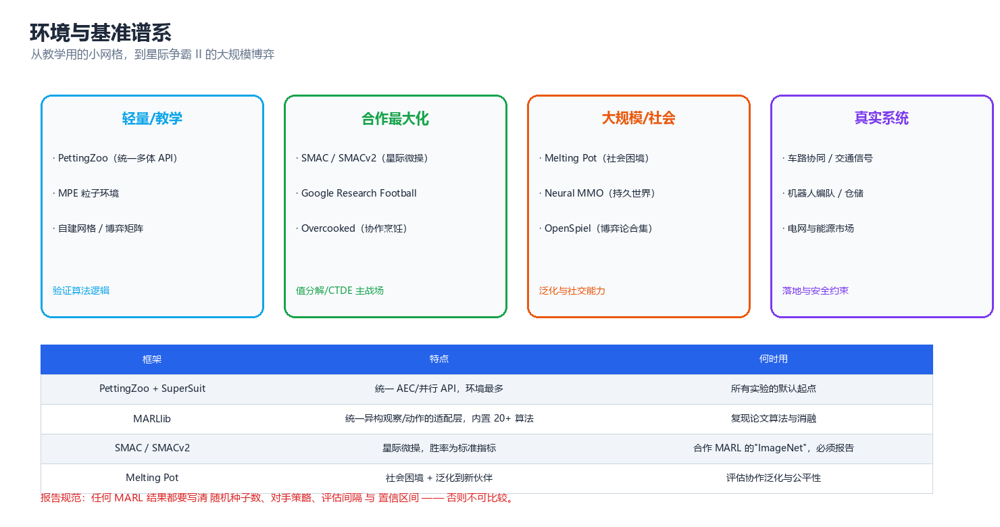
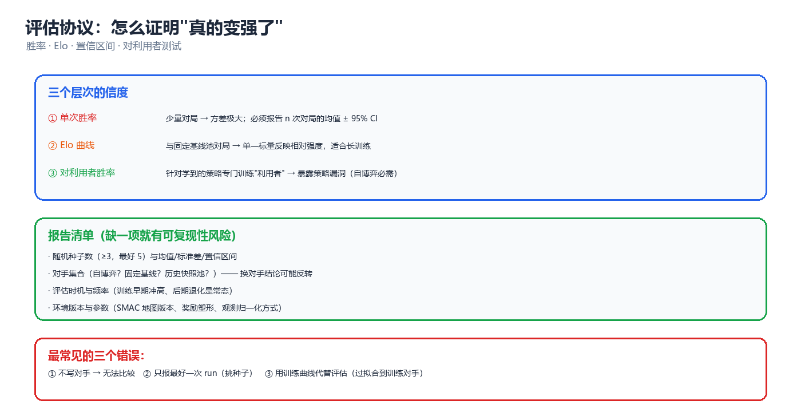

# 第 09 章 工具与环境

> 算法写得再漂亮，如果环境有 bug、评估口径不统一、随机种子只跑了一次，结论就一文不值。本章只做两件事：**把多智能体环境与基准的全景讲清楚（选对战场）**，以及**给出一套可复现的评估协议（让结论站得住）**。业界流传一句话：多智能体论文里最不可信的部分往往不是算法，而是实验。

---

## 一、环境 API 的两种范式

多智能体环境与单智能体环境最大的 API 差异是：**谁来推进时间**。单智能体里只有一个主体，`step(action)` 语义明确；多智能体里，是"所有主体同时行动"还是"轮流行动"，直接决定算法结构。

### 1.1 AEC 与 Parallel：两种生命周期

| 维度 | AEC（Agent Environment Cycle） | Parallel（同时行动） |
|------|-------------------------------|---------------------|
| 谁在动 | 任意时刻**只有一个** agent 可行动 | **所有** agent 同时提交动作 |
| 推进方式 | `step()` 后 `agent_selection` 轮转 | 一次 `step(actions_dict)` 推进全局一步 |
| 观测语义 | 每次只返回当前 agent 的观测 | 返回所有 agent 的观测字典 |
| 天然适配 | 回合制/顺序博弈、扩展型博弈、棋类 | Markov Game、Dec-POMDP、同时行动 |
| 典型算法 | 极小极大、CFR、MCTS | QMIX、MAPPO、MADDPG |
| 转换关系 | Parallel 可展开成 AEC（把一次同时 step 拆成 n 次） | AEC 不一定能压缩成 Parallel（信息结构会丢失） |

> **核心思想**：AEC 是更"底层"的抽象（任何多智能体系统都能用 AEC 表达），Parallel 是更"高效"的抽象（向量化友好）。**做研究用 AEC 看清信息结构，做训练用 Parallel 换吞吐**。

AEC 里两个容易踩坑的语义约定：

1. `self.agents` 被清空（变成 `[]`）才代表 episode 结束 —— 每次 `step()` 后所有 agent 都要被访问一遍，环境才推进下一轮。
2. "死掉的" agent 不能从列表里删掉，而是要用 `infos[a]["dead"]` 之类的标记并继续让它们 `step(None)`；否则轮转逻辑会错位。

### 1.2 PettingZoo API 逐项说明

PettingZoo 是当前多智能体环境的**统一接口事实标准**（对标单智能体的 Gymnasium）。AEC 风格的核心接口：

| 成员 | 含义 | 注意点 |
|------|------|--------|
| `possible_agents` | 智能体 ID 列表（全集） | episode 之间不变，是所有循环的基准 |
| `agents` | 当前存活的智能体 | 动态变化；空列表 = 结束信号 |
| `agent_selection` | 当前该行动者的 ID | AEC 独有；Parallel 无此概念 |
| `observation_space(agent)` | 某 agent 的观测空间 | 异构环境里**每个 agent 可以不同** |
| `action_space(agent)` | 某 agent 的动作空间 | 同上，异构动作空间是常见设定 |
| `reset(seed=…)` | 重置并返回初始观测 | **seed 必须显式传**，否则可复现性无从谈起 |
| `observe(agent)` | 取某 agent 当前观测 | 与 `step` 返回的观测必须一致 |
| `last(agent)` | 取该 agent 上次的 (obs, reward, term, trunc, info) | AEC 里所有 agent 各自保存一份 |
| `step(action)` | 推进一个 agent 的时间 | 传 `None` 表示该 agent 已终止但未被移除 |
| `rewards` | 所有 agent 的当前奖励字典 | 多智能体是**向量奖励**，不是标量 |
| `terminations` / `truncations` | 各自独立的终止/截断标记 | 与 Gymnasium 0.26+ 对齐，别再用老的 `dones` |
| `infos` | 附加信息字典 | 放"谁先死""非法动作""通信收包" |

Parallel 风格则统一成：`obs, rewards, terminations, truncations, infos = env.step(actions)`，其中每一项都是**以 agent 为键的字典**。

> ⚠️ 最常见的接口误用：在 AEC 里按"全体 agent 同时 step"的直觉写训练循环。后果是环境推进速度比你以为的快 n 倍、奖励错位、训练曲线看起来"能跑"但学不到东西。写循环前先打印一次 `agent_selection` 的轮转序列确认。

### 1.3 自己实现一个遵循同样接口的最小双智能体环境

理解了接口，自己写一个教学环境是最快的学习方式。下面这个环境只用标准库，语义与 AEC 完全一致：两个智能体轮流给共享计数器加值，**恰好**到达目标才给团队奖励（超出即失败）—— 这是一个典型的需要协调、且有"过犹不及"惩罚的合作任务。

```python
# 遵循 PettingZoo AEC 风格的最小双智能体环境：轮流把共享计数器推到目标值
class TinyAECEnv:
    """AEC = Agent Environment Cycle：任意时刻只有一个 agent 可行动"""
    def __init__(self, target=5, max_cycles=8):
        self.target, self.max_cycles = target, max_cycles
        self.possible_agents = ["agent_0", "agent_1"]

    def reset(self):
        self.agents = list(self.possible_agents)
        self.counter, self.turn = 0, 0
        self.agent_selection = self.agents[0]
        self.rewards = {a: 0.0 for a in self.agents}

    def observe(self, agent):
        # 局部观测：计数器 + 是否轮到我（无全局状态）
        return (min(self.counter, self.target), agent == self.agent_selection)

    def step(self, action):          # action: 0=不动, 1=+1, 2=+2
        a = self.agent_selection
        self.counter += action
        self.turn += 1
        # 团队奖励：只有恰好到达目标才给 1（合作博弈，超出反而不得分）
        reward = 1.0 if self.counter == self.target else 0.0
        self.rewards = {x: reward for x in self.agents}
        self.agent_selection = self.agents[(self.agents.index(a) + 1) % len(self.agents)]
        if self.turn >= self.max_cycles or reward > 0:
            self.agents = []          # 空列表表示 episode 结束（AEC 约定）
        return reward


env = TinyAECEnv(target=5, max_cycles=8)
env.reset()
policy = [1, 2, 2, 0, 1, 0]           # 手写的固定策略（agent_0 走奇数步）
step = 0
while env.agents:
    a = env.agent_selection
    act = policy[step % len(policy)]
    r = env.step(act)
    print(f"t={env.turn}  {a} 动作={act}  计数器={env.counter}  团队奖励={r:.1f}")
    step += 1
print(f"episode 结束：计数器={env.counter}，目标={env.target}，总步数={step}")
# 预期输出:
# t=1  agent_0 动作=1  计数器=1  团队奖励=0.0
# t=2  agent_1 动作=2  计数器=3  团队奖励=0.0
# t=3  agent_0 动作=2  计数器=5  团队奖励=1.0
# episode 结束：计数器=5，目标=5，总步数=3
```

这个环境虽小，却具备多智能体环境的全部关键要素：**局部观测、团队奖励、协调需求、终止条件**。第 05 章的所有算法都能在它上面跑通 —— 教学环境的价值就在于"能一眼看出算法是对是错"。

**设计要点**（照着做能省很多调试时间）：

| 要素 | 反例（会毁掉实验） | 正确做法 |
|------|------------------|---------|
| 奖励尺度 | 团队奖励 1.0，个体辅助奖励 0.01，量级差 100 倍 | 所有奖励项归一到同量级，并记录权重 |
| 终止条件 | 只靠 `max_cycles` 截断 | 显式定义成功/失败终止 + 截断，分开处理 bootstrap |
| 随机性 | 用全局 `random`，不可复现 | 每个环境实例持有独立 `np.random.Generator(seed)` |
| 观测 | 直接把全局状态塞给所有 agent | 只给该 agent 该看到的（否则"分布式执行"是假的） |
| 惩罚 | 用负奖励惩罚非法动作 | 用动作掩码（action mask），把违规动作从分布里去掉 |

### 1.4 Parallel 版：同一个任务的同时行动写法

把 §1.3 的任务改写成 Parallel 风格，能直观看出两种 API 的差异：**没有 `agent_selection`，一次 `step` 推进一步；观测与奖励都返回字典；`done` 是全局单值**。

```python
import numpy as np
# Parallel 风格：所有 agent 同时行动，一次 step 推进全局一步
class TinyParallelEnv:
    def __init__(self, target=5, max_cycles=6, n_agents=2):
        self.target, self.max_cycles, self.n_agents = target, max_cycles, n_agents
        self.rng = np.random.default_rng(0)
    def reset(self):
        self.counter, self.t = 0, 0
        return {f"a{i}": np.array([0.0, 0.0]) for i in range(self.n_agents)}
    def global_state(self):
        return np.array([self.counter / self.target, self.t / self.max_cycles])
    def step(self, actions):                      # actions: dict{agent_id: int}
        self.counter += int(sum(actions.values()))
        self.t += 1
        if self.counter == self.target:
            r = 1.0
        elif self.counter > self.target:
            r = -0.5                              # 超出目标：罚（"过犹不及"）
        else:
            r = 0.0
        done = (self.counter >= self.target) or (self.t >= self.max_cycles)
        obs = {f"a{i}": np.array([min(self.counter, self.target) / self.target,
                                  actions[f"a{i}"] / 2.0]) for i in range(self.n_agents)}
        return obs, {f"a{i}": r for i in range(self.n_agents)}, done

env = TinyParallelEnv()
obs = env.reset()
print("初始 obs:", {k: np.round(v, 2).tolist() for k, v in obs.items()},
      "全局状态:", env.global_state())
obs, r, done = env.step({"a0": 1, "a1": 2})
print(f"t=1 双方同时动作 a0=1,a1=2 → 计数器=3 团队奖励={r['a0']} 结束={done}")
obs, r, done = env.step({"a0": 1, "a1": 1})
print(f"t=2 双方同时动作 a0=1,a1=1 → 计数器=5 团队奖励={r['a0']} 结束={done}")
obs, r, done = env.step({"a0": 2, "a1": 2})
print(f"（若继续）计数超出 → 团队奖励={r['a0']}（负惩罚，环境已终止故仅演示语义）")
# 预期输出:
# 初始 obs: {'a0': [0.0, 0.0], 'a1': [0.0, 0.0]} 全局状态: [0. 0.]
# t=1 双方同时动作 a0=1,a1=2 → 计数器=3 团队奖励=0.0 结束=False
# t=2 双方同时动作 a0=1,a1=1 → 计数器=5 团队奖励=1.0 结束=True
# （若继续）计数超出 → 团队奖励=-0.5（负惩罚，环境已终止故仅演示语义）
```

两个 API 的对照要点：

| 观察点 | AEC 版（§1.3） | Parallel 版（本节） |
|--------|---------------|--------------------|
| 一步推进 | 一个 agent 的动作 | 全体动作的聚合 |
| 观测返回 | `observe(agent)` 单个 | `obs` 字典 |
| 结束信号 | `agents == []` | `done` 布尔 |
| 与算法匹配 | 值分解类需要在 AEC 上手工拼联合动作 | 天然对应 Markov Game 的联合动作 |
| 现成实现 | PettingZoo `*_v*` 多数为 AEC | 少数环境原生 Parallel，其余用 SuperSuit 转换 |

### 1.5 SuperSuit、向量化与并行采样

- **SuperSuit**：给 PettingZoo/ Gymnasium 做包装的工具箱 —— 观测/奖励变换、帧堆叠、动作掩码、把 AEC 转成 Parallel。多智能体里最有用的三件：`PadObservations`（异构观测补齐）、`MultiAgentPreprocessFrame`、`ConcatObservations`。
- **向量化**：`n_envs` 个环境并行采样。多智能体下采样成本比单智能体高一个量级（要保存联合观测、联合动作、每个 agent 的掩码），所以实践中常用 **1/4 数量的环境 × 1/2 的 rollout 长度** 做等效替代。
- **共享 vs 独立环境实例**：所有 worker 共享同一套环境参数（同一张 SMAC 地图）时，跨环境的多样性来自敌方策略与随机种子；若课程学习需要不同难度，则按 worker 分配难度档。

---

## 二、环境与基准谱系



*图：从教学用的小网格，到星际争霸 II 的大规模博弈 —— 四个层级的战场。*

### 2.1 轻量 / 教学

| 环境 | 特点 | 适合验证什么 |
|------|------|-------------|
| MPE（Multi-Agent Particle Env） | 连续动作、粒子物理、极轻量 | MADDPG/MAPPO 的入门实现 |
| 自建网格/博弈矩阵 | 完全可控、可解析求解 | 算法正确性（能和解析均衡对照） |
| Keepaway / Predator-Prey | 经典多智能体测试床 | 收敛性、非平稳性现象 |

教学环境的核心价值是**可解释**：你能手算最优策略，就能判断算法输出对不对。**永远先用教学环境验证实现，再上大基准** —— 90% 的"算法不 work"其实是在大环境里调实现的 bug。

### 2.2 合作最大化

| 基准 | 观测/动作 | 标准指标 | 备注 |
|------|----------|---------|------|
| SMAC / SMACv2 | 局部观测、离散动作、部分可观测 | 胜率（win rate） | 合作 MARL 的"ImageNet"，几乎必报 |
| Google Research Football | 高维观测、离散动作 | 进球率/胜率 | 22 个异质主体，动作空间大 |
| Overcooked（协作烹饪） | 网格观测、离散动作 | 汤数/协作效率 | 研究显式协调与人机协作的经典床 |

SMAC 的两个版本差异必须说清：**SMAC v1 的地图是固定的，容易被过拟合**；**SMACv2 加入了随机化的单位类型与初始位置**，泛化难度显著上升。报告结果时务必写明用的是哪个版本、哪些地图。

### 2.3 大规模 / 社会

| 基准 | 规模 | 关注点 |
|------|------|-------|
| Melting Pot | 数十至上百主体 | 社会困境、协作泛化到新伙伴 |
| Neural MMO | 持久世界、上千 agent | 长时程、开放世界、生态 |
| OpenSpiel | 游戏博弈合集（棋牌博弈） | 两人零和/多人一般和的理论型基准 |

Melting Pot 的评估范式值得学习：它区分**"与训练伙伴协作"与"与陌生伙伴协作"两组指标**，后者才是真正衡量泛化的部分（对应第 05 章的种群训练与第 10 章的 zero-shot coordination）。

### 2.4 真实系统

真实系统类环境通常不开源或需要自建（交通仿真 SUMO、机器人编队 Gazebo/Isaac、电网仿真 pandapower + 自建市场层）。它们的共同特点是：**安全约束硬、实时性要求高、状态不可重置**，因此往往需要"仿真训练 + 安全层兜底"的组合。

### 2.5 选题速查表

| 你的目标 | 建议基准 | 为什么 |
|---------|---------|-------|
| 验证算法实现正确性 | 自建教学环境 + MPE | 可解析对照，bug 暴露快 |
| 报告合作 MARL 的强度 | SMACv2（至少 3 个地图 × 3 种子） | 社区认可度高，可横向比较 |
| 研究通信机制 | MPE（需通信的场景）+ SMAC | 有/无通信消融对比清晰 |
| 研究泛化到新伙伴 | Melting Pot / Overcooked | 内置"陌生伙伴"评估协议 |
| 研究人类-AI 协作 | Overcooked、Hanabi | 已有大量人类基线数据 |
| 研究机制设计/激励 | OpenSpiel | 经典博弈有解析均衡可对照 |

> **核心思想**：基准不是越难越好，而是**能否精确回答你的科学问题**。用 SMAC 证明"通信有效"远比用 Melting Pot 便宜；用教学环境证明"信用分配正确"远比用 SMAC 便宜。选基准则是一条成本-信度曲线。

---

## 三、训练框架

### 3.1 MARLlib：统一适配层

MARLlib 解决的是多智能体最琐碎的工程问题：**不同环境的观测/动作空间异构**（有的给全局状态、有的只给局部；有的用 `Discrete`、有的用 `Box`、有的是 `MultiDiscrete`）。它把这些统一成算法可以直接吃的格式，从而让同一份算法实现能跑十几个不同环境。

架构上分三层：

```
┌─────────────────────────────────────────────┐
│  算法层（policy / learner）                 │  输入：标准化的 (obs, state, mask)
├─────────────────────────────────────────────┤
│  适配层（space adapter / wrapper）          │  异构观测补齐、动作掩码、奖励归一
├─────────────────────────────────────────────┤
│  环境层（SMAC / MPE / GRF / …）             │  原始多智能体环境
└─────────────────────────────────────────────┘
```

它的价值不只是省代码，更是**让迁移测试变得可行**：同一算法在 12 个环境上的表现，比在 1 个环境上调出最高分可信得多。

### 3.2 RLlib 多智能体 API

RLlib 用 `multiagent` 配置字典描述"哪些 agent 用哪个策略"（下面这段是**配置结构示例**，需要 `pip install "ray[rllib]"` 才能运行）：

```python
from ray.rllib.algorithms.ppo import PPOConfig

config = (
    PPOConfig()
    .environment("smac_v2", env_config={"map_name": "10gen_terran"})
    .multi_agent(
        policies={"shared_policy"},                  # 一个策略供所有 agent 使用
        policy_mapping_fn=lambda agent_id, *a, **k: "shared_policy",
    )
    .training(train_batch_size=4000, sgd_minibatch_size=512, num_sgd_iter=10)
    .framework("torch")
)
```

三组配置决定一切：

1. `policies` + `policy_mapping_fn` —— 决定**参数共享的粒度**（完全共享 / 按角色共享 / 不共享，见第 05 章 8.1）。
2. `env_config` —— 决定战场（地图、难度、随机化）。
3. `train_batch_size` / `rollout_fragment_length` —— 决定**联合样本**的采样与拆分方式（多智能体里这是最容易搞错的地方）。

> ⚠️ RLlib 的多智能体采样有一个隐蔽陷阱：`rollout_fragment_length` 定义的是**每个 agent 各自的步数**，不是环境的步数。设错会让 batch 大小随 agent 数偏移，训练曲线表现为"学习率好像变了"。

### 3.3 自建教学环境的设计规范

要写一个"能用来做科研"的自建环境，至少要满足六条：

1. **可解析基准**：至少有一个基线策略（随机/贪心/最优）能让别人复现你的分数区间。
2. **确定的终止**：成功/失败/超时三种终止都要有，且语义清晰（超时不算失败，要做 bootstrap）。
3. **种子控制**：`seed` 能决定环境一切随机性（初始状态、对手策略、奖励噪声）。
4. **状态可观测性开关**：能一键切换"全局状态可见/不可见"，用来做 CTDE 消融。
5. **动作合法性**：用掩码而非负奖励表达非法动作。
6. **回放能力**：能保存/回放一整条 episode（诊断算法行为必备）。

### 3.4 Actor-Learner 并行采样架构

多智能体训练的计算瓶颈在采样（环境步进 + 对手策略前向），所以主流架构是 actor-learner 分离：

```
┌──────────┐  ┌──────────┐  ┌──────────┐
│ Actor 0  │  │ Actor 1  │  │ Actor k  │   各自持有环境实例 + 对手策略池
└────┬─────┘  └────┬─────┘  └────┬─────┘
     │  联合样本 (obs_i, a_i, r_i, mask, ...)
     └──────────────┼──────────────┘
                    ▼
            ┌───────────────┐
            │ Replay/Buffer │   多智能体的经验回放要存"联合"记录
            └───────┬───────┘
                    ▼
            ┌───────────────┐
            │    Learner    │   集中式 Critic 在这里用全局状态
            └───────────────┘
```

多智能体与单智能体在架构上的三个差别：

| 差别 | 说明 |
|------|------|
| 样本必须"成组" | 一条经验包含 n 个 agent 的观测/动作，采样和混洗不能拆散同一时刻的组 |
| 对手也在变 | Actor 采样的数据来自旧策略的对手 → 数据新鲜度要求更高（buffer 不能太大） |
| Critic 需要全局状态 | Learner 要么拿全局状态，要么在 Actor 侧算好传回来 —— 网络带宽常常是真实瓶颈 |

---

## 四、实现一个完整的 MAPPO

MAPPO 是当前合作型 MARL 最强的通用基线之一（第 05 章 5.3 已给出理论），这里给出**可落地的实现要点**。

### 4.1 网络结构

```
        ┌───────── 执行期（每个 agent 独立） ─────────┐
        │  o_i ──► Actor π_i(a|o_i) ──► a_i          │
        └────────────────────────────────────────────┘
        ┌───────── 训练期（集中式，可看全局） ────────┐
        │  s, a_1..a_n ──► Critic V(s) 或 Q(s, a)    │
        └────────────────────────────────────────────┘
```

三个参数共享决策：

| 共享方式 | 结构 | 适用 |
|---------|------|------|
| 完全共享 | 所有 agent 共用一套 Actor/Critic 参数 | 同构智能体（SMAC 同族单位） |
| 按角色共享 | 按单位类型分组共享 | 异构智能体（不同射程/血量单位） |
| 不共享 | 每个 agent 独立网络 | 智能体数少且异质性强（通常性能收益不值参数量） |

实现细节（这些细节在论文里往往一笔带过，但决定成败）：

- **Actor 输入裁剪**：只喂该 agent 的观测，绝不喂全局状态（否则分布式执行就是假的）。
- **Critic 输入**：全局状态 + 所有 agent 的动作（或动作 one-hot）。
- **输入归一化**：观测用 running mean/std 归一化，作用巨大。
- **死亡掩码**：agent 死亡后其动作从 Critic 输入里屏蔽，否则 Critic 会学到"死者导致的偏差"。
- **动作掩码**：非法动作 logit 置 −1e9 后再 softmax，绝不用负奖励。

### 4.2 GAE 的多智能体改造

多智能体下 GAE 的形式不变，但**奖励与价值函数都变成团队共享的**：$r_t$ 是团队奖励（或团队奖励的某个分解结果），$V$ 是集中式 Critic 对全局状态的估计。

$$
\delta_t = r_t + \gamma V(s_{t+1}) - V(s_t), \qquad
\hat{A}_t = \sum_{l=0}^{T-t-1} (\gamma\lambda)^l\, \delta_{t+l}
$$

```python
import numpy as np
# GAE（广义优势估计）在多智能体下的计算：Critic 用全局状态 V(s)
r  = np.array([0.0, 1.0, 0.0, 2.0])        # 团队奖励序列
V  = np.array([0.2, 0.5, 0.4, 0.9, 1.0])   # V(s_0)..V(s_4)，最后一个是 bootstrap
gamma, lam = 0.99, 0.95
delta = r + gamma * V[1:] - V[:-1]         # TD 残差
adv = np.zeros_like(r); acc = 0.0
for t in reversed(range(len(r))):          # 从后往前累加
    acc = delta[t] + gamma * lam * acc
    adv[t] = acc
print("TD 残差 δ_t :", np.round(delta, 4))
print("GAE 优势 Â_t :", np.round(adv, 4))
print("回报目标 Â+V :", np.round(adv + V[:-1], 4))
print("优势标准化前均值/标准差: %.4f / %.4f" % (adv.mean(), adv.std()))
# 预期输出:
# TD 残差 δ_t : [0.295 0.896 0.491 2.09 ]
# GAE 优势 Â_t : [3.3107 3.2065 2.4566 2.09  ]
# 回报目标 Â+V : [3.5107 3.7065 2.8566 2.99  ]
# 优势标准化前均值/标准差: 2.7660 / 0.5107
```

注意最后一步：优势进入 PPO 的 clip 目标之前**必须标准化**（减均值、除标准差），否则多智能体里团队奖励的量级波动会让 clip 范围完全失效。

### 4.3 训练循环

```
for iteration in range(N):
    # 1. 采样：并行 n_envs 个环境，每个跑 T 步
    for env in parallel_envs:
        for t in range(T):
            o = env.observe_all()                  # 每个 agent 的局部观测
            s = env.global_state()                 # 集中式 Critic 用
            a = [policy_i(o[i]) for i in agents]   # 各自独立决策
            r, term, trunc, info = env.step(a)     # 团队奖励向量
            buffer.add(o, s, a, r, mask, term, trunc)
    # 2. 计算 GAE（用集中式 Critic 的 V(s)）
    adv, ret = compute_gae(buffer, critic, gamma, lam)
    # 3. PPO 更新（Actor 只用自己的观测，Critic 用全局状态）
    for epoch in range(K_epochs):
        for minibatch in shuffle(buffer):
            loss = -min(ratio*adv, clip(ratio, 1±eps)*adv) + vf_coef*MSE(V, ret) - ent_coef*H(π)
            loss.backward(); optimizer.step()
    # 4. 评估（固定对手、固定种子、n 轮取均值）
```

三个多智能体特有的操作：

1. **minibatch 必须整组切分**：一个时刻的 n 个 agent 样本必须落在同一个 minibatch 里，否则 Critic 看到的是"半截的联合状态"。
2. **评估对手固定**：训练用自博弈，评估必须用固定基线对手（否则曲线无法解释，见 §五）。
3. **信息流不对称检查**：上线前用"把全局状态替换成噪声"做一次消融 —— 如果性能不掉，说明 Critic 根本没用到全局信息（或者 Actor 偷看了）。

### 4.4 端到端训练实录：一个失败案例与一个成功案例

§6.1 会给出调试顺序，其中最关键的一步是：**先在可解的小环境里让算法过拟合到满分**。这一节用两个实跑实例把这件事演示清楚 —— 一个学得像样的、一个学不动的，二者用的是**同一套训练循环**。

**案例一：需要精确协调的联合目标（学不动）**

任务：2 个智能体同时行动，把共享计数器**恰好**推到 5；超出受罚。Actor 只看局部观测（计数器 + 时间 + 自己上一步动作），Critic 看全局状态 —— 标准的 CTDE 结构。

```python
import numpy as np
TARGET, MAX_T, N, N_ACT = 5, 6, 2, 3

def obs_i(s, t, last_i):
    return np.array([1.0, min(s, TARGET) / TARGET, t / MAX_T, last_i / 2.0])

def softmax(z):
    z = z - z.max(); e = np.exp(z); return e / e.sum()

def train(over_penalty=0.5, shaping=0.0, episodes=3000, seed=42):
    rng = np.random.default_rng(seed)
    W_pi = np.zeros((N_ACT, 4)); W_v = np.zeros(3)      # 共享 Actor / 集中式 Critic
    hist = []
    for ep in range(episodes):
        s, last, trace = 0, [0] * N, []
        for t in range(MAX_T):
            acts, xs, ps = [], [], []
            for i in range(N):
                x = obs_i(s, t, last[i]); p = softmax(W_pi @ x)
                a = int(rng.choice(N_ACT, p=p))
                acts.append(a); xs.append(x); ps.append(p)
            s_prev = s
            s += sum(acts); last = acts
            r = 1.0 if s == TARGET else (-over_penalty if s > TARGET else 0.0)
            if shaping:                                  # 势能式塑形
                r += shaping * (min(s, TARGET) - min(s_prev, TARGET))
            for i in range(N):
                trace.append((xs[i], acts[i], ps[i],
                              np.array([1.0, min(s, TARGET) / TARGET, t / MAX_T]), r))
            if s >= TARGET:
                break
        G, rets = 0.0, []                                # 团队回报（gamma=1）
        for (_, _, _, _, r) in reversed(trace):
            G = r + G; rets.append(G)
        rets.reverse()
        adv = np.array([G - W_v @ g for G, (_, _, _, g, _) in zip(rets, trace)])
        if adv.std() > 1e-8:
            adv = (adv - adv.mean()) / (adv.std() + 1e-8)   # 优势标准化
        for (x, a, p, g, _), A in zip(trace, adv):
            oh = np.zeros(N_ACT); oh[a] = 1.0
            W_pi += 0.05 * A * np.outer(oh - p, x)           # softmax 策略梯度
            W_v  += 0.20 * A * g                             # 集中式基线
        hist.append(s)
    return hist

for name, kw in [("A 朴素（超额罚 -0.5）", dict(over_penalty=0.5)),
                 ("B 小罚（-0.1）", dict(over_penalty=0.1)),
                 ("C 小罚 + 势能塑形 0.05", dict(over_penalty=0.1, shaping=0.05))]:
    hist = train(**kw); seg = hist[-500:]
    succ = np.mean([1.0 if h == TARGET else 0.0 for h in seg])
    over = np.mean([1.0 if h > TARGET else 0.0 for h in seg])
    print(f"{name}: 末 500 局 平均计数={np.mean(seg):.3f} 恰好命中={succ:.2%} 超额={over:.2%}")
# 预期输出:
# A 朴素（超额罚 -0.5）: 末 500 局 平均计数=0.430 恰好命中=0.40% 超额=4.00%
# B 小罚（-0.1）: 末 500 局 平均计数=5.740 恰好命中=18.40% 超额=66.40%
# C 小罚 + 势能塑形 0.05: 末 500 局 平均计数=7.886 恰好命中=0.00% 超额=100.00%
```

单看配置 A 的训练过程，就能看到一个典型病态：

| episode 区间 | 平均计数 | 恰好命中 | 超额（受罚） |
|-------------|---------|---------|-------------|
| 1–500 | 6.578 | 19.40% | 80.40% |
| 501–1000 | 3.428 | 8.40% | 39.60% |
| 1501–2000 | 0.906 | 3.40% | 6.00% |
| 2501–3000 | **0.430** | **0.40%** | 4.00% |

策略最终学会了**"不动"**：不动 = 奖励 0，而尝试加值有 50% 概率越界吃 -0.5。这是**风险规避塌缩（inaction collapse）**：在稀疏正奖励 + 密集负惩罚下，最省事的局部最优就是躺平。这正好对应 §6.2 表里的"学出集体摸鱼"，也说明**奖励设计本身就是算法的一部分**。

三个配置的对照给出两个结论：

1. **负惩罚越重，越容易塌缩**（A 完全塌缩，B 还能动起来）。
2. **塑形不总是帮忙**（C 的势能塑形把策略推向"猛加"，超额率 100%）—— 塑形方向与"精确命中"的真实目标不对齐时，它会把策略带到另一个极端。势能式塑形只在**保证策略不变性**（potential-based）的严格形式下才安全，而"靠近目标"这个势能对"恰好命中"任务并不等价。

**案例二：极简协调任务（学到 99.6%）**

换成任务本身可解、且奖励信号与目标一致的协调博弈：两个智能体各在 3 个目标中选一个，选同一个即成功。

```python
import numpy as np
# 案例二：极简协调任务 —— 两个智能体必须"选同一个目标"（3 选 1）
rng = np.random.default_rng(7)
N_ACT = 3
W_pi = np.zeros((N_ACT, 1))     # 无观测（只有常数偏置），纯策略学习
W_v  = np.zeros(1)
hist = []
for ep in range(3000):
    z = W_pi @ np.ones(1)                          # 策略 logits（特征只有常数项）
    z = z - z.max(); p = np.exp(z) / np.exp(z).sum()
    acts = rng.choice(N_ACT, size=2, p=p)
    r = 1.0 if acts[0] == acts[1] else 0.0
    A = r - float(W_v @ np.ones(1))                # 优势 = 回报 − 基线
    for a in acts:
        oh = np.zeros(N_ACT); oh[a] = 1.0
        W_pi += 0.08 * A * np.outer(oh - p, np.ones(1))
    W_v += 0.20 * A * np.ones(1)
    hist.append(r)
for start in (0, 500, 1500, 2500):
    print(f"episode {start+1:4d}-{start+500:4d}: 成功率={np.mean(hist[start:start+500]):.2%}")
zz = W_pi[:, 0] - W_pi[:, 0].max()
print("最终策略分布 p(动作1/2/3) =", np.round(np.exp(zz) / np.exp(zz).sum(), 4))
print("理论最优：任一纯策略（两者同选）→ 成功率 100%；均匀随机基线 = 33.3%")
# 预期输出:
# episode    1-  500: 成功率=82.80%
# episode  501- 1000: 成功率=98.60%
# episode 1501- 2000: 成功率=99.40%
# episode 2501- 3000: 成功率=99.60%
# 最终策略分布 p(动作1/2/3) = [9.987e-01 6.000e-04 7.000e-04]
# 理论最优：任一纯策略（两者同选）→ 成功率 100%；均匀随机基线 = 33.3%
```

> **核心思想**：两个案例用的是同一套训练循环（共享 Actor + 集中式 Critic + 优势标准化 + 策略梯度）。案例二能收敛到 99.6%，证明**实现没有 bug**；因此案例一的失败必须归因到任务与奖励设计（稀疏正奖励 + 密集负惩罚 + 精确协调要求）。**"先在小环境验证循环、再排查任务本身"** 是多智能体调试里省时间最多的一个习惯 —— 反过来做，你会在环境里找一周的 bug，而问题其实在奖励函数。

### 4.5 常见实现错误清单

| 症状 | 病因 | 修复 |
|------|------|------|
| 训练完全不学 | Actor 拿到了全局状态（分布式执行泄漏） | Actor 输入只留 obs_i |
| 曲线剧烈震荡 | 优势未标准化 / clip 范围过大 | 标准化优势，eps 取 0.2 起 |
| 前期很好后期崩 | 对手自博弈导致环境漂移，评估对手也在变 | 固定评估对手池 |
| 学出"摸鱼"行为 | 团队奖励均匀分摊，个体贡献无法区分（信用分配） | 引入差分奖励或反事实基线（见第 05 章 2.2） |
| 死亡后性能骤降 | Critic 输入含死亡 agent 的无效动作 | 加死亡掩码 |
| 换地图全崩 | 观测未归一化 / 过拟合地图尺寸 | running mean/std + 随机化地图 |
| 多卡训练结果不稳定 | buffer 混洗打散了联合样本 | 按时刻整组切分 |

---

## 五、评估协议



*图：胜率、Elo、置信区间 —— 三个层次的信度，缺一项结论就不可比。*

### 5.1 指标体系

| 指标 | 定义 | 优点 | 缺点 |
|------|------|------|------|
| 平均回报 | 团队奖励的 episode 均值 | 连续、信息量大 | 不同奖励塑形不可比 |
| 胜率 | 获胜 episode 占比 | 直观、跨任务可比 | 信息量粗（丢掉过程） |
| Elo | 相对强度标量 | 单一标量、适合长训练 | 依赖对手池，不可跨池比较 |
| Nash 距离 / 可利用度 | 与均衡策略的距离、被利用的损失 | 零和/博弈任务的严格指标 | 需要求解均衡，多数场景算不动 |
| 协作指标 | 冲突次数、覆盖效率、任务完成时间 | 贴近真实系统 | 需要自定义 |

> ⚠️ 报告胜率时**必须同时给出对局数与区间**。`60/100` 与 `6/10` 都是 0.6，但前者的 95% 置信区间是 [0.502, 0.691]，后者是 [0.313, 0.832] —— 后者几乎无法断言"优于 0.5"。

### 5.2 置信区间与显著性检验

```python
import math
# Wilson 区间：小样本下比"正态近似"更可靠（不会越出 [0,1]）
def wilson(w, n, z=1.96):
    p = w / n
    denom = 1 + z * z / n
    center = (p + z * z / (2 * n)) / denom
    half = z * math.sqrt(p * (1 - p) / n + z * z / (4 * n * n)) / denom
    return center - half, center + half

for w, n in [(60, 100), (6, 10), (38, 50)]:
    lo, hi = wilson(w, n)
    print(f"{w:3d}/{n:3d} 胜率={w/n:.3f}  95% CI=[{lo:.3f}, {hi:.3f}]  半宽=±{(hi-lo)/2:.3f}")

# 样本量估算：想以 ±0.05 精度估计真实胜率（设 p≈0.6）
def n_needed(p, half, z=1.96):
    return math.ceil(z * z * p * (1 - p) / (half * half))
for half in (0.10, 0.05, 0.02):
    print(f"目标半宽 ±{half:.2f} → 需要对局数 n = {n_needed(0.6, half)}")
# 预期输出:
#  60/100 胜率=0.600  95% CI=[0.502, 0.691]  半宽=±0.094
#   6/ 10 胜率=0.600  95% CI=[0.313, 0.832]  半宽=±0.260
#  38/ 50 胜率=0.760  95% CI=[0.626, 0.857]  半宽=±0.116
# 目标半宽 ±0.10 → 需要对局数 n = 93
# 目标半宽 ±0.05 → 需要对局数 n = 369
# 目标半宽 ±0.02 → 需要对局数 n = 2305
```

结论很实用：**想用 100 局对局把胜率精度控制在 ±5% 以内是不可能的**（需要约 369 局）。这就是为什么严肃的 MARL 论文要么报几千局，要么报多个种子 × 每种子几百局的均值。

### 5.3 对手设置

对手设置直接决定结论的含义，四种常见设置必须显式声明：

| 对手 | 含义 | 结论适用范围 |
|------|------|-------------|
| 内置 AI（脚本/规则） | 固定参照 | 与固定策略的可比性 |
| 训练时快照池 | 训练过程的中间版本 | 自己是否真的进步了 |
| 其他算法训练出的策略 | 跨方法比较 | 算法之间的相对强度 |
| 交叉评估（cross-play） | 你的策略 vs 别人的策略 | 泛化与鲁棒性（最有说服力） |

**交叉评估是多智能体特有的、最重要的可信度来源**：把你的策略和别的方法学出的策略配对打，双方都没见过对方。只在自己训练的对手上刷分，是 MARL 最常见的自欺方式。

### 5.4 利用者测试

自博弈训练的策略天然存在漏洞 —— 只是你现在的对手不去利用它。**利用者测试（exploiter test）**的做法是：固定你的策略，专门训练一个"只想打败你"的智能体，看它能拿到多少超额收益。

| 指标 | 含义 |
|------|------|
| 利用者胜率 | 越高说明策略漏洞越大 |
| 可利用损失（exploitability） | 利用者的收益 − 均衡收益 |
| 巅峰-收敛差 | 历史最佳版本 vs 当前版本的差距 |

AlphaStar 的训练框架里，联盟中就同时存在"主智能体、对手、利用者"三类角色（见第 05 章 6.4）。

### 5.5 复现清单

写报告（或审阅别人的报告）时逐项核对：

- [ ] 环境版本与地图名称 / 难度
- [ ] 随机种子数量（≥3，推荐 5）与是"环境种子"还是"网络初始化种子"
- [ ] 每条曲线的均值 ± 标准差（或 95% 置信带），不能只画一条线
- [ ] 评估对手集合与评估频率
- [ ] 观测/奖励归一化方式
- [ ] 动作是否用掩码、非法动作如何处理
- [ ] 超参表（学习率、clip、熵系数、GAE λ、rollout 长度、batch 大小、共享粒度）
- [ ] 训练总环境步数（而不是"迭代次数"）
- [ ] 硬件与运行时间（多智能体训练成本差异可达十倍）
- [ ] 代码/配置可获取（最少给出配置文件）

---

### 5.6 一个可直接复用的实验配置模板

多智能体实验最容易出的问题是"跑了三周才发现没记全参数"。下面这份 YAML 把**必须显式声明的东西**结构化了，直接改值即可用：

```yaml
# exp_config.yaml —— 多智能体实验配置模板
experiment:
  name: mappo_10gen_terran
  seed_list: [0, 1, 2, 3, 4]        # 至少 3，推荐 5；写死列表而不是单个 seed
  total_env_steps: 10_000_000       # 用环境步数计量，不用"迭代数"

env:
  name: smacv2
  map: 10gen_terran
  obs_normalize: true               # 归一化方式必须记录
  action_mask: true                 # 非法动作用掩码而非负奖励
  n_envs: 8
  rollout_len: 200                  # 每个 agent 的步数（不是环境步数）
  death_mask: true                  # Critic 屏蔽死亡 agent 的无效动作

algo:
  name: mappo
  sharing: role                     # none | full | role
  lr_actor: 5.0e-4
  lr_critic: 5.0e-4
  gamma: 0.99
  gae_lambda: 0.95
  clip_eps: 0.2
  entropy_coef: 0.01
  value_coef: 0.5
  epochs: 5
  minibatch_mode: joint_time_block  # 关键：按时刻整组切分，禁止跨时刻混洗
  hidden: [64, 64]

eval:
  opponents: [builtin_ai, snapshots_v0, qmix_baseline]   # 三类对手都要有
  every_env_steps: 200_000
  episodes: 500                     # 每轮评估局数（配合 Wilson 区间判断显著性）
  fixed_seeds: true                 # 评估固定种子，减少方差

logging:
  metrics: [team_return, ind_return, policy_entropy, td_residual,
            clip_fraction, grad_norm, eval_winrate, comm_bytes]
  artifacts: [config, git_commit, env_version, hardware]
```

这份模板里三行是最容易被忽略、又最能救命：`minibatch_mode`（跨时刻混洗是隐蔽 bug）、`opponents`（没有对手池就没有可解释的曲线）、`fixed_seeds`（评估方差直接吃掉改进量）。

---

## 六、调试与可观测性

### 6.1 诊断顺序

多智能体的调试必须**自下而上**，跳步会浪费大量时间：

```
① 环境自检  →  ② 奖励自检  →  ③ 算法自检  →  ④ 超参自检
   · 随机策略能跑完一个 episode 吗
   · 解析基线（随机/贪心）拿到多少分
   · 让环境可解（观测足够）时，算法能过拟合到 100% 吗
   · 把 n 个 agent 改成 1 个，性能是否退化成单智能体算法的正常水平
```

第 3 步最关键：**在可解的小环境里让算法过拟合到满分**。做不到就一定是实现 bug，而不是"算法不行"。

### 6.2 典型症状-病因-对策表

| 症状 | 病因 | 对策 |
|------|------|------|
| 奖励完全不涨 | Actor 偷看全局状态 / 奖励从未到达过 | 检查观测；把随机策略的奖励分布打出来 |
| 曲线先涨后崩 | 对手漂移 + 评估对手变了 | 固定评估对手池；监控可利用度 |
| 不同种子结果差异巨大 | 初始化敏感、探索不足 | 多跑种子取统计；调大熵系数 |
| 学出"集体摸鱼" | 团队奖励均分，个体无信号 | 差分奖励/反事实基线 |
| 学出"互相拆台" | 奖励设计里有负外部性却没惩罚 | 奖励审计：逐项列出对他人收益的影响 |
| 收敛到次优协作 | 联合动作探索不足 | 参数共享 + 课程学习（先易后难） |
| 训练快、评估崩 | 过拟合训练对手 | 交叉评估 + 利用者测试 |
| 显存/时间爆炸 | 联合观测缓存与 batch 设计错误 | 整组切分；减小 rollout 长度 |
| 换 n（智能体数）就崩 | 观测/动作未做尺度无关设计 | 归一化 + 相对位置观测 |
| 梯度爆炸 | Critic 值域失控 | 价值裁剪、奖励缩放 |

### 6.3 日志与可视化

必记的十项（缺一项后面都会回头重跑）：

1. 团队奖励曲线（训练 + 评估两条分开）
2. 每个智能体的个体奖励（看是否有人被牺牲）
3. 动作分布熵（探索是否塌缩）
4. Critic 的 TD 残差均值/方差（价值估计是否可靠）
5. 策略（Actor）损失的更新幅度 / clip 触发比例
6. 评估胜率（固定对手，固定种子）
7. 对手池组成与各对手胜率
8. 通信量（若涉及通信：字节数、消息熵）
9. 环境步数（不是迭代数）与每秒步数
10. 梯度范数

> **核心思想**：多智能体的"不可复现"绝大多数不是玄学，而是**没记录对手、没固定种子、没报样本量**三件事造成的。把 §5.5 的清单当成提交前的 checklist，能消除九成争议。

---

## 七、理论进阶：实验评估的统计基础

### 7.1 Wilson 区间与样本量估算

胜率 $\hat{p} = w/n$ 是对真实胜率 $p$ 的估计。若用正态近似，在小 $n$ 或 $\hat p$ 接近 0/1 时区间会越出 $[0,1]$，因此实践中用 **Wilson 区间**：

$$
\boxed{\ \text{CI} = \frac{\hat p + \frac{z^2}{2n} \pm z\sqrt{\frac{\hat p(1-\hat p)}{n} + \frac{z^2}{4n^2}}}{1 + \frac{z^2}{n}}\ }
$$

区间半宽近似为 $z\sqrt{\hat p(1-\hat p)/n}$，因此要达到目标半宽 $h$ 所需样本量：

$$
\boxed{n \approx \frac{z^2 p(1-p)}{h^2}}
$$

$p=0.6$、$h=0.05$、$z=1.96$ 时 $n \approx 369$。上文的实跑输出正是这组公式的数值验证。

### 7.2 假设检验与多重比较校正

比较多组算法时，常见错误是"两两 t 检验，看到 $p<0.05$ 就宣布胜利"。做 $m$ 次比较时，假阳性期望次数是 $m\alpha$ —— 比较 10 对算法（$\alpha=0.05$）就有约 40% 概率至少出现一次假阳性。

| 校正方法 | 阈值 | 特点 |
|---------|------|------|
| Bonferroni | $\alpha/m$ | 最保守，适合比较次数少 |
| Holm-Bonferroni | 逐步收紧 | 比 Bonferroni 稍宽松，推荐默认 |
| Benjamini-Hochberg（FDR） | 控制假发现率 | 比较次数多时更实用 |

另外两条实践建议：

1. **配对比较优于独立比较**：同一批种子下跑不同算法（配对），用 Wilcoxon 符号秩检验，功效远高于独立 t 检验。
2. **报告效应量而非仅 p 值**：胜率差 0.02 就算显著，工程上也没意义。同时给出区间与效应量（Cliff's delta 或胜率差）。

### 7.3 Elo 与 Bradley-Terry 模型

Elo 的本质是 **Bradley-Terry 模型**的在线近似：每个策略有强度参数 $\pi_i$，$i$ 战胜 $j$ 的概率为

$$
\boxed{P(i \succ j) = \frac{\pi_i}{\pi_i + \pi_j}}
$$

给定两两对局胜场矩阵 $W$（$W_{ij}$ 为 $i$ 战胜 $j$ 的次数），可用 MM 迭代拟合 $\pi$：

$$
\pi_i^{(k+1)} = \frac{\sum_j W_{ij}}{\sum_{j \neq i} \dfrac{W_{ij} + W_{ji}}{\pi_i^{(k)} + \pi_j^{(k)}}}
$$

```python
import numpy as np
# Bradley-Terry / Elo 强度拟合：只用两两对局胜场数
players = ["QMIX", "MAPPO", "IQL"]
W = np.array([[0, 14, 18],      # W[i][j] = i 战胜 j 的场次
              [ 6,  0, 12],
              [ 2,  8,  0]], dtype=float)
pi = np.ones(3)
for _ in range(500):                      # MM（Minorization-Maximization）迭代
    new = np.zeros(3)
    for i in range(3):
        num = W[i].sum()
        den = sum((W[i, j] + W[j, i]) / (pi[i] + pi[j])
                  for j in range(3) if j != i)
        new[i] = num / den
    pi = new / new.sum()
print("Bradley-Terry 强度:", {p: round(v, 4) for p, v in zip(players, pi)})
elo = {p: round(1500 + 400 * np.log10(v / pi.min()), 0) for p, v in zip(players, pi)}
print("换算 Elo（弱者为 1500）:", elo)
print("两两胜率预测 QMIX vs MAPPO:", round(pi[0] / (pi[0] + pi[1]), 3))
print("实际 QMIX vs MAPPO 胜率:", round(14 / 20, 3))
# 预期输出:
# Bradley-Terry 强度: {'QMIX': 0.6625, 'MAPPO': 0.2197, 'IQL': 0.1178}
# 换算 Elo（弱者为 1500）: {'QMIX': 1800.0, 'MAPPO': 1608.0, 'IQL': 1500.0}
# 两两胜率预测 QMIX vs MAPPO: 0.751
# 实际 QMIX vs MAPPO 胜率: 0.7
```

三点使用注意：

1. **Elo 只在同一对手池内可比**。跨论文比较 Elo 是没有意义的（对手池不同）。
2. 对局数少时 Elo 方差很大，务必报告置信区间或用贝叶斯版本（给出强度后验）。
3. Bradley-Terry 假设"传递性"（$i>j>k \Rightarrow i>k$）。在石头剪刀布这类**非传递**博弈里，拟合结果会把真实存在的循环平均掉 —— 这也是为什么零和博弈里要用 Nash 距离而不是 Elo。

---

## 附：本章速查表

**环境 API**

| 项 | AEC | Parallel |
|----|-----|----------|
| 推进 | 单 agent step，`agent_selection` 轮转 | 全体同时 step |
| 结束信号 | `agents == []` | 全体 termination |
| 适配算法 | CFR/MCTS/顺序博弈 | QMIX/MAPPO/MADDPG |

**基准选择**

| 目标 | 基准 |
|------|------|
| 验证实现 | 自建教学环境 + MPE |
| 报合作强度 | SMACv2（≥3 地图 × ≥3 种子） |
| 报泛化 | Melting Pot / Overcooked（交叉评估） |
| 报机制设计 | OpenSpiel |

**MAPPO 实现五要点**

| 要点 | 做法 |
|------|------|
| Actor 输入 | 只喂 obs_i（绝不喂全局状态） |
| Critic 输入 | 全局状态 + 全体动作 + 死亡掩码 |
| 优势 | GAE(γ=0.99, λ=0.95) 后**必须标准化** |
| minibatch | 按时刻整组切分 |
| 评估 | 固定对手池 + 固定种子 + 报告样本量 |

**评估统计**

| 项 | 公式/阈值 |
|----|-----------|
| Wilson 区间 | $\frac{\hat p + z^2/2n \pm z\sqrt{\hat p(1-\hat p)/n + z^2/4n^2}}{1+z^2/n}$ |
| 样本量 | $n \approx z^2p(1-p)/h^2$（p=0.6, h=0.05 → n≈369） |
| 多重比较 | Holm-Bonferroni（默认）或 BH-FDR |
| 强度模型 | Bradley-Terry / Elo（仅同池可比；非传递博弈改用 Nash 距离） |

> **下一步**：工具、基准与评估协议都已就位，接下来进入 [第 10 章 应用与前沿](./10-applications-frontier.md)，把这一套方法放到真实场景里，看哪些结论能直接用、哪些会在落地时崩掉。
