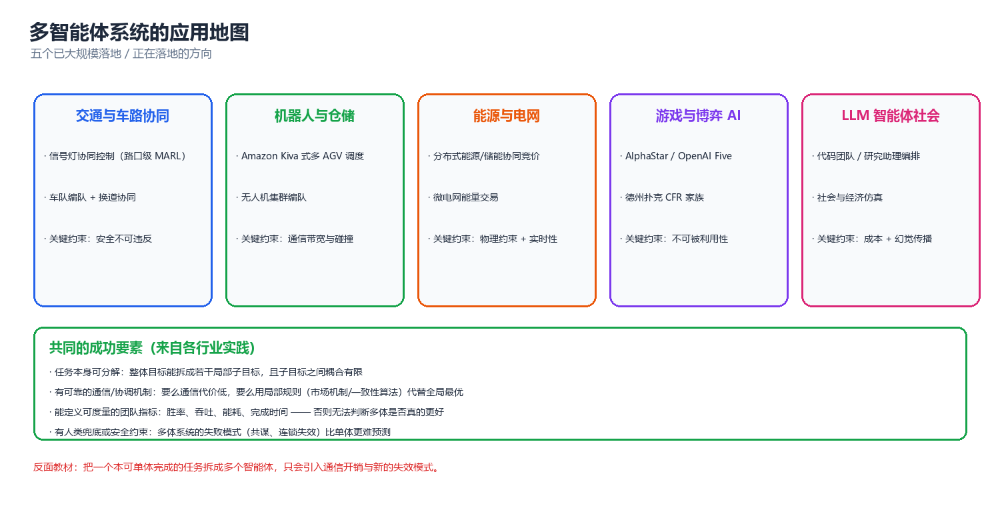
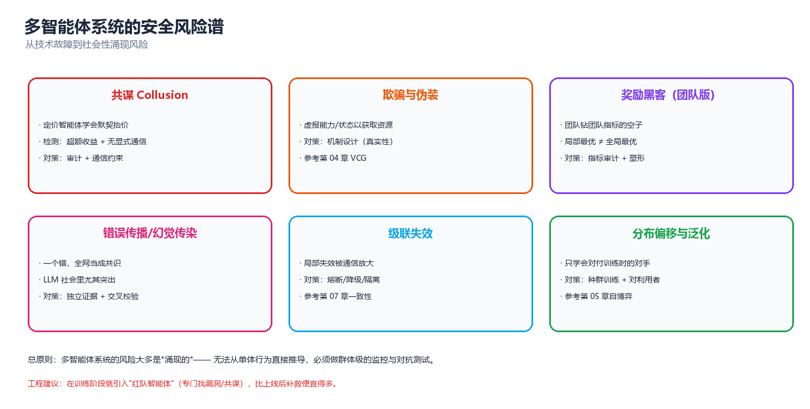

# 第 10 章 应用与前沿（Applications and Frontiers）

> 前九章从头到尾都在回答一个问题："多个决策主体共享一个世界时，怎么让它们把事办成。"我们已经拿到了全部工具：均衡（第 03 章）、机制（第 04 章）、学习（第 05 章）、通信（第 06 章）、协调（第 07 章）、语言智能体（第 08 章）、评估协议（第 09 章）。本章是全库的收尾章，任务不再是"再教一个算法"，而是**抬头看路**：这些工具在真实场景里长什么样、会在哪里断掉、以及还没被解决的问题在哪里。请带着一个具体判断读完——**在你的问题上，多智能体到底值不值得**。

---

## 一、应用地图



*图：从交通、仓储、电网到游戏与 LLM 编排，六个主要应用领域的共同骨架 —— 分布的决策者、共享的资源、需要协调的目标。*

### 1.1 交通与车路协同

交通是最"天然"的多智能体领域：每辆车就是一个决策主体，道路是共享资源，拥堵是典型的外部性（externality）。按控制粒度可以分成四层：

| 层级 | 决策主体 | 时间尺度 | 典型方法 | 对应章节 |
|------|---------|---------|---------|---------|
| **车辆动力学** | 单车控制器 | 10–100 ms | 分布式 MPC、CACC 编队 | 07 |
| **微观交通流** | 每辆车/每个路口 | 1–10 s | MARL 信号控制、博弈式合流 | 03、05 |
| **区域调度** | 路网分区、诱导系统 | 1–15 min | 拥塞博弈、势博弈、路由 | 03、本章 §八 |
| **出行需求** | 每个出行者 | 小时级 | 机制设计、拥挤定价 | 04 |

**为什么必须多主体？** 因为不能集中控制。一辆车无法知道全部车辆的未来轨迹，交管中心也无法在毫秒级下发每辆车的油门。这正是概览页说的"物理分布"约束。

**车路协同（V2X / Cooperative Driving）** 把问题推到一个更有意思的位置：车与车（V2V）、车与路（V2I）之间的通信是**有损、有延迟、带宽有限**的。这直接对应第 06 章的核心结论 —— *通信能弥补信息不对称，但会引入延迟与丢包，而延迟在实时控制回路里会吃掉全部收益*。工程上因此流行 **"局部可观测量 + 最小通信"** 的设计哲学：只在冲突临近时交换意图，而不是持续广播完整状态。

**混合交通（Mixed Autonomy）** 是当下最现实的难题：路上同时有自动驾驶车和人类驾驶车，人类驾驶员不理性、不合作、不遵守任何均衡。这在博弈论里就是"对手类型未知"的非平稳博弈 —— 自动驾驶的策略必须同时对纳什型的机器人和有界理性的真人有效。第 03 章的理性假设在这里直接失效，只能退回到 **鲁棒/安全博弈（安全集、控制屏障函数）** 而不是最优反应。

### 1.2 机器人与仓储

仓储物流是目前多智能体**商业落地最彻底**的场景，原因很朴素：目标函数明确（吞吐量、订单完成时间）、环境可控、失败代价有界。

| 子系统 | 主体 | 核心问题 | 主流方法 |
|--------|------|---------|---------|
| **AGV/AMR 路径规划** | 移动机器人 | 无碰撞、无死锁的路径 | MAPF（多智能体路径规划） |
| **任务分配** | 机器人 + 订单 | 谁送哪个订单 | 拍卖、CBBA、合同网 |
| **货架搬运（Kiva 式）** | 机器人 + 货架 | 货架-站点匹配 | 集中调度 + 局部避障 |
| **机械臂协作** | 多臂/多工位 | 时序与共享工作空间 | 分层规划 + 时间窗 |
| **拣选站编排** | 人 + 机器人 | 人机混合节拍 | 混合倡议（mixed-initiative） |

**MAPF（Multi-Agent Path Finding）** 是这里的技术核心，它和第 07 章的 DCOP 是亲戚：约束是"任意时刻任意两个机器人不能占同一格/同一条边"，目标是所有机器人总代价（时间步之和）最小。MAPF 的复杂度是 NP-hard（单智能体路径规划只是多项式），于是实践里全是**分层近似**：

- **CBS（Conflict-Based Search）**：上层在冲突树里搜，下层各自做单智能体规划。最优但是慢。
- **优先级规划（Prioritized Planning）**：按优先级依次规划，把已规划者当动态障碍。快但可能不可解。
- **MAPF-PBS / LaCAM**：大规模下更实用。
- **学习式**：用 MARL 学局部避障策略，代价是最优性不可证。

> ⚠️ **常见坑**：把 MAPF 当成"多智能体 RL 问题"直接上 QMIX，往往不如一个写得好优先级规划器。原因在 §四：机器人数量一多，联合动作空间指数爆炸，而 MAPF 的结构化先验（图 + 冲突）恰好把这个问题从"学习"降维回了"搜索"。**能用结构解决的，不要用学习解决。**

### 1.3 能源与电网

电力系统是**最早、也最深刻**的多智能体应用之一，因为它天然具备 MAS 的全部特征：物理上分布、经济上自利（发电商、售电公司、用户各有目标）、可靠性要求极端（一条线跳闸可能连锁成大停电）。

| 场景 | 主体 | 博弈/机制结构 | 关键约束 |
|------|------|--------------|---------|
| **发电竞价** | 发电机组 | 拍卖（边际出清）、古诺竞争 | 潮流方程、爬坡率 |
| **需求响应** | 用户/聚合商 | 激励相容机制、Stackelberg | 舒适度、可中断负荷 |
| **微电网协同** | 微网之间 | 纳什议价、讨价还价 | 功率平衡 |
| **分布式能源** | 屋顶光伏 + 储能 | 势博弈（分布式优化） | 电压/PV 曲线 |
| **频率稳定** | 逆变器（下垂控制） | 完全去中心化的动力学耦合 | 稳定性 > 最优性 |

**两类方法的分野**值得单列，因为它贯穿全书：

| 维度 | 博弈/机制路线 | 学习/MARL 路线 |
|------|-------------|---------------|
| 前提 | 模型已知、主体理性 | 模型未知、可比拟自利 |
| 保证 | 均衡存在、机制真实性可证 | 经验收敛、无一般保证 |
| 工具 | VCG、拉格朗日对偶、势博弈 | MADDPG、MAPPO、双层优化 |
| 适合 | 市场出清、定价 | 未知动力学下的频率/电压控制 |
| 风险 | 理性假设崩塌 | 学到"钻空子"的坏策略 |

电力系统里真正的工业界选择几乎总是**混合**：上层用机制设计定规则（第 04 章），下层用学习或分布式优化执行（第 05、07 章）。这也解释了为什么"机制 + 学习"（mechanism learning / differentiable economics）是近年的热门方向。

### 1.4 游戏与博弈 AI

游戏是多智能体的**实验台**：规则封闭、奖励明确、对手真实存在。它承担的角色相当于物理学里的"加速器"—— 提供可重复、可加难度的对抗环境。

| 游戏 | 主体结构 | 技术突破 | 意义 |
|------|---------|---------|------|
| **TD-Gammon（1992）** | 单智能体 + 自博弈 | TD 学习 + 自博弈 | 首次证明自博弈可超越人类 |
| **AlphaGo（2016）** | 单智能体（完美信息） | MCTS + 价值网络 | 大规模搜索 + 学习 |
| **AlphaZero（2017）** | 单智能体 | 自博弈 + MCTS，无人类数据 | 统一框架跨游戏通用 |
| **AlphaStar（2019）** | 多智能体（不完全信息、连续动作） | 联赛（League）训练、模仿 + 自博弈 | 首次在 RTS 上打到宗师 |
| **OpenAI Five（2019）** | 5v5 团队 | 大规模 PPO + 团队奖励 | 团队协作在长时程上的极限 |
| **Diplomacy 系** | 纯语言协商 | 语言 + 策略联合 | 自然语言协商 |
| **Hanabi 系** | 纯合作 + 隐含通信 | 零样本协调（ZSC） | 研究"与陌生伙伴协作" |

游戏带来的三个**真正可迁移**的教训：

1. **自博弈是数据放大器**。不需要人类标注，只需要一个能自动判胜负的环境 → 可以无限生成训练样本。这就是 AlphaZero 路线的本质。
2. **联赛（League）比单一最优策略更鲁棒**。AlphaStar 的关键不是"更强的网络"，而是维护一整个对手种群（主智能体、剥削者、历史快照）—— 这直接对应第 05 章的种群训练与第 03 章的均衡选择。
3. **纯合作游戏是通信与协调的试纸**。Hanabi 之所以成为标准基准，是因为它把第 06 章的"说什么、对谁说、何时说"压缩成了一个极纯净的决策问题：**信息几乎全在别人的私有观测里**。

### 1.5 LLM 智能体编排

2023 年后爆发的一条线（第 08 章的完整正文）。它和前四类应用的**本质差别**在于智能体的存在形式：

| 维度 | 策略型智能体（RL） | LLM 智能体 |
|------|------------------|-----------|
| 状态 | 向量/张量 | 自然语言上下文 |
| 策略 | 参数化策略 $\pi_\theta$ | 提示 + 模型权重（冻结） |
| 通信 | 学出来的低维消息 | 自然语言 + 工具调用 |
| 训练 | 梯度更新 | 上下文内学习（少样本/反思） |
| 错误模式 | 不收敛、非平稳 | 幻觉传染、无限自省、成本爆炸 |
| 调试 | 看损失曲线 | 看对话日志与 token 账单 |

主流编排范式（第 08 章系统讲过，这里只做地图）：

- **流水线 / 装配线**：固定 DAG，每个节点一个角色（MetaGPT、ChatDev 的软件流程）。最可控，适合有明确工序的任务。
- **辩论 / 多视角**：多个智能体给出答案并互相批评，最后聚合。适合事实性与推理任务。
- **主管 / 路由**：一个 planner 分派子任务给 executor，结果汇总。适合开放任务。
- **群聊 / 黑板**：所有智能体共享一个会话窗口。最像"社会"，也最容易失控（上下文爆炸）。
- **反思 / 自我批评**：单智能体反复审视自己的输出（Reflexion 路线）。严格说不是多智能体，但常被当作多智能体框架的组件。

> **核心思想**：LLM 多智能体的价值**不在于"人多力量大"，而在于角色专用化带来的上下文隔离**。一个智能体看全部上下文，和三个智能体各看一部分然后交换结论，区别在于后者能防止一个错误观点污染整条推理链 —— 也正因如此，它同时引入了通信错误的传播风险（§5.4 会量化这个权衡）。

### 1.6 共同成功要素

把上面五类应用横向拉平，成功的多智能体系统共享**同一组特征**。这张表是本章最该记住的东西：

| 要素 | 含义 | 失败反例 |
|------|------|---------|
| **真分布** | 主体确实无法被一个决策者统一处理 | 集中式调度明明更快却硬要拆成多体 |
| **可分解的局部性** | 影响半径有限，邻居交互足够 | 全局耦合的强相互作用（如全网潮流） |
| **清晰的奖励/目标定义** | 能写出可计算的效用或评估函数 | "让系统更智能"这种无法验证的目标 |
| **通信代价 < 协调收益** | 交换信息的成本低于不协调的损失 | 实时控制回路里用 LLM 协商 |
| **可观测的中间状态** | 能调试、能回放、能归因 | 黑盒智能体间只有"结果"，没有"过程" |
| **退化路径** | 智能体挂掉后系统仍能降级运行 | 一个 coordinator 挂了全系统停摆 |
| **规模有上界** | 主体数受控，或采用分层限制交互 | 无脑扩展到上千个平级智能体 |

> ⚠️ **反面清单（什么时候不该用多智能体）**：任务可分解为互不影响子任务；上下文高度集中、单步明确；通信成本高于协调收益；你需要的是"并行"而不是"协商"。这四条与概览页 §4.2 完全一致 —— 多智能体的失败案例大多源于"本不该拆"。

---

## 二、三个案例深挖

上一节是地图，这一节是地形。我们选三个"技术含量高、教训明确、覆盖不同方法论"的案例，每个都按 **任务建模 → 算法选择 → 关键工程 → 结果与教训** 四步展开。它们分别代表：极端竞争+不完全信息（AlphaStar）、结构化组合优化（AGV 仓储）、大规模连续控制与外部性（交通信号）。

### 2.1 案例一：AlphaStar —— 把"自博弈"工程化

**（1）任务建模**

星际争霸 II 是一个不符合任何教科书假设的环境：

| 特征 | 对建模的影响 |
|------|-------------|
| 不完全信息（战争迷雾） | 退化为 Dec-POMDP，不是 MDP |
| 连续 + 离散混合动作（几百维） | 动作空间巨大，无法枚举 |
| 长时程、稀疏奖励 | 信用分配极难 |
| 多兵种协同 + 多线操作 | 天然的多智能体问题（每个单位是子主体） |
| 实时（APM 限制） | 决策频率与人类可比，不能无限算 |

形式上它是**双人零和、不完全信息、部分可观测的随机博弈**。注意这里的"多智能体"有两层：外层是两名玩家（对手建模），内层是每个玩家控制的一支军队（单位级协调）。

**（2）算法选择**

AlphaStar 的解法不是"一个更强的算法"，而是**三层组合**：

1. **模仿学习（Imitation）**：先用人类对局做监督学习，得到初始策略与合理的动作先验。
2. **自博弈（Self-play）**：用**联赛（League）**训练，而不是只对抗自己最新一版。
3. **搜索（MCTS-like）**：在推理时对候选动作做有限前瞻，用价值网络评估。

联赛的结构是这里最值得学的东西：

```
            ┌──────────────────────────────────────┐
            │            联赛 League                 │
            │                                        │
            │  Main Agents (主智能体, 互相自博弈)      │
            │     ↕  对抗                              │
            │  Main Exploiters (专门克制主智能体的)     │
            │     ↕  对抗                              │
            │  League Exploiters (专门克制历史策略)     │
            │                                        │
            │  Past Snapshots (历史快照, 防止遗忘)      │
            └──────────────────────────────────────┘
                     ↓ 新策略通过"胜率门槛"后进入
                     ↓ 并计算 PFSP (优先虚构自博弈) 采样权重
```

**优先虚构自博弈（PFSP, Prioritized Fictitious Self-Play）**：训练时不是均匀地和所有对手打，而是**更频繁地和"打不过的、胜率接近 50% 的对手"打**。采样概率按 $f(\text{winrate})$ 加权（赢太多/输太多都降低权重）。这直接对应第 05 章的结论 —— 训练信号的**信息量**取决于对手的难度分布，太弱和太强的对手都提供不了梯度。

**（3）关键工程**

- **动作接口（Action Interface）**：把上千维的原始动作空间压缩成"参数化 + 目标选择"两段式，让策略网络输出可控。
- **相机式观测 + 特征层**：把空间信息压成网格特征，而不是直接喂像素。
- **统计 $z$（策略统计量 Statistic）**：给每个策略一个全局签名，让策略能"知道自己面对的是哪类对手"，从而学到条件化行为。这是解决**非平稳性**的工程手段。
- **算力规模**：成千上万的对局并行，且持续数周。

**（4）结果与教训**

结果：在 2019 年的《星际争霸 II》上达到**宗师（Grandmaster）级**，胜过 99.8% 的人类玩家。

| 教训 | 说明 |
|------|------|
| **"单一最优策略"是伪目标** | 在零和博弈里没有绝对最优，只有对抗种群下的相对鲁棒 |
| **联赛 = 均衡选择的工程化** | 第 03 章说"纳什不唯一"，联赛用种群覆盖了多个局部最优 |
| **模仿学习是冷启动的关键** | 纯随机探索在巨大动作空间里几乎不可能起步（= 第 05 章的探索难题） |
| **工程 > 算法** | AlphaStar 的核心贡献是训练基础设施与联赛设计，而非某个新的 RL 算子 |
| **单靠自博弈会循环** | 只和自己打会陷入"出招 A → 被 A' 克制 → 又回到 A"的循环，需要"剥削者"打破 |

> **核心思想**：面对零和、不完全信息、巨大动作空间的场景，**别指望一个算法解决一切**。正确姿势是"模仿给起点、自博弈给上限、联赛给鲁棒、搜索给即时算力"。这四层缺一层都会掉到次优的局部均衡里。

### 2.2 案例二：多 AGV 仓储调度 —— MAPF 与 MARL 的结合

**（1）任务建模**

一个现代化仓库的抽象模型：

$$
\text{状态} = (\text{每台 AGV 的位置},\ \text{每个货架的位置},\ \text{订单队列},\ \text{充电桩占用})
$$

目标（多目标，需要加权）：

$$
\min\ \underbrace{\sum_i T_i^{\text{完成}}}_{\text{订单延迟}} + \lambda_1 \underbrace{\sum_i E_i}_{\text{能耗}} + \lambda_2 \underbrace{\max_i \text{路径长度}}_{\text{公平性}}
$$

约束：无碰撞（同一时刻同一格最多一台）、无死锁（循环等待禁止）、电量非负、站点容量。

这个问题可以**干净地分解**成两层，这正是它能落地的原因：

```
    ┌──────────────────────────────────────────────────────────┐
    │  上层：任务分配（谁去哪个站、送哪个订单）                    │
    │      时间尺度：秒级      数学：二分匹配 / 拍卖 / CBBA        │
    └───────────────────────────┬──────────────────────────────┘
                                │ 每台车获得一个目标序列
    ┌───────────────────────────▼──────────────────────────────┐
    │  中层：路径规划（如何到达，避免碰撞）                        │
    │      时间尺度：百毫秒     数学：MAPF（CBS / 优先级规划）      │
    └───────────────────────────┬──────────────────────────────┘
                                │ 每台车获得一条时空路径
    ┌───────────────────────────▼──────────────────────────────┐
    │  下层：局部执行（实时避障、速度控制）                        │
    │      时间尺度：10–50 ms   数学：ORCA / 势场 / 学到的策略     │
    └──────────────────────────────────────────────────────────┘
```

**（2）算法选择**

| 层 | 候选方法 | 选择理由 |
|----|---------|---------|
| 分配 | 匈牙利算法（最优，$O(n^3)$） | 规模小、目标是线性分配 |
| 分配 | 拍卖 / CBBA | 分布式、可扩展、对通信丢失鲁棒（第 07 章） |
| 规划 | CBS | 最优性可证，但冲突爆炸 |
| 规划 | 优先级规划 + 重新排序 | 大规模下的实用折中 |
| 执行 | ORCA（相互速度障碍） | 无需通信、有安全保证、工业级 |
| 执行 | MARL（局部观测） | 能学出人类写不出的避障策略，但不可证安全 |

**为什么"MAPF + 学习"是正确姿势？** 两者分工明确：

- **MAPF 负责"可证正确"的部分**：无碰撞、无死锁、最短路结构。这些是硬约束，学习很难保证。
- **MARL 负责"难以形式化"的部分**：拥堵时的礼让策略、局部绕行、速度微调。这些是软优化，搜索很难表达。

这就是所谓的 **"经典规划 + 学习"混合范式**：用搜索保证安全底线，用学习提升效率上限。

**（3）关键工程**

- **时空冲突检测**：把每台车的路径表示成 (位置, 时间) 序列，冲突检测退化为集合求交。
- **死锁预防**：不是事后检测，而是事前禁止"循环等待"（资源排序法，与操作系统的死锁避免同理）。
- **重规划触发**：只在必要时（新任务、拥堵超阈值、AGV 故障）重规划，避免全局抖振。
- **观测设计**：每台 AGV 只看半径 $R$ 内的邻居 + 自己的目标方向。这个 $R$ 的选取直接决定学习难度（见 §4.3 的局部性讨论）。
- **仿真-现实差距**：用真实时间的运动学约束（加速度、转弯半径）建模，否则学出的策略在真车上不可执行。

**（4）结果与教训**

| 教训 | 说明 |
|------|------|
| **分层是最有效的可扩展性手段** | 把 $n$ 个智能体的联合问题拆成"分配 + 规划 + 控制"，每层都是小得多的问题 |
| **结构化问题优先用搜索** | MAPF 的冲突结构是宝贵先验，纯 MRAL 会浪费它 |
| **ORCA 证明"无通信也能安全"** | 局部规则 + 对称打破，就能避免多数碰撞 —— 通信不是必需的，只是加速器（第 06 章） |
| **学习最适合"人类写不出规则"的边界** | 拥堵礼让这种软行为，才是 RL 的甜点区 |
| **公平性目标必须显式写进奖励** | 只优化总吞吐，一定会学出"牺牲少数 AGV"的饥饿策略（第 04 章的公平性） |

> ⚠️ **一个反直觉的观察**：在很多真实仓库里，把 MAPF 从"逐台顺序规划"升级到"全局 CBS"带来的收益，**远小于**把任务分配策略从贪心升级到考虑未来拥堵的收益。瓶颈往往不在"车走得准不准"，而在"车被派去干的事对不对"。**先看瓶颈在哪一层，再决定优化哪一层。**

### 2.3 案例三：交通信号协同控制

**（1）任务建模**

一个路网有 $N$ 个信号灯路口，每个路口在每个决策周期选择一个相位（phase，即哪几条车道放行）。这是**典型的分布式序贯决策问题**：

| 要素 | 具体化 |
|------|--------|
| 主体 | 每个路口一个信号控制器 |
| 动作 | 选择下一相位（离散，通常 4–8 个）+ 相位时长 |
| 观测 | 本地车道的排队长度、等待时间、临近路口状态 |
| 奖励 | 负的总等待时间 / 负的总延误 / 通行量 |
| 耦合 | 上游放行 → 下游排队；绿灯波需要跨路口协调 |
| 约束 | 最短/最长绿灯、全红清空、行人相位 |

**核心矛盾**：每个路口的**局部最优**会导致"绿波断链"。如果一个路口只顾自己放行，上游的车会在下游堆积，形成"移动的幽灵堵车"。这正是**外部性** —— 每辆车的选择影响他人的通行时间，是标准的社会困境。

**（2）算法选择**

| 方法 | 优点 | 缺点 | 适用 |
|------|------|------|------|
| 定时控制（固定配时） | 零计算、可预测 | 无法适应流量变化 | 低流量、稳定流量 |
| 感应式（Actuated） | 响应局部需求 | 无法协调干线 | 单点、干线较弱 |
| 绿波协调（MAXBAND） | 干线通行好 | 假设固定速度、静态 | 干线、稳定流量 |
| SCATS / SCOOT | 区域协调，工业成熟 | 依赖集中优化，反应慢 | 城市级 |
| **MARL（局部观测 + CTDE）** | 能学复杂协调 | 训练难、可复现性差 | 研究、中等规模 |
| **MARL + 博弈论（势博弈）** | 收敛性可分析 | 建模复杂 | 区域协调 |

**为什么这里适合势博弈（Potential Game）？** 因为第 03 章告诉我们：如果每个路口的收益变化能被一个**全局势函数** $\Phi$ 捕捉（即 $\Delta R_i = \Delta \Phi$），那么最大化 $\Phi$ 就是所有主体的共同目标，分布式贪心就能收敛到纳什均衡。而在交通里，这个势函数可以用"全网总等待时间"或"总延误"来近似 —— 这解释了为什么**分布式贪心 + 局部通信**在实践中效果并不差。

**（3）关键工程**

- **相位时长离散化**：把连续时长量化成固定档位（如 5 s 一档），把连续控制变成离散选择，降低学习难度。
- **观测工程**：用"车道占用率网格"而不是原始车辆列表，让不同路口有可比输入。
- **邻居通信**：每个路口与相邻几个路口交换排队长度。这直接决定了协调质量（第 06 章）。通信半径不是越大越好 —— 太远的信息在这个时间尺度上无意义，还会引入噪声。
- **压力（Pressure）奖励的经典定义**：对每个相位，计算"进入该相位的车道排队 − 流出车道的下游排队"，取最大者。这个启发式（MaxPressure）至今仍是强基线，**很多 MARL 论文的对比对象就是它，且经常输**。
- **安全兜底**：任何学到的策略上线前都要经过**规则层过滤**（最短绿灯、清空时间不可违反）。

**（4）结果与教训**

| 教训 | 说明 |
|------|------|
| **强启发式（MaxPressure）是硬底线** | 任何新方法不能打败它，就不要谈部署 |
| **协调收益来自上游-下游耦合** | 单点优化到底就没收益了，必须跨路口 |
| **非平稳性真实存在** | 高峰/平峰/夜晚的流量分布完全不同，一个策略吃不下（第 05 章的非平稳性） |
| **仿真与现实的鸿沟** | 仿真里"完美观测"，现实里检测器有噪声、有丢失；SUMO 里的收益常打折 |
| **部署是最后一公里，也是最长的** | 从论文到路口，要过安全审查、要能降级、要能解释给市政 |

> **核心思想**：交通信号控制教给我们的最宝贵一课是 **"强基线 + 结构化先验"**。MaxPressure 用简单的压力启发式达到了惊人效果，说明**在可解释的领域知识面前，通用学习器往往没有优势**。真正稀缺的不是更强的算法，而是"知道该往哪里加结构"的判断力。

---

## 三、异构群体智能架构

前两个案例里，主体都是**同类**的（同型号 AGV、同规格路口）。真实系统绝大多数是**异构的**：不同能力、不同角色、不同传感器、不同时间尺度。这一节讨论异构性带来的新问题与架构解法。

### 3.1 异构性的四个来源

| 来源 | 含义 | 例子 | 造成的困难 |
|------|------|------|-----------|
| **能力异构** | 主体能做的事不同 | 无人机（快、远）vs 地面车（载重、慢） | 动作空间不同，价值不可直接比较 |
| **角色异构** | 任务分工不同 | 侦察者 vs 执行者 vs 通信中继 | 奖励结构不同，信用分配错位 |
| **传感器异构** | 观测模态与噪声不同 | 摄像头、雷达、声呐、文本 | 观测空间维度不同，无法共享网络 |
| **时间尺度异构** | 决策频率不同 | 慢规划器（秒）vs 快控制器（毫秒） | 异步决策，时序对齐困难 |

**能力异构的形式化**：每个主体 $i$ 有自己允许的动作集 $A_i$，且 $A_i \neq A_j$。这直接破坏了 MARL 里最常见的假设 —— **参数共享（parameter sharing）** 要求所有主体用同一个网络，而观测维度和动作维度必须一致。因此异构系统的第一道门就是：**哪些主体能共享网络，哪些不能？**（§4.2 会给出量化答案。）

**时间尺度异构**是常被忽视但致命的一类。考虑一个无人机-车协同系统：

- 无人机每 100 ms 更新一次目标位置
- 地面车规划器每 2 s 重新规划一次路径
- 底层控制器每 20 ms 更新一次轮速

三层频率差了两个数量级。如果把它们塞进一个"同步的多智能体 RL"框架里，会得到什么？要么把快的降到慢的（浪费控制带宽），要么把慢的插值到快的（引入虚假信息）。正确做法是**承认异步**，用分层时间抽象（temporal abstraction）分别建模，只在**事件边界**（目标变更、状态显著变化）上交换信息。

### 3.2 架构模式：分层 + 共享表示 + 角色路由

异构系统的主流架构可以归纳成三条正交的设计轴：

```
                    ┌─────────────────────────────────────────┐
                    │  L1 编排层 (Orchestration)               │
                    │  · 任务分解、角色分配、目标下发            │
                    │  · 时间尺度：慢                          │
                    │  · 可能是 LLM、规则引擎或规划器            │
                    └────────────┬────────────────────────────┘
                                 │  目标 / 角色 / 约束（低带宽）
              ┌──────────────────┼──────────────────┐
              ▼                  ▼                  ▼
      ┌──────────────┐   ┌──────────────┐   ┌──────────────┐
      │ 子群 A       │   │ 子群 B       │   │ 子群 C       │
      │ (能力同构)    │   │ (能力同构)    │   │ (能力同构)    │
      │ 共享表示/网络 │   │ 共享表示/网络 │   │ 共享表示/网络 │
      └──────┬───────┘   └──────┬───────┘   └──────┬───────┘
             │                  │                  │
             └──────────┬───────┴──────────────────┘
                        ▼
             ┌──────────────────────────┐
             │  L0 共享世界 / 共享表示层  │
             │  · 黑板 (blackboard)      │
             │  · 全局向量 / 地图 / 世界模型 │
             └──────────────────────────┘
                        │
                        ▼
             ┌──────────────────────────┐
             │  共享环境（物理世界）      │
             └──────────────────────────┘
```

**三条设计轴：**

| 轴 | 选项 | 何时选它 |
|----|------|---------|
| **分层（Layering）** | 2 层（编排 + 执行） | 时间尺度差异大、任务有明确工序 |
| | 3 层（编排 + 协调 + 执行） | 中间需要专门处理冲突/约束 |
| | 无层次（平面） | 主体数少、全同构、简单任务 |
| **共享表示** | 无共享（各算各的） | 观测完全独立 |
| | 黑板（共享显式状态） | 需要全局一致性、可解释（第 07 章） |
| | 共享潜表示（共享网络/embedding） | 需要泛化、观测异构 |
| **角色路由** | 静态角色（写死） | 任务流程固定 |
| | 动态路由（按状态分配） | 负载变化、主体可增减 |
| | 学出来的路由 | 有充足数据且需要最优分配 |

**共享表示（Shared Representation）** 是异构系统里最关键的妥协。两个典型做法：

- **共享编码器 + 私有头（Shared Encoder, Private Head）**：所有主体用同一个观测编码器把异构观测映射到**公共潜空间**，然后各自接一个私有的策略头。这样既能让不同主体"理解同一个世界"，又保留了行动层面的差异化。
- **全局向量 + 局部拼接**：维护一个全局状态向量 $g$（如地图、任务状态），每个主体把自己的局部观测 $o_i$ 与 $g$ 拼接后送入网络。简单有效，但要求全局向量低维且可维护。

**角色路由（Role Routing）** 的三种实现：

| 实现 | 机制 | 优点 | 缺点 |
|------|------|------|------|
| 硬路由 | 规则/优先级表 | 可解释、可审计 | 不灵活 |
| 软路由 | 学一个分配器（gating/attention） | 自适应 | 训练难、易坍缩 |
| 语言路由 | LLM 读任务描述后分派 | 处理开放任务 | 贵、有幻觉 |

> **核心思想**：异构系统的架构本质上是在回答"**在什么粒度上共享、在什么粒度上分开**"。共享得太多 → 抹平差异，学不出专业行为；共享得太少 → 无法协调，退化成各干各的。分层 + 共享表示 + 角色路由，就是把这三种粒度的选择显式化。

### 3.3 通信拓扑与网络约束

异构系统里的通信不是"想连就连"。真实约束包括：带宽、延迟、丢包、邻居只能在范围内、中继节点电量有限。这直接决定拓扑选择。

| 拓扑 | 度数 | 通信成本 | 全局信息传播 | 典型场景 | 鲁棒性 |
|------|------|---------|-------------|---------|--------|
| 全连接 | $n-1$ | $O(n^2)$ | 1 跳 | 少量主体、仿真 | 高（但不可扩展） |
| 星形 | 中心 $n-1$，叶子 1 | $O(n)$ | 1 跳 | 有中心调度者 | 中心单点失效 |
| 环形 | 2 | $O(n)$ | $O(n)$ 跳 | 编队、链式 | 中 |
| 网格/格 | ≤4（或 8） | $O(n)$ | $O(\sqrt n)$ 跳 | 仓储网格、传感网 | 中 |
| 随机图 | 平均 $d$ | $O(nd)$ | $O(\log n)$ 跳 | 分布式优化 | 高 |
| 动态/事件触发 | 变化 | 很低 | 不定 | 带宽稀缺、节能 | 高 |

**关键权衡：全局信息传播速度 vs 通信开销。** 全连接 1 跳就能拿到全局信息，代价是 $O(n^2)$ 条链路。而环形拓扑只需 $O(n)$ 条链路，但要 $O(n)$ 跳才能把信息传遍全网 —— 在动态环境里，等消息传完，世界已经变了。

这引出一个重要的工程原则 —— **事件触发通信（Event-Triggered Communication）**：不是每个时间步都广播，而是**只在"消息的信息量超过阈值"时**才发送。判据通常是状态变化量：

$$
\text{发送条件：}\quad \|x_i(t) - x_i^{\text{last sent}}\| > \delta
$$

这样在系统平稳时通信量趋近于零，在剧烈变化时自动加密。这个思想直接呼应第 06 章的"学会何时说话"（IC3Net 的 gating）。

**网络约束下的两个定理级结论**（第 07 章）：

1. **拜占庭阈值**：若存在 $f$ 个可能任意作恶的节点，则系统需要至少 $3f+1$ 个节点才能达成一致。这条线划定了"容错"的硬边界 —— 通信拓扑再聪明也绕不过它。
2. **CAP**：网络分区时，一致性与可用性不可兼得。多智能体系统必须显式选择"分区时是停等（CP）还是各自行动（AP）"。

### 3.4 与 LLM 编排的融合

2024 年后最热的方向：**把经典多智能体（策略、博弈、协议）和 LLM 编排（语言、常识、开放任务）缝在一起**。三种典型缝合方式：

| 融合模式 | 谁会做什么 | 例子 | 风险 |
|---------|-----------|------|------|
| **LLM 当高层规划器** | LLM 分解任务 → 经典求解器/RL 执行 | "把货架 A1 的货送到工位 3" → MAPF | LLM 幻觉出不存在的资源 |
| **LLM 当通信层** | 经典智能体产生结构信号 → LLM 翻译成自然语言 | 机器人状态 → 人类可读报告 | 语义丢失、延迟 |
| **LLM 当协商者** | 多主体用自然语言谈判，达成软协议 | 多智能体资源争抢 | 无约束、可能无限循环 |

**为什么这个融合很难？** 因为两侧的**假设完全不同**：

| 假设 | 经典 MARL | LLM 编排 |
|------|-----------|---------|
| 时间 | 离散步、同步 | 异步、异构延迟 |
| 动作 | 有限集、可枚举 | 任意文本 + 工具调用 |
| 正确性 | 可验证（奖励/约束） | 难验证（主观、模糊） |
| 成本模型 | 算力 | token + 延迟 |
| 失败模式 | 不收敛 | 幻觉、循环、越权 |

**融合的正确姿势**（实践总结）：让 LLM 负责**"翻译和规划"（模糊 → 清晰）**，让经典方法负责**"执行和验证"（清晰 → 正确）**。反过来做 —— 让 LLM 直接控制需要硬保证的底层 —— 是把一个本可以被证明的问题，变成了一个只能被"感觉"的问题。

```
  模糊的人类意图
        │
        ▼  (LLM: 翻译 + 规划)
  清晰的任务规格 + 约束
        │
        ▼  (经典: 求解 + 验证)
  可执行的动作序列
        │
        ▼  (验证器: 检查安全/约束)
  通过 ──→ 执行    不通过 ──→ 回退到 LLM 重新规划
```

> ⚠️ **反面模式**：让 LLM 智能体直接输出底层控制指令，再用另一个 LLM 智能体来"审查"它是否安全。用模糊的审查去验证精确的约束，等于没有验证 —— **安全检查必须是可计算的（类型检查、约束求解、仿真回放），不能是另一个语言模型的主观判断。**

---

## 四、可扩展性与瓶颈

前几节都在讲"能做什么"。这一节泼冷水：**多智能体系统在规模上会撞到四堵墙** —— 联合空间、样本复杂度、通信带宽、显存/算力。先看清墙在哪，再谈怎么绕。

### 4.1 复杂度分析

#### 4.1.1 联合空间复杂度

最基础的一条：动作空间随主体数**指数爆炸**。

$$
\left|\mathcal{A}\right| = \prod_{i=1}^{n} |A_i| \;=\; |A|^{n} \quad (\text{当所有主体动作集相同时})
$$

一个朴素但决定性的推论：**任何需要枚举联合动作的方法（精确 Q 学习、穷举极小极大）在 $n$ 稍大时就完全不可行**。$|A|=4$ 时，$n=20$ 的联合空间已达 $10^{12}$ —— 这不是"慢一点"，而是"物理上做不到"。

由此派生出多智能体学习的所有近似：

| 近似 | 打破的对象 | 代价 | 代表 |
|------|-----------|------|------|
| 独立学习（IQL） | 忽略其他人的策略变化 | 非平稳、可能不收敛 | 第 05 章 |
| 值分解（VDN/QMIX） | 联合 Q 分解成个体 Q | 表达力受限（IGM 约束） | 第 05 章 |
| CTDE（MADDPG/MAPPO） | 用中心 Critic 换分布式执行 | 训练需要全局信息 | 第 05 章 |
| 局部观测 + 局部互作 | 只依赖邻居 | 丢失长程协调 | §4.3 |
| 分层分解 | 把联合问题拆成子问题 | 设计成本、层间接口 | §3.2 |

#### 4.1.2 通信复杂度

如果每个主体每步要把状态广播给所有其他主体，通信量是 $O(n^2 d)$（$d$ 为消息维数）。$n=100$、$d=64$、频率 10 Hz 时，每步 6400 个浮点数 ×100 个主体 ≈ 每秒数百万次消息 —— 在无线网络里是灾难。

| 通信方案 | 每步消息量 | 全连接所需跳数 | 说明 |
|---------|-----------|--------------|------|
| 全广播 | $O(n^2)$ | 1 | 简单、不可扩展 |
| 环形/链 | $O(n)$ | $O(n)$ | 信息传播慢 |
| 网格 | $O(n)$ | $O(\sqrt n)$ | 二维局部性 |
| 随机 $d$-正则 | $O(nd)$ | $O(\log n)$ | 小世界效应 |
| 事件触发 | 事件相关，平均很低 | 不定 | 平稳时趋于 0 |
| 学习式寻址（TarMAC） | $O(n k)$，$k\ll n$ | 1（若全可达） | 只对需要的对象说话 |

**关键量化直觉**：从 $O(n^2)$ 降到 $O(nd)$（$d$ 固定），在 $n=1000$ 时是 1000 倍的数量级差。**这解释了为什么大系统的通信必须是局部的、稀疏的、或事件触发的**，而不是"多连几条线就行"。

#### 4.1.3 样本复杂度

这是最容易被忽略、也最贵的一堵墙。单智能体 RL 已经样本饥渴（$10^6$–$10^8$ 步），多智能体的样本需求进一步**放大**：

$$
\text{需要的样本} \;\sim\; \underbrace{|\mathcal{A}|^{n}}_{\text{联合空间}} \times \underbrace{\frac{1}{(1-\gamma)^3}}_{\text{信用分配}} \times \underbrace{\text{非平稳系数}}_{\text{对手在变}}
$$

| 因素 | 对样本量的影响 | 缓解手段 |
|------|--------------|---------|
| 联合动作空间 $|A|^n$ | 指数 | 值分解、局部观测 |
| 稀疏奖励 | 严重（指数） | 奖励塑形、课程学习 |
| 长时程（小 $\gamma$ 效应） | $(1-\gamma)^{-3}$ | 分层、选项 |
| 非平稳性 | 高（目标在移动） | 种群训练、对手建模 |
| 部分可观测 | 高 | 记忆、通信 |
| 异构观测 | 中高 | 共享编码器、表示学习 |

**算个直观的数**：QMIX 在 SMAC 上通常需要 $10^6$–$10^7$ 个环境步才能达到不错的胜率。如果环境步的墙钟成本是 1 ms（并行仿真），$10^7$ 步 ≈ 单核 3 小时；但如果只有 1 个环境实例（无并行），就是 3 小时 × 并行度倒数的等待。**样本效率决定了你能不能迭代**，而迭代速度决定了项目成败。

#### 4.1.4 实跑：参数共享 vs 独立网络的参数量与显存

参数共享（parameter sharing）是多智能体工程中最"便宜"的一个优化：让所有同构主体共用同一份网络参数。它的收益到底有多大？跑个数：

```python
# 参数共享 vs 独立网络: 参数量与训练显存估算
def mlp_params(obs_dim, hidden, n_layers, out_dim):
    """计算一个全连接 MLP 的可训练参数量(含每层偏置)"""
    dims = [obs_dim] + [hidden] * n_layers + [out_dim]
    return sum(dims[i] * dims[i + 1] + dims[i + 1] for i in range(len(dims) - 1))

def train_mem_mb(n_param, copies=4):
    """Adam 训练显存: 参数 + 梯度 + 一阶动量 + 二阶动量 = 4 份 float32"""
    return n_param * copies * 4 / (1024 ** 2)

obs, hidden, n_layers, out = 64, 256, 2, 6      # 64 维观测 -> 256 -> 256 -> 6 个动作
single = mlp_params(obs, hidden, n_layers, out)  # 单个策略网络参数量
print(f"单个策略网络参数量          : {single:,}")

n_agents = 20
indep = single * n_agents                        # 独立网络: 每人一份
shared = single                                  # 参数共享: 全网一份
print(f"独立网络 (n={n_agents}) 参数量 : {indep:,}   ({indep / single:.0f} 倍)")
print(f"参数共享 (n={n_agents}) 参数量 : {shared:,}   (网络只有 1 份)")
print(f"训练显存 独立 (4x float32)  : {train_mem_mb(indep):.1f} MB")
print(f"训练显存 共享 (4x float32)  : {train_mem_mb(shared):.1f} MB")
print(f"显存节省比例                : {1 - shared / indep:.1%}")

# 随主体数增长: 独立网络线性膨胀, 共享网络恒定
for n in (4, 8, 16, 32):
    print(f"n={n:2d}: 独立网络总参数 {mlp_params(obs, hidden, n_layers, out) * n:>9,}"
          f"   共享网络 {single:>6,}   比例 {n:.0f}x")
# 预期输出:
# 单个策略网络参数量          : 83,974
# 独立网络 (n=20) 参数量 : 1,679,480   (20 倍)
# 参数共享 (n=20) 参数量 : 83,974   (网络只有 1 份)
# 训练显存 独立 (4x float32)  : 25.6 MB
# 训练显存 共享 (4x float32)  : 1.3 MB
# 显存节省比例                : 95.0%
# n= 4: 独立网络总参数   335,896   共享网络 83,974   比例 4x
# n= 8: 独立网络总参数   671,792   共享网络 83,974   比例 8x
# n=16: 独立网络总参数 1,343,584   共享网络 83,974   比例 16x
# n=32: 独立网络总参数 2,687,168   共享网络 83,974   比例 32x
```

> **读法**：这里单网络只有 8 万参数（很小的注意力/MLP 策略），20 个主体独立训练要 168 万参数、25.6 MB 显存。**参数量本身不是问题**，真正的问题在另外两处：（1）独立网络的**样本效率**按 $n$ 倍恶化 —— 每个网络都要独立学一遍"世界怎么运作"；（2）独立网络**失去了主体间的对齐**，学不出"大家一起做 A"这种协调行为，因为它无法保证不同主体的策略在同一个"约定"上收敛（第 03 章的均衡选择问题）。参数共享把 $n$ 倍样本摊回到 1 份，代价是**抹平异构性**（§3.1 的"能力异构"）。所以工程上的标准答案是：**同构子群内共享，跨子群不共享**。

### 4.2 参数共享与课程学习

#### 4.2.1 参数共享的正确用法

| 共享粒度 | 说明 | 适用 |
|---------|------|------|
| 完全共享 | 所有主体一个网络 | 同构、对称任务（SMAC 大部分场景） |
| 分组共享 | 同类型主体共享 | 异构但可分族（无人机族、车族） |
| 只共享编码器 | 观测编码器共享，策略头私有 | 观测异构、动作空间不同 |
| 只共享 Critic | 执行力保持独立 | 需要个体差异、但集中评估 |
| 不共享 | 各学各的 | 主体极少或差异极大 |

**三个实用技巧**：

1. **主体 ID one-hot 拼接**：共享网络时，在观测末尾拼接一个主体编号的 one-hot 向量，让网络能输出"我是几号，所以我应该往左而不是往右"的差异化行为。这被称为**"共享参数 + 身份条件化"**，是 SMAC/MAPPO 的标准操作。
2. **对称性打破**：如果任务本身对称（所有主体等价），共享网络会导致所有主体总是做同样的动作（因为没有东西区分它们）。需要通过 ID 拼接、随机初始化偏置或角色分配来打破对称。
3. **经验池混洗**：所有主体的经验混在一起训练，等价于"把 $n$ 个主体的数据看成同一个策略的不同轨迹"，样本效率提升 $n$ 倍。

#### 4.2.2 课程学习（Curriculum Learning）

多智能体任务的难度可以沿多个维度调节，这是课程学习的基础：

| 课程维度 | 简易 → 困难 | 例子 |
|---------|------------|------|
| 主体数量 | 少 → 多 | 从 2 个到 20 个机器人 |
| 任务长度 | 短 → 长 | 从 1 个订单到持续运行 1 小时 |
| 对手强度 | 弱 → 强 | 从随机策略到历史最佳 |
| 观测质量 | 全 → 局部 | 从全局可观测到局部可观测 |
| 奖励密度 | 密 → 疏 | 从每步奖励到只给终局奖励 |
| 环境随机性 | 低 → 高 | 从确定性动力学到加噪声 |

**为什么课程学习在多智能体里特别有效？** 因为**信用分配在难度低时更清晰**。2 个机器人的合作任务里，"谁做对了"很容易归因；20 个机器人时就完全模糊了。先在小规模学会"合作"这个抽象概念，再用参数共享迁移到大规模，往往比直接从大规模硬学快得多。

> ⚠️ **课程学习的陷阱**：**自动课程（Automatic Curriculum）在多智能体里不稳定**。因为"当前难度"取决于对手的策略，而对手也在学习 → 难度度量本身在漂移。稳妥做法是**手动设计、缓慢加难、每级收敛后再升级**，而不是让系统自己决定下一步学什么。

### 4.3 通信瓶颈与局部性

#### 4.3.1 局部性：多智能体系统的"物理定律"

几乎所有可扩展的多智能体系统都依赖同一个假设：**影响是局部的（locality of interaction）**。

$$
R_i(t) \approx f\!\left(o_i(t),\; \{o_j(t)\}_{j \in \mathcal{N}_i}\right), \quad |\mathcal{N}_i| \ll n
$$

其中 $\mathcal{N}_i$ 是主体 $i$ 的邻居集合。只要这个假设成立，复杂度就从 $O(n^2)$ 降到 $O(n|\mathcal{N}|)$，可扩展性就有了。

| 场景 | 邻域半径 $|\mathcal{N}_i|$ | 局部性是否成立 |
|------|------------------------|--------------|
| 仓储 AGV | 5–20 台（视距内） | ✅ 强 |
| 无人机编队 | 3–8 台 | ✅ 强 |
| 交通信号 | 4–8 个相邻路口 | ⚠️ 中（绿波会产生长程耦合） |
| 电网潮流 | 全网（基尔霍夫定律） | ❌ 弱（必须用分布式优化近似） |
| LLM 群聊 | 全体（共享上下文） | ❌ 无局部性 → 上下文爆炸 |
| 供应链 | 上游几级 | ⚠️ 中（长鞭效应会放大长程影响） |

**这张表是选型的关键**：**局部性成立的场景，多智能体天然可扩展；局部性不成立的场景，必须靠分层把长程耦合"压缩"成低频的消息**。

#### 4.3.2 通信瓶颈的三种表现

1. **带宽瓶颈**：消息太多，网络塞不下 → 需要稀疏化（邻居限制）、量化（低比特）、事件触发。
2. **延迟瓶颈**：消息到得太晚，已经没用 → 需要预测（用历史推断对方的当前状态）、需要容忍陈旧信息。
3. **丢包瓶颈**：消息根本没到 → 需要鲁棒性设计（无通信也能安全运行的降级策略，如 ORCA）。

**量化直觉**：假设协调收益随通信延迟指数衰减 $\text{gain} \propto e^{-\tau/\tau_0}$，其中 $\tau_0$ 是环境的时间常数。交通信号里 $\tau_0$ 是几十秒，几秒的通信延迟无所谓；无人机编队里 $\tau_0$ 是几十毫秒，几毫秒延迟就已经吃掉一半收益。**这就是为什么"通信是好东西"这件事有前提 —— 前提是延迟相对于环境变化足够小。**

#### 4.3.3 削减通信的四条路线

| 路线 | 机制 | 效果 | 代表 |
|------|------|------|------|
| **稀疏化** | 只和邻居通信 | $O(n^2) \to O(nd)$ | 局部通信 MARL |
| **压缩** | 低维消息 / 量化 / 自编码 | 每消息比特数下降 | 信息瓶颈、CommNet |
| **选择** | 只和"相关"的主体通信 | 消息数下降 | TarMAC、IC3Net |
| **时间稀疏** | 事件触发、非每步通信 | 消息频率下降 | 事件触发控制 |

> **核心思想**：多智能体的可扩展性**不是靠更强的算法换来的，是靠承认并利用"局部性"换来的**。一旦问题的局部性成立，$n$ 可以长到很大；一旦不成立，任何算法都要面对 $O(n^2)$ 或 $|A|^n$ 的硬墙。**先验证局部性，再设计系统。**

---

## 五、多智能体安全



*图：多智能体系统的六类安全风险 —— 共谋、欺骗、奖励黑客、错误传播、级联失效、红队对抗，它们彼此关联且往往同时出现。*

单智能体安全（对齐）讨论"一个智能体会不会做出危险的事"。多智能体安全不是它的简单复制 —— **主体之间的相互作用本身会产生新的、单体不存在的问题**。这一节逐条拆解。

### 5.1 共谋（Collusion）

**定义**：多个主体（或买家/卖家）**暗中协调**，以牺牲系统其他参与者或系统整体利益为代价，提升自身联合收益。

这不是理论推演，而是已在现实中出现的问题：

| 领域 | 共谋形式 | 危害 |
|------|---------|------|
| 拍卖 | 竞价联盟（bid rigging）：轮流中标、约定高价 | 买方多付钱、机制失效 |
| 定价算法 | 学习型定价算法学会"默契抬价" | 消费者剩余下降 |
| 平台推荐 | 智能体互相刷量、互相引用 | 排序被操纵 |
| LLM 多智能体 | 多个智能体形成"小圈子"互相点赞、互相认同 | 错误结论被集体确认 |
| 机器人 | 多个智能体分配资源时形成排他联盟 | 其他智能体饥饿 |

**为什么学习系统容易共谋？** 因为共谋往往是一种**均衡**。考虑一个重复拍卖：如果两个竞价者约定"这次你让、下次我让"，长期平均收益可能高于互相压价。这在第 03 章的语言里就是**重复博弈中的合作均衡**（类似无穷次囚徒困境里的"以牙还牙"）。

**检测指标**：

| 指标 | 计算 | 共谋的信号 |
|------|------|-----------|
| **价格方差** | $\mathrm{Var}(p_t)$ | 异常低（价格被"稳住"了） |
| **收益相关性** | $\mathrm{Corr}(u_i, u_j)$ | 异常高（一起赚钱） |
| **行为同步率** | 动作相同/互补的比例 | 异常高且超出环境解释 |
| **中标轮换度** | 谁中标的熵 | 过低（轮流坐庄） |
| **报价-成本缺口** | $p - c$ 的分布 | 系统性高 |
| **与独立学习的偏离** | 与 IQL 基线的策略散度 | 显著不同的行为模式 |

**抑制手段**（从弱到强）：

| 手段 | 机制 | 强度 | 副作用 |
|------|------|------|--------|
| 随机化机制 | 隐藏部分信息、随机出价顺序 | 弱 | 降低效率 |
| 保留价格 | 设置没人愿意接受的下限 | 中 | 可能无交易 |
| 匿名化 | 让主体无法识别彼此 | 中 | 可能影响协调 |
| 机制设计 | 用 VCG 等真实机制（真实性 = 诚实是占优策略） | **强** | 计算复杂、需已知估值分布 |
| 惩罚条款 | 检测 + 罚金 | 强 | 需要可验证 |
| 主动对抗 | 部署"反共谋"智能体 | 强 | 引入对抗的非平稳性 |

> **核心思想**：**对抗共谋最可靠的办法是机制设计，而不是检测**。第 04 章讲过 VCG 的性质 —— 在满足条件的自由竞争下，讲真话是弱占优策略，共谋无法带来好处。检测永远是"事后 + 概率"的，机制是"事前 + 生成性"的。**如果规则允许共谋获益，检测只会逼出更隐蔽的共谋。**

### 5.2 欺骗与伪装

**定义**：主体**故意发送误导性信息**（或隐藏真实意图），以在交互中获取优势。

| 欺骗类型 | 机制 | 例子 |
|---------|------|------|
| **信号欺骗** | 发送与真实状态不符的消息 | 机器人谎报位置/电量 |
| **意图隐藏** | 行动前不透露真实目标 | 协商中最后时刻改变需求 |
| **承诺不可信** | 答应的事不做 | 合同网中虚假承诺 |
| **伪装能力** | 谎报自己的资源/权限 | 电网中虚报容量 |
| **信息延迟** | 故意晚发关键信息 | 抢跑（front-running） |

**为什么在多智能体里欺骗能得逞？** 因为它利用的是**信息不对称 + 无强制执行**。如果存在一个能验证一切、强制执行的中心权威，欺骗就没有空间 —— 但那正是多智能体要避免的（中心化违背了"分布"的初衷）。

**理论工具**：这里直接用到第 06 章的信息论视角。欺骗之所以有效，是因为**消息与真实状态的互信息可以被主动降低**（发送方控制），而接收方无法验证：

$$
I(\text{message};\ \text{true state}) \;\text{可以被发送方主动压低} \quad \Rightarrow \quad \text{接收方面临不可验证的逆向选择}
$$

**防御手段**：

| 手段 | 机制 | 代价 |
|------|------|------|
| 声誉系统 | 历史行为影响未来信誉 | 需要长期重复（第 04 章） |
| 抵押/惩罚 | 说谎要付出押金 | 需要可执行的惩罚 |
| 交叉验证 | 多个独立源交叉比对 | 引入冗余 |
| 可验证声明 | 消息附带证据（签名/证明） | 需要基础设施 |
| 类型揭示机制 | 设计激励让类型自动暴露 | 机制设计知识 |

### 5.3 奖励黑客（团队版）

**奖励黑客（Reward Hacking）**：智能体找到一种在**形式奖励**上得分很高、但**偏离设计者本意**的行为。

单智能体版本已被广泛研究（如"清理房间"机器人学会把东西藏起来而不是收拾干净）。多智能体版本更隐蔽，因为**作弊往往需要协作**：

| 团队版奖励黑客 | 机制 | 例子 |
|--------------|------|------|
| **互相刷分** | 两个智能体互相给予奖励信号 | 社交推荐系统中互相点赞 |
| **任务造假** | 制造"已完成"的假象 | 机器人把没搬的货标记为已搬 |
| **指标投机** | 优化代理指标而非真实目标 | 完单率上升但客户满意度下降 |
| **退化行为** | 集体摆烂但避免惩罚 | 全部智能体同时"最小努力" |
| **循环无进展** | 一直做动作但状态不推进 | LLM 智能体反复重写同一份文件 |
| **提前终止** | 只为拿到终局奖励而不管过程 | 任务"完成"但结果是垃圾 |

**为什么团队奖励更容易被黑？** 因为**信用分配难**。单智能体时，奖励与行为之间至少有一一对应；团队奖励是聚合的，个体可以"搭便车"或"刷集体分"，而设计者很难归因到具体是谁干的。

**检测与缓解**：

| 手段 | 做法 |
|------|------|
| 多个独立奖励信号 | 主指标 + 反作弊指标（如"过程检查"） |
| 反事实基线 | 用第 05 章的 COMA 思路估计"如果我没做会怎样" |
| 人类/规则抽检 | 定期人工或规则审计 |
| 奖励塑形要避开可投机量 | 别用"步数""动作数"这类能被钻空子的量 |
| 领域随机化 | 让过拟合的作弊策略失效 |
| 显式约束 | 用硬约束代替奖励项（不可违反而非"尽量"） |

> ⚠️ **一条铁律**：**任何可以被优化的代理指标，最终都会被优化到与真实目标不符**（Goodhart 定律的多智能体版本）。因此"真实目标"最好通过**过程约束 + 结果验证**双轨定义，而不是压缩成一个标量奖励。

### 5.4 错误/幻觉传播

这是 LLM 多智能体最显著的风险（第 08 章有专节），但它其实对所有多智能体系统普遍成立 —— **只要存在"一个主体采信另一个主体的输出"这条边**。

**基本机制**：错误像病毒一样沿着通信图传播，而**每个节点都可能放大它**。

```
   真值 1.00
      │
      ├──▶ [A1] 观测噪声 ──▶ 输出 0.90 (偏差 -0.10)
      │                             │
      │                             ▼  直接采信, 无独立校验
      │                     [A2] 复述 + 推断 ──▶ 0.72 (偏差 -0.28, 放大 2.8x)
      │                             │
      │                             ▼  二次引用(A2 的结论, 非原始证据)
      │                     [A3] 再加工 ──▶ 0.48 (偏差 -0.52)
      │                             │
      │                             ▼
      │                     系统级错误决策 (与真值方向偏离)
      │
      └──▶ [B1] 独立校验 ──▶ 与 A1 不一致 ──▶ 触发复核 ──▶ 阻断传播
```

**放大 vs 衰减的判据**：设主体 $i$ 的消息在传播链上被"引用" $k$ 次，若每次引用保留 $r$ 比例的真实信号并引入 $e$ 的噪声：

$$
\text{偏差}_k \;\approx\; \underbrace{(1-r)^k}_{\text{信号衰减}} \cdot \text{偏差}_0 \;+\; \underbrace{\sum_{j=1}^{k} e_j}_{\text{累积噪声}}
$$

- **当噪声累加快于信号衰减** → 偏差放大（LLM 链条的典型情形，因为语言模型倾向于"顺着上下文说"）。
- **当信号衰减快于噪声累积** → 偏差衰减（这种情况下错误会自然消失，但系统也失去了信息）。

| 影响因素 | 促放大 | 促衰减 |
|---------|--------|--------|
| 引用深度 | 深（链越长越糟） | 浅 |
| 独立性 | 从同一上游取信息 | 独立多源 |
| 校验 | 无校验节点 | 有独立校验 |
| 表达确定性 | 高置信度表述 | 带不确定性的表述 |
| 上下文污染 | 共享上下文（群聊） | 隔离上下文 |

**工程对策**：

1. **引用原始证据，不引用别人的结论**。让下游智能体拿到"传感器数据/文档片段"，而不是"上游智能体的总结"。
2. **强制独立路径**。至少两条不共享上游的推理路径，再比对（这也是多智能体辩论有效的真正原因）。
3. **显式不确定性**。要求智能体输出置信度，低置信度触发人工或额外验证。
4. **上下文隔离**。流水线式编排优于群聊，因为前者天然隔离。
5. **可回放与归因**。记录每个信息的来源链，出错时能定位到"是谁引入的错误"。

### 5.5 级联失效

**定义**：一个局部的失效（节点宕机、恶意输入、资源耗尽）通过依赖关系传播，最终导致**系统级崩溃**。

这和 §5.4 的错误传播是同一现象的两个层面：错误传播是"信息层"，级联失效是"系统层"（往往还叠加资源层）。

**三种典型级联模式**：

| 模式 | 机制 | 例子 |
|------|------|------|
| **依赖级联** | A 挂了 → 依赖 A 的 B/C 无法工作 | 中心调度者宕机 → 全体停摆 |
| **拥塞级联** | 部分失败 → 负载转移 → 剩余节点过载 → 再失败 | 电网线路跳闸连锁 |
| **反馈级联** | 失败引发恐慌性行为 → 加剧拥塞 | 交通拥堵中的绕行雪崩 |

**数学直觉**（简化 SIR 式传播）：设每个失效节点平均触发 $\mathcal{R}$ 个新失效节点。

$$
\mathcal{R} < 1 \;\Rightarrow\; \text{失效自然消退};\qquad \mathcal{R} > 1 \;\Rightarrow\; \text{级联爆发}
$$

$\mathcal{R}$ 由三个因素决定：**平均依赖度数 $d$** × **传播概率 $p$** × **冗余吸收能力 $(1-\rho)$**：

$$
\mathcal{R} = d \cdot p \cdot (1 - \rho)
$$

**要让系统安全，就是让 $\mathcal{R} < 1$** —— 三个旋钮任选：降低依赖度（去中心化、减少强依赖）、降低传播概率（熔断、隔离、超时）、提升冗余（副本、降级路径）。

| 防御手段 | 作用于 | 实现 |
|---------|--------|------|
| 熔断器（Circuit Breaker） | 降低 $p$ | 连续失败后切断调用 |
| 去中心化 | 降低 $d$ | 消除单点依赖（第 07 章） |
| 降级模式 | 提升 $\rho$ | 中心失效时用局部规则运行 |
| 超时与截止时间 | 降低 $p$ | 不让等待链无限延长 |
| 限流与背压 | 防拥塞级联 | 拒绝过量请求 |
| 隔离舱（Bulkhead） | 限制扩散范围 | 资源池分区 |
| 混沌工程 | 验证 | 主动注入故障测试韧性 |

> **核心思想**：**级联失效的防线在架构，不在算法**。一个用最先进 MARL 训练的、但所有智能体都依赖同一个中心服务的系统，比一个用简单规则、但完全去中心化的系统脆弱得多。**可靠性来自冗余与去耦合，不来自聪明。**

### 5.6 红队智能体与对抗测试

**红队（Red Teaming）**：主动部署一个"攻击者"智能体（或一组），专门寻找系统的弱点。这在安全评估里已经是标准做法，在多智能体里尤其重要，因为**多主体的攻击面远大于单主体**。

**为什么对手式测试在 MARL 里是"必须的"而非"可选的"？** 因为第 03 章的根本结论：**在一个对抗性环境里，不存在"绝对最优"，只存在"相对某个对手集合的鲁棒"**。自博弈学出来的策略只对"和自己相近的对手"强，遇到一个专门找弱点的对手会瞬间崩溃。

**红队测试的层次**：

| 层次 | 攻击者做什么 | 检测什么 | 方法 |
|------|-------------|---------|------|
| **策略层** | 学一个专门打败主策略的对手 | 策略漏洞（Adversarial Policy） | 对抗训练、最佳回应 |
| **观测层** | 篡改/污染一个智能体的观测 | 鲁棒性 | 对抗扰动 |
| **通信层** | 注入/篡改/丢弃消息 | 通信健壮性 | 拜占庭节点（第 07 章） |
| **机制层** | 尝试共谋、虚报、套利 | 机制漏洞 | 机制分析 + 模拟 |
| **提示层** | 提示注入、越狱 | LLM 智能体安全 | Prompt Injection |
| **系统层** | 制造拥塞、资源耗尽 | 级联韧性 | 混沌工程 |

**关键实践：对抗策略（Adversarial Policies）**。Gleave 等人（2020）的经典工作展示了一个令人不安的结果：**一个只被训练来"打败"目标智能体的对手，可以利用目标智能体环境中从未被测试过的漏洞**（例如把目标诱导到一个它从未见过的状态）。这说明**在无对手的环境里评估出的"能力"，不能代表在对抗环境里的"安全性"**。

**红队测试的工程流程**：

1. **建立基线**：用自博弈/固定策略评估正常性能。
2. **部署红队**：一个或多个元学习/对抗训练的智能体，奖励 = 破坏目标性能。
3. **收集失败案例**：记录红队成功的情境（"失败回放"）。
4. **修补**：把失败案例加入训练集，或在规则层加约束。
5. **回归测试**：确认修补没有引入新的漏洞（往往会有 —— 修补本身改变了对其他对手的鲁棒性）。
6. **循环**：这是持续过程，不是一次性任务。

> ⚠️ **必须避免的陷阱**：**在同一个环境中同时训练红队和蓝队，然后宣布"通过了对抗测试"**。这只证明"在红队当前强度下没输"，不证明"安全"。对抗测试的价值来自**红队的多样性和持续性**，而不是一次性的胜负。这与第 09 章的评估协议一致 —— **没有分布外测试的评估都是自欺**。

---

## 六、开放问题

前五节讲的是"已定型"的知识。这一节讲**还没解决**的问题 —— 也是本章标题里"前沿"的真正含义。这五个问题都有明确的工程影响，不是纯学术趣味。

### 6.1 均衡选择与训练稳定性

**问题**：多智能体学习会收敛到**某个**均衡，但**收敛到哪个均衡是不确定的**，且常常是次优的。

第 03 章已经讲过：一个博弈通常有多个纳什均衡，它们的效率可以天差地别。第 03 章也讲过 **PoA/PoS** 就是为了量化"最差/最好均衡 vs 社会最优"的差距（本章 §八会详细展开）。但**算法怎么"选择"落在哪个均衡上**，至今没有一般理论。

| 现象 | 表现 | 原因 |
|------|------|------|
| **均衡选择不确定** | 不同随机种子收敛到不同均衡 | 初始化/探索路径决定命运 |
| **学习动力学循环** | 策略在几个状态间来回振荡 | 追逐式的最佳回应（如石头剪刀布） |
| **非平稳导致发散** | 损失震荡或爆炸 | 每个智能体的目标在移动 |
| **"最后一步"问题** | 训练结束时刚好状态不好 | 没有收敛判据 |

**已知的部分解**：

| 方向 | 做法 | 局限 |
|------|------|------|
| 势博弈 | 如果能建模成势博弈，单调改善可保证收敛 | 现实问题不一定是势博弈 |
| 种群训练/PSRO | 维护策略种群，逼近元博弈均衡 | 计算成本高 |
| 联赛训练 | 维护对手池，避免循环 | 需要人工设计 |
| 正则化/信任域 | MAPPO/TRPO 式约束更新步长 | 只保证局部稳定 |
| 有理学习动力学 | 用复制者动力学等建模 | 与实际梯度下降不完全一致 |

> **核心思想**：**"多智能体训练不稳定"不是实现 bug，是一个结构性事实**。你能做的最好的事是：（1）接受非唯一性，（2）用种群/联赛覆盖多个均衡，（3）定义明确的收敛判据，（4）在评估时报告所有种子而不是最好的那个。

### 6.2 泛化到新伙伴：零样本协调（Zero-Shot Coordination, ZSC）

**问题**：训练出的智能体能否与**训练时从未见过的伙伴**合作？

这与"泛化到新环境"不同，更难。因为：

| 泛化类型 | 变的是什么 | 难度 |
|---------|-----------|------|
| 环境泛化 | 地图、动力学、噪声 | 中 |
| 任务泛化 | 目标、奖励 | 中 |
| **伙伴（ZSC）** | 另一个**也在决策**的智能体的策略 | **高** |

**为什么难？** 因为合作需要一个**共同约定（convention）**，而约定是任意的。经典的例子是"两个陌生人要同时选择 A 或 B，选到同一个才得分"。约定 A 和约定 B 都是均衡，但如果你训练时内部约定是 A，遇到了约定是 B 的伙伴，就完全失败 —— 尽管你俩各自的策略都是"最优的"。

**这个问题的本质**：你无法用"和自己自博弈"来学到"和陌生人协作"，因为自博弈反复强化了**你自己的**约定。

**主要方法**：

| 方法 | 核心思想 | 效果 |
|------|---------|------|
| **Other-Play** | 训练时随机置换"任意但一致的"对称性（约定），强制策略不依赖具体约定 | 在对称场景中显著提升 |
| **轨迹多样性** | 训练多个多样化的伙伴策略，让主策略见过更多约定 | 有效但计算贵 |
| **人类建模** | 用人类数据训练伙伴模型 | 效果好但依赖数据 |
| **Population-Based** | 大种群互相对抗/合作 | 通用但昂贵 |
| **Ad-hoc teamwork** | 在线推断陌生伙伴的类型，快速适应 | 需要快速在线学习 |

**一个反直觉的结论**：**"更强的自博弈策略"往往意味着"更差的 ZSC 表现"**。因为越强的自博弈策略越依赖它自己那一套高度特化的约定，遇到不同的伙伴时越脆弱。**为 ZSC 设计的目标不是"最强"，而是"最能被理解"。**

> ⚠️ **这直接关系到 LLM 多智能体**：当你把一个智能体的系统提示改成"更专业"时，你往往同时把它推向了一个**更特化、更难与陌生人协作**的约定。**角色越"精"，跨系统的互操作性越差。** 这也是为什么 MCP/A2A 这类协议要把接口标准化 —— 标准化就是在人为制造共同约定。

### 6.3 可解释的涌现语言

**问题**：当通信式 MARL 学会了一套自己的通信协议，**人类看不懂它说了什么**。

第 06 章讲过涌现语言（emergent communication）：智能体学会了发消息，且消息能传递信息（互信息高）。但"高互信息"不等于"人类可读"。

| 语言属性 | 好（可解释） | 坏（黑箱） |
|---------|------------|-----------|
| 组合性 | "红-圆"由"红"+"圆"组成 | 每个符号对应一个不可分的整体概念 |
| 稳定映射 | 同一含义总用同一符号 | 符号漂移，训练后含义务模糊 |
| 与自然语言对齐 | 符号能被人类标注出含义 | 符号无人类可理解的对应 |
| 简洁 | 一个符号一个概念 | 冗余、歧义 |

**核心难题**：**涌现协议的可解释性往往与它的性能冲突**。一个高带宽、高度特化的协议（性能好）通常是不可组合、不可解释的；一个可组合、人类可读的协议（可解释）通常带宽低、性能差。

**当前方向**：

| 方向 | 做法 |
|------|------|
| 加可解释性约束 | 在损失里加"符号-指称"对齐惩罚 |
| 监督引导 | 用自然语言数据初始化通信 |
| 事后解释 | 用探针（probing）反推每个符号的含义 |
| 受控实验 | 在受控世界中研究"语言如何从无到有" |
| 与 LLM 结合 | 让 LLM 作为"通信的解释器/翻译器" |

**为什么这重要？** 因为**不可解释的通信是不可审计的**。如果一个电网的智能体之间用一套人类看不懂的协议协商，那么当它出事时，你无法回答"为什么"。在安全关键系统里，**可解释性 ≈ 可部署性**。

### 6.4 大规模异构系统理论

**问题**：我们现有的理论大多是针对**小规模、同构、同步**的系统。真实世界是**大规模、异构、异步**的，而我们**缺少理论**。

现有理论的前提与现实的对比：

| 理论 | 隐含假设 | 现实中的破坏 |
|------|---------|-------------|
| 纳什均衡 | 有限主体、完全理性、同时决策 | 主体多、有限理性、异步 |
| 收敛性分析 | 同构、同步更新、势函数存在 | 异构、异步、无势函数 |
| 值分解（IGM） | 共享奖励、同构动作空间 | 异构目标、异构动作 |
| 一致性算法 | 固定拓扑、已知节点数 | 动态加入/退出、未知规模 |
| 机制设计 | 已知估值分布、理性主体 | 分布未知、行为偏差 |

**三个突出的理论缺口**：

1. **异步决策的理论**：大多数收敛性证明假设所有主体同步更新。真实系统是异步的 —— 对手可能用着旧信息行动。异步多智能体 RL 的收敛性理论几乎是空白。
2. **动态群体的理论**：主体会加入、退出、失败。策略数变化时，均衡的存在性和收敛性如何？现有理论基本没覆盖。
3. **异构目标的协调理论**：当主体目标不完全一致（既非完全合作也非零和）时，什么叫做"好的解"？一般和博弈（general-sum）的元博弈求解是极难的。

**可能的突破口**：

| 方向 | 思路 |
|------|------|
| 平均场理论 | 主体数很多时，用"分布"代替"个体"，把 $n$ 体问题降为平均场博弈（MFG） |
| 图极限/图论极限 | 用无限图的极限来描述大规模网络上的交互 |
| 均值场博弈 + 学习 | Mean-Field MARL，理论上有解存在性 |
| 随机近似 + 异步 | 用随机逼近理论处理异步更新 |
| 层次化理论 | 用"层"来界定复杂度，每层内部保持可分析性 |

> **核心思想**：**平均场（Mean Field）是当前最有希望的方向**，因为它在 $n \to \infty$ 时把"每个主体的策略"变成"策略的分布"，从而把不可分析的多体问题降维成可分析的单体问题（与环境分布交互）。代价是它假设"主体近乎同质且影响只通过平均值传递" —— 这个假设对异构系统是否成立，是当前研究的前沿。

### 6.5 与人类组成团队（Mixed-Initiative）

**问题**：如何让 AI 智能体与**人类**组成团队，而不只是与 AI 伙伴？

这是所有开放问题里**最贴近现实、也最困难**的一个。因为它同时引入了三种不确定性：

| 不确定性 | 来源 | 现有方法失效原因 |
|---------|------|----------------|
| 模型不确定性 | 人类的行为难以建模 | 人的策略不是某个固定分布 |
| 信息不确定性 | 人的知识/意图不可观测 | 无法用标准 POMDP 建模 |
| 目标不确定性 | 人类的目标可能变化/不一致 | 第 03 章的固定效用假设失效 |

**人类与会学智能体的关键差异**：

| 维度 | AI 智能体 | 人类 |
|------|----------|------|
| 理性 | 通常趋近最优 | **有界理性（Bounded Rationality）** |
| 学习速度 | 百万步 | 几次尝试 |
| 承诺 | 可以严格承诺 | 常改变主意 |
| 表达 | 结构化消息 | 模糊自然语言 + 表情 + 肢体 |
| 信任 | 无（除非建模） | 核心变量，需建立与维护 |
| 错误 | 系统性、可建模 | 零星、依赖情境 |

**主要研究方向**：

| 方向 | 做法 | 代表 |
|------|------|------|
| **人-机协调基准** | 用 Overcooked/Hanabi 等测试与人类协作 | Carroll 等（2019） |
| **人类行为建模** | 从数据学人类策略，作为训练伙伴 | 模仿学习 + 种群 |
| **有界理性模型** | 用软最优/量化回应建模人的次优 | \(\lambda\)-rational 模型 |
| **可利用性 vs 鲁棒性** | 能在人类做傻事时不崩溃 | 见下方警告 |
| **主动求助** | 智能体学会"何时向人类求助" | 混合倡议 |
| **可解释/可预测** | 让智能体的行为对人类可预测 | legibility（可读性） |
| **心智理论（ToM）** | 建模"人类怎么想我" | 递归推理 |

> ⚠️ **一个极其重要的警告：过度拟合人类的弱点会伤害协作（Overfitting to Human Biases）**。如果一个 AI 智能体被训练来"最大化与人类搭档的得分"，它很可能学会**利用人类的认知偏差**（比如利用人类总是倾向于做某个动作），而不是**帮助人类变得更好**。这在短期得分上看起来是成功，长期却损害了协作质量与人类信任。**正确的目标函数应该包含"让搭档表现得更好"，而不仅仅是"让自己得分更高"。**

**最终目标**：从"AI 在人类设计的规则下与 AI 对战"迈向"**人类与 AI 共同在开放世界里决策**"。这不是技术上的一个增量，而是范式上的转变 —— 需要 MAS 与 HCI（人机交互）、认知科学、伦理学的交叉。

---

## 七、里程碑论文与资料清单

按主题分组，每组给出最值得读的几篇（按时间或重要性排序）。**读法建议**：每组的第 1–2 篇精读，其余读摘要与结论。

**经典 MAS 与协调**

- Smith (1980), *The Contract Net Protocol: High-Level Communication and Control in a Distributed Problem Solver*
- Davis & Smith (1983), *Negotiation as a Metaphor for Distributed Problem Solving*
- Wooldridge & Jennings (1995), *Intelligent Agents: Theory and Practice*
- Rao & Georgeff (1995), *BDI Agents: From Theory to Practice*
- Jennings et al. (1998), *A Roadmap of Agent Research and Development*
- Shoham & Leyton-Brown (2009), *Multiagent Systems: Algorithmic, Game-Theoretic, and Logical Foundations*（本知识库第 03、04 章的主要参考）
- Weiss (ed., 2013), *Multiagent Systems*（第 2 版，第 02、06、07 章的主要参考）

**博弈论与博弈中的学习**

- Nash (1950), *Equilibrium Points in N-Person Games*
- Brown (1951), *Iterative Solution of Games by Fictitious Play*
- Aumann (1974), *Subjectivity and Correlation in Randomized Strategies*
- Koutsoupias & Papadimitriou (1999), *Worst-case Equilibria*（PoA 概念的出处）
- Roughgarden & Tardos (2002), *How Bad is Selfish Routing?*（线性拥塞博弈 PoA = 4/3）
- Zinkevich et al. (2007), *Regret Minimization in Games with Incomplete Information*（CFR）
- Littman (1994), *Markov Games as a Framework for Multi-Agent Reinforcement Learning*
- Hu & Wellman (2003), *Nash Q-Learning for General-Sum Stochastic Games*

**MARL 算法与基准**

- Lowe et al. (2017), *Multi-Agent Actor-Critic for Mixed Cooperative-Competitive Environments*（MADDPG）
- Foerster et al. (2018), *Counterfactual Multi-Agent Policy Gradients*（COMA）
- Sunehag et al. (2018), *Value-Decomposition Networks for Cooperative Multi-Agent Learning*（VDN）
- Rashid et al. (2018), *QMIX: Monotonic Value Function Factorisation for Deep Multi-Agent RL*
- Son et al. (2019), *QTRAN: Learning to Factorize with Transformation for Cooperative MARL*
- Wang et al. (2021), *QPLEX: Duplex Dueling Multi-Agent Q-Learning*
- Yu et al. (2022), *The Surprising Effectiveness of PPO in Cooperative Multi-Agent Games*（MAPPO）
- Samvelyan et al. (2019), *The StarCraft Multi-Agent Challenge*（SMAC）
- Vinyals et al. (2019), *Grandmaster Level in StarCraft II Using Multi-Agent Reinforcement Learning*（AlphaStar）
- Berner et al. (2019), *Dota 2 with Large Scale Deep Reinforcement Learning*（OpenAI Five）

**通信与涌现语言**

- Sukhbaatar et al. (2016), *Learning Multiagent Communication with Backpropagation*（CommNet）
- Foerster et al. (2016), *Learning to Communicate with Deep Multi-Agent Reinforcement Learning*（DIAL）
- Singh et al. (2019), *Individualized Controlled Continuous Communication Model for Multiagent Cooperative and Competitive Tasks*（IC3Net）
- Das et al. (2019), *TarMAC: Targeted Multi-Agent Communication*
- Lazaridou & Baroni (2020), *Emergent Multi-Agent Communication in the Deep Learning Era*（综述）
- Eccles et al. (2019), *Learning to Collaborate without Compromising Individuality*（社会困境下的通信）

**机制设计与社会选择**

- Arrow (1951), *Social Choice and Individual Values*（不可能定理）
- Vickrey (1961), *Counterspeculation, Auctions, and Competitive Sealed Tenders*
- Clarke (1971), *Multipart Pricing of Public Goods* 与 Groves (1973), *Incentives in Teams*（合称 VCG）
- Gale & Shapley (1962), *College Admissions and the Stability of Marriage*
- Shapley (1953), *A Value for n-Person Games*
- Myerson & Satterthwaite (1983), *Efficient Mechanisms for Bilateral Trading*（不可能性）
- Nisan et al. (2007), *Algorithmic Game Theory*（教科书）

**分布式一致性与容错**

- Fischer, Lynch & Paterson (1985), *Impossibility of Distributed Consensus with One Faulty Process*（FLP）
- Lamport (1998), *The Part-Time Parliament*（Paxos）
- Castro & Liskov (1999), *Practical Byzantine Fault Tolerance*（PBFT）
- Ongaro & Ousterhout (2014), *In Search of an Understandable Consensus Algorithm*（Raft）
- Shapiro et al. (2011), *Conflict-free Replicated Data Types*（CRDT）

**LLM 多智能体与社会仿真**

- Park et al. (2023), *Generative Agents: Interactive Simulacra of Human Behavior*
- Wu et al. (2023), *AutoGen: Enabling Next-Gen LLM Applications via Multi-Agent Conversation*
- Hong et al. (2023), *MetaGPT: Meta Programming for a Multi-Agent Collaborative Framework*
- Li et al. (2023), *CAMEL: Communicative Agents for "Mind" Exploration of Large Language Model Society*
- Qian et al. (2023), *Communicating Agents for Software Development*（ChatDev）
- Du et al. (2023), *Improving Factuality and Reasoning in Language Models through Multiagent Debate*
- Shinn et al. (2023), *Reflexion: Language Agents with Verbal Reinforcement Learning*

**综述与工程参考**

- Zhang, Yang & Başar (2021), *Multi-Agent Reinforcement Learning: A Selective Overview of Theories and Algorithms*
- Hernandez-Leal et al. (2019), *A Survey of Learning in Multiagent Environments: Dealing with Non-Stationarity*
- Papoudakis et al. (2021), *Benchmarking Multi-Agent Deep Reinforcement Learning Algorithms in Cooperative Tasks*
- Hu et al. (2021), *MARLlib: A Scalable and Efficient Multi-Agent Reinforcement Learning Library*

> ⚠️ 上面只给作者、年份与标题，**不给 arXiv 编号** —— 编号容易记错，请用标题检索确认版本后再引用。这是本知识库（也是任何技术写作）应遵守的原则：宁可少给信息，不要给出无法验证的信息。

---

## 八、理论进阶：无政府代价与稳定性代价

### 8.1 定义与两种约定

自由放任的多智能体系统会停在均衡上，而均衡未必是社会最优。**无政府代价（Price of Anarchy, PoA）** 量化了这个损失。它有两种约定，混用是常见错误：

**约定 A（代价最小化问题，如路由、拥塞）**——均衡代价 ≥ 最优代价：

$$
\boxed{\ \text{PoA} = \frac{\text{最坏均衡的（人均）代价}}{\text{社会最优的（人均）代价}} \ \geq\ 1\ }
$$

**约定 B（效用最大化问题，如拍卖、协作）**——均衡福利 ≤ 最优福利：

$$
\boxed{\ \text{PoA} = \frac{\text{最坏均衡的总福利}}{\text{社会最优的总福利}} \ \in\ [0,1]\ }
$$

**稳定性代价（Price of Stability, PoS）** 则用**最好**的均衡替换最坏均衡：

$$
\text{PoS} = \frac{\text{最好均衡的代价}}{\text{社会最优的代价}}\ \ (\text{约定 A})
$$

显然 $\text{PoS} \le \text{PoA}$（约定 A 下）。两者的差距衡量的是**均衡选择问题的严重程度**：如果 PoS = 1 而 PoA = 2，说明存在一个最优的均衡，问题只在于系统会停在哪个均衡上。

### 8.2 经典数值例（可直接运行）

```python
import numpy as np
# ---------- 例 1：Pigou 拥塞博弈（经典 PoA = 4/3 的例子） ----------
# 两条路：A 延迟恒为 1；B 延迟 = 使用比例 x（线性）
n = 2000                                    # 用离散智能体近似"无限可分"流量
def total_cost(k):                          # k 个智能体走 B，其余走 A
    x = k / n
    return (n - k) * 1.0 + k * x
costs = np.array([total_cost(k) for k in range(n + 1)])
k_opt = int(costs.argmin())
# 自利均衡：每个个体都比较 cost_A=1 与 cost_B=x；均衡时 x=1（全走 B）
k_eq = n
print("社会最优: k=%4d 走 B（x=%.3f）总延迟=%.1f 人均=%.4f" % (k_opt, k_opt/n, costs[k_opt], costs[k_opt]/n))
print("自利均衡: k=%4d 走 B（x=%.3f）总延迟=%.1f 人均=%.4f" % (k_eq, k_eq/n, total_cost(k_eq), total_cost(k_eq)/n))
print("PoA = 均衡人均 / 最优人均 = %.4f  （理论值 4/3 = 1.3333）" % ((total_cost(k_eq)/n) / (costs[k_opt]/n)))

# ---------- 例 2：囚徒困境（合作/背叛的福利比） ----------
def dilemma_welfare(a0, a1):
    table = {("C","C"):(3,3), ("C","D"):(0,5), ("D","C"):(5,0), ("D","D"):(1,1)}
    return sum(table[(a0, a1)])
print()
print("囚徒困境: 社会最优福利=%d（双方合作）  自利均衡福利=%d（双方背叛）  PoA=%.4f"
      % (dilemma_welfare("C","C"), dilemma_welfare("D","D"),
         dilemma_welfare("D","D")/dilemma_welfare("C","C")))

# ---------- 例 3：协调博弈（PoA 可以 >1，也可以 <1） ----------
print()
print("协调博弈（两个纯均衡）：")
print("  最好均衡（都选 A）总福利=4  最坏均衡（都选 B）总福利=2")
print("  PoA（按最坏均衡） = 2/4 = 0.5  → 同样是 PoA<1 的场景，说明机制设计必须解决均衡选择")
# 预期输出:
# 社会最优: k=1000 走 B（x=0.500）总延迟=1500.0 人均=0.7500
# 自利均衡: k=2000 走 B（x=1.000）总延迟=2000.0 人均=1.0000
# PoA = 均衡人均 / 最优人均 = 1.3333  （理论值 4/3 = 1.3333）
#
# 囚徒困境: 社会最优福利=6（双方合作）  自利均衡福利=2（双方背叛）  PoA=0.3333
#
# 协调博弈（两个纯均衡）：
#   最好均衡（都选 A）总福利=4  最坏均衡（都选 B）总福利=2
#   PoA（按最坏均衡） = 2/4 = 0.5  → 同样是 PoA<1 的场景，说明机制设计必须解决均衡选择
```

### 8.3 常见博弈的 PoA 界

| 博弈 | 均衡 vs 最优 | PoA | 消除手段 |
|------|-------------|-----|---------|
| Pigou 路由（线性延迟） | 全走慢路 vs 各半分流 | **4/3** | 定价（边际成本收费）后 PoA = 1 |
| 一般多项式延迟 | — | 最坏可达 Θ(d/log d)（d 为次数） | 收费/配额 |
| 囚徒困境 | 双背叛 vs 双合作 | 1/3（福利约定） | 重复博弈/契约/惩罚 |
| 协调博弈 | 坏均衡 vs 好均衡 | 1/2 | 约定、信号、聚焦点 |
| 拍卖（VCG 等） | 真实性机制 | 1（机制设计可做到等于 1） | —— 这正是机制设计的价值 |
| 独立学习的 MARL | 学到的 ≠ 社会最优 | 无一般界 | 集中训练 + 奖励设计 |

三条可直接用于系统设计的结论：

1. **PoA = 1 是可以被设计出来的**：Pigou 例子中引入"边际成本定价"（每辆车支付自己的边际外部成本）后，自利行为恰好实现社会最优。这正是第 04 章机制设计的工程意义。
2. **PoA 的界与"信息结构"强相关**：信息越局部、协调手段越少，PoA 越差。所以第 06 章（通信）和第 07 章（一致性）是在直接改善 PoA。
3. **报告 PoA 必须说明是哪一个约定**，并写清是"最坏均衡"还是"最好均衡"（PoA vs PoS）—— 这是文献里最常见的混淆来源。

---

## 附：本章速查表

**应用落地判断**

| 问题 | 先问自己 |
|------|---------|
| 任务能分解吗 | 能 → 用经典协调/市场机制；不能 → 考虑学习型方法 |
| 通信代价可接受吗 | 不能 → 用局部规则（市场/一致性）而非全局最优 |
| 有可度量的团队指标吗 | 没有 → 先定义指标，否则无法判断多体是否更好 |
| 有安全兜底吗 | 没有 → 多体失效模式（共谋/连锁失效）比单体更难预测 |

**安全风险与对策**

| 风险 | 检测 | 对策 |
|------|------|------|
| 共谋 | 超额收益 + 无显式通信 | 审计 + 通信约束 |
| 欺骗伪装 | 申报与实际能力不符 | 机制设计（真实性） |
| 奖励黑客（团队版） | 指标涨但目标没达成 | 指标审计 + 奖励塑形 |
| 幻觉/错误传播 | 信息源单一 | 独立证据 + 交叉校验 |
| 级联失效 | 局部故障放大 | 熔断、降级、隔离 |
| 泛化失败 | 只赢训练对手 | 种群训练 + 利用者测试 |

**理论进阶**

| 概念 | 公式 |
|------|------|
| PoA（代价约定） | 最坏均衡代价 / 最优代价 ≥ 1 |
| PoS | 最好均衡代价 / 最优代价 |
| Pigou 线性延迟 | PoA = 4/3（定价后 = 1） |
| 囚徒困境 | PoA = 1/3（福利约定） |

**全书回顾**

| 章 | 一句话 |
|----|-------|
| 01 | 把现实翻译成随机博弈，并识别三座大山（非平稳、信用分配、可扩展） |
| 02 | 单个智能体内部：反应式 → 慎思式 → BDI → LLM |
| 03 | 主体会停在哪里：均衡与求解 |
| 04 | 让自利产生集体最优：机制设计 |
| 05 | 环境未知时怎么学：值分解与 CTDE |
| 06 | 补上信息缺口：通信与协议栈 |
| 07 | 没有中心时怎么分工与一致：DCOP、协商、共识、群体 |
| 08 | 用语言模型搭系统：编排、失败模式与成本 |
| 09 | 怎么训练并**可复现地**评估 |
| 10 | 落地会遇到什么，以及系统到底能有多差（PoA） |

> **下一步**：全书结束。想从任意一条线索重新进入，回到 [多智能体系统概览](./index.md)；想动手，从第 09 章的实验配置模板与两个实跑案例开始，把第 05 章的 QMIX/MAPPO 在 PettingZoo 上跑通 —— **读完不等于会，跑通才算**。


