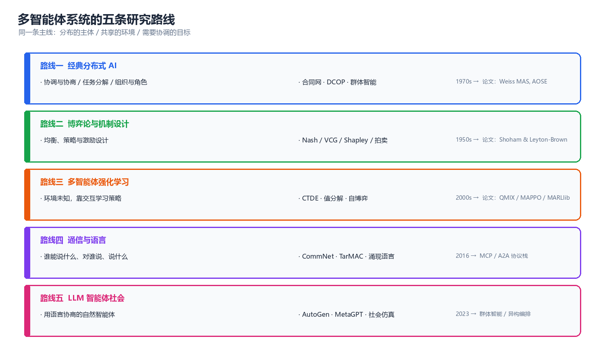
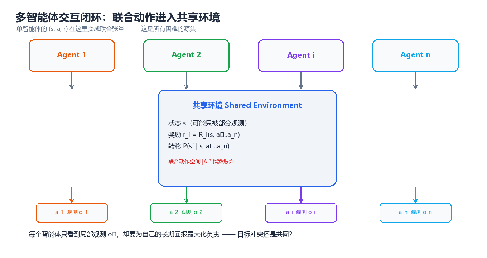
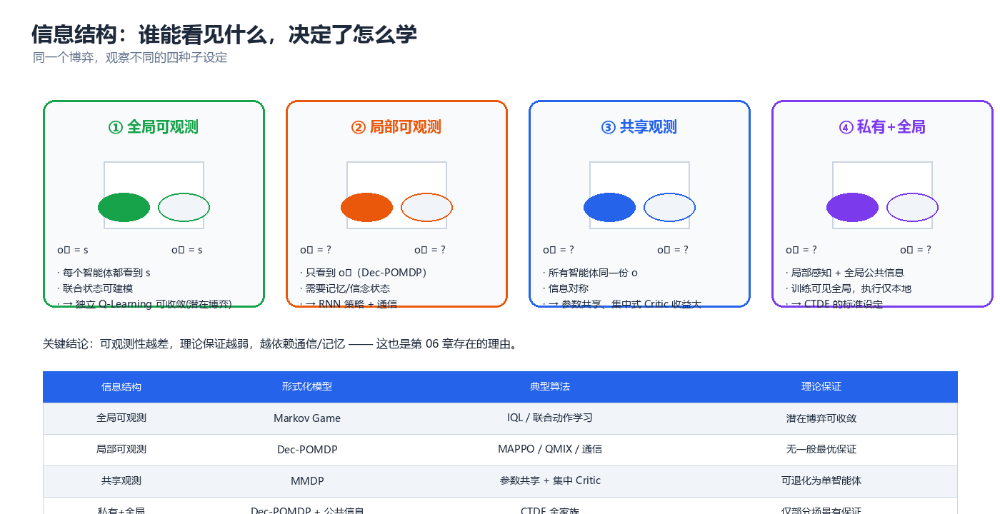
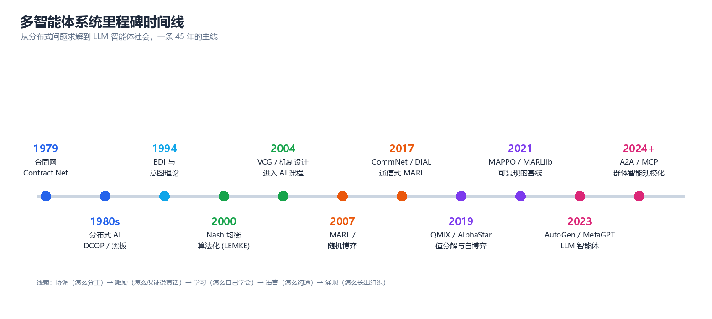

# 多智能体系统概览（Multi-Agent Systems）

> 当决策的主体不止一个，而它们共享同一个世界时，问题就从"怎么学一个策略"变成了"怎么在别人的策略里活下来、并一起把事办成"。本知识库按三条主线展开：**经典分布式 AI（协调与组织）→ 博弈论与机制设计（激励与均衡）→ 多智能体学习与 LLM 智能体社会（学习与语言）**。

---

## 一、多智能体系统的设计哲学



*图：五条研究路线共享同一条主线 —— 分布的主体、共享的环境、需要协调的目标。*

### 1.1 什么是多智能体系统

多智能体系统（Multi-Agent System, MAS）指的是**由多个自主决策主体构成、在共享环境中交互的系统**。三个关键词缺一不可：

| 关键词 | 含义 | 反例（不构成 MAS） |
|--------|------|-------------------|
| **多个主体** | 存在 ≥2 个独立决策者，各有自己的观测与目标 | 单个 RL 智能体控制多个关节 |
| **自主性** | 每个主体自己决定行动，不能被中心随意改写 | 中心调度器直接下发全部动作 |
| **交互** | 一个主体的收益/状态转移受其他主体影响 | 多个智能体各自解决互不相干的任务（可分解 → 退化为并行单智能体） |

按这个定义，一个多线程后端服务不是 MAS（线程没有目标函数），但**多个互相调用的微服务 + 各自的 SLA 优化目标**就是（这也是为什么 MAS 的研究结论能直接用在分布式系统调优上）。

### 1.2 为什么"分布"是必然的，而不只是设计选择

工程上选择多主体架构，通常不是因为"优雅"，而是因为下面四个约束里至少中了一个：

1. **物理分布** —— 车队、无人机、传感器网络：数据天然产生在各地，集中收集有延迟与带宽成本。
2. **规模与可扩展性** —— 单体决策的计算与状态空间随主体数指数增长（见 §2.1 的代码），分而治之是唯一出路。
3. **私有信息与激励** —— 各主体掌握不同信息、有不同利益（电网竞价、广告竞价、跨部门协作），必须靠机制而非指令。
4. **鲁棒性** —— 任何单点失效都不应导致整体崩溃（分布式的容错优势与一致性代价一体两面，见第 07 章）。

> **核心思想**：多智能体不是"把单智能体复制 n 份"。分布的代价是**信息不完备**与**目标不一致**，收益是**可扩展、鲁棒、能表达多种利益**。整个学科就是在支付前者的代价、换取后者的收益。

### 1.3 三条基本张力

整个 MAS 领域的算法与结论，几乎都可以看作是这三组张力的取舍：

| 张力 | 一端 | 另一端 | 典型折中方案 |
|------|------|--------|-------------|
| **自主 vs 协调** | 各主体自己决策（快、松耦合） | 统一调度（全局最优） | CTDE（集中训练、分布执行，第 05 章） |
| **局部 vs 全局** | 只看本地观测（可部署） | 掌握全局信息（更聪明） | 通信 + 记忆（第 06 章） |
| **竞争 vs 合作** | 各自最大化自己的收益 | 团队社会最优 | 机制设计让"自利 = 利他"（第 04 章） |

### 1.4 经典格言背后的思想

| 格言 | 出处 | 对多智能体的意义 |
|------|------|-----------------|
| "个体的理性可能导致集体的非理性。" | 囚徒困境（Tucker, 1950） | 自利均衡 ≠ 社会最优，这是机制设计存在的根本理由 |
| "你无法用一个人工系统解决一个本质上是分布的问题，除非它本身是分布的。" | 分布式 AI 的动机 | 中心化调度在规模上不可行，这不是工程妥协而是结构必然 |
| "在人群里，没有哪个智能体能准确预测其他人的下一步。" | 非平稳性（Hernandez-Leal et al., 2017） | 多智能体 RL 的核心困难：环境在学习，所以"静止"假设失效 |
| "语言是把协调压缩成信息的工具。" | 通信式 MARL 的共识 | 通信把联合动作空间的搜索，转化为低维信息交换 |
| "系统越自主，越需要监控；一致性的代价永远存在。" | 分布式系统实践 | 可扩展性与一致性不可兼得（CAP），必须显式选择 |

---

## 二、核心概念：五要素与从 MDP 到 Markov Game



*图：单智能体的 (s, a, r) 在这里变成联合张量 —— 这就是所有困难的源头。*

### 2.1 从 MDP 到 Markov Game：形式化的升级

单智能体 RL 的基本模型是 MDP $(S, A, P, R, \gamma)$。多个主体共享环境后，模型升级为**随机博弈（Stochastic Game）/ Markov Game**：

$$
\mathcal{M} = \left\langle n,\ S,\ \{A_i\}_{i=1}^{n},\ P,\ \{R_i\}_{i=1}^{n},\ \gamma \right\rangle
$$

| 要素 | 单智能体 MDP | 多智能体 Markov Game | 带来的新问题 |
|------|-------------|---------------------|-------------|
| 动作 | $a \in A$ | 联合动作 $\mathbf{a} = (a_1,\dots,a_n) \in \prod_i A_i$ | 联合动作空间随 $n$ **指数爆炸** |
| 转移 | $P(s'\mid s,a)$ | $P(s'\mid s,\mathbf{a})$ | 每个动作都依赖所有主体的选择 |
| 奖励 | $R(s,a)$ | $R_i(s,\mathbf{a})$，可共享可冲突 | 目标可能不一致 → 需要解概念 |
| 观测 | 通常 $s$ | $o_i = O_i(s;\mathbf{a})$ | 部分可观测 → Dec-POMDP，理论保证变弱 |
| 策略 | $\pi(a\mid s)$ | $\pi_i(a_i\mid \tau_i)$，$\tau_i$ 为动作-观测历史 | 策略互为目标 → 非平稳性 |

当所有主体共享同一份奖励时（$R_1 = \dots = R_n$），模型退化为 **MMDP**（多智能体 MDP），这是合作型 MARL 的标准设定；当只剩两个主体且奖励互为相反数（$R_1 = -R_2$）时，退化为零和随机博弈，可用极小极大求解。

**先感受一下"指数"有多快**：

```python
# 多智能体规模的"两个指数": 联合动作空间 与 联合策略组合空间
n_actions = 4              # 每个智能体 4 个可选动作
for n_agents in (2, 5, 10, 20):
    joint = n_actions ** n_agents              # 联合动作组合数
    print(f"智能体数 n={n_agents:2d}  联合动作空间 |A|^n = {joint:,}")
# 预期输出:
# 智能体数 n= 2  联合动作空间 |A|^n = 16
# 智能体数 n= 5  联合动作空间 |A|^n = 1,024
# 智能体数 n=10  联合动作空间 |A|^n = 1,048,576
# 智能体数 n=20  联合动作空间 |A|^n = 1,099,511,627,776
```

**再看一个"个体理性 ≠ 集体理性"的最小例子**（这就是第 03、04 两章的起点）：

```python
# 囚徒困境: 用最佳回应迭代求纯策略纳什均衡
payoff = {                    # (行动作, 列动作) -> (行收益, 列收益)
    ("C", "C"): (3, 3),       # 双方合作
    ("C", "D"): (0, 5),       # 我行合作, 对方背叛
    ("D", "C"): (5, 0),
    ("D", "D"): (1, 1),       # 双方背叛
}
actions = ["C", "D"]

def best_response(opponent_action, row):
    """给定对手动作, 求自己的最佳回应 (row=True 表示行玩家)"""
    best, best_v = None, -1e9
    for a in actions:
        v = (payoff[(a, opponent_action)][0] if row
             else payoff[(opponent_action, a)][1])
        if v > best_v:
            best, best_v = a, v
    return best

row_a, col_a = "C", "C"       # 从(合作, 合作)出发
for step in range(1, 6):
    new_row = best_response(col_a, True)
    new_col = best_response(row_a, False)
    print(f"第{step}轮: 行={new_row} 列={new_col}  收益={payoff[(new_row, new_col)]}")
    if (new_row, new_col) == (row_a, col_a):
        print(f"收敛 → 均衡 ({new_row}, {new_col}), "
              f"但社会最优是 (C, C) 收益 {payoff[('C', 'C')]}")
        break
    row_a, col_a = new_row, new_col
# 预期输出:
# 第1轮: 行=D 列=D  收益=(1, 1)
# 第2轮: 行=D 列=D  收益=(1, 1)
# 收敛 → 均衡 (D, D), 但社会最优是 (C, C) 收益 (3, 3)
```

个体最优的均衡 (D, D) 收益只有 1，而社会最优 (C, C) 收益是 3 —— **没有任何一方能单方面改变它**。要让系统停在 (C, C)，只能改变激励结构本身（重复博弈的声誉、契约、惩罚机制），这正是第 04 章。

### 2.2 观察与信息结构



*图：同一个博弈，四种观察设定 —— 可观测性越差，理论保证越弱，越依赖通信与记忆。*

| 信息结构 | 形式化模型 | 典型算法 | 理论保证 |
|---------|-----------|---------|---------|
| 全局可观测 | Markov Game | IQL、联合动作学习 | 势博弈设置下可收敛 |
| 局部可观测 | Dec-POMDP | MAPPO、QMIX、通信式 MARL | 无一般最优性保证 |
| 共享观测 | MMDP | 参数共享 + 集中式 Critic | 可退化为单智能体问题 |
| 私有 + 公共信息 | Dec-POMDP + 公共信号 | CTDE 全家族 | 仅部分场景有保证 |

### 2.3 解概念全景：什么叫"解"

单智能体 RL 的"解"是唯一的最优策略；多智能体的"解"是**一组互相为最佳回应的策略**，而且往往不唯一。常用解概念及其强度关系：

$$
\text{占优均衡} \subset \text{纳什均衡} \subset \text{相关均衡} \qquad \text{纳什} \not\subseteq \text{社会最优}
$$

| 解概念 | 直觉定义 | 存在性 | 计算复杂度 |
|--------|---------|--------|-----------|
| 占优均衡 | 无论别人怎么做，我的这个策略都最好 | 常不存在 | 多项式 |
| 纳什均衡 | 给定别人不动，没人愿单独偏离 | 有限博弈必存在 | PPAD-完全 |
| 相关均衡 | 靠公开信号协调，无人愿偏离建议 | 总存在（凸多面体） | 多项式（LP） |
| 社会最优 | 最大化总效用（或按社会福利函数） | 总存在 | 一般 NP-hard |

> **核心思想**：多智能体算法"学到"的几乎总是纳什型解，而**纳什不自动等于社会最优**。"让自利行为产生集体最优结果"这件事不能靠算法保证，只能靠机制设计（第 04 章）。

---

## 三、技术全景：五条研究路线

### 3.1 路线一：经典分布式 AI（协调、协商、组织）

起源最早（1970s），核心问题是"没有中心调度者时，怎么分工"。代表成果：合同网（Contract Net, 1980）、分布式约束优化（DCOP）、分布式 CSP、组织与角色理论、AOSE 方法学。

- **关键抽象**：任务分解、承诺（commitment）、约定（convention）、角色。
- **今日仍在用**：任务分配、微服务编排、多机器人调度、供应链协调。
- **延伸**：第 07 章。

### 3.2 路线二：博弈论与机制设计（均衡、激励）

数学基础最扎实的一条。核心问题：给定一组自利主体，会停在哪里（均衡）？如果我希望它们停在某个地方，该怎么设计规则（机制）？

- **关键抽象**：策略、均衡、占优、真实性（truthfulness）、无政府代价（Price of Anarchy）。
- **经典结果**：纳什存在性（Kakutani 不动点）、VCG 机制的唯一性、Arrow 不可能定理、Gale-Shapley 稳定匹配、Shapley 值。
- **延伸**：第 03 章（均衡）、第 04 章（机制设计）。

### 3.3 路线三：多智能体强化学习（环境未知，靠交互学习）

当转移与奖励未知、不能解析求解时，只能学。这是本知识库技术密度最高的一条线。

- **关键抽象**：非平稳性、信用分配、IGM 值分解、CTDE、自博弈。
- **算法家族**：IQL（独立学习）→ VDN/QMIX/QTRAN/QPLEX（值分解）→ MADDPG/MAPPO（策略梯度）→ 种群训练。
- **延伸**：第 05 章（完整正文），强化学习第 09 章给出过精简版概览。

### 3.4 路线四：通信与语言（说什么、对谁说）

部分可观测下，信息不对称只能靠通信弥补。但"能通信"并不等于"会通信"。

- **关键抽象**：消息、信道、带宽预算、寻址、涌现协议。
- **代表工作**：CommNet、DIAL（离散符号 + 直通估计）、IC3Net（学会何时说话）、TarMAC（定向寻址）。
- **今日工程接口**：MCP（模型↔工具）、A2A（智能体↔智能体）、FIPA-ACL（经典语义层）。
- **延伸**：第 06 章。

### 3.5 路线五：LLM 智能体社会（用语言协商的自然智能体）

2023 年后爆发的一条线：把语言模型当作智能体的"推理内核"，用自然语言而非张量消息来协商。

- **关键抽象**：角色、共享上下文、记忆与反思、编排拓扑、成本预算。
- **代表工作**：Generative Agents（社会仿真）、AutoGen / MetaGPT / CAMEL / ChatDev（协作框架）、A2A / MCP（互操作协议）。
- **关键区别**：前面四条路线的智能体是"策略函数"，这里的智能体是"带工具的语言模型" —— 于是错误模式完全不同（幻觉传染、无限自省、成本爆炸）。
- **延伸**：第 08 章。

### 3.6 五条路线对比

| 路线 | 智能体是什么 | 核心数学 | 信息从哪来 | 主要失败模式 | 章节 |
|------|-------------|---------|-----------|-------------|------|
| 经典分布式 AI | 有角色的协作单元 | 搜索、约束、图论 | 显式消息 | 死锁、收敛慢 | 07 |
| 博弈论与机制设计 | 理性的效用最大化者 | 不动点、凸优化 | 假设全知 | 均衡不唯一/不高效 | 03、04 |
| 多智能体 RL | 参数化策略 | 随机逼近、随机博弈 | 交互样本 | 非平稳、不收敛 | 05 |
| 通信与语言 | 会发消息的策略 | 信息论、表示学习 | 学习到的信道 | 符号坍塌、协议不可迁移 | 06 |
| LLM 智能体社会 | 语言模型 + 工具 | 提示工程 + 编排 | 自然语言 | 幻觉传染、成本爆炸 | 08 |

---

## 四、技术选型框架

### 4.1 问题建模速查表

| 你的问题特征 | 推荐建模 | 推荐方法 | 不要用 |
|-------------|---------|---------|--------|
| 主体数少、动作离散、转移已知 | 随机博弈 + 解析 | 值迭代 / 极小极大 Q | 深度 RL（样本浪费） |
| 任务可分解、通信可靠 | 经典协调 | 合同网 / CBBA / DCOP | CTDE（过度设计） |
| 局部观测、需要协作、环境未知 | Dec-POMDP | MAPPO / QMIX / 通信式 MARL | 独立 Q-Learning |
| 零和、对手强大 | 零和随机博弈 | 自博弈 + 种群训练 / CFR | 单智能体 RL |
| 利益冲突、规则由你定 | 机制设计 | VCG / 拍卖 / 声誉机制 | 直接训练（学不出真实性） |
| 任务开放、需要语言与常识 | LLM 编排 | 层级/流水线编排 + 校验节点 | 全自治多智能体群聊 |

### 4.2 什么时候**不该**用多智能体

这一节比上面那节更重要，因为多智能体的失败案例大多源于"本不该拆"：

1. **任务可分解为互不影响的子任务** → 直接并行，不需要任何协调机制。
2. **上下文高度集中、单步明确** → 拆成多个 LLM 智能体只会引入通信开销与错误传播（第 08 章有量化对比）。
3. **通信成本高于协调收益** → 例如实时控制回路里，通信延迟会直接吃掉收益。
4. **你需要的只是"并行"，不是"协商"** → 工程上用队列 + 工作池即可，不需要智能体。

> **核心思想**：多智能体是**为分布而付代价**的架构。先问"这些主体是否真的无法被一个决策者统一处理"，再谈算法。

---

## 五、技术全景与学习路径



*图：从分布式问题求解到 LLM 智能体社会，一条 45 年的主线。*

### 5.1 学习路径（按 1–2 小时/天估算）

| 阶段 | 时间 | 内容 | 里程碑（能做什么） |
|------|------|------|------------------|
| 第一阶段：概念地基 | 第 1–2 周 | 第 01、02 章：定义、分类、信息结构、智能体架构 | 能判断一个问题是否属于 MAS，并画出交互图 |
| 第二阶段：博弈与激励 | 第 3–5 周 | 第 03、04 章：均衡、机制设计、拍卖、Shapley | 能形式化一个多主体问题并求出/近似均衡 |
| 第三阶段：学习 | 第 6–9 周 | 第 05 章 + 强化学习第 09 章：MARL 全家族 | 能在 PettingZoo/SMAC 上跑通 QMIX 与 MAPPO 并解释差异 |
| 第四阶段：通信与协调 | 第 10–12 周 | 第 06、07 章：通信式 MARL、DCOP、一致性、群体智能 | 能设计通信结构与任务分配机制 |
| 第五阶段：系统工程 | 第 13–15 周 | 第 08、09 章：LLM 编排、基准、评估协议 | 能搭建并**可复现地评估**一个多智能体系统 |
| 第六阶段：落地 | 第 16 周+ | 第 10 章：应用、安全、可扩展性 | 能在一个真实场景里判断"多体是否值得" |

### 5.2 推荐阅读顺序

- **零基础**：01 → 02 → 03 → 05 → 06 → 07 → 04 → 08 → 09 → 10（先建立直觉，再回头补机制设计）
- **有 RL 基础**：03 → 05 → 06 → 07 → 04 → 08 → 09 → 10 → 01 → 02
- **工程导向**：01 → 04 → 07 → 09 → 08 → 10 → 05 → 06 → 03 → 02
- **只想做 LLM 智能体**：08 → 06 → 07 → 04 → 09 → 10（但请务必读完 01 的信息结构一节）

---

## 六、章节导航

| 章节 | 主题 | 解决什么问题 |
|------|------|-------------|
| [**01 系统基础**](./01-foundations.md) | 定义、分类、信息结构、解概念地图 | 把现实问题映射成 MAS 模型 |
| [**02 智能体架构**](./02-agent-architectures.md) | 反应式/慎思式/BDI/LLM Agent | 单个智能体内部怎么组织 |
| [**03 博弈论基础**](./03-game-theory.md) | 博弈形式、均衡、求解算法 | 主体之间会停在哪里 |
| [**04 机制设计与社会选择**](./04-mechanism-design.md) | 投票、拍卖、VCG、匹配、Shapley、声誉 | 如何让自利产生集体最优 |
| [**05 多智能体强化学习**](./05-marl.md) | Markov Game、值分解、COMA、MADDPG/MAPPO、自博弈 | 环境未知时怎么学出协作策略 |
| [**06 通信与协同**](./06-communication.md) | 通信式 MARL、涌现语言、MCP/A2A、ACL | 信息不对称怎么补 |
| [**07 协调与协商**](./07-coordination-negotiation.md) | DCOP、任务分配、协商、一致性、群体智能 | 没有中心时怎么分工与达成一致 |
| [**08 LLM 多智能体**](./08-llm-multi-agent.md) | 编排范式、框架对比、社会仿真、失败模式 | 用语言模型搭系统时怎么做不翻车 |
| [**09 工具与环境**](./09-tools-environments.md) | PettingZoo、MARLlib、SMAC、评估协议 | 怎么训练与**可复现地**评估 |
| [**10 应用与前沿**](./10-applications-frontier.md) | 应用地图、异构群体智能、安全、开放问题 | 落地时真正会遇到什么 |

---

## 七、理论框架总览：三大核心定理

### 7.1 三大核心定理

整个多智能体系统的理论骨架，可以压缩成三个"存在性/唯一性"结论：

| # | 定理 | 陈述 | 解决了什么 | 章节 |
|---|------|------|-----------|------|
| 1 | **纳什存在性定理**（Nash, 1950；Kakutani 不动点） | 任何有限博弈（允许混合策略）至少存在一个纳什均衡 | 保证了"解"一定存在，使得均衡分析有意义 | 03 |
| 2 | **VCG 唯一性/真实性**（Vickrey-Clarke-Groves, 1961–73） | 在自由竞争条件下，VCG 是唯一同时满足**真实性**与**社会最优**的机制 | 保证了"设计规则让自利 = 利他"是可行的 | 04 |
| 3 | **IGM 与单调性条件**（QMIX, 2018） | 若混合网络对每个 $Q_i$ 单调不减，则分布式贪心执行等价于联合最优 | 保证了 CTDE 的合法性：训练看全局、执行看局部 | 05 |

### 7.2 三个定理如何串起全书

$$
\underbrace{\text{均衡一定存在}}_{\text{定理 1：我们能分析}}
\ \Longrightarrow\
\underbrace{\text{可以设计规则导向好均衡}}_{\text{定理 2：我们可以干预}}
\ \Longrightarrow\
\underbrace{\text{可以分布式地学出该均衡}}_{\text{定理 3：我们能工程实现}}
$$

- **定理 1** 是"分析合法性"：没有它，多智能体的博弈分析无从谈起。
- **定理 2** 是"干预合法性"：它把自利与效率之间的矛盾变成可设计的对象。
- **定理 3** 是"工程合法性"：它说明了为什么去中心化执行不是妥协，而是可以在数学上等价的。

### 7.3 理论地图与学习路线

| 你想做的事 | 需要的理论 | 必读章节 |
|-----------|-----------|---------|
| 判断一个系统会不会收敛 | 势博弈、随机逼近、非平稳性 | 03 §理论进阶、05 §理论进阶 |
| 设计一个不会被套利的机制 | 真实性、个体理性、VCG、不可能定理 | 04 §理论进阶 |
| 把联合策略拆成能分布执行的策略 | IGM、单调性、值分解 | 05 §理论进阶 |
| 保证通信方案的信息论下界 | 通信复杂度、信息瓶颈 | 06 §理论进阶 |
| 论证一套分布式一致性方案的安全性 | FLP、拜占庭阈值、CAP | 07 §理论进阶 |

### 7.4 理论深度的取舍建议

不需要全部读透，按需选择：

| 你的角色 | 建议深度 | 可以跳过的 |
|---------|---------|-----------|
| 应用工程师 | 记住三个定理的**结论与前提**即可 | 全部证明、PPAD 复杂度 |
| 算法研究员 | 定理 1/3 的证明必读，定理 2 至少读反证思路 | 度量空间细节 |
| 系统架构师 | 定理 1 结论 + 定理 3 前提 + FLP/CAP | 均衡算法实现 |
| LLM 应用开发者 | 定理 1 结论 + 第 07 章容错 + 第 08 章失败模式 | 全部数学证明 |

> **下一步**：理论骨架已就位，接下来进入 [第 01 章 系统基础](./01-foundations.md)，把"现实问题"正式翻译成"多智能体模型"。
