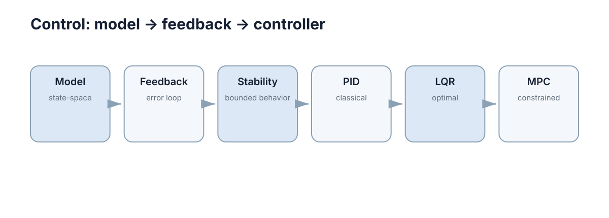

# Dynamic Models & State Space

控制问题的第一步不是选 PID、LQR 或 MPC，而是回答：**系统现在处于什么状态，输入会怎样改变它，下一时刻会发生什么。** 动态模型就是把这三个问题写成数学关系。

<figure markdown="span">
  
  <figcaption>控制理论从“状态如何随输入演化”开始，再讨论反馈和控制器。</figcaption>
</figure>

## 静态模型与动态状态

代数关系 $y=f(u)$ 只说明当前输入和当前输出的对应关系，但真实机器人、电机和车辆都有惯性：同样的油门，在不同速度下产生的后果不同；同样的位置误差，在不同速度方向下也需要不同控制。

因此控制系统必须引入**状态（state）**。状态是一组足以预测未来演化的变量，例如小车的位置和速度

$$
x=\begin{bmatrix}p\\v\end{bmatrix}.
$$

给定当前 $x(t)$ 和控制输入 $u(t)$，模型就能描述下一瞬间状态如何改变。

## 连续时间状态方程

一般形式为

$$
\dot x=f(x,u),\qquad y=h(x,u),
$$

其中 $x$ 是状态，$u$ 是控制输入，$y$ 是可测或关心的输出。若系统在工作点附近近似线性，可以写成

$$
\dot x=Ax+Bu,\qquad y=Cx+Du.
$$

矩阵 $A$ 描述“系统自身怎样演化”，$B$ 描述“输入怎样作用于状态”。这两个矩阵比某个具体控制器更基础，因为后面的稳定性、LQR 和 MPC 都直接依赖它们。

## 高阶系统的状态空间表示

考虑质量—弹簧—阻尼系统

$$
m\ddot p+c\dot p+kp=u.
$$

令 $x_1=p$、$x_2=\dot p$，就得到

$$
\begin{aligned}
\dot x_1 &= x_2,\\
\dot x_2 &= -\frac{k}{m}x_1-\frac{c}{m}x_2+\frac{1}{m}u.
\end{aligned}
$$

也就是

$$
\dot x=
\begin{bmatrix}
0&1\\
-k/m&-c/m
\end{bmatrix}x+
\begin{bmatrix}
0\\1/m
\end{bmatrix}u.
$$

这一步很重要：无论原方程是二阶还是更高阶，都可以通过增加状态变量统一成一阶向量形式。

## 连续模型的离散化

控制器运行在计算机上，只能每隔 $\Delta t$ 更新一次。连续模型因此要变成

$$
x_{k+1}=A_dx_k+B_du_k.
$$

最简单的欧拉离散化是

$$
x_{k+1}\approx x_k+\Delta t\,f(x_k,u_k).
$$

它直观但步长太大时误差会明显，因此仿真和控制中必须把**采样周期**当成模型的一部分，而不是随便选一个数。对线性系统，精确离散化满足

$$
A_d=e^{A\Delta t},\qquad
B_d=\int_0^{\Delta t}e^{A\tau}B\,d\tau.
$$

欧拉法则用 $A_d\approx I+A\Delta t$、$B_d\approx B\Delta t$ 近似它。这个关系解释了离散模型为何依赖采样周期，以及过大的 $\Delta t$ 为什么会改变模型的稳定性。

## 状态选择与可观测量

状态需要足够预测未来，但不要求全部直接测到。车辆的速度可以由编码器估计，姿态可以由 IMU 与视觉融合得到。反过来，把大量与未来无关的量都塞进状态，只会增加估计和控制复杂度。

实际建模时可以按三步检查：

1. **是否缺变量**：同样的状态和输入是否可能产生明显不同的未来？
2. **是否能获得**：状态是直接测量，还是需要估计？
3. **模型是否够用**：当前控制频率和任务精度是否真的需要更复杂的动力学？

模型的目标不是最大程度还原物理世界，而是以足够低的复杂度支持预测和控制。

## 模型阶数与可辨识性

增加状态可以提高表达能力，但也会增加需要估计的未知量。若传感器无法区分两个内部变量，再复杂的模型也难以从数据中可靠辨识。建模时应同时考虑动力学需要和观测能力，使状态既足够预测未来，又能够被测量或估计。
