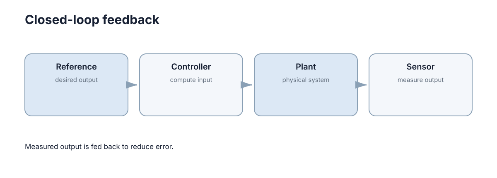

# 反馈控制与稳定性

反馈控制的核心思想很简单：**不要只相信模型预先算好的动作，而要不断测量实际结果，用误差修正下一步输入。** 这也是机器人能够抵抗扰动、模型误差和负载变化的根本原因。

<figure markdown="span">
  
  <figcaption>闭环控制持续比较目标与实际输出，再根据误差调整输入。</figcaption>
</figure>

## 一、开环控制为什么容易失准

开环系统直接执行预先计算的输入，例如“给电机 30% 电压持续 2 秒”。如果地面摩擦、负载或电池电压发生变化，最终位置就会偏离预期，因为控制器没有看到实际结果。

闭环则测量输出 $y(t)$，与目标 $r(t)$ 比较得到误差

$$e(t)=r(t)-y(t),$$

再令控制器根据 $e(t)$ 产生新的输入 $u(t)$。只要测量和执行链仍然有效，扰动造成的偏差就能被后续控制动作纠正。

## 二、负反馈为什么通常能减小误差

最简单的比例反馈为

$$u=K(r-y).$$

若输出低于目标，误差为正，控制器增加输入；输出高于目标时则反向修正。这就是负反馈。它的价值不在某个具体公式，而在于让控制动作依赖**实际状态**，而不是只依赖事先模型。

但反馈增益并非越大越好。增益过高会放大测量噪声、让执行器频繁饱和，并且在存在延迟时更容易产生振荡。

## 三、稳定性回答“扰动后会不会回来”

稳定和“误差当前是否很小”不是一回事。一个系统现在恰好在目标附近，但稍微受到扰动就不断发散，它仍然是不稳定的。

对线性连续系统

$$\dot x=Ax,$$

若 $A$ 的所有特征值实部都小于零，状态会随时间衰减；离散系统 $x_{k+1}=Ax_k$ 则要求特征值位于单位圆内。入门阶段不必展开完整稳定性证明，但必须建立一个概念：**控制器首先要保证系统不发散，然后才谈快慢和精度。**

## 四、性能通常从响应曲线读出来

给系统一个阶跃目标，可以观察几个直观指标：

- **上升时间**：多快接近目标；
- **超调**：是否冲过目标太多；
- **稳定时间**：多久进入并保持在允许误差范围；
- **稳态误差**：最后是否仍有长期偏差。

它们之间往往存在权衡。更激进的控制可以缩短上升时间，却可能带来更大超调和更强振荡。

## 五、延迟会把“纠偏”变成“追着过去纠偏”

传感、通信、计算和执行都会引入延迟。若控制器看到的是 100 ms 以前的状态，它给出的修正可能已经不适合当前系统。高增益控制在这种情况下尤其容易振荡。

因此真实系统的稳定性不仅由控制公式决定，还由**采样周期、网络延迟、传感噪声和执行器响应**共同决定。很多“算法在仿真稳定、实机振荡”的问题，本质上是闭环时序发生了变化。
