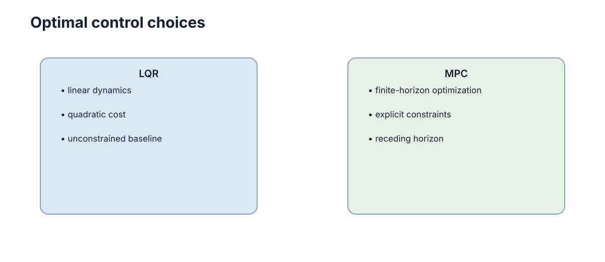

# Optimal Control & LQR

PID 主要从误差形状出发调节输入，LQR 则先问一个更系统的问题：**怎样在“状态偏差小”和“控制动作不要太激烈”之间找到最优折中？**

## LQR 代价函数

考虑离散线性系统

$$x_{k+1}=Ax_k+Bu_k.$$

LQR 使用二次代价

$$
J=\sum_{k=0}^{\infty}\left(x_k^\top Qx_k+u_k^\top Ru_k\right).
$$

第一项惩罚状态偏离目标，第二项惩罚控制输入过大。$Q$ 和 $R$ 不只是数学参数，它们表达了设计者真正关心的权衡。

## 最优控制的反馈形式

对上述线性系统和二次代价，可以证明最优控制具有

$$u_k=-Kx_k$$

的形式。也就是说，虽然问题是“优化整段未来代价”，结果却可以压缩成一个实时线性反馈矩阵 $K$。$K$ 由 Riccati 方程求得。

这正是 LQR 的吸引力：离线完成矩阵求解，在线只需要一次矩阵乘法。

## $Q$ 和 $R$ 决定控制器怕什么

若 $Q$ 中位置误差权重大，控制器会更积极把位置拉回目标；若 $R$ 很大，控制器会更节制使用执行器，动作更平滑但响应也可能更慢。

因此调 LQR 时不应直接手工调 $K$，而应先问：哪些状态最重要？执行器动作成本有多大？不同变量量纲是否需要归一化？

## LQR 依赖一个可以信任的线性模型

LQR 最自然的使用场景是系统本身近似线性，或围绕某个工作点做了局部线性化。例如无人机悬停附近、小车小角度姿态控制、机械系统平衡点附近。

若状态远离线性化工作点，模型可能不再准确；若存在严格速度、转角或碰撞约束，LQR 本身也无法直接表达这些不等式条件。

<figure markdown="span">
  
  <figcaption>LQR 用固定反馈增益实现最优线性控制；MPC 则在每个周期显式优化未来轨迹。</figcaption>
</figure>

## LQR 与 PID、MPC 的关系

PID 不需要完整状态空间模型，适合简单回路；LQR 需要线性模型，但能同时处理多状态、多输入之间的耦合；MPC 进一步把有限时域预测和显式约束纳入在线优化。

三者不是“新算法替代旧算法”的关系，而是面对不同模型复杂度和约束需求的三种工具。

## 权重矩阵的设计含义

$Q$ 与 $R$ 应反映状态偏差和控制代价的相对尺度。若位置、角度和速度单位差异很大，直接使用相同对角权重会隐含不合理偏好。常见做法是先按允许最大偏差归一化，再通过闭环响应微调权重。
