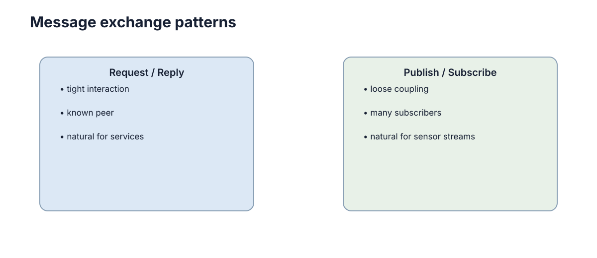

# 网络通信与消息传递

分布式系统的第一事实是：**另一个节点不在本进程里，所有协作都必须经过网络。** 网络会延迟、丢包、重复、断开，因此“调用远端函数”和“调用本地函数”从根本上不是同一件事。

<figure markdown="span">
  
  <figcaption>请求响应适合一次性交互，发布订阅适合持续状态流和事件广播。</figcaption>
</figure>

## TCP 和 UDP 提供的是不同传输语义

TCP 提供可靠、有序的**字节流**。它会重传丢失数据，但不替应用定义消息边界：连续两次 `send()` 在接收端可能被一次 `recv()` 读到，也可能被拆开。

UDP 保留数据报边界、延迟更直接，但可能丢包、乱序或重复。它适合对最新数据更敏感、允许偶尔丢失旧包的场景，例如部分高频状态流。

因此协议选择本质是**可靠性、时延和数据语义**之间的权衡。

### TCP/UDP 的最小接口差异

```python
import socket

tcp = socket.create_connection((host, port), timeout=1.0)
tcp.sendall(frame_message(payload))       # 应用层负责消息边界

udp = socket.socket(socket.AF_INET, socket.SOCK_DGRAM)
udp.sendto(payload, (host, port))         # 一次发送对应一个数据报
```

这只是发送侧骨架。生产系统还要定义长度前缀或帧格式、超时、重连、包大小和身份验证。

## 应用层仍然必须定义什么是一条消息

无论 TCP 还是 UDP，系统都需要定义序列化格式、字段、版本和错误行为。一个任务消息至少要说明任务 ID、发送者、时间戳和状态，而不能只发送一个模糊字符串。

JSON 便于调试，Protobuf/IDL 更适合严格接口和高效传输。格式本身不是重点，**双方对字段语义有共同契约**才是重点。

## Request/Response 与 Publish/Subscribe

查询参数、请求一次规划结果通常适合 request/response：调用方明确等待一个结果。

里程计、传感器和状态事件则更适合 publish/subscribe：发布者只负责把数据发到 Topic，不需要知道有多少订阅者。这样可以降低模块耦合。

```python
subscribers = {"robot.pose": [localizer, recorder]}

def publish(topic, message):
    for consume in subscribers.get(topic, []):
        consume(message)
```

这个内存示例只说明解耦关系；跨进程系统还需要 broker 或 DDS、序列化、背压和交付语义。

## 消息新鲜度

机器人位置即使可靠送达，如果延迟两秒才到，可能已经没有使用价值。因此很多实时系统更关心**新鲜度**而不是“每一条都不能丢”。

消息里常需要时间戳、序列号或 TTL。接收方应能丢弃过期数据，而不是把“收到”误认为“可用”。

## 网络故障后系统要有明确退化模式

链路断开时，系统可以缓存、重试、切换本地控制或进入安全状态，但不能无限阻塞等待远端恢复。尤其机器人控制链中，失联应该触发安全减速或本地自治，而不是继续执行旧指令。

分布式设计最重要的习惯之一是：**任何远程调用都可能失败。**

## 交付保证属于端到端协议

TCP 的可靠字节流并不等于业务操作只执行一次。连接断开时，客户端可能不知道请求是否已在服务端完成。端到端语义仍需依靠请求 ID、幂等处理和业务确认建立，不能只依赖传输层。
