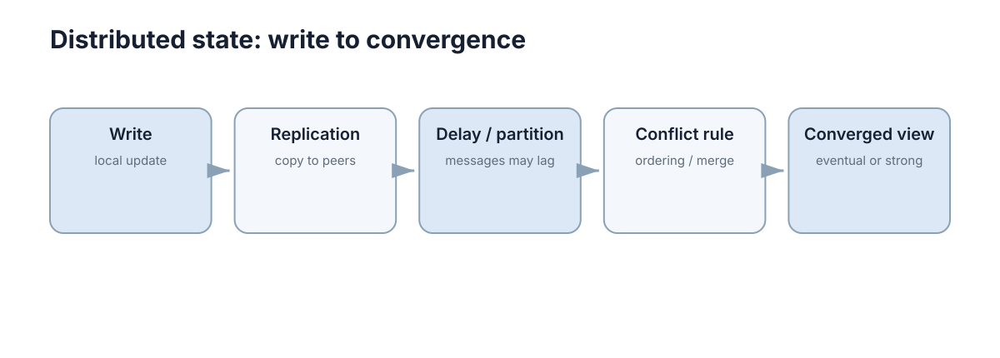

# 一致性与分布式状态

只要同一份逻辑状态存在多个副本，就会出现一个问题：**什么时候这些副本可以被认为“足够一致”？** 不同数据对一致性的要求不同，不能用一个协议解决所有状态。

<figure markdown="span">
  
  <figcaption>一致性问题来自传播延迟和并发写入，而不仅仅是“数据有没有同步”。</figcaption>
</figure>

## 一、先区分“读到旧值”和“发生写冲突”

副本传播需要时间，因此节点 B 暂时没看到 A 的最新写入，这是**stale read**。如果 A 和 B 同时修改同一对象，之后必须决定哪次写入有效或怎样合并，这才是**write conflict**。

两者都表现为“状态不同”，但处理机制并不相同。

## 二、强一致和最终一致描述的是可见语义

强一致类模型希望读操作看到满足明确全局顺序的状态；最终一致允许副本短暂不同，只要停止新写入后最终能够收敛。

机器人急停状态、任务唯一归属通常不能容忍随意冲突；遥测历史、统计指标往往可以晚一点同步。**一致性应该按数据语义选择。**

## 三、版本号可以把静默覆盖变成显式冲突

若两个节点都读取 version=7，之后分别写回，接口可以要求“只有当前版本仍为 7 才允许更新”。第一个成功后版本变为 8，第二个就能发现自己基于旧数据操作。

```python
def update_if_version(record, expected, new_owner):
    if record["version"] != expected:
        return False
    record["owner"] = new_owner
    record["version"] += 1
    return True
```

这类 compare-and-swap 思想并没有消灭并发，而是让并发冲突变得可检测。

## 四、最简单的冲突处理方式往往是避免多人同时写

若业务允许，可以规定某类状态只有一个权威 writer，其他节点只订阅。这比设计复杂合并规则更容易验证。

只有在确实需要多点写入时，才需要版本、锁、事务、共识或可合并数据结构等更复杂机制。

## 五、CAP 讨论的是网络分区期间的取舍

当网络已经分区，系统无法同时保证所有请求都立即得到成功响应，并且所有节点仍保持强一致语义。它不是“任何分布式系统永远只能在 C/A/P 里选两个”的简单口号。

工程上更有用的问题是：**分区发生时，这类数据宁愿拒绝部分请求，还是允许短暂不一致？**
