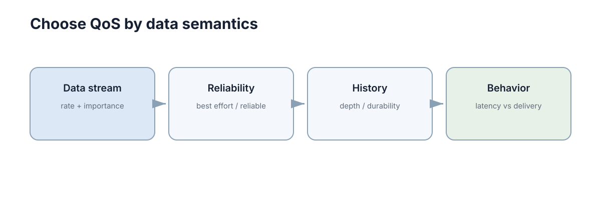

# Middleware: DDS & ROS2

> **Section:** Distributed Systems & Networking

## Why it matters

中间件把发现、序列化、传输、QoS 和接口抽象封装起来，让应用代码聚焦于数据和任务。

<figure markdown="span">
  
  <figcaption>高频传感器流与关键低频状态通常需要不同的 QoS。</figcaption>
</figure>

## Core ideas

- **Middleware**：位于应用与网络之间的通信抽象。
- **DDS**：ROS2 默认使用的 data-centric pub-sub 标准族。
- **QoS**：可靠性、历史深度、deadline 等通信策略。
- **ROS graph**：节点、topic、service、action 的逻辑连接。

## Key theory

ROS2 的价值不是“替代 TCP/UDP”，而是把发现、类型、消息传输和 QoS 组织成统一接口。不同数据流应设置不同 QoS，而不是全局一个配置。

## Representative methods

- Best effort：高频传感器常见。
- Reliable：关键低频状态/命令常见。
- Durability/history：决定晚加入节点能否拿到历史样本。

## Minimal code

ROS2 中 QoS 是接口语义的一部分。下面只展示一个常见的“保留最近 5 条、尽力而为”配置。

```python
from rclpy.qos import QoSProfile, ReliabilityPolicy

sensor_qos = QoSProfile(depth=5)
sensor_qos.reliability = ReliabilityPolicy.BEST_EFFORT
# publisher/subscription 创建时把 sensor_qos 传进去
```

## Worked example

相机图像可以 best effort 降低阻塞风险；地图或关键配置常更适合 reliable，并根据场景决定是否保留历史。

## Connections

- → Robotics：导航栈通过 ROS2 中间件连接。
- → MAS：P2P 状态共享可以建立在 DDS topic 上。

## Further Reading

- DDS discovery tuning、其他机器人中间件。

> 这一部分不属于主学习路径；需要做论文、项目或深入证明时再回来查。

## Learning path

[← Section overview](index.md) · [← Fault Tolerance](04-fault-tolerance.md)
