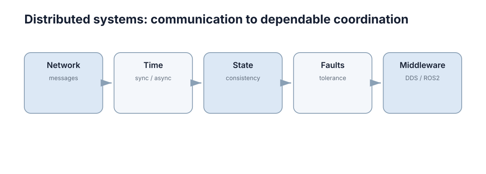

# Distributed Systems

分布式系统部分解释多个计算节点如何通过网络交换消息、处理异步、维护状态并容忍故障，并以 ROS2/DDS 作为工程落点。

<figure markdown="span">
  
  <figcaption>Distributed Systems 的核心概念关系。</figcaption>
</figure>

## 内容

1. [网络通信与消息传递](01-network-messaging.md)
2. [分布式系统中的时间与异步](02-distributed-time.md)
3. [一致性与分布式状态](03-consistency-state.md)
4. [故障与容错](04-fault-tolerance.md)
5. [中间件、DDS 与 ROS2](05-middleware-ros2-dds.md)
