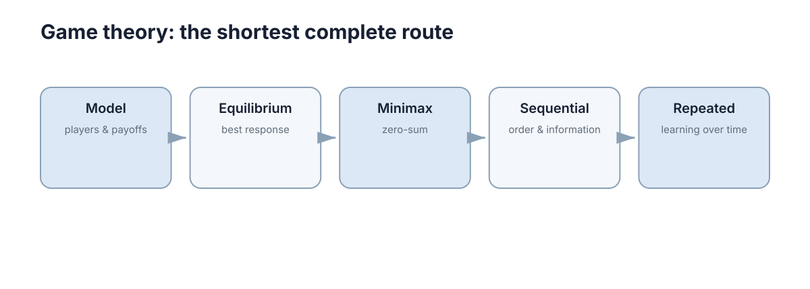

# Game Models & Classification

博弈论研究的不是“怎样打游戏”，而是**当多个决策者的结果彼此依赖时，怎样描述每个人的选择和利益。** 与普通优化最大的不同是：你的最佳动作取决于别人会做什么。这意味着单个智能体的「最优策略」这个概念本身是不完整的，必须附带「在谁的什么行为假设下」。

本章只做一件事：把「描述一个博弈」所需的全部要素固定下来。均衡怎么算、怎么解，是后续四章的任务；但如果这里的要素写错了，后面无论算法多精确，结论都指向另一个问题。

<figure markdown="span">
  
  <figcaption>先把参与者、行动、收益、时序和信息结构写清，才能讨论均衡。</figcaption>
</figure>

## 一个博弈至少要说明三件事

有限博弈可写成

$$
G=(\mathcal N,\{\mathcal A_i\}_{i\in\mathcal N},\{u_i\}_{i\in\mathcal N}),
$$

其中 $\mathcal N=\{1,\dots,n\}$ 是玩家集合，$\mathcal A_i$ 是玩家 $i$ 可选动作，$u_i(\mathbf a)$ 给出联合动作 $\mathbf a\in\mathcal A=\prod_i\mathcal A_i$ 下玩家 $i$ 的收益。

三个要素缺一不可，且各有容易写错的地方：

| 要素 | 符号 | 取值范围 | 常见写错方式 |
| --- | --- | --- | --- |
| 玩家集合 | $\mathcal N$ | 有限或无限 | 把「一个团队」当成一个玩家，忽略了团队内部的激励冲突 |
| 动作集合 | $\mathcal A_i$ | 离散 / 连续 | 把可控变量和可观测量混在一起，把观测写进动作集 |
| 收益函数 | $u_i$ | 序数或基数 | 单位不明（时间？电量？成本？），导致后续无法比较和加权 |

收益不是“物理奖励”本身，而是对结果偏好的数学表达。同一个物理结果，在不同的任务设定下可以对应完全不同的 $u_i$：完成巡检是收益，延误工期是成本，两者往往不能简单相加，需要先统一量纲。

一个必要的自检：**如果把 $\mathcal N$ 里的某个玩家删掉，其他人的最优行为会变吗？** 如果不变，这个玩家其实不构成博弈意义上的参与者，应该并入环境。

## 动作与策略

动作（action）是某一次选择，例如“左转”；策略（strategy）是完整决策规则，例如“如果对方先占 A 区域，我就转向 B”。区别在于**策略必须对所有可能的信息情形都给出规定，动作只对应其中一个情形。**

形式上，玩家 $i$ 的纯策略是从信息集到动作的映射

$$
s_i:\mathcal H_i\to\mathcal A_i,
$$

其中 $\mathcal H_i$ 是玩家 $i$ 可能观察到的信息集合。策略空间大小随信息集数量指数增长：

$$
|\mathcal S_i|=\prod_{h\in\mathcal H_i}|\mathcal A_i(h)|.
$$

这个乘积是博弈论与强化学习的一个关键接口：在顺序博弈里，策略数量的爆炸来自历史分支数，而不是动作数本身。

| 概念 | 定义 | 例子 | 何时两者退化为一 |
| --- | --- | --- | --- |
| 动作 | 某个信息集下的一次选择 | 本轮选 A | 单次同时行动、信息集唯一 |
| 纯策略 | 对所有信息集的完整规定 | 见 A 则选 B，见 C 则选 A | 仅当只有一个信息集 |
| 混合策略 | 在纯策略上的概率分布 $\sigma_i\in\Delta(\mathcal S_i)$ | 以概率 $0.3$ 选 A | 一般不退化 |

在一次同时行动的简单博弈里，纯策略可以退化成一个动作；在动态博弈中，策略必须说明不同历史下如何行动。**把策略写成动作是在顺序博弈中最常见的形式化错误**，它会让「威胁是否可信」这类问题无法表达。

## 收益关系决定主体是合作还是竞争

零和博弈满足一方收益增加等量对应另一方减少；一般和博弈则可能既竞争又共享利益。

| 收益结构 | 数学条件 | 对手关系 | 可用的求解思路 |
| --- | --- | --- | --- |
| 严格零和 | $u_1(\mathbf a)+u_2(\mathbf a)=0,\ \forall \mathbf a$ | 完全对抗 | Minimax / 鞍点 |
| 常和 | $u_1+u_2=c$ | 完全对抗（等价零和） | 平移后按零和处理 |
| 一般和 | 其它情形 | 部分竞争、部分共享 | Nash 均衡 |
| 完全合作 | $u_1=u_2$ | 无冲突 | 单目标优化 |

严格零和的判定要逐格验证，不能抽样：

$$
u_i(\mathbf a)+u_{-i}(\mathbf a)=0\quad \forall \mathbf a\in\mathcal A,\ \forall i.
$$

两个机器人抢同一资源时可能竞争，但如果团队任务完成还有共同奖励，就不是严格零和。此时联合收益 $u_1+u_2$ 会随动作组合变化，存在「既竞争总量、又共享增量」的结构。

这类结构决定后面能否使用 minimax，还是需要更一般的 Nash 均衡。误判的后果是可验证的：对一个一般和博弈套用 minimax，得到的是保守的保证收益，通常严格低于 Nash 收益，会把可合作的机会当成对抗来打。

## 收益的序数性与基数性

这是建模时最容易含糊、后果又最严重的一点：**收益数字携带多少信息？**

| 效用类型 | 允许的变换 | 保留的信息 | 可否跨玩家比较 |
| --- | --- | --- | --- |
| 序数效用 | 任意严格递增变换 $\phi$ 单调 | 只保留排序：$u_i(a)\ge u_i(b)\iff\phi(u_i(a))\ge\phi(u_i(b))$ | 不可以 |
| 基数效用 | 正仿射变换 $u\mapsto\alpha u+\beta,\ \alpha>0$ | 保留排序与差值比例 | 条件性可以（需可比性假设） |

只保序意味着：$u_i=(3,1)$ 和 $u_i=(100,99)$ 描述的是同一个偏好。如果结论在第二种取值下变化，说明你其实偷偷用到了数值大小，而不是排序。

对「收益矩阵能不能加权求和」这个问题，结论如下：

$$
U(\mathbf a)=\sum_i w_i\,u_i(\mathbf a)\quad\text{仅在基数效用且玩家间效用可比时有意义}.
$$

在实际机器人任务里，这条要求对应三个必须先回答的问题：

1. **单位统一了吗？** 时间（秒）和电量（%）直接相加无意义。
2. **零点是自然的吗？** 若某个 $u_i$ 只定义了序（比如「优先巡检高风险区」），$\beta$ 的任意性会直接改变加权和的排序。
3. **权重来源是什么？** $w_i$ 若来自设计者偏好，就是社会选择问题，不是数学问题。

失效模式：在序数效用下做加权求和，等价于给玩家排序赋予任意数值，结论会随单位选择变化。正确做法是先把序数信息升级为可比的基数（明确定义换算关系），或者改用不依赖跨人比较的概念（如 Pareto 占优、Nash 均衡）。

$$
\mathbf a\ \text{Pareto 占优}\ \mathbf a'\iff u_i(\mathbf a)\ge u_i(\mathbf a')\ \forall i,\ \text{且至少一个严格}.
$$

Pareto 占优只需要序数信息，这正是它在多目标场景里比「加权和」更稳健的原因。

## 行动顺序会改变博弈本身

同时行动时，玩家做决定时看不到对方本轮动作；顺序行动时，后行动者可能已经观察到先行动者选择。

| 时序 | 决策时的信息 | 表示形式 | 典型后果 |
| --- | --- | --- | --- |
| 静态（同时） | 不知道对方本轮动作 | 收益矩阵 | 可能出现混合策略均衡 |
| 动态（顺序） | 后手知道先手动作 | 博弈树 / 扩展式 | 可能出现先动优势或后动优势 |

因此同样一组收益，在 simultaneous game 和 sequential game 中可能出现完全不同的最优策略。经典对照是「承诺」：先行动者可以把自己的动作变成既成事实，从而改变后行动者的最优响应。这在静态版本中无法表达。

顺序博弈必须用扩展式写成

$$
\Gamma=(\mathcal N,\mathcal H,\mathcal P,\{u_i\}),\quad \mathcal P:\mathcal H\setminus\mathcal Z\to\mathcal N,
$$

其中 $\mathcal H$ 是历史集合，$\mathcal Z\subset\mathcal H$ 是终止历史，$\mathcal P(h)$ 指出在历史 $h$ 处轮到谁行动。收益定义在终止历史上：$u_i:\mathcal Z\to\mathbb R$。

失效模式：**用收益矩阵分析顺序博弈**。矩阵表示丢掉了「谁知道什么」的时序信息，会得出「双方同时决策」的错误前提，从而给出与真实可行的策略集不匹配的建议。

## 信息结构决定玩家知道什么

完全信息并不等于“看见对方动作”。它通常指玩家知道博弈结构和收益；不完全信息则可能连对手类型、成本或目标都不知道，需要用信念描述未知信息。

| 信息类型 | 玩家不知道什么 | 数学对象 | 更新方式 |
| --- | --- | --- | --- |
| 完美信息 | 不知道历史动作 | 信息集 $\mathcal H_i$（同一信息集内不可区分） | 观察历史 |
| 完全信息 | 不知道收益/结构 | 类型参数 $u_i(\cdot;\theta)$ | 无需更新（假设已知） |
| 不完全信息 | 不知道对手类型 $\theta_{-i}$ | 先验 $\mu_i\in\Delta(\Theta)$ | Bayes 更新 $\mu_i(\theta\mid o)$ |

三个概念要分开记：**完美/不完美**是关于历史的，**完全/不完全**是关于类型（收益结构）的，两者正交。四种组合都存在，例如「完全但不完美」对应「收益公开、动作不可见」。

不完全信息下，玩家 $i$ 的最优性判定用的是期望收益：

$$
\mathbb E_{\theta_{-i}\sim\mu_i}\big[u_i(a_i,a_{-i}(\theta_{-i});\theta)\big].
$$

建模时要把**时序**和**信息**分开：先后行动和隐藏类型是两个不同维度。常见的错误是把「不完全信息」当成「顺序行动」，或者反过来把「隐蔽动作」当成「隐藏类型」。

## 共同知识

**共同知识（common knowledge）指的是：每个人都知道 X，每个人都知道每个人都知道 X，如此无限递归下去。** 这是博弈论中最容易被当成技术细节、实际上决定结论的前提。

形式上，记 $K_i$ 为「玩家 $i$ 知道」算子，则共同知识要求

$$
K_1X,\ K_2X,\ K_1K_2X,\ K_2K_1X,\ K_1K_2K_1X,\dots
$$

全部成立。有限层的「我知道你知道」不等于共同知识：差一层就足以让均衡行为改变。

为什么建模前提是「我知道你知道我知道」？因为要想让某个动作成为理性选择，玩家需要相信对手会按同样的推理链条行动。如果这条链条在某一层断掉，归纳推理就无法展开。

| 层级 | 陈述 | 是否足以支撑均衡推理 |
| --- | --- | --- |
| 0 层 | X 为真 | 不够 |
| 1 层 | 我知道 X | 不够 |
| 2 层 | 我知道你知道 X | 通常仍不够 |
| 无限层 | 共同知识 | 够 |

常见的共同知识失效场景：

| 场景 | 被打破的共同知识 | 均衡行为变化 |
| --- | --- | --- |
| 通信丢包 | 「大家都知道收到指令」不成立 | 协调失败，退回保守/默认动作 |
| 传感器噪声 | 大家对同一状态的判断不一致 | 出现多个主观均衡，行为分歧 |
| 私有信息引入 | 「对手知道我的成本」被打破 | 均衡从纯策略转为 Bayesian 均衡 |
| 规则临时变更 | 「大家都知道规则没变」被打破 | 出现观望与延迟决策 |

**量化后果**：在协调博弈中，只要共同知识在每个周期以概率 $p<1$ 维持，协调成功的概率随时间衰减为 $p^t$，期望协调时间随之发散。这就是「为什么要用可靠通信/确认机制」的博弈论解释，也是 [../multi-agent-systems/02-coordination.md](../multi-agent-systems/02-coordination.md) 中一致性协议的动机来源。

## 收益矩阵只是最简单表示

两人、有限动作、一次同时决策时，可以用矩阵列出所有联合动作收益；顺序博弈更适合博弈树；隐藏类型需要增加概率和信念。

| 表示形式 | 适用条件 | 显式携带的信息 | 不擅长表达什么 |
| --- | --- | --- | --- |
| 收益矩阵（标准式） | 2 人、有限动作、同时行动 | 每个联合动作的收益 | 时序、信息集、信念 |
| 博弈树（扩展式） | 顺序行动、有限历史 | 历史、轮到谁、信息集 | 大规模连续动作 |
| Bayesian 博弈 | 不完全信息 | 类型、先验、类型依赖收益 | 长期重复与学习 |
| 重复博弈 | 长期交互 | 折扣 $\delta$、历史策略 | 一次性博弈的简化结构 |

三人以上博弈无法用二维矩阵直接写出。此时要么按「其他所有人的联合动作」列出 $n$ 维张量，要么改用函数式定义 $u_i(\mathbf a)$。维度规模是

$$
|\mathcal A|=\prod_{i=1}^{n}|\mathcal A_i|,
$$

这解释了为什么三玩家、每人 10 个动作的博弈已经有 1000 个联合结局需要标注，人工枚举很快不可行。

所以遇到现实问题时，先问“谁、能做什么、知道什么、何时行动、各自想要什么”，再选择博弈模型。表示形式的选择取决于你要回答的问题，而不是哪个看起来更简单。

## 博弈分类维度总表

下表把四个正交维度合起来，给出每格的代表场景。**注意：这四维不是互斥分类，而是给同一个博弈打的四个标签。**

| 合作/非合作 | 完全/不完全信息 | 静态/动态 | 一次/重复 | 代表场景 |
| --- | --- | --- | --- | --- |
| 非合作 | 完全信息 | 静态 | 一次 | 石头剪刀布；两台机器人同时抢占同一工位 |
| 非合作 | 完全信息 | 静态 | 重复 | 重复囚徒困境；长期互不信任的巡检分工 |
| 非合作 | 完全信息 | 动态 | 一次 | 顺序抢占（先动者占据资源）；Stackelberg 定价 |
| 非合作 | 完全信息 | 动态 | 重复 | 交替让行；反复谈判的路径协商 |
| 非合作 | 不完全信息 | 静态 | 一次 | 密封投标；不知道对手成本的竞拍 |
| 非合作 | 不完全信息 | 静态 | 重复 | 反复竞标，逐步从行为中推断对手成本 |
| 非合作 | 不完全信息 | 动态 | 一次 | 信号博弈：先动者用动作传递私有类型 |
| 非合作 | 不完全信息 | 动态 | 重复 | 声誉建立；长期合作中逐步暴露类型 |
| 合作 | 完全信息 | 静态 | 一次 | 一次性的收益分配谈判（Nash 谈判解） |
| 合作 | 不完全信息 | 静态 | 一次 | 不知道对方底线的联盟分配 |
| 合作 | 完全信息 | 动态 | 重复 | 长期联盟，成员可退出并重新结盟 |
| 合作 | 不完全信息 | 动态 | 重复 | 逐渐熟悉彼此的长期团队协作 |

四个维度的判定顺序建议固定为：

1. **谁参与**（$\mathcal N$）→ 决定是两人还是多人、是否允许结盟。
2. **何时行动**（静态/动态）→ 决定用矩阵还是博弈树。
3. **知道什么**（完全/不完全）→ 决定是否需要类型与信念。
4. **交互多久**（一次/重复）→ 决定是否需要 $\delta$ 与声誉。

判定用到的关键量是折扣因子下的长期收益：

$$
V_i=\sum_{t=0}^{\infty}\delta^t u_i(\mathbf a^t),\qquad \delta\in[0,1).
$$

当 $\delta\to 0$ 时长期博弈退化为短视的一次博弈；当 $\delta\to 1$ 时未来惩罚与未来合作都变得「足够重要」，重复博弈才能支撑非一次性的合作行为。**这说明「重复」不是重复一次游戏，而是改变了收益的加权结构。**

## 建模前先固定信息边界

同一组参与者和收益，在同时行动、先后行动、完全信息与不完全信息下会形成不同博弈。建模时应明确每个玩家在决策时看到了什么，而不是事后用全局视角解释行为。信息集画错，后续均衡分析即使计算无误也没有意义。

一个可直接执行的检查清单：

| 检查项 | 要回答的问题 | 写错后的典型症状 |
| --- | --- | --- |
| 玩家 | 每个玩家能否独立做决策？ | 把团队当单一玩家，忽略内部冲突 |
| 动作集 | 每个玩家在每个时刻能做什么？ | 出现「不可执行的最优解」 |
| 收益 | 收益单位、序数/基数、是否可比？ | 加权和结论随单位变化 |
| 时序 | 同时还是顺序？谁先动？ | 用矩阵分析顺序博弈 |
| 信息 | 决策时看到什么？有哪些不确定性？ | 把不完美信息当成不完全信息 |
| 共同知识 | 哪些事实是所有人都知道大家都知道？ | 假设通信可靠，现实中协调失败 |
| 时间跨度 | 一次还是重复？折扣多少？ | 用短视结论解释长期合作 |

失败模式汇总：

| 常见错误 | 直接后果 | 修正方法 |
| --- | --- | --- |
| 收益单位不统一 | 无法计算加权和，结论不可解释 | 先统一量纲或明确换算 |
| 把策略写成动作 | 无法表达承诺、威胁、条件响应 | 改用扩展式，显式定义信息集 |
| 忽略共同知识前提 | 理论均衡与实机行为不符 | 加入通信可靠性建模 |
| 混淆时序与信息 | 模型类别判错 | 两个维度分别标注 |
| 忽略重复性 | 低估合作可能或高估惩罚作用 | 引入折扣因子 $\delta$ |

> **下一步**：先用本章的「博弈分类维度总表」给你的问题打四个标签，再进入 [最佳响应与 Nash 均衡](02-best-response-nash.md) 学习如何求解；若你的博弈是零和结构，直接读 [零和博弈与 Minimax](03-zero-sum-minimax.md)；涉及隐藏类型与时序推理时看 [序贯博弈与 Bayesian 更新](04-sequential-bayesian.md)；长期交互与学习行为见 [重复博弈与学习](05-repeated-learning.md)。
