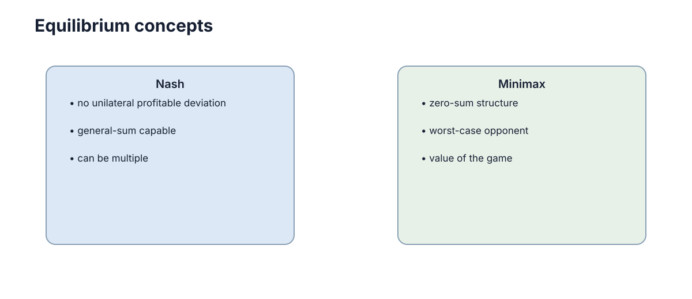

# 零和博弈与 Minimax

零和博弈的特殊之处在于：**一方得到多少，另一方就等量失去多少。** 这使“双方利益完全对立”可以被压缩成一个收益函数，并形成清晰的 minimax 结构。

<figure markdown="span">
  
  <figcaption>在有限两人零和博弈中，混合策略允许双方达到共同的博弈值。</figcaption>
</figure>

## 一、零和结构把两个目标变成一个目标

若玩家 1 收益为 $u(a,b)$，玩家 2 收益就是 $-u(a,b)$。玩家 1 希望收益最大，玩家 2 希望它最小。

因此玩家 1 可以考虑最坏情况下的保证收益：

$$
\max_a\min_b u(a,b).
$$

玩家 2 则考虑

$$
\min_b\max_a u(a,b).
$$

## 二、minimax 的核心是“按最坏对手做准备”

如果你不知道对手会怎么选，但假设对方也会理性针对你，就不应根据某个乐观对手行为设计策略，而要最大化自己能保证的最低收益。

这类思想在对抗博弈、安全和鲁棒决策中很常见。

## 三、混合策略让双方摆脱固定模式

石头剪刀布里任何固定动作都能被克制。三种动作各以 $1/3$ 概率选择后，对手无论固定选择哪一种，期望收益都无法超过博弈值。

混合策略的作用是让自己的行为不可被确定性利用。

## 四、有限两人零和博弈具有清晰的博弈值

在允许混合策略后，von Neumann minimax 定理给出

$$
\max_\pi\min_\sigma \mathbb E[u]
=
\min_\sigma\max_\pi \mathbb E[u].
$$

这就是零和问题比一般和博弈更容易形成单一“值”的原因。

## 五、现实竞争不一定是零和

两个公司竞争可能共同扩大市场，两台机器人争抢资源同时又共享团队奖励，这些都属于一般和结构。若强行当成零和，会丢掉合作空间。

所以使用 minimax 前先确认：**一方收益增加是否真的必然对应另一方等量减少。**
