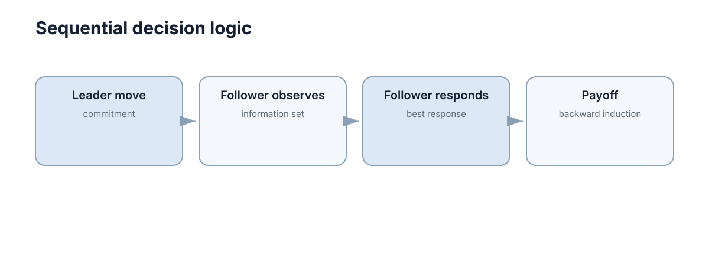

# Sequential & Bayesian Games

现实决策经常同时包含两种复杂性：有人先行动、有人后行动；同时玩家又可能不知道对方的真实类型或成本。序贯博弈解决**行动顺序**，贝叶斯博弈解决**隐藏信息**，两者需要分开理解。

<figure markdown="span">
  
  <figcaption>顺序行动使后行动者能够根据已经发生的动作做响应。</figcaption>
</figure>

## 顺序行动要用博弈树描述历史

博弈树节点表示当前历史，边表示可选动作，叶节点给出最终收益。策略不再只是一个动作，而要说明玩家在自己可能遇到的每个决策节点怎样行动。

## 逆向归纳从最后一步往前推

有限完全信息博弈中，可以先看最后行动者会选择什么，再把这个结果代回前一个节点，逐步向根节点回推。

这种 backward induction 的逻辑是：早期玩家做决定时，会预见后续玩家的理性响应。

## Stackelberg 领导者—跟随者结构

领导者先承诺策略，跟随者观察后做最佳响应。领导者选择时必须把这个响应考虑进去。

这与同时行动 Nash 的差别在于：**先行动本身可以形成战略优势或劣势。**

## 不完全信息需要引入类型和信念

如果卖家不知道买家的真实估值，可以把估值视为类型 $\theta$，并维护概率 $P(\theta)$。观察到动作后，再用 Bayes 规则更新对类型的信念。

因此最优策略不仅依赖当前局面，也依赖“我认为对方是什么类型”。

## 顺序和隐藏信息常在真实系统中同时出现

攻防、谈判、拍卖和非合作机器人都可能存在“我先行动，同时我不知道对方能力”。入门阶段不需要学习所有精炼均衡，只需要掌握两条主线：**顺序 → 预测后续响应；隐藏信息 → 维护并更新信念。**

## 可观测行动与信息集

顺序行动并不自动意味着后手看得见前手动作。若行动历史被隐藏，就形成 imperfect information，不能直接使用普通逆向归纳。

因此建模时除了写清“谁先动”，还要写清“后行动者在决策时到底知道什么”。这也是博弈树中 information set 存在的原因。

## 承诺为何能够改变结果

领导者先行动时，公开且可信的承诺会改变跟随者的最佳响应，从而改变领导者当前动作的价值。如果承诺可以随时撤销，跟随者就不会按承诺推理。现实系统中的规则、协议和资源预留，常常承担使承诺可信的作用。
