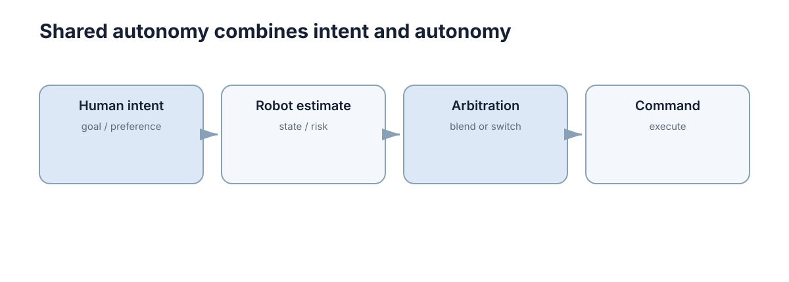

# Shared Autonomy

共享自主（Shared Autonomy）不是人和机器“各控制 50%”，而是让**人保留目标和意图，自动系统负责补足稳定性、安全性或精细动作**，并根据场景动态调整控制权。

<figure markdown="span">
  
  <figcaption>控制权应该随风险、置信度和任务阶段变化，而不是固定平均。</figcaption>
</figure>

## 人和自动系统通常控制不同层级

遥操作机械臂时，人可以决定“抓哪个物体”，系统负责避障和末端稳定；轮椅用户给出大致方向，系统负责局部避障。

这比直接混合两个速度向量更自然，因为人和机器各自承担最擅长的部分。

## 最简单的融合可以写成加权控制

$$
u=\alpha u_h+(1-\alpha)u_a,
$$

其中 $u_h$ 是人的输入，$u_a$ 是自主建议。但真正困难的是 $\alpha$ 怎么变化，而不是公式本身。

风险升高、机器置信度下降时，可以增大人的控制权；人的输入明显危险时，安全层仍可以限制最终动作。

## 共享自主必须推断人真正想做什么

摇杆向右不一定意味着用户最终目标就是右侧，可能只是绕开当前障碍。高级共享自主会从一段历史输入估计目标，但目标推断错误也会导致机器“过度帮忙”。

因此系统应该保留明显的人工覆盖方式。

## 控制冲突是共享自主最常见的问题

如果人持续左转，而自动系统不断向右修正，人会进一步加大左转输入，双方就形成对抗。解决办法不是隐藏自动修正，而是让规则可预测：哪些区域机器会限制？什么时候会完全交还控制？

## 安全约束应独立于融合权重

无论 $\alpha$ 取多少，最终命令都应经过速度、碰撞和执行器边界检查。否则“人拥有最高权重”可能直接绕过系统安全底线。

```python
def shared_command(human, auto, alpha, limit=1.0):
    u = alpha * human + (1 - alpha) * auto
    return max(-limit, min(limit, u))
```

## 必要时清晰切换模式比长期模糊融合更好

如果系统无法可靠推断人的意图，明确进入“人工模式”或“自动模式”可能比不断隐式抢控制更安全。共享自主的目标是降低人的负担，不是让责任边界变得更模糊。

## 融合权重需要可解释变化

控制权比例若随系统置信度变化，应让操作者能够感知这种变化及其原因。突然增大或减小辅助会破坏人的运动预期。权重调度应限制变化速率，并在接近安全边界时明确提示自动系统正在覆盖哪些输入。
