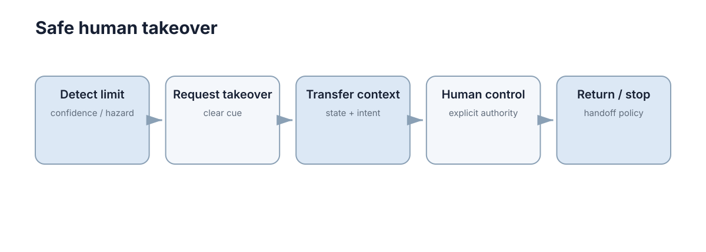

# 人工干预与接管

接管不是一个按钮，而是一段**检测风险 → 告警 → 交接状态 → 人获得控制 → 系统降级或恢复**的状态迁移。真正危险的往往不是“没有接管功能”，而是接管发生得太晚或边界不清。

<figure markdown="span">
  
  <figcaption>人工接管必须给人足够状态信息和理解时间。</figcaption>
</figure>

## 系统应该在完全失控以前发出接管请求

如果定位已经彻底丢失才请求人工接管，人可能来不及理解场景。更合理的是设置预警阈值：能力下降但仍可控时就提示，真正越过安全阈值时自动进入减速或停车。

## 接管前必须把关键状态交给人

操作者需要知道当前速度、位置、障碍、任务目标、系统故障原因和自动控制最后准备做什么。没有上下文的“请立即接管”会把风险直接转移给人。

## 控制权切换必须可确认

系统发出接管请求不等于人已经成功接管。界面应确认输入设备有效、控制模式已经切换、自动控制是否停止输出。

否则可能出现人和机器同时控制，或双方都以为对方在控制。

## 安全降级应独立于人工响应速度

人可能没有及时操作，因此系统仍需要 fallback：减速、保持姿态、停车或进入安全区域。人工接管是重要恢复路径，但不应成为唯一安全机制。

## 恢复自动模式也需要条件

故障短暂消失后不应立即抢回控制。恢复前至少应确认定位、感知、通信和执行器重新达到要求，并明确由谁触发切换。

## 接管记录应该用于后续改进

每次接管都包含宝贵的“系统能力边界”信息。记录触发原因、接管前状态和人工操作，可以用于重新设计阈值、补充训练数据和验证恢复策略。

## 接管流程必须通过演练验证

只有真正模拟“定位失效、障碍突然出现、通信中断”等场景，才能知道告警是否足够早、界面信息是否够用、操作者是否知道下一步做什么。接管机制若从未被触发测试，往往会在真正事故时暴露模式切换、输入设备或权限问题。

因此人工接管也需要像故障恢复一样定期测试，而不是只在 UI 上保留一个按钮。

## 接管是一个有时序的协议

接管包含请求、理解、确认、控制权转移和稳定操控多个阶段。只测量人按下按钮的时间会低估真正的恢复时间。验证时应从首次告警计时，直到系统重新进入可控状态，并覆盖人没有及时响应的分支。
