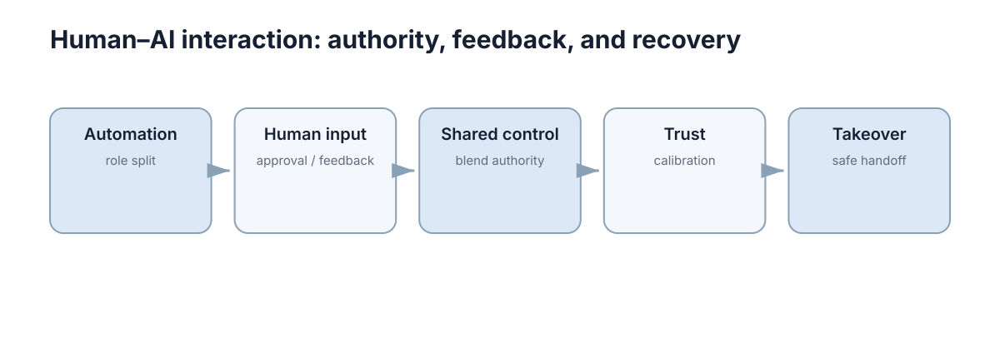

# Human–AI Interaction

> **定位：** 这一 Section 只回答五个实际问题：机器自动到什么程度、人在哪个环节介入、控制权如何共享、信任如何校准、异常时如何安全接管。

<figure markdown="span">
  
  <figcaption>Human–AI Interaction 的最小主学习路径；箭头表示认知依赖，不代表必须掌握所有高级分支。</figcaption>
</figure>

## What to master

学完本 Section，只要求做到三件事：

1. 能用自己的话解释本领域的核心问题；
2. 能读懂最关键的公式、流程或系统结构；
3. 能把概念连接到一个简单实现或真实系统。

## Core chapters

| No. | Chapter | Why it stays in the core path |
|---:|---|---|
| 01 | [Human–AI Interaction & Automation Levels](01-human-ai-automation.md) | 先明确人与系统各自负责什么，再讨论自动化程度；“自动化更高”并不天然意味着系统更好。 |
| 02 | [Human-in-the-Loop](02-human-in-loop.md) | 人在环必须明确介入点、频率和权限：人适合处理目标、异常和价值判断，不适合逐毫秒审批低层控制量。 |
| 03 | [Shared Autonomy](03-shared-autonomy.md) | 共享自治不是人和机器人同时抢控制权，而是根据任务阶段、风险和置信度在意图与自动控制之间仲裁。 |
| 04 | [Trust & Explainability](04-trust-explainability.md) | 可解释性的目标不是让所有模型完全透明，而是给用户足够的信息来理解限制、判断置信度并做正确干预。 |
| 05 | [Intervention & Takeover](05-intervention-takeover.md) | 接管流程必须设计上下文传递、权限切换和失败回退，否则“有人可以接管”并不等于“可以安全接管”。 |

## Stop rule

当你能够解释上述主线并完成每章的 Worked example，就可以进入下一个 Section。高级证明、算法变体和工具细节统一放在 **Further Reading**，不阻塞主线。
