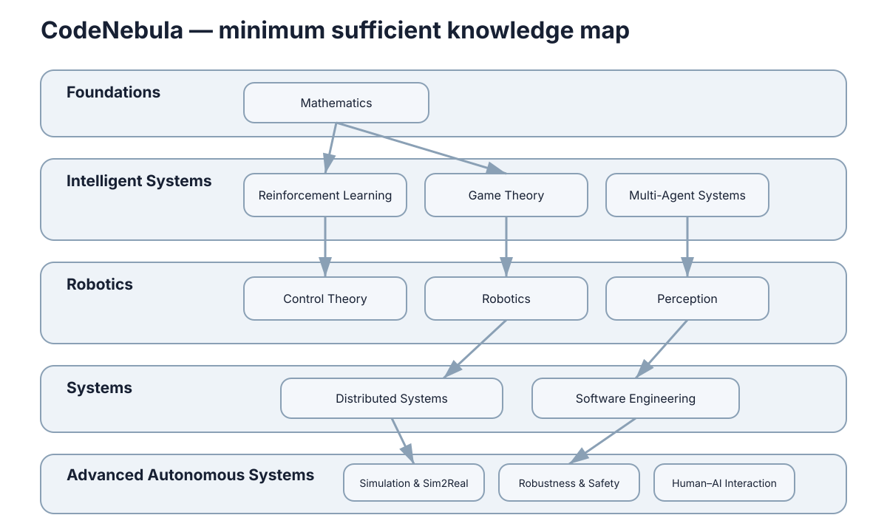

# CodeNebula — 智能系统研究与工程实践知识地图

CodeNebula 不是 AI 编程入门站，也不试图成为包罗万象的百科全书。它是一套面向智能系统研究与工程实践的**最小充分知识地图**：先回答方法为什么成立，再说明算法如何组织，最后进入工程接口与真实系统。

<figure markdown="span">
  
  <figcaption>课程按基础、决策学习、机器人感知、系统仿真、安全与人因五个领域组织。</figcaption>
</figure>

## 课程结构

课程不强制一条线读到底。第一次学习可以先完成 Foundations，再根据研究方向进入 Decision & Learning 或 Robotics & Perception；Systems & Simulation 负责把方法放进可运行系统，Safety & Human Factors 贯穿真实部署。

### Foundations

Mathematics 提供空间、变化、不确定性与优化语言；Control Theory 建立动态模型、反馈与稳定性。两者共同回答“系统如何表示”和“方法在什么条件下成立”。

### Decision & Learning

Reinforcement Learning、Game Theory 与 Multi-Agent Systems 分别讨论序贯决策、策略相互影响和多主体协调。重点是状态、收益、信息结构与更新规则之间的关系。

### Robotics & Perception

Robotics 连接模型、估计、SLAM、规划和控制；Perception 处理图像、特征、检测、深度、点云与多模态对齐。这里开始出现必要的工程代码。

### Systems & Simulation

Distributed Systems、Software Engineering 与 Simulation & Sim2Real 解释通信、接口、测试、部署、物理仿真和现实迁移，让单个算法成为可以运行、观察和恢复的系统。

### Safety & Human Factors

Robustness & Safety 处理不确定性、分布变化、约束和故障；Human–AI Interaction 处理控制权、信任、共享自治与接管。它们不是最后才添加的功能，而是设计真实系统时必须持续检查的条件。

!!! note "内容边界"
    每个 Section 只保留能连接上下游的核心概念。代码只出现在工程实现与真实系统；图片优先使用几何解释图、状态空间图、概率关系图、优化曲面图、架构图、数据流图、系统连接图和实验结果图。
