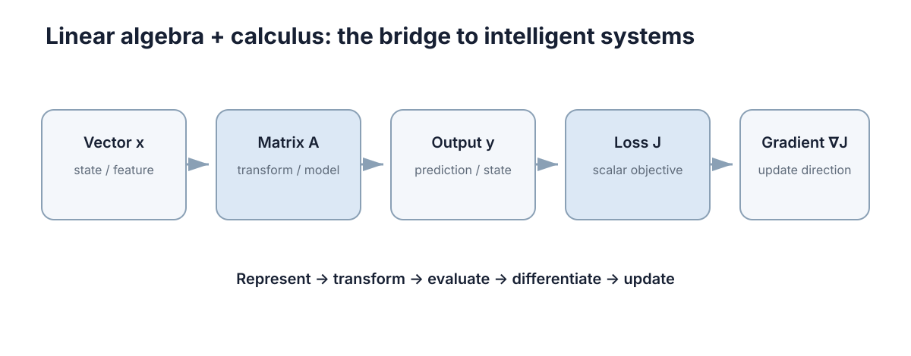

# Linear Algebra & Calculus

> 这一章的四件事你在生活里都干过：把好几个数绑在一起看、量"差了多少"、按同一套规则同时改好几个数、以及"只挪一点点，结果会变多少"。读完你应该能自己推出三件事——为什么工程上几乎不"解方程"而是"求最近似解"、为什么残差必须垂直于模型的列空间、以及为什么"步长越小越准"一定会在某个地方反转。



后面的控制理论、机器人学、SLAM、优化和强化学习，用的是同一套骨架：用向量表示状态、用矩阵表示映射、用导数表示"在工作点附近近似成线性"。所以这一章不追求课程式的完备证明，只带着你把每个工具**为什么被迫存在**推一遍。读的时候随时问自己一句：眼前这个对象是标量、向量，还是一个映射？

---

## 一、你早就在用向量，只是没这么叫

车载导航报位置时你不会说"横着是 3，另外竖着是 4"，你会说"我在 (3,4)"。因为这两个数**必须一起看**：单独说"3"没有任何意义，它可以是任何一条线上的任何一点。当你把几个数写成一个整体、并且只允许整组一起参与运算时，你就造出了一个**向量**（vector）。这里的"几个数"的个数，就叫**维数**（dimension）。

三个动作你天生就会：

1. **叠加**：起点 $(3,4)$，又往 $(1,-2)$ 走了一段 → 新位置 $(3+1,\,4-2)=(4,2)$。这就是向量加法。
2. **按比例缩放**：速度只取一半，位移向量就整体乘 $0.5$ → $(6,8)\to(3,4)$。这就是数乘。
3. **看"在某个方向上投了多长"**：$(3,4)$ 在正东方向 $(1,0)$ 上投了 $3$，在正北方向 $(0,1)$ 上投了 $4$。这就是内积。

一台差分驱动小车要预测未来，状态里至少要装四个数：位置 $p_x,p_y$（m）、线速度 $v$（m/s）、航向角 $\theta$（rad）：

$$
x=\begin{bmatrix}p_x & p_y & v & \theta\end{bmatrix}^\top .
$$

**为什么是这四个、不是三个？** 因为判据只有一条：**状态必须是预测未来所需的充分信息**。给定当前 \(x\) 和未来的输入 \(u\)，未来就与更早的历史无关了。反过来说，任何能由 \(x\) 和 \(u\) 唯一算出来的量（比如平面小车的速度就是位置的导数）都不该塞进状态——塞进去只会让协方差矩阵出现零特征值、不再正定，滤波器随后会在这些冗余方向上产生凭空的相关性。

这里有个"建模阶段就能省掉调试时间"的点：单位和坐标原点的选择不改变物理，却直接决定同一套算法是否稳定。把位置从绝对坐标改成相对某个参考点，数值尺度可以从 $10^{5}$ 降到 $10^{1}$，条件数与浮点精度都会明显改善；把角度参考轴选在运动主方向上，可以避免 $\theta\approx\pi$ 附近的角度环绕跳变被误读成"剧烈运动"。

---

## 二、误差"有多大"：范数是被逼出来的

现在有了向量，第二件事立刻出现：两组估计都错了，谁错得更狠？

最直接的办法是"把每个分量的差加起来"。看一个误差 $e=(3,-3)$：$3+(-3)=0$，加起来是零——**它看起来完美，实际上两个方向都偏了 3**。正负抵消就是这个笨办法的死因。

要救它只有三条路，各修一个毛病，也各留下一类偏差：

| 修法 | 名字 | 定义 | 它的性格 |
|---|---|---|---|
| 先取绝对值再求和 | $L_1$ 范数 | $\|x\|_1=\sum_i \|x_i\|$ | 只看总量，不在乎摊在几个方向上 |
| 先平方再求和再开方 | $L_2$ 范数 | $\|x\|_2=\sqrt{\sum_i x_i^2}$ | 大误差被平方放大，最怕一个坏点 |
| 只看最大的那个分量 | $L_\infty$ 范数 | $\|x\|_\infty=\max_i \|x_i\|$ | 只关心最坏分量，其余全不管 |

这三种"性格差异"不是形容词，是可算的。比较两个候选误差 $a=(2,2)$ 与 $b=(3,0)$：

| 范数 | $a=(2,2)$ | $b=(3,0)$ | 选谁 |
|---|---|---|---|
| $L_1$ | 4 | **3** | 选 $b$——它宁可让一个方向错到底，也不接受"处处都错" |
| $L_2$ | **2.828** | 3 | 选 $a$——平方让 $b$ 的 3 变得更昂贵 |
| $L_\infty$ | **2** | 3 | 选 $a$——只看最坏分量 |

所以选范数等于在回答一个问题：**我更怕一个巨大的误差，还是更怕很多个中等误差？** 机器人里位姿误差常用 $L_2$（最小二乘的地基）、稀疏残差与鲁棒损失用 $L_1$、"不得超过"的安全约束用 $L_\infty$。

其中 $L_2$ 值得单独记一下，它有一个非常好用的平方形式：

$$
\|x\|_2^2=x^\top x=\sum_i x_i^2 .
$$

最小二乘之所以叫"二乘"，就是因为它的目标函数写成误差向量的 $L_2$ 范数**平方**。这是个二次函数，求导后得到线性方程，因此有闭式解；换成 $L_1$ 目标就变成线性规划，换成 $L_\infty$ 变成切比雪夫逼近。

最后把一条约定在动笔前定死：本区统一使用**列向量**，于是内积写作 $x^\top y$（结果是标量），外积写作 $xy^\top$（结果是矩阵）。一个 $n$ 维状态若被当成行向量，所有矩阵乘法都要额外转置，写出的公式看着对称、代入就不对齐。

---

## 三、矩阵：同一套规则同时作用在所有分量上

设想你手上有台差速小车，你只能下两条指令：左轮速度 $v_L$、右轮速度 $v_R$。你真正想要的是车身前进速度 $v$ 和转向角速度 $\omega$。这两者由两条规则给出：

$$
v=\frac{v_L+v_R}{2},\qquad \omega=\frac{v_R-v_L}{L},
$$

其中 $L=0.3$ m 是轮距。把这两条规则"打包"写成一个作用在指令向量上的对象：

$$
\begin{bmatrix}v\\ \omega\end{bmatrix}=
\begin{bmatrix}\tfrac12 & \tfrac12\\ -\tfrac1L & \tfrac1L\end{bmatrix}
\begin{bmatrix}v_L\\ v_R\end{bmatrix}.
$$

代数字：$v_L=1.0$、$v_R=1.2$，得 $v=1.1$ m/s、$\omega=(1.2-1.0)/0.3=0.667$ rad/s。两条规则、两个输入、两个输出——这个 $2\times2$ 的数组就是一个**矩阵**（matrix）；它和向量的差别在于，向量是一次作用的**对象**，矩阵是一次作用的**规则**。

**列的解释是理解矩阵最快的路。** 取输入 $e_1=(1,0)^\top$（只开左轮），输出是 $(0.5,\,-1/0.3)=(0.5,-3.333)$；取 $e_2=(0,1)^\top$（只开右轮），输出是 $(0.5,\,+3.333)$。这两个数就是矩阵的两列。于是"矩阵怎么变换空间"等价于"每一列的像落在哪里"：左轮单独转，车向右偏；右轮单独转，车向左偏——符号刚好相反，而这个符号就写在列里。

### 为什么矩阵乘法不能交换顺序

这不是形式上的怪癖，是几何事实。拿二维点 $(1,0)$，比较两种操作顺序，其中 $R$ 是绕原点转 $90^\circ$（把 $(x,y)$ 变成 $(-y,x)$），$t$ 是平移 $(1,0)$：

- **先转后移**：$R(1,0)=(0,1)$，再平移 → $(1,1)$；
- **先移后转**：$(1,0)+(1,0)=(2,0)$，再旋转 → $(0,2)$。

同一个点，落到两个完全不同的位置。所以 $AB\ne BA$。工程上的应对办法很土但很有效：给每个变换显式写出"从哪个坐标系到哪个坐标系"的下标，写成 $T_{world\leftarrow base}T_{base\leftarrow body}$ 这种链式结构，而不是用 $T_1,T_2$ 编号——编号法在三个以上坐标系串联时几乎必然出错。

---

## 四、解方程：为什么绝大多数时候求的不是"逆"，而是"最近似解"

### 4.1 最直接的办法怎么坏掉

你要标定一个传感器斜率 $k$，做了三次测量，每次得到一条方程：

$$
1k=1,\qquad 2k=2,\qquad 3k=4 .
$$

前两条说 $k=1$，第三条说 $k=1.333$。三条方程互相矛盾——**这个方程组根本没有精确解**。这不是数据太脏，而是"方程个数多于未知量个数"这件事本身的性质：每条观测都带噪声，噪声之间不会互相迁就。

那"分别解出来再平均"行不行？$k=(1+1+1.333)/3=1.111$。看起来合理，但它对三条观测一视同仁，而第三条方程斜率更陡、它的信息其实更值钱。我们需要一个**有依据的折中**，而不是拍脑袋平均。

### 4.2 把"折中"写成一个最小值问题

折中的自然写法：让三个残差组成的向量尽量短。残差是 $r=Ax-b$，于是

$$
\min_x \ \|Ax-b\|_2^2 .
$$

这是上面选 $L_2$ 的直接后果。现在对 $x$ 求导并令其为零（二次函数求导是线性的），得到著名的**正规方程**（normal equation）：

$$
A^\top A\,x=A^\top b,\qquad\text{等价于}\qquad A^\top(Ax-b)=0 .
$$

第二个写法马上给出几何含义：最优残差 $r=Ax^\star-b$ 被 $A^\top$ 一乘就是零，说明 **$r$ 与 $A$ 的每一列都正交**——残差垂直于模型的列空间。这不是巧合，而是"投影"的定义（下一节展开）。

### 4.3 手算一遍

用上面的数据：$A=\begin{bmatrix}1&2&3\end{bmatrix}^\top$，$b=\begin{bmatrix}1&2&4\end{bmatrix}^\top$。只有一个未知量，正规方程退化成一次除法：

$$
A^\top A=1^2+2^2+3^2=14,\qquad A^\top b=1\cdot1+2\cdot2+3\cdot4=17,\qquad k=\frac{17}{14}=1.2143 .
$$

回代看残差：$r=(1.2143-1,\ 2.4286-2,\ 3.6429-4)=(0.2143,\ 0.4286,\ -0.3571)$。验一下正交性：

$$
r^\top x=0.2143\cdot1+0.4286\cdot2-0.3571\cdot3\approx0 .
$$

真的等于零（不是"接近零"，是代数上恰好为零）。残差长度 $\|r\|_2=\sqrt{70/196}\approx0.5976$。

### 4.4 一条代价：$\kappa(A^\top A)=\kappa(A)^2$

正规方程有个隐藏账单：**直接构造** $A^\top A$ 会把条件数平方。若 $A$ 的列几乎平行、条件数已经到 $10^{4}$，那 $A^\top A$ 就到了 $10^{8}$，双精度（约 16 位有效数字）会先丢一半精度，后面的解基本不可信。实用替代是 QR 分解或 SVD，代价相近但数值上稳得多。这件事在第十节会用真实数字验一遍。

---

## 五、投影：为什么残差必须垂直

先讲直觉。你在墙上挂画，要量"画中心离目标点多远"，你会量**垂直距离**，不会斜着量。因为斜着量会把你已经对准的分量又算进来一遍。最小二乘做的是同一件事：把观测向量 $b$ 垂直地"拍"到模型的列空间上，**投影点就是最优拟合，被丢弃的那段就是残差**。

先定义两个词：$u^\top v=0$ 时称 $u,v$ **正交**（orthogonal）；一组向量若两两正交且长度都为 1，就叫**标准正交基**（orthonormal basis），写成矩阵 $U$ 时满足 $U^\top U=I$。标准正交矩阵做变换不改变长度：

$$
\|Ux\|_2^2=x^\top U^\top Ux=\|x\|_2^2 ,
$$

所以旋转和坐标变换不会放大误差——这是它在数值算法里到处出现的原因。

投影矩阵由列空间的一组标准正交基给出，并满足**幂等性**：

$$
P=UU^\top,\qquad P^2=UU^\top UU^\top=UU^\top=P,\qquad P(I-P)=0 .
$$

$P^2=P$ 是"已经落在子空间里，再投影一次也不再改动"的代数表达；$P(I-P)=0$ 说明"子空间内部分"与"垂直部分"彼此正交，于是任意向量都能唯一分解成 $b=Pb+(I-P)b$，两块满足勾股关系 $\|b\|_2^2=\|Pb\|_2^2+\|(I-P)b\|_2^2$。

三维手上过一遍：取 $u_1=(1,0,0)^\top$、$u_2=(0,1,0)^\top$（它们张成 $xy$ 平面），对 $b=(1,2,3)^\top$ 投影，

$$
Pb=u_1(u_1^\top b)+u_2(u_2^\top b)=1\cdot u_1+2\cdot u_2=(1,2,0)^\top ,
$$

残差 $r=(0,0,3)^\top$，长度 3，恰好等于 $b$ 到该平面的垂直距离。勾股也成立：$1+4+9=14=5+9$。

搬回估计问题里：列空间是"模型能解释的全部方向"，投影是这个方向上离数据最近的那一点，残差是模型**永远解释不了**的部分。由此得到两条能直接用的工程结论：

- **加更多观测量一定不会让最小二乘变差。** 因为每加一个观测，列空间只会变大、永远不小；$b$ 到这个更大空间的垂直距离单调不增。这就是多传感器融合的几何理由。
- **正交分解保证"能量"守恒**，拟合值与残差的平方和相加等于数据总平方和——这正是回归里 $R^2$ 的定义来源。

---

## 六、导数：把"变化多快"压缩成一个数

现在换一半话题，从"空间关系"转到"变化关系"。

场景：一个温度传感器，输出电压 $V$ 随温度 $T$ 上升。你不需要它的整条曲线，你只需要回答"在 $20^\circ$C 附近，温度每升 $1^\circ$C，输出涨多少伏"。假设这段近似为 $V(T)=0.01T+0.2$，那答案就是 $0.01$ V/$^\circ$C。于是 $T=25$ 时 $V=0.45$ V，而 $T=25.1$ 时不用重新标定，直接估：

$$
V(25.1)\approx0.45+0.01\times0.1=0.451\ \text{V}.
$$

这就是**导数**（derivative）的用途：它把一条曲线在某个点附近压缩成一个可以相乘的数。这个被选中的点叫**工作点**（operating point），"在工作点附近用一条直线代替曲线"就叫**局部线性化**（local linearization）：

$$
f'(x)=\lim_{h\to0}\frac{f(x+h)-f(x)}{h},\qquad f(x+h)\approx f(x)+f'(x)h .
$$

### 6.1 一个被推出来的陷阱：步长不是越小越准

既然定义里写着 $h\to0$，很自然的想法是"数值上把 $h$ 取到非常小"。**这个直觉一定会失效**，可以推出来。

用前向差分 $(f(x+h)-f(x))/h$ 近似 $f'(x)$，误差有两个来源：

1. **截断误差**：泰勒展开说真实误差约 $M_2h/2$，随 $h$ 线性变小；
2. **舍入误差**：$f(x+h)-f(x)$ 是两个接近的数相减，浮点表示的有效位会大量相消，相对误差约 $u/h$（$u\approx2\times10^{-16}$ 是机器精度），随 $h$ 变小而**变大**。

两者相加约等于 $u/h+M_2h/2$，对 $h$ 求最小值得最优步长 $h\approx\sqrt{u}\approx10^{-8}$，此时误差也只能到 $10^{-8}$ 量级；用中心差分 $(f(x+h)-f(x-h))/(2h)$ 精度提到 $h^2$ 阶，最优 $h\approx u^{1/3}\approx6\times10^{-6}$。而一旦 $h$ 取到 $10^{-16}$，$x+h$ 在浮点下就等于 $x$，分子变成精确的 0，**导数被算成 0**。第十一节的第二个实验会把这条曲线扫出来。

这也是自动微分（automatic differentiation）优于手工差分的根本原因：它算的是解析的链式法则，根本不经过这一步相减。

---

## 七、梯度与 Jacobian：把导数搬到多变量

### 7.1 一个旋钮只管一个方向：偏导与梯度

如果函数有 $n$ 个输入，你没法只谈"变化率"——得先说明**动哪一个**。$\partial f/\partial x_i$ 的含义就是"只动第 $i$ 个输入、其它全部按住不动"的变化率，这叫**偏导数**（partial derivative）。把它们摞成一列就是**梯度**（gradient）：

$$
\nabla f=\begin{bmatrix}\partial f/\partial x_1\\ \vdots\\ \partial f/\partial x_n\end{bmatrix},\qquad
f(x+\delta)\approx f(x)+\nabla f^\top\delta .
$$

梯度的几何含义很具体：它是函数增长最快的方向。沿 $\delta$ 的方向导数在 $\delta$ 与 $\nabla f$ 同向时取最大值 $\|\nabla f\|_2$，垂直时为零。所以 $\|\nabla f\|$ 本身就是"当前有多陡"的指标，趋近最优解时它趋于零——这就是很多优化器拿 $\|\nabla f\|\le\varepsilon$ 当收敛判据的原因。

### 7.2 输入输出都是向量：Jacobian

设 $y=f(x)$，$x\in\mathbb R^n$，$y\in\mathbb R^m$。此时"变化率"是一个 $m\times n$ 的矩阵，叫 **Jacobian**：

$$
J_{ij}=\frac{\partial y_i}{\partial x_j},\qquad J\in\mathbb R^{m\times n},\qquad f(x+\delta)\approx f(x)+J(x)\delta .
$$

**维度检查是最快的自检手段**：$J\delta$ 必须是 $m$ 维，所以 $J$ 是 $m\times n$、$\delta$ 是 $n$ 维，乘积是 $m\times n$ 乘 $n\times1$ 得 $m\times1$。先写维度、再填内容，能省掉大量返工。

### 7.3 两连杆机械臂，手算一遍

杆长 $l_1=l_2=1$，关节角 $\theta_1,\theta_2$，末端位置

$$
x=\cos\theta_1+\cos(\theta_1+\theta_2),\qquad y=\sin\theta_1+\sin(\theta_1+\theta_2) .
$$

取工作点 $\theta_1=0^\circ$、$\theta_2=90^\circ$：末端在 $(1,1)$。对两个角度求偏导，得到

$$
J=\begin{bmatrix}-1 & -1\\ 1 & 0\end{bmatrix}.
$$

现在验证它"能不能用"：让第一个关节多转 $\Delta q=(0.01,\,0)$ rad，Jacobian 预测末端位移 $\Delta x\approx J\Delta q=(-0.01,\,+0.01)$。真切到 $(\theta_1,\theta_2)=(0.01,\ \pi/2)$ 算一次：末端约在 $(0.98995,\ 1.00995)$，实际位移是 $(-0.01005,\ +0.00995)$。和预测差了不到 $5\times10^{-5}$——这个偏差就是被砍掉的二阶项，约 $h^2/2$ 量级。**线性近似只在工作点附近成立**，位移一大就失控。

再把 $\theta_2$ 调到 $0^\circ$（手臂完全伸直）：两列变成 $(-1,-1)$ 方向的倍数，$J$ 降秩。这时沿手臂径向的末端运动**无法由任何关节速度生成**——要维持它需要无穷大的关节速度。这就是**奇异位形**（singular configuration）。逆运动学在这类构型附近"关节速度爆炸"，根源就在这一步。

| 用 $J$ 干什么 | 公式 | 关键条件 | 失效表现 |
|---|---|---|---|
| 速度正解 | $\dot x=J\dot q$ | 无 | 无 |
| 逆运动学速度 | $\dot q=J^{+}\dot x$ | $J$ 满秩，或加阻尼 | 奇异附近关节速度爆炸 |
| 误差传播 | $\Sigma_x\approx J\Sigma_qJ^\top$ | 局部线性足够好 | 大不确定度时低估方差 |
| 牛顿法步长 | 求解 $J\Delta=$ 残差 | $J$ 非奇异 | 奇异性处无解 |

---

## 八、链式法则：串联的变化要乘，不能加

先看一件你早就会的事。换汇：$1$ 欧元 = $1.08$ 美元，$1$ 美元 = $7.2$ 人民币。那 $100$ 欧元等于多少人民币？你会算 $100\times1.08\times7.2$，而**不是** $100\times(1.08+7.2)$。为什么乘？因为第二段汇率是"相对于第一段结果"的变化率——它作用在上一步的输出上。

复合函数 $z=g(y)$、$y=f(x)$ 的一元链式法则说的就是这个乘法：$\frac{dz}{dx}=\frac{dz}{dy}\frac{dy}{dx}$。到了向量情形，每个"变化率"都升级成 Jacobian，乘法变成矩阵连乘：

$$
J_{z\leftarrow x}=J_g\,J_f,\qquad \frac{\partial z}{\partial x}=\frac{\partial z}{\partial y}\frac{\partial y}{\partial x} .
$$

顺序和复合顺序一致：先作用 $f$ 再作用 $g$，矩阵就先写 $J_g$ 再写 $J_f$（注意函数先作用在右边）。维度自动对齐：若 $x\in\mathbb R^n$、$y\in\mathbb R^k$、$z\in\mathbb R^m$，则 $J_f$ 是 $k\times n$、$J_g$ 是 $m\times k$，乘出来必须是 $m\times n$。**这条维度链本身就是"写对了"的最强证据。**

### 8.1 为什么深层结构难训练

链式法则是一串乘法，于是缩放因子按层数取幂。假设每层把某个方向的尺度乘 $1.2$：

| 层数 | 每层 $1.2$ | 每层 $0.9$ |
|---|---|---|
| 10 层 | $1.2^{10}\approx6.19$ | $0.9^{10}\approx0.349$ |
| 20 层 | $1.2^{20}\approx38.3$ | $0.9^{20}\approx0.122$ |

每层只"稍微"放大一点，20 层后梯度就是 38 倍；每层只"稍微"缩小一点，20 层后只剩一成。乘性累积意味着**层数越多，缩放因子的指数效应越明显**，这跟每层改动多小无关。残差连接、归一化、梯度裁剪，本质上都是在控制这个连乘乘积的谱。

| 复合结构 | 一阶导数 | 代价 | 典型失误 |
|---|---|---|---|
| 标量链 $z=g(f(x))$ | $g'f'$ | 便宜 | 漏掉内层导数 |
| 向量链 | $J_gJ_f$ | 需保存中间量 | 顺序写反 |
| 坐标变换链 | $T_1T_2T_3$ | 便宜 | 上下标不匹配 |
| 深层网络 | 逐层 Jacobian 连乘 | 与层数成正比 | 梯度消失/爆炸 |

---

## 九、特征值：矩阵少数"不会被扭转"的方向

矩阵作用在大多数向量上会**同时改变方向和长度**，但总有少数方向只被拉伸、不被扭转。回到第三节那种迭代——反复用同一个矩阵推演状态 $x_{k+1}=Ax_k$，时间长了你看到的几乎只剩这个特殊方向。

满足 $Av=\lambda v$（$v\ne0$）的 $v$ 叫**特征向量**（eigenvector），$\lambda$ 叫**特征值**（eigenvalue）：$A$ 在这个方向上等价于一个标量缩放 $\lambda$。它由特征方程 $\det(A-\lambda I)=0$ 给出。

二维情形可以完全手算。取对称矩阵

$$
A=\begin{bmatrix}2&1\\ 1&2\end{bmatrix},\qquad
\det(A-\lambda I)=(2-\lambda)^2-1=\lambda^2-4\lambda+3=0 ,
$$

解得 $\lambda_1=3$、$\lambda_2=1$，对应特征向量 $v_1=\frac{1}{\sqrt2}(1,1)^\top$ 与 $v_2=\frac{1}{\sqrt2}(1,-1)^\top$。验一下：$A(1,1)^\top=(3,3)^\top=3(1,1)^\top$，$A(1,-1)^\top=(1,-1)^\top=1\cdot(1,-1)^\top$，都对。

**迭代验证**：从 $x_0=(1,0)^\top$ 出发，$x_{k+1}=Ax_k$ 得到 $x_1=(2,1)$、$x_2=(5,4)$、$x_3=(14,13)$、$x_4=(41,40)$。相邻两代的比值 $4/1,\ 2.5,\ 2.8,\ 2.93$ 一路逼近 $3$——正好是 $\lambda_{\max}$。数据不用你解释，它自己长出来了：**长期行为由最大的特征值决定。**

| 条件 | 每步行为 | 稳定性 | 工程含义 |
|---|---|---|---|
| $\|\lambda\|<1$ | 衰减 $\|\lambda\|$ 倍 | 渐近稳定 | 扰动自行消退 |
| $\|\lambda\|=1$ | 幅度保持 | 临界 | 可能持续振荡 |
| $\|\lambda\|>1$ | 放大 $\|\lambda\|$ 倍 | 不稳定 | 必须反馈修正 |
| $\operatorname{Re}\lambda<0$（连续） | 指数衰减 $e^{\lambda t}$ | 渐近稳定 | 连续系统判据 |

两个可以直接用的推论：

- **稳定性判据**：连续系统 $\dot x=Ax$ 由 $\operatorname{Re}\lambda<0$ 决定；离散化后特征值映射为 $e^{\lambda\Delta t}$，判据变成长在单位圆内——**稳定区域与采样周期强相关**。
- **一个免费的自检**：纯旋转矩阵满足 $\lambda=e^{\pm i\theta}$，模长恒为 1（旋转既不放大也不衰减）。所以你一旦算出某个纯旋转矩阵的 $|\lambda|\ne1$，一定是矩阵写错了，比如忘了归一化或混进了缩放。
- **对称矩阵**特征值全为实数、特征向量可取成一组正交基。协方差矩阵正属于这类，所以它的"主方向"总是一组互相垂直的轴：PCA 能直接用特征值分解或 SVD 算出，主成分方差就等于对应特征值；而最小特征值对应的方向，正是数据里最不确定、最容易被噪声掩盖的方向。

---

## 十、条件数：算得出答案，不等于答案可信

回到第四节那种"两条方程几乎平行"的局面，看它到底有多危险：

$$
2x+y=3,\qquad 2.0001x+y=3.0001 .
$$

精确解是 $x=1,\ y=1$（两式相减：$0.0001x=0.0001$）。现在把第二个方程的右端**只加** $0.0001$（相对变化约 $3.3\times10^{-5}$），变成 $3.0002$：两式相减得 $0.0001x=0.0002$，于是 $x=2$，回代得 $y=-1$。

**输入的万分之一，换来了答案的 100%（$x$）和 200%（$y$）。** 这就是**条件数**（condition number）$\kappa(A)$ 的物理含义：解对扰动的最坏放大倍数。这两条直线几乎重合，交点沿直线滑动，位置自然极不稳定。它的定量形式是特征值之比：对对称正定矩阵，$\kappa(A)=\lambda_{\max}/\lambda_{\min}$。

这件事和第四节完全接得上：$\kappa(A^\top A)=\kappa(A)^2$。上面这个 $A$ 的条件数约 $10^{5}$（第十一节实测），那么 $A^\top A$ 的条件数就是约 $10^{10}$——双精度只有约 16 位有效数字，先损失 5 位，再平方一次，可信位基本告罄。所以工程上宁可多花一点代价走 QR 或 SVD，也不去直接构造 $A^\top A$。

还有一条更早暴露问题的线索：正规方程的条件数由 **$A$ 的列向量夹角**决定。两列几乎平行、夹角 $\phi\to0$ 时，这两个方向上的参数几乎无法区分，$\kappa$ 大约按 $1/\sin\phi$ 的量级放大。这直接推出实验设计的准则——**让观测的几何分布尽可能"张开"**：标定要让激励覆盖多个方向；SLAM 不能让机器人一直沿直线前进，否则沿运动方向与垂直方向的不确定度会差几个数量级，回环与横向约束的价值正在这里。实验做完了才发现几何退化，只能加先验约束或正则项，继续采同一方向的数据没有任何帮助。

| 情形 | 条件 | 解的结构 | 工程含义 |
|---|---|---|---|
| 唯一解 | $A$ 方阵且 $\det A\ne0$ | $x=A^{-1}b$ | 约束恰好定解 |
| 欠定 | 未知量多于独立方程 | 解集是仿射子空间 | 冗余自由度，需加正则项挑一个 |
| 超定 | 方程多于未知量 | 一般无精确解 | 带噪观测，转最小二乘 |
| 数值奇异 | $\det A\approx0$ 但非零 | 形式上有唯一解 | 解对扰动极敏感，须看条件数 |

顺带说清一件事：真正需要的是**线性方程组的解**，不是**逆矩阵**本身。求逆本身是 $O(n^3)$ 且常数比 LU 分解大 2–3 倍，误差还要被放大两次（近似 $\kappa^2$ 量级）；而分解求解可以复用分解结果应付多个右端项。只有三类场合才值得真的算逆：需要矩阵的迹或显式协方差做解析推导、矩阵极小（$n\le4$）且要反复用在多个右端项上、以及教学调试时想看清结构。

---

## 十一、跑一遍，把数字验一遍

### 11.1 最小二乘与条件数

下面这段只用 numpy：先把第四节手算的结果复算一遍，再把第十节的"万分之一换 100%"当场演示出来。

```python
import numpy as np

# (1) 复算第四节：三次观测 (1,1)、(2,2)、(3,4)，拟合 y = a·x（只有一个未知量 a）
A = np.array([[1.0], [2.0], [3.0]])
b = np.array([1.0, 2.0, 4.0])
a = (A.T @ b)[0] / (A.T @ A)[0, 0]           # 正规方程 A^T A a = A^T b
r = A[:, 0] * a - b
print(f"a = {a:.6f}   (17/14 = {17/14:.6f})")
print(f"残差 r = {np.round(r, 6)}")
print(f"r·x = {r @ A[:, 0]:.2e}   ||r|| = {np.linalg.norm(r):.6f}")

# (2) 第十节的两条几乎平行的方程：κ(A^T A) = κ(A)^2
M = np.array([[2.0, 1.0], [2.0001, 1.0]])
print(f"\ncond(M) = {np.linalg.cond(M):.4e}")
print(f"cond(M^T M) = {np.linalg.cond(M.T @ M):.4e}")
for db in (0.0, 1e-4):
    x = np.linalg.solve(M, np.array([3.0, 3.0001 + db]))
    print(f"第二式右端 +{db:.0e} -> 解 = ({x[0]:+.6f}, {x[1]:+.6f})")
```

```text
a = 1.214286   (17/14 = 1.214286)
残差 r = [ 0.214286  0.428571 -0.357143]
r·x = -2.00e-15   ||r|| = 0.597614

cond(M) = 1.0000e+05
cond(M^T M) = 1.0001e+10
第二式右端 +0e+00 -> 解 = (+1.000000, +1.000000)
第二式右端 +1e-04 -> 解 = (+2.000000, -1.000000)
```

三行都对上了手算：$k=17/14=1.2143$、残差 $(3,6,-5)/14$、$\|r\|=0.5976$。注意 `r·x` 打出来是 $-2\times10^{-15}$ 而不是精确的 0——这就是**浮点舍入的地板**：代数上它确实为零（我们手算得到的是 0），机器算出来的只能在 $10^{-15}$ 上下打转。下一章的 [数值计算](./02-numerical-computation.md) 会专门讲这个地板。

后四行是第十节的现场：$\kappa(M)=1.0\times10^{5}$，右端只加 $10^{-4}$，解就从 $(1,1)$ 跳到 $(2,-1)$；而 $\kappa(M^\top M)=1.0\times10^{10}$，正好是 $\kappa(M)^2$ 的量级——**这就是"别直接构造 $A^\top A$"的定量理由**。

### 11.2 数值微分的步长陷阱

第二个实验把第六节那条"误差先降后升"的曲线扫出来，并画在终端里。

```python
import numpy as np

f = np.sin
x0 = 1.0
exact = np.cos(x0)                       # 解析导数 = 0.540302…

hs = 10.0 ** np.arange(-1, -17, -1)      # 步长从 1e-1 一路扫到 1e-16
err = {"前向": [], "中心": []}
for h in hs:
    err["前向"].append(abs((f(x0 + h) - f(x0)) / h - exact))
    err["中心"].append(abs((f(x0 + h) - f(x0 - h)) / (2 * h) - exact))

print("h          前向差分误差     中心差分误差")
for i, h in enumerate(hs):
    print(f"{h:8.0e}   {err['前向'][i]:12.3e}   {err['中心'][i]:12.3e}")

# 终端曲线：横轴 log10(h) 从 -16 到 -1；纵轴 log10(误差) 从 2 到 -17（上=大）
rows, cols = 14, 64
for tag in ("前向", "中心"):
    grid = [[" "] * cols for _ in range(rows)]
    for i, h in enumerate(hs):
        col = int(round((np.log10(h) + 16.0) / 15.0 * (cols - 1)))
        e = min(max(np.log10(max(err[tag][i], 1e-18)), -17.0), 2.0)
        row = int(round((2.0 - e) / 19.0 * (rows - 1)))
        grid[row][col] = "#"
    print(f"\n{tag}差分误差（上=大，下=小；左=小步长，右=大步长）")
    for row in grid:
        print("|" + "".join(row))
```

```text
h          前向差分误差     中心差分误差
   1e-01      4.294e-02      9.001e-04
   1e-02      4.216e-03      9.005e-06
   1e-03      4.208e-04      9.005e-08
   1e-04      4.207e-05      9.004e-10
   1e-05      4.207e-06      1.114e-11
   1e-06      4.207e-07      2.772e-11
   1e-07      4.183e-08      1.943e-10
   1e-08      2.970e-09      2.581e-09
   1e-09      5.254e-08      2.970e-09
   1e-10      5.848e-08      5.848e-08
   1e-11      1.169e-06      1.169e-06
   1e-12      4.324e-05      1.227e-05
   1e-13      7.339e-04      1.788e-04
   1e-14      3.707e-03      3.707e-03
   1e-15      1.481e-02      1.481e-02
   1e-16      5.403e-01      1.481e-02

前向差分误差（上=大，下=小；左=小步长，右=大步长）
|                                                                
|                                                                
|#                                                              #
|    #   #                                                  #    
|             #   #                                #    #        
|                     #                        #                 
|                         #   #        #   #                     
|                                  #                             
|                                                                
|                                                                
|                                                                
|                                                                
|                                                                
|                                                                

中心差分误差（上=大，下=小；左=小步长，右=大步长）
|                                                                
|                                                                
|                                                                
|#   #   #                                                      #
|             #                                                  
|                 #   #                                     #    
|                         #                             #        
|                             #    #                             
|                                      #           #             
|                                          #   #                 
|                                                                
|                                                                
|                                                                
|                                                                
```

读这张表：$h$ 从 $10^{-1}$ 缩到 $10^{-8}$，前向差分误差从 $4.29\times10^{-2}$ 一路降到 $2.97\times10^{-9}$——**这就是"步长越小越准"成立的那半段**。但过了 $10^{-8}$ 它就掉头上升，到 $h=10^{-16}$ 时误差变成 $5.40\times10^{-1}$，比 $h=10^{-1}$ 时还大十倍。原因不是数学坏了，而是 $x+h$ 在浮点下已经等于 $x$，分子相减得到精确的 0，$0/h$ 就是 0，于是导数估算成的 0 与真值差了整个 $\cos(1)=0.5403$。

两条曲线的形状差别也值得记：中心差分的最优区间更靠左（$h\approx10^{-5}$ 附近，误差低到 $1.1\times10^{-11}$），最低点比前向差分低了将近两个数量级——这正是第六节说的 $h^2$ 阶精度换来的。终端曲线里两条都呈"U 形"（左端因舍入翘起、右端因截断翘起），只是中心差分那条整体更低更宽。

**所以数值求导的正确做法不是"把 $h$ 调到最小"，而是"调到 $10^{-5}$ 附近就停手"。**

---

## 十二、翻车现场速查与小节

前面每一节的"代价"都能在工程里换成一条排查线索：

| 你看到的现象 | 最可能的原因 | 先验证什么 |
|---|---|---|
| 代入数值处处对不上 | 维度或行列约定混用 | 写出 $m\times n$ 与 $n\times1$，看乘出来是不是 $m$ 维 |
| 公式看着对称，结果不对 | 转置用错（$x^\top y$ 写成了 $xy^\top$） | 内积必须是标量，不是矩阵 |
| 优化在某个方向几乎不动 | 尺度/单位量级相差几个数量级 | 看各列的范数量级，做一次归一化 |
| 解出来的参数互相矛盾 | 列向量近似共线（几何退化） | 算 $\kappa(A)$，做一次 SVD 看最小奇异值 |
| 残差很小但预测不准 | 模型漏掉物理效应，残差里有结构 | 看残差随时间的走向是否单调偏移 |
| 迭代突然变成 inf/nan | 步长过大或矩阵接近奇异 | 先看 $\kappa$，再看是否越出了线性化邻域 |
| 数值导数算出来是 0 | 差分步长小于浮点分辨率 | 把 $h$ 从 $1\times10^{-8}$ 扫到 $1\times10^{-16}$ |
| 梯度逐层衰减或爆炸 | 各层 Jacobian 的缩放因子连乘 | 打印每层对范数的缩放比 |

最后用三句话回答"为什么必须有它们"：

- **为什么必须有向量和矩阵**：系统的状态天然是一组必须同时知道的量；把它们整组交给映射，才能用一次乘法表达"同一套规则作用在所有分量上"。
- **为什么必须转成最小二乘**：带噪观测多于未知量时**不存在精确解**，唯一有依据的出路是让残差向量最短，而 $L_2$ 的平方形式恰好让求导变成线性的。
- **为什么必须关心条件数和线性化范围**：数学上成立的结论只在"矩阵不太病态、位移不太大"时数值上可用。$\kappa(A)$ 决定"解还剩几位可信"，Jacobian 的工作点决定"这套线性模型还能用多远"。

把全章串起来是一条链：向量描述状态 → 矩阵描述线性映射 → 特征值描述模态与稳定性 → 求导得到局部线性模型 → Jacobian 处理多变量与复合 → 条件数决定这些运算在数值上是否有意义。后面所有章节（EKF、牛顿法、LQR、MPC）都只是在这条链上叠加物理或统计解释，数学骨架不变。

> **下一步**：数学本身没错，错的是它在**有限精度**下的表现。接着读 [数值计算](./02-numerical-computation.md)，看条件数、浮点舍入与迭代收敛如何一起决定"答案是否可信"；协方差矩阵那部分结构在 [概率与随机变量](./03-probability-random-variables.md)，特征值稳定性的实际应用见 [状态空间建模](../control-theory/01-modeling-state-space.md)。
