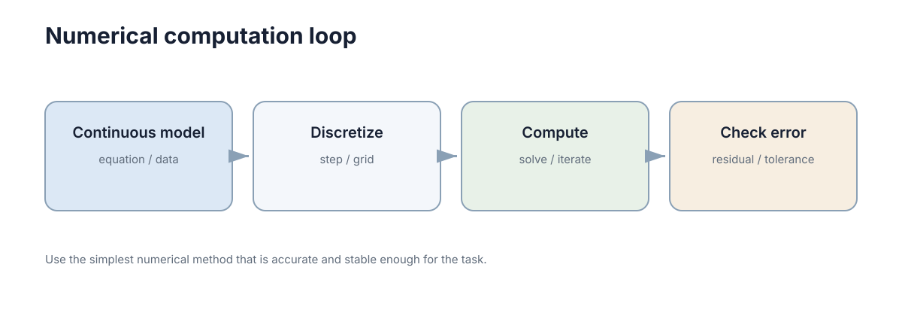

# Numerical Computation

> 你在计算器或 Excel 里敲过 `=0.1+0.2`，它给你 `0.30000000000000004`。这一章就从那一格开始：先把"误差为什么必然存在"推出来，再回答工程上真正要回答的三个问题——误差有多大、从哪来、会不会被放大。

---

## 一、先看你已经撞见过的一件事

打开 Python，敲这一行：

```
>>> 0.1 + 0.2
0.30000000000000004
>>> 1.1 - 1.0
0.10000000000000009
```

你并没有写错。**加法本身没有变坏，变坏的是"0.1"这个数本身存不进机器。**

从这两行里，其实能拆出四条你早就会、只是没命名的直觉：

1. **数字存不下无限多位，所以每写一步就四舍五入一次。** 0.1 是十进制里的有限小数，在二进制里却是无限循环小数，存进去就要被砍一刀。这一刀砍出来的东西叫**舍入误差**。
2. **两个很接近的数相减，答案里几乎全是那把刀的痕迹。** 有效位被抵消掉了，这叫**灾难性抵消**。
3. **"导数""积分"机器不会算，只能拿两个点的值相减再除以距离。** 于是步长（步长、网格间距、采样周期）变成了一个必须选的参数，而且**不是越小越好**。
4. **"程序不报错、曲线很光滑"和"结果对"是两件事。** 光滑的发散曲线比毛刺的曲线更危险，因为它看起来能用。

这一章就把这四条一条条推一遍。**目标不是让你会手算浮点数，而是让你拿到一个数值结果时，能判断它值不值得信。**

---

## 二、最直接的办法为什么一定坏

你大概会想：既然位数不够，那就多存几位；再不行就用分数、用符号计算，精确算完再取近似值。

三条路都试过了，都会被挡回来：

- **多存几位**：float32 改成 float64 改成 float128，有效十进制位从 7 涨到 16 涨到 34。但实数有不可数多个，有限个 bit 能表示的只有有限多个数——**中间总有无穷多个实数落在两个可表示数的缝隙里，必须被舍入到其中一个。** 缝隙变窄，但不会消失。
- **用精确有理数**：`1/3` 在有理数里是精确的，但 `sqrt(2)`、`pi`、`sin(1)` 不是有理数；更麻烦的是每做一次运算，分子分母的位数就膨胀一次，几次迭代后一个数就要占满内存。
- **用符号计算**：你确实能精确地得到 `pi` 这个符号。可你最终要拿来控制一个电机、要让仿真往前推一步——那时候你必须把它变成一个具体的浮点数。

所以结论是被逼出来的，不是被规定的：

> **只要用有限个 bit 表示连续量，误差就必然存在，而且会在每一步运算里重复发生。** 这不是某种编程语言或某个库的缺陷，换 C++、换 MATLAB 完全一样。

既然消灭不了，工作内容就变成了另外三件事。贯穿全章的三问：

| 问题 | 对应章节 | 典型手段 |
|---|---|---|
| 误差有多大？ | 三、四、五节 | 量级估计、误差预算 |
| 从哪来？ | 二、四、六节 | 分辨建模/离散/测量/舍入 |
| 会不会被放大？ | 七、八、十节 | 条件数、正则化、重标定尺度 |

先把图看清楚：数值计算的全过程，就是"连续世界 → 离散表示 → 有限精度运算 → 近似结果"这条流水线，误差在每一站都会进场。

<figure markdown="span">
  
  <figcaption>核心不是追求绝对精确，而是知道误差来自哪里、是否在可接受范围。</figcaption>
</figure>

误差至少有四个来源，它们的**处理方法完全不同**，混在一起谈就永远谈不清：

| 误差来源 | 具体表现 | 是否随时间累积 | 补救手段 |
|---|---|---|---|
| 建模误差 | 模型假设与真实物理不符 | 是，随预测步数增长 | 改模型、在线辨识 |
| 离散误差 | 步长过大、差分截断 | 是，与步长和系统刚性有关 | 减小步长、换高阶格式 |
| 测量误差 | 传感器噪声与偏差 | 随机部分不累积，偏差会 | 滤波、标定 |
| 舍入误差 | 每次浮点运算引入约 \(u\) 的相对误差 | 是，随运算次数累积 | 换算法、重排运算顺序 |

注意第三、四行的量级差距：测量误差常在 \(10^{-2}\) 量级，舍入误差在 \(10^{-16}\) 量级。**如果噪声已经占了 \(10^{-2}\)，把浮点精度从 16 位提到 34 位，一点用都没有。** 这句话在后面第九、十节还会用到。

---

## 三、误差长什么样：绝对、相对、单位舍入

误差有两种报法，工程上只盯第二种：

- **绝对误差**：\(\delta x = \hat x - x\)，单位跟物理量相同。
- **相对误差**：\(\delta x / |x|\)，无量纲，直接告诉你"还剩几位可信"。

为什么盯相对误差？看同一个绝对误差 \(10^{-6}\) 在两个变量上的意义：

| 变量 | 典型值 | 绝对误差 \(10^{-6}\) 意味着 |
|---|---|---|
| 机器人位置 | \(10^{0}\) m | 1 微米，完全可以忽略 |
| 归一化相关系数 | \(10^{0}\) | 百万分之一，可以忽略 |
| 某个接近零的差值 | \(10^{-9}\) | 相对误差 1000%，结果已成噪声 |

**同一把尺子，换一个量级就完全失效。** 这就是为什么容差必须写成相对形式 \(\text{tol}\cdot\max(1,|a|,|b|)\)，而不是硬编码一个 \(10^{-6}\)。

那"相对误差最小能到多少"？看浮点数的排布。IEEE 754 双精度把 64 位分成三段：

```
├─ 1 ─┼──── 11 ────┼────────────────── 52 ──────────────────┤
  符号     指数                 尾数（有效位）
```

尾数 52 位加上隐含的 1 位，共 53 位二进制有效位，折算成十进制是 \(53\times\log_{10}2\approx15.95\)——所以工程上说 **float64 有 15–16 位有效数字**。相邻两个可表示数之间的间距叫机器 epsilon：

\[
\varepsilon_{\text{mach},64}=2^{-52}\approx2.22\times10^{-16},
\qquad
u=\frac{\varepsilon_{\text{mach}}}{2}\approx1.11\times10^{-16}.
\]

\(u\) 叫**单位舍入**，含义是：把任意实数存成 float64，相对误差不超过 \(u\)。

| 类型 | 尾数位 | \(\varepsilon_{\text{mach}}\) | 十进制有效位 | 典型用途 |
|---|---|---|---|---|
| float16 | 10 | \(\approx9.77\times10^{-4}\) | 约 3 位 | 推理加速，必须自带误差分析 |
| float32 | 23 | \(\approx1.19\times10^{-7}\) | 约 7 位 | 图形、嵌入式控制 |
| float64 | 52 | \(\approx2.22\times10^{-16}\) | 约 16 位 | 仿真、估计、优化的默认选择 |
| float128 | 112 | \(\approx1.93\times10^{-34}\) | 约 34 位 | 极端病态问题（慢，少用） |

**一个可验算的推论**：量级为 \(10^{6}\) 的物理量（比如一个以毫米为单位存的大坐标），它的绝对分辨率是

\[
10^{6}\times1.11\times10^{-16}\approx1.1\times10^{-10}.
\]

也就是 \(10^{-4}\) 毫米。你在讨论"毫米级精度"的时候，机器其实早就比你精细了六个数量级——**在 float64 下"精度不够"极少是舍入的锅。**

---

## 四、相减为什么会让误差"爆炸"

这一节是本章第一个要请你亲手推的地方，不要跳。

设 \(y=x_1-x_2\)，两个数各自带一点绝对误差 \(\delta x_1,\delta x_2\)。那么

\[
\delta y=\delta x_1-\delta x_2,
\qquad
\frac{\delta y}{y}=\frac{\delta x_1-\delta x_2}{x_1-x_2}.
\]

看这个式子的分母。**绝对误差没有放大**（最多变成两倍），可相对误差的分母是 \(x_1-x_2\)——当两个数靠得很近时，分母趋近于零，相对误差就**爆炸性地涨上去**。

代个小数字。取 \(x_1=1.000000001\)、\(x_1=1.000000000\)，差是 \(10^{-9}\)。两个数各自的绝对误差最多 \(10^{-16}\)，于是差值的相对误差最多

\[
\frac{2\times10^{-16}}{10^{-9}}=2\times10^{-7}.
\]

也就是说，**本该有 16 位可信的运算，结果只剩 7 位左右可信**。这就是**灾难性抵消**（catastrophic cancellation）：输入完全正常，输出有效位凭空少了一半。

### 它真的会咬人：一个代数等价改写

初中就学过的求根公式

\[
x=\frac{-b\pm\sqrt{b^2-4ac}}{2a}
\]

在 \(b^2\gg4ac\) 时会出事。取 \(a=1\)、\(b=-10^{8}\)、\(c=1\)（方程 \(x^2-10^{8}x+1=0\)），两个根分别是 \(10^{8}\) 和 \(10^{-8}\)。这时 \(\sqrt{b^2-4ac}=\sqrt{10^{16}-4}\approx10^{8}\)，两个分支就分家了：

- \(-b+\sqrt{D}\approx2\times10^{8}\)：两个大数**相加**，结果量级不变，安全；
- \(-b-\sqrt{D}\approx10^{8}-10^{8}\)：两个几乎相等的数**相减**，危险。

实测那个小根：坏写法给出 \(7.45\times10^{-9}\)，真值是 \(10^{-8}\)——**相对误差 25%，16 位精度摔到不足 1 位。** 整段代码只做了一个减法和一次除法，没有任何"复杂算法"。

改写办法是先用根与系数的关系 \(x_1x_2=c/a\)：把安全的那一个根算出来，另一个根用除法反推，相减就被换成了相加：

\[
x=\frac{2c}{-b+\sqrt{b^2-4ac}} .
\]

**同一个数学问题、同一批输入、同一张纸上等价的公式，实测精确给出 \(10^{-8}\)，相对误差 0。** 这就是"选公式"这件事在数值上的全部含义。

三个同族的改写技巧，逻辑都一样——**别让两个大而接近的量去相减**：

- **补偿求和（Kahan 求和）**：把一个"没加进去的低位零头"单独记账，每步从下一项里扣回来。它让 \(n\) 项求和的误差**不再随 \(n\) 线性增长**。
- **Welford 递推算方差**：不用 \(\sum x_i^2-(\sum x_i)^2/n\) 这种"两个大数相减"的形式，改成增量式更新均值与方差。
- **先中心化**：在自定义损失/残差里，先把数据减去均值再算平方和。

### 求和误差到底多大

把 \(n\) 个数顺序相加，最坏情况每一项的相对误差都同向叠加：

\[
\text{最坏相对误差}\approx n u,
\qquad
\text{符号随机时典型}\approx\sqrt n\,u .
\]

\(n=10^{6}\) 时代进去：

\[
n u\approx1.1\times10^{-10},
\qquad
\sqrt n\,u\approx1.1\times10^{-13}.
\]

两个数字，两个结论：

1. 百万项求和的误差在 \(10^{-13}\sim10^{-10}\)，对绝大多数工程问题无所谓；**但如果答案本身就只有 6 位有效数字（比如一个接近零的差值、一个很小的方差），误差已经把它吞掉了。**
2. 想减小误差，最便宜的招是**改求和顺序**：分块（树形）求和把 \(n u\) 换成 \(\log_2 n\cdot u\)。百万项时 \(\log_2 10^{6}\approx20\)，误差从 \(10^{-10}\) 降到约 \(2\times10^{-15}\)——**同一批数、同一个算法，只换了加的顺序，差三个数量级。**

最后一个反直觉的事实：**判断两个浮点数相等几乎没有意义。** \(a\) 和 \(b\) 各自带 \(u\) 量级的相对误差，`a == b` 在应该相等的地方常常为假。正确写法是相对容差判据：

\[
|a-b|\le \text{tol}\cdot\max(1,|a|,|b|).
\]

---

## 五、导数只能靠减法，所以步长有个最优值

机器不会算 \(\lim_{h\to0}\)。它能做的只有：取两个点、相减、除以距离。这叫**有限差分**。

\[
f'(x)\approx\frac{f(x+h)-f(x)}{h}
\qquad(O(h)),
\]

\[
f'(x)\approx\frac{f(x+h)-f(x-h)}{2h}
\qquad(O(h^2)).
\]

括号里是**截断误差的阶**：前向差分是 \(O(h)\)，中心差分是 \(O(h^2)\)。看到这里，第一反应一定是"那就把 \(h\) 取小，一直取小"。**这个直觉是错的，而且错得很具体。**

### 推一遍：为什么 h 不能太小

总误差是两项之和：

- **截断误差**：泰勒展开砍掉的那些项，前向差分约 \(\dfrac{M_2}{2}h\)，随 \(h\) **变小而变小**；
- **舍入误差**：\(f(x+h)\) 和 \(f(x)\) 各自带 \(u\) 量级的相对误差，相减之后再除以 \(h\)，所以这一项大约是 \(\dfrac{u}{h}\)，随 \(h\) **变小而变大**。

一个随 \(h\) 涨、一个随 \(h\) 降，**因此中间一定有一个最优点**。以前向差分为例：

\[
E(h)\approx\frac{u}{h}+\frac{M_2}{2}h
\;\Longrightarrow\;
E'(h)=-\frac{u}{h^2}+\frac{M_2}{2}=0
\;\Longrightarrow\;
h^\star=\sqrt{\frac{2u}{M_2}},\quad E(h^\star)\approx\sqrt{2uM_2}.
\]

取 \(u=1.11\times10^{-16}\)、\(M_2=1\)，得 \(h^\star\approx1.5\times10^{-8}\)，此时相对误差也约 \(10^{-8}\)。这就是"前向差分只能给你 8 位有效数字"的来历——**你有 16 位浮点，却只能用上 8 位。**

中心差分同理，两头一起降噪但截断是二次的：\(h^\star\approx(6u/M_2)^{1/3}\approx5\times10^{-6}\)，最优误差约 \(u^{2/3}\approx2\times10^{-11}\)。

| 格式 | 截断误差 | 总误差量级 | 最优步长 \(h^\star\) | 最优时的相对误差 |
|---|---|---|---|---|
| 前向差分 | \(O(h)\) | \(\dfrac{u}{h}+\dfrac{M_2}{2}h\) | \(\approx1.5\times10^{-8}\) | \(\approx10^{-8}\)（实测 \(3\times10^{-9}\)） |
| 中心差分 | \(O(h^2)\) | \(\dfrac{u}{h}+\dfrac{M_3}{6}h^2\) | \(\approx5\times10^{-6}\) | \(\approx10^{-11}\)（实测 \(3\times10^{-11}\)） |
| 复数步长法 | \(O(h^2)\)，无相减抵消 | 无抵消项 | 可取到极小 | \(\approx u\)（接近机器精度） |

### 直觉失效的那个点

前向差分里，\(h=10^{-16}\) 时 \(x+h\) 已经和 \(x\) **在浮点下相等**，分子变成 0，导数算成 0，相对误差 100%。

**"步长越小越准"在这里彻底失效**——不是变差一点，是从 8 位有效数字直接掉到 0 位。这也是**自动微分**（automatic differentiation）优于手工差分的根本原因：它按链式法则组合每一步的局部导数，全程不引入"两个大数相减"，所以能拿到接近 \(u\) 的精度。

---

## 六、把连续系统搬进机器：离散化和稳定性

上一节的差分只管"算一个导数"。动态系统要往前推很多步，问题更大。最简单的显式 Euler 是

\[
x_{k+1}=x_k+\Delta t\,f(x_k,u_k),
\]

单步局部截断误差 \(O(\Delta t^2)\)，\(N\) 步累积的全局误差 \(O(\Delta t)\)。

### 推一遍：稳定步长是从哪来的

取最简单的标量系统 \(\dot x=\lambda x\)，并且 \(\lambda<0\)（真实解单调衰减到 0）。任何数值格式都能写成 \(x_{k+1}=R\,x_k\) 的形式，\(R\) 叫**放大因子**。误差要不要被放大，只看 \(|R|\)：

- **显式 Euler**：\(R=1+\lambda\Delta t\)。要求 \(|1+\lambda\Delta t|\le1\)，解得

\[
\Delta t\le\frac{2}{|\lambda|}.
\]

- **隐式 Euler**：\(x_{k+1}=\dfrac{x_k}{1-\lambda\Delta t}\)，\(R=\dfrac{1}{1-\lambda\Delta t}\)。因为 \(\lambda<0\)，分母恒大于 1，所以 \(|R|<1\) **对任意 \(\Delta t\) 成立**。
- **梯形法**：\(R=\dfrac{1+\lambda\Delta t/2}{1-\lambda\Delta t/2}\)，同理 \(|R|<1\) 恒成立（A-稳定），而且精度是 2 阶。

代一个具体数字：\(|\lambda|=1000\)。显式 Euler 要求 \(\Delta t\le0.002\)；隐式 Euler 在 \(\Delta t=0.1\) 下依然稳定。

| 格式 | 迭代式 | 稳定条件 | 精度阶 |
|---|---|---|---|
| 显式 Euler | \(x_{k+1}=(1+\lambda\Delta t)x_k\) | \(\Delta t\le2/|\lambda|\) | 1 |
| 隐式 Euler | \(x_{k+1}=\dfrac{x_k}{1-\lambda\Delta t}\) | 对任意 \(\Delta t\) 稳定 | 1 |
| 梯形法 | \(x_{k+1}=\dfrac{1+\lambda\Delta t/2}{1-\lambda\Delta t/2}x_k\) | A-稳定 | 2 |
| 显式 RK4 | 多级组合 | \(\Delta t\lesssim2.8/|\lambda|\) | 4 |
| 蛙跳/辛格式 | 交错的半步更新 | 条件稳定，保能量近似 | 2 |

### 稳定和精确是两件事

隐式 Euler 能取很大的步长，但**大步长下的解依然不准**——稳定只保证"不发散"，不保证"对"。\(\Delta t=0.1\) 时它给出的曲线是平滑的、单调下降的、看起来非常合理，但衰减速率可能差了好几倍。

这就引出了工程上最危险的一种组合：**稳定但错误**。它的结果平滑无毛刺，特别容易被当成可用结果写进仿真报告。判断方法只有一个，而且很便宜——**步长减半实验**：

> 把 \(\Delta t\) 减半再算一遍。若结果变化远大于你估计的截断误差量级，说明误差由离散偏差主导，该换格式而不是继续减步长；若结果几乎不变，说明已经进入渐近收敛区，可以放心用。

两倍计算量，一次性排除一大类"看起来正常但不可信"的结果。

### 有两种离散偏差必须分开看

- **精度偏差**：往好里减小步长就能改善，属于上面那个讨论。
- **系统性缺陷**：减小步长改善不了，因为它错在结构上。最典型的是**能量漂移**：无阻尼摆、轨道运动这类守恒系统，用显式 Euler 积分久了，振幅会单调地增大或衰减，能量是系统性漂走的。这类问题要换**辛格式**（半隐式 Euler、Verlet、蛙跳），它们在同一步长下能让能量近似有界，代价是精度阶不高。

所以格式选择的原则不是"阶数越高越好"，而是看任务要什么：

| 你关心的是 | 选什么 | 原因 |
|---|---|---|
| 短时精度 | 高阶 RK（如 RK45） | 同样步长下截断误差小得多 |
| 长期定性行为 | 辛格式 | 能量有界，不发散也不衰减 |
| 刚性系统 | 隐式 + 自适应步长 | 显式格式的步长被最快尺度锁死 |

"刚性"（stiffness）可以这样判断：若状态里最大与最小时间尺度之比超过 \(10^{2}\)，固定步长的显式方法要么被最快尺度锁死步长（计算量爆炸），要么不稳定。也可以直接做步长减半实验看是否发散。自适应步长的作用就是在误差估计大的区间自动缩小 \(\Delta t\)、在平坦区间放大步长，把精度预算花在刀刃上。

---

## 七、条件数：问题本身的放大倍数

到这一节为止，谈的都是"算的过程中引入了多少误差"。还有一个更根本的问题：**问题本身对扰动有多敏感？**

### 推一遍：误差放大不等式

解线性方程组 \(Ax=b\)。假设右端项被扰动成 \(b+\delta b\)，解变成 \(x+\delta x\)：

\[
A(x+\delta x)=b+\delta b
\;\Longrightarrow\;
\delta x=A^{-1}\delta b .
\]

取范数，两边分别除以 \(\|x\|\) 和 \(\|b\|\)：

\[
\|\delta x\|\le\|A^{-1}\|\,\|\delta b\|,
\qquad
\frac{\|\delta x\|}{\|x\|}\le\|A\|\,\|A^{-1}\|\cdot\frac{\|\delta b\|}{\|b\|}.
\]

那个乘积就是**条件数**：

\[
\kappa(A)=\|A\|\,\|A^{-1}\|=\frac{\sigma_{\max}}{\sigma_{\min}}.
\]

**它的含义一句话说完：输入端的相对误差，最多被放大 \(\kappa(A)\) 倍才到达输出端。** 而 \(\kappa\) 是矩阵自己的属性，跟你怎么写代码、用什么库**完全无关**。

- \(\kappa=1\)：最理想，正交矩阵、单位矩阵都是这样，误差不放大；
- \(\kappa=10^{6}\)：float64 的 16 位有效数字只剩 10 位。

还有一个必须记住的推论：

\[
\kappa(A^\top A)=\kappa(A)^2 .
\]

**这就是"别用正规方程"的全部理由**——把最小二乘硬做成 \(A^\top A x=A^\top b\)，条件数被平方，有效位直接砍一半。

| 条件数量级 | 几何含义 | 对求解的影响 | 检查手段 |
|---|---|---|---|
| \(1\) | 各方向等尺度（正交） | 无放大 | 无需检查 |
| \(10^{0}\sim10^{3}\) | 轻微各向异性 | 可忽略 | 直接求解 |
| \(10^{4}\sim10^{6}\) | 明显各向异性 | 精度降 4–6 位 | 看奇异值谱跨度 |
| \(10^{7}\sim10^{9}\) | 近奇异 | float32 不可用 | 换 QR/SVD + 正则化 |
| \(>10^{10}\) | 数值秩亏风险 | 结果不可信 | 截断、正则、重新参数化 |

两条推论，都值得记住：

1. **\(\kappa\) 是问题的属性，不是代码的属性。** 同一个方程组换语言、换库都改变不了 \(\kappa\)，所以"换个求解器"通常救不了病态问题。**必须换模型、加正则或重新参数化。**
2. **\(\kappa\) 随变量尺度变化。** 把某一列乘以 \(10^{6}\)，\(\kappa\) 就可能剧增。因此在标定、参数辨识里，**先把变量无量纲化是提高 \(\kappa\) 最便宜的手段，代价几乎为零。**

---

## 八、病态了怎么办

判断一个方程是否病态，有三个**可计算**的信号：\(\kappa\) 的量级、SVD 里奇异值跨了几个数量级、以及残差是否已经降到噪声水平以下。

标准处方是 **Tikhonov 正则化**（在统计里叫岭回归）。做法是把最小奇异值抬高，从而把 \(\kappa\) 压下去：

\[
\min_x\ \|Ax-b\|_2^2+\lambda\|x\|_2^2
\;\Longrightarrow\;
x_\lambda=(A^\top A+\lambda I)^{-1}A^\top b .
\]

条件数从 \(\sigma_1/\sigma_n\) 变成 \(\big((\sigma_1^2+\lambda)/(\sigma_n^2+\lambda)\big)^{1/2}\) 的量级，而且 \(A^\top A+\lambda I\) **一定对称正定**，可以用 Cholesky 稳定求解。

代价是**引入偏差**：\(\lambda\) 越大，解越平滑、越鲁棒，对数据拟合越差；\(\lambda\to0\) 回到原问题（含病态），\(\lambda\to\infty\) 时 \(x\to0\)。选 \(\lambda\) 常用 **L 曲线法**（以 \(\|x_\lambda\|\) 对残差作图取拐点）或广义交叉验证。

另一条路是**截断 SVD**：把小于阈值

\[
\tau=\max(m,n)\,\varepsilon_{\text{mach}}\,\sigma_1
\]

的奇异值直接置零，解写成 \(x^\star=U\Sigma^{+}V^\top b\)。这等于**公开承认"某些方向里没有信息"**，也是判断"我到底能从数据里识别出几个参数"的标准做法：奇异值谱里有几个大于 \(\tau\)，就有几个可信的参数方向。

| 处理手段 | 适用信号 | 代价 | 副作用 |
|---|---|---|---|
| Tikhonov 正则化 | 奇异值缓慢衰减 | 引入偏差 | 需调 \(\lambda\) |
| 截断 SVD | 奇异值谱有明确断点 | 丢弃小方向 | 可能连有效信息一起丢 |
| 重新参数化 | 参数高度相关 | 需要建模功夫 | 新参数的物理含义可能变弱 |
| 加权/白化 | 噪声量级差异大 | 需要噪声统计 | 权重错了反而不如不加 |
| 提高浮点精度 | 仅舍入主导 | 慢数倍 | **对条件数问题几乎无效** |

最后一行为什么无效？\(\kappa=10^{10}\) 时，float64 剩 6 位、float128 剩 24 位——但如果物理噪声本身就只允许 3 位精度，**被放大的是数据里的噪声，不是舍入**，换精度解决不了任何实际问题。

最后一条实践细节值得单独强调：**加权最小二乘的权重必须来自噪声模型。** 只有当 \(W=\Sigma^{-1}\) 时，\(\min_x\|W^{1/2}(Ax-b)\|_2^2\) 的解才是最大似然解。凭手感填权重会让残差数字变好看，实际却对齐了错误的量纲，还会让协方差估计失去意义、给出过窄的不确定度。

---

## 九、迭代什么时候该停

梯度下降、非线性优化、图优化都靠重复更新逼近解。**"迭代 100 次"不是收敛证明，只是计算预算；而"目标函数几乎不变"可能是收敛，也可能是卡在数值噪声平台上。**

| 停止准则 | 判据形式 | 优点 | 失效模式 |
|---|---|---|---|
| 目标函数变化 | \(|f_k-f_{k-1}|\le\varepsilon_f\) | 直观 | 平坦区域提前停；步长极小时假收敛 |
| 参数变化 | \(\|\Delta x_k\|\le\varepsilon_x(1+\|x_k\|)\) | 反映解已稳定 | 病态问题中 \(x\) 还在漂移就已经很小 |
| 梯度/残差范数 | \(\|\nabla f_k\|\le\varepsilon_g\) | 有最优性含义 | 不同问题梯度尺度不同，阈值难统一 |
| 迭代次数上限 | \(k\le k_{\max}\) | 保证有限时间返回 | 不是收敛证明，只是计算预算 |
| 相对改进率 | \(\dfrac{|f_k-f_{k-1}|}{1+|f_k|}\le\varepsilon\) | 尺度无关 | 随机优化中噪声导致提前触发 |

两条实践原则：

- **容差要随量级缩放。** 判据 \(\|\nabla f_k\|\le\varepsilon_g\) 里的 \(\varepsilon_g\) 依赖目标函数的量纲——把代价函数整体乘以 \(10^{6}\)，收敛判定就变了，可物理问题本身一点没变。稳妥写法是 \(\|\nabla f_k\|\le\varepsilon_g(1+|f_k|)\)，参数判据同理用 \(\max(1,\|x_k\|)\) 归一化。
- **残差降到测量噪声水平后，继续迭代只会把噪声拟合进解。** 可靠的实现会同时用"残差范数 + 迭代上限"两个准则，并在二者冲突时报警。

### 收敛率：决定要迭代多少步

**线性收敛**指误差每步按固定比率缩小；**二次收敛**指缩小比率本身随误差变小：

\[
\text{线性}:\ \|e_{k+1}\|\approx c\,\|e_k\|,
\qquad
\text{二次}:\ \|e_{k+1}\|\approx C\,\|e_k\|^2 .
\]

二次收敛为什么"猛"？因为**有效位数每步翻倍**。从 \(10^{-1}\) 出发，误差序列是 \(10^{-1}\to10^{-2}\to10^{-4}\to10^{-8}\)——**只要 3 步就走完线性方法要走 7 步的路**。反过来，梯度下降的比率由条件数决定：\(c\approx1-\mu/L=1-1/\kappa\)，\(\kappa=100\) 时每步只缩 0.99，从 \(10^{0}\) 到 \(10^{-8}\) 需要

\[
\frac{\ln(10^{-8})}{\ln(0.99)}\approx\frac{18.42}{0.01005}\approx1830
\]

步。**同一个问题，条件数从 \(10^{2}\) 涨到 \(10^{4}\)，所需步数近似增加 100 倍。**

| 方法 | 收敛类型 | 每步误差缩小倍数 | 从 \(10^{0}\) 到 \(10^{-8}\) 的步数 | 每步代价 | 依赖条件 |
|---|---|---|---|---|---|
| 固定点迭代 | 线性，比率 \(\mid g'(x^\star)\mid\) | \(c=0.9\) 时缩 0.9 | \(\approx175\) | 最低 | 压缩映射 |
| 梯度下降 | 线性，比率 \(\approx1-\mu/L\) | \(\kappa=100\) 时约 0.99 | \(\approx1830\) | 一次梯度 | 步长 \(\alpha<2/L\) |
| 共轭梯度 | 超线性（谱依赖） | 组合历史方向 | \(\approx\sqrt\kappa\ln(1/\varepsilon)\) | 一次矩阵向量乘 | \(A\) 对称正定 |
| 牛顿法 | 二次 | 有效位每步翻倍 | \(\approx4\) | Hessian + 线性求解 | 初值近、Hessian 非奇异 |
| Gauss–Newton | 接近二次 | 残差小时翻倍 | \(\approx4\sim8\) | Jacobian + 线性求解 | 残差小、\(J\) 满秩 |
| Adam/动量法 | 线性 + 噪声底 | 比率接近 1 | 通常到不了 \(10^{-8}\) | 一次梯度 | 随机优化，只求期望意义收敛 |

读这张表要抓住三件事：

1. **收敛速率的分母是条件数**，所以**预处理是最划算的优化手段**。对角缩放（各变量除以典型尺度）、不完全 Cholesky 预条件、把相关参数改成差分——都能显著降低有效 \(\kappa\)，而且比换更高级的算法便宜得多。经验上，\(\kappa\) 从 \(10^{6}\) 压到 \(10^{2}\) 带来的步数收益，等价于从梯度下降换成共轭梯度，但实现复杂度低得多。
2. **牛顿法步数少但每步贵。** 一次牛顿步要构造 \(n\times n\) 的 Hessian 再解线性系统，\(n\) 很大时单步代价直接压倒省下的步数。准牛顿法（BFGS、L-BFGS）用历史梯度近似 Hessian，就是这个权衡的工程折中。
3. **非线性问题要在"牛顿步"和"梯度步"之间插值。** Levenberg–Marquardt / 信赖域的做法是解 \((J^\top J+\lambda I)\Delta=-g\)：\(\lambda\) 大时退化成稳健但慢的梯度下降，\(\lambda\) 小时接近快但可能过冲的 Gauss–Newton。自适应规则是每步试算——目标下降就接受并减小 \(\lambda\)，否则拒绝并增大 \(\lambda\)。**"先保守、再激进"就是它能从很远的初值收敛过来的原因。**
4. **随机优化的收敛是期望意义上的**，噪声底由 batch 大小决定。把容差设得比噪声底还小，只会得到"永远不收敛"的假象。

---

## 十、量纲和尺度决定问题可不可算

第七节说过 \(\kappa\) 随尺度变化，这里给出它最常见的发作现场。

一个优化变量里同时有：位置（\(\sim10^{0}\) m）、角度（\(\sim10^{-1}\) rad）、刚度（\(\sim10^{6}\) N/m）。如果不做处理，Jacobian 的列范数相差 \(10^{6}\)，\(\kappa\) 至少是这个量级，**梯度下降在各个方向上的前进速度差一百万倍**——画出来就是"收敛曲线像一条折线"。

标准做法是无量纲化（重参数化）：

\[
\tilde x_i=\frac{x_i-x_i^{\text{ref}}}{s_i},
\]

\(s_i\) 取该变量的典型变化尺度，让所有 \(\tilde x_i\) 都落在 \(O(1)\)。**这在数学上等价于对 Jacobian 做一次对角预条件，直接降低有效条件数。**

| 处理手段 | 作用对象 | 效果 | 副作用 |
|---|---|---|---|
| 无量纲化 | 输入变量 | 降低 \(\kappa\)，梯度各方向可比 | 需知道典型尺度 |
| 对角预条件 | Jacobian/矩阵 | 拉平列范数 | 尺度估计不准时反而变差 |
| 残差加权 | 观测项 | 让不同单位的残差可比 | 权重取自噪声方差才有物理意义 |
| 归一化输入 | 神经网络特征 | 改善训练稳定性 | 需保存变换参数用于部署 |
| 相对误差判据 | 停止条件 | 判定与量纲无关 | 接近零的目标值附近失效 |

---

## 十一、跑一遍，把误差看出来

下面这段只用 numpy 和标准库，把本节前面讲的现象全部跑出来。**改动注释里标出的参数，你会看到现象突变。**

```python
import math
import numpy as np

print("0.1 + 0.2 =", 0.1 + 0.2)              # 不是 0.3
print("1.1 - 1.0 =", 1.1 - 1.0)
print("(1e16 + 1) - 1e16 =", (1e16 + 1) - 1e16)

# 求和顺序：三个 1 在 1e16 面前能不能活下来
big = 1e16
seq = 0.0
for v in [big, 1.0, 1.0, 1.0, -big]:
    seq += v
print(f"顺序相加 1e16+1+1+1-1e16 = {seq!r}")
print(f"math.fsum 精确           = {math.fsum([big, 1.0, 1.0, 1.0, -big])!r}")
x = (1.0 + 1.0 + 1.0) + (big - big)
print(f"先把 1 合并再算          = {x!r}")

# 数值微分：h 从 1e-2 一路切到 1e-16，看误差先降后升
f, x0 = np.sin, 1.0
print(f"{'h':>8} {'前向差分误差':>14} {'中心差分误差':>14}")
for h in (1e-2, 1e-4, 1e-6, 1e-8, 1e-10, 1e-12, 1e-14, 1e-16):
    fwd = (f(x0 + h) - f(x0)) / h
    ctr = (f(x0 + h) - f(x0 - h)) / (2 * h)
    print(f"{h:>8.0e} {abs(fwd - np.cos(x0)):>14.3e} {abs(ctr - np.cos(x0)):>14.3e}")

# 把上面这条误差曲线画进终端网格（纵轴取对数）
hs = np.logspace(-2, -16, 57)
err = [abs((f(x0 + h) - f(x0)) / h - np.cos(x0)) for h in hs]
rows, top, bot = 11, np.log10(max(err)), np.log10(min(err))
grid = [[" "] * len(err) for _ in range(rows)]
for j, e in enumerate(err):
    grid[round((np.log10(e) - top) / (bot - top) * (rows - 1))][j] = "*"
print("前向差分误差 vs 步长 h（横轴 1e-2 -> 1e-16，纵轴对数）")
print(f"误差 {10**top:.0e} |" + "-" * len(err))
for row in grid:
    print(" " * 8 + "|" + "".join(row))
print(f"误差 {10**bot:.0e} |" + "-" * len(err))
print(" " * 8 + " h=1e-2" + " " * (len(err) - 27) + "h=1e-16")
```

真实输出（float64，`numpy` 版本不同可能在第 17 位上有一点点差别）：

```text
0.1 + 0.2 = 0.30000000000000004
1.1 - 1.0 = 0.10000000000000009
(1e16 + 1) - 1e16 = 0.0
顺序相加 1e16+1+1+1-1e16 = 0.0
math.fsum 精确           = 3.0
先把 1 合并再算          = 3.0
       h         前向差分误差         中心差分误差
   1e-02      4.216e-03      9.005e-06
   1e-04      4.207e-05      9.004e-10
   1e-06      4.207e-07      2.772e-11
   1e-08      2.970e-09      2.581e-09
   1e-10      5.848e-08      5.848e-08
   1e-12      4.324e-05      1.227e-05
   1e-14      3.707e-03      3.707e-03
   1e-16      5.403e-01      1.481e-02
前向差分误差 vs 步长 h（横轴 1e-2 -> 1e-16，纵轴对数）
误差 5e-01 |---------------------------------------------------------
        |                                                        *
        |                                                     ***
        |                                                 ****
        |****                                        *****
        |    ***                                    *
        |       ***                            *****
        |          ****                    *
        |              ***              * * ***
        |                 ***        * * *
        |                    ***   ** *
        |                       ***
误差 3e-09 |---------------------------------------------------------
         h=1e-2                              h=1e-16
```

前三行是第三节和第四节的现象：`0.1 + 0.2` 不等于 0.3，`(1e16 + 1) - 1e16` 直接等于 0——**不是"算错"，而是 1 在 \(10^{16}\) 这个量级上根本挤不进 float64 的 52 位尾数**（那里的相邻间距就是 2）。

中间三行是第二节那张"求和顺序"表的最简版本：**同样五个数、同样的加法，按原顺序相加把三个 1 全丢掉了，而 `math.fsum` 精确地给出 3.0**。注意第三行的"先把同类项合并再算"也得到 3.0——这恰好就是"分块求和"是同一个道理的极小例子。

后面那张表和网格图是第五节"最优步长"的实测版：**误差先随 \(h\) 减小而下降（截断误差主导），到 \(h\approx10^{-8}\) 附近触底（前向差分最低 \(3\times10^{-9}\)，中心差分在 \(h\approx10^{-6}\) 处最低 \(3\times10^{-11}\)），继续减小 \(h\) 反而一路涨回来（舍入误差主导）。** 最右端 \(h=10^{-16}\) 时前向差分的相对误差已经到 \(5\times10^{-1}\)——因为 \(x+h\) 在浮点下等于 \(x\)，分子被抹成 0。

再看第二段：**条件数和稳定性**。

```python
import numpy as np

# 条件数不是代码的属性，是问题的属性；但换尺度就能改变它
rng = np.random.default_rng(0)
Q, _ = np.linalg.qr(rng.normal(size=(6, 6)))
A = Q @ np.diag(np.logspace(0, -4, 6)) @ Q.T   # 奇异值 1 -> 1e-4，即 kappa = 1e4
print(f"构造矩阵（kappa 预定 1e4）    kappa(A)     = {np.linalg.cond(A):.3e}")
print(f"正规方程把它平方              kappa(A^T A) = {np.linalg.cond(A.T @ A):.3e}")
A2 = A.copy()
A2[:, 0] *= 1e6                               # 只把第 0 列放大 100 万倍
print(f"只把第 0 列乘以 1e6           kappa(A)     = {np.linalg.cond(A2):.3e}")
H = np.array([[1.0 / (i + j + 1) for j in range(8)] for i in range(8)])
print(f"8x8 Hilbert 矩阵              kappa        = {np.linalg.cond(H):.3e}")

# 显式 vs 隐式 Euler：dx/dt = lambda x，lambda = -1000，总时长 0.01
lam, T = -1000.0, 0.01
print(f"{'dt':>8} {'显式 Euler 末值':>18} {'隐式 Euler 末值':>18} {'精确解':>12}")
for dt in (0.0005, 0.002, 0.0021, 0.005, 0.01):   # 把 0.002 改成 0.0021 试试
    steps = max(1, round(T / dt))
    xe, xi = 1.0, 1.0
    for _ in range(steps):
        xe += dt * lam * xe                       # 显式
        xi /= (1.0 - dt * lam)                    # 隐式
    print(f"{dt:>8.4f} {xe:>18.3e} {xi:>18.3e} {np.exp(lam * dt * steps):>12.2e}")
```

真实输出：

```text
构造矩阵（kappa 预定 1e4）    kappa(A)     = 1.000e+04
正规方程把它平方              kappa(A^T A) = 1.000e+08
只把第 0 列乘以 1e6           kappa(A)     = 4.618e+08
8x8 Hilbert 矩阵              kappa        = 1.526e+10
      dt        显式 Euler 末值        隐式 Euler 末值          精确解
  0.0005          9.537e-07          3.007e-04     4.54e-05
  0.0020         -1.000e+00          4.115e-03     4.54e-05
  0.0021         -1.611e+00          3.493e-03     2.75e-05
  0.0050          1.600e+01          2.778e-02     4.54e-05
  0.0100         -9.000e+00          9.091e-02     4.54e-05
```

前四行把第七节的两条推论都验了：

- **`kappa(A^T A)` 精确等于 `1e8`，就是 `kappa(A)` 的平方。** 你的矩阵本身条件数只有 \(10^{4}\)，一用正规方程就掉到 \(10^{8}\)，有效位从 12 位掉到 8 位——**完全没有改变问题，只是换了写法。**
- **只把第 0 列乘以 \(10^{6}\)，`kappa` 从 \(10^{4}\) 涨到 \(4.6\times10^{8}\)。** 这就是第十节"无量纲化是提高 \(\kappa\) 最便宜的手段"的现场证据：一列的单位选错，问题就从"能算"变成"算不准"。Hilbert 矩阵那一行是经典的病态反例，\(8\times8\) 的 \(\kappa\) 已经到 \(1.5\times10^{10}\)，float64 的 16 位有效数字只剩不到 6 位。

后五行要盯着 **`dt` 从 0.002 变成 0.0021** 这一步：**只把步长提高了 5%，显式 Euler 就从"贴着稳定边界"（末值 \(-1.000\)，等幅不衰减）直接翻到发散（\(-1.611\)）。** 而隐式 Euler 在 `dt = 0.01` 时依然衰减（\(0.0909\)），但和精确解 \(4.54\times10^{-5}\) 差了 2000 倍——**它稳定，但完全不准**。这正是第六节说的"稳定但错误"：曲线平滑单调、看起来非常合理，**光看曲线的走向是发现不了的**，必须靠步长减半实验或跟解析解对拍。

---

## 十二、翻车现场速查

结果不对劲时不要猜，按现象反查：

| 你看到的现象 | 最可能的原因 | 先验证什么 |
|---|---|---|
| 结果有效位比预期少一半 | 条件数太大，误差被放大 | 算 `cond(A)`；看是否用了正规方程 |
| 某个接近零的量算出来全是噪声 | 灾难性抵消 | 是否在相减两个几乎相等的数；能否代数改写 |
| 导数/差分忽大忽小、偶尔为 0 | 步长取到了最优值以下 | 扫描 \(h\) 看误差是否回弹；\(h\) 是否小于 \(10^{-8}\cdot\max(1,|x|)\) |
| 平滑但明显偏离真解 | 格式的系统性偏差 | 做步长减半实验；守恒系统是否用了辛格式 |
| 仿真跑一会儿就开始发散 | 显式格式超出稳定域 | 检查 \(\Delta t\) 与 \(2/|\lambda|\) 或 \(2.8/|\lambda|\) |
| 迭代"收敛了"但结果随机 | 容差小于噪声底 | 残差是否已到测量噪声水平；batch 是否太小 |
| 不同量纲的变量调同一个步长 | 尺度未统一 | 各变量的典型尺度差几个数量级；先无量纲化 |
| 换个库、换 float64 都没改善 | 病根不在舍入 | 先看 \(\kappa\) 和步长，最后才怀疑浮点精度 |

最后一行值得单独记住：**"结果不稳定，所以是精度不够"这个判断，顺序几乎总是反的。** 更可能的顺序是——条件数太大（放大已有误差）→ 步长或格式不当（离散偏差）→ 模型不匹配（系统性偏差）→ 最后才轮到舍入误差。

---

## 十三、小结：误差预算比小数位数更重要

- **为什么误差消灭不掉**：有限个 bit 表示不了不可数多个实数，每一步运算都会重新舍入一次。所以数值计算的工作不是追求精确，而是**管理误差**。
- **误差该从哪一层去管**：一次计算的误差由建模、离散、测量、舍入四部分组成，量级常常相差十几个数量级。**多印几位小数只改善最后一项**——如果步长或模型占主导，那是白费力气。
- **可执行的收尾原则**：**迭代容差设为物理误差量级的十分之一即可，再往下压不会有实际收益。** 传感器噪声是 \(10^{-2}\) 时，把优化容差从 \(10^{-4}\) 压到 \(10^{-12}\)，只是让解去拟合噪声。

| 环节 | 典型量级 | 控制手段 | 是否值得多花算力 |
|---|---|---|---|
| 传感器噪声 | \(10^{-2}\sim10^{-1}\) 相对 | 滤波、多传感融合 | 是（提高信噪比） |
| 模型简化误差 | \(10^{-2}\sim10^{-1}\) | 辨识、在线校正 | 是（通常最划算） |
| 离散误差 | \(10^{-6}\sim10^{-3}\) | 高阶格式、自适应步长 | 视问题而定 |
| 迭代停止容差 | 自选 | 与物理误差量级对齐 | 只需降到必要时 |
| 浮点舍入 | \(\approx10^{-16}\) | 换算法、重排运算顺序 | 几乎从不值得 |

一套可操作的四步诊断流程，每一项都只要一次额外运算：**先看残差是否已降到噪声量级**（降到了就不该继续迭代）→ **再看奇异值谱跨度**判断有几个可信参数方向 → **接着做步长（或网格）减半实验**估计离散误差 → **最后做单精度/双精度对照**判断舍入是否主导。四项做完，误差来自建模、离散、数据还是舍入就基本定位了，不用再"换个库试试"。

> **下一步**：浮点误差谈完了，接下来谈"不确定性本身怎么描述"——测量噪声为什么用方差和协方差刻画、误差怎么在函数变换下传播，见 [概率与随机变量](./03-probability-random-variables.md)；条件数与投影的完整矩阵视角在 [线性代数与微积分](./01-linear-algebra-calculus.md)。
