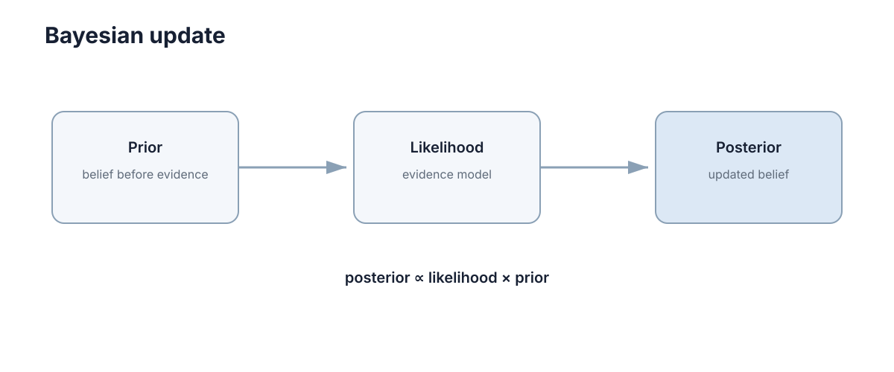

# Conditional Probability & Bayes

> 这一章的内容你其实一直在做，只是没写成公式。读完你应该能自己推出三件事：为什么「看到证据就直接下结论」在小概率事件上会错得离谱、为什么可以把「假设导致观测」翻过来算，以及为什么观测多了以后先验会自己退场。

---

## 一、先看你已经会做的一件事

早上出门前你往窗外看一眼：天色发暗，地面是湿的。你没查天气预报，直接回屋拿了伞。

这个过程里藏着三个判断，一个都不能少：

1. **你本来就有个印象。** 昨天太阳很好，你原本并不觉得今天会下雨。这叫**先验**（prior）——看到证据之前你对这件事的信念。
2. **你评估了这条线索有多指向「下雨」。** 可是洒水车也能把地面弄湿。所以你在心里同时估了两个量：如果真下雨，看到湿地面有多常见；如果没下雨，看到它又多常见。这一对可能性合起来决定线索的份量，它叫**似然**（likelihood）——「假设成立时，看到这个观测的可能性」。
3. **两样东西合起来，你改了主意。** 拿伞这个动作背后是更新后的判断，叫**后验**（posterior）。

<figure markdown="span">
  
  <figcaption>先验表示观测前的信念，似然描述观测与假设的匹配程度，后验是更新后的信念。</figcaption>
</figure>

还有第四个判断，最容易被忽略：**方向。** 「下雨 → 地湿」很容易估，可你真正想知道的是「地湿 → 下雨」。这两句话不是一回事，把任何一个当成另一个，都会得出离谱的结论。

这一章要做的，就是把先验、似然、后验、方向这四件事写成能算的式子，并且让你能自己复算出其中每一个数字。

---

## 二、为什么「看到就信」会错得离谱

设一种罕见病，人群患病率 1%。你手上有台检测器，说明书上写着：灵敏度 99%（真病人里 99% 会测出阳性），特异度 95%（健康人里 95% 被判阴性，也就是 5% 的假阳性）。

你测出来是阳性。你现在得病的概率是多少？

绝大多数人的第一反应是「99% 左右」。正确答案是 **16.7%**——测出阳性的人里，大约只有六分之一真的有病。

错在哪？你把「真病人里 99% 会阳性」（似然，方向是 病 → 阳性）当成了「阳性里 99% 是病人」（后验，方向是 阳性 → 病）。第一节说的那个「方向」，在这里直接决定了一个人的心情。

同样地，工程师面对「传感器说前方有障碍」时如果犯同一个错，就会把 5% 的假阳性读成 95% 的把握。

所以要有一套固定的算法，它至少得回答三件事：

- 原来的判断（先验）怎么进公式；
- 线索的份量怎么量化；
- 方向怎么翻过来。

这套算法就是条件概率和 Bayes 公式。下面两节把它从零推出来；第二节那个 16.7% 是怎么来的，第七节会按人数一格一格算给你看。

---

## 三、条件概率：把「范围缩小」写成一个除法

先看清楚「条件」到底做了什么。某社区 1000 个人：

| | 咳嗽 | 不咳嗽 | 合计 |
| --- | --- | --- | --- |
| 感冒 | 120 | 80 | 200 |
| 不感冒 | 180 | 620 | 800 |
| 合计 | 300 | 700 | 1000 |

问：一个人咳嗽，他感冒的概率是多少？

不用公式也能算：先把「全世界」缩小到「咳嗽的那 300 人」，再看这 300 人里有几个感冒——120 个。所以

$$
\frac{120}{300}=0.4 .
$$

写成概率记号就是 $P(A\mid B)$，这里 $A$ 是「感冒」、$B$ 是「咳嗽」。注意这个除法里分子分母各是什么：

$$
P(A\mid B)=\frac{P(A\cap B)}{P(B)},\qquad P(B)>0 .
$$

**分母 $P(B)$ 不是凭空加进来的归一化常数，它就是「把总数从 1000 换成 300」这个动作。** 分子 $P(A\cap B)$ 是「既在 A 里又在 B 里」的那部分（120/1000）。两个一比，问的就是「B 当中有多大比例也属于 A」。

四个量的分工：

| 符号 | 名称 | 数学含义 | 工程里由谁提供 |
| --- | --- | --- | --- |
| $P(A\cap B)$ | 联合概率 | A 与 B 同时成立的程度 | 通常不直接测量，由分解式算出 |
| $P(B)$ | 边缘概率 | 观测出现的总体频率 | 对所有假设求和或积分的归一化项 |
| $P(A\mid B)$ | 条件概率 | 已知 B 之后 A 的可信度 | 推断的目标输出 |
| $P(A)$ | 先验概率 | 不看 B 时对 A 的默认判断 | 上一帧后验、地图或物理约束 |

### 为什么必须除以 $P(B)$，以及独立是什么意思

除法能顺手告诉我们「线索到底有没有用」。上表里 $P(\text{感冒})=0.2$，而 $P(\text{感冒}\mid\text{咳嗽})=0.4$，翻了一倍——咳嗽确实携带信息。

反过来，如果某个条件 $C$ 满足 $P(A\mid C)=P(A)$，意思就是「知道 C」对 A 的判断毫无影响。代进定义得 $P(A\cap C)/P(C)=P(A)$，也就是

$$
P(A\cap C)=P(A)P(C).
$$

这就是**独立**的定义。它不是额外假设，而是「这条线索没用」的数学写法。所以「独立」在工程上是个很强的判断：传感器测量互相独立，等价于说彼此的信息完全不重叠。

### 分母 $P(B)$ 自己怎么求

还是回到表上。咳嗽的 300 人分成互不重叠的两堆：感冒且咳嗽的 120 人、不感冒且咳嗽的 180 人。两边同除以 1000：

$$
P(\text{咳嗽})=\underbrace{\frac{120}{1000}}_{0.6\times0.2}+\underbrace{\frac{180}{1000}}_{0.225\times0.8}=0.12+0.18=0.30 .
$$

一般形式就是**全概率公式**：若 $A$ 与 $\neg A$ 互斥且穷尽，则

$$
P(B)=P(B\mid A)P(A)+P(B\mid\neg A)P(\neg A).
$$

推广到多个互斥完备事件 $A_i$ 就是 $P(B)=\sum_i P(B\mid A_i)P(A_i)$，连续情形把求和换成对条件密度的积分。它没有任何神秘之处：**就是把 B 的总量拆成几块分别数，再加起来。**

### 一个容易搞错的地方：条件必须是确定的事实

在 $P(A\mid B)$ 里，$B$ 被当成严格成立，而不是「大概成立」。所以当传感器本身有噪声时，不能把条件写成「已知前方大概有障碍」。正确写法是把条件换成确定发生的事件——「传感器输出了读数 $z$」——让全部不确定性进入似然项 $p(z\mid x)$。这一步是工程建模和教科书公式之间最容易出错的地方。

---

## 四、为什么要反着问：Bayes 反演

看同一张表上的两个方向：

- $P(\text{咳嗽}\mid\text{感冒})=120/200=0.6$：感冒的人里，六成咳嗽。
- $P(\text{感冒}\mid\text{咳嗽})=120/300=0.4$：咳嗽的人里，四成感冒。

同样那 120 个人，只因为分母换了个数（200 对 300），结论就从 0.6 变成 0.4。**方向不是笔误，是两个完全不同的问题。**

工程上为什么必须在这两个方向之间跳？因为通常只有一个方向能被测量：

- 「假设 → 观测」这一向可以统计出来。想知道「感冒的人咳嗽的概率」，找 200 个感冒的人，数一数有多少咳嗽就行。
- 「观测 → 假设」这一向没法这么干。你想知道「咳嗽的人里有多少感冒」，但你没办法把全社区的人先拉来一个个确诊，再看谁咳嗽。

传感器的噪声模型正是前者：把机器人摆在已知的真实位置 $x$ 上，记录读数 $z$ 的分布——标定实验就能测出 $p(z\mid x)$。而真正想知道的是 $p(x\mid z)$：给定今天这一帧读数，车到底在哪。**一个可测量，一个不可测量，方向还相反。**

公式就是从这个对称关系里解出来的。同一个联合概率有两种拆法，两种必然相等：

$$
P(A\cap B)=P(A\mid B)P(B)=P(B\mid A)P(A).
$$

把 $P(A\mid B)$ 单独解出来：

$$
P(A\mid B)=\frac{P(B\mid A)P(A)}{P(B)}.
$$

就这一步。右边三项全是能手头拿到的东西：先验 $P(A)$、可标定的似然 $P(B\mid A)$、以及用全概率公式算出来的分母。

代进感冒表验证一遍：$0.6\times0.2/0.3=0.4$，和直接数出来的结果一致。

连续量版本形状完全一样，只是分母从求和变成积分：

$$
p(x\mid z)=\frac{p(z\mid x)p(x)}{\int p(z\mid x')p(x')\,dx'}.
$$

工程上常写成比例形式 $p(x\mid z)\propto p(z\mid x)p(x)$。**这是因为分母与 $x$ 无关**，当你的目的只是「比较哪个假设更大」时，它可以整块丢掉；只有需要报出一个绝对概率（比如「16.7%」）时才必须算出来。

---

## 五、赔率与似然比：更新其实就是乘法

Bayes 公式里最麻烦的是分母。有个写法能把它彻底甩掉：不看概率，看**赔率**（odds）——一件事发生的概率与不发生的概率之比：

$$
\mathrm{odds}(A)=\frac{P(A)}{P(\neg A)} .
$$

感冒的先验赔率是 $0.2/0.8=0.25$，读作「1 : 4」。线索的份量用一个数表示：**似然比**（likelihood ratio，LR）

$$
\mathrm{LR}=\frac{P(B\mid A)}{P(B\mid\neg A)}=\frac{0.6}{0.225}\approx2.67 ,
$$

分母那个 0.225 来自表里「不感冒的人中 180/800 会咳嗽」。

现在把 Bayes 公式对 $A$ 和 $\neg A$ 各写一遍，再相除，$P(B)$ 就被约掉了：

$$
\frac{P(A\mid B)}{P(\neg A\mid B)}=\underbrace{\frac{P(A)}{P(\neg A)}}_{\text{先验赔率}}\cdot\underbrace{\frac{P(B\mid A)}{P(B\mid\neg A)}}_{\text{似然比}} .
$$

**后验赔率 = 先验赔率 × 似然比。** 代数字：$0.25\times2.67\approx0.667$，还原成概率是 $0.667/(1+0.667)\approx0.4$，和第三节一模一样。

这个形式的价值在于累积：多次独立观测时，只需要一路连乘，

$$
\mathrm{odds}_{\text{后}}=\mathrm{odds}_{\text{先}}\times\mathrm{LR}_1\times\mathrm{LR}_2\times\cdots ,
$$

而且每一步都不用做归一化——归一化可以留到你想报出概率的那一刻再做。

取对数还能把乘法变成加法，得到以比特计的证据量 $\log_2\mathrm{LR}$：似然比为 2 时约 1 bit，为 10 时约 3.3 bit，为 100 时约 6.6 bit。比特的好处是可以和「一次观测值不值这个成本」直接比较，也可以判断两条独立证据的信息能不能简单相加。

| 似然比 | 证据强度 | 把先验赔率改变的倍数 | 能把 1:1 的先验推到 |
| --- | --- | --- | --- |
| 2 | 弱 | × 2 | 67% |
| 3 | 中等偏弱 | × 3 | 75% |
| 10 | 强 | × 10 | 91% |
| 30 | 很强 | × 30 | 97% |
| 100 | 极强 | × 100 | 99% |

---

## 六、一个能自己复算的例子（先验 → 似然 → 后验）

机器人在一条走廊里，只有两处可能的位置：A 和 B。上一帧它更相信自己在外面的 A 处，先验取

$$
P(A)=0.7,\qquad P(B)=0.3 .
$$

这个先验不是拍脑袋来的：上一帧的后验、或者「从 A 出发往前走了 1 m」这样的运动模型，都会给出它。

现在传感器看到一扇门。两处的「看到门」概率不一样——A 附近门少，B 附近门多：

$$
P(z\mid A)=0.2,\qquad P(z\mid B)=0.9 .
$$

这就是似然，由真实环境布局和探测能力决定，可以在标定阶段测出来。

**第一步：算分子。** 先验乘以似然，得到「沿这条路径同时成立」的证据量：

| 位置 | 先验 | 似然 | 乘积 |
| --- | --- | --- | --- |
| A | 0.70 | 0.20 | 0.140 |
| B | 0.30 | 0.90 | 0.270 |
| 合计 | 1.00 | — | 0.410 |

**第二步：归一化。** 这两个乘积是联合量，加起来必须等于 1（因为位置非 A 即 B），所以除以它们的和：

$$
P(A\mid z)=\frac{0.140}{0.410}\approx0.341,\qquad P(B\mid z)=\frac{0.270}{0.410}\approx0.659 .
$$

那个分母 0.410 就是全概率公式：$P(z)=0.2\times0.7+0.9\times0.3$。

两件事值得停一下：

- **B 从 0.30 涨到 0.66**，说明这条观测真的携带信息。
- **A 没有被清零。** 它的先验优势（0.7 对 0.3）部分抵消了似然劣势（0.2 对 0.9）。更新不是「证据说了算」，是证据和原来的判断讨价还价。

用赔率复核：先验赔率 $0.7/0.3\approx2.33$，似然比 $0.2/0.9\approx0.222$，乘积 $0.519$，对应 $P(B\mid z)=1/(1+0.519)\approx0.66$，一致。

**再加一次观测。** 机器人往前走，又看到一扇门，同样的似然。这次不用重新列表，直接把赔率再乘一次：

$$
\mathrm{odds}_{\text{后}}=\frac{0.7}{0.3}\times0.222\times0.222\approx0.115 \;\Longrightarrow\; P(B\mid z_1,z_2)=\frac{1}{1+0.115}\approx0.897 .
$$

两次都只是弱证据（似然比才 0.22），合起来把 B 从 0.30 推到 0.90。这就是「观测可以累积」的定量含义：每一次更新都接着上一帧的后验继续，而不是从头开始。

**换一个起点看看。** 同样的观测，如果先验是平的（A、B 各 0.5），那么先验赔率为 1，一次更新后赔率直接是 0.222，$P(B\mid z)=1/1.222\approx0.818$；而在先验偏向 A 的设定里只到 0.66。**证据没变，结论变了——因为起点不一样。** 要把 B 推到 0.95 以上，在先验 0.7 的设定下需要三次这样的观测。

---

## 七、起点在哪，比证据多强更重要：基础率谬误

把第二节那个检测器一格一格算清楚。设定：

- 患病率 $P(D)=1\%$；
- 灵敏度 $P(+\mid D)=99\%$——方向是「病 → 阳性」；
- 特异度 95%，也就是健康人里 5% 假阳性：$P(+\mid\neg D)=5\%$。

用 1000 人的表来算，每个数字都能手验（真实世界是整数人，这里用小数是为了避免舍入）：

| | 阳性 | 阴性 | 合计 |
| --- | --- | --- | --- |
| 有病 | $0.99\times10=9.9$ | 0.1 | 10 |
| 健康 | $0.05\times990=49.5$ | 940.5 | 990 |
| 合计 | 59.4 | 940.6 | 1000 |

于是阳性预测值（真的得病的概率）是

$$
P(D\mid +)=\frac{9.9}{59.4}\approx0.167 .
$$

和第二节那个 16.7% 对上了。原因一眼看得出来：健康人是病人的 99 倍，假阳性率虽然只有 5%，乘在 990 这个基数上得到 49.5，比真阳性 9.9 还多出 5 倍。

**改哪一项，影响差多少？** 下面四个数字都能用一行算术复算：

| 你改了什么 | 计算 | 阳性预测值 | 相对基线 |
| --- | --- | --- | --- |
| 基线（患病率 1%、灵敏度 99%、假阳性 5%） | $0.0099/0.0594$ | 0.167 | — |
| 患病率 1% → 10% | $0.099/0.144$ | 0.688 | ×4.1 |
| 假阳性率 5% → 1% | $0.0099/0.0198$ | 0.500 | ×3.0 |
| 灵敏度 99% → 90% | $0.009/0.0585$ | 0.154 | ×0.92 |
| 患病率 1% → 0.1% | $0.00099/0.05094$ | 0.019 | ×0.12 |

从表里读出来的结论是：在低基准率下，**把假阳性率砍到五分之一（5% → 1%）带来的提升，比把灵敏度从 99% 提到 100% 大得多**，因为假阳性是被 990 这个庞大基数乘上去的。这就是故障检测和异常识别为什么把目标定在极低的假阳性率，而不是极高的召回率。

工程上有三条直接可用的做法：

1. **报阳性必须同时报基准率。** 同一个检测器，在 1% 人群里给出 16.7%，在 10% 人群里给出 68.8%；只报前半截数字会严重误导。
2. **基准率极低时，先用便宜手段把先验抬起来。** 低精度初筛把先验从 1% 抬到 10% 之后，同一个高精度检测器的阳性预测值就从 0.167 变成 0.688。
3. **连续独立检测等价于赔率连乘。** 这个例子里单次似然比是 $0.99/0.05=19.8$，先验赔率 $0.01/0.99\approx0.0101$：一次阳性 → 0.167，两次 → 0.798，三次 → 0.987。

---

## 八、连续量怎么做：精度可以直接相加

机器人里的位置和速度都是连续量，先验和似然变成概率密度，公式形状一个字都不用改。而当先验取高斯、似然也取高斯（观测模型为「读数 = 真值 + 噪声」）时，后验仍然是高斯——这种「后验与先验同族」的分布对叫**共轭先验**（conjugate prior）。它的价值在于：**求积分这件事退化成更新两个数**，计算量恒定。

设先验 $x\sim\mathcal{N}(\mu_0,\sigma_0^2)$、观测 $z\mid x\sim\mathcal{N}(x,\sigma_z^2)$，则后验 $x\mid z\sim\mathcal{N}(\mu,\sigma^2)$，其中

$$
\sigma^2=\left(\frac{1}{\sigma_0^2}+\frac{1}{\sigma_z^2}\right)^{-1},\qquad \mu=\sigma^2\left(\frac{\mu_0}{\sigma_0^2}+\frac{z}{\sigma_z^2}\right).
$$

这个结果有一个干净的读法，也是它值得记的理由：定义**精度** $\tau=1/\sigma^2$（方差越小、精度越高），第一式就是

$$
\tau=\tau_0+\tau_z .
$$

**精度直接相加。** 而后验均值是两端按精度加权的平均——谁更准，谁的话更算数。这和第六节「先验 × 似然再归一化」是同一件事，只是在高斯情形下乘法变成了加法。

| 情形 | 精度比 $\tau_0:\tau_z$ | 后验均值 | 后验标准差 |
| --- | --- | --- | --- |
| 先验极准、观测很糙 | 100 : 1 | 几乎等于 $\mu_0$ | 0.0995 |
| 二者等权 | 1 : 1 | 两者中点 | 0.707 |
| 先验很糙、观测极准 | 1 : 100 | 几乎等于 $z$ | 0.0995 |

（标准差取 $\sigma_z=1$ 算出：第一行 $\tau=101$，$\sigma=1/\sqrt{101}$。）

连续做 $N$ 次方差同为 $\sigma_z^2$ 的独立观测，后验变成

$$
\tau_N=\tau_0+\frac{N}{\sigma_z^2},\qquad \mu_N=\frac{\tau_0\mu_0+N\tau_z\bar z}{\tau_0+N\tau_z},\qquad \sigma_N=\frac{\sigma_z}{\sqrt{N+\tau_0\sigma_z^2}} .
$$

先验权重占比是 $\tau_0/(\tau_0+N\tau_z)$，按 $1/N$ 衰减；后验标准差按 $1/\sqrt{N}$ 收缩。取 $\sigma_0=\sigma_z=1$：$N=1$ 时先验占 50%，$N=10$ 降到 9.1%，$N=100$ 只剩 0.99%。**这就是长期运行的系统可以慢慢忘掉粗糙初始先验的原因**，也是「先验相当于 $\sigma_z^2/\sigma_0^2$ 次虚拟观测」这句话的出处。

共轭配对不止高斯一种，它们都把一次积分换成一次参数更新，适合嵌入式实时系统：

| 先验族 | 似然族 | 后验族 | 典型用途 |
| --- | --- | --- | --- |
| 高斯 | 高斯（方差已知） | 高斯 | 位置与速度估计 |
| Beta | 伯努利 / 二项 | Beta | 成功率、占用栅格概率 |
| Dirichlet | 多项 | Dirichlet | 离散地图类别 |
| Gamma | 泊松 | Gamma | 到达率、计数型传感器 |

代价是模型灵活性。真实分布明显偏离高斯时（比如走廊里两处相似门框，后验本来是两个峰），强行用高斯共轭更新会把两个峰硬合成一个，带来系统性偏差。这时候要么改用粒子表示，要么改用多峰分布。

---

## 九、要一个点还是要一条分布：ML 与 MAP

前面一直在算整条分布。但很多工程里最后只想报一个数：车在哪。两条最常用的答案：

$$
\hat{x}_{\mathrm{ML}}=\arg\max_x p(z\mid x),\qquad \hat{x}_{\mathrm{MAP}}=\arg\max_x\big[\log p(z\mid x)+\log p(x)\big].
$$

第二式就是把 $p(x\mid z)\propto p(z\mid x)p(x)$ 取了对数：**乘积变加法。** 这一步在数值上至关重要——概率连乘几十项会下溢成 0，而对数连加不会。多出来的 $\log p(x)$ 在工程里的名字叫**正则项**：它在似然之外单独拉住解，不让它跑太远。

| 维度 | ML | MAP |
| --- | --- | --- |
| 最大化的对象 | 似然 $p(z\mid x)$ | 后验 $p(x\mid z)$ |
| 用不用先验 | 不用 | 用，先验对数充当正则项 |
| 数据少 / 噪声大 | 容易被噪声带走 | 被先验稳住，解更平缓 |
| 数据充分时 | 与 MAP 趋近一致 | 似然主导，先验被淹没 |
| 与正则化的对应 | 无 | 高斯先验 ↔ L2，拉普拉斯先验 ↔ L1 |

「数据够多时两者一致」不是口号，它是第八节那两个式子直接给出来的：后验不确定度按 $1/\sqrt{N}$ 收缩、先验权重按 $1/N$ 衰减。而在 $N=1$ 时，权重完全由方差之比决定。

这也解释了为什么「最像当前观测的状态」不等于「综合全部信息后最可信的状态」：一帧被强噪声污染的观测能把 ML 解拉得很远，而 MAP 因为带着运动先验，会把它拽回合理范围。

---

## 十、从一次更新到一直更新：递推滤波

单次更新只处理「一个先验 + 一个观测」。真实系统要一直跑，于是把它串成两步循环：

$$
\text{预测：}\quad p(x_t\mid z_{1:t-1})=\int p(x_t\mid x_{t-1})\,p(x_{t-1}\mid z_{1:t-1})\,dx_{t-1},
$$

$$
\text{更新：}\quad p(x_t\mid z_{1:t})\propto p(z_t\mid x_t)\,p(x_t\mid z_{1:t-1}).
$$

预测步把上一帧的信念按运动模型往前推（车往前开了，「我在哪」也跟着平移并变模糊）；更新步吸收本帧观测；**这一帧的后验，就是下一帧的先验**——第六节那个「再加一次观测」的操作，就是这条循环的最小版本。

为什么必须递推，而不能每次从头批处理？三条理由都带量化后果：

| 原因 | 从头批处理的后果 | 递推的后果 |
| --- | --- | --- |
| 计算量随时间累积 | $T$ 帧后代价与 $T$ 成正比 | 每帧代价恒定，与运行时长无关 |
| 历史数据必须全留着 | 需要存储全部原始观测 | 只需当前信念与少量状态 |
| 实时性预算 | 延迟随运行时长增长直至失控 | 延迟固定在单帧预算内 |

一个必须保留全部历史才能给出当前位置的系统，运行十分钟后必然崩溃，无论算法多精确。

递推的代价是信息不再显式保留：一旦把后验压缩成参数（比如高斯的均值和方差），历史细节就被丢掉了，这个假设叫**充分统计量**。若真实后验是多峰的，单高斯会强行把它合成一个峰，导致状态丢失——这正是粒子滤波存在的动机。完整工程实现见 [../robotics/02-sensing-estimation.md](../robotics/02-sensing-estimation.md)，那里会看到本节这两行公式就是所有滤波器的骨架。

---

## 十一、跑一遍：在终端里把整条链算出来

下面这段只用标准库，把第六节的更新链和第七节的基础率算成可对照的数字。改动标出的那几行参数，你会看到结论怎么跟着动。

```python
# 一次离散 Bayes 更新：先验 -> 似然 -> 后验
def update(prior, likelihood):
    joint = {h: prior[h] * likelihood[h] for h in prior}   # 分子：先验 x 似然
    pz = sum(joint.values())                               # 分母：全概率（所有路径相加）
    return {h: joint[h] / pz for h in joint}, pz, joint

P0 = {"A": 0.70, "B": 0.30}          # 先验（可以改成 0.5/0.5 对比第六节那段）
LZ = {"A": 0.20, "B": 0.90}          # 似然：看到门
post, pz, joint = update(P0, LZ)
print("先验x似然 =", {h: round(v, 3) for h, v in joint.items()}, "  P(z) =", round(pz, 3))
print("一次观测后 =", {h: round(v, 3) for h, v in post.items()})

# 赔率形式：先验赔率连乘似然比，中途不做归一化
odds, lr = P0["A"] / P0["B"], LZ["A"] / LZ["B"]    # 都取 A 侧，别把方向搞反
print("先验赔率(A:B)=%.4f  似然比=%.4f" % (odds, lr))
for n in range(1, 5):
    odds *= lr
    print("连乘 %d 次: P(B|z) = %.4f  P(A|z) = %.4f" % (n, 1 / (1 + odds), odds / (1 + odds)))

# 基础率谬误：同一个检测器换一个基准率
def ppv(prev, sens, fpr):
    return prev * sens / (prev * sens + (1 - prev) * fpr)

print("阳性预测值: 患病率1%% -> %.4f  患病率10%% -> %.4f  假阳性1%% -> %.4f"
      % (ppv(0.01, 0.99, 0.05), ppv(0.10, 0.99, 0.05), ppv(0.01, 0.99, 0.01)))
base, lr_test = 0.01 / 0.99, 0.99 / 0.05
for k in (1, 2, 3):
    o = base * lr_test ** k
    print("连续 %d 次阳性: P(病) = %.4f" % (k, o / (1 + o)))
```

跑出来是这样（全是解析算式，任何机器上结果都完全一致）：

```text
先验x似然 = {'A': 0.14, 'B': 0.27}   P(z) = 0.41
一次观测后 = {'A': 0.341, 'B': 0.659}
先验赔率(A:B)=2.3333  似然比=0.2222
连乘 1 次: P(B|z) = 0.6585  P(A|z) = 0.3415
连乘 2 次: P(B|z) = 0.8967  P(A|z) = 0.1033
连乘 3 次: P(B|z) = 0.9750  P(A|z) = 0.0250
连乘 4 次: P(B|z) = 0.9943  P(A|z) = 0.0057
阳性预测值: 患病率1% -> 0.1667  患病率10% -> 0.6875  假阳性1% -> 0.5000
连续 1 次阳性: P(病) = 0.1667
连续 2 次阳性: P(病) = 0.7984
连续 3 次阳性: P(病) = 0.9874
```

前三行复现了第六节：0.140 与 0.270 相加得 0.41，归一化后是 0.341 / 0.659。中间四行是同一个更新连做四次——每做一次就把后验赔率再乘一个 0.2222，第三次就过了 0.95，与第六节手算的「三次」一致。最后几行是第七节：患病率从 1% 抬到 10%，阳性预测值从 0.1667 涨到 0.6875；把假阳性率从 5% 压到 1%，也能涨到 0.5000。

这里有一个最容易抄反的地方：打印的 `似然比=0.2222` 是 **A 侧**的比（对应 $P(A\mid z)$），所以还原 `P(B|z)` 要用 `1/(1+odds)`。如果改成 B 侧，所有赔率都会变成倒数——方向一错，结论就整个反过来。

第二段把第八节的「精度可加」跑成一个看得见的收敛过程：先验说 10，观测却说 12，看后验怎么被慢慢拉过去。

```python
import numpy as np

mu0, sigma0, sigma_z = 10.0, 2.0, 1.0     # 先验 N(10, 2^2)；单次观测噪声 sigma_z=1

def post(n, zbar, s0=sigma0, sz=sigma_z, m0=mu0):
    tau = 1 / s0**2 + n / sz**2                       # 精度直接相加
    mu = (m0 / s0**2 + n * zbar / sz**2) / tau        # 按精度加权平均
    return mu, np.sqrt(1 / tau)

print("先验 N(10, 2^2)，观测均值 12.0，单次噪声 sigma_z=1.0")
for n in (1, 2, 5, 10, 100):
    mu, sd = post(n, 12.0)
    w = (1 / sigma0**2) / (1 / sigma0**2 + n / sigma_z**2)
    print("N=%-4d 后验均值=%.3f 后验标准差=%.3f 先验权重=%.3f" % (n, mu, sd, w))

# 只信最新一帧（丢掉先验，即 ML）：观测很吵时它会偏多远
zbar = 12.0
for n in (1, 5, 20):
    mu_map, _ = post(n, zbar)
    print("N=%-4d ML(zbar)=%.3f  MAP=%.3f  差=%.3f" % (n, zbar, mu_map, abs(zbar - mu_map)))

# 后验标准差随 N 收缩：直接画在终端里
ns = list(range(1, 21))
sds = [post(n, zbar)[1] for n in ns]
lo, hi, rows = min(sds), max(sds), 8
grid = [[" "] * len(ns) for _ in range(rows)]
for i, s in enumerate(sds):
    grid[round((hi - s) / (hi - lo) * (rows - 1))][i] = "*"
for r, row in enumerate(grid):
    print("%5.2f |" % (hi - r * (hi - lo) / (rows - 1)) + "".join(row))
print("      +" + "-" * len(ns) + "  N = 1 -> 20")
```

跑出来是这样：

```text
先验 N(10, 2^2)，观测均值 12.0，单次噪声 sigma_z=1.0
N=1    后验均值=11.600 后验标准差=0.894 先验权重=0.200
N=2    后验均值=11.778 后验标准差=0.667 先验权重=0.111
N=5    后验均值=11.905 后验标准差=0.436 先验权重=0.048
N=10   后验均值=11.951 后验标准差=0.312 先验权重=0.024
N=100  后验均值=11.995 后验标准差=0.100 先验权重=0.002
N=1    ML(zbar)=12.000  MAP=11.600  差=0.400
N=5    ML(zbar)=12.000  MAP=11.905  差=0.095
N=20   ML(zbar)=12.000  MAP=11.975  差=0.025
 0.89 |*
 0.80 |
 0.70 | *
 0.61 |
 0.51 |  **
 0.41 |    ***
 0.32 |       ******
 0.22 |             *******
      +--------------------  N = 1 -> 20
```

三条线索各自对应前面的一节：

- **N=1 时先验权重 20%**，正是第八节那句「权重由精度之比决定」：先验精度 $1/4$、观测精度 $1/1$，$0.25/(0.25+1)=0.2$。
- **先验权重从 20% 掉到 0.2%**（N 从 1 到 100），就是那个按 $1/N$ 衰减的式子。看后验均值：从 11.600 一路爬到 11.995——观测说要 12，先验说要 10，**数据少的时候先验拽得很牢，数据多了才让位**。
- **ML 一直钉在 12.000，MAP 从 11.600 追上去**：这就是第九节那张表的后半段，数据充分时两者趋近、数据少时先验把解稳住。最下面那张图是后验标准差随 N 收缩，形状正是 $1/\sqrt{N}$。

---

## 十二、翻车现场速查

| 你看到的现象 | 最可能的原因 | 先验证什么 |
| --- | --- | --- |
| 阳性结果被当成确诊 | 把似然当后验，方向搞反 | 先算基准率；看 $P(+)$ 被真阳性还是假阳性主导 |
| 检测器很可靠，结论却还是很犹豫 | 基准率太低，或先验太强 | 算先验赔率 × 似然比，看乘积有多大 |
| 概率连乘几步后变成 0 | 在概率域直接连乘 | 换到对数域（对数似然 / MAP）再做加法 |
| 先验好像设了但没起作用 | 先验方差过大 | 检查先验真进了公式，还是退化成 ML |
| 后验几乎不动 | 先验方差过小，或它被当成了铁的事实 | 确认先验是「上一帧后验」，看方差有没有被低估 |
| 一帧噪声就把结果带跑 | 丢了运动先验，退化成只用当前观测 | 确认上一帧的后验有没有传进来 |
| 两个地方都像，却报出单个峰 | 假设了单峰高斯 | 换粒子表示或多峰分布；检查是否有两个相似观测 |
| 运行越久漂移越回不来 | 先验权重按 $1/N$ 衰减，又没有绝对观测 | 引入绝对观测或地图约束，别让它只靠递推 |

---

## 十三、小结：三句话回答三件事

- **为什么必须有它**：能测的方向（假设 → 观测）和想知道的方向（观测 → 假设）是反的，而两者由同一个联合概率拆出来，所以一次恒等变形就能把前者翻成后者；公式里的分母，本质就是把讨论范围按观测缩小一次。
- **代价是什么**：分母要求一次求和或积分，状态维度一高就没有解析解。工程上的三条出路是共轭先验（把积分换成参数更新）、采样近似（粒子滤波）、以及只保留比例式求最大值（MAP）。
- **为什么先验不能丢**：起点和证据一起决定结论。低基准率时同样的似然比给出的后验差一个数量级；反过来，观测足够多以后先验权重按 $1/N$ 衰减，它会自己退场——所以先验不是信仰问题，是权重问题。

> **下一步**：递推滤波里的运动模型 $p(x_t\mid x_{t-1})$ 只依赖「上一时刻」，这个性质就是 Markov 性。继续读 [./05-markov-processes.md](./05-markov-processes.md)，看它怎么把递推变成一条状态转移链；分布与期望的基础见 [./03-probability-random-variables.md](./03-probability-random-variables.md)；完整估计实现见 [../robotics/02-sensing-estimation.md](../robotics/02-sensing-estimation.md)。
