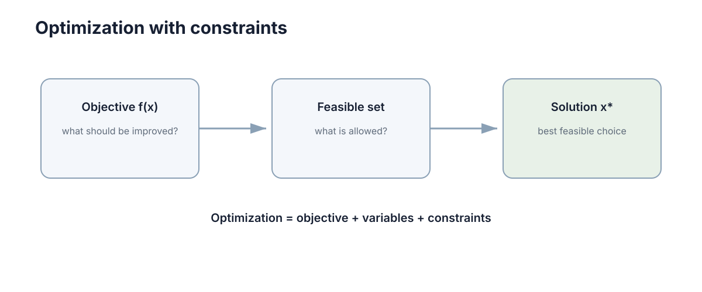

# 优化、约束与不确定性

优化的本质是：**在允许的选择中，找到让目标函数尽可能好的那一个。** 控制、规划、模型训练和资源分配都可以用这个统一语言描述。

<figure markdown="span">
  
  <figcaption>目标函数决定“好坏”，约束决定“哪些解允许被选择”。</figcaption>
</figure>

## 优化问题由变量、目标和约束组成

一般形式为

$$
\min_x f(x)\quad\text{s.t.}\quad g_i(x)\le0,\;h_j(x)=0.
$$

$x$ 是决策变量，$f$ 是目标函数，$g/h$ 定义可行域。建模时最常见的错误不是不会求解，而是把“希望更好”和“绝不能违反”混在一个目标函数里。

## 负梯度与下降方向

若 $f$ 可微，梯度下降更新

$$x_{k+1}=x_k-\alpha\nabla f(x_k).$$

对一个很小的位移 $\Delta x$，一阶近似给出

$$
f(x+\Delta x)\approx f(x)+\nabla f(x)^\top\Delta x.
$$

在长度固定的所有微小位移中，$\Delta x$ 与 $-\nabla f(x)$ 同向时，内积下降得最多。因此负梯度是局部最陡下降方向。步长 $\alpha$ 太小会前进缓慢，太大则可能越过有效的局部近似区域。

## 局部最优与全局最优

局部最优只要求在某个邻域内没有更好的可行点；全局最优则必须优于整个可行域中的所有点。凸问题的关键价值在于：任一局部最优同时也是全局最优。非凸问题存在多个谷底、鞍点与平坦区域，只依赖局部信息的方法通常无法证明自己找到了全局最低点。

## 约束与可行域

车辆最快路径可能需要超速，机械臂最短动作可能超过关节限位。约束优化的价值是把物理、安全和资源限制直接写进问题。

对等式约束 $h(x)=0$，可行移动必须沿约束面的切向方向。最优点处，目标函数沿这些切向方向都不能再下降，因此 $\nabla f$ 必须与约束面的法向量 $\nabla h$ 平行：

$$
\nabla f(x^*)+\lambda\nabla h(x^*)=0.
$$

拉格朗日乘子 $\lambda$ 正是把“沿可行方向无法继续改善”写成方程的系数，也可解释为约束放宽一单位时最优目标值的边际变化。

## 不确定参数的表示

摩擦、需求、传感器误差可能只知道一个范围或分布。处理方式可以是使用期望目标、加入安全 margin，或要求在一组可能参数下都保持可接受。

不必先学习完整 robust optimization 理论，关键是不要把未知参数伪装成完全精确。

## 一个有边界的最优化例子

设控制量 $u$ 的执行器范围为 $-1\le u\le1$，代价为

$$
J(u)=(u-0.35)^2+0.1u^2.
$$

无约束驻点由 $J'(u)=0$ 得到；若驻点落在可行区间内，它就是这个凸问题的全局最优。若驻点越过边界，最优解只能落在最近的可行边界上。这个例子同时展示了决策变量、目标函数、可行域，以及约束如何改变最优解。

## 最优解的敏感性

求出最优点后还要问：参数轻微变化时，解会不会大幅移动。若答案是会，单个最优值并不足以支持可靠决策。此时可比较邻域内的目标曲面、约束余量和不同场景下的解，把“最优”扩展为“对合理扰动仍可接受”。
