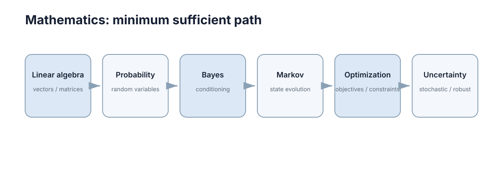

# Mathematics for Intelligent Systems

> **定位：** 只保留后续 AI、控制、机器人会反复使用的数学语言。这里不是数学专业课；目标是“看懂、能算、会建模”。

<figure markdown="span">
  
  <figcaption>主线从表示与变化开始，经数值计算和概率建模，最后进入动态随机过程与优化。</figcaption>
</figure>

## What to master

学完本 Section，只要求做到四件事：

1. 看懂向量、矩阵、梯度和 Jacobian；
2. 知道连续公式如何被离散并稳定地计算；
3. 用概率、Bayes 和 Markov 过程描述不确定性与状态演化；
4. 把智能系统问题写成目标、变量、约束和不确定性。

## Core chapters

| No. | Chapter | Why it stays in the core path |
|---:|---|---|
| 01 | [Linear Algebra & Calculus Essentials](01-linear-algebra-calculus.md) | 坐标变换、状态空间、相机模型和梯度学习的共同语言。 |
| 02 | [Numerical Computation Essentials](02-numerical-computation.md) | 仿真、控制、SLAM 和优化最终都在有限精度计算机上运行。 |
| 03 | [Probability & Random Variables](03-probability-random-variables.md) | 描述随机事件、期望、方差与噪声。 |
| 04 | [Conditional Probability & Bayes](04-conditional-bayes.md) | 用新观测更新判断，是状态估计和诊断的基础。 |
| 05 | [Markov Processes](05-markov-processes.md) | 从静态概率过渡到随时间演化的状态过程。 |
| 06 | [Optimization, Constraints & Uncertainty](06-optimization-under-uncertainty.md) | 把性能、约束、随机性和鲁棒性放进同一决策框架。 |

## Stop rule

如果你已经能读懂后续章节里的矩阵、概率、状态转移、梯度、数值步长和约束，就应继续往后学。SVD、复杂数值分析、KKT 证明、凸分析和高级鲁棒优化都放在 Further Reading，需要时再回来。
