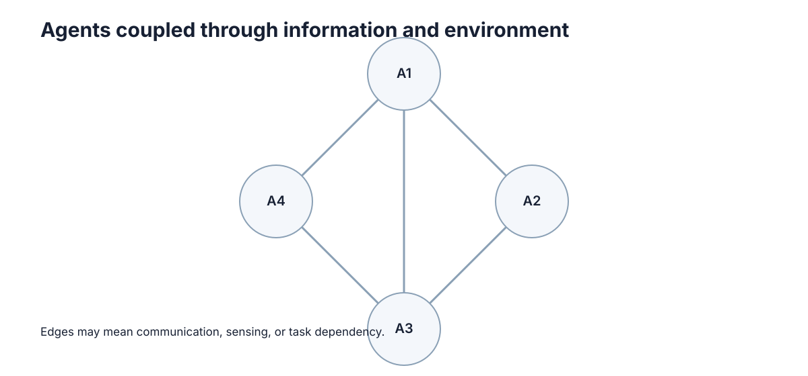

# Communication & Information Sharing

通信的价值不是"越多越好"，而是在带宽、时延、丢包和信息增益之间找到一个刚好够用的操作点。多智能体系统里最常见的工程错误，是把通信当成免费的无限资源：先让所有主体广播所有状态，再在带宽爆掉、延迟抬高之后再回头做减法。更聪明的做法从一开始就问——**接收方为了做出决定，究竟缺哪一部分信息，以及这份信息多久以后就失效**。

**最核心的一句话：一条消息只有改变了接收方的决策才有价值，其余比特都是纯开销。**

## 什么时候真的需要通信

先区分几个容易混淆的概念：

- **Message**：主体间显式传递的信息，需要带宽、可能丢失、可能延迟。
- **Shared observation**：多个主体直接观测到同一环境信息，无需传递即已共享。
- **Bandwidth / latency**：通信不是免费且即时的，二者共同决定信息可用性。
- **Common knowledge**：不仅"大家知道"，而且"大家都知道别人也知道"，是协调的最强前提。

通信的四种可能来源决定了我们是否需要真的发消息：

| 协调信息来源 | 通信需求 | 适用情形 | 局限 |
|---|---|---|---|
| 共享观测 | 无 | 传感器可覆盖同一场景 | 距离远时不可行 |
| 公共信号 | 无 | 有统一时钟或外部广播 | 无法表达个体意图 |
| 显式消息 | 有 | 局部观测、需交换意图 | 受带宽与丢包限制 |
| 事前约定 | 无 | 冲突模式可预先枚举 | 无法应对新情形 |

只有当"共享观测、公共信号、事前约定"三者都无法覆盖某个决策所需的差异时，才真正需要通信。很多"必须通信"的直觉，其实是被共享观测或约定悄悄替代的。

## 消息应该传什么

通信的作用通常是弥补局部观测、共享意图或同步状态，但**它不是协调的唯一来源**。设计时先问三件事：消息是否必要？频率多高？延迟或丢包后系统是否还能退化运行？

设接收方决策为 $a$，收到消息 $m$ 前后的最优决策分别为 $a_{\text{after}}$ 和 $a_{\text{before}}$。消息的决策相关性定义为

$$
I(m)=\mathbb{1}\big[a_{\text{after}}\ne a_{\text{before}}\big].
$$

只有 $I(m)=1$ 的消息才真正改变行为。若某类消息的 $I(m)$ 长期为 0，它就是无效负载，应当删除。这一"决策相关性"判据，比"信息是否完整"更贴近工程需求。

| 消息内容 | 典型大小 | 决策相关性 | 是否值得发 |
|---|---|---|---|
| 自身位姿 + 时间戳 | 24 B | 高（避障/分配） | 是 |
| 当前任务归属 | 8 B | 高（防重复） | 是 |
| 完整点云/图像流 | 数百 KB | 低（多数帧不改变决策） | 通常否 |
| 原始 IMU 高频流 | 大 | 低 | 否（本地处理） |

## 带宽、延迟与丢包

三者共同决定通信链路的可用性，缺一不可：

- **带宽**：单位时间可传的比特数，决定能发多少。
- **延迟**：消息从发出到可用的时间，决定信息有多"新鲜"。
- **丢包**：消息根本未到达的概率，决定系统要容忍多少缺失。

设单条消息大小为 $b$ 比特，发送频率为 $f$ 赫兹，链路带宽为 $B$ 比特每秒，则链路利用率

$$
\rho=\frac{n(n-1)\,b\,f}{B},
$$

其中 $n$ 为主体数（全互联时每条消息有 $n-1$ 个接收方）。当 $\rho\to 1$ 时队列开始堆积，延迟非线性上升——这是通信系统崩溃的经典前兆。

- **Event-driven messaging**：仅在状态变化时发送，可把有效 $f$ 从固定高频降到事件率。
- **Publish-subscribe**：发送者不关心接收者是谁，接收者按主题订阅，天然支持一对多与解耦。

| 指标 | 物理含义 | 恶化后果 | 缓解手段 |
|---|---|---|---|
| 带宽不足 | 队列堆积 | 延迟上升、丢包加剧 | 降采样、事件驱动、压缩 |
| 延迟过高 | 信息过期 | 基于旧状态决策 | 时间戳 + 有效期 |
| 丢包率高 | 状态缺失 | 决策依据缺失 | 冗余发送、本地预测 |

## 发布订阅与事件驱动

发布订阅把"谁发"和"谁收"解耦：发布者只把消息投到某个主题（topic），订阅者只声明自己关心的主题。在多机器人系统里，这等价于把通信图从"人人互联"压缩成"按需连接"。

多车共享"我正在去目标 X"比持续广播完整传感器流便宜得多，却可能已经足够避免重复分配。原因在于：**任务冲突只关心意图，不关心原始像素**。把 $O(n^2)$ 的全互联流量压缩成按主题订阅的 $O(|\mathcal{E}|)$ 稀疏流量，是分布式中间件的核心贡献（具体实现见 [中间件与 ROS 2 / DDS](../distributed-systems/05-middleware-ros2-dds.md)）。

主题划分的粒度本身就是一处设计决策。设系统有 $K$ 个主题，每个主题的平均订阅者数为 $s_k$，则总接收量为

$$
R_{\text{pubsub}}=\sum_{k=1}^{K} f_k\, b_k\, s_k ,
$$

其中 $f_k$、$b_k$ 分别为该主题的发布频率与消息大小。主题划得太粗（如一个"全部状态"主题）会退化为全广播；划得太细（每个字段一个主题）则订阅管理开销上升。实用经验是让主题边界与**决策粒度**对齐——一次决策所需的信息放在同一主题里。

| 通信模式 | 流量量级 | 耦合度 | QoS 需求 |
|---|---|---|---|
| 全广播 | $O(n^2)$ | 强耦合 | 高带宽、尽力而为 |
| 发布订阅 | $O(|\mathcal{E}|)$ | 松耦合 | 可按主题分层 |
| 事件驱动 | 事件率 $\lambda$ | 松耦合 | 低延迟、可容忍丢包 |

## 消息设计通常比发得更多更重要

多智能体系统最容易走向"所有主体广播所有状态"。这种方案实现简单，却会迅速增加带宽、处理延迟和无效信息。更好的问题是：**接收方为了做决定，真正缺哪一部分信息？**

例如任务分配时，主体往往只需要共享当前位置、当前任务、剩余资源和少量置信度，而不需要持续广播完整传感器流。再进一步，消息应带时间戳和有效期，否则一个"正确但已经过期"的状态可能比没有消息更危险。

<figure markdown="span">
  
  <figcaption>通信的核心问题是"谁需要知道什么，以及信息多久以后就失效"。</figcaption>
</figure>

一条消息的信息含量，可以用接收方状态不确定性的下降量衡量。设接收方对某变量的先验熵为 $H(\text{prior})$、后验熵为 $H(\text{post})$，则信息增益

$$
\Delta H = H(\text{prior}) - H(\text{post}).
$$

若 $\Delta H\approx 0$，这条消息几乎没有减少不确定性，不值得发送。设计目标不是最大化送达消息数，而是在给定带宽下最大化 $\sum\Delta H$。

| 设计维度 | 差的做法 | 好的做法 |
|---|---|---|
| 内容 | 原始数据流 | 决策所需的派生量 |
| 频率 | 固定高频 | 事件触发 |
| 时效 | 无时间戳 | 带 $t_{send}$ 与 ttl |
| 粒度 | 全状态 | 最小充分信息 |

## 一条工程消息至少要回答四件事

真正可用的消息通常不仅有 payload，还要包含**发送者、时间戳、语义类型和有效期**。可把一条消息抽象为

$$
m=(\text{sender},\text{type},\text{payload},t_{send},\text{ttl}).
$$

接收时若 $t_{now}-t_{send}>\text{ttl}$，消息在语义上已经失效。这里讨论的是信息模型；具体序列化和网络接口放在 Distributed Systems 章节。

接收方不仅要判断"内容是什么"，还要判断"这条消息现在是否还有效"。在移动机器人里，旧位置、旧任务归属和旧障碍物信息都可能比缺失信息更危险。

| 字段 | 作用 | 缺失后果 | 典型取值 |
|---|---|---|---|
| sender | 溯源与优先权判定 | 无法判断冲突来源 | Agent ID |
| type | 语义解析 | 无法正确反序列化 | 枚举类型 |
| payload | 决策所需内容 | 消息无意义 | 位姿/任务/资源 |
| $t_{send}$ | 判断新鲜度 | 无法识别过期状态 | 单调时钟 |
| ttl | 定义有效期 | 过期信息被误用 | 100 ms ~ 1 s |

## 通信失效时系统仍要有退化行为

通信不应成为所有决策的单点前提。系统的行为应随可用信息量单调退化，而不是一下子崩溃。

- **短时丢包**：使用最近一次状态，并降低速度（保守化）。
- **持续失联**：释放共享任务、回到安全区域、进入本地自治模式。
- **完全孤立**：退回单机策略，只保证自身安全，不做跨主体承诺。

形式化地，设可用邻居比例为 $p\in[0,1]$，则系统性能指标（如吞吐、覆盖率）通常满足

$$
\text{Perf}(p)\ \ge\ \text{Perf}(0)+p\cdot\big(\text{Perf}(1)-\text{Perf}(0)\big),
$$

即通信带来效率增益，但 $p=0$ 时仍有 $\text{Perf}(0)>0$ 的安全底线。**能通信时提高协作效率，不能通信时仍保持安全**，比追求零丢包更符合真实系统。

| 失联程度 | 系统状态 | 应对策略 | 安全保证 |
|---|---|---|---|
| $p\ge 0.8$ | 正常协作 | 常规协调 | 完整 |
| $0.3\le p<0.8$ | 部分退化 | 降速、保守避让 | 完整 |
| $0<p<0.3$ | 严重退化 | 释放任务、回撤 | 完整 |
| $p=0$ | 完全孤立 | 本地自治 | 单机安全 |

## 信息价值与通信成本

一条消息的价值取决于它是否会改变接收者的决策。如果接收后动作完全不变，这条消息大概率只消耗带宽。设计通信机制时，可以比较有消息和无消息时的决策差异，把发送频率与信息价值联系起来。

设发送一条消息的成本为 $c$（带宽、能耗、延迟占用的折算），收益为 $V(s)$（决策改善量），则只有当

$$
V(s) > c \cdot f(s)
$$

时才值得以频率 $f(s)$ 发送。当 $c$ 较高（如窄带链路或能耗受限的野外机器人）时，阈值抬升，系统自然倾向于稀疏、高价值的消息；当 $c$ 极低（如共享内存总线）时，才可能容忍高频冗余。

| 消息类型 | 价值 $V$ | 成本 $c\cdot f$ | 是否值得 |
|---|---|---|---|
| 任务归属变更 | 高 | 低（事件率低） | 是 |
| 位置更新（避障用） | 高 | 中（频率高） | 是（可降采样） |
| 全量传感器流 | 低 | 极高 | 否 |
| 心跳保活 | 低 | 极低 | 是（用于失联检测） |

## 带宽需求与消息频率的估算

工程设计前应先把带宽需求算清楚，而不是等到链路打满才救火。一个实用的估算公式是

$$
B_{\text{need}} = N_{\text{dim}} \times N_{\text{bytes}} \times f \times k \times n,
$$

其中 $N_{\text{dim}}$ 是状态维度，$N_{\text{bytes}}$ 是每个数的字节数，$f$ 是发送频率，$k$ 是每个主体的接收方数量，$n$ 是主体数。

以 **10 个机器人、20 Hz、全互联** 为例。设每个机器人共享 8 维状态（位置 3 + 速度 3 + 任务 ID 1 + 电量 1），每维 4 字节（float32），则单条消息 32 B = 256 bit。全互联时每个机器人向另外 9 个发送：

$$
B_{\text{need}} = 32\ \text{B}\times 20\ \text{Hz}\times 9 \times 10 = 57{,}600\ \text{B/s} \approx 460.8\ \text{kbit/s}.
$$

| 方案 | 单条大小 | 频率 | 总带宽量级 | 备注 |
|---|---|---|---|---|
| 全广播 8 维状态 | 32 B | 20 Hz | ≈ 460 kbit/s | 10 机器人基线 |
| 全广播高清图像 | 100 KB | 10 Hz | ≈ 720 Mbit/s | 远超典型无线链路 |
| 事件触发状态 | 32 B | 平均 2 Hz | ≈ 46 kbit/s | 仅在变化时发 |
| 意图共享（任务事件） | 16 B | 事件率 0.1 Hz | ≈ 百 bit/s | 极省 |
| 分层（高层 + 底层避障） | 混合 | 混合 | ≈ 数十 kbit/s | 工程常用 |

从表可见，**同样的协调效果，消息设计不同会带来 4 个数量级以上的带宽差异**。当一个系统在 20 Hz 全广播下吃力，把它改成事件触发或分层后，通常能腾出绝大部分带宽。估算时还要留出 2~3 倍余量，因为 $\rho\to1$ 时延迟会非线性上升。

## 延迟、丢包与一致性影响

延迟对控制回路的破坏是**非线性的**：小延迟几乎无感，超过某个临界值后闭环系统迅速失稳。设控制周期为 $T$，若延迟 $\tau$ 满足

$$
\tau > \frac{T}{2},
$$

则基于旧状态的决策可能落在完全错误的相位上。对避障、编队等高动态任务，这个门槛尤其严格。

| 延迟范围 | 控制回路影响 | 典型可接受上限 |
|---|---|---|
| $<10$ ms | 几乎无感 | 高频编队控制 |
| $10\sim50$ ms | 轻微滞后 | 中速导航 |
| $50\sim200$ ms | 明显滞后，需减速 | 慢速任务分配 |
| $>200$ ms | 闭环失稳风险 | 仅用于非实时意图同步 |

丢包率同样有量化的性能影响。设丢包率为 $q$，状态更新有效值退化为"最近可用状态"，其平均陈旧度约为

$$
\bar{\tau}_{\text{stale}} \approx \frac{q}{1-q}\cdot\frac{1}{f}.
$$

即 $q=0.1$、$f=20$ Hz 时，平均陈旧度约 5.6 ms；$q=0.5$ 时骤增至 50 ms，此时再高的名义频率也形同虚设。

| 丢包率 $q$ | 平均陈旧度（$f=20$ Hz） | 系统性能 | 应采取的退化行为 |
|---|---|---|---|
| 0 | 0 ms | 100% | 无 |
| 0.1 | ≈ 5.6 ms | ≈ 95% | 无 |
| 0.3 | ≈ 21 ms | ≈ 85% | 降速 |
| 0.5 | 50 ms | ≈ 65% | 释放任务、保守避让 |
| 0.9 | 450 ms | ≈ 20% | 进入单机自治 |

这里同样存在一致性—可用性权衡：要求所有接收方对状态强一致，就必须等待确认，从而抬高有效延迟；允许最终一致，则可能出现短暂的认知分歧。多主体一致性代价的完整讨论见 [分布式一致性与状态](../distributed-systems/03-consistency-state.md)。工程设计的原则是：**当延迟比冲突代价更关键时，接受弱一致；当冲突代价极高时，接受高延迟强一致。**

## 基于信息的决策：什么值得发

最后把前面的讨论收拢成一个可操作的分类：按"发送的信息粒度"决定发什么、发多少。粒度越粗，信息量越小，但能支撑的协作越弱。

| 粒度 | 典型内容 | 信息量 | 可实现收益 | 通信成本 | 适用场景 |
|---|---|---|---|---|---|
| 完备信息 | 全部状态 + 原始观测 | 极高 | 接近集中式最优 | 极高 | 小规模、有线、离线 |
| 事件触发 | 状态变化量超过阈值 | 低 | 避免重复劳动 | 低 | 中大规模在线系统 |
| 意图共享 | 我要去哪里 / 我要做什么 | 极低 | 消除冲突与死锁 | 极低 | 任务分配、路口 |
| 协商 | 提议 + 反提议 | 中 | 处理利益冲突 | 中（需往返） | 自利主体、拍卖 |

这四种粒度不是互斥的，而是可以分层组合：底层用事件触发同步位置，中层用意图共享防冲突，高层在少数关键决策上用协商解决冲突。选择的原则是：**当低粒度已能消除冲突时，绝不动用高粒度**。因为每一次向上升级都会成倍增加带宽、延迟和协议复杂度，而这些代价在真实系统里往往是性能瓶颈的真正来源。

可以把这种升级的代价写成一条粗略的缩放关系。设完备信息方案的单条消息为 $b_0$，各粒度相对它的大小依次约为

$$
b_{\text{event}}\sim 10^{-2}b_0,\quad b_{\text{intent}}\sim 10^{-4}b_0,\quad b_{\text{nego}}\sim 10^{-1}b_0 ,
$$

可见意图共享是四个量级里最省的一档，而协商虽比完备信息省，却因为需要多轮往返而抬高有效延迟。工程排序通常是：先试意图共享，不够再上事件触发，只有真正存在利益冲突时才引入协商。

> **下一步**：通信是协调与分配的信息基础。若你想知道协调问题本身的结构与博弈本质，请阅读 [合作、竞争与协调](./02-coordination.md)；若要把共享信息用于"谁做什么"的决策，见 [任务分配与分布式决策](./04-allocation-distributed-decision.md)；通信链路的底层机制见 [网络与消息](../distributed-systems/01-network-messaging.md)，中间件实现见 [ROS 2 与 DDS](../distributed-systems/05-middleware-ros2-dds.md)。
