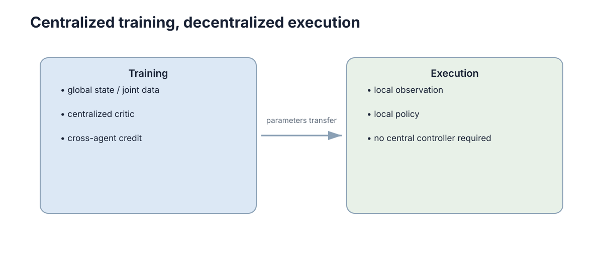

# Multi-Agent Learning & CTDE

> **Section:** Multi-Agent Systems

## Why it matters

MARL 的最小框架是理解非平稳性、信用分配与 CTDE；具体算法只作为这些问题的代表解法。

## Visual intuition

<figure markdown="span">
  
  <figcaption>CTDE 在训练时利用全局信息，在执行时保留每个 Agent 的局部策略。</figcaption>
</figure>

## Core ideas

- **Non-stationarity**：其他 agent 学习导致你的环境分布变化。
- **Credit assignment**：团队奖励难分解到个体行为。
- **Joint action**：联合动作组合随 agent 数量快速增长。
- **CTDE**：训练时用全局信息，执行时保持局部策略。

## Key theory

CTDE 的基本思想是：训练阶段允许 Critic 或价值分解模块看到更多全局信息，以缓解非平稳性和信用分配；部署时每个 agent 仍只依赖可获得的局部信息。

它不是“把环境重新变成静止”，也不自动保证收敛。

## Representative methods

- MAPPO：集中 Critic 的策略梯度代表。
- QMIX：合作任务的价值分解代表。

## Worked example

训练三车协作时，Critic 可以读取三车状态评价联合结果；部署后每车 Actor 只用自己的观测和允许的消息。

## Connections

- ← Reinforcement Learning / Actor-Critic。
- → Game Theory：竞争或一般和任务还需要明确解概念。

## Further Reading

- MADDPG、COMA、mean-field MARL、self-play。

> 这一部分不属于主学习路径；需要做论文、项目或深入证明时再回来查。

## Learning path

[← Section overview](index.md) · [← Task Allocation & Distributed Decision Making](04-allocation-distributed-decision.md)
