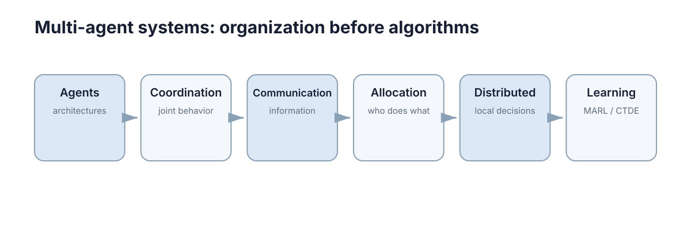

# Multi-Agent Systems

> **定位：** 建立“多个自主主体为什么难、如何组织、如何通信、如何分工、如何学习”的最小完整框架。这里不做 MARL 算法大全。

<figure markdown="span">
  
  <figcaption>从单个 Agent 的内部结构出发，再进入协调、通信、分配/分布式决策和学习。</figcaption>
</figure>

## What to master

1. 分清 agent、环境、组织结构和交互关系；
2. 理解多个 agent 会带来冲突、信息不完全和联合决策复杂度；
3. 知道通信、任务分配和分布式执行分别解决什么问题；
4. 理解 MARL/CTDE 在整个系统中的位置，而不是记算法清单。

## Core chapters

| No. | Chapter | Why it stays in the core path |
|---:|---|---|
| 01 | [Agents & Architectures](01-agents-architectures.md) | 先知道一个 agent 内部如何感知、决策和执行。 |
| 02 | [Cooperation, Competition & Coordination](02-coordination.md) | 多主体系统的核心关系。 |
| 03 | [Communication & Information Sharing](03-communication.md) | 决定谁需要知道什么，以及信息如何流动。 |
| 04 | [Task Allocation & Distributed Decision Making](04-allocation-distributed-decision.md) | 把团队目标分配到 agent，并在局部信息下持续执行。 |
| 05 | [Multi-Agent Learning & CTDE](05-multi-agent-learning.md) | 用学习方法处理复杂协作，但只保留核心思想。 |

## Stop rule

能画出系统中的 agent、信息流、任务流和决策层次，并解释为什么需要 CTDE，就已经达到主线目标。DCOP、CBBA、复杂博弈均衡和具体 MARL 算法继续放 Further Reading。
