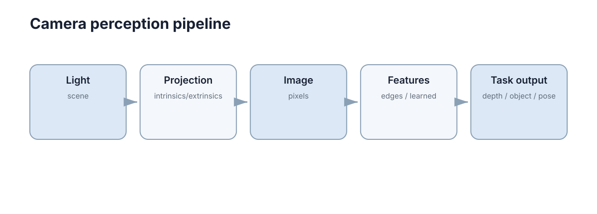

# Image & Camera Basics

视觉算法最终处理的是像素，但像素来自真实三维世界经过相机成像后的投影。要理解检测、深度、SLAM 或多模态融合，首先要知道**一个三维点怎样变成二维像素**。

<figure markdown="span">
  
  <figcaption>视觉几何的主线是：世界坐标 → 相机坐标 → 归一化平面 → 像素。</figcaption>
</figure>

## 数字图像首先是规则采样的数值阵列

灰度图可以写成 $I(u,v)$，彩色图通常在每个像素保存 RGB 三个通道。分辨率只说明采样数量，并不直接等于几何精度；曝光、运动模糊、噪声和镜头畸变都会改变像素值。

视觉算法因此既受**几何关系**影响，也受**成像质量**影响。

## 针孔模型描述最基本的透视投影

设相机坐标系中的三维点为 $(X,Y,Z)$，焦距为 $f$，理想投影满足

$$
x=f\frac{X}{Z},\qquad y=f\frac{Y}{Z}.
$$

同一个物体离相机越远，$Z$ 越大，投影尺寸越小。这就是透视关系的来源。

实际像素还需要考虑主点和不同方向的像素尺度：

$$
\begin{bmatrix}u\\v\\1\end{bmatrix}
\sim
K\begin{bmatrix}X/Z\\Y/Z\\1\end{bmatrix},
\qquad
K=\begin{bmatrix}f_x&0&c_x\\0&f_y&c_y\\0&0&1\end{bmatrix}.
$$

$K$ 就是相机内参矩阵。

## 内参和外参解决的是两类完全不同的问题

**内参**描述相机自身成像几何：焦距、主点、畸变等；**外参**描述相机相对机器人或世界坐标系的位置和姿态。

即使目标在图像中检测得非常准，如果外参错误，转换到机器人坐标系后仍会落在错误位置。机器人视觉里，“检测正确但导航方向不对”经常是外参或 TF 问题。

## 畸变会让理想针孔模型偏离真实镜头

广角镜头尤其明显：直线靠近图像边缘会弯曲。标定过程通常同时估计内参和畸变参数，再把原图校正到更接近针孔模型的坐标。

标定不是“只做一次就永远正确”。镜头重新安装、焦距改变或机械结构变形后，参数可能需要重新估计。

## 像素投影实现

```python
def project_point(X, Y, Z, fx, fy, cx, cy):
    if Z <= 0:
        raise ValueError("point is behind camera")
    u = fx * X / Z + cx
    v = fy * Y / Z + cy
    return u, v
```

这段代码没有畸变、没有外参，但已经体现了投影最核心的 $X/Z$、$Y/Z$ 关系。

### 图像读取与预处理接口

进入模型前应显式固定颜色空间、尺寸和数值范围：

```python
import cv2

image = cv2.imread("frame.png")
if image is None:
    raise FileNotFoundError("frame.png")
rgb = cv2.cvtColor(image, cv2.COLOR_BGR2RGB)
tensor_input = cv2.resize(rgb, (640, 384)).astype("float32") / 255.0
```

预处理参数必须与训练阶段一致；“模型能运行”不代表输入语义正确。

## 视觉坐标约定

不同库对相机轴方向、图像原点和旋转表示可能不同。工程中必须明确：$+Z$ 是否朝前、像素原点在哪里、外参是 world-to-camera 还是 camera-to-world。很多“公式差一个负号”的问题，本质是坐标约定没写清。

## 分辨率与可辨识尺度

更高分辨率只增加采样点，不会自动消除模糊、噪声或错误标定。一个目标是否可识别取决于它在图像中占据的像素数量、对比度和成像质量。选择相机和输入尺寸时，应从任务所需的最小目标尺度反推，而不是只比较总像素数。
