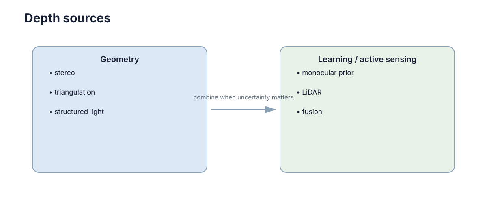

# 深度、三维视觉与点云

二维图像告诉我们像素位置和外观，却没有直接告诉“离相机多远”。深度和点云把视觉从二维投影重新扩展到三维几何，是机器人避障、建图和抓取的基础。

<figure markdown="span">
  
  <figcaption>不同深度来源误差特性不同，但都要经过坐标变换进入机器人几何空间。</figcaption>
</figure>

## 深度可以来自不同物理机制

常见来源包括：

- 双目视差：利用两个相机的几何三角关系；
- RGB-D / ToF：主动测量光的传播或调制信息；
- LiDAR：直接测距形成稀疏或较密集三维点；
- 单目深度网络：从图像外观学习相对或绝对深度。

它们的量程、噪声、密度和失败场景都不同。

## 已知深度后，像素可以反投影成三维点

相机内参为 $(f_x,f_y,c_x,c_y)$，像素 $(u,v)$ 的深度为 $Z$，则

$$
X=(u-c_x)\frac{Z}{f_x},\qquad
Y=(v-c_y)\frac{Z}{f_y}.
$$

```python
def back_project(u, v, z, fx, fy, cx, cy):
    x = (u - cx) * z / fx
    y = (v - cy) * z / fy
    return x, y, z
```

这一步把图像坐标重新映射到相机三维坐标系。

## 点云必须放到统一坐标系才能融合

LiDAR 点在 `lidar` frame，相机反投影点在 `camera` frame，机器人规划通常使用 `base` 或 `map` frame。不同来源的点云若没有正确外参，就无法直接叠加。

因此点云处理几乎总伴随刚体变换 $p_B=T^B_Ap_A$。

## 点云裁剪与下采样

原始点云可能包含数十万点。体素下采样、距离裁剪、地面去除等预处理可以显著减少后续计算量。关键是保留任务需要的几何结构，而不是追求所有点都留下。

一个典型处理接口按固定顺序组织步骤：

```python
def prepare_cloud(cloud, transform):
    cloud = cloud.remove_non_finite()
    cloud = cloud.crop(min_range=0.2, max_range=30.0)
    cloud = cloud.voxel_downsample(voxel_size=0.05)
    return transform.apply(cloud)
```

先清理非法值和任务外范围，再下采样，最后转换到统一坐标系，可以避免后续模块重复处理原始大点云。

## 深度误差会随距离和传感方式变化

双目在远距离时视差变小，深度误差迅速增大；LiDAR 可能在玻璃、强反射或雨雾条件下产生异常；单目网络则可能受训练分布影响。规划器不应把所有深度值都当成同等可靠的精确真值。

## 点云密度并不等于信息量

重复采集同一平面的大量点会增加计算量，却未必增加新的几何约束。下采样应优先保留边缘、曲率变化和稀疏区域的结构信息。处理参数需要根据定位、避障或重建任务分别选择，而不是所有任务共享同一体素大小。
