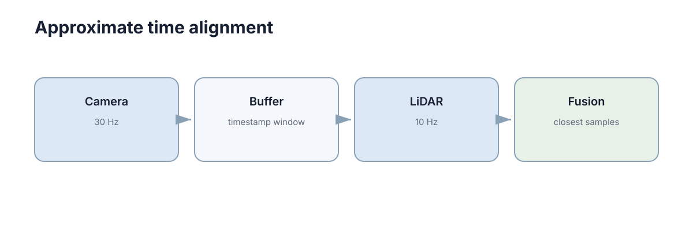

# Multi-Modal Perception

多模态感知不是把更多传感器数据堆进一个网络，而是利用不同传感器的**互补信息**降低单一感知源的盲区。真正的难点往往发生在融合之前：时间、坐标和语义必须先对齐。

<figure markdown="span">
  
  <figcaption>相机、LiDAR、IMU 的数据频率和坐标系不同，融合前必须先完成同步与标定。</figcaption>
</figure>

## 不同传感器的优势通常正好互补

相机能提供丰富纹理和语义，但受光照影响明显；LiDAR 提供直接三维几何，却缺少颜色和纹理；IMU 更新快，可以感知短时运动，但积分会漂移。

融合有价值的前提是这些信息真的互补。如果单一传感器已经稳定满足任务，复杂融合反而会增加标定、计算和故障诊断成本。

## 时间不同步会把正确数据拼成错误场景

车辆在运动时，相机 $t=10.00$ s 的图像和 LiDAR $t=10.15$ s 的点云对应不同物理位置。直接叠加会产生明显错位。

工程上要依赖时间戳、硬件同步或运动补偿，把数据变换到相同参考时刻。

## 空间对齐依赖准确外参

融合前需要知道 $T^{camera}_{lidar}$ 或相应坐标变换。外参偏一点，近处可能看不明显，远处就会产生很大投影偏差。

因此多模态问题出现“框和点云对不上”时，第一步通常不是换融合网络，而是重新检查标定和 TF。

## 融合可以发生在不同层级

**早期融合**在较原始特征层组合数据，能充分利用跨模态相关性，但对对齐要求高；**后期融合**先让各传感器独立产生检测/估计结果，再在决策层合并，更容易模块化和诊断。

没有一种方式始终最好，选择取决于数据同步质量、算力和任务需求。

## 融合系统还必须考虑传感器失效

如果相机暂时过曝，系统是否能只靠 LiDAR 继续低速运行？如果 LiDAR 丢帧，视觉结果是否会被错误的旧点云拖累？真正可靠的融合不只是“多传感器同时在线时更准”，还要能识别哪个输入当前不可信。

## 标定也会随时间漂移

相机和 LiDAR 外参并非一次标定后永久不变。震动、碰撞、温度和重新安装都可能让外参慢慢偏移。工程系统应通过重投影误差、特征对齐或周期标定检查这种漂移。

因此多模态融合的维护成本不只在训练模型，还包括长期保证**时间同步和空间标定仍然可信**。

## 融合前先验证单模态

多模态融合会把各传感器的优点和故障一起带入系统。若单模态输出尚未独立验证，融合后的改善或退化很难归因。测试时应保留关闭某一模态的消融实验，并记录传感器缺失、延迟和错位时的表现。
