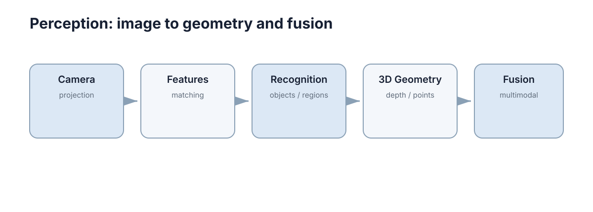

# Perception

> **定位：** 感知部分只保留从相机成像到特征、目标、三维结构和多模态融合的主链；视觉里程计/SLAM 统一放到 Robotics，避免重复。

<figure markdown="span">
  
  <figcaption>Perception 的最小主学习路径；箭头表示认知依赖，不代表必须掌握所有高级分支。</figcaption>
</figure>

## What to master

学完本 Section，只要求做到三件事：

1. 能用自己的话解释本领域的核心问题；
2. 能读懂最关键的公式、流程或系统结构；
3. 能把概念连接到一个简单实现或真实系统。

## Core chapters

| No. | Chapter | Why it stays in the core path |
|---:|---|---|
| 01 | [Image & Camera Basics](01-image-camera-basics.md) | 理解相机投影、内外参和图像采样，是后续所有视觉几何和视觉学习方法的共同基础。 |
| 02 | [Feature-Based Vision](02-feature-vision.md) | 特征方法提供最直接的“图像对应关系”直觉：先找稳定局部结构，再匹配，再估计几何。 |
| 03 | [Detection & Segmentation](03-detection-segmentation.md) | 检测回答“目标在哪里”，分割回答“哪些像素属于它”；具体 CNN/Transformer 只是实现这种映射的模型。 |
| 04 | [Depth, 3D Vision & Point Clouds](04-depth-point-cloud.md) | 深度把二维像素恢复为空间距离，点云则把这些空间测量组织成可直接用于几何推理的三维表示。 |
| 05 | [Multi-Modal Perception](05-multimodal.md) | 不同传感器在量程、精度、频率和失效模式上互补，多模态感知的重点是时间、空间和不确定性的对齐。 |

## Stop rule

当你能够解释上述主线并完成每章的 Worked example，就可以进入下一个 Section。高级证明、算法变体和工具细节统一放在 **Further Reading**，不阻塞主线。
