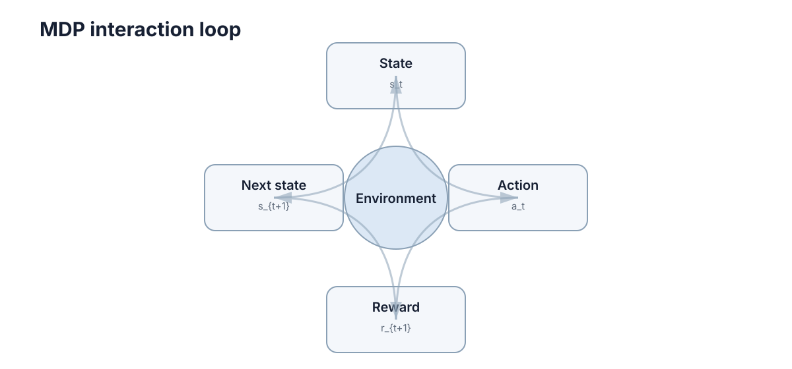

# MDP & Bellman Equation

强化学习最核心的问题是：**一个决策会改变未来，而未来又会反过来决定现在这个动作到底好不好。** MDP 用一套最小数学结构描述这种“连续决策”，Bellman 方程则把长期回报拆成可以递推计算的一步关系。


<figure markdown="span">
  
  <figcaption>MDP 的基本循环：观察状态、选择动作、获得奖励并进入下一状态。</figcaption>
</figure>

## 状态的充分性

如果未来只需要由当前状态和当前动作决定，就满足 Markov 性：

$$
P(S_{t+1}=s'\mid S_t=s,A_t=a,\text{history})
=
P(S_{t+1}=s'\mid S_t=s,A_t=a).
$$

这并不表示真实世界“没有历史”，而是要求**状态已经包含决策所需的历史信息**。

例如机器人只把当前位置当成状态，但电池温度会受过去负载影响，那么这个状态可能不够；把温度、剩余电量等加入状态后，Markov 近似会更合理。

因此遇到一个 RL 问题，第一件事不是选 PPO 还是 DQN，而是先问：**我给智能体的状态，是否足以预测动作的后果？**

## MDP 用五个对象描述连续决策

一个 MDP 通常写作

$$
\mathcal M=(\mathcal S,\mathcal A,P,R,\gamma).
$$

其中：

- $\mathcal S$：状态空间；
- $\mathcal A$：动作空间；
- $P(s'\mid s,a)$：状态转移概率；
- $R(s,a,s')$：一次转移产生的奖励；
- $\gamma\in[0,1]$：折扣因子。

一次交互可以写成：

```text
s_t → choose a_t → environment → r_{t+1}, s_{t+1}
 ↑                                      │
 └──────────────────────────────────────┘
```

策略 $\pi(a\mid s)$ 决定在状态 $s$ 下如何选择动作。连续交互形成轨迹

$$
\tau=(s_0,a_0,r_1,s_1,a_1,r_2,\ldots).
$$

这条轨迹就是强化学习最基本的数据来源。

## 奖励只评价一步，回报才评价长期结果

即时奖励 $r_{t+1}$ 只能告诉我们这一步发生了什么。真正要最大化的是从当前时刻开始的累计回报：

$$
G_t=r_{t+1}+\gamma r_{t+2}+\gamma^2r_{t+3}+\cdots.
$$

折扣因子有两个直观作用：

1. 让越远的奖励权重越小；
2. 在持续型任务中，在常见有界奖励条件下使无限和保持有限。

$\gamma$ 不是“耐心程度”的唯一解释。很多工程问题里，它也影响有效规划范围和数值稳定性。$\gamma$ 越接近 1，智能体越需要考虑远期后果，但学习信号也通常更难估计。

## 价值函数把未来好不好压缩成一个数

给定策略 $\pi$，状态价值函数定义为

$$
V^\pi(s)=\mathbb E_\pi[G_t\mid S_t=s].
$$

动作价值函数则把第一步动作也固定下来：

$$
Q^\pi(s,a)=\mathbb E_\pi[G_t\mid S_t=s,A_t=a].
$$

两者的区别很重要：

- $V^\pi(s)$：从这里开始，继续按策略行动有多好；
- $Q^\pi(s,a)$：在这里先做动作 $a$，之后再按策略行动有多好。

所以如果已经知道 $Q^\pi$，就能比较同一个状态下不同动作的长期效果。

## Bellman 递推依据

回报本身可以拆成

$$
G_t=r_{t+1}+\gamma G_{t+1}.
$$

对它取条件期望，就得到 Bellman 期望方程：

$$
V^\pi(s)
=
\sum_a\pi(a\mid s)
\sum_{s'}P(s'\mid s,a)
\left[R(s,a,s')+\gamma V^\pi(s')\right].
$$

它表达的不是一种新假设，而是同一个长期回报的递归写法：

> **当前价值 = 一步奖励 + 下一状态价值的折扣期望。**

这一步非常关键，因为“无限长未来”现在被压缩成了“一步 + 一个同类型子问题”。动态规划、TD、Q-Learning 等方法都建立在这个递归结构上。

## Bellman 最优性关系

最优动作价值函数定义为

$$
Q^*(s,a)=\max_\pi Q^\pi(s,a).
$$

对应的 Bellman 最优方程为

$$
Q^*(s,a)
=
\sum_{s'}P(s'\mid s,a)
\left[R(s,a,s')+\gamma\max_{a'}Q^*(s',a')\right].
$$

只要 $Q^*$ 已知，在每个状态选择

$$
\pi^*(s)\in\arg\max_a Q^*(s,a)
$$

就可以得到一个最优策略。这里“贪心”之所以成立，是因为 $Q^*$ 已经把**之后所有步骤的最优未来**计算进去了，而不是因为短视动作本身总是正确。

## 一个两状态例子

假设只有状态 $A,B$，折扣 $\gamma=0.9$：

- 在 $A$ 选择 `stay`：奖励 1，仍在 $A$；
- 在 $A$ 选择 `go`：奖励 2，到 $B$；
- 在 $B$ 选择 `stay`：奖励 3，仍在 $B$。

若在 $B$ 持续 `stay`，则

$$
V^*(B)=3+0.9V^*(B)=30.
$$

于是 $A$ 选择 `go` 的价值为

$$
2+0.9\times30=29.
$$

而一直留在 $A$ 的价值只有

$$
1+0.9+0.9^2+\cdots=10.
$$

所以虽然 `stay` 立刻有正奖励，长期看仍应先去 $B$。这就是强化学习和普通“即时打分”最大的不同。

## Bellman 关系与学习更新

如果 $P,R$ 已知，可以直接迭代 Bellman 方程；如果模型未知，就必须从采样数据估计价值。

| 情况 | 典型思路 |
|---|---|
| 模型已知 | 动态规划，直接做 Bellman 更新 |
| 模型未知但有完整轨迹 | Monte Carlo，用实际回报估计 |
| 模型未知且希望在线更新 | TD / Q-Learning，用一步自举目标 |
| 状态空间很大 | 用神经网络等函数逼近价值或策略 |

后面的价值学习和策略学习，其实都在回答同一个问题：**Bellman 关系已经告诉我们“正确答案应该满足什么”，怎样只靠数据把这个关系学出来？**

## Bellman 关系的适用边界

Bellman 分解依赖状态足以概括与未来有关的历史，并且回报可以按时间累加。若奖励存在强路径依赖，或观测不能表示真实状态，就需要扩展状态、引入历史或转向 POMDP。应用 Bellman 方程之前，先检查这些前提比直接选择算法更重要。
