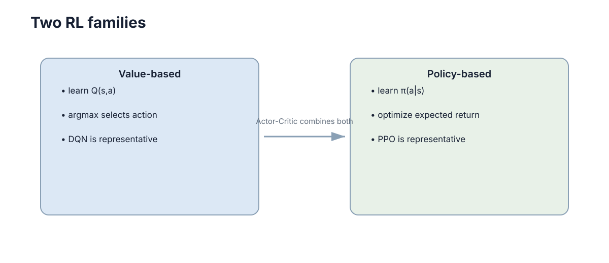

# Policy Gradient & Actor-Critic

> **Section:** Reinforcement Learning

## Why it matters

策略梯度直接优化策略；Actor-Critic 用价值估计给策略更新提供更低方差的反馈，因此两者应作为一条连续路线理解。

## Visual intuition

<figure markdown="span">
  
  <figcaption>价值方法和策略方法不是算法清单，而是两种不同的学习对象；Actor-Critic 把两者组合。</figcaption>
</figure>

## Core ideas

- **Policy $\pi_\theta(a\mid s)$**：直接参数化动作分布。
- **Policy gradient**：沿提高期望回报的方向更新策略。
- **Actor–Critic**：Actor 产生动作，Critic 用价值/优势信号指导更新。
- **Bootstrapping**：Critic 利用下一状态估计减少纯 Monte Carlo 的方差。
- **PPO ratio $\rho_t$**：限制新旧策略一次更新不要变化过大。
- **Entropy**：在需要时维持一定探索。

## Key theory

### Policy-Based Methods

REINFORCE 的基本形式为

$$
\nabla_\theta J(\theta)=\mathbb E\left[\nabla_\theta\log\pi_\theta(a_t\mid s_t)G_t\right].
$$

PPO 不改变“策略梯度”的本质，而是通过 clipped surrogate objective 限制单次策略更新过大，提高工程稳定性。

### Actor-Critic Methods

Actor-Critic 常用 TD advantage

$$
\hat A_t=r_{t+1}+\gamma V_\phi(s_{t+1})-V_\phi(s_t)
$$

近似“这个动作比当前状态的平均水平好多少”。SAC 进一步最大化“回报 + 熵”，适合连续控制并支持 off-policy 数据复用。

## Representative methods

- PPO：常用 on-policy actor-critic 代表。
- SAC：连续动作、off-policy actor-critic 代表。

## Worked example

**Policy-Based Methods：**若某动作最终带来高回报，$G_t>0$ 会提高该动作在相似状态下的概率；若回报低，则概率会被压低。

**Actor-Critic Methods：**机器人转向角是连续变量时，Actor 可以输出高斯策略参数；Critic 评价该状态下动作的长期效果。相比枚举所有转向角，更自然。

## Connections

- ← Optimization Basics。
- → Control Theory：连续控制中策略输出直接对应控制量。
- → Multi-Agent Learning：MAPPO/MADDPG 延续 actor-critic 结构。

## Further Reading

- REINFORCE、GAE、TRPO、DDPG/TD3。

> 这一部分不属于主学习路径；需要做论文、项目或深入证明时再回来查。

## Learning path

[← Section overview](index.md) · [← Value-Based Methods](02-value-based.md) · [Exploration & Partial Observability →](04-exploration-pomdp.md)
