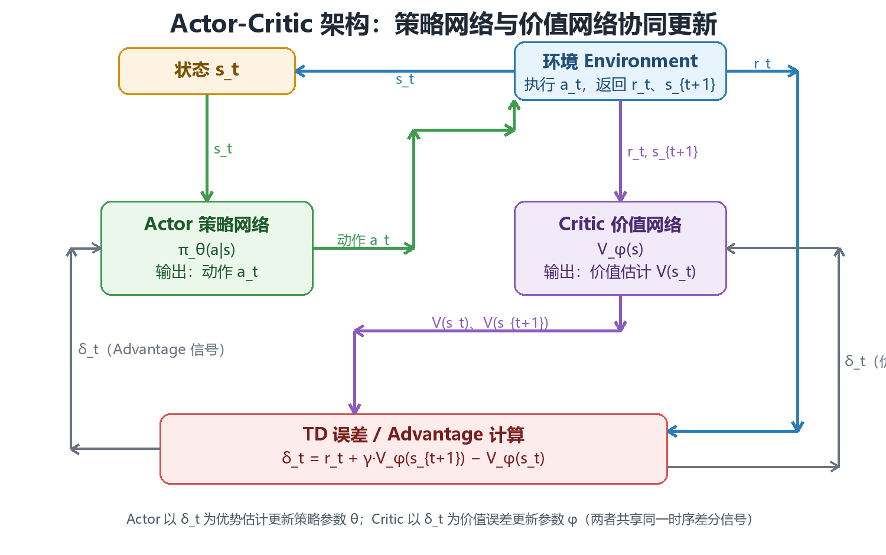

# Policy Gradient & Actor–Critic

价值方法先估计“动作有多好”，再选最大值；策略方法则直接学习一个参数化策略 $\pi_\theta(a\mid s)$。这使它天然适合随机策略和连续动作，但也带来更高的梯度方差。**本章的核心线索是：策略梯度提供无偏但高方差的改进方向，Critic 把方向中的噪声压下去，PPO 则把每一步更新的幅度限制在“旧数据仍然可信”的范围之内。**

## 策略目标与梯度

策略优化的对象是轨迹上的期望回报。设轨迹 $\tau=(s_0,a_0,r_1,s_1,\dots)$ 由初始分布 $\rho(s_0)$、环境转移 $T(s_{t+1}\mid s_t,a_t)$ 与策略 $\pi_\theta$ 共同采样，则

$$
p_\theta(\tau)=\rho(s_0)\prod_{t=0}^{T-1}\pi_\theta(a_t\mid s_t)\,T(s_{t+1}\mid s_t,a_t),
\qquad
J(\theta)=\mathbb E_{\tau\sim p_\theta}[G_0],
\qquad
G_t=\sum_{l=0}^{T-t-1}\gamma^{l}r_{t+l+1}.
$$

目标对参数的导数只作用在策略项上，因为 $\rho$ 与 $T$ 都不含 $\theta$：

$$
\nabla_\theta J(\theta)
=\mathbb E_{\tau\sim p_\theta}\left[\sum_{t=0}^{T-1}\nabla_\theta\log\pi_\theta(a_t\mid s_t)\,G_t\right].
$$

直观理解很简单：如果一次动作带来较高长期回报，就提高它在类似状态下的概率；如果表现差，就降低它的概率。$\nabla_\theta\log\pi_\theta$ 的形式带来一个关键好处——不需要环境转移模型的导数，只需要能从策略和环境采样，因此它是 model-free 的。

目标的写法会直接影响优化性质，三种常见形式并不等价：

| 目标形式 | 数学表达 | 适用场景 | 主要问题 |
| --- | --- | --- | --- |
| 回合总回报 | $\mathbb E[G_0]$ | 有终止的自然回合 | 回合长度不同，方差随 $T$ 增长 |
| 折扣回报 | $\mathbb E[\sum_t\gamma^t r_{t+1}]$ | 持续型任务，$0<\gamma<1$ | $\gamma$ 引入偏差，奖励尺度被压缩 |
| 平均奖励 | $\lim_{T\to\infty}\frac{1}{T}\mathbb E[\sum_t r_{t+1}]$ | 无终止的稳态任务 | 需估计稳态分布，实现更复杂 |

失败模式方面，最常见的是把折扣因子与步长混为一谈：$\gamma$ 接近 1 时回报的方差随有效时域 $1/(1-\gamma)$ 增长，若不相应缩小步长 $\alpha$，更新会在少数高回报轨迹上剧烈摆动。

## 策略梯度定理的直觉

上面公式里最不直观的一步是：为什么可以把“对分布求导”换成“对 $\log\pi$ 求导”？原因是恒等式

$$
\nabla_\theta\pi_\theta(a\mid s)=\pi_\theta(a\mid s)\,\nabla_\theta\log\pi_\theta(a\mid s),
\qquad\text{即}\qquad
\nabla_\theta\log\pi_\theta=\frac{\nabla_\theta\pi_\theta}{\pi_\theta}.
$$

把它代回期望，分母的 $\pi_\theta$ 恰好与采样概率相消，于是“对概率求导”变成了“对样本加权求平均”。这就是所谓的 score function 技巧，也叫 log-derivative trick。它把不可微的采样过程改写成可微的对数概率加权，从而允许随机策略使用梯度下降。

由此得到一个只依赖单条轨迹、不需要值函数、也不需要环境模型的估计量，即 REINFORCE 的单样本形式：

$$
\nabla_\theta J(\theta)\approx\sum_{t=0}^{T-1}\nabla_\theta\log\pi_\theta(a_t\mid s_t)\,G_t .
$$

它的无偏性来自 score function 的三条性质：

| 性质 | 表达式 | 含义 |
| --- | --- | --- |
| 期望为零 | $\mathbb E_{a\sim\pi_\theta}[\nabla_\theta\log\pi_\theta(a\mid s)]=0$ | 任何与动作无关的常数都可自由加减 |
| 与动作无关量正交 | $\mathbb E[\nabla_\theta\log\pi_\theta(a\mid s)\,b(s)]=0$ | baseline 不改变梯度期望 |
| 二阶信息 | $\mathbb E[\nabla_\theta^2\log\pi_\theta]=-\mathrm{Cov}[\nabla_\theta\log\pi_\theta]$ | score 的协方差即 Fisher 信息矩阵 |

这条“期望为零”是后面所有方差降低技巧的基础：任何只依赖状态、不依赖被采样动作的项，都不会改变梯度的期望。REINFORCE 的代价是方差量级约为 $O(T)$ 倍的回报方差，在长回合任务上往往需要成千上万条轨迹才能稳定一次更新。

## Baseline 与方差降低

直接使用回报做权重通常方差很大。可以减去一个只依赖状态的 baseline $b(s)$，并令

$$
Q^\pi(s,a)-V^\pi(s)=A^\pi(s,a).
$$

$A^\pi(s,a)$ 称为 advantage，表示“这个动作相比当前状态下的平均水平好多少”。由于 score function 的期望为零，对任意 $b(s)$ 都有 $\mathbb E[\nabla_\theta\log\pi_\theta\cdot b(s)]=0$，因此 baseline 不引入偏差，只改变方差。

方差下降的幅度可以定量地看。单个样本的加权项为 $g_t=\nabla_\theta\log\pi_\theta(a_t\mid s_t)\,(G_t-b(s_t))$，若近似认为 score 与回报弱相关，则方差主要由 $\mathrm{Var}[G_t-b(s_t)]$ 决定。因此最优 baseline 大致满足

$$
b^*(s)\approx\frac{\mathbb E[(\nabla_\theta\log\pi_\theta)^2\,G\mid s]}{\mathbb E[(\nabla_\theta\log\pi_\theta)^2\mid s]},
$$

在实践中通常用 $b(s)=V^\pi(s)$ 作为近似，此时权重恰好退化为 advantage。

| Baseline 选择 | 偏差 | 方差 | 实现代价 |
| --- | --- | --- | --- |
| $b=0$ | 无偏 | 最高，回报绝对尺度大 | 无 |
| $b=$ 常数（如平均回报） | 无偏 | 略降，通常在 1 倍量级 | 极低 |
| $b=V^\pi(s)$ | 无偏 | 明显下降，权重变成 advantage | 需要训练 Critic |
| $b=V^\pi(s)$ 且再做 advantage 归一化 | 可能引入小偏差 | 进一步下降 | 需要批量统计 |

失效模式：若 Critic 早期严重不准，$G_t-V_\phi(s_t)$ 会出现数值很大但符号错误的权重；更新方向仍然无偏（因为与动作无关的项期望为零），但方差可能不降反升。更隐蔽的问题是把 baseline 与动作采样耦合起来（例如用同批数据内该动作的平均回报做 baseline），这会引入真实偏差，而不只是噪声。

## Actor–Critic 架构

Actor–Critic 把两件事拆开：

- **Actor**：策略 $\pi_\theta$，决定动作；
- **Critic**：价值函数 $V_\phi$ 或 $Q_\phi$，评价当前策略。

<figure markdown="span">
  
  <figcaption>Actor 负责选动作，Critic 负责评价当前策略。</figcaption>
</figure>

最简单情况下，Critic 的 TD error

$$
\delta_t=r_{t+1}+\gamma V_\phi(s_{t+1})-V_\phi(s_t)
$$

可以作为 advantage 的一个低成本估计，然后 Actor 使用

$$
\theta\leftarrow\theta+\alpha_\theta\,\delta_t\nabla_\theta\log\pi_\theta(a_t\mid s_t),
\qquad
\phi\leftarrow\phi-\alpha_\phi\nabla_\phi\delta_t^2 .
$$

Critic 先用 TD error 衡量“结果比预期好还是差”，Actor 再据此提高或降低所选动作的概率。两者共享同一个评价信号，但优化的对象不同：Actor 优化的是对数概率的加权和，Critic 优化的是预测误差的平方。

Critic 的目标可以选成不同长度的自举，这直接决定偏差—方差位置：

| Critic 目标 | 表达 | 偏差 | 方差 | 备注 |
| --- | --- | --- | --- | --- |
| TD(0) | $r_{t+1}+\gamma V_\phi(s_{t+1})-V_\phi(s_t)$ | 高，全部来自 Critic | 低 | 可在线更新，最省数据 |
| n-step TD | $\sum_{l=0}^{n-1}\gamma^l r_{t+l+1}+\gamma^n V_\phi(s_{t+n})$ | 随 $n$ 下降 | 随 $n$ 上升 | $n$ 是显式旋钮 |
| 蒙特卡洛 | $G_t$ | 无（对给定策略） | 最高，随 $T$ 增长 | 必须等回合结束 |
| GAE | $\sum_l(\gamma\lambda)^l\delta_{t+l}$ | 由 $\lambda$ 连续调节 | 由 $\lambda$ 连续调节 | 现代策略梯度的默认选择 |

需要注意的是，Actor 与 Critic 通常共享部分特征表示，这会带来耦合：若 Critic 的损失过大，梯度会污染共享特征，使策略学到的表示偏向于预测价值而不是区分动作。工程上常用的做法是给 Critic 略大的学习率、对回传到共享层的 Critic 梯度做截断，或者干脆分离两套网络。

## PPO 的更新约束

策略梯度最大的问题之一，是参数一步改得过大时，采样数据很快变成“旧策略的数据”，性能甚至可能突然崩掉。PPO 先定义新旧策略对同一动作的概率比：

$$
\rho_t(\theta)=\frac{\pi_\theta(a_t\mid s_t)}{\pi_{\theta_{old}}(a_t\mid s_t)} .
$$

再使用裁剪目标：

$$
L^{CLIP}(\theta)=\mathbb E_t\left[\min\left(\rho_t(\theta)\hat A_t,\ \operatorname{clip}(\rho_t(\theta),1-\varepsilon,1+\varepsilon)\,\hat A_t\right)\right].
$$

<figure markdown="span">
  
  <figcaption>PPO 用裁剪把每次更新限制在旧策略附近，是信赖域的廉价近似。</figcaption>
</figure>

当某个更新已经把概率比推得很远时，继续沿“让代理目标更大”的方向推进不会继续得到同样收益，因此梯度会被抑制。注意 $\min$ 的截断方向依赖 $\hat A_t$ 的正负：当 $\hat A_t>0$ 时代理目标在上限 $1+\varepsilon$ 处被压平，当 $\hat A_t<0$ 时在下限 $1-\varepsilon$ 处被压平，两个方向都不能无限获利。

$\varepsilon$ 是最关键的旋钮，取值直接决定“每批数据还能用几次”：

| $\varepsilon$ | 单步允许的概率比范围 | 典型表现 | 风险 |
| --- | --- | --- | --- |
| 0.05 | 极窄 | 更新保守，收敛慢 | 数据利用率低，容易欠拟合 |
| 0.1 | 常用下界 | 稳定，适合高维连续控制 | 对 Critic 质量较敏感 |
| 0.2 | 默认常用值 | 收敛快 | 高曲率目标上偶发性能塌陷 |
| 0.3 以上 | 很宽 | 接近未裁剪的策略梯度 | 旧数据迅速失效，训练震荡 |

需要强调：**clip 不是硬约束**。它不能保证所有状态动作上的概率比始终落在 $[1-\varepsilon,1+\varepsilon]$ 内，因为裁剪只作用在目标函数上，参数本身仍可自由移动；它只是用一个简单的代理目标降低过大更新的风险。若同一批数据训练多个 epoch，概率比会持续偏离 1，此时应监控实际 KL 或裁剪触发比例（超过约 20%–30% 通常意味着 epoch 数偏多）。

## 裁剪与 KL 约束的关系

PPO 的裁剪做法来自一个更严格的动机：信赖域。TRPO 直接求解带约束的问题

$$
\max_\theta\ \mathbb E_t[\rho_t(\theta)\hat A_t]\quad
\text{s.t.}\quad
\mathbb E_t\!\left[D_{KL}\!\left(\pi_{\theta_{old}}(\cdot\mid s_t)\,\|\,\pi_\theta(\cdot\mid s_t)\right)\right]\le\delta ,
$$

其中约束项用 Fisher 信息矩阵近似，$\delta$ 典型取 $0.01$。求解它需要共轭梯度与线搜索，每步代价约为一次二阶近似。PPO 用 clip 代替这个约束，本质上是把“限制 KL”换成“限制代理目标的收益”，从而把二阶问题降为一阶问题。

两者关系可以用一阶近似看清：当概率比 $\rho_t$ 接近 1 时，有

$$
D_{KL}(\pi_{old}\|\pi_\theta)\approx\frac{1}{2}\,\mathbb E_t[(\rho_t-1)^2],
$$

也就是说，限制 $|\rho_t-1|\le\varepsilon$ 相当于对 KL 施加一个与概率比方差相关的软上界。它更便宜，但不精确，也不保证在全部状态下成立。

| 约束方式 | 每步代价 | 约束强度 | 超参数 | 主要缺陷 |
| --- | --- | --- | --- | --- |
| KL 硬约束（TRPO） | 高，需二阶近似与线搜索 | 强，近似可行域 | $\delta\approx0.01$ | 实现复杂，每步昂贵 |
| KL 惩罚（加进目标） | 中，只需 KL 的采样估计 | 依赖系数调参 | $\beta$ 需自适应 | 惩罚过小无效、过大停滞 |
| PPO clip | 低，仅一阶梯度 | 软，只在目标上生效 | $\varepsilon\in[0.1,0.2]$ | 不保证真实 KL 有界 |
| 梯度范数裁剪 | 极低 | 只限制梯度大小 | 裁剪阈值 | 与策略变化幅度无直接关系 |

失效模式：在不平衡的 advantage 分布上（例如大部分 $\hat A_t<0$），clip 会大量触发，有效样本数骤降，梯度几乎全部来自少数正 advantage 的样本，导致策略过早收敛到局部最优。缓解办法是配合 advantage 归一化，或者对负 advantage 样本单独加权。

## 优势估计的偏差—方差权衡

只看一步 TD error 方差低，但偏差依赖 Critic；直接使用完整回报偏差小，但方差大。GAE 用参数 $\lambda$ 把多步 TD error 加权起来：

$$
\hat A_t^{GAE}=\sum_{l=0}^{\infty}(\gamma\lambda)^l\delta_{t+l},
\qquad
\delta_{t+l}=r_{t+l+1}+\gamma V_\phi(s_{t+l+1})-V_\phi(s_{t+l}).
$$

因此它的作用不是增加一个新的学习目标，而是**给 PPO/Actor–Critic 提供更平滑的 advantage 估计**。它同时决定了两端的量级：

$$
\mathrm{Bias}\ \text{受}\ (\gamma\lambda)^{H}\ \text{衰减控制},
\qquad
\mathrm{Var}\ \text{约随}\ \frac{1-\gamma\lambda}{1-\gamma}\ \text{增长},
$$

其中 $H$ 是 Critic 误差经自举传入的步数。两个方向相反，因此 $\lambda$ 是纯粹的交易旋钮，而不是“越大越好”。

| 估计器 | 偏差来源 | 方差来源 | 样本需求 |
| --- | --- | --- | --- |
| TD(0) | Critic 误差全部进入 | 单步奖励噪声 | 低 |
| GAE($\lambda=0.95$) | 少量自举，残留误差按 $0.94^H$ 衰减 | 中等 | 中 |
| GAE($\lambda=1$) | 无（对给定策略） | 整条轨迹回报 | 高 |

## GAE 与优势估计的插值

$\lambda$ 的语义正好可以用两个端点说清楚：它在偏差与方差之间连续插值。

当 $\lambda=0$ 时，求和只剩第一项：

$$
\hat A_t^{GAE}\big|_{\lambda=0}=\delta_t=r_{t+1}+\gamma V_\phi(s_{t+1})-V_\phi(s_t),
$$

退化成一步 TD error，也就是 Actor–Critic 最基础的形式：偏差最大（完全信任 Critic），方差最低。

当 $\lambda=1$ 时，利用望远镜求和（telescoping）可得

$$
\hat A_t^{GAE}\big|_{\lambda=1}
=\sum_{l=0}^{\infty}\gamma^l\delta_{t+l}
=G_t-V_\phi(s_t),
$$

退化成蒙特卡洛回报减 baseline：偏差最小（在回合内完全不依赖 Critic），方差最大。

中间值给出的是一个几何加权的“有效时域”，近似为 $H_{eff}\approx 1/(1-\gamma\lambda)$：

| $\lambda$ | 有效时域 $H_{eff}$（$\gamma=0.99$） | 自举权重 $(\gamma\lambda)^H$ | 适用情形 |
| --- | --- | --- | --- |
| 0.0 | 1 步 | 迅速衰减 | 奖励密集、Critic 准确 |
| 0.9 | 约 91 步 | $0.891^{H}$ | 需要较强长期信用分配 |
| 0.95 | 约 200 步 | $0.94^{H}$ | 默认推荐值 |
| 0.99 | 约 5000 步 | $0.98^{H}$ | 极长时域、奖励稀疏 |
| 1.0 | 整条回合 | 无自举 | Critic 很差或回合很短 |

失效模式：$\lambda=1$ 且回合很长时，单条轨迹的回报方差主导梯度，训练曲线会出现大幅摆动；$\lambda=0$ 且 Critic 系统性低估某类状态时，策略会稳定地把这些状态当成差状态，产生可复现的偏差而非随机噪声——这种错误不会随采样量增加而消失。

## 连续动作与随机策略

在连续动作空间里，无法像 DQN 那样枚举所有动作并取最大值。Actor 可以直接输出动作分布参数，例如高斯分布的均值 $\mu_\theta(s)$ 与标准差 $\sigma_\theta(s)$，动作由 $a\sim\mathcal N(\mu_\theta(s),\sigma_\theta^2(s))$ 采样得到，对应的对数密度为

$$
\log\pi_\theta(a\mid s)=-\frac{(a-\mu_\theta(s))^2}{2\sigma_\theta^2(s)}-\log\sigma_\theta(s)-\frac{1}{2}\log(2\pi).
$$

这一项的梯度对均值是 $(a-\mu)/\sigma^2$，对标准差是 $\big((a-\mu)^2/\sigma^2-1\big)/\sigma$。如果某个动作的 advantage 为正，均值会被拉向该动作；若为负，则被推远。当采样动作已落在分布尾部时，公式里除以 $\sigma^2$ 的项会让梯度异常大，这是连续控制中常见的梯度爆炸来源，通常用动作裁剪或 tanh 压缩来处理。

SAC 是一个代表性方法：它在回报目标之外加入策略熵，鼓励策略在学习阶段保持一定随机性：

$$
J(\pi)=\mathbb E\left[\sum_t\gamma^t\big(r_{t+1}+\alpha\mathcal H(\pi(\cdot\mid s_t))\big)\right].
$$

其中 $\alpha$ 是温度系数，$\mathcal H$ 是策略熵。加入熵的直接效果是把最优策略从确定性推向随机：在 $Q$ 值相近的动作上，熵项会主动给多个动作留出概率。常见连续控制方法的差异集中在“如何约束策略变化”上：

| 方法 | 策略更新来源 | 随机性控制 | 更新约束 | 典型问题 |
| --- | --- | --- | --- | --- |
| DDPG | 确定性策略梯度 | 外部加噪 | 软更新目标网络 | $Q$ 过估计导致策略退化 |
| TD3 | 双 Critic 取小 | 目标策略加噪 | 延迟更新 + 目标平滑 | 超参数较敏感 |
| SAC | 随机策略 + 熵项 | 熵自动调节 $\alpha$ | 重参数化 + 双 Critic | 对奖励尺度敏感 |
| PPO（连续） | 裁剪目标 | 高斯策略的 $\sigma$ | clip 概率比 | 探索不足时 $\sigma$ 塌缩 |

对入门学习而言，不需要继续展开 DDPG、TD3、TRPO 等算法谱系。真正需要掌握的是：

> **Policy Gradient 给出方向；Critic 降低估计方差；PPO 控制更新尺度；SAC 展示连续控制中的随机 Actor–Critic。**

## 策略改进与数据有效期

策略更新后，旧策略采集的数据与新策略分布之间会出现偏差。PPO 的概率比正是用来衡量样本在新旧策略下的相对权重；更新过大时，旧数据就不再能可靠代表当前策略。因此每批数据可重复使用多少次，应和策略变化幅度一起判断。

用重要性采样语言描述，用旧策略数据估计新策略目标会引入修正因子 $\rho_t$，其方差大致随二阶矩增长：

$$
\mathbb E_{a\sim\pi_{old}}\!\left[\rho_t\, f(a)\right]=\mathbb E_{a\sim\pi_\theta}\!\left[f(a)\right],
\qquad
\mathrm{Var}\ \propto\ \mathbb E_{a\sim\pi_{old}}[\rho_t^2]-1 .
$$

这解释了“epoch 数越多、数据越旧”的定量来源：$\rho_t$ 的分布随时间被拉宽，估计量方差随之上升，而梯度方向本身也开始偏离新策略的真实梯度。

| 每批数据 epoch 数 | 典型 KL（相对批起点） | 裁剪触发比例 | 结果 |
| --- | --- | --- | --- |
| 1 | 极小（<0.005） | 低（<5%） | 稳定但样本利用率低 |
| 4 | 小（约 0.01） | 约 10%–20% | 常用配置，稳定与效率平衡 |
| 10 | 中等（约 0.02 以上） | 30% 以上 | 部分样本失效，收益递减 |
| 30 以上 | 大 | 大量裁剪 | 梯度信号失真，训练不稳 |

判断数据是否还有效，最直接的两个指标是实际 KL 与裁剪触发比例：前者反映策略整体偏移，后者反映有多少样本被截断。实践中常用的规则是：当平均 KL 超过约 0.02，或裁剪比例超过三成，就应该丢弃这批数据重新采样，而不是继续压低学习率硬撑。

失效模式：学习率调低并不能阻止数据失效，因为失效源于分布变化而不是步长太大；反过来，若整批数据的 advantage 几乎全为正（例如奖励尺度全正），clip 的目标会产生“只要增大概率比就有收益”的假信号，使策略在第 2 个 epoch 就过度偏离，此时必须做 advantage 归一化。

> **下一步**：把这三条线索接回基础——先看 [MDP 与 Bellman 方程](./01-mdp-bellman.md) 里的回报与时域定义，再看 [值方法](./02-value-based.md) 如何处理同一个信用分配问题；概率工具见 [概率与随机变量](../mathematics/03-probability-random-variables.md)，分布偏移与安全性的延伸见 [鲁棒与安全中的不确定性](../robustness-safety/01-uncertainty-shift.md)。
