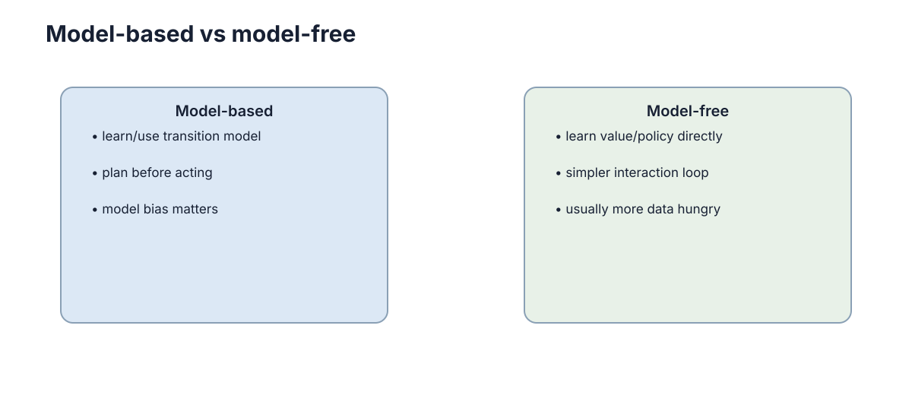

# Model-Based vs Model-Free RL

是否显式学习或使用环境模型，是 RL 最重要的结构分界之一：模型换来规划能力，也引入模型偏差。**本章的核心判断是：真正的分界不在于“用不用模型”，而在于是否愿意把真实经验压缩成可预测的模型，并接受由此带来的误差闭环风险。**

<figure markdown="span">
  
  <figcaption>是否显式使用环境模型决定了规划能力、样本效率与模型偏差之间的权衡。</figcaption>
</figure>

## 两条路线的根本区别

区别可以用“数据流向”精确表述。

- **Model-free**：直接学价值或策略，不显式预测下一状态，更新只依赖 $(s,a,r,s')$ 与损失函数。
- **Model-based**：显式估计动力学 $\hat T(s'\mid s,a)$、奖励模型 $\hat R(s,a)$ 或 learned dynamics $f_\phi(s,a)$。
- **Planning**：利用模型在真实交互之外进行搜索或优化，例如 MPC、树搜索、梯度规划。
- **Model bias**：模型误差会在多步 rollout 中累积，并可能被策略主动放大。

形式上，model-free 的策略改进依赖

$$
Q(s,a)\leftarrow Q(s,a)+\alpha\big[r+\gamma\max_{a'}Q(s',a')-Q(s,a)\big],
$$

而 model-based 额外多了一条“先拟合、再使用”的路径：

$$
(s,a)\ \longrightarrow\ \hat s',\hat r\ \longrightarrow\ \text{planning / synthetic rollout}.
$$

| 维度 | Model-Free | Model-Based |
| --- | --- | --- |
| 显式预测下一状态 | 不需要 | 需要，且质量决定上限 |
| 每条真实样本的利用方式 | 直接影响一次参数更新 | 可反复进入想象 rollout |
| 样本效率 | 低，常需 $10^5$–$10^7$ 步 | 高，常可降 1–2 个数量级 |
| 每步计算量 | 低，一次前向反传 | 高，规划开销与 rollout 长度成正比 |
| 主要失效模式 | 样本昂贵、探索困难 | 模型偏差、model exploitation |
| 对新任务的迁移 | 弱，通常需要重训 | 较强，模型可跨任务复用 |

## Model-Free：直接从经验学习

Model-free 把真实交互直接变成参数更新：价值方法用 TD 误差，策略方法用策略梯度。它的优点是目标与数据来源一致，不存在“在错误模型上优化出错误策略”的风险；代价是每条经验只被间接使用一次或几次。

从样本复杂度看，经典结果给出 model-free 的样本量随状态空间规模线性甚至更高增长，而 model-based 可以做到与状态数近似无关的量级（对连续状态在覆盖假设下）。这解释了为什么在真实机器人上试错昂贵时，model-based 几乎是默认方向。

| Model-Free 家族 | 更新信号 | 样本需求（典型量级） | 主要限制 |
| --- | --- | --- | --- |
| 表格 Q-learning | TD 误差 | $O(|\mathcal S||\mathcal A|)$ 量级 | 状态空间必须离散可枚举 |
| DQN 类 | TD 误差 + 目标网络 + 经验回放 | $10^6$–$10^7$ 帧 | 只支持离散动作，样本昂贵 |
| 策略梯度 / PPO | 优势估计 | $10^6$ 步量级 | 高方差，对超参数敏感 |
| SAC / TD3 | 熵正则 + 双 Critic | $10^5$–$10^6$ 步 | 对奖励尺度敏感 |

失效模式：样本效率低带来一个连锁后果——探索预算被摊薄。真实机器人上，只有当单次试错成本足够低（如仿真环境）时，纯 model-free 才是合理选择。

## Model-Based：先学模型再规划

Model-based 的核心动作是：用已收集的数据拟合 $\hat T$ 与 $\hat R$，再用模型生成本来需要真实交互才能获得的信息。常见形态包括：

- **Learned dynamics + MPC**：用预测模型滚动优化，每一步求解有限时域最优控制问题；
- **Model-generated rollouts**：用模型补充真实数据，训练 model-free 的策略或价值网络；
- **Latent world model**：把观测压到低维隐空间，在隐空间内预测与规划；
- **Search-based planning**：在模型上做树搜索，例如 MCTS 或值展开。

规划的基本形式是有限时域优化：

$$
a^*_{t:t+H-1}=\arg\max_{a_{t:t+H-1}}\ \mathbb E\left[\sum_{l=0}^{H-1}\gamma^{l}\hat r_{t+l}+\gamma^{H}\hat V(\hat s_{t+H})\right],
$$

其中 $\hat V$ 是终端价值近似，$H$ 是规划时域。注意 $\hat V$ 的存在很重要：它把超出 $H$ 步的长期后果折回，而不是简单截断。

| 规划方式 | 是否在线搜索 | 典型时域 $H$ | 计算特征 | 适用场景 |
| --- | --- | --- | --- | --- |
| 随机射击 / 采样规划 | 是 | 10–50 | 与候选数 $\times H$ 成正比 | 低维连续控制 |
| MPC（梯度或 CEM） | 是 | 10–30 | 每步求解优化问题 | 已知或已学动力学 |
| MCTS | 是 | 深，节点数大 | 与模拟次数成正比 | 离散、长程、组合性任务 |
| 想象 rollout 训练 | 否，离线生成数据 | 15–50 | 与 batch $\times H$ 成正比 | 提升样本效率 |

## 模型偏差与计算代价

真实机器人试错昂贵时，可先用少量轨迹拟合动力学，再在模型中筛掉明显差的动作，只把候选动作放到实车。这是典型的“模型做筛选、实车做验证”结构，也是 model-based 方法最实用的形态。

模型误差进入规划目标后，后果并不只是噪声，而是系统性的偏差。若模型单步预测误差范数有界 $\|f_\phi(s,a)-f(s,a)\|\le\epsilon$，且动力学是 $L$-Lipschitz 的，则 $H$ 步 rollout 的误差上界约按 $(1+L+\dots+L^{H-1})\epsilon$ 增长；当 $L>1$ 时呈指数，即

$$
\| \hat s_H-s_H\|\ \lesssim\ \frac{L^{H}-1}{L-1}\,\epsilon\ \xrightarrow[L>1]{}\ O(L^{H}\epsilon).
$$

这条不等式是整章最重要的定量结论：**误差放大是乘法效应，缩短时域比提高模型精度更便宜**。

| 单步误差 $\epsilon$ | 规划时域 $H$ | $L=1.1$ 时的放大因子 | 实际含义 |
| --- | --- | --- | --- |
| 0.01 | 5 | 约 1.6 | 可用 |
| 0.01 | 20 | 约 6.7 | 需要终端价值兜底 |
| 0.01 | 50 | 约 117 | 基本不可用 |
| 0.05 | 20 | 约 33.6 | 误差不可接受 |

失效模式：把模型误差当成噪声来平均处理是常见错误。噪声在多步预测中会部分抵消，模型偏差不会——它总朝同一方向叠加，因此规划时域越长，偏差主导越明显。

## 真正的选择是要不要把经验变成可预测模型

Model-Free 方法直接从经验更新价值或策略，结构简单，但每条数据通常只能通过更新规则间接影响未来决策。Model-Based 方法则尝试学习或使用 $p(s'\mid s,a)$ 和奖励模型，再利用模型进行规划或生成额外经验，因此数据利用率往往更高。

代价是模型会错。规划次数越多，模型误差越可能被反复放大。因此工程上常见的折中不是二选一，而是让模型只负责短期预测、候选筛选或安全检查，把最终策略仍交给 Model-Free 部分。可以用一个比值来刻画折中位置：

$$
\eta=\frac{\text{模型生成样本数}}{\text{真实样本数}},
$$

$\eta=0$ 是纯 model-free，$\eta\to\infty$ 是纯在模型里训练（极不可靠）。实践中 $\eta$ 常取 1–100，且随模型质量提升而增大。

| 任务特征 | 更偏向哪一侧 | 理由 |
| --- | --- | --- |
| 交互成本极低（仿真、游戏） | Model-free | 试错便宜，模型误差不值得引入 |
| 交互成本极高（真实机器人） | Model-based | 每条真实样本必须反复使用 |
| 动力学复杂但平滑可学 | Model-based | 模型误差随 $H$ 可控 |
| 动力学含接触、突变 | Model-free 或混合 | 模型在突变点误差大，易被利用 |
| 需要在线适应新环境 | 混合 | 模型提供快速适应，策略保证稳健 |
| 奖励稀疏、长程 | Model-based 规划 | 模型可做信用分配与想象展开 |

## 模型真正提供的是可以在脑内试错的能力

有模型以后，智能体可以在不执行真实动作的情况下预测后果、比较候选方案或生成额外训练数据。这能显著节省真实交互，但收益取决于模型是否准确。模型错误会在多步预测中积累，产生所谓 model bias。

从信息利用角度看，模型的真正价值在于摊销：一条真实样本可以被反复用于无损的“查询”。若单条样本可用于 $N$ 次想象 rollout，平均每条真实样本的有效利用率提升约 $N$ 倍（受误差折扣影响，实际收益小于 $N$）：

$$
\text{有效利用率}\ \approx\ N\cdot\mathbb E\big[\text{rollout 有效性}\big],
\qquad
\text{rollout 有效性}\ \sim\ \text{随}\ H\ \text{指数衰减}.
$$

| 模型能力 | 想象 rollout 的可用长度 | 主要收益 | 主要风险 |
| --- | --- | --- | --- |
| 只学局部线性化 | 1–5 步 | 稳定、可分析 | 长期收益有限 |
| 学短期动力学（平滑任务） | 15–50 步 | 样本效率大幅提升 | 长时域偏差 |
| 学潜空间世界模型 | 30–100 步 | 高维观测也能规划 | 潜表示可能与决策无关 |
| 含接触的刚体动力学 | 视接触密度 | 抓取、操作类任务 | 误差大，需真实数据校正 |

失效模式：把模型质量用预测误差（如 MSE）衡量并不充分。一个在视觉细节上预测得很准的模型，可能在关键决策量（碰撞距离、接触状态）上完全错误；反过来，一个预测误差略大的模型可能保留了全部决策相关信息。

## 工程上常用的是混合方案

很多系统并不纯粹属于二者之一：低层控制使用已知动力学模型，高层策略用 Model-Free RL；或者用真实数据学习短期模型，只在很短预测时域内规划。理解这条连续谱，比背“某算法属于哪一派”更重要。

混合最常出现在“已知部分 + 未知部分”的分解上。若物理主体部分已知（如刚体动力学），可以只学残差：

$$
s_{t+1}=f_{\text{known}}(s_t,a_t)+g_\phi(s_t,a_t),
\qquad
a_t=a_t^{\text{MPC}}+\pi_\theta(s_t),
$$

其中 $g_\phi$ 只负责补偿摩擦、形变、延迟等未建模效应。残差通常比全动力学小 1–2 个数量级，因此同样数据量下可学得更准，规划时域也能更长。

| 混合模式 | 模型负责什么 | 策略负责什么 | 适用条件 | 主要风险 |
| --- | --- | --- | --- | --- |
| 已知动力学 + model-free 高层 | 低层执行与稳态控制 | 高层决策与长期目标 | 动力学大部分已知 | 接口处误差累积 |
| 残差模型学习 | 补偿未建模效应 | 仍按 model-free 训练 | 有可靠的基座模型 | 残差与状态耦合时外推差 |
| 模型做安全过滤 | 预测危险状态 | 提出候选动作 | 安全要求高 | 漏检导致防护失效 |
| 想象 rollout + 真实微调 | 生成合成经验 | 在真实数据上收敛 | 真实样本昂贵 | model exploitation |
| teacher–student 蒸馏 | 规划器充当 teacher | student 在线快速推理 | 规划太慢无法实时 | 蒸馏丢失关键策略细节 |

失效模式：把模型与策略分别训练、互不校准，是最常见的混合失败。模型在策略实际访问不到的区域上误差很大，而策略又依赖模型输出的梯度或价值，两者形成正反馈：策略越偏离训练分布，模型误差越大，策略偏离得越远。缓解办法是让模型训练数据持续由当前策略生成（on-policy 刷新），并对模型预测加不确定性惩罚。

## 模型应预测任务相关量

世界模型不必重建所有像素或物理细节，只需准确预测会改变决策的量。若速度、碰撞概率和奖励已足够支持规划，继续追求视觉细节可能只增加误差与算力成本。模型质量应通过下游决策改进衡量，而不仅是预测损失。

形式上，设任务相关量集合为 $\mathcal C=\{c_1,\dots,c_m\}$（例如碰撞距离、末端速度、接触状态、奖励与终止标志），理想模型只需满足

$$
\hat P(c'\mid s,a)\approx P(c'\mid s,a),
\qquad\text{而无需保证}\quad \hat P(o'\mid s,a)\approx P(o'\mid s,a).
$$

这是一个信息瓶颈式的取舍：把有限的模型容量分配给与回报相关的维度，可以降低单步误差 $\epsilon$，而 $\epsilon$ 又直接决定 rollout 的放大上界 $O(L^H\epsilon)$，因此“少预测无关细节”往往直接换来更长的可用规划时域。

| 预测目标 | 输出维度 | 训练信号 | 对决策的影响 | 代价 |
| --- | --- | --- | --- | --- |
| 全像素重建 | 极高（$10^5$ 以上） | 重建损失 | 纹理误差通常不改变动作 | 算力大，易过拟合外观 |
| 隐空间一致性 | 中 | 一致性或对比损失 | 潜表示可能与决策无关 | 需要防止表示坍塌 |
| 任务相关量回归 | 低（通常 $<10$） | 监督回归 | 直接服务规划与安全判定 | 需要人工选取关键量 |
| 奖励 + 终止 + 下一隐状态 | 低 | TD 类损失 | 与价值学习目标对齐 | 可能缺少约束信息 |
| 混合：关键量 + 轻量观测 | 中低 | 多任务损失 | 兼顾可行性与丰富度 | 权重需要调参 |

失效模式：用预测损失（如像素 MSE）作为唯一模型质量指标会被误导。一个在纹理上高度准确的模型，可能在碰撞距离上系统性偏差，而后者才会决定动作；反过来，一个重建模糊但关键量准确的模型可能表现更好。因此模型评估必须在闭环里做：用同一规划器接不同模型，比较真实环境回报，而不是比较预测误差。

## 样本效率与计算成本的换算

model-free 与 model-based 的本质差异可以用一组“换算”指标看清：前者把成本放在数据上，后者把成本放在计算上。设每步真实交互成本为 $c_{\text{env}}$，每步模型 rollout 成本为 $c_{\text{model}}$，达到目标性能所需真实步数为 $N_{\text{real}}$，想象步数为 $N_{\text{imag}}$，则总成本为

$$
C_{\text{total}}=c_{\text{env}}N_{\text{real}}+c_{\text{model}}N_{\text{imag}}.
$$

在机器人上 $c_{\text{env}}$ 通常比 $c_{\text{model}}$ 大 3 个数量级以上，因此即使用大量想象样本替换少量真实样本也能净赚。

| 方法类别 | 达到典型运动控制性能的交互步数量级 | 每步规划计算量 | 相对成本结构 |
| --- | --- | --- | --- |
| 表格 Q-learning | $10^5$–$10^6$ | 1 次查表 | 只有数据成本 |
| DQN / 离散策略梯度 | $10^6$–$10^7$ 帧 | 1 次前向 + 反传 | 只有数据成本 |
| SAC / PPO | $10^5$–$10^6$ 步 | 数倍前向 + 反传 | 数据为主 |
| MPC + 学习模型 | $10^3$–$10^4$ 步 | $O(H\times\text{候选数})$ 次模型前向 | 计算显著 |
| 想象 rollout 训练（混合） | $10^3$–$10^5$ 真实步 + $10^5$–$10^6$ 想象步 | batch $\times H$ 次模型前向 | 计算与数据并重 |

失效模式：在计算受限的边缘设备上照搬“加大规划预算”的做法会把控制频率从 100 Hz 压到 5 Hz，此时规划质量的提升被实时性损失抵消，甚至因延迟导致不稳定；这类情形应缩短 $H$ 并提高模型更新频率，而不是加长规划。

## 规划与学习的混合（Dyna）

Dyna 框架把两条路线合成一个循环：用真实经验更新模型，用模型生成想象经验，再用真实与想象经验共同更新价值或策略。其价值更新可以写成对两类样本求和：

$$
Q(s,a)\leftarrow Q(s,a)+\alpha\Big[\underbrace{r+\gamma\max_{a'}Q(s',a')}_{\text{真实样本 TD 目标}}\Big]
+\beta\sum_{i=1}^{n}\Big[\underbrace{\hat r_i+\gamma\max_{a'}Q(\hat s_i',a')}_{\text{想象样本 TD 目标}}-Q(\hat s_i,a_i)\Big].
$$

其中 $n$ 是每条真实转移触发的想象更新次数，$\beta$ 是想象更新的权重。$n$ 增大意味着更多计算换更少真实交互，但想象带来的偏差也随之上升。

真实与想象的比例直接决定结果走向：

| 真实 : 想象 比例 | 样本效率 | 偏差风险 | 适用条件 |
| --- | --- | --- | --- |
| 1 : 0 | 最低 | 无 | 环境便宜、模型不可信 |
| 1 : 1 | 略升 | 低 | 模型刚训练、不确定其质量 |
| 1 : 5 | 明显提升 | 中 | 模型在短时域上较准 |
| 1 : 20 | 大幅提升 | 高 | 模型质量高且时域短 |
| 1 : 100 以上 | 理论最高 | 极高 | 常导致 model exploitation |

失效模式：当想象样本权重 $\beta$ 或比例过高时，价值函数会被模型偏差完全主导，表现为策略在真实环境中持续撞上“模型没预测到的”障碍；这类失败往往在训练曲线上不明显（因为训练用的正是错误模型），只能在真实环境中暴露。

## 模型误差如何进入闭环

模型误差进入闭环有两条独立路径，必须分开处理。

第一条是**多步预测误差放大**，即前面给出的 $O(L^H\epsilon)$ 上界。它随规划时域指数增长，缓解手段是缩短 $H$、提高模型精度或引入不确定性惩罚。

第二条是 **model exploitation**：策略会主动搜索模型中“被系统性高估”的区域。由于策略优化目标是最大化 $\hat Q$，而

$$
\hat Q^\pi - Q^\pi\ \propto\ \max_{a}\big[\hat R(s,a)-R(s,a)\big]+\gamma\,\mathbb E\big[\hat T\ \text{的偏差}\big],
$$

优化过程会放大模型误差中被策略可利用的部分，把它变成看似高回报的动作。这与“模型只是有点噪声”完全不同：**策略是主动攻击模型不准的区域**。

| 现象 | 表现 | 根因 | 缓解手段 |
| --- | --- | --- | --- |
| 真实环境回报远低于模型内估计 | 训练指标好、上线差 | 模型偏差被规划放大 | 缩短 $H$、用真实数据校准 |
| 策略偏好某些诡异动作 | 反复选择同一异常动作 | 该区域 $\hat R$ 被高估 | 集成模型 + 认识不确定性惩罚 |
| 长时域 rollout 发散 | 预测状态越滚越远 | $L>1$ 的指数放大 | 限制 rollout 长度、加终端价值 |
| 模型更新后策略立刻崩坏 | 非平稳 | 策略在旧模型上过拟合 | 减缓模型更新、做正则 |
| 无法在线适应 | 新环境表现差 | 模型未覆盖新区域 | 收集真实数据重训模型 |

控制这类风险的标准做法是模型集成加悲观目标：用 $M$ 个模型预测取最小值或惩罚方差，

$$
\hat Q^{\text{pess}}(s,a)=\min_{i\in\{1..M\}}\hat Q_i(s,a)\quad\text{或}\quad
\hat Q(s,a)-\kappa\,\mathrm{std}_i\big[\hat Q_i(s,a)\big].
$$

$\kappa$ 越大越保守，代价是在模型准确区域也过度保守，需要按任务调节。

> **下一步**：模型式规划需要精确的动力学与概率工具，见 [概率与随机变量](../mathematics/03-probability-random-variables.md) 与 [马尔可夫过程](../mathematics/05-markov-processes.md)；仿真到现实的模型差距见 [Sim2Real 与 Real2Sim](../simulation-sim2real/04-sim2real-real2sim.md)；与值方法的对照见 [值方法](./02-value-based.md)，安全性与分布偏移下的模型风险见 [鲁棒与安全中的不确定性](../robustness-safety/01-uncertainty-shift.md)。
