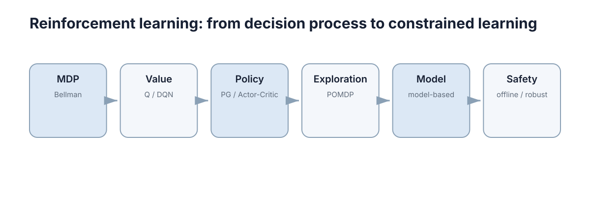

# Reinforcement Learning

> **定位：** RL 只按算法家族组织。先理解 MDP 和 Bellman，再理解“价值路线”“策略路线”，最后处理探索、模型与安全约束。

<figure markdown="span">
  
  <figcaption>Reinforcement Learning 的最小主学习路径；箭头表示认知依赖，不代表必须掌握所有高级分支。</figcaption>
</figure>

## What to master

学完本 Section，只要求做到三件事：

1. 能用自己的话解释本领域的核心问题；
2. 能读懂最关键的公式、流程或系统结构；
3. 能把概念连接到一个简单实现或真实系统。

## Core chapters

| No. | Chapter | Why it stays in the core path |
|---:|---|---|
| 01 | [MDP & Bellman Equation](01-mdp-bellman.md) | MDP 给出序列决策的最小数学模型；Bellman 方程则把长期回报压缩成一步递推，是几乎所有经典 RL 方法的共同骨架。 |
| 02 | [Value-Based Methods](02-value-based.md) | 价值方法先回答“这个状态/动作有多好”，再根据价值选择动作；Q-Learning 和 DQN 只是这一思想的代表。 |
| 03 | [Policy Gradient & Actor-Critic](03-policy-actor-critic.md) | 策略梯度直接优化策略；Actor-Critic 用价值估计给策略更新提供更低方差的反馈，因此两者应作为一条连续路线理解。 |
| 04 | [Exploration & Partial Observability](04-exploration-pomdp.md) | 探索解决“没试过”，部分可观测解决“看不全”。 |
| 05 | [Model-Based vs Model-Free RL](05-model-based-vs-model-free.md) | 是否显式学习或使用环境模型，是 RL 最重要的结构分界之一：模型换来规划能力，也引入模型偏差。 |
| 06 | [Safe, Robust & Offline RL](06-safe-robust-offline.md) | 当在线自由试错不可接受时，需要从数据来源、约束和分布偏移三个方向重新定义学习问题。 |

## Stop rule

当你能够解释上述主线并完成每章的 Worked example，就可以进入下一个 Section。高级证明、算法变体和工具细节统一放在 **Further Reading**，不阻塞主线。
