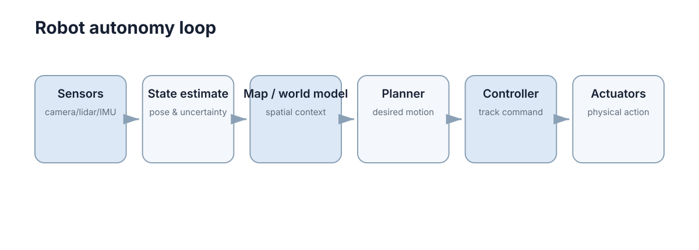

# Models, Kinematics & Dynamics

机器人要在真实世界运动，至少要解决三件事：**它在哪里、它会怎样运动、要产生这种运动需要什么力或力矩。** 坐标系、运动学和动力学分别对应这三个层次，而模型精度决定了这三个层次的答案能信到什么程度。

初学者最容易犯的错误是“混层求解”：用运动学去回答力的问题（比如想问电机扭矩却只算了轨迹），或者用动力学去回答几何问题（明明只关心末端位置却先建了完整惯性矩阵）。正确的做法是先判断任务处在哪一层，再决定模型的复杂度。

<figure markdown="span">
  
  <figcaption>模型栈自下而上分层：坐标系给出语言，运动学给出几何，动力学给出因果。</figcaption>
</figure>

## 坐标系与参考框架

同一个点可以在相机坐标系、机器人底盘坐标系和地图坐标系下得到完全不同的数值。机器人系统因此不会只说“目标在 $(2,1)$”，而要说明“目标在 camera frame 还是 map frame”。

刚体位姿通常由旋转 $R$ 和平移 $t$ 表示，齐次变换写成

$$
T=\begin{bmatrix}R&t\\ \mathbf 0^\top &1\end{bmatrix},
$$

其中 $R\in SO(3)$ 满足 $R^\top R=I$ 且 $\det R=1$。若已知 $T^A_B$ 和 $T^B_C$，则

$$
T^A_C=T^A_B\,T^B_C.
$$

这条链式关系就是机器人 TF 系统的数学基础。它的逆变换有闭式解：

$$
\left(T^A_B\right)^{-1}=\begin{bmatrix}R^\top&-R^\top t\\ \mathbf 0^\top&1\end{bmatrix},
$$

注意**不是**简单地把 $t$ 取负——外参写反是机器人调试中最常见的“方向颠倒”错误来源。

工程上常见的坐标系及其职责：

| 坐标系 | 记号约定 | 典型来源 | 常见错误 |
|---|---|---|---|
| 世界/地图 `map` | $T^{map}_{odom}$ | 定位模块输出 | 与 `odom` 混用导致跳变 |
| 里程计 `odom` | $T^{odom}_{base}$ | 轮式里程计积分 | 长期漂移被当作真值 |
| 机器人本体 `base_link` | $T^{base}_{sensor}$ | URDF 静态外参 | 外参旋转方向取反 |
| 传感器 `camera_link` | $T^{base}_{cam}$ | 标定结果 $\pm0.5°$ | 光学轴 vs 机械轴混淆 |
| 工具 `tool0` | $T^{base}_{tool}$ | 正运动学计算 | 单位混用（m vs mm） |

在工程层，一个二维坐标变换的小例子可以把“先旋转、再平移”的顺序固定下来：

```python
import math

def transform_point(px, py, tx, ty, yaw):
    c, s = math.cos(yaw), math.sin(yaw)
    return c * px - s * py + tx, s * px + c * py + ty
```

这里输入点位于局部坐标系，`tx, ty, yaw` 描述该坐标系相对目标坐标系的位姿。实际系统还要同时传递 frame 名称和时间戳。

## 运动学映射

运动学不考虑质量和受力，只研究几何关系。对差速小车，左右轮线速度为 $v_l,v_r$，轮距为 $L$，车体线速度和角速度近似为

$$
v=\frac{v_r+v_l}{2},\qquad \omega=\frac{v_r-v_l}{L}.
$$

因此两轮同速时直行，速度不同则转弯。对机械臂，关节变量 $q$ 通过正运动学映射到末端位姿；Jacobian 则描述关节速度和末端速度的局部关系

$$
\dot x=J(q)\dot q.
$$

这两层的分工可以明确列表：

| 维度 | 运动学 | 动力学 |
|---|---|---|
| 输入 | 位置/速度 $q,\dot q$ | 力矩 $\tau$ 或力 $F$ |
| 输出 | 位姿、速度 $\dot x$ | 加速度 $\ddot q$ |
| 是否含质量 | 否 | 是 |
| 典型用途 | 轨迹规划、IK、TF | 力矩控制、轨迹跟踪 |
| 失效场景 | 高速、重载时不准 | 低速时算力浪费 |
| 主要参数 | 连杆长度、轮距 $L$、轮径 $r$ | 质量、惯量 $I$、摩擦 |

运动学回答的是“怎么动”，不是“为什么能这样动”。当任务对速度或负载敏感时，运动学给出的答案会系统性偏差，且偏差随速度平方增长。

## 动力学把质量、惯性和力加入模型

当控制任务需要考虑加速度、负载或高速运动时，只靠运动学就不够。机械系统常写成

$$
M(q)\ddot q+C(q,\dot q)\dot q+g(q)=\tau,
$$

其中 $M(q)\in\mathbb R^{n\times n}$ 表示惯性矩阵（对称正定，$n$ 为自由度数），$C(q,\dot q)\dot q$ 表示科氏力与离心力项，$g(q)$ 表示重力项，$\tau$ 是执行器力矩。

每一项的量级决定了控制难度：低速时 $M\ddot q$ 与 $C\dot q$ 都可忽略，只剩 $g(q)$，所以简单的 PD + 重力补偿就能稳定；高速时 $C(q,\dot q)\dot q$ 随 $\dot q^2$ 增长，若忽略它，跟踪误差会随速度平方上升。举个数值感受：二连杆臂在关节速度 5 rad/s 时离心项可能占总力矩的 20%–40%，而 1 rad/s 时不到 3%。

| 项 | 物理含义 | 量级随速度 | 忽略后果 | 补偿方式 |
|---|---|---|---|---|
| $M(q)\ddot q$ | 惯性 | 与 $\ddot q$ 线性 | 加速段跟踪滞后 | 反馈线性化 |
| $C(q,\dot q)\dot q$ | 科氏/离心 | $\propto \dot q^2$ | 高速段误差突增 | 前馈模型 |
| $g(q)$ | 重力 | 与速度无关 | 静态位置偏移 | 重力补偿 |
| 摩擦项 $F_v\dot q+F_c\text{sgn}(\dot q)$ | 黏滞 + 库仑 | 线性 + 常量 | 低速爬行、死区 | 摩擦辨识 |

移动机器人低速导航时，简单运动学模型往往已经够用；机械臂高速轨迹控制、无人机姿态控制则更依赖动力学。**模型复杂度要由任务决定。**

## 旋转表示的三种形式

姿态是机器人学里最容易出错的部分，因为同一个旋转可以写成完全不同的数值。三种主流表示各有明确的适用边界。

**欧拉角**：用三个角 $(\phi,\theta,\psi)$ 表示，通常是绕固定轴或体轴的顺序旋转。它的优点是直观、维数最少（3）；缺点是存在**万向锁（gimbal lock）**：当中间角 $\theta=\pm90°$ 时，第一和第三旋转轴重合，雅可比秩下降，逆解不唯一。

**旋转矩阵**：$R\in SO(3)$，9 个分量、6 个独立约束。优点是线性、可复合、无奇异；缺点是冗余（9 个数描述 3 个自由度），需要正交化才能保持 $R^\top R=I$。

**四元数**：$q=(w,x,y,z)$，单位四元数满足 $\|q\|=1$，4 个数、1 个约束。优点是无奇异、插值平滑（SLERP）；缺点是符号二义性（$q$ 与 $-q$ 表示同一旋转），直接线性插值会失真。

三种表示的关键对比：

| 表示 | 参数个数/自由度 | 奇异性 | 复合运算代价 | 捷联积分误差 | 典型使用位置 |
|---|---|---|---|---|---|
| 欧拉角 | 3 / 3 | 有（万向锁，$\theta=\pm90°$） | 3 次三角运算 | 在奇异点发散 | 人类可读接口、UI |
| 旋转矩阵 | 9 / 3 | 无 | 一次 $3\times3$ 乘法 | 需正交化，误差 $\sim10^{-7}$/步 | 变换链、TF、视觉 |
| 四元数 | 4 / 3 | 无 | 一次四元数乘法（16 乘 + 12 加） | 需归一化，漂移小 | IMU 姿态积分 |

从旋转矩阵到四元数的转换（数值上最稳健的写法之一）：

$$
w=\tfrac12\sqrt{1+R_{11}+R_{22}+R_{33}},\quad
x=\frac{R_{32}-R_{23}}{4w},\quad
y=\frac{R_{13}-R_{31}}{4w},\quad
z=\frac{R_{21}-R_{12}}{4w}.
$$

当 $w\to0$（旋转接近 $180°$）时该公式数值不稳，必须改用最大对角元分支。这个细节说明：**没有一种表示在所有场景下都安全，切换表示本身就要处理边界情形。**

捷联积分的误差量级可以作为选型判据：IMU 在 200 Hz 下用一阶欧拉积分，姿态漂移典型 $0.5°\text{–}2°/s$；用四元数积分 + 归一化可降到 $0.05°\text{–}0.2°/s$；用旋转矩阵则需要每步正交化，否则误差累积更快。因此**姿态积分优先用四元数，变换链优先用齐次矩阵**。

## 雅可比与奇异性

Jacobian 把关节速度线性映射到末端速度：

$$
\dot x=J(q)\dot q,\qquad J(q)\in\mathbb R^{m\times n},
$$

其中 $m$ 是任务空间维数（平面任务 3，空间任务 6），$n$ 是关节数。对平面二连杆臂，$J$ 可显式写出：

$$
J(q)=\begin{bmatrix}-l_1\sin q_1-l_2\sin(q_1+q_2) & -l_2\sin(q_1+q_2)\\ l_1\cos q_1+l_2\cos(q_1+q_2) & l_2\cos(q_1+q_2)\end{bmatrix}.
$$

由此得到两条实用推论：

- **力映射是对偶的**：$\tau=J^\top(q)F$。把末端外力 $F$ 换算成关节力矩时用的是 $J^\top$，这不是巧合，而是虚功原理的直接结果；
- **逆解在奇异位形失效**：由 $\dot q=J^{-1}(q)\dot x$（方阵情形）可见，当 $\det J(q)\to0$，同样的末端速度需要趋于无穷的关节速度。

奇异性的定量度量是**可操作度**：

$$
w(q)=\sqrt{\det\big(J(q)J^\top(q)\big)},
$$

$w\to0$ 即为奇异位形。几何上它对应“所有关节运动都无法让末端沿某个方向移动”的构形。可操作度还能用奇异值解释：$J$ 的最小奇异值 $\sigma_{\min}$ 越小，末端在对应方向上的可控速度越弱。

| 奇异类型 | 几何条件 | 现象 | 处理方式 |
|---|---|---|---|
| 边界奇异 | 臂完全伸展 | 末端无法继续外伸 | 规划阶段避开工作空间边界 |
| 内部奇异 | 关节轴共线（如腕部 $q_5=0$） | 逆解退化为无穷多解 | 阻尼最小二乘（DLS） |
| 数值奇异 | $\sigma_{\min}/\sigma_{\max}<10^{-3}$ | 关节速度尖峰、抖动 | 截断奇异值（TSVD） |

工程上的标准解法是阻尼最小二乘：

$$
\dot q=J^\top\big(JJ^\top+\lambda^2 I\big)^{-1}\dot x,
$$

$\lambda$ 一般取 $10^{-3}\text{–}10^{-1}$ 之间的值：太小无法抑制尖峰，太大会引入末端跟踪误差。这条公式是“奇异附近用牺牲精度换稳定”的典型范式。

```python
import numpy as np

def dls_step(J, dx, lam=1e-2):
    A = J @ J.T + (lam ** 2) * np.eye(J.shape[0])
    return J.T @ np.linalg.solve(A, dx)

def manipulability(J):
    return float(np.sqrt(max(np.linalg.det(J @ J.T), 0.0)))
```

慢速通过奇异区还有一个廉价技巧：在 $w(q)<w_{th}$ 时按比例缩放末端速度，即 $\dot x\leftarrow\dot x\cdot w(q)/w_{th}$，让轨迹在奇异附近自然减速而不是跳变。

## 差速运动模型

二维差速车位姿为 $(x,y,\theta)$，在短时间 $\Delta t$ 内可近似更新为

$$
\begin{aligned}
x_{k+1}&=x_k+v\cos\theta_k\Delta t,\\
y_{k+1}&=y_k+v\sin\theta_k\Delta t,\\
\theta_{k+1}&=\theta_k+\omega\Delta t.
\end{aligned}
$$

这个写法把 $\theta$ 固定在区间起点，因此当 $\omega$ 较大时误差不可忽略。严格解是圆弧积分：

$$
\begin{aligned}
x_{k+1}&=x_k+\frac{v}{\omega}\big(\sin(\theta_k+\omega\Delta t)-\sin\theta_k\big),\\
y_{k+1}&=y_k-\frac{v}{\omega}\big(\cos(\theta_k+\omega\Delta t)-\cos\theta_k\big),\\
\theta_{k+1}&=\theta_k+\omega\Delta t.
\end{aligned}
$$

两者在 $\omega\to0$ 时一致（需要洛必达处理）。误差量级判据：当 $\omega\Delta t<0.05$ rad 时一阶近似相对误差 $<0.1\%$；当 $\omega\Delta t=0.3$ rad（约 $17°$）时位置误差可达厘米级。因此低速导航用一阶近似，快速转向必须用圆弧模型或更小步长。

```python
import math

def diff_drive_step(x, y, yaw, vl, vr, wheel_base, dt):
    v = 0.5 * (vl + vr)
    w = (vr - vl) / wheel_base
    return (x + v * math.cos(yaw) * dt,
            y + v * math.sin(yaw) * dt,
            yaw + w * dt)
```

这段代码没有考虑轮胎打滑、执行器动态和地形，因此适合低速平面运动，不应被当成真实车辆的完整物理模型。

| 误差来源 | 数学表现 | 典型量级 | 是否可标定 | 缓解手段 |
|---|---|---|---|---|
| 轮径误差 $\Delta r/r$ | 尺度误差，随里程线性增长 | 1%–3% | 是 | 直线标定 |
| 轮距误差 $\Delta L/L$ | 转向尺度误差，随累计转角增长 | 2%–5% | 是 | 原地旋转标定 |
| 积分离散化 | 一阶 vs 圆弧 | $\propto \omega\Delta t$ | 是（改模型） | 减小 $\Delta t$ / 圆弧积分 |
| 轮胎打滑 | 非系统性随机项 | 转弯时 5%–20% | 否 | 融合 IMU/视觉 |
| 地面坡度 | 平面假设失效 | 依地形 | 否 | 3D 状态估计 |

## 坐标、单位与时间约定

很多“算法错误”其实来自模型接口不一致：角度一处用 degree、一处用 radian；位置来自旧时间戳；相机外参方向写反；把 `map → base` 当成 `base → map` 使用。

因此机器人模型落地时应明确三个约定：**坐标系方向、单位、时间戳**。公式本身往往比这些工程约定更简单。

| 约定项 | 建议写法 | 违约的典型后果 | 检查方法 |
|---|---|---|---|
| 单位 | 全部 SI（m, rad, s） | 1000× 尺度错误 | 断言数值范围 |
| 旋转方向 | 右手系，逆时针为正 | 转向反了、镜像轨迹 | 用已知点验证 |
| 时间戳 | 统一单调时钟，标注 frame | TF 插值错位 | 检查单调性 |
| 变换记号 | $T^{A}_{B}$ 表示“B 在 A 中的位姿” | 链路方向颠倒 | 正逆变换回原点测试 |
| 角度范围 | 统一 $(-\pi,\pi]$ | 跨越 $\pm\pi$ 时跳变 | 检查 $\theta$ 连续性 |

## 模型精度与参数标定

模型误差最终都会以位姿误差的形式暴露出来，而且不同参数误差的**增长规律完全不同**。定量地看，对差速底盘，里程计输出的位置误差可以写成

$$
\Delta p\approx \Big(\frac{\Delta r}{r}\Big)s+\Big(\frac{\Delta L}{L}\Big)\frac{s\theta}{2},
$$

其中 $s$ 是行进距离，$\theta$ 是累计转角。第一项与距离成正比（尺度误差），第二项与 $s\cdot\theta$ 成正比（转向尺度误差）。举个数：$s=100$ m、$\theta=10$ rad、轮径误差 1%、轮距误差 3%，则两项分别贡献约 1.0 m 和 1.5 m，合计约 2.5 m——在 100 m 的行进上已经不可接受。这解释了为什么“只标定轮径”往往不够，**旋转标定必须单独做**。

各类参数对位姿误差的影响方式：

| 参数 | 误差典型值 | 进入位姿误差的方式 | 敏感实验 | 标后残差 |
|---|---|---|---|---|
| 轮径 $r$ | 1%–3% | 平移尺度 $\propto s$ | 直行 10 m 对比真值 | $<0.5$% |
| 轮距 $L$ | 2%–5% | 旋转尺度 $\propto s\theta$ | 原地转 10 圈对比真值 | $<1$% |
| 外参 $T^{base}_{cam}$ | $0.5°$、5 mm | 局部误差，随距离放大 | 靶标运动对比 | $<0.3°$ |
| 惯性矩阵 $I$ | 5%–10% | 力矩估计偏差，动态跟踪 | 阶跃力矩响应 | $<3$% |
| 关节零位 | $0.1°\text{–}1°$ | 系统性末端偏移 | 多点对靶 | $<0.2°$ |

标定实验的最小配置，按“用最少实验覆盖最多参数”原则排列：

1. **静止段**（30–60 s）：估计传感器偏置（IMU 陀螺零偏、加速度计零偏），给出测量噪声方差 $\sigma^2$；
2. **直线段**（10 m 往返）：用外部真值（卷尺、全站仪或运动捕捉）标定轮径 $r$ 与每轮尺度；
3. **原地旋转**（正反各 5–10 圈）：标定轮距 $L$ 与左右轮差异；
4. **方形/8 字轨迹**：联合验证 $r$ 与 $L$ 的耦合，检查回环闭合误差；
5. **靶标多点对位**（机械臂场景）：标定外参与关节零位，至少 15–20 个位形以覆盖各关节。

验收标准建议用两个指标：**回环闭合误差**（回到起点时位置误差占路径长度比例，合格线 $<0.5\%$）和**残差白噪声性**（标定后残差不应有系统性趋势，若仍有随 $\theta$ 增长的趋势，说明还有未辨识的尺度参数）。

## 变换链的验证方法

坐标变换最可靠的检查不是盯着矩阵元素，而是选择几个已知几何关系的点进行验证：原点应落在哪里，坐标轴方向是否正确，正变换后再逆变换能否回到原点。把这些检查写成测试，能在外参更新时及时发现方向颠倒。

| 检查项 | 期望结果 | 失败说明 | 严格度 |
|---|---|---|---|
| 正逆变换回原点 | 残差 $<10^{-9}$ | 外参方向写反 | 极强 |
| 原点映射 | $T^{A}_{B}\cdot 0=t^{A}_{B}$ | 平移与旋转顺序错 | 强 |
| 轴向量映射 | 单位轴映射后仍为单位向量 | 旋转矩阵未正交化 | 强 |
| 链式复合 | $T^{A}_{C}=T^{A}_{B}T^{B}_{C}$ | frame 命名或方向错 | 强 |
| 时间戳单调 | 严格递增 | 时钟源混用 | 中 |
| 已知点对齐 | 与实测点误差 $<2\sigma$ | 标定参数过期 | 中 |

```python
import numpy as np

def check_inverse(T):
    R, t = T[:3, :3], T[:3, 3]
    T_inv = np.block([[R.T, -R.T @ t[:, None]], [np.zeros((1, 3)), np.ones((1, 1))]])
    return float(np.max(np.abs(T @ T_inv - np.eye(4))))
```

最后一条经验：**模型的价值不在公式有多复杂，而在于它的误差是否被量化过。** 一个标定过的一阶运动学模型，通常比一个未标定的完整动力学模型更有用。

> **下一步**：接着看 [传感与状态估计](./02-sensing-estimation.md) 了解如何抑制里程计漂移，用 [建图与 SLAM](./03-mapping-slam.md) 把长期位姿误差闭合掉，再用 [路径与运动规划](./04-path-motion-planning.md) 把运动学约束变成可行轨迹，最后在 [导航与控制](./05-navigation-control.md) 里把模型接到闭环控制器上，动力学细节可参考 [状态空间建模](../control-theory/01-modeling-state-space.md)。
