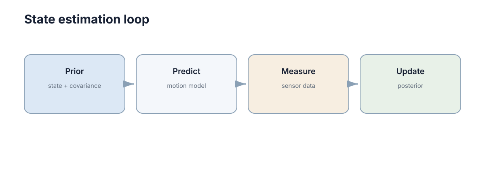

# 机器人传感与状态估计

机器人真正需要的是位置、速度、姿态和环境状态，但传感器只能提供带噪声的间接测量。状态估计的任务就是把**模型预测**和**传感器观测**结合起来，得到当前最可信的状态。

<figure markdown="span">
  
  <figcaption>状态估计不断执行“预测 → 观测 → 修正”，而不是只做一次滤波。</figcaption>
</figure>

## 一、不同传感器看到的是不同物理量

编码器测轮子转动，IMU 测角速度和比力，相机测光强形成的图像，LiDAR 测距离。它们通常都**不直接等于机器人状态**。

例如编码器可以积分得到位移，但轮胎打滑会造成漂移；IMU 高频但积分误差会快速累积；GNSS 或视觉定位漂移慢，却可能更新较慢或偶尔失效。状态估计正是利用这些互补性。

## 二、只有观测不够，还要有预测

若上一时刻估计为 $\hat x_{k-1}$，控制输入为 $u_{k-1}$，模型先产生预测

$$
\hat x_k^- = f(\hat x_{k-1},u_{k-1}).
$$

随后传感器给出观测

$$z_k=h(x_k)+v_k,$$

估计器根据预测和观测之间的差异进行修正。预测让系统在短时间没有新观测时仍能前进，观测则防止模型误差无限累积。

## 三、Kalman Filter 的核心是“按不确定性加权”

线性 Gaussian 条件下，Kalman Filter 的更新可以写成

$$
\hat x_k=\hat x_k^-+K_k(z_k-H\hat x_k^-).
$$

括号里是 innovation，即“实际观测与预测观测的差”。$K_k$ 越大，越相信传感器；越小，越相信模型预测。它不是简单取平均，而是根据两边的不确定性自动分配权重。

```python
import numpy as np

def scalar_kalman(x_pred, p_pred, z, r):
    k = p_pred / (p_pred + r)
    x = x_pred + k * (z - x_pred)
    p = (1 - k) * p_pred
    return x, p
```

## 四、非线性系统仍然沿同一条思路工作

机器人运动和相机观测通常是非线性的。EKF 会在当前估计附近线性化模型；更复杂的方法可以使用 sigma points、粒子或优化。但对初学者最重要的是保持同一认知链：**先用模型预测，再用观测残差纠正。**

具体滤波器只是实现这条逻辑的不同方式。

## 五、多传感器融合的难点往往在滤波器之外

相机、IMU、LiDAR 的时间戳不同、频率不同、坐标系不同。即使 Kalman 公式完全正确，时间没有对齐或外参错误，融合结果仍会漂移甚至发散。

因此实机调试通常先检查：数据时间是否单调、坐标变换是否正确、噪声参数是否合理、传感器是否存在固定偏置，再调滤波器本身。

## 六、估计器应该输出“不确定性”，而不只输出一个数

一个位置估计 $x=2.0$ m 若没有方差，就无法判断它是非常可靠还是只是粗略猜测。后续规划和安全模块也需要根据不确定性调整行为：定位越不可信，速度和动作范围通常越应该保守。
