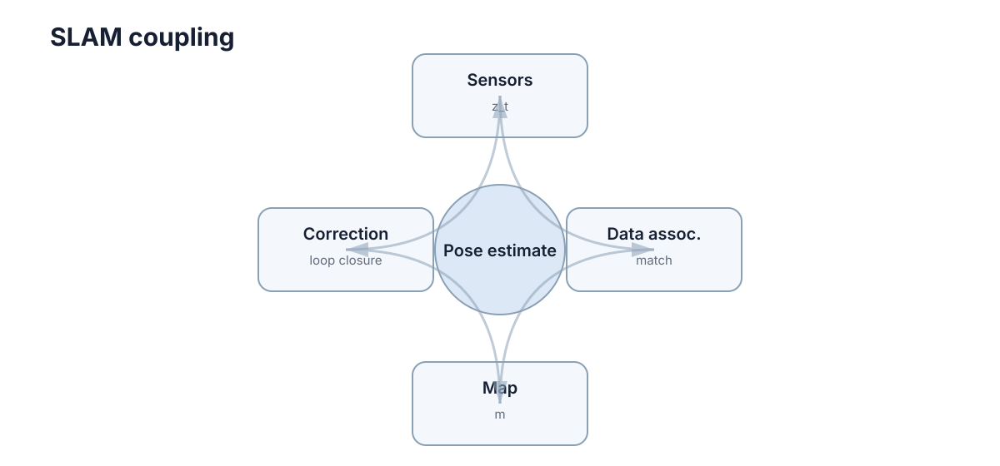

# Mapping & SLAM

SLAM（Simultaneous Localization and Mapping）解决一个循环依赖：**机器人需要地图才能知道自己在哪，但又需要知道自己在哪才能把观测放进正确的地图位置。** 这个循环不能靠单次求解打破，只能靠“短时间尺度上足够准的局部估计 + 长时间尺度上的全局约束修正”两级结构来实现。

<figure markdown="span">
  
  <figcaption>前端不断产生相对运动，后端利用长期约束修正累积漂移。</figcaption>
</figure>

理解 SLAM 的关键不是某个算法，而是三件事的分工：**前端负责快但会漂，后端负责准但很慢，闭环负责把两者接起来。** 本章按这个结构展开，最后给出实机调试顺序。

## 里程计误差累积

假设每一步位姿增量都只有很小误差，连续累积几百、几千步后，位置和角度误差仍会越来越大。尤其角度误差会改变后续平移方向，使轨迹逐渐偏离真实路径。

这个累积不是线性增长。设第 $k$ 步的角度误差为 $\delta\theta_k$，此后剩余行程长度为 $L_k$，则它造成的末端位置误差近似为

$$\delta p \approx \sum_k L_k\,\delta\theta_k,$$

也就是说，**越早出现的角度误差，被放大的行程越长**。位置误差本身以随机游走方式累积（约与步数的平方根同阶），而角度误差通过上述机制带来与距离同阶甚至更强的漂移。若把每步的平移噪声方差记为 $\sigma_x^2$、角度噪声方差记为 $\sigma_\theta^2$，则末端位置误差的方差近似为

$$\sigma_p^2 \approx \sum_k \left( \sigma_x^2 + L_k^2\,\sigma_\theta^2 \right).$$

第二项里的 $L_k^2$ 是关键：**角度噪声的权重随剩余距离平方增长**，所以同样的角度精度，在长距离任务里比在短距离任务里贵得多。这也解释了一个常见现象：短距离内里程计看起来完全够用，走完一个长回路后地图却整体扭曲。

不同里程计来源的误差量级可以用“相对行程的百分比”粗略对照：

| 里程计来源 | 误差量级（相对行程） | 长距离主导项 | 失效条件 |
|---|---|---|---|
| 轮式编码器 | 约 1%–5%（打滑时更差） | 标定误差与打滑 | 湿滑地面、越障 |
| 视觉里程计 | 约 0.5%–2% | 尺度漂移与角度漂移 | 纹理缺乏、快速旋转 |
| LiDAR 扫描匹配 | 约 0.1%–1% | 无结构环境下的横向约束不足 | 长直走廊、开阔场地 |
| IMU 单积分 | 位置误差随时间平方增长 | 零偏漂移 | 超过数秒的纯惯性推算 |

| 里程计来源 | 典型误差构成 | 主要退化场景 |
|---|---|---|
| 轮式编码器 | 轮径标定误差、打滑、地面不平 | 湿滑地面、急转弯、越障 |
| 视觉里程计 | 特征匹配误差、尺度漂移、运动模糊 | 纹理缺乏、快速旋转、强光 |
| LiDAR 扫描匹配 | 点云配准残差、时间戳偏差 | 长直走廊、开阔场地 |
| IMU 积分 | 零偏漂移、重力对齐误差 | 长时间运行、剧烈振动 |

因此 SLAM 不能只靠“上一帧到下一帧”的局部估计，还需要长期约束。

## 前端：局部运动估计与数据关联

视觉 SLAM 会从图像中找特征或直接利用像素信息，LiDAR SLAM 会做点云/扫描匹配。前端的任务是估计“我从上一时刻移动到了哪里”，并判断当前观测对应地图中的哪些结构。

前端输出快、频率高，但它本身无法避免长期漂移。它同时承担两件容易被混淆的工作：

- **运动估计**：在已知数据关联的前提下，求解两帧之间的相对位姿；
- **数据关联**：决定当前观测“属于”哪个已有结构或地图区域。

扫描匹配的几何形式可以直接写出来。设当前帧点集为 $\{q_j\}$，目标帧或局部地图点集为 $\{p_j\}$，待求的相对变换为 $(R, t)$，则点到点 ICP 求解的是

$$\min_{R \in SO(3),\, t} \sum_j \left\lVert p_{c(j)} - (R q_j + t) \right\rVert_2^2,$$

其中 $c(j)$ 是 $q_j$ 在目标点云中的最近点索引。点到点形式简单，但在平面结构上收敛慢；引入目标点法向 $n_j$ 后得到点到面残差

$$\min_{R,\, t} \sum_j \left( n_j^\top \left( R q_j + t - p_{c(j)} \right) \right)^2,$$

它只约束法向方向，因此在墙面、地面这类平面上收敛更快，但对法向估计的噪声更敏感。最近点搜索是这里的成本瓶颈：暴力搜索是 $O(NM)$，用 KD-tree 或体素哈希可以降到约 $O(N \log M)$ 甚至 $O(N)$，这也是前端能否跑到 10–100 Hz 的决定因素。

| 前端路线 | 代表做法 | 优势 | 主要失效模式 |
|---|---|---|---|
| 特征法 | 提取角点/描述子后匹配 | 对光照和尺度较稳定，易于剔除误匹配 | 弱纹理场景提取不到特征 |
| 直接法 | 直接最小化光度误差 | 弱纹理下仍可用，精度高 | 对光照变化、曝光敏感 |
| 扫描匹配 | ICP、NDT、相关性匹配 | 对结构化环境稳定，精度高 | 初值差时落入局部极小 |

| 配准残差形式 | 对什么敏感 | 收敛范围 | 适用几何 |
|---|---|---|---|
| 点到点 | 采样密度、初值 | 需要较好初值 | 无显著结构的点云 |
| 点到面 | 法向估计误差 | 较大，平面多时快 | 室内墙面、地面 |
| 点到分布（NDT） | 体素分辨率 | 大，不需要对应点 | 室外大场景 |
| 光度残差 | 光照与曝光 | 小位移 | 视觉前端、纹理丰富 |

真正拖垮 SLAM 的通常不是运动估计，而是**数据关联错误**：一个错误匹配会以约束的形式进入后端，让整条轨迹被“合理但错误”地拉扯。因此在实现上，先固定关联再求位姿（ICP 风格）比同时求解两者更稳定，代价是当两者都错时需要外层的鲁棒机制来兜底。

## 后端：把整条轨迹写成优化问题

后端可以把机器人不同时刻的位姿作为节点，把里程计、扫描匹配和闭环关系作为约束。若两个时刻实际上处于同一地点，闭环约束会告诉优化器：这两个位姿应该重合或接近。

写成最小二乘形式，位姿图优化求解的是

$$X^* = \arg\min_{X}\sum_{(i,j)\in\mathcal{E}} \left\lVert e_{ij}(x_i,x_j,z_{ij}) \right\rVert^2_{\Sigma_{ij}},$$

其中 $z_{ij}$ 是观测到的相对约束，$e_{ij}$ 是它与当前估计之间的残差，$\Sigma_{ij}$ 是该约束的不确定度（信息矩阵）。这个形式包含两个重要含义：

- **权重由不确定度决定**：不可靠的约束权重低，闭环这类长期约束权重高，因此能主导全局形状；
- **误差在全轨迹重新分配**：优化的结果不是简单修改当前位置，而是把误差在整条轨迹中重新分配，使所有约束尽可能一致。

实际求解用的是 Gauss-Newton 或 Levenberg-Marquardt 迭代。把全部残差堆成向量 $e(X)$、把雅可比记为 $J = \partial e / \partial X$，则每次迭代要求解的线性系统是

$$\left( J^\top \Sigma^{-1} J \right) \Delta X = -\,J^\top \Sigma^{-1} e, \qquad X \leftarrow X \boxplus \Delta X,$$

其中 $\boxplus$ 表示在流形（位姿群）上的更新。这个系统的结构决定了复杂度：位姿图的 $J$ 非常稀疏（每条边只涉及两个位姿），用 Cholesky 分解稀疏矩阵时，$n$ 个位姿的求解成本大致是 $O(n)$ 到 $O(n^{1.5})$；而如果当成稠密矩阵处理，成本是 $O(n^3)$，$n=1000$ 时就已不可接受。

| 后端形式 | 状态量 | 适用规模 | 特点 |
|---|---|---|---|
| 滤波（EKF-SLAM） | 当前位姿 + 全部路标 | 小规模 | 在线、增量；路标多时协方差矩阵增长快 |
| 位姿图优化 | 历史位姿 | 中大规模 | 可批量或增量求解，工程主流 |
| 全局 BA | 位姿 + 结构点 | 视觉系统 | 最精确但成本最高，通常分层使用 |

| 求解方式 | 复杂度量级 | 适用规模 | 工程取舍 |
|---|---|---|---|
| 稠密直接求解 | $O(n^3)$ | $n < 100$ | 实现最简单，仅用于小规模或调试 |
| 稀疏 Cholesky | 约 $O(n)$–$O(n^{1.5})$ | $n$ 到 $10^4$ | 主流选择，需要好的变量排序 |
| 增量式（iSAM 类） | 每次更新近似 $O(1)$ 摊销 | 长时间在线运行 | 实现复杂，收敛行为更依赖参数 |
| 滑窗 + 边缘化 | 窗口内 $O(w^3)$ | 需要严格实时 | 会引入窗口边界的线性化误差 |

实践中降低 $n$ 的最有效手段不是换求解器，而是**关键帧策略**：只在运动足够大或观测质量足够好时才插入新节点，可以把节点数从“每帧一个”降到“每米一个”，直接让后端成本下降一个数量级。

## 闭环检测与误匹配风险

机器人走一圈回到旧地点时，正确闭环可以显著修正漂移；错误闭环则会把两个不同地点强行拉到一起，导致地图整体变形。

因此闭环检测通常需要比普通帧间匹配更谨慎的验证，例如几何一致性、点云匹配得分或多帧确认。**错误闭环往往比没有闭环更糟。**

闭环检测本质上是一个二分类问题，两类错误代价完全不对称。若把候选分为真正例 $TP$、假正例 $FP$、假负例 $FN$，精确率 $P = TP/(TP+FP)$、召回率 $R = TP/(TP+FN)$，综合指标为

$$F_1 = \frac{2PR}{P+R}.$$

| 情况 | 后果 | 处理取向 |
|---|---|---|
| 漏检闭环 | 漂移不被修正，地图缓慢变形 | 可接受，误差有界 |
| 误检闭环 | 地图整体撕裂、轨迹跳变 | 通常不可恢复，必须严格抑制 |

| 错误类型 | 计入指标 | 代价特征 | 缓解方向 |
|---|---|---|---|
| 漏检（FN） | 召回率下降 | 漂移残留，地图慢慢变形，可事后补救 | 放宽检索 top-k |
| 误检（FP） | 精确率下降 | 地图结构被破坏，需人工重建 | 加严几何与 χ² 校验 |

因此实践中的参数调法是把阈值设得保守、用多帧一致性确认，而不是追求高召回率：**目标是精确率接近 1（例如 >0.98），召回率 0.6–0.8 即可接受**，因为漏掉的闭环会在下一次经过时再次成为候选。若发现地图出现“整体折叠”或某段轨迹被强行拉直，第一嫌疑对象就是误检闭环，而不是后端优化器。

一个可复用的验证流水线是逐级收紧的，每一级都能廉价地否决候选：

| 步骤 | 方法 | 典型否决条件 |
|---|---|---|
| 1. 检索 | 描述子/直方图相似度取 top-k | 相似度低于阈值 |
| 2. 几何一致性 | RANSAC 拟合相对位姿 | 内点数 <10 或内点率 <30% |
| 3. 不确定度校验 | 残差马氏距离平方 $d^2 = e^\top \Sigma^{-1} e$ | $d^2$ 超过 $\chi^2_{(3,\,0.99)}$ 门限（约 11.3） |
| 4. 时间一致性 | 连续 2–3 次观测相互印证 | 单次触发不采信 |
| 5. 事后审计 | 记录每位姿的闭环次数与残差 | 单个位姿被大量闭环“拉扯” |

## 稳健核与误闭环抑制

最小二乘对离群值极不稳健，原因在代价函数本身：二次代价中残差以平方进入目标，因此**一条量级差 10 倍的错误约束，其影响会放大 100 倍**，足以压过几十条正确的里程计约束，让整段轨迹被拉向错误位置。

解决办法是在残差上改用稳健核。设残差尺度参数为 $\delta$，Huber 权重为

$$w(r)=\min\left(1,\ \frac{\delta}{|r|}\right), \qquad \rho(r)=\int_0^{|r|} w(s)\,\mathrm{d}s,$$

其效果是：残差小于 $\delta$ 时保持二次行为（不损失正常数据的效率），超过 $\delta$ 后退化为线性增长，从而限制单条约束的最大影响。权重写进目标函数后，优化问题变为

$$\min_X \sum_{(i,j)\in\mathcal{E}} \rho\!\left( \left\lVert e_{ij} \right\rVert_{\Sigma_{ij}} \right),$$

等价于把每条约束的信息矩阵按 $w$ 缩放，再迭代求解——这也意味着稳健核不改变问题的结构，只改变权重。

| 稳健核 | 权重特征（超出尺度后） | 对极端离群的处理 | 典型使用场景 |
|---|---|---|---|
| 二次（无稳健核） | 恒为 1 | 无，离群完全主导 | 已经严格剔除离群的干净数据 |
| Huber | 随 δ / abs(r) 线性衰减 | 增长被限制为线性 | 一般扫描匹配，离群较少 |
| Cauchy | 按 1/(1+(r/c)²) 快速衰减 | 影响有上界，近似被忽略 | 误闭环风险较高 |
| Geman-McClure | 极快趋零 | 影响近乎截断 | 离群比例较高 |
| 开关变量法 | 额外优化开关权重 | 可完全关闭某条约束 | 已知存在误闭环时需要保留可回滚性 |

下面这段示意代码把两个关键动作放在一起：用 Huber 权重降低可疑残差的发言权，用卡方门限决定候选闭环是否入库。真实实现还需要多帧确认与日志审计。

```python
import numpy as np

def huber_weight(r, delta):
    """Weight for one residual: 1.0 for inliers, delta/abs(r) for outliers."""
    a = np.abs(r)
    return np.where(a <= delta, 1.0, delta / np.maximum(a, 1e-9))

def accept_loop(residual, info, chi2_thresh):
    """Mahalanobis gate for a candidate loop closure (3-DoF pose error)."""
    d2 = float(residual @ info @ residual)  # squared Mahalanobis distance
    return d2 <= chi2_thresh  # True keeps the constraint in the graph

residual = np.array([0.02, -0.03, 0.01])  # [dx, dy, dyaw] in metres / radians
info = np.diag([1.0 / 0.05**2, 1.0 / 0.05**2, 1.0 / 0.01**2])
w_huber = huber_weight(residual[2], delta=0.05)  # downweight a shaky yaw match
accepted = accept_loop(w_huber * residual, info, 11.34)  # chi2(3, 0.99)
```

## 地图表示由任务决定

二维导航常用 occupancy grid；三维避障可能使用体素、点云或局部高度图；视觉系统还可能维护稀疏 landmark。地图不是越精细越好，分辨率越高意味着存储、匹配和更新成本也越高。

这一点可以算清楚。设地图覆盖面积为 $L \times L$（m）、分辨率为 $r$（m/格）、每格存储 $b$ 字节，则内存为

$$M = \frac{L^2}{r^2} \cdot b.$$

代入 $L = 100$ m、$b = 1$ B：分辨率 0.05 m 时需要约 $4 \times 10^6$ 个格，即 4 MB；分辨率减半到 0.025 m，格数与内存涨到 4 倍（16 MB）。而匹配与更新的成本同样随格数增长，因此**分辨率每提升一倍，整条流水线的成本大约翻两番**。

| 表示 | 典型用途 | 分辨率成本 | 主要局限 |
|---|---|---|---|
| Occupancy grid | 二维导航与路径规划 | 中（与面积成正比） | 难以表达三维结构和悬空障碍 |
| 点云 / 体素 | 三维避障、重建 | 高 | 内存增长快，需下采样 |
| 局部高度图 | 越野与不平地面 | 中 | 无法表达多层结构 |
| 稀疏 landmark | 视觉定位 | 低 | 只包含少量特征，不能直接规划 |
| ESDF / 距离场 | 规划与控制的安全裕度 | 高（需持续维护） | 建图与更新成本高 |

| 分辨率 | 100 m × 100 m 网格数 | 内存（1 B/格） | 适用场合 |
|---|---|---|---|
| 1 m | $10^4$ | 10 KB | 大范围粗地图、全局拓扑 |
| 0.2 m | $2.5 \times 10^5$ | 250 KB | 室外导航、粗略避障 |
| 0.05 m | $4 \times 10^6$ | 4 MB | 室内导航、轮椅与仓储机器人 |
| 0.02 m | $2.5 \times 10^7$ | 25 MB | 精细操作、窄通道通过 |

选择表示时应先问“下游要拿地图做什么”，而不是“哪种地图更完整”。定位需要的是可重复识别的结构，规划需要的是可查询的占据与距离信息，两者对分辨率的要求并不一致。常见的工程折中是维护多层地图：粗分辨率用于全局规划，精细分辨率只在机器人附近的局部窗口内维护。

## 可观测性限制地图质量

某些运动和环境无法提供足够约束，例如长直走廊缺少横向特征、纯旋转难以恢复平移尺度。此时优化器无法凭空创造信息。

这一点可以用信息矩阵说明。设约束残差对状态的雅可比为 $J$、噪声协方差为 $\Sigma$，则信息矩阵为 $\mathcal{I} = J^\top \Sigma^{-1} J$，状态估计的不确定度由它的逆给出。当某个方向缺少约束时

$$\lambda_{\min}(\mathcal{I}) \to 0 \quad \Rightarrow \quad \sigma_{\text{state}} \to \infty,$$

也就是说：**该方向上的估计误差可以任意大，而优化器仍然报告“收敛”**。工程上更常用的诊断量是条件数 $\kappa = \lambda_{\max} / \lambda_{\min}$：$\kappa$ 在健康场景通常是 $10^2$ 量级，退化时会升到 $10^5$ 以上，此时即使残差很小，解得出的位姿在该方向上也是不可信的。

| 退化场景 | 缺失的约束 | 常见应对 |
|---|---|---|
| 长直走廊 | 沿走廊方向的横向与偏航约束 | 融合 IMU 或轮速，使用先验地图 |
| 纯旋转运动 | 平移尺度（单目）、基线 | 引入 IMU 或深度信息 |
| 开阔场地 | 远距离结构、特征 | 降低对几何约束的依赖，增强里程计权重 |
| 玻璃 / 镜面 | 有效的测距与特征 | 多传感器互补，主动剔除异常观测 |

| 退化方向 | 可观测性诊断信号 | 后果 | 优先应对 |
|---|---|---|---|
| 横向平移 | 信息矩阵最小特征值接近 0 | 位置沿走廊漂移 | 轮速/IMU 约束或先验地图 |
| 偏航角 | 条件数突然上升一个量级 | 地图整体缓慢旋转 | 陀螺仪约束、检测旋转退化 |
| 尺度（单目） | 尺度不可观测，协方差无上界 | 地图尺寸随经验漂移 | IMU 预积分或深度 |
| 高度 / 俯仰 | 平面环境下法向约束退化 | 高度缓慢漂移 | 重力方向约束 |

识别退化场景并融合其他传感器，通常比继续调迭代次数更有效。传感器融合的价值主要体现在**不同传感器在不同场景下退化方向不同**：视觉在弱纹理下退化，LiDAR 在无结构环境下退化，IMU 在长时间下退化，它们失效的条件并不重合。

## 计算预算与实时性

SLAM 的每次迭代都要与传感器频率竞争。设传感器周期为 $T_{\text{s}}$，前端每帧耗时 $t_{\text{front}}$（含数据关联），后端每次优化耗时 $t_{\text{back}}$、执行频率为 $f_{\text{back}}$，则常规帧必须满足

$$t_{\text{front}} + \frac{t_{\text{back}}}{f_{\text{back}} \cdot T_{\text{s}}} \le T_{\text{s}} \cdot \eta, \qquad \eta \approx 0.5,$$

其中 $\eta$ 是留给这一级流水线的时间占比（其余留给其它模块）。若 $T_{\text{s}} = 100$ ms、$\eta = 0.5$、$f_{\text{back}} = 1$ Hz，则后端每次最多只能用 50 ms，前端还有约 45 ms 可用。

| 组件 | 典型耗时 | 运行频率 | 超预算时的表现 |
|---|---|---|---|
| 点云预处理与降采样 | 5–20 ms | 与传感器同频 | 帧率下降、时间戳滞后 |
| 数据关联（KD-tree/体素） | 5–30 ms | 与传感器同频 | 匹配耗时抖动、延迟累积 |
| 前端位姿求解 | 1–10 ms | 与传感器同频 | 迭代次数被截断，精度下降 |
| 局部后端优化 | 10–100 ms | 1–10 Hz | 地图更新滞后于机器人运动 |
| 全局优化 + 闭环 | 100 ms–数秒 | 事件触发 | 卡顿几帧，需异步执行 |

| 降本手段 | 直接效果 | 代价 | 何时采用 |
|---|---|---|---|
| 关键帧采样 | 后端 $n$ 降一个数量级 | 牺牲少量精度 | 默认应有 |
| 体素降采样 | 关联与求解同时变快 | 细结构被抹平 | 大场景、高分辨率传感器 |
| 局部窗口优化 | 单次求解时间有上界 | 产生窗口边界误差 | 需要严格实时 |
| 异步/多线程后端 | 前端不被阻塞 | 需要处理位姿回写与竞争 | 有多个 CPU 核可用 |
| 降频建图 | 直接省算力 | 快速运动时关联易失败 | 低速平台 |

工程上的一条经验是：**把全局优化和闭环检测放到独立线程，前端永远不等后端返回**。一旦前端为了等后端结果而阻塞，传感数据就会在队列里堆积，而堆积又会进一步提高相邻帧之间的运动量，形成“越慢越难匹配”的正反馈。

## 实机调试顺序

地图撕裂、轨迹跳变时，应先检查时间戳、TF、传感器外参和前端匹配；后端优化通常不是第一个怀疑对象。实机 SLAM 的大量问题来自**坐标和数据关联**，而不是优化公式本身。

| 现象 | 最可能原因 | 先验证什么 |
|---|---|---|
| 地图整体缓慢旋转 | 外参或时间戳存在固定偏差 | 打印 TF 与观测时间戳，检查偏置是否恒定 |
| 轨迹在固定位置跳变 | 误检闭环 | 关闭闭环重建，若恢复正常即确认 |
| 局部地图重影 | 数据关联错误或标定不准 | 观察重影是否随距离线性增大 |
| 走直线时地图弯曲 | 尺度或里程计标定问题 | 用已知长度路径做标定验证 |
| 转角后整体偏转 | 角度标定或时间戳延迟 | 对比不同转向速度下的偏差是否同向 |

每一步都应当有量化判据，否则“看起来正常”会浪费大量时间：

| 检查步骤 | 具体检查内容 | 通过标准 |
|---|---|---|
| 时间戳 | 传感器时间戳与 TF 查询时间之差 | 同步后偏差 <5 ms，且不随运行时间漂移 |
| 外参 / TF 树 | 标定重投影或平面残差 | 相机重投影误差 <2 px，LiDAR 平面残差 <2 cm |
| 前端匹配 | 内点率与迭代次数 | 内点率 >60%，迭代次数不长期顶到上限 |
| 闭环质量 | 人工抽检候选闭环 | 20 个候选中 ≥19 个正确 |
| 后端残差 | 优化后各约束的残差分布 | 无单条残差超过中位数的 10 倍 |

推荐的固定排查顺序是：**时间戳与 TF → 标定与外参 → 前端数据关联 → 闭环检测 → 后端优化**。顺序颠倒会让人在公式层面反复修改一个其实由坐标系引起的问题。

只有当以上判据全部通过、问题却依然存在时，才进入算法层面的怀疑。此时必须先保留原始观测数据（话题录制或等价的离线包）以便复现——**没有原始数据的 SLAM 问题几乎无法定位**，因为大多数现象只在特定运动与环境下出现一次。

> **下一步**：地图建好之后，下一步是让机器人在其中移动。先看 [Sensing & State Estimation](./02-sensing-estimation.md) 理解定位的观测来源，再看 [Path & Motion Planning](./04-path-motion-planning.md) 与 [Navigation & Control](./05-navigation-control.md) 把地图变成动作。时间戳与分布式时间同步的细节见 [Time & Asynchrony](../distributed-systems/02-distributed-time.md)，三维观测的处理见 [Depth, 3D Vision & Point Clouds](../perception/04-depth-point-cloud.md)。地图在下游规划中的分辨率取舍另见 [机器人仿真与传感器模拟](../simulation-sim2real/02-robot-sensor-simulation.md)。
