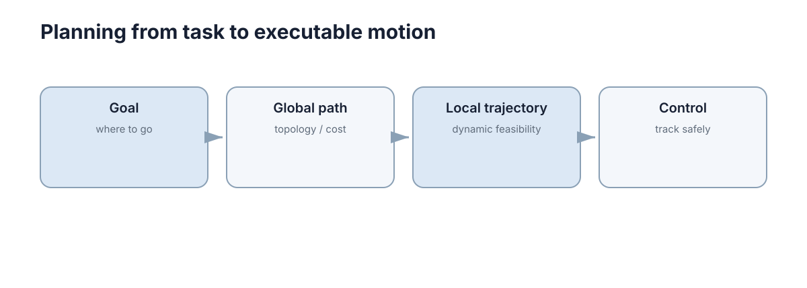

# Path & Motion Planning

> **Section:** Robotics

## Why it matters

规划的最小区分是：路径只关心几何可达，运动规划还要考虑机器人动力学、时间和碰撞约束。

## Visual intuition

<figure markdown="span">
  
  <figcaption>高层目标逐步被压缩成可执行轨迹，最终由控制器跟踪。</figcaption>
</figure>

## Core ideas

- **Path**：几何路线，不一定带时间。
- **Trajectory**：带时间、速度/加速度约束的运动。
- **Configuration space**：把机器人几何碰撞转成状态空间障碍。
- **Cost**：长度、时间、安全距离、平滑度等。

## Key theory

图搜索适合离散地图，采样规划适合高维连续空间。规划器的输入至少要明确：**起点、目标、地图/障碍、运动约束、代价函数**。

## Representative methods

- A*：离散地图图搜索代表。
- RRT：高维连续空间采样规划代表。
- Local trajectory optimization：把动力学和障碍一起考虑。

## Minimal code

A* 的关键不是代码本身，而是评价函数 $f=g+h$：已有代价保证真实累计，启发式估计把搜索引向目标。

```python
from heapq import heappush, heappop

def astar(start, goal, neighbors, h):
    frontier = [(h(start, goal), 0, start)]
    best = {start: 0}
    while frontier:
        _, g, node = heappop(frontier)
        if node == goal:
            return g
        for nxt, cost in neighbors(node):
            ng = g + cost
            if ng < best.get(nxt, float("inf")):
                best[nxt] = ng
                heappush(frontier, (ng + h(nxt, goal), ng, nxt))
```

## Worked example

仓库 AGV 可先用 A* 找全局栅格路径，再由局部规划器根据实时障碍生成可执行速度轨迹。

## Connections

- → Control Theory：规划给参考，控制负责跟踪。
- → Robustness：地图/定位误差会使名义安全路径失效。

## Further Reading

- Dijkstra、RRT*、Hybrid A*、CHOMP/TrajOpt。

> 这一部分不属于主学习路径；需要做论文、项目或深入证明时再回来查。

## Learning path

[← Section overview](index.md) · [← Mapping & SLAM](03-mapping-slam.md) · [Navigation & Robot Control →](05-navigation-control.md)
