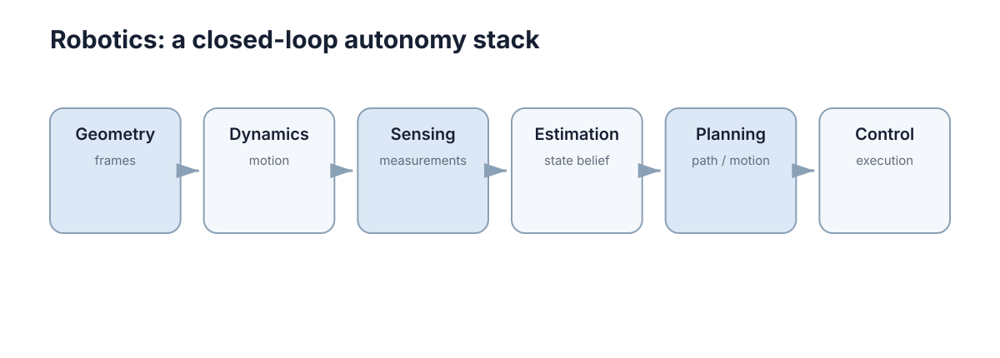

# Robotics

机器人部分把模型、传感、状态估计、SLAM、规划和控制串成完整闭环，目标是理解一台自主机器人怎样从传感器数据走到动作执行。

<figure markdown="span">
  
  <figcaption>Robotics 的核心概念关系。</figcaption>
</figure>

## 内容

1. [机器人模型、运动学与动力学](01-models-kinematics-dynamics.md)
2. [机器人传感与状态估计](02-sensing-estimation.md)
3. [地图构建与 SLAM](03-mapping-slam.md)
4. [路径规划与运动规划](04-path-motion-planning.md)
5. [机器人导航与控制](05-navigation-control.md)
