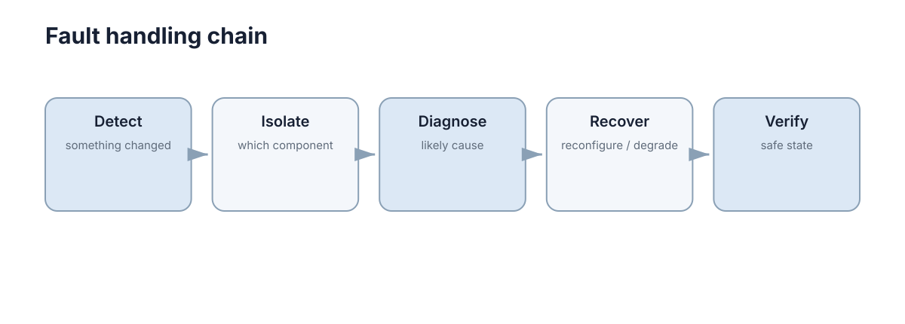

# Fault Detection & Tolerance

故障是组件偏离正常工作状态，失效则是系统无法完成要求的功能。容错的目标是：**单个组件出问题时，系统还能检测、隔离，并进入可接受的降级状态。**

<figure markdown="span">
  
  <figcaption>容错不是“没有故障”，而是阻止局部故障演变成系统级失效。</figcaption>
</figure>

## 故障检测首先需要正常行为的参考

可以检查传感器是否超出物理范围、多个传感器是否互相矛盾、控制循环是否按时运行、模型残差是否突然增大。

单个阈值适合简单故障；复杂系统常结合多个信号降低误报。

## 检测之后还要判断谁出了问题

两个编码器读数不一致，只能说明至少一个有问题。结合 IMU、车辆运动模型或第三个传感器，才能进一步做 fault isolation。

没有隔离就直接丢弃某个传感器，可能反而删除了正确数据。

## 恢复策略通常以降级为目标

故障后不一定还能继续完成原任务。更安全的目标可能是减速、停车、返航或切换人工控制。

```python
def fallback(localization_ok, lidar_ok):
    if not localization_ok:
        return "STOP_AND_RELOCALIZE"
    if not lidar_ok:
        return "LOW_SPEED_CAMERA_ONLY"
    return "NORMAL"
```

## 冗余要避免共同失效模式

两只同型号传感器共用同一电源，并不能抵御电源故障；两套软件副本共享同一个 bug，也不会因为“有两个实例”就更可靠。

有效冗余应尽量在物理原理、供电、通信和软件路径上减少共同故障。

## 故障演练应该成为测试的一部分

可以主动断开传感器、延迟网络、杀死节点或篡改输入，观察系统是否进入预期安全状态。只有故障路径真正被运行过，容错设计才不只是架构图上的假设。

## 故障检测要平衡漏报与误报

阈值过宽会延迟发现真实故障，过窄则让系统在正常波动中频繁降级。选择阈值时应结合故障后果、备用能力和检测延迟，通过故障注入数据绘制漏报与误报之间的权衡。
