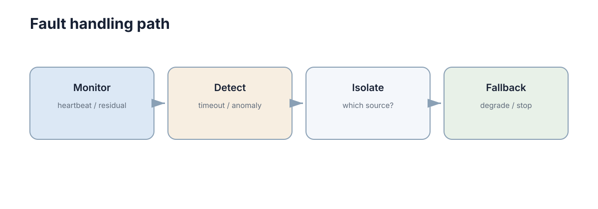

# Fault Detection & Fault Tolerance

> **Section:** Robustness & Safety

## Why it matters

故障处理至少包含检测、隔离、诊断和恢复，真正的系统设计还要明确降级模式和安全状态。

## Visual intuition

<figure markdown="span">
  
  <figcaption>容错必须从检测走到恢复和验证，而不只是打印一条错误日志。</figcaption>
</figure>

<figure markdown="span">
  
  <figcaption>检测到异常之后必须有动作：隔离、降级、停车或切换备份。</figcaption>
</figure>

## Core ideas

- **Detection**：发现行为偏离正常范围。
- **Isolation**：定位故障来源。
- **Redundancy**：用替代部件/信息源继续工作。
- **Recovery**：恢复正常或进入安全状态。

## Key theory

故障处理必须区分“异常数据”与“模块真的失效”。传感器冲突时，可通过一致性检查、物理约束和冗余信息判断，而不是简单多数投票。

## Representative methods

- Watchdog / heartbeat。
- Residual-based detection。
- Fallback sensor / safe stop。

## Minimal code

watchdog 的核心判断很简单；真正重要的是超时后执行什么安全动作。

```python
import time

def stale(last_update, timeout=0.5):
    return time.monotonic() - last_update > timeout

if stale(last_update=time.monotonic() - 1.0):
    mode = "SAFE_STOP"
```

## Worked example

编码器速度突然跳到 100 m/s，而 IMU/LiDAR 都不支持这一变化，可先标记编码器异常并限制其权重，再进入降级模式。

## Connections

- → Distributed Systems / Fault Tolerance。
- → Robotics / Sensor Fusion。

## Further Reading

- Fault diagnosis、reconfigurable control。

> 这一部分不属于主学习路径；需要做论文、项目或深入证明时再回来查。

## Learning path

[← Section overview](index.md) · [← Safety Constraints](03-safety-constraints.md) · [Safe Learning & Runtime Safety →](05-safe-learning-runtime.md)
