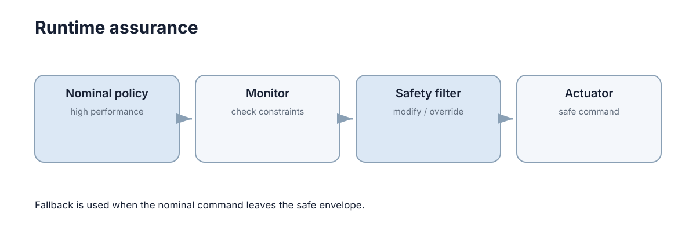

# Safe Learning & Runtime Safety

> **Section:** Robustness & Safety

## Why it matters

训练阶段的安全约束不能替代运行时保护。关键系统通常还需要独立监控、过滤或接管机制。

## Visual intuition

<figure markdown="span">
  
  <figcaption>关键系统可在高性能策略之外增加独立监控和安全过滤层。</figcaption>
</figure>

## Core ideas

- **Offline validation**：上线前覆盖关键场景。
- **Runtime monitor**：运行时检查状态与输出。
- **Shield / safety layer**：阻止明显不安全动作。
- **Fallback policy**：异常时切换到已验证行为。

## Key theory

安全学习系统通常需要分层：**学习策略负责性能，运行时保护层负责最后边界**。保护层本身也必须验证，不能因为有“安全模块”就认为系统自动安全。

## Representative methods

- Physical limits + runtime constraint check。
- Fallback / emergency stop：越界或不确定时进入已知安全行为。

## Minimal code

真实运行时安全过滤器通常还会检查状态约束、碰撞距离或控制屏障函数；限幅只是最简单的结构示例。

```python
def safety_filter(command, min_cmd, max_cmd):
    return max(min(command, max_cmd), min_cmd)

nominal = 1.4
safe = safety_filter(nominal, -0.8, 0.8)
```

## Worked example

学习策略给出高速穿越狭窄区域的动作，runtime safety layer 检测预测碰撞风险后拒绝该动作并触发减速。

## Connections

- → Human-AI Interaction / Intervention。
- → Sim2Real / staged validation。

## Further Reading

- Formal verification of neural policies、runtime assurance architectures。

> 这一部分不属于主学习路径；需要做论文、项目或深入证明时再回来查。

## Learning path

[← Section overview](index.md) · [← Fault Detection & Fault Tolerance](04-fault-tolerance.md)
